# ADR 0001 — Contact and Party Data Model

- **Status:** Accepted (2026-04-17)
- **Date:** 2026-04-17
- **Deciders:** @scaphilo, @Hacont

### Decision log

- **2026-04-17 — Accepted.** @scaphilo and @Hacont agreed to this direction, with the explicit
  guidance: *standardize wherever possible*. Concretely this means the **UBL 2.3 `Party`
  vocabulary** is authoritative for naming and structure, per §2 and §3 of this document.
  Implementation tracked under issue #198; phased rollout per §6.
- **Relates to:**
  - GitHub issue [KoalixSwitzerland/koalixcrm#198](https://github.com/KoalixSwitzerland/koalixcrm/issues/198) — "Reorganize the contact management"
  - `koalixcrm/PLAN_commercial_document_ubl_alignment.md` — explicitly defers the
    "Introduce `Party` abstraction" RFC to a separate document. **This is that document.**

---

## 1. Context

`koalixcrm.contacts` today models people and companies with a design that has accumulated problems
over many years. Concrete shape in the repo (`koalixcrm/contacts/models/`):

- `Contact` — base model. Semantically stands for an **organization-like entity** (it is what
  `Customer`/`Supplier` inherit from, and what addresses and calls are attached to).
- `Customer(Contact)`, `Supplier(Contact)` — multi-table-inheritance (MTI) subclasses.
  A party can therefore be **either** a customer **or** a supplier, never both cleanly.
- `Person` — a natural person. Has its own `email` and `phone` fields (duplicating
  `EmailAddressForContact` / `PhoneAddressForContact`) and a many-to-many back to `Contact`
  via `ContactPersonAssociation`.
- `PostalAddressForContact`, `EmailAddressForContact`, `PhoneAddressForContact` — concrete-table
  inheritance of the base address types, each with a **hard FK to `Contact`** (the field is
  confusingly named `person`).
- External FKs that pin the current names in place:
  - `contracts.Contract.default_customer → contacts.Customer`
  - `contracts.CommercialDocument.customer → contacts.Customer`
  - `products.*` migrations referencing `contacts.CustomerGroup`

Issue #198 (filed 2018, still open) calls for:

> **Contacts** = private persons, **Organizations** = legal persons, contacts can work for
> organizations with a hierarchical position, organizations can relate to organizations,
> and **addresses must be linked — not hard-referenced**.

### Problems with the current design

1. **Inverted terminology** vs. every mainstream CRM and vs. e-invoicing standards: our `Contact`
   is effectively an organization, while our `Person` is what the rest of the world calls a contact.
2. **Rigid role modeling.** Customer and Supplier are subclasses, so a party that plays both roles
   (a customer who is also a subcontractor — routine in consulting businesses) cannot be represented
   without duplicate records.
3. **Hard address reference.** `PostalAddressForContact` is physically bound to a single `Contact`
   row. Shared addresses, address history, and deduplication are impossible.
4. **Duplicate contact information** between `Person.email` / `Person.phone` and
   `EmailAddressForContact` / `PhoneAddressForContact`.
5. **No standards alignment.** The project is explicitly moving toward **UBL 2.3** for commercial
   documents. UBL speaks `Party`, `PartyLegalEntity`, `Person`, `Contact`, `PostalAddress`. Every
   serialization into/out of UBL currently needs a translation layer because our domain model
   disagrees with UBL's on what those words mean.
6. **GDPR friction.** Obligations (right to erasure, consent, data minimization) apply to natural
   persons, not legal persons. Splitting them cleanly is a prerequisite for tractable GDPR tooling.

---

## 2. Is there a standard for modelling contacts in a CRM?

Short answer: **yes — several complementary ones, and they all converge on the same shape.**

| Standard / source | Domain | Core concepts it defines |
|---|---|---|
| **OASIS UBL 2.3** — Universal Business Language | business documents, e-invoicing (Peppol, EN 16931) | `Party`, `PartyLegalEntity`, `PartyTaxScheme`, `PartyName`, `PartyIdentification`, `Person`, `Contact` (= person at a party), `PostalAddress` |
| **OASIS CIQ v3** — Customer Information Quality | customer master data | `Party`, `Person`, `Organization`, `Address`, `PartyRelationship` |
| **ISO 20022** | financial messaging | `PartyIdentification`, `OrganisationIdentification` vs `PrivateIdentification` (natural person) |
| **RFC 6350 — vCard 4.0** | individual contact cards | structured name, `TEL`, `ADR`, `EMAIL`, `ORG`, `TITLE` |
| **Martin Fowler — Analysis Patterns (1997)** | OO analysis | "Party" pattern: Person and Organization as subtypes of Party; "Party Role" |
| **Len Silverston — The Data Model Resource Book, vol. 1** | enterprise data modeling | Party, PartyRole, PartyRelationship, ContactMechanism |
| **Salesforce / HubSpot / Microsoft Dynamics** (de facto industry) | CRM product data models | `Account` (organization) + `Contact` (person at account) + `Lead` |

All of these land on the **same four ideas**:

1. **`Party`** is the common supertype. Everything else (Person, Organization) is a kind of Party.
2. **Role is separate from identity.** Being a customer or a supplier is a *role* a party plays
   over a time window — not a permanent subtype.
3. **Contact mechanisms** (address, phone, email) are **independent entities** associated to a
   party through a loose link that carries purpose and validity.
4. **Relationships between parties** (employment, parent-subsidiary, partnership) are first-class
   entities with their own attributes and validity.

This cluster of ideas is usually just called **the Party pattern**.

### Decisive standard for this project: UBL 2.3

Because `koalixcrm` is explicitly migrating commercial documents to UBL 2.3, UBL's Party model is
the binding reference. The UBL 2.3 structure for a commercial party reads, schematically:

```
Party
├── PartyIdentification     (1..n)     — external IDs (GLN, IBAN, DUNS, internal)
├── PartyName               (0..n)
├── PostalAddress           (0..1)     — we will promote this to (0..n) via purpose
├── PhysicalLocation        (0..1)
├── PartyTaxScheme          (0..n)     — VAT/UID numbers per scheme
├── PartyLegalEntity        (0..n)     — legal form, registration name/nr
├── Contact                 (0..1)     — **person at the party** (name, phone, email)
└── Person                  (0..1)     — alternate natural-person representation
```

Note the UBL terminology: `Party` is the supertype, `Contact` is the *person at a party*. This is
exactly the reframing issue #198 proposes. Adopting the UBL vocabulary locally gives us both the
internal cleanup and a zero-translation mapping to UBL XML/JSON.

---

## 3. Decision

Adopt the **Party pattern, UBL-aligned**, with the following concrete model.

### 3.1 Terminology (authoritative from this ADR forward)

| Concept | Name in code | Notes |
|---|---|---|
| Common supertype | **`Party`** | Replaces today's `Contact`. Concrete Django model (needed as stable FK target). |
| Legal person | **`Organization(Party)`** | AG, GmbH, Verein, Stiftung, Holding, Einzelfirma, public body, … |
| Natural person | **`Contact(Party)`** | The "private person" of issue #198. Matches UBL 2.3 "Contact"/"Person". |
| Role on a party | **`PartyRole`** | customer, supplier, lead, prospect, employee, partner, bank, authority |
| Employment / affiliation | **`OrganizationMembership`** | Contact × Organization, with title, position, is_primary, validity |
| Org-to-org relation | **`OrganizationRelationship`** | parent_of, subsidiary_of, partner_of, franchise_of, … |
| Postal address | **`Address`** | standalone; deduplication is possible but not required initially |
| Address use | **`AddressAssignment`** | Party × Address, purpose, validity |
| Phone | **`PhoneNumber`** + **`PhoneAssignment`** | same pattern |
| Email | **`EmailAddress`** + **`EmailAssignment`** | same pattern |

### 3.2 Key modeling rules

1. **External FKs point at `Party`, not at a role.** `Contract.buyer`, `CommercialDocument.party`,
   etc. reference `Party`. A separate assertion / admin validation ensures the referenced party
   has an active `PartyRole` of the appropriate kind at the document's effective date. This avoids
   recreating the current rigidity and preserves referential integrity across role changes.
2. **`Customer` and `Supplier` classes are removed.** They become `PartyRole.role_type` values.
   Migration must preserve any data that depended on them (see §6).
3. **Addresses are loose references.** `AddressAssignment` carries `(party, address, purpose,
   valid_from, valid_to)`. Today's hard-FK `PostalAddressForContact` rows are migrated into
   `Address` + `AddressAssignment` pairs.
4. **GDPR affordances live on `Contact` only.** Consent timestamps, erasure/anonymization
   helpers, and data-subject-request tooling target `Contact`, never `Organization`.
5. **Identity stability.** `Party.id` is the long-lived business key for anything document-facing.
   A natural person changing employer, name, or role keeps their `Party.id`.
6. **`CustomerGroup` survives but is renamed.** It becomes `PartyGroup` with an optional
   `role_type_scope` so you can model "customers in segment A" without affecting suppliers.

### 3.3 Out of scope for this ADR

- Duplicate detection / merge UX. (Needed, tracked separately.)
- Consent banner / data-subject-request UI. (GDPR tooling PR, later.)
- Mass import from external CRMs. (Needed at go-live, tracked separately.)
- Party identification schemes beyond internal id + VAT/UID. GLN, DUNS, LEI can be added under the
  same `PartyIdentification` side-table without re-modeling.

---

## 4. ERD (target state)

Rendered Mermaid. Attributes abbreviated; audit fields omitted for readability.

```mermaid
erDiagram
    PARTY {
        bigint id PK
        string display_name
        string default_language
        datetime created_at
        datetime updated_at
    }
    ORGANIZATION {
        bigint party_id PK "FK to PARTY.id"
        string legal_form "AG/GmbH/Verein/..."
        string legal_name
        string registration_number
        string legal_seat_country
    }
    CONTACT {
        bigint party_id PK "FK to PARTY.id"
        string prefix
        string given_name
        string family_name
        date date_of_birth
        date gdpr_consent_date
    }
    PARTY_IDENTIFICATION {
        bigint id PK
        bigint party_id FK
        string scheme "VAT, UID, GLN, DUNS, LEI, internal"
        string value
        date valid_from
        date valid_to
    }
    PARTY_ROLE {
        bigint id PK
        bigint party_id FK
        string role_type "customer|supplier|lead|prospect|employee|partner"
        date valid_from
        date valid_to
        bool is_primary
    }
    PARTY_GROUP {
        bigint id PK
        string name
        string role_type_scope "nullable; limits membership to a role"
    }
    PARTY_GROUP_MEMBERSHIP {
        bigint id PK
        bigint party_id FK
        bigint party_group_id FK
    }
    ORGANIZATION_MEMBERSHIP {
        bigint id PK
        bigint contact_party_id FK
        bigint organization_party_id FK
        string title
        string position
        bool is_primary
        date valid_from
        date valid_to
    }
    ORGANIZATION_RELATIONSHIP {
        bigint id PK
        bigint parent_party_id FK
        bigint child_party_id FK
        string relationship_type "parent_of|partner_of|franchise_of"
        date valid_from
        date valid_to
    }
    ADDRESS {
        bigint id PK
        string address_line_1
        string address_line_2
        string zip_code
        string town
        string state
        string country
        string subdivision_code
    }
    ADDRESS_ASSIGNMENT {
        bigint id PK
        bigint party_id FK
        bigint address_id FK
        string purpose "billing|shipping|legal|visit"
        bool is_primary
        date valid_from
        date valid_to
    }
    PHONE_NUMBER {
        bigint id PK
        string phone_e164
    }
    PHONE_ASSIGNMENT {
        bigint id PK
        bigint party_id FK
        bigint phone_id FK
        string purpose
        bool is_primary
        date valid_from
        date valid_to
    }
    EMAIL_ADDRESS {
        bigint id PK
        string email
    }
    EMAIL_ASSIGNMENT {
        bigint id PK
        bigint party_id FK
        bigint email_id FK
        string purpose
        bool is_primary
        date valid_from
        date valid_to
    }
    CONTRACT {
        bigint id PK
        bigint buyer_party_id FK "FK to PARTY.id"
        bigint seller_party_id FK "FK to PARTY.id"
    }
    COMMERCIAL_DOCUMENT {
        bigint id PK
        bigint party_id FK "FK to PARTY.id"
    }

    PARTY ||--o| ORGANIZATION                : "is-a"
    PARTY ||--o| CONTACT                     : "is-a"
    PARTY ||--o{ PARTY_IDENTIFICATION        : "has"
    PARTY ||--o{ PARTY_ROLE                  : "plays"
    PARTY ||--o{ PARTY_GROUP_MEMBERSHIP      : "member-of"
    PARTY_GROUP ||--o{ PARTY_GROUP_MEMBERSHIP: "contains"
    CONTACT ||--o{ ORGANIZATION_MEMBERSHIP   : "works-at"
    ORGANIZATION ||--o{ ORGANIZATION_MEMBERSHIP     : "employs"
    ORGANIZATION ||--o{ ORGANIZATION_RELATIONSHIP   : "parent-side"
    ORGANIZATION ||--o{ ORGANIZATION_RELATIONSHIP   : "child-side"
    PARTY ||--o{ ADDRESS_ASSIGNMENT          : "has"
    ADDRESS ||--o{ ADDRESS_ASSIGNMENT        : "used-by"
    PARTY ||--o{ PHONE_ASSIGNMENT            : "has"
    PHONE_NUMBER ||--o{ PHONE_ASSIGNMENT     : "used-by"
    PARTY ||--o{ EMAIL_ASSIGNMENT            : "has"
    EMAIL_ADDRESS ||--o{ EMAIL_ASSIGNMENT    : "used-by"
    CONTRACT }o--|| PARTY                    : "buyer/seller"
    COMMERCIAL_DOCUMENT }o--|| PARTY         : "party"
```



### 4.1 Mapping to UBL 2.3

| UBL 2.3 element | Our model |
|---|---|
| `cac:Party` | `Party` |
| `cac:Party/cac:PartyIdentification` | `PartyIdentification` (scheme + value) |
| `cac:Party/cac:PartyName` | `Party.display_name` (plus `Organization.legal_name` where applicable) |
| `cac:Party/cac:PartyLegalEntity` | `Organization` |
| `cac:Party/cac:PartyTaxScheme` | `PartyIdentification` with `scheme='VAT'` (or `'UID'` in CH) |
| `cac:Party/cac:PostalAddress` | via `AddressAssignment.purpose='legal'` |
| `cac:Party/cac:Contact` | the linked `Contact` through `OrganizationMembership.is_primary=true` |
| `cac:Party/cac:Person` | `Contact` |

### 4.2 Mapping from today's model

| Today | Target |
|---|---|
| `contacts.Contact` (organization-like) | `Party` + `Organization` rows |
| `contacts.Customer` | `Party` + `Organization` or `Contact` + `PartyRole(role_type='customer')` |
| `contacts.Supplier` | `Party` + `Organization` + `PartyRole(role_type='supplier')` |
| `contacts.Person` | `Party` + `Contact` |
| `ContactPersonAssociation` | `OrganizationMembership` |
| `PostalAddressForContact` | `Address` + `AddressAssignment(purpose=…)` |
| `EmailAddressForContact` + `Person.email` | `EmailAddress` + `EmailAssignment` (deduplicated) |
| `PhoneAddressForContact` + `Person.phone` | `PhoneNumber` + `PhoneAssignment` (deduplicated) |
| `CustomerGroup` | `PartyGroup(role_type_scope='customer')` |

---

## 5. Alternatives considered

1. **Literal rename per issue #198.** Rename `Contact` → `Organization`, `Person` → `Contact`,
   leave `Customer`/`Supplier` as MTI subclasses, leave addresses hard-bound.
   *Rejected.* Addresses the terminology only; leaves the role rigidity and address coupling that
   motivated the issue in the first place.
2. **Single-table inheritance with a `kind` discriminator** (`Party.kind ∈ {person, org}` with
   person- and org-specific fields nullable on one table).
   *Rejected.* Fields diverge too much (date_of_birth vs. registration_number); Django ergonomics
   are poor; admin and serializers become conditional everywhere.
3. **Keep `Customer`/`Supplier` as Django models next to the new `PartyRole`** for a quieter
   migration.
   *Rejected for steady state* (accepted as a transitional step in §6). Steady state must have a
   single source of truth for "what role does this party play".
4. **Graph-style Party/Relationship like Silverston.** Every link is a `PartyRelationship(from,
   to, type)` row, including employment and address usage.
   *Rejected.* Too abstract for a Django CRM; loses the schema-level guarantees that
   `OrganizationMembership` gives us (e.g. that the "to" side is actually an Organization).
5. **Do nothing; keep translating at UBL export boundary.**
   *Rejected.* The translation layer grows with every new e-invoicing jurisdiction. We already pay
   for the current naming in cognitive overhead on every review of contacts code.

---

## 6. Rollout plan (phased; no big-bang)

1. **Phase 0 — ADR & alignment.** This document; review with @scaphilo / @Hacont; converge before
   writing code. Split issue #198 into four tracking sub-issues (one per phase below).
2. **Phase 1 — additive schema.** Add `Party`, `Organization`, `Contact`, `PartyRole`,
   `PartyIdentification`, `OrganizationMembership`, `OrganizationRelationship`, `Address`,
   `AddressAssignment`, `PhoneNumber`, `PhoneAssignment`, `EmailAddress`, `EmailAssignment`,
   `PartyGroup`, `PartyGroupMembership`. No removals, no FK changes. Old and new models coexist.
3. **Phase 2 — data migration.** Data migration (`RunPython`) to:
   - promote every `contacts.Contact` row into a `Party` + `Organization` row,
   - promote every `contacts.Person` row into a `Party` + `Contact` row (deduplicating by email),
   - convert `Customer`/`Supplier` subclass-rows into `PartyRole` rows,
   - convert `PostalAddressForContact` / `EmailAddressForContact` / `PhoneAddressForContact` into
     standalone + assignment pairs,
   - convert `ContactPersonAssociation` into `OrganizationMembership`.
   Write the migration to be **idempotent and reversible**; add a management command that
   re-runs the diff for reconciliation.
4. **Phase 3 — rewire FKs.**
   - `contracts.Contract.default_customer` → `buyer_party` FK to `Party` (+ admin validation that
     the party has an active `customer` role at the contract's effective date).
   - `contracts.CommercialDocument.customer` → `party` FK to `Party`.
   - `products.*` FKs to `contacts.CustomerGroup` → `PartyGroup`.
   - Update admin, DRF serializers, PDF templates, factory / test fixtures.
   - Keep the legacy FK fields as nullable shadows for one release for rollback safety.
5. **Phase 4 — cleanup.** Drop legacy tables (`crm_contact`, `crm_customer`, `crm_supplier`,
   `crm_person`, `crm_contactpersonassociation`, `crm_postaladdressforcontact`, …). Remove the
   shadow FK fields. Remove the duplicated `Person.email` / `Person.phone` columns (gone by virtue
   of dropping `Person`).

Phases 1–2 can ship within a single release cycle. Phase 3 is the hot phase (touches invoicing);
ship it as its own release with a data migration dry-run on a production-sized dataset first.
Phase 4 is cosmetic and can wait a release behind Phase 3.

---

## 7. Consequences

### Positive

- Naming matches UBL 2.3, Peppol, EN 16931, and every mainstream CRM; onboarding and
  e-invoicing integration get cheaper.
- A party can be customer and supplier simultaneously without duplicate records.
- Address / phone / email get deduplication and history for free.
- GDPR tooling has a clean target (`Contact`) to operate on.
- Organization hierarchies and cross-company relationships become queryable, not string-encoded.

### Negative

- Large blast radius: touches `contracts`, `products`, `accounting`, admin, DRF serializers, PDF
  templates, API DTOs, factories, tests. Phased rollout is mandatory.
- Data migration risk — no production data may be lost in Phase 2. Dry-runs and row-count
  invariants are non-negotiable.
- Short-term duplication: during Phases 1–3 the codebase has two contact stacks. Reviewers must
  know which is authoritative at each phase.

### Neutral

- The `Customer` and `Supplier` identities still exist semantically, just as roles. Downstream
  reports and dashboards need trivial rewiring but no conceptual change.
- Public REST endpoints gain new resources (`parties`, `organizations`, `contacts`). Legacy
  `/customers` and `/suppliers` endpoints can be kept as read-only views for a deprecation period.

---

## 8. Open questions

1. **`Party.display_name` — derived or stored?** Storing simplifies lists and admin; deriving
   avoids drift when a contact's family name changes. *Proposal:* stored, maintained by signal,
   with a management command to re-derive on demand.
2. **Should `PartyIdentification` include internal numbering** (e.g. the existing customer number)
   or is that only on document-facing models?
3. **Do we expose `PartyRole` in the REST API** or keep it admin-only in v1?
4. **Soft delete vs. anonymize** for `Contact` under GDPR erasure — does the accounting trail
   require the row to survive in anonymized form? (Almost certainly yes under CH OR art. 958f —
   verify with @scaphilo.)
5. **Minimum viable identification schemes at go-live** — internal id, VAT/UID, IBAN? LEI only if
   a user asks for it?

---

## 9. References

- OASIS UBL 2.3 — [docs.oasis-open.org/ubl/os-UBL-2.3/UBL-2.3.html](https://docs.oasis-open.org/ubl/os-UBL-2.3/UBL-2.3.html)
- EN 16931 (European e-invoicing semantic model)
- OASIS CIQ v3 — Customer Information Quality
- ISO 20022 — PartyIdentification types
- RFC 6350 — vCard 4.0
- Martin Fowler, *Analysis Patterns*, 1997 — Chapter "Accountability" / Party pattern
- Len Silverston, *The Data Model Resource Book*, Vol. 1, 3rd ed. — Chapters on Party, Party Role,
  Party Relationship, Contact Mechanism
- `koalixcrm/PLAN_commercial_document_ubl_alignment.md` — sibling plan; this ADR fills its
  deferred "Party abstraction" slot.
