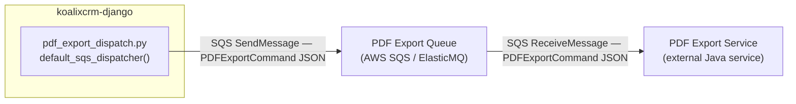
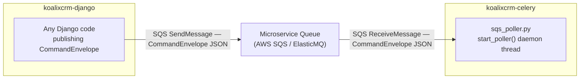
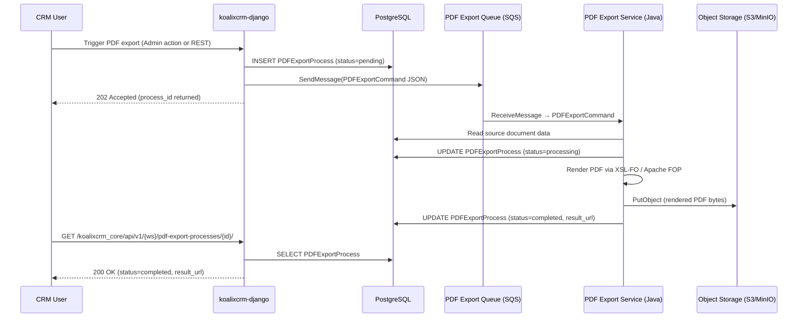
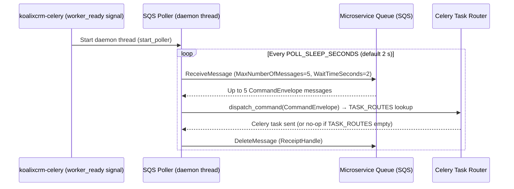

# Async Interface Specifications (SQS / Event-Driven)

## Interface Overview

- **Name and Identification**: koalixcrm Async Command Interface, version 1.0.0
- **Purpose**: Provides event-driven, queue-mediated communication between the `koalixcrm-django`
  container and external asynchronous consumers. Two separate SQS queues exist:
  1. **PDF Export Queue** — Django publishes `PDFExportCommand` messages; an external Java PDF export
     service consumes them.
  2. **Microservice Queue** — carries generic `CommandEnvelope` messages consumed by the
     `koalixcrm-celery` worker's daemon-thread SQS poller.
- **Scope**: The async interface is bounded by the `koalixcrm-django` container (publisher) and two
  external consumers: the Java PDF export service and the Celery worker. The contracts between
  publisher and consumers are defined by the message schemas in `koalixcrm_mq_commands/`.

## Interface Context

- **Related Use Cases**: Asynchronous PDF generation — a CRM user triggers PDF export from the
  Django Admin or a REST action; Django publishes the command and returns immediately; the external
  Java service renders the PDF and writes the result to S3.
- **Architecture Positioning**: The async interface is the event-driven offload layer of the modular
  monolith. The architecture is documented in
  [QQ_SD_ServiceArchitecture.md](../05_building_block_view/QQ_SD_ServiceArchitecture.md).
- **Dependencies**: AWS SQS (or ElasticMQ in development); `boto3` for publish; the consumer
  implements its own SQS `ReceiveMessage` polling loop.

### PDF Export Queue — Interface Context Diagram



### Microservice Queue — Interface Context Diagram



## Message Schemas

### PDFExportCommand

Published by `koalixcrm/core/pdf_export_dispatch.py::default_sqs_dispatcher()` to the PDF Export
Queue. Consumed by the external Java PDF export service.

**Source**: `koalixcrm_mq_commands/pdf_export_command.py`

The message body is a flat JSON object (not wrapped in a `CommandEnvelope`; the `type` field acts
as a discriminator):

```json
{
  "type": "PDFExportCommand",
  "payload": {
    "process_id": 42,
    "source_model": "Invoice",
    "source_id": 101,
    "template_set_id": 3,
    "printed_by_user_id": 7
  }
}
```

**Field definitions**:

| Field | Type | Description |
|---|---|---|
| `type` | `string`, constant `"PDFExportCommand"` | Message discriminator; the Java consumer validates this value before deserialization |
| `payload.process_id` | `integer` | Primary key of the `PDFExportProcess` record (table `crm_pdfexportprocess`); used by the consumer to update the lifecycle status |
| `payload.source_model` | `string` | Django model class name of the document to render. Valid values: `Invoice`, `Quotation`, `DespatchAdvice`, `SalesOrder`, `PurchaseOrder`, `CreditNote`, `PaymentReminder` |
| `payload.source_id` | `integer` | Primary key of the source document |
| `payload.template_set_id` | `integer` | Primary key of the `DocumentTemplate` record specifying the XSL-FO template to use |
| `payload.printed_by_user_id` | `integer` | Primary key of the Django `User` who triggered the export |

**PDFExportProcess lifecycle** (`koalixcrm/core/models/pdf_export_process.py`):

| Status | Set by |
|---|---|
| `pending` | Django on record creation (before SQS publish) |
| `processing` | External Java service on message receipt |
| `completed` | External Java service after successful S3 upload; sets `result_url` |
| `failed` | External Java service on error; sets `error_message` |

The Java service updates the `PDFExportProcess` record directly in the shared PostgreSQL database
or via the REST endpoint `PATCH /koalixcrm_core/api/v1/<workspace_id>/pdf-export-processes/<id>/`.

### CommandEnvelope

Consumed by `koalixcrm_microservices/sqs_poller.py` from the Microservice Queue. The dispatch table
(`TASK_ROUTES`) is currently empty — no Python-side Celery tasks exist after the PDF export workload
moved to the Java service.

**Source**: `koalixcrm_mq_commands/envelope.py`

```json
{
  "type": "SomeCommandType",
  "payload": {
    "key": "value"
  }
}
```

**Field definitions**:

| Field | Type | Description |
|---|---|---|
| `type` | `string` | Command type discriminator; matched against `TASK_ROUTES` in `sqs_poller.py` |
| `payload` | `object` | Arbitrary JSON payload; structure is command-type-specific |

Messages with unknown `type` values are logged and acknowledged (deleted from the queue) without
error — the poller does not dead-letter unrecognized command types.

## Sequence: PDF Export Async Flow



## Sequence: Microservice Queue Poll Cycle



## Configuration and Environment Variables

| Variable | Consumer | Purpose |
|---|---|---|
| `CELERY_BROKER_URL` | `celery_app.py` | SQS broker URL (`sqs://…`) for Celery task queue |
| `CELERY_RESULT_BACKEND` | `celery_app.py` | Result backend URL |
| `CELERY_SQS` | `celery_app.py` | Default Celery task queue name |
| `KOALIXCRM_MICROSERVICE_SQS` | `sqs_poller.py` | Queue name polled for `CommandEnvelope` messages |
| `SQS_ENDPOINT_URL` | `celery_app.py`, `aws_clients` | If set, overrides SQS to local ElasticMQ endpoint (development only) |
| `ENABLE_SQS_POLLER` | `celery_app.py` | Set to `false` to disable the daemon poller thread; default `true` |
| `POLL_SLEEP_SECONDS` | `sqs_poller.py` | Idle sleep between poll cycles (default `2` s) |
| `KOALIXCRM_PDF_EXPORT_DISPATCHER` | `pdf_export_dispatch.py` | Dotted-path override for the PDF export dispatcher callable; default `koalixcrm.core.pdf_export_dispatch.default_sqs_dispatcher` |
| `AWS_REGION` | `celery_app.py` | AWS region for SQS queue URL construction |
| `AWS_PROFILE` | `celery_app.py` | Named AWS profile for STS identity resolution (production) |

### Swappable Dispatcher

The PDF export dispatcher is resolved at call time via
`django.utils.module_loading.import_string`. Downstream forks (e.g. the WFS product) can override
it by setting:

```python
KOALIXCRM_PDF_EXPORT_DISPATCHER = "my_fork.dispatchers.custom_pdf_dispatcher"
```

The custom callable must accept a single `PDFExportCommand` argument and is responsible for
serialising and enqueuing it.

## Error Handling and Fault Tolerance

- **Poller resilience**: The `start_poller` loop catches all exceptions at the outer level; a failed
  poll cycle logs the error and sleeps before retrying — it never terminates the daemon thread.
- **Queue unavailability**: If `get_queue_url` fails (queue does not exist or network error), the
  poller logs the error, sleeps `POLL_SLEEP_SECONDS`, and retries.
- **Unparseable messages**: If a message body cannot be parsed as JSON, the poller logs a warning,
  marks the message as handled, and deletes it — messages are not retried or dead-lettered.
- **Unknown command types**: Messages with `type` values not present in `TASK_ROUTES` are logged at
  INFO level and deleted. No dead-letter queue is configured on the Django side.
- **SQS visibility timeout**: The poller sets `VisibilityTimeout=60` seconds per batch. If the
  worker crashes mid-batch, SQS re-delivers the message after 60 seconds.

## Security Considerations

- The SQS queues are accessed via `boto3` using the AWS profile (`AWS_PROFILE`) or instance role;
  no queue credentials are stored in the application code.
- In the development environment, ElasticMQ is used in place of AWS SQS (`SQS_ENDPOINT_URL`). The
  account ID is hardcoded to `000000000000` in that mode (`celery_app.py`).
- Message payloads are not signed or encrypted at the application layer; integrity is provided by
  the SQS transport's HTTPS channel and IAM queue policies.
- The `PDFExportCommand` contains only surrogate IDs (no PII or document content). The Java consumer
  re-fetches source data from the shared database using those IDs.

## Machine-Readable Specification

The SQS interface is event-driven (publish/subscribe over AWS SQS). The messages are JSON-formatted
and described above in terms of their Python dataclass definitions.

**Specification Format**: AsyncAPI 2.x would be the applicable standard; however, no pre-generated
AsyncAPI YAML file exists in the repository. The message schemas are fully defined by the Python
dataclasses in `koalixcrm_mq_commands/`:

| Message type | Source file |
|---|---|
| `PDFExportCommand` | `koalixcrm_mq_commands/pdf_export_command.py` |
| `CommandEnvelope` | `koalixcrm_mq_commands/envelope.py` |

To generate an AsyncAPI spec, the JSON schemas embedded above can be used as the message schema
definitions. Load the resulting YAML into [AsyncAPI Studio](https://studio.asyncapi.com/) for
interactive exploration.

## References

- Service architecture: [QQ_SD_ServiceArchitecture.md](../05_building_block_view/QQ_SD_ServiceArchitecture.md)
- Entry points: [QQ_SD_EntryPoints.md](QQ_SD_EntryPoints.md)
- REST interface (pdf-export-processes poll endpoint): [QQ_SD_Interface_REST_Specifications.md](QQ_SD_Interface_REST_Specifications.md)
- Message schema source: `koalixcrm_mq_commands/pdf_export_command.py`, `koalixcrm_mq_commands/envelope.py`
- Dispatcher: `koalixcrm/core/pdf_export_dispatch.py`
- SQS poller: `koalixcrm_microservices/sqs_poller.py`
- Celery app + worker_ready signal: `koalixcrm_microservices/celery_app.py`
- PDFExportProcess model: `koalixcrm/core/models/pdf_export_process.py`
