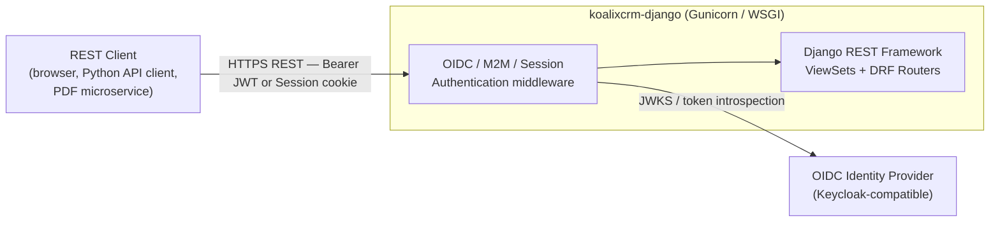
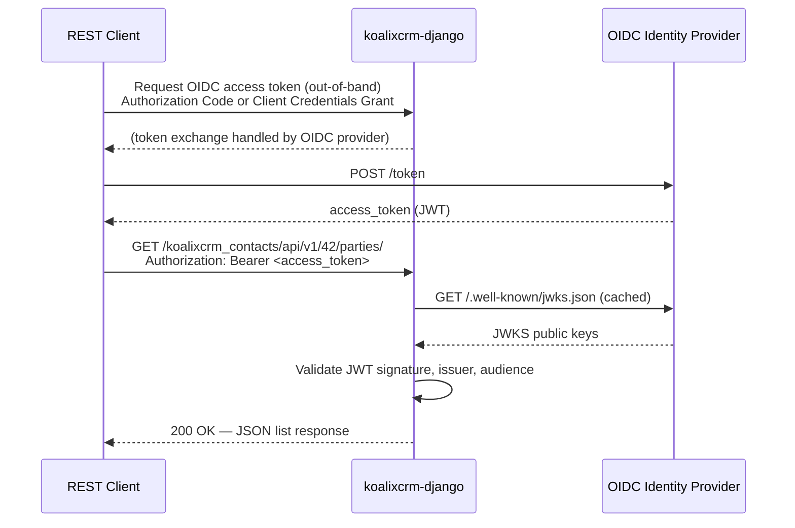

# REST API Interface Specifications

## Interface Overview

- **Name and Identification**: koalixcrm REST API, version 1.0.0
- **Purpose**: Provides workspace-scoped, versioned JSON REST endpoints covering all six business domains
  of the koalixcrm CRM platform (accounting, contacts, products, core, contracts, reporting). External
  REST clients — browser front-ends, hand-written Python API client libraries, and the Celery/PDF
  microservice — use these endpoints to create, read, update, and delete business records.
- **Scope**: All endpoints are served by the `koalixcrm-django` container via the Django/DRF WSGI
  stack. The URL routing contract is defined in `projectsettings/urls.py` and normalised by
  [QQ_IMPORT_docs-api-routing.md](QQ_IMPORT_docs-api-routing.md).

## Interface Context

- **Related Use Cases**: All CRM workflows — creating contacts, raising invoices, recording bookings,
  tracking projects — are backed by these endpoints.
- **Architecture Positioning**: The REST API is the primary synchronous boundary of the modular monolith.
  It sits between external REST clients and the Django app layer. The architecture is documented in
  [QQ_SD_ServiceArchitecture.md](../05_building_block_view/QQ_SD_ServiceArchitecture.md).
- **Dependencies**: Django ORM / PostgreSQL for persistence; OIDC Identity Provider for token
  validation; `drf-spectacular` for schema generation.
- **Interface Context Diagram**



## Authentication and Authorization

### Authentication Schemes

All REST endpoints are protected by `IsAuthenticated`. The DRF `DEFAULT_AUTHENTICATION_CLASSES`
stack (declared in `projectsettings/settings/base_settings.py`) is evaluated in order:

| Priority | Class | Mechanism | Typical Caller |
|---|---|---|---|
| 1 | `CeleryWorkerM2MAuthentication` | Bearer JWT — OAuth 2.0 Client Credentials Grant; issuer `CELERY_WORKER_M2M_OIDC_ISSUER`, client matched by `azp` or `client_id` claim | Celery worker, PDF export service |
| 2 | `OIDCAccessTokenAuthentication` | Bearer JWT — OIDC authorization-code access token; issuer `OIDC_ISSUER`, audience validated against `OIDC_ACCEPTED_AUDIENCES` | Browser-based front-end, human REST clients |
| 3 | `SessionAuthentication` | Django session cookie | Django Admin UI back-end calls |
| 4 | `BasicAuthentication` | HTTP Basic (username / password) | Development / testing only |

Both JWT authenticators are documented as OpenAPI `http/bearer/JWT` security schemes via
`koalixcrm/auth/openapi_extensions.py`. Unauthenticated requests receive `401 Unauthorized`.

### Authorization

Model-level permissions (`ModelPermissionsWithListView`) are enforced on ViewSets that declare it.
The base permission is `IsAuthenticated` across all endpoints.

## URL Shape

The routing contract is defined by [CR-002](QQ_IMPORT_docs-api-routing.md) and implemented in
`projectsettings/urls.py`:

```text
/<koalixcrm_app>/api/v1/<workspace_id>/<resource>/
/<koalixcrm_app>/api/v1/<workspace_id>/<resource>/<pk>/
/<koalixcrm_app>/api/v1/_batch/<operation>/        # workspace-independent
/<koalixcrm_app>/api/schema/v1/                    # OpenAPI JSON/YAML schema
/<koalixcrm_app>/api/swagger/v1/                   # Swagger UI
/<koalixcrm_app>/api/redoc/v1/                     # Redoc UI
```

Rules:

1. `<koalixcrm_app>` is always `koalixcrm_<appname>` — the prefix prevents collision when mounted
   alongside WFS apps.
2. `/api/v1/` is mandatory; there are no unversioned resources.
3. `<workspace_id>` is a required path integer for every workspace-scoped resource. As of the current
   implementation (pre-CR-9), ViewSets accept and capture `workspace_id` but data-level filtering has
   not yet been applied — see [QQ_IMPORT_docs-api-routing.md](QQ_IMPORT_docs-api-routing.md).
4. Resource segments are kebab-case.
5. Each app owns its own OpenAPI schema triplet (schema, Swagger UI, Redoc UI).

## Data Format

- **Content-Type**: `application/json` for all request and response bodies.
- **Pagination**: DRF `DefaultRouter` standard — list responses use the DRF page format
  (`count`, `next`, `previous`, `results[]`). No explicit pagination class is configured globally,
  so the DRF default (unpaginated) applies unless a ViewSet overrides it.
- **CRUD methods**: Standard DRF `ModelViewSet` semantics — `GET` (list + retrieve), `POST` (create),
  `PUT` / `PATCH` (update), `DELETE` (destroy). Individual ViewSets may restrict the allowed methods
  (e.g. `PDFExportProcessViewSet` allows only `GET` and `PATCH`).

## Per-App REST Resources

### Accounting API

**URL prefix**: `/koalixcrm_accounting/api/v1/<workspace_id>/`
**Source**: `koalixcrm/accounting/urls.py`, ViewSets from `koalixcrm/accounting_api_py/accounting_api.py`
**OpenAPI schema**: `/koalixcrm_accounting/api/schema/v1/`

| Resource segment | ViewSet | Standard operations |
|---|---|---|
| `accounts/` | `AccountViewSet` | list, retrieve, create, update, partial_update, destroy |
| `accounting-periods/` | `AccountingPeriodViewSet` | list, retrieve, create, update, partial_update, destroy |
| `bookings/` | `BookingViewSet` | list, retrieve, create, update, partial_update, destroy |
| `product-categories/` | `ProductCategoryViewSet` | list, retrieve, create, update, partial_update, destroy |

### Contacts API

**URL prefix**: `/koalixcrm_contacts/api/v1/<workspace_id>/`
**Source**: `koalixcrm/contacts/urls.py`, ViewSets from `koalixcrm/contacts_api_py/contacts_api.py`
**OpenAPI schema**: `/koalixcrm_contacts/api/schema/v1/`

| Resource segment | ViewSet | Standard operations |
|---|---|---|
| `customer-billing-cycles/` | `CustomerBillingCycleViewSet` | list, retrieve, create, update, partial_update, destroy |
| `parties/` | `PartyViewSet` | list, retrieve, create, update, partial_update, destroy |
| `organizations/` | `OrganizationViewSet` | list, retrieve, create, update, partial_update, destroy |
| `party-contacts/` | `PartyContactViewSet` | list, retrieve, create, update, partial_update, destroy |
| `party-identifications/` | `PartyIdentificationViewSet` | list, retrieve, create, update, partial_update, destroy |
| `party-roles/` | `PartyRoleViewSet` | list, retrieve, create, update, partial_update, destroy |
| `organization-memberships/` | `OrganizationMembershipViewSet` | list, retrieve, create, update, partial_update, destroy |
| `organization-relationships/` | `OrganizationRelationshipViewSet` | list, retrieve, create, update, partial_update, destroy |
| `addresses/` | `AddressViewSet` | list, retrieve, create, update, partial_update, destroy |
| `address-assignments/` | `AddressAssignmentViewSet` | list, retrieve, create, update, partial_update, destroy |
| `phone-numbers/` | `PhoneNumberViewSet` | list, retrieve, create, update, partial_update, destroy |
| `phone-assignments/` | `PhoneAssignmentViewSet` | list, retrieve, create, update, partial_update, destroy |
| `party-emails/` | `PartyEmailViewSet` | list, retrieve, create, update, partial_update, destroy |
| `email-assignments/` | `EmailAssignmentViewSet` | list, retrieve, create, update, partial_update, destroy |
| `party-groups/` | `PartyGroupViewSet` | list, retrieve, create, update, partial_update, destroy |
| `party-group-memberships/` | `PartyGroupMembershipViewSet` | list, retrieve, create, update, partial_update, destroy |

### Products API

**URL prefix**: `/koalixcrm_products/api/v1/<workspace_id>/`
**Source**: `koalixcrm/products/urls.py`, ViewSets from `koalixcrm/products_api_py/products_api.py`
**OpenAPI schema**: `/koalixcrm_products/api/schema/v1/`

| Resource segment | ViewSet | Standard operations |
|---|---|---|
| `products/` | `ProductTypeViewSet` | list, retrieve, create, update, partial_update, destroy |
| `product-items/` | `ProductViewSet` | list, retrieve, create, update, partial_update, destroy |
| `product-prices/` | `ProductPriceViewSet` | list, retrieve, create, update, partial_update, destroy |
| `customer-group-transforms/` | `CustomerGroupTransformViewSet` | list, retrieve, create, update, partial_update, destroy |

Note: The `products/` segment maps to `ProductTypeViewSet` (product type catalogue), preserving
backwards compatibility from the flat-router era. `product-items/` maps to the concrete `Product`
model (individual product instances).

### Core API

**URL prefix**: `/koalixcrm_core/api/v1/<workspace_id>/`
**Source**: `koalixcrm/core/urls.py`, ViewSets from `koalixcrm/core_api_py/`
**OpenAPI schema**: `/koalixcrm_core/api/schema/v1/`

| Resource segment | ViewSet | Standard operations |
|---|---|---|
| `currencies/` | `CurrencyViewSet` | list, retrieve, create, update, partial_update, destroy |
| `taxes/` | `TaxViewSet` | list, retrieve, create, update, partial_update, destroy |
| `units/` | `UnitViewSet` | list, retrieve, create, update, partial_update, destroy |
| `currency-transforms/` | `CurrencyTransformViewSet` | list, retrieve, create, update, partial_update, destroy |
| `unit-transforms/` | `UnitTransformViewSet` | list, retrieve, create, update, partial_update, destroy |
| `pdf-export-processes/` | `PDFExportProcessViewSet` | list, retrieve, partial_update (no create, no destroy) |
| `document-templates/` | `DocumentTemplateViewSet` | list, retrieve, create, update, partial_update, destroy |

`PDFExportProcessViewSet` restricts HTTP methods to `GET` and `PATCH` (`http_method_names =
["get", "patch", "head", "options"]`). Creation is performed only via the admin action that
simultaneously publishes the `PDFExportCommand` to SQS. The REST endpoint exposes the process
lifecycle state for polling by the PDF export service and front-end clients.

### Contracts API

**URL prefix**: `/koalixcrm_contracts/api/v1/<workspace_id>/`
**Source**: `koalixcrm/contracts/urls.py`, ViewSets from `koalixcrm/contracts_api_py/contracts_api.py`
**OpenAPI schema**: `/koalixcrm_contracts/api/schema/v1/`

| Resource segment | ViewSet | Standard operations |
|---|---|---|
| `contracts/` | `ContractViewSet` | list, retrieve, create, update, partial_update, destroy |
| `invoices/` | `InvoiceViewSet` | list, retrieve, create, update, partial_update, destroy |
| `quotations/` | `QuotationViewSet` | list, retrieve, create, update, partial_update, destroy |
| `purchase-orders/` | `PurchaseOrderViewSet` | list, retrieve, create, update, partial_update, destroy |
| `sales-orders/` | `SalesOrderViewSet` | list, retrieve, create, update, partial_update, destroy |
| `despatch-advices/` | `DespatchAdviceViewSet` | list, retrieve, create, update, partial_update, destroy |
| `payment-reminders/` | `PaymentReminderViewSet` | list, retrieve, create, update, partial_update, destroy |
| `commercial-document-positions/` | `CommercialDocumentPositionViewSet` | list, retrieve, create, update, partial_update, destroy |
| `commercial-document-media/` | `CommercialDocumentMediaViewSet` | list, retrieve, create, update, partial_update, destroy |
| `credit-notes/` | `CreditNoteViewSet` | list, retrieve, create, update, partial_update, destroy |

### Reporting API

**URL prefix**: `/koalixcrm_reporting/api/v1/<workspace_id>/`
**Source**: `koalixcrm/reporting/api_urls.py` (note: not `urls.py` — that file serves legacy
HTML views at `/koalixcrm/crm/reporting/`, see [QQ_IMPORT_docs-api-routing.md](QQ_IMPORT_docs-api-routing.md))
**ViewSets from**: `koalixcrm/reporting_api_py/reporting_api.py`
**OpenAPI schema**: `/koalixcrm_reporting/api/schema/v1/`

| Resource segment | ViewSet | Standard operations |
|---|---|---|
| `projects/` | `ProjectViewSet` | list, retrieve, create, update, partial_update, destroy |
| `project-status/` | `ProjectStatusViewSet` | list, retrieve, create, update, partial_update, destroy |
| `tasks/` | `TaskViewSet` | list, retrieve, create, update, partial_update, destroy |
| `task-status/` | `TaskStatusViewSet` | list, retrieve, create, update, partial_update, destroy |
| `agreements/` | `AgreementViewSet` | list, retrieve, create, update, partial_update, destroy |
| `works/` | `WorkViewSet` | list, retrieve, create, update, partial_update, destroy |
| `estimations/` | `EstimationViewSet` | list, retrieve, create, update, partial_update, destroy |
| `estimation-status/` | `EstimationStatusViewSet` | list, retrieve, create, update, partial_update, destroy |
| `human-resources/` | `HumanResourceViewSet` | list, retrieve, create, update, partial_update, destroy |
| `resources/` | `ResourceViewSet` | list, retrieve, create, update, partial_update, destroy |
| `resource-types/` | `ResourceTypeViewSet` | list, retrieve, create, update, partial_update, destroy |
| `resource-managers/` | `ResourceManagerViewSet` | list, retrieve, create, update, partial_update, destroy |
| `resource-prices/` | `ResourcePriceViewSet` | list, retrieve, create, update, partial_update, destroy |
| `reporting-periods/` | `ReportingPeriodViewSet` | list, retrieve, create, update, partial_update, destroy |
| `reporting-period-status/` | `ReportingPeriodStatusViewSet` | list, retrieve, create, update, partial_update, destroy |
| `agreement-status/` | `AgreementStatusViewSet` | list, retrieve, create, update, partial_update, destroy |
| `agreement-types/` | `AgreementTypeViewSet` | list, retrieve, create, update, partial_update, destroy |
| `project-link-types/` | `ProjectLinkTypeViewSet` | list, retrieve, create, update, partial_update, destroy |
| `task-link-types/` | `TaskLinkTypeViewSet` | list, retrieve, create, update, partial_update, destroy |
| `generic-project-links/` | `GenericProjectLinkViewSet` | list, retrieve, create, update, partial_update, destroy |
| `generic-task-links/` | `GenericTaskLinkViewSet` | list, retrieve, create, update, partial_update, destroy |

## Django Admin UI Interface Boundary

The Django Admin (`/admin/`) is a secondary interface boundary served by the same `koalixcrm-django`
container. It is intended for administrators, not end-user REST clients.

**Authentication**: The standard Django Admin login page is replaced by an OIDC redirect. The login
URL (`admin/login/`) is overridden to `LoginSelectionView`, which initiates the authorization-code
flow through the configured OIDC provider. Session authentication persists across admin requests.

**OIDC auth URLs** (served under `/auth/`):

| Path | View | Purpose |
|---|---|---|
| `/auth/login/` | `LoginSelectionView` | Provider selection / redirect entry point |
| `/auth/login/<provider>/` | `OAuthLoginView` | Redirects browser to OIDC authorization endpoint |
| `/auth/callback/<provider>/` | `OAuthCallbackView` | Receives authorization code, exchanges for tokens, creates session |
| `/auth/logout/` | `MultiProviderLogoutView` | Terminates local session and back-channel logout |

Additional admin-adjacent URLs:
- `/admin/core/workspace/switch/` — `WorkspaceSwitchView`: switches the active workspace in the
  session (must appear before `admin/` in the URL conf so the named URL wins).
- `/admin/filebrowser/` — grappelli FileBrowser for document template asset management.
- `/grappelli/` — Grappelli admin skin support routes.
- `/api-auth/` — DRF browsable API session login/logout (development aid).

## Sequence: Authenticated REST Request



## Configuration and Initialization

The following environment variables control REST API behavior:

| Variable | Purpose |
|---|---|
| `OIDC_ISSUER` | Base URL of the OIDC provider; used for JWKS discovery and token validation |
| `OIDC_ACCEPTED_AUDIENCES` | Comma-separated list of accepted `aud` / `client_id` / `azp` values |
| `CELERY_WORKER_M2M_OIDC_ISSUER` | OIDC issuer for M2M (Client Credentials) tokens |
| `CELERY_WORKER_M2M_CLIENT_ID` | Expected `azp` / `client_id` claim for the Celery worker service account |
| `KOALIXCRM_PDF_EXPORT_DISPATCHER` | Dotted-path override for the PDF export dispatcher callable |

## Error Handling

Standard HTTP status codes returned by the DRF stack:

| Code | Meaning |
|---|---|
| `200 OK` | Successful list / retrieve / update |
| `201 Created` | Successful create |
| `204 No Content` | Successful destroy |
| `400 Bad Request` | Validation error — body contains `{"field": ["error message"]}` |
| `401 Unauthorized` | Missing or invalid authentication token |
| `403 Forbidden` | Authenticated user lacks required model permission |
| `404 Not Found` | Resource with given `pk` does not exist |
| `405 Method Not Allowed` | HTTP method not permitted on this ViewSet (e.g. DELETE on `pdf-export-processes/`) |

Error responses follow the DRF standard JSON error body format.

## Security Considerations

- All endpoints require a valid JWT or session credential (`IsAuthenticated`).
- JWT tokens are validated against the OIDC provider's published JWKS; expired tokens receive
  `401 Unauthorized`.
- The M2M authenticator checks `iss`, `azp`, and `client_id` claims before performing full
  signature validation, preventing token confusion attacks.
- `BasicAuthentication` is registered in the authentication class list. In production deployments,
  the OIDC and M2M classes will match first; Basic is intended for development and testing only.
  It should be removed from `DEFAULT_AUTHENTICATION_CLASSES` in a hardened production configuration.
- TLS termination is handled by the reverse-proxy / load balancer upstream of Gunicorn; the
  application itself does not enforce HTTPS.

## Machine-Readable Specification

The project uses `drf-spectacular` to generate OpenAPI 3.x schemas at runtime. No pre-generated
static OpenAPI YAML file exists in the repository. The live schemas are served at:

| App | Schema endpoint | Swagger UI | Redoc UI |
|---|---|---|---|
| Accounting | `/koalixcrm_accounting/api/schema/v1/` | `/koalixcrm_accounting/api/swagger/v1/` | `/koalixcrm_accounting/api/redoc/v1/` |
| Contacts | `/koalixcrm_contacts/api/schema/v1/` | `/koalixcrm_contacts/api/swagger/v1/` | `/koalixcrm_contacts/api/redoc/v1/` |
| Products | `/koalixcrm_products/api/schema/v1/` | `/koalixcrm_products/api/swagger/v1/` | `/koalixcrm_products/api/redoc/v1/` |
| Core | `/koalixcrm_core/api/schema/v1/` | `/koalixcrm_core/api/swagger/v1/` | `/koalixcrm_core/api/redoc/v1/` |
| Contracts | `/koalixcrm_contracts/api/schema/v1/` | `/koalixcrm_contracts/api/swagger/v1/` | `/koalixcrm_contracts/api/redoc/v1/` |
| Reporting | `/koalixcrm_reporting/api/schema/v1/` | `/koalixcrm_reporting/api/swagger/v1/` | `/koalixcrm_reporting/api/redoc/v1/` |

Each schema endpoint returns OpenAPI 3.x JSON/YAML. The schema can be downloaded and loaded into
any external [Swagger UI](https://swagger.io/tools/swagger-ui/) or
[Redoc](https://redocly.com/) instance for offline browsing.

**Completeness notes**: Response schemas for individual fields are derived by `drf-spectacular` from
DRF serializers at schema-generation time. Per-field documentation completeness depends on docstrings
and `help_text` annotations in each serializer. Error response schemas (4xx) are approximated by
`drf-spectacular` and may not enumerate all field-level error keys.

## References

- Routing contract: [QQ_IMPORT_docs-api-routing.md](QQ_IMPORT_docs-api-routing.md)
- Entry points: [QQ_SD_EntryPoints.md](QQ_SD_EntryPoints.md)
- Service architecture: [QQ_SD_ServiceArchitecture.md](../05_building_block_view/QQ_SD_ServiceArchitecture.md)
- Root URLConf: `projectsettings/urls.py`
- Auth classes: `koalixcrm/auth/oidc_token_authentication.py`, `koalixcrm/auth/m2m_authentication.py`
- OpenAPI extensions: `koalixcrm/auth/openapi_extensions.py`
- Per-app URL files: `koalixcrm/accounting/urls.py`, `koalixcrm/contacts/urls.py`,
  `koalixcrm/products/urls.py`, `koalixcrm/core/urls.py`, `koalixcrm/contracts/urls.py`,
  `koalixcrm/reporting/api_urls.py`
- Async interface (SQS/PDF): [QQ_SD_Interface_Async_Specifications.md](QQ_SD_Interface_Async_Specifications.md)
