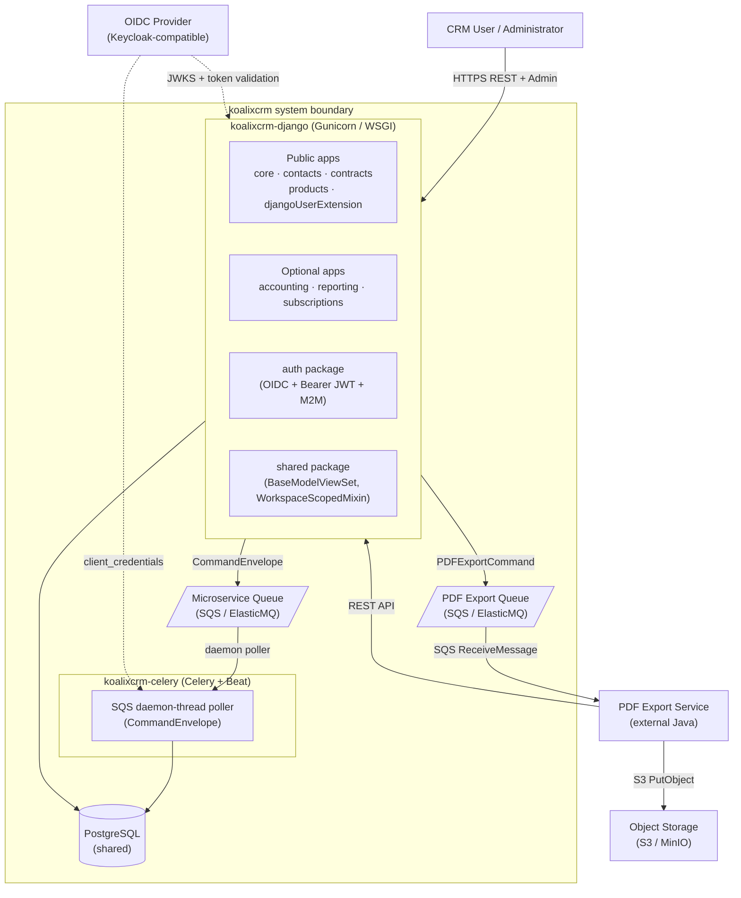

# Solution Strategy

## Architecture and Design Overview

koalixcrm uses a **Modular Monolith with Event-Driven Offload** architecture pattern. All eight
business-domain Django apps share a single WSGI process and a single PostgreSQL database. Module
boundaries are enforced structurally at startup rather than by separate deployables or network
interfaces. Long-running document rendering is decoupled from the HTTP request cycle via AWS SQS
and an external Java PDF export service.

The structural decomposition is documented in detail in
[Chapter 5: Building Block View](../05_building_block_view/index.md), including the
[High-Level Documentation](../05_building_block_view/QQ_HL_Doc_KoalixCRM.md) and
[Service Architecture](../05_building_block_view/QQ_SD_ServiceArchitecture.md).

### System Architecture

The diagram below provides a component-level overview of koalixcrm's major building blocks.

*Figure 1: koalixcrm component overview — internal apps, containers, queues, and external systems.*

---

## Global Architecture Pattern

### Modular Monolith

All eight business-domain apps share one WSGI process and one PostgreSQL database. Each app is
self-contained in its folder structure, URL routing, Django Admin registration, and DRF
serializers. The modular boundary is enforced by the peer-dependency system-check mechanism
rather than by separate deployables or network interfaces.

**Rationale:** A single deployable unit reduces operational complexity for the target user base
(small businesses). Structural modularisation preserves the ability to fork or replace
individual apps without coupling the remaining ones at the import level.

**Implementation:** Each app's `AppConfig` declares `required_peers` and `optional_peers`. The
shared helper `koalixcrm.core.app_checks.register_peer_check` registers a Django system check
for each declared peer. These checks run at every startup and abort with a diagnostic error if a
required peer is absent from `INSTALLED_APPS`. The authoritative description of the pattern is
in [QQ_IMPORT_docs-architecture-optional-apps.md](../05_building_block_view/QQ_IMPORT_docs-architecture-optional-apps.md).

### Event-Driven Offload (PDF Export)

Long-running document rendering is decoupled from the HTTP request cycle via AWS SQS. The
Django container is publisher-only on the PDF export queue. The external Java service (Apache
FOP) is the sole consumer.

**Rationale:** PDF rendering via XSL-FO is CPU- and I/O-intensive and cannot be completed
within a typical HTTP request timeout. Decoupling it through a queue allows the Django container
to return HTTP 202 immediately and keeps synchronous response times independent of document
complexity.

**Implementation:** Creating a `PDFExportProcess` record fires a `post_save` Django signal. The
signal handler constructs a `PDFExportCommand` and dispatches it via the callable resolved from
the `KOALIXCRM_PDF_EXPORT_DISPATCHER` setting (default:
`koalixcrm.core.pdf_export_dispatch.default_sqs_dispatcher`). Downstream forks override this
setting to use their own broker infrastructure without modifying signal handler or model code.

---

## Architecture Decisions

The following decisions directly shape the architecture. Detailed records are in
[Chapter 9: Architecture Decisions](../09_architecture_decisions/index.md).

### Peer-Dependency and Optional-App Fork Isolation

The five apps forming the fork-public surface (`core`, `contacts`, `contracts`,
`djangoUserExtension`, `products`) must not contain module-level imports from the three optional
apps (`accounting`, `reporting`, `subscriptions`). This invariant is enforced by the unit test
`tests/unit/test_fork_isolation.py`. Optional-peer features degrade silently via
`apps.is_installed()` branches at runtime rather than through a parallel feature-flag system.

This decision enables the downstream WFS product to deploy only the five public apps without
carrying the accounting, reporting, or subscriptions modules.

### ContextVar-Based Workspace Isolation

`WorkspaceAwareManager` reads a module-level `ContextVar[Workspace | None]` inside
`get_queryset()`. Because `ContextVar` is scoped per async task or OS thread, concurrent
requests cannot read each other's active workspace. `WorkspaceContextMiddleware` sets the
context variable at request entry and clears it in a `finally` block.

This decision makes multi-tenant isolation structurally enforced at the ORM layer, avoiding
the need for explicit `filter(workspace=...)` calls in view or service code.

### Multi-Table Inheritance (MTI) for Polymorphic Document Types

MTI is used for the `Party` → `Organization` / `PartyContact` hierarchy, the `CommercialDocument`
→ seven document subtypes hierarchy, and the `DocumentTemplate` → ten template subtypes
hierarchy. This allows polymorphic queries on the parent table while keeping subtype-specific
columns cleanly separated in child tables.

A specific capability enabled by MTI is the admin bulk action that swaps an `Organization` row
into a `PartyContact` row (or vice versa) by replacing only the child-table row, preserving all
attached foreign-key assignments on the shared `Party` parent row.

### Monolith-to-Apps Split (v1.14.0 → v2.0.0)

The legacy monolithic `crm` Django app was decomposed into eight focused apps. Key decisions
made during this migration:

- All `db_table` names were preserved as `crm_*` prefixed strings so the underlying SQL schema
  required no alteration.
- Custom migration operations (`CreateModelIfNotExists` / `AddFieldIfNotExists` in
  `koalixcrm/migration_utils.py`) are no-ops when the target table or column already exists,
  making the same migration file safe for both fresh installs and upgrades.
- The `sync_split_migrations` management command reconciles the `django_migrations` table of
  legacy deployments against the new cross-app migration graph before the first `migrate` run.

See [Chapter 9: Architecture Decisions](../09_architecture_decisions/index.md) for the full
decision record.

### Async SQS Offload with Swappable Dispatcher

The `KOALIXCRM_PDF_EXPORT_DISPATCHER` setting is a dotted Python path resolved at call time
via `django.utils.module_loading.import_string`. This is a Strategy pattern that allows
downstream forks to substitute an alternative PDF dispatch callable (e.g. an alternative broker
or an in-process renderer for testing) without modifying signal handler or model code.

### OIDC-First Authentication

OIDC is the primary authentication mechanism for both browser-based admin login (Authorization
Code Flow with PKCE via `authlib`) and machine-to-machine service authentication (Client
Credentials Grant). A local Django form fallback is retained for development environments
without a live Keycloak instance. The authentication class evaluation order in DRF places M2M
authentication first, then user Bearer JWT, then session, then Basic (see
[Security Report](../08_cross_cutting_concepts/QQ_SD_Security_Report.md) for the implications
of retaining Basic authentication in `base_settings.py`).

---

## Technology Decisions

| Technology | Role | Rationale (from codebase evidence) |
|---|---|---|
| **Python 3.13 / Django 5.2** | Web framework and ORM | Mature ecosystem for rapid business application development; Django's admin interface, ORM, migration framework, and system-check mechanism are used heavily throughout the codebase |
| **Django REST Framework (DRF)** | REST API layer | Provides ViewSet-based CRUD, serializer composition for nested UBL-structured documents, and a pluggable authentication/permission class chain |
| **drf-spectacular** | OpenAPI 3.x schema generation | Generates live per-app OpenAPI schemas, Swagger UI, and Redoc UI at runtime from registered ViewSets and serializers; no static file committed to the repository |
| **PostgreSQL 15** | Relational database | Shared by all eight Django apps; MTI, Django ORM, and the `WorkspaceAwareManager` queryset filter operate against PostgreSQL in production |
| **Celery + Beat** | Async worker and scheduler | Provides the worker container (`koalixcrm-celery`) and the Beat scheduler; currently acts as a thin SQS relay (no active task routes) as PDF export was migrated to the Java service |
| **AWS SQS / ElasticMQ** | Message queue | Two queues: one for `CommandEnvelope` messages routed to Celery, one for `PDFExportCommand` messages consumed by the Java PDF service; ElasticMQ is used locally in development |
| **AWS S3 / MinIO** | Object storage | Stores rendered PDF documents and XSL-FO template files; presigned URLs with 5-minute expiry serve PDF download links to clients; MinIO is used locally in development |
| **Apache FOP (external Java service)** | PDF rendering | XSL-FO → PDF renderer; operated as an independent external service outside the koalixcrm codebase; receives commands via SQS and reads document data from the koalixcrm REST API |
| **Grappelli** | Django Admin UI skin | Provides the enhanced admin interface used by CRM Users and Administrators, including the workspace selector in the header band |
| **authlib** | OIDC Authorization Code Flow | Implements the PKCE-protected OIDC Authorization Code Flow for browser-based admin login |
| **PyJWT / python-jose** | JWT validation | RS256 validation of Bearer JWTs from the OIDC provider; JWKS cached in Django cache for 1 hour |
| **boto3** | AWS SDK | Used by `koalixcrm_utils` for SQS `SendMessage` and S3 `PutObject` / presigned URL generation |
| **pytest + Django integration** | Test framework | Tests are located under `tests/`; CI uploads XML coverage to Codacy on each run against `main` and `develop` |
| **SQLite** | Development database | Used in single-user and local development settings overlays; not supported in production |

---

## Design Patterns Used

### Architectural Patterns

| Pattern | Where Applied |
|---|---|
| Modular Monolith | All eight Django apps in one WSGI process with startup-enforced structural boundaries |
| Strategy (PDF Dispatcher) | `KOALIXCRM_PDF_EXPORT_DISPATCHER` setting resolved via `import_string`; downstream forks substitute an alternative callable |
| Observer / Signal (PDF Trigger) | `post_save` Django signal on `PDFExportProcess` decouples PDF dispatch from any individual admin action or API call |
| Plugin Interface (Subscriptions) | `KoalixcrmPluginInterface` allows the `subscriptions` app to inject admin inlines and actions into the `contracts` admin without a direct import dependency |
| Admin Monkey-Patching (Accounting) | `AccountingConfig.ready()` appends accounting inlines to already-registered admin classes from `core` and `products`, keeping those apps free of accounting import-time dependencies |

### Application-Level Patterns

| Pattern | Where Applied |
|---|---|
| Multi-Table Inheritance (MTI) | `Party` → `Organization` / `PartyContact`; `CommercialDocument` → seven document subtypes; `DocumentTemplate` → ten template subtypes |
| ContextVar-Based Tenant Isolation | `WorkspaceAwareManager` reads a thread-/task-scoped `ContextVar` set by `WorkspaceContextMiddleware` |
| Workspace-Scoped RBAC | `RoleInWorkspace` join table binds a Django `Group` to a `Workspace` at one of seven `Role` values; `permissions_for_role()` maps roles to Django CRUD permission codes |
| Idempotent Migration Operations | `CreateModelIfNotExists` / `AddFieldIfNotExists` in `koalixcrm/migration_utils.py` allow the same migrations to run safely on both fresh installs and legacy databases |

---

## Quality Approach

The architecture addresses the key quality goals identified in
[Chapter 1: Introduction and Goals](../01_introduction_and_goals/index.md) as follows:

| Quality Goal | Architectural Mechanism |
|---|---|
| **Multi-tenant isolation** | Three-layer enforcement: ORM (`WorkspaceAwareManager` + `ContextVar`), middleware (`WorkspaceContextMiddleware`), and admin (`WorkspaceScopedModelAdmin.save_model`). Bypassing all three layers simultaneously requires deliberate misuse of the ORM or raw SQL. |
| **Fork isolation** | Module-level import boundary enforced by an AST-scanning unit test (`test_fork_isolation.py`). Optional-peer features use `apps.is_installed()` runtime branches; no parallel feature-flag configuration exists. |
| **Async PDF generation** | `PDFExportProcess` + SQS + external Java service keep rendering fully off the HTTP request path. The `KOALIXCRM_PDF_EXPORT_DISPATCHER` seam allows downstream forks to replace the broker without touching signal or model code. |
| **OIDC-first authentication** | PKCE-protected Authorization Code Flow for browser sessions; RS256 JWT validation for REST and M2M clients; JWKS cached and refreshed every hour. |
| **Modular boundary enforcement** | `required_peers` / `optional_peers` in each `AppConfig` + Django system checks abort startup on any missing required peer, preventing silent misconfigured deployments. |

Security findings identified during documentation review are catalogued in
[QQ_SD_Security_Report.md](../08_cross_cutting_concepts/QQ_SD_Security_Report.md). Notable
items that affect the quality posture include `BasicAuthentication` being active in all
environments (finding F-01), the absence of an explicit production settings module in the
reviewed source tree (F-07), and PII fields stored without field-level encryption (F-09).

---

## References

| Document | Description |
|---|---|
| [QQ_HL_Doc_KoalixCRM.md](../05_building_block_view/QQ_HL_Doc_KoalixCRM.md) | High-level documentation — architecture overview, domain model, design patterns, testing |
| [QQ_SD_ServiceArchitecture.md](../05_building_block_view/QQ_SD_ServiceArchitecture.md) | Runtime service topology, container catalog, modular boundary enforcement, SQS offload path |
| [QQ_SD_ComponentArchitecture.md](../05_building_block_view/QQ_SD_ComponentArchitecture.md) | Internal package structure for each of the eight Django apps |
| [Chapter 3: System Scope and Context](../03_system_scope_and_context/index.md) | Entry points, interface specifications (REST, async), and system boundaries |
| [Chapter 6: Runtime View](../06_runtime_view/index.md) | Use cases and actor interactions at runtime |
| [Chapter 8: Cross-cutting Concepts](../08_cross_cutting_concepts/index.md) | Security report, access control, configuration, entity relation diagram, test coverage |
| [Chapter 9: Architecture Decisions](../09_architecture_decisions/index.md) | Recorded decisions — monolith-to-apps split, address restructure, commercial document field changes |
