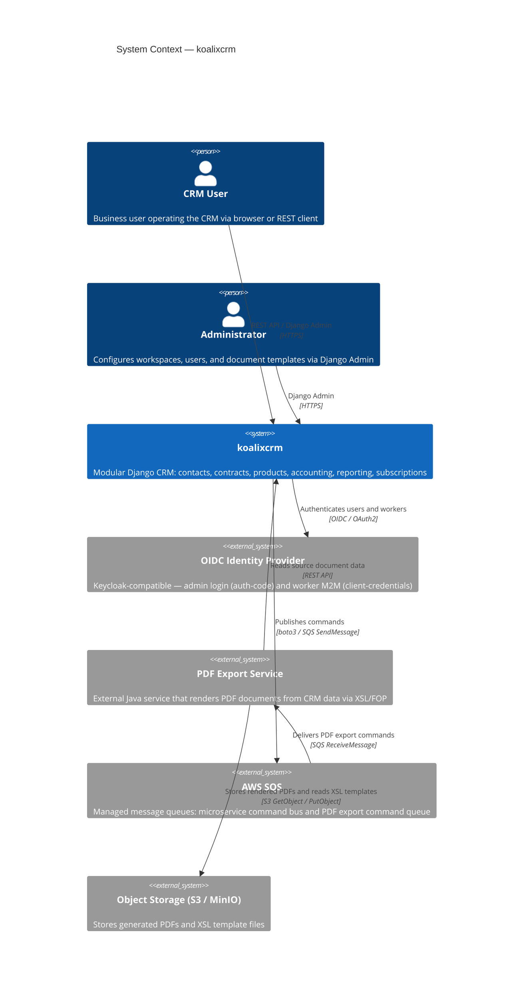
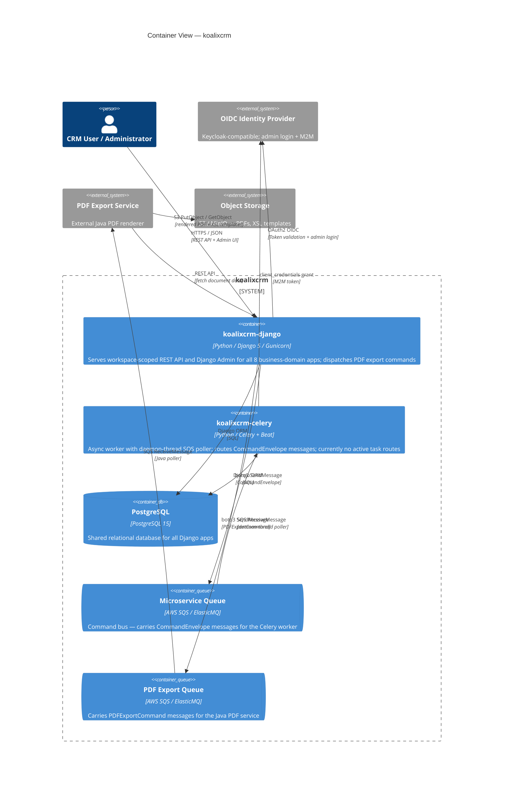
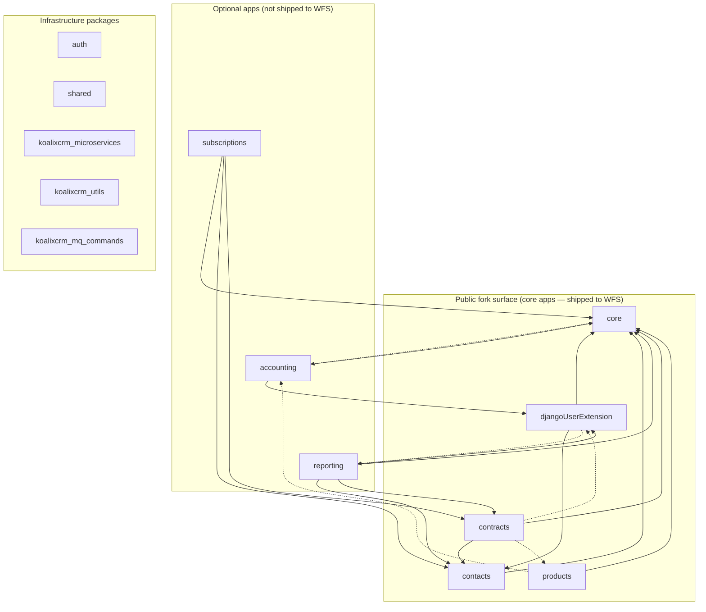
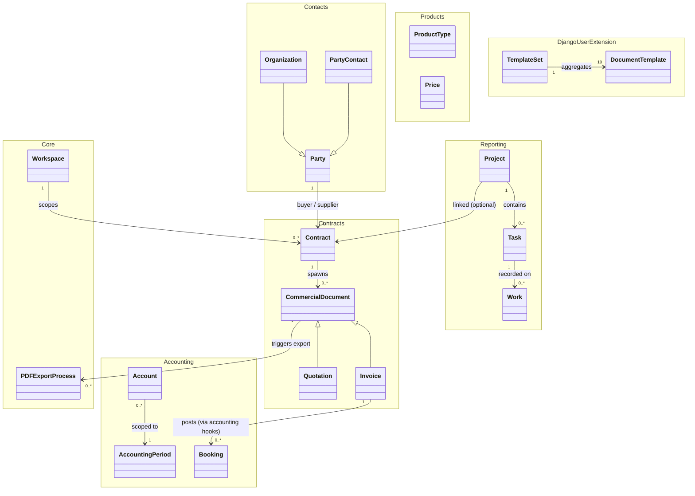
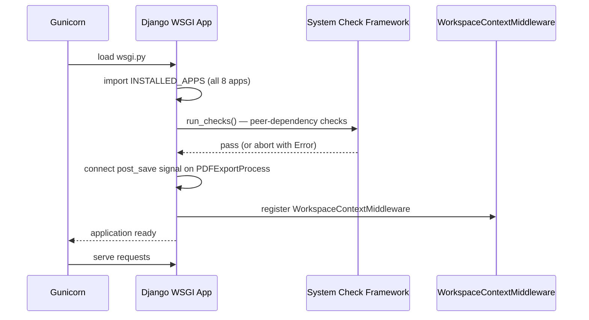
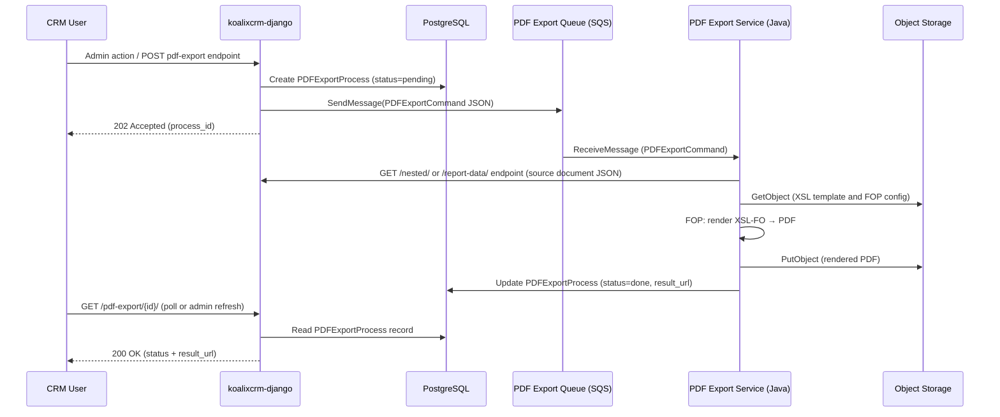

# koalixcrm — High-Level Documentation

## Introduction

### Project Overview

koalixcrm is an open-source, cloud-hostable Customer Relationship Management platform targeting
small businesses (fewer than ten employees). It manages contacts, products, commercial documents
(quotations, invoices, purchase orders, and related document types), project time tracking, double-entry
accounting, subscriptions, and PDF document generation. The system is licensed under the BSD license.

The codebase is a **modular Django monolith** deployed as two containers (`koalixcrm-django` and
`koalixcrm-celery`) from a single shared Python codebase. All eight business-domain Django apps share
one WSGI process and one PostgreSQL database; each app is structurally independent within that shared
process and enforces its boundary via a peer-dependency mechanism. Asynchronous PDF export is delegated
to an external Java service via AWS SQS rather than handled in-process.

The stack is orchestrated from the sibling repository
[koalixcrm_system](https://github.com/KoalixSwitzerland/koalixcrm_system). Detailed setup guides are
available for
[local Docker Desktop](../01_introduction_and_goals/QQ_IMPORT_README.md) and Linux server
environments.

Source: [QQ_IMPORT_README.md](../01_introduction_and_goals/QQ_IMPORT_README.md)

### Target Audience

The primary audience of this document is:

- **Software architects** who need an architectural overview of the system before designing extensions
  or integrations.
- **Software engineers** who want to understand the package boundary and inter-module dependencies
  before contributing to or integrating with koalixcrm.
- **Downstream product teams** (such as the WFS — `qq_workflow_support_webapp_backend` team) who
  consume the fork-public surface of koalixcrm.

### Glossary

| Term/Acronym | Full Form | Description |
|---|---|---|
| CRM | Customer Relationship Management | The business domain the platform serves. |
| Django | — | Python web framework; the application is built on Django 5.2. |
| DRF | Django REST Framework | The REST API library used for all JSON endpoints. |
| WSGI | Web Server Gateway Interface | The synchronous Python server interface; Gunicorn serves the Django app via WSGI. |
| Workspace | — | The tenant isolation unit; every business record belongs to exactly one workspace. |
| WorkspaceScopedModel | — | Abstract Django base class that injects a `workspace` FK and a workspace-aware ORM manager into every tenant-scoped model. |
| RBAC | Role-Based Access Control | Permissions are granted to named workspace-level roles, not to individual users. |
| RoleInWorkspace | — | Join table binding a Django auth `Group` to a `Workspace` at a specific `Role`. |
| PDFExportProcess | — | Core model that tracks the lifecycle of an asynchronous PDF generation job. |
| MTI | Multi-Table Inheritance | Django ORM pattern where a child model extends a parent model with a separate database table linked via a shared primary key. |
| SQS | Simple Queue Service | AWS managed message queue; used as the transport for PDF export commands. |
| FOP | Formatting Objects Processor | Apache FOP; the Java XSL-FO → PDF renderer used by the external PDF export service. |
| UBL | Universal Business Language | OASIS standard for commercial document schemas; the nested REST serializers mirror UBL structure. |
| OIDC | OpenID Connect | Identity layer on top of OAuth 2.0; used for browser-based admin login and machine-to-machine worker authentication. |
| M2M | Machine-to-Machine | Non-interactive service authentication via the OAuth 2.0 Client Credentials Grant. |
| WFS | Workflow Support | Downstream product (`qq_workflow_support_webapp_backend`) that forks only the five public-surface koalixcrm apps. |
| ElasticMQ | — | SQS-compatible local queue server used in the development environment. |
| MinIO | — | S3-compatible local object storage used in the development environment. |
| Party | — | The universal contact entity (`koalixcrm.contacts.Party`) used as the FK target for any legal or natural person in the system. |
| CommandEnvelope | — | Generic message wrapper carrying a command type and JSON payload on the microservice SQS queue. |

---

## Architecture Overview

### Architecture Style

koalixcrm uses a **Modular Monolith with Event-Driven Offload** architecture pattern.

A single Django WSGI application hosts all eight business-domain apps in one deployable unit sharing
a common PostgreSQL database and URL namespace. Within that monolith, module boundaries are enforced
structurally: each app declares `required_peers` and `optional_peers` in its `AppConfig`, and the
`koalixcrm.core.app_checks.register_peer_check` helper registers Django system checks that fail at
startup when a required peer is absent. This qualifies the application as *modular* rather than
tightly coupled.

Long-running work — exclusively PDF generation — is offloaded asynchronously. The Django container
publishes `PDFExportCommand` messages to an AWS SQS queue. An external Java service polls that queue,
fetches source data from the Django REST API, renders PDFs via Apache FOP (using XSL-FO templates
stored in S3), and writes the result back to a `CommercialDocumentMedia` record. A second container
(`koalixcrm-celery`) runs a Celery worker with a daemon-thread SQS poller for general-purpose
`CommandEnvelope` routing; its dispatch table is currently empty as all PDF work was migrated to
the Java service.

The full rationale for this classification is documented in
[QQ_SD_ServiceArchitecture.md](QQ_SD_ServiceArchitecture.md).

The optional-app peer-dependency pattern is documented authoritatively in
[QQ_IMPORT_docs-architecture-optional-apps.md](QQ_IMPORT_docs-architecture-optional-apps.md).

### System Context

The diagram below shows koalixcrm as the single system under documentation, its human actors,
and the external systems it interacts with.



*Figure 1: System context of koalixcrm. The system boundary contains the Django monolith and its
Celery worker. The OIDC provider, SQS queues, object storage, and PDF export service are external.*

### Container View

The diagram below shows the two deployable containers inside the koalixcrm system boundary and
the external systems they interact with.



*Figure 2: Container view. The system boundary contains the Django WSGI app, the Celery worker,
the shared PostgreSQL database, and the two SQS queues. External systems (OIDC, PDF service, S3)
sit outside the boundary.*

### Internal Package and Layer Structure

The diagram below shows the Django app grouping and their internal layers inside the
`koalixcrm-django` container.



*Figure 3: Internal app grouping. Solid arrows are `required_peers` (enforced at startup by Django
system checks). Dashed arrows are `optional_peers` (runtime `apps.is_installed` branches; missing
peer causes silent graceful degradation). Infrastructure packages are not shown with dependency
arrows for brevity — they are consumed by all app layers.*

### Module Reference Links

Public surface apps (core):

- [core — Mid-Level Documentation](koalixcrm/core/QQ_ML_Doc_Core.md)
- [contacts — Mid-Level Documentation](koalixcrm/contacts/QQ_ML_Doc_Contacts.md)
- [contracts — Mid-Level Documentation](koalixcrm/contracts/QQ_ML_Doc_Contracts.md)
- [djangoUserExtension — Mid-Level Documentation](koalixcrm/djangoUserExtension/QQ_ML_Doc_DjangoUserExtension.md)
- [products — Mid-Level Documentation](koalixcrm/products/QQ_ML_Doc_Products.md)

Optional apps:

- [accounting — Mid-Level Documentation](koalixcrm/accounting/QQ_ML_Doc_Accounting.md)
- [reporting — Mid-Level Documentation](koalixcrm/reporting/QQ_ML_Doc_Reporting.md)
- [subscriptions — Mid-Level Documentation](koalixcrm/subscriptions/QQ_ML_Doc_Subscriptions.md)

Infrastructure packages:

- [auth — Mid-Level Documentation](koalixcrm/auth/QQ_ML_Doc_Auth.md)
- [shared — Mid-Level Documentation](koalixcrm/shared/QQ_ML_Doc_Shared.md)
- [koalixcrm_microservices — Mid-Level Documentation](koalixcrm_microservices/QQ_ML_Doc_Microservices.md)
- [koalixcrm_utils — Mid-Level Documentation](koalixcrm_utils/QQ_ML_Doc_Utils.md)

---

## Domain Model

The diagram below is a conceptual overview of the bounded contexts and their principal
relationships. It is not a physical data model; for tables, columns, and foreign keys see the
[Entity Relation Diagram](../08_cross_cutting_concepts/QQ_SD_EntityRelationDiagram.md),
which documents all 67 entities across the 8 modules, their attributes, relationships, and
the Django migration history.



*Figure 4: Conceptual domain model — bounded contexts and key cross-context relationships.
Multiplicity and inheritance are shown; field detail is intentionally omitted.*

---

## Process

### Startup Process

The Django container is started by Gunicorn, which loads the WSGI entry point
(`projectsettings/wsgi.py`). During startup, Django runs the system-check framework, which
executes all registered peer-dependency checks (`register_peer_check`). Any missing
`required_peers` entry causes startup to abort with a diagnostic error before the first request
is served.

The Celery container is started separately. On `worker_ready` signal, the `_on_worker_ready`
handler in `koalixcrm_microservices.celery_app` spawns the SQS poller as a Python daemon thread
(controlled by the `ENABLE_SQS_POLLER` environment variable).



*Figure 5: Django container startup sequence.*

### PDF Export Process

The PDF export process is the primary asynchronous use case in koalixcrm. Any admin action that
needs to produce a PDF document — for invoices, quotations, project reports, or work reports —
follows this common path.

**Actor:** CRM User or Administrator via Django Admin or REST API.

**Input:** The user selects one or more domain objects (commercial documents or projects) and
triggers a "Create PDF" admin action, or calls the appropriate REST endpoint.

**Output:** A `CommercialDocumentMedia` record (for commercial documents) or a `PDFExportProcess`
status update (for project reports) containing the S3 URL of the rendered PDF.



*Figure 6: Asynchronous PDF export sequence.*

### Workspace Switching

**Actor:** Authenticated user who holds roles in more than one workspace.

**Input:** A POST request to `/core/switch-workspace/` with the target `workspace_id`, typically
triggered from the Grappelli Admin header workspace selector.

**Output:** The user's Django session is updated with the new `active_workspace_id`; all subsequent
requests serve only data belonging to the target workspace.

---

## Global Architecture Patterns

### Modular Monolith

All eight business-domain apps share one WSGI process and one PostgreSQL database. The modular
boundary is enforced by the peer-dependency system-check mechanism rather than by separate
deployables or network interfaces. Each app is self-contained in its folder structure, URL routing,
Django Admin registration, and REST serializers.

**Implementation:** Each app's `AppConfig` declares `required_peers` and `optional_peers`. The shared
helper `koalixcrm.core.app_checks.register_peer_check` registers a Django system check for each
app; the checks run at every startup and abort with a clear diagnostic if a required peer is absent.

### Event-Driven Offload (PDF Export)

Long-running document rendering is decoupled from the HTTP request cycle via AWS SQS. The Django
container is publisher-only on the PDF export queue. The external Java service is the sole consumer.
This keeps the synchronous HTTP surface responsive and allows the PDF rendering workload to scale
independently.

**Implementation:** `PDFExportProcess` creation fires a `post_save` Django signal. The signal handler
(`pdf_export_signals.trigger_pdf_export`) constructs a `PDFExportCommand` and dispatches it via the
configured dispatcher (`KOALIXCRM_PDF_EXPORT_DISPATCHER` setting). The default dispatcher sends the
command as JSON to the SQS queue via `koalixcrm_utils.aws_clients.get_sqs_queue`. WFS and other
downstream forks override the dispatcher setting to use their own broker infrastructure.

### Multi-Tenant Workspace Isolation

Every business entity inherits from `WorkspaceScopedModel`, which attaches a `workspace` FK and
replaces the default Django ORM manager with `WorkspaceAwareManager`. The manager reads an
`_active_workspace` Python `ContextVar` (set per request by `WorkspaceContextMiddleware`) and
automatically appends `filter(workspace=active)` to every queryset. This makes workspace isolation
structurally impossible to bypass in view or service code.

### Optional-App Fork Isolation

The five apps forming the *fork-public surface* (`core`, `contacts`, `contracts`,
`djangoUserExtension`, `products`) must not contain module-level imports from the three
optional apps (`accounting`, `reporting`, `subscriptions`). This invariant is enforced by
`tests/unit/test_fork_isolation.py`. Optional-peer features degrade silently via
`apps.is_installed()` branches; no parallel feature-flag configuration is used.

The authoritative description of the rules and migration guidance for the pattern is in
[QQ_IMPORT_docs-architecture-optional-apps.md](QQ_IMPORT_docs-architecture-optional-apps.md).

---

## API Specifications

The koalixcrm REST API is exposed by the `koalixcrm-django` container. All endpoints are mounted
under workspace-scoped URL prefixes: `/koalixcrm_<app>/api/v1/<workspace_id>/`. Full endpoint
listings, request/response formats, and authentication details are documented in
[QQ_SD_Interface_REST_Specifications.md](../03_system_scope_and_context/QQ_SD_Interface_REST_Specifications.md).

The asynchronous SQS command interface (PDF export and microservice command bus) is documented in
[QQ_SD_Interface_Async_Specifications.md](../03_system_scope_and_context/QQ_SD_Interface_Async_Specifications.md).

| App | URL Prefix | Description |
|---|---|---|
| `core` | `/koalixcrm_core/api/v1/<ws>/` | Currencies, taxes, units, transforms, PDF export processes, document templates |
| `contacts` | `/koalixcrm_contacts/api/v1/<ws>/` | Parties, organizations, contacts, addresses, phone numbers, e-mails, roles, groups |
| `contracts` | `/koalixcrm_contracts/api/v1/<ws>/` | Contracts, quotations, sales orders, invoices, purchase orders, credit notes, despatch advices, payment reminders, line items, media |
| `products` | `/koalixcrm_products/api/v1/<ws>/` | Product types, products, prices, customer group transforms |
| `accounting` | `/koalixcrm_accounting/api/v1/<ws>/` | Accounts, accounting periods, bookings, product categories |
| `reporting` | `/koalixcrm_reporting/api/v1/<ws>/` | Projects, tasks, work, reporting periods, resources, agreements, estimations |
| `subscriptions` | (no REST API registered) | Admin-only; subscriptions REST API is not implemented |
| `djangoUserExtension` | (no REST API registered) | Admin-only |

All ViewSets inherit from `koalixcrm.shared.base_model_view_set.BaseModelViewSet`, which enforces
`ModelPermissionsWithListView` (requiring `view_*` permission for `GET` requests) and
`WorkspaceScopedViewSetMixin` (filtering querysets and stamping workspace on creation).

Authentication on the REST API is handled by the `koalixcrm/auth/` package via DRF's
authentication class chain:

1. `CeleryWorkerM2MAuthentication` — Client Credentials Grant tokens for the Celery worker and
   other M2M clients.
2. `OIDCAccessTokenAuthentication` — Bearer JWTs for user-facing REST clients.
3. `SessionAuthentication` — Django session cookies for browser-based admin access.
4. `BasicAuthentication` — Fallback for tooling and development.

### Browsable API Specifications

`drf-spectacular` generates per-app OpenAPI 3.x schemas at runtime. Each app ships its own schema
endpoint, Swagger UI, and Redoc UI:

| App | Schema | Swagger UI | Redoc UI |
|---|---|---|---|
| Accounting | `/koalixcrm_accounting/api/schema/v1/` | `/koalixcrm_accounting/api/swagger/v1/` | `/koalixcrm_accounting/api/redoc/v1/` |
| Contacts | `/koalixcrm_contacts/api/schema/v1/` | `/koalixcrm_contacts/api/swagger/v1/` | `/koalixcrm_contacts/api/redoc/v1/` |
| Products | `/koalixcrm_products/api/schema/v1/` | `/koalixcrm_products/api/swagger/v1/` | `/koalixcrm_products/api/redoc/v1/` |
| Core | `/koalixcrm_core/api/schema/v1/` | `/koalixcrm_core/api/swagger/v1/` | `/koalixcrm_core/api/redoc/v1/` |
| Contracts | `/koalixcrm_contracts/api/schema/v1/` | `/koalixcrm_contracts/api/swagger/v1/` | `/koalixcrm_contracts/api/redoc/v1/` |
| Reporting | `/koalixcrm_reporting/api/schema/v1/` | `/koalixcrm_reporting/api/swagger/v1/` | `/koalixcrm_reporting/api/redoc/v1/` |

The schema endpoints return OpenAPI 3.x JSON/YAML. Download the schema from any of these endpoints
and load it into [Swagger UI](https://swagger.io/tools/swagger-ui/) or
[Redoc](https://redocly.com/) for offline interactive browsing. No pre-generated static OpenAPI
file is committed to the repository — the schemas are generated live from the registered ViewSets
and serializers by `drf-spectacular`.

---

## Design Patterns Used

### Multi-Table Inheritance (MTI)

Used in three domains:

| Domain | Parent | Subtypes |
|---|---|---|
| Contacts | `Party` | `Organization`, `PartyContact` |
| Contracts | `CommercialDocument` | `Invoice`, `Quotation`, `SalesOrder`, `PurchaseOrder`, `CreditNote`, `DespatchAdvice`, `PaymentReminder` |
| DjangoUserExtension | `DocumentTemplate` | Ten document-type-specific template subtypes (`InvoiceTemplate`, `QuotationTemplate`, etc.) |
| Products | `Price` | `ProductPrice` |

MTI allows polymorphic queries on the parent table while keeping subtype-specific columns
cleanly separated. Admin bulk actions in the `contacts` app exploit MTI's table structure
by using raw SQL to swap the child-table row (Organization ↔ PartyContact) without touching
the parent `Party` row, preserving all attached assignments.

### Strategy Pattern (PDF Dispatcher)

`KOALIXCRM_PDF_EXPORT_DISPATCHER` is a dotted-path Django setting resolved at call time via
`django.utils.module_loading.import_string`. The default strategy sends `PDFExportCommand`
messages to the PDF export SQS queue. Downstream forks substitute an alternative callable
without modifying any signal handler or model code.

### Observer / Signal Pattern (PDF Export Trigger)

Creating a `PDFExportProcess` record is the sole trigger for PDF export. A `post_save` Django
signal registered in `CoreConfig.ready()` detects the creation event and dispatches the
command. This decouples the act of requesting a PDF (creating the record in any app's admin
action) from the transport implementation.

### Admin Monkey-Patching (Accounting)

`koalixcrm.accounting.AccountingConfig.ready()` appends `TaxAccountAssignmentInline` and
`ProductCategoryAssignmentInline` to already-registered admin classes from `core` and `products`
respectively. This keeps `core` and `products` free of import-time dependencies on `accounting`
while presenting a unified change page in the Django Admin.

### ContextVar-Based Tenant Isolation

`WorkspaceAwareManager` reads a module-level `ContextVar[Workspace | None]` inside
`get_queryset()`. Because `ContextVar` is scoped per async task or OS thread, concurrent
requests cannot read each other's active workspace. The `WorkspaceContextMiddleware` sets the
context variable at request entry and clears it in a `finally` block.

### Plugin Interface (Subscriptions / Contracts)

`KoalixcrmPluginInterface` in `koalixcrm.subscriptions` is a plain class exposing lists of
admin inlines and actions for injection into the `Contract` admin without a direct import
dependency at registration time. The contracts app `PluginProcessor` appends plugin-provided
inlines and actions to its own admin classes at module import time.

### Swappable Dispatcher (Peer-Integration Seam)

| Setting | Default | Purpose |
|---|---|---|
| `KOALIXCRM_PDF_EXPORT_DISPATCHER` | `koalixcrm.core.pdf_export_dispatch.default_sqs_dispatcher` | Callable invoked when a `PDFExportProcess` record is created; WFS overrides this to use its own broker fleet. |

---

## Testing

### Executing Unit Tests

The project uses **pytest** with Django integration. Tests are located under the `tests/`
directory at the repository root.

```bash
python manage.py test
```

or (using pytest):

```bash
pytest
```

The test directory includes factories (`tests/factories/`), API tests for individual app REST
layers (`tests/reporting_api_py/`, `tests/contracts_api_py/`, `tests/core_api_py/`, etc.),
integration tests, end-to-end tests (`tests/e2e/`), and unit tests (`tests/unit/`).

The critical unit test enforcing fork-isolation is:

```text
tests/unit/test_fork_isolation.py
```

This test asserts that no public app (`core`, `contacts`, `contracts`, `djangoUserExtension`,
`products`) contains a top-level module-level import from any optional app (`accounting`,
`reporting`, `subscriptions`).

### Module Test Coverage

A full analysis of test coverage per module is documented in
[QQ_SD_Unit_Test_Coverage.md](../08_cross_cutting_concepts/QQ_SD_Unit_Test_Coverage.md).
The table below summarises the key findings.

| Module | Unit Testing | Coverage |
|---|---|---|
| `koalixcrm.core` | Yes — `tests/core_api_py/` (84 test functions) | Workspace model, RBAC helpers (`effective_roles`, `user_workspaces`, `permissions_for_role`), `WorkspaceAwareManager`, `WorkspaceContextMiddleware`, `WorkspaceScopedModelAdmin`, `PDFExportProcess` workspace scoping, PDF-service endpoints |
| `koalixcrm.contacts` | Yes — `tests/contacts/` (20 test functions) | `convert_organizations_to_contacts` and `convert_contacts_to_organizations` admin actions; party model fields |
| `koalixcrm.contracts` | Partial — `tests/legacy_crm/` and `tests/contracts_api_py/` (23 test functions) | `Calculations.calculate_document_price` under 10 price-resolution scenarios; REST API CRUD for Contract, Invoice, Quotation |
| `koalixcrm.products` | Partial — `tests/products_api_py/` (4 test functions) | REST API CRUD for `ProductType` only |
| `koalixcrm.accounting` | Yes — `tests/accounting/` and `tests/accounting_api_py/` (31 test functions) | Account booking aggregates, `AccountingPeriod` P&L and balance-sheet totals, admin PDF-export actions; REST API CRUD for Account, AccountingPeriod, Booking, ProductCategory |
| `koalixcrm.reporting` | Yes — `tests/legacy_crm/` and `tests/reporting_api_py/` (68 test functions) | Task and Project cost/effort/duration calculations with and without agreements; REST API CRUD for all 13 reporting resources |
| `koalixcrm.djangoUserExtension` | Indirect only | Factories for `DocumentTemplate` and `TemplateSet` are used in other tests; no dedicated test file |
| `koalixcrm.subscriptions` | No | No test files identified |
| `koalixcrm.auth` | No | No test files identified |
| `koalixcrm.shared` | No | Exercised indirectly through all API tests; no dedicated tests |
| `koalixcrm_microservices` | No identified test sources | Celery CI profile targets this package; no test files found in `tests/` |
| `koalixcrm_utils` | No | No test files identified; S3/presigned-URL calls are mocked in PDF endpoint tests |
| Fork isolation | Yes — `tests/unit/test_fork_isolation.py` | Module-level import boundary enforced via AST scan (10 parameterised nodes) |
| `koalixcrm_mq_commands` | Yes — `tests/unit/test_mq_commands_is_django_free.py` | Subprocess import check verifying no Django modules leak in |

A Codacy-integrated XML coverage report is uploaded by the CI pipeline
(`.github/workflows/test.yml`) on each run against `main` and `develop`.

---

## Security

### Assets

The following asset types exist in koalixcrm:

- **Business data:** workspace-scoped CRM records (contacts, contracts, invoices, products, bookings,
  projects, subscriptions) stored in PostgreSQL.
- **PDF documents and XSL templates:** stored in S3 / MinIO; accessed via short-lived presigned URLs.
- **User identity and session data:** managed by Django session framework and OIDC tokens.
- **AWS credentials:** resolved from the environment (IAM roles or named profiles); not stored in the
  database or source code.
- **Service-to-service tokens:** M2M Client Credentials Grant tokens obtained from the OIDC provider
  by the Celery worker; cached in-process by `TokenCache` (singleton per worker process).

### Authentication and Authorization

Authentication is handled by the `koalixcrm/auth/` package. Three authentication paths exist:

| Path | Mechanism | Consumer |
|---|---|---|
| Browser admin login | OIDC Authorization Code Flow with PKCE | Admin users via Django session |
| REST API (user) | Bearer JWT (`OIDCAccessTokenAuthentication`) | REST clients |
| REST API (M2M) | Bearer JWT via Client Credentials Grant (`CeleryWorkerM2MAuthentication`) | Celery worker, Java PDF service |

Authorization uses workspace-level RBAC. The `RoleInWorkspace` join table binds a Django auth
`Group` to a `Workspace` at one of seven `Role` values (ADMIN, EDITOR, VIEWER, COMMENTER,
EMPLOYEE, LINE_MANAGER, PROJECT_MANAGER). The `access.permissions_for_role()` function maps
role codes to Django per-model CRUD permission codes. Superusers bypass all workspace-level
checks.

A consolidated security analysis — covering all authentication paths, the RBAC model, PII
exposure, transport security, secret management, and a prioritised findings catalogue — is
documented in
[QQ_SD_Security_Report.md](../08_cross_cutting_concepts/QQ_SD_Security_Report.md).

### Data Privacy

`PartyContact.gdpr_consent_date` records when a natural person gave GDPR consent. Personally
Identifiable Information (PII) is stored in the `contacts` app (`PartyContact`, `Address`,
`PhoneNumber`, `PartyEmail`). No automated data-retention or anonymisation pipeline was identified
in the reviewed source.

---

## Appendix

### References

| Document | Description |
|---|---|
| [QQ_SD_Glossary.md](../12_glossary/QQ_SD_Glossary.md) | Consolidated glossary of all domain-specific terms, architecture acronyms, and project-specific concepts |
| [QQ_SD_EntityRelationDiagram.md](../08_cross_cutting_concepts/QQ_SD_EntityRelationDiagram.md) | Physical data model: 67 entities across 8 modules, Mermaid ERDs per bounded context, migration inventory |
| [QQ_SD_ServiceArchitecture.md](QQ_SD_ServiceArchitecture.md) | Runtime service topology, container catalog, SQS offload path, modular boundary enforcement mechanism |
| [QQ_SD_ComponentArchitecture.md](QQ_SD_ComponentArchitecture.md) | Internal package structure for each of the eight Django apps |
| [QQ_IMPORT_docs-architecture-optional-apps.md](QQ_IMPORT_docs-architecture-optional-apps.md) | Authoritative source for the optional-app peer-dependency pattern (rules, examples, migration guidance) |
| [QQ_IMPORT_README.md](../01_introduction_and_goals/QQ_IMPORT_README.md) | Project introduction, feature summary, setup guides, and v1.14.0 → v2.0.0 upgrade procedure |
| [koalixcrm/core/QQ_ML_Doc_Core.md](koalixcrm/core/QQ_ML_Doc_Core.md) | Mid-level documentation — core app (tenant isolation, RBAC, lookup tables, PDF export) |
| [koalixcrm/contacts/QQ_ML_Doc_Contacts.md](koalixcrm/contacts/QQ_ML_Doc_Contacts.md) | Mid-level documentation — contacts app (Party hierarchy, assignment tables) |
| [koalixcrm/contracts/QQ_ML_Doc_Contracts.md](koalixcrm/contracts/QQ_ML_Doc_Contracts.md) | Mid-level documentation — contracts app (commercial document lifecycle) |
| [koalixcrm/djangoUserExtension/QQ_ML_Doc_DjangoUserExtension.md](koalixcrm/djangoUserExtension/QQ_ML_Doc_DjangoUserExtension.md) | Mid-level documentation — djangoUserExtension app (document templates, TemplateSet, UserExtension) |
| [koalixcrm/products/QQ_ML_Doc_Products.md](koalixcrm/products/QQ_ML_Doc_Products.md) | Mid-level documentation — products app (ProductType, price resolution) |
| [koalixcrm/accounting/QQ_ML_Doc_Accounting.md](koalixcrm/accounting/QQ_ML_Doc_Accounting.md) | Mid-level documentation — accounting app (double-entry bookkeeping, P&L reports) |
| [koalixcrm/reporting/QQ_ML_Doc_Reporting.md](koalixcrm/reporting/QQ_ML_Doc_Reporting.md) | Mid-level documentation — reporting app (projects, tasks, time tracking, cost aggregation) |
| [koalixcrm/subscriptions/QQ_ML_Doc_Subscriptions.md](koalixcrm/subscriptions/QQ_ML_Doc_Subscriptions.md) | Mid-level documentation — subscriptions app (recurring service arrangements) |
| [koalixcrm/auth/QQ_ML_Doc_Auth.md](koalixcrm/auth/QQ_ML_Doc_Auth.md) | Mid-level documentation — auth package (OIDC login, Bearer JWT, M2M authentication) |
| [koalixcrm/shared/QQ_ML_Doc_Shared.md](koalixcrm/shared/QQ_ML_Doc_Shared.md) | Mid-level documentation — shared package (BaseAPIClient, BaseModelViewSet, WorkspaceScopedViewSetMixin) |
| [koalixcrm_microservices/QQ_ML_Doc_Microservices.md](koalixcrm_microservices/QQ_ML_Doc_Microservices.md) | Mid-level documentation — Celery app and SQS poller |
| [koalixcrm_utils/QQ_ML_Doc_Utils.md](koalixcrm_utils/QQ_ML_Doc_Utils.md) | Mid-level documentation — AWS client factories, S3 template storage, presigned URL generation |

### List of Illustrations

| Figure | Title |
|---|---|
| Figure 1 | System context of koalixcrm |
| Figure 2 | Container view — koalixcrm |
| Figure 3 | Internal app grouping and peer dependencies |
| Figure 4 | Conceptual domain model |
| Figure 5 | Django container startup sequence |
| Figure 6 | Asynchronous PDF export sequence |

### Additional Resources and Further Reading

- [Django documentation](https://docs.djangoproject.com/en/stable/)
- [Django REST Framework](https://www.django-rest-framework.org/)
- [Django system checks framework](https://docs.djangoproject.com/en/stable/topics/checks/)
- [Django Multi-Table Inheritance](https://docs.djangoproject.com/en/stable/topics/db/models/#multi-table-inheritance)
- [Apache FOP documentation](https://xmlgraphics.apache.org/fop/)
- [AWS SQS documentation](https://docs.aws.amazon.com/sqs/)
- [Celery documentation](https://docs.celeryproject.org/)
- [drf-spectacular (OpenAPI generation)](https://drf-spectacular.readthedocs.io/)
