# Component Architecture — koalixcrm

## Overview

The koalixcrm application is a modular Django monolith composed of eight business-domain apps. Each app
is self-contained in terms of folder structure, URL routing, admin registration, and REST serialization,
but all apps share a single WSGI process and a single PostgreSQL database. The `reporting` app is the
largest (~6,246 LoC) and depends on `core`, `contacts`, `contracts`, and `djangoUserExtension`. It is
classified as an optional app and is absent from downstream WFS deployments.

The full service topology and modular peer-dependency rules are documented in
[QQ_SD_ServiceArchitecture.md](QQ_SD_ServiceArchitecture.md). The peer-dependency pattern itself is
authoritatively described in
[QQ_IMPORT_docs-architecture-optional-apps.md](QQ_IMPORT_docs-architecture-optional-apps.md).

This document focuses on the internal package structure of the `reporting` Django app.

---

## Reporting App — Internal Package Structure

### Layered Architecture Diagram

The diagram below shows the internal layers of `koalixcrm/reporting/` and the packages within each
layer. No inter-package dependencies are shown here; those are described in prose below.

**Figure 1 — Reporting App: Layered Package Structure**

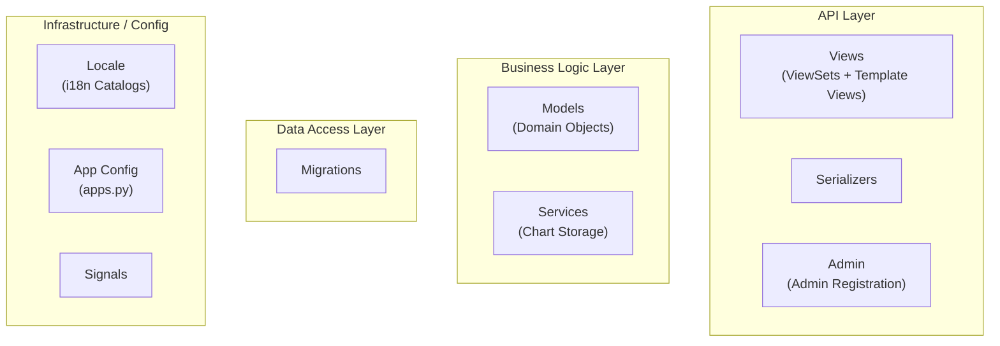

*Figure 1: Internal layer grouping of the `koalixcrm/reporting/` package. Arrows omitted intentionally; this is a structural view only.*

---

### Name Index

Long package/class names used in this document are mapped to short aliases used in diagram labels above.

| Short alias | Full name |
|---|---|
| Views | `koalixcrm/reporting/views/` — ViewSets and template-based views |
| Serialzrs | `koalixcrm/reporting/serializers/` — DRF ModelSerializer classes |
| AdminReg | `koalixcrm/reporting/admin/` — Django Admin ModelAdmin registrations |
| Models | `koalixcrm/reporting/models/` — Django ORM model classes |
| Services | `koalixcrm/reporting/services/` — Supporting services (chart generation, S3 upload) |
| Mgrtns | `koalixcrm/reporting/migrations/` — Django schema migrations |
| Locale | `koalixcrm/reporting/locale/` — Gettext translation catalogs (de, es, fr, pt_BR) |
| AppCfg | `koalixcrm/reporting/apps.py` — Django AppConfig (`ReportingConfig`) |
| Signals | `koalixcrm/reporting/signals/` — Django signal receivers |

---

### Package and Module Catalogue

#### API Layer

**`views/` — ViewSets and Template Views**

Contains Django REST Framework `ModelViewSet` subclasses (one per domain entity) and three
template-rendered views for time tracking.

| Class / File | Responsibility |
|---|---|
| `ProjectViewSet` | CRUD for `Project`; exposes the `/projects/{id}/report-data/` action that assembles the JSON snapshot for the Java PDF service |
| `TaskViewSet` | CRUD for `Task` |
| `WorkViewSet` | CRUD for `Work` (time records) |
| `AgreementViewSet` | CRUD for `Agreement` (resource rate contracts per task) |
| `EstimationViewSet` | CRUD for `Estimation` (remaining-effort estimates per reporting period) |
| `HumanResourceViewSet` | CRUD for `HumanResource` |
| `ResourceViewSet`, `ResourceTypeViewSet`, `ResourceManagerViewSet`, `ResourcePriceViewSet` | CRUD for the resource hierarchy and pricing |
| `ReportingPeriodViewSet`, `ReportingPeriodStatusViewSet` | CRUD for calendar-bounded reporting periods and their status |
| `ProjectStatusViewSet`, `TaskStatusViewSet` | CRUD for status lookup tables |
| `AgreementStatusViewSet`, `AgreementTypeViewSet` | CRUD for agreement classification lookup tables |
| `ProjectLinkTypeViewSet`, `TaskLinkTypeViewSet` | CRUD for generic-link type lookup tables |
| `GenericProjectLinkViewSet`, `GenericTaskLinkViewSet` | CRUD for polymorphic links from projects and tasks to other CRM objects (content-type FK) |
| `time_tracking.work_report` | Template view (`crm/admin/time_reporting.html`): login-required personal time sheet UI |
| `reporting_period_missing` | Template redirect view shown when no valid reporting period exists |
| `user_is_not_human_resource` | Template error view shown when authenticated user has no linked `HumanResource` |
| `create_task` | Template view for creating a new task within a project |
| `range_selection_form.RangeSelectionForm` | Django `Form` for selecting a date range in the time-tracking UI |
| `work_entry_form.WorkEntry` | Django `Form` for a single time-entry row in the time-tracking formset |
| `work_entry_formset.BaseWorkEntryFormset` | `BaseFormSet` subclass orchestrating the time-entry form collection; handles initial population from `Work` records and save dispatch |

**`serializers/` — DRF Serializers**

Contains one `ModelSerializer` per domain entity, used by the ViewSets for JSON input/output. Two
additional report-specific serializers exist for the PDF snapshot endpoint.

| Class / File | Responsibility |
|---|---|
| `ProjectJSONSerializer` | Standard CRUD serializer for `Project` |
| `ProjectReportSerializer` | Full project snapshot serializer for `/projects/{id}/report-data/`; assembles all aggregates (planned/effective costs, effort, duration) and a presigned S3 URL for the cost-overview chart |
| `_ReportTaskSerializer` | Nested serializer inside `ProjectReportSerializer`; computes per-task aggregates consumed by the project-report XSL template |
| `_ReportWorkSerializer` | Nested serializer inside `_ReportTaskSerializer`; emits work records for a task |
| `TaskSerializer`, `WorkSerializer`, `AgreementSerializer`, `EstimationSerializer`, `HumanResourceSerializer` | Standard CRUD serializers for their respective models |
| `HumanResourceReportSerializer` | Specialised human-resource serializer for report output |
| `ResourceSerializer`, `ResourceTypeSerializer`, `ResourceManagerSerializer`, `ResourcePriceSerializer` | Standard CRUD serializers for resource hierarchy |
| `ReportingPeriodSerializer`, `ReportingPeriodStatusSerializer` | Standard CRUD serializers for reporting periods and their status |
| `ProjectStatusSerializer`, `TaskStatusSerializer` | Standard CRUD serializers for status lookup tables |
| `AgreementStatusSerializer`, `AgreementTypeSerializer` | Standard CRUD serializers for agreement classification |
| `ProjectLinkTypeSerializer`, `TaskLinkTypeSerializer` | Standard CRUD serializers for link type lookup tables |
| `GenericProjectLinkSerializer`, `GenericTaskLinkSerializer` | Standard CRUD serializers for polymorphic project and task links |

**`admin/` — Django Admin Registrations**

Contains `ModelAdmin` and inline `TabularInline` subclasses, one per model, registering the domain
entities in the Django Admin interface.

| File | Responsibility |
|---|---|
| `project_admin.py` | `ProjectAdminView` — list display with cost/effort aggregates; `create_report_pdf` admin action that enqueues a `PDFExportProcess` per selected project; `ProjectInlineAdminView` for embedding projects in other admin views |
| `task_admin.py` | Admin view for `Task` with inline estimations and work records |
| `work_admin.py` | Admin view for `Work` time entries |
| `agreement_admin.py` | Admin view for `Agreement` |
| `estimation_admin.py` | Admin view for `Estimation` using `EstimationAdminForm` validation |
| `human_resource_admin.py` | Admin view for `HumanResource` |
| `reporting_period_admin.py` | Admin view for `ReportingPeriod` using `ReportingPeriodAdminForm` validation |
| `resource_manager_admin.py`, `resource_price_admin.py`, `resource_type_admin.py` | Admin views for resource hierarchy |
| `project_status_admin.py`, `task_status_admin.py`, `reporting_period_status_admin.py` | Admin views for status lookup tables |
| `agreement_status_admin.py`, `agreement_type_admin.py` | Admin views for agreement classification lookup tables |
| `project_link_type_admin.py`, `task_link_type_admin.py` | Admin views for link type lookup tables |
| `generic_project_link_admin.py`, `generic_task_link_admin.py` | Admin views for polymorphic links |

---

#### Business Logic Layer

**`models/` — Domain Objects**

All model classes extend `WorkspaceScopedModel` from `koalixcrm.core`, binding every record to a
workspace tenant. The reporting domain is structured around a project/task/work hierarchy with
supporting models for resources, pricing, and agreements.

| Class | DB Table | Responsibility |
|---|---|---|
| `Project` | `crm_project` | Root aggregate: holds project metadata, references `ProjectStatus`, `Currency`, `TemplateSet`; computes effective/planned costs and duration by aggregating across its child `Task` objects; exposes `is_reporting_allowed()` predicate |
| `Task` | `crm_task` | Child of `Project`; carries `TaskStatus` and tracks `last_status_change` on status transition; computes planned effort and costs from `Estimation` records and effective effort/costs from `Work` records; implements agreement-based cost allocation |
| `Work` | `crm_work` | Immutable once the parent `ReportingPeriod` is closed (`is_done`); records a time entry for a `HumanResource` on a `Task` within a `ReportingPeriod`; supports both start/stop timestamps and explicit `worked_hours`; exposes `effort_seconds()` / `effort_hours()` |
| `ReportingPeriod` | `crm_reportingperiod` | Calendar-bounded period scoped to a `Project`; gating model for work entry and cost confirmation; static helpers navigate predecessor/successor periods; `ReportingPeriodAdminForm` enforces non-overlapping, contiguous period chains |
| `ReportingPeriodStatus` | (lookup) | Lookup table for period lifecycle states; `is_done` flag drives immutability of linked `Work` records |
| `Estimation` | `crm_estimation` | Remaining-effort estimate for a `Task` in a given `ReportingPeriod`; carries `amount` (hours), `date_from`, `date_until`, and a `ResourcePrice` reference; `calculated_costs()` supports pro-rated cost allocation within date buckets |
| `EstimationStatus` | (lookup) | Lookup table for estimation lifecycle states |
| `Agreement` | `crm_agreement` | Rate contract associating a `Resource` with a `Task` for a date range at a specific `ResourcePrice`; `match_with_work()` determines whether a `Work` record falls under this agreement; used in `Task.effective_costs()` for agreement-prioritised billing |
| `AgreementStatus` | (lookup) | Lookup table; `is_agreed` flag activates an agreement for cost matching |
| `AgreementType` | (lookup) | Classifies agreement types |
| `Resource` | `crm_resource` | Base class for billable resources; linked to `ResourceManager` and `ResourceType` |
| `HumanResource` | `crm_humanresource` | Specialisation of `Resource` bound to a `UserExtension`; `resource_contribution_project()` returns projects worked on within a date range |
| `ResourceManager` | (lookup) | Organisational owner of resources |
| `ResourceType` | (lookup) | Classifies resource types |
| `ResourcePrice` | (lookup) | Hourly or unit price for a `Resource` |
| `ProjectStatus` | (lookup) | Lifecycle status for projects; `is_done` flag blocks new work entry on the project |
| `TaskStatus` | (lookup) | Lifecycle status for tasks; `is_done` flag blocks new work entry on the task |
| `GenericProjectLink` | `crm_genericprojectlink` | Polymorphic link from a `Project` to any other CRM object via Django content types (`content_type` + `object_id` GenericForeignKey) |
| `GenericTaskLink` | (analogous) | Polymorphic link from a `Task` to any other CRM object |
| `ProjectLinkType` | (lookup) | Classifies project link types |
| `TaskLinkType` | (lookup) | Classifies task link types |

**`services/` — Chart Storage**

| Class / Function | Responsibility |
|---|---|
| `build_project_cost_overview_svg_bytes(project)` | Renders an SVG line chart (matplotlib/pandas) comparing accumulated effective confirmed costs, effective unconfirmed costs, and planned costs across all reporting periods; returns raw bytes without filesystem I/O |
| `upload_project_cost_overview_svg(project)` | Calls `build_project_cost_overview_svg_bytes`, uploads the SVG to MinIO/S3 under the `report-charts/` prefix, and returns a presigned GET URL valid for `PRESIGNED_URL_EXPIRES_IN` seconds (default 300); the URL is embedded in the `ProjectReportSerializer` JSON payload for the Java PDF service to fetch |

---

#### Data Access Layer

**`migrations/`**

Contains two Django schema migrations:

| Migration | Summary |
|---|---|
| `0001_initial.py` | Creates all initial reporting tables: `crm_project`, `crm_task`, `crm_work`, `crm_reportingperiod`, `crm_estimation`, `crm_agreement`, `crm_resource`, `crm_humanresource`, and all lookup tables |
| `0002_workspace_scoping.py` | Adds workspace-scoping foreign keys to reporting models in alignment with the `WorkspaceScopedModel` base class introduced in `core` |

---

#### Infrastructure / Config

**`apps.py`**

Defines `ReportingConfig(AppConfig)` with `name = 'koalixcrm.reporting'` and `label = 'reporting'`.
The app does not declare `required_peers` or `optional_peers` via the central
`register_peer_check` helper — its peer dependencies (`core`, `contacts`, `contracts`,
`djangoUserExtension`) are enforced by the core module's system check infrastructure. The `signals/`
package is present but empty, reserved for future signal receiver registration.

**`locale/`**

Gettext translation catalogs for German (`de`), Spanish (`es`), French (`fr`), and Brazilian
Portuguese (`pt_BR`). All user-facing strings in models and admin use Django's `gettext` (`_()`)
wrapper.

---

### Key Collaboration Patterns

The following prose summarises the most significant cross-package collaborations within the `reporting`
app. Note that this is a structural description; fine-grained method-level dependency graphs are out of
scope for this document.

**Cost and effort aggregation.** `Project.effective_costs()` and `Project.effective_effort()` iterate
over child `Task` objects. `Task.effective_costs()` reads `Work` records, matches them against
`Agreement` entries using `Agreement.match_with_work()`, and prices them via `ResourcePrice`. Unmatched
work falls back to the resource's default `ResourcePrice`. `Task.planned_costs()` reads `Estimation`
records and delegates pro-rated cost calculation to `Estimation.calculated_costs()`.

**Reporting period immutability.** `Work.save()` and `Work.delete()` call `self.confirmed()`, which
reads `self.reporting_period.status.is_done`. When the period is closed, both mutating operations raise
`ReportingPeriodDoneDeleteNotPossible`. This invariant is enforced at the model layer, not only at the
API layer.

**PDF report snapshot assembly.** The `ProjectViewSet.report_data()` action delegates to
`ProjectReportSerializer`, which assembles the full project snapshot JSON. The serializer calls
`upload_project_cost_overview_svg()` from the `services` package to upload the cost chart to S3 and
embed the presigned URL. The Java PDF export service fetches this JSON, downloads the chart URL, and
renders the PDF with XSL/FOP.

**Time-tracking UI.** The `work_report` template view orchestrates `RangeSelectionForm` and
`BaseWorkEntryFormset` to provide a personal time sheet. On POST, `WorkEntry.update_work()` persists or
updates `Work` records. The view enforces the `@login_required` decorator and handles several exception
types from `djangoUserExtension` and `core` by redirecting to dedicated error pages.

---

### External Dependencies of the Reporting App

The `reporting` app imports from the following peer apps. These dependencies are the concrete
realisation of the `required_peers` matrix documented in
[QQ_SD_ServiceArchitecture.md](QQ_SD_ServiceArchitecture.md).

| Dependency | Used for |
|---|---|
| `koalixcrm.core.models.workspace_scoped.WorkspaceScopedModel` | Base class for all reporting models; provides workspace tenant scoping |
| `koalixcrm.core.exceptions` | `ReportingPeriodNotFound`, `UserIsNoHumanResource`, `ReportingPeriodDoneDeleteNotPossible` |
| `koalixcrm.core.models.Currency` | FK on `Project.default_currency`; used for rounding in cost calculations |
| `koalixcrm.core.models.Unit` | FK on `Agreement.unit` |
| `koalixcrm.core.models.pdf_export_process.PDFExportProcess` | Created in `ProjectAdminView.create_report_pdf` to enqueue async PDF rendering |
| `koalixcrm.djangoUserExtension.models.user_extension.UserExtension` | FK on `HumanResource.user`; used in the time-tracking view to resolve the current user to a `HumanResource` |
| `koalixcrm.djangoUserExtension.exceptions` | `UserExtensionMissing`, `TooManyUserExtensionsAvailable` — caught in the time-tracking view |
| `koalixcrm.djangoUserExtension.models.TemplateSet` | FK on `Project.default_template_set` |
| `koalixcrm.shared.base_model_view_set.BaseModelViewSet` | Base ViewSet providing workspace-filtered querysets |
| `koalixcrm.shared.workspace_scoped_view_set.WorkspaceScopedViewSetMixin` | Mixin injecting workspace scoping into ViewSet queryset and URL kwargs |
| `koalixcrm_utils.aws_clients.get_s3_client` | S3 client factory used in `chart_storage.upload_project_cost_overview_svg` |

---

## Contracts App — Internal Package Structure

### Overview

The `contracts` Django app (label `contract_object_management`, ~5,438 LoC) is the commercial-document
management core of koalixcrm. It models the full sales and procurement document lifecycle: contracts,
quotations, sales orders, purchase orders, invoices, credit notes, despatch advices, and payment
reminders. All document types inherit from a shared `CommercialDocument` base and carry structured
line items (`CommercialDocumentPosition`) together with party, address, phone, and e-mail assignment
records for both the contract-level and document-level buyer/seller roles.

The app declares `required_peers = ('koalixcrm.core', 'koalixcrm.contacts')` and
`optional_peers = ('koalixcrm.products', 'koalixcrm.djangoUserExtension')` in its `AppConfig`.
Peer-dependency enforcement is handled by the `register_peer_check` helper imported from `core`.

The REST API routes are defined in `urls.py` and are mounted under
`/koalixcrm_contracts/api/v1/<workspace_id>/` (pending CR-002 completion). The URL file references
a companion package `koalixcrm_contracts_api_py` for the ViewSet implementations already wired in
the view layer.

---

### Layered Architecture Diagram

The diagram below shows the internal layers of `koalixcrm/contracts/` and the packages within each
layer. No inter-package dependencies are shown; this is a structural view only.

**Figure 2 — Contracts App: Layered Package Structure**

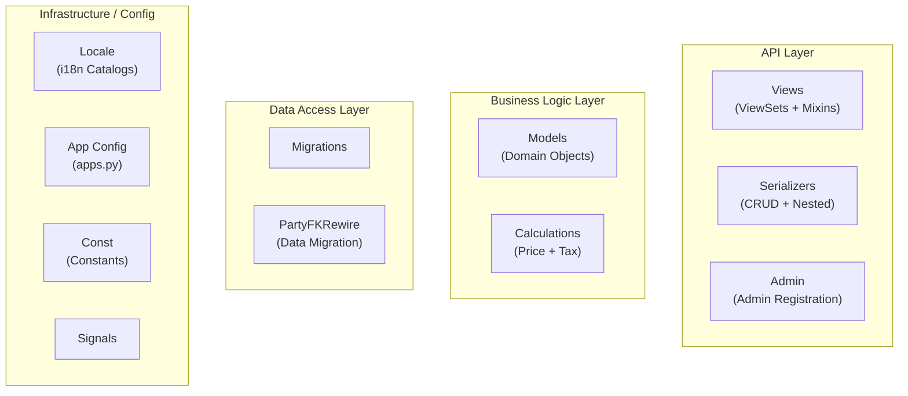

*Figure 2: Internal layer grouping of the `koalixcrm/contracts/` package. Arrows omitted intentionally; this is a structural view only.*

---

### Name Index

| Short alias | Full name |
|---|---|
| Views | `koalixcrm/contracts/views/` — DRF ViewSets and view mixins |
| Serialzrs | `koalixcrm/contracts/serializers/` — DRF ModelSerializer and nested serializer classes |
| AdminReg | `koalixcrm/contracts/admin/` — Django Admin ModelAdmin and inline registrations |
| Models | `koalixcrm/contracts/models/` — Django ORM model classes |
| Calcs | `koalixcrm/contracts/models/calculations.py` — Stateless price and tax calculation utility |
| Mgrtns | `koalixcrm/contracts/migrations/` — Django schema migrations (0001–0015) |
| PtyRewire | `koalixcrm/contracts/party_fk_rewire.py` — Data migration helper for party FK back-population |
| Locale | `koalixcrm/contracts/locale/` — Gettext translation catalogs (de, es, fr, pt_BR) |
| AppCfg | `koalixcrm/contracts/apps.py` — Django AppConfig (`ContractObjectManagementConfig`) |
| Const | `koalixcrm/contracts/const/` — App-level constants package |
| Signals | `koalixcrm/contracts/signals/` — Django signal receivers (currently empty, reserved) |

---

### Package and Module Catalogue

#### API Layer

**`views/` — ViewSets and View Mixins**

Contains one DRF `BaseModelViewSet` subclass per document type plus two shared utility classes used
across multiple ViewSets.

| Class / File | Responsibility |
|---|---|
| `ContractViewSet` | CRUD for `Contract` |
| `QuotationViewSet` | CRUD for `Quotation`; mixes in `NestedDetailMixin` to expose the full UBL document snapshot via a `/nested/` action |
| `SalesOrderViewSet` | CRUD for `SalesOrder` |
| `InvoiceViewSet` | CRUD for `Invoice`; mixes in `NestedDetailMixin` |
| `CreditNoteViewSet` | CRUD for `CreditNote`; mixes in `NestedDetailMixin` |
| `PurchaseOrderViewSet` | CRUD for `PurchaseOrder`; mixes in `NestedDetailMixin` |
| `DespatchAdviceViewSet` | CRUD for `DespatchAdvice`; mixes in `NestedDetailMixin` |
| `PaymentReminderViewSet` | CRUD for `PaymentReminder`; mixes in `NestedDetailMixin` |
| `CommercialDocumentPositionViewSet` | CRUD for line-item positions (`CommercialDocumentPosition`) |
| `CommercialDocumentMediaViewSet` | CRUD for attached media files (`CommercialDocumentMedia`); uses `ModelPermissionsWithListView` from `koalixcrm.shared` |
| `NestedDetailMixin` | Shared mixin providing the `nested()` action that renders a document using a type-specific `nested_serializer_class`; used by all document-type ViewSets that need a full UBL-style detail snapshot |
| `CreateNewDocumentView` | Utility mixin providing `create_new_document()` — copies an existing commercial document (and its positions) to a new document type; used by admin actions |

**`serializers/` — DRF Serializers**

Contains per-entity CRUD serializers plus a rich nested-document serializer hierarchy used by the
`/nested/` action endpoints.

| Class / File | Responsibility |
|---|---|
| `ContractJSONSerializer` | Standard CRUD serializer for `Contract` |
| `CommercialDocumentJSONSerializer` | Standard CRUD serializer for the base `CommercialDocument` fields |
| `CommercialDocumentPositionJSONSerializer` | Standard CRUD serializer for `CommercialDocumentPosition` line items |
| `CommercialDocumentMediaJSONSerializer` | Standard CRUD serializer for `CommercialDocumentMedia` attachments |
| `QuotationJSONSerializer` | Standard CRUD serializer for `Quotation` |
| `SalesOrderJSONSerializer` | Standard CRUD serializer for `SalesOrder` |
| `InvoiceJSONSerializer` | Standard CRUD serializer for `Invoice` |
| `CreditNoteJSONSerializer` | Standard CRUD serializer for `CreditNote` |
| `PurchaseOrderJSONSerializer` | Standard CRUD serializer for `PurchaseOrder` |
| `DespatchAdviceJSONSerializer` | Standard CRUD serializer for `DespatchAdvice` |
| `PaymentReminderJSONSerializer` | Standard CRUD serializer for `PaymentReminder` |
| `_BaseCommercialDocumentNestedSerializer` | Base nested serializer that assembles a full document snapshot including party contacts, addresses, phone and e-mail assignments, currency, tax, and unit details — sourced from `contacts`, `core`, and `djangoUserExtension` |
| `InvoiceNestedSerializer`, `QuotationNestedSerializer`, `DespatchAdviceNestedSerializer`, `PurchaseOrderNestedSerializer`, `PaymentReminderNestedSerializer`, `CreditNoteNestedSerializer` | Document-type-specific extensions of `_BaseCommercialDocumentNestedSerializer`; add document-type fields (e.g. payment terms, due date) for the `/nested/` snapshot used by the Java PDF service |
| `NestedAddressSerializer`, `NestedPhoneSerializer`, `NestedEmailSerializer`, `PartyNestedSerializer`, `ProductTypeNestedSerializer`, `PositionNestedSerializer` | Supporting read-only serializers embedded inside the nested document snapshot; resolve FK relations across `contacts`, `products`, and `core` |

**`admin/` — Django Admin Registrations**

Contains `ModelAdmin`, stacked-inline, and tabular-inline subclasses registering all contracts domain
entities in the Django Admin interface.

| File | Responsibility |
|---|---|
| `contract_admin.py` | `OptionContract` — list display with linked quotations and invoices; inline classes for address, phone, and e-mail assignments; admin actions to create invoice, quotation, and purchase order from the contract |
| `commercial_document_admin.py` | `OptionCommercialDocument` — base admin class from which all document-type admins inherit; inline classes for positions, text paragraphs, address, phone, and e-mail assignments; admin action `create_pdf` that enqueues `PDFExportProcess`; optional `create_task` action that delegates to `reporting.views.create_task.CreateTaskView` |
| `invoice_admin.py` | `OptionInvoice(OptionCommercialDocument)` — adds `register_invoice_in_accounting` and `register_payment_in_accounting` admin actions; `create_credit_note_from_invoice` action; `InlineInvoice` for embedding invoices in the contract admin |
| `quotation_admin.py` | `OptionQuotation(OptionCommercialDocument)` — adds `create_invoice`, `create_sales_order`, `create_purchase_order` actions; `InlineQuotation` inline |
| `sales_order_admin.py` | `OptionSalesOrder(OptionCommercialDocument)` |
| `credit_note_admin.py` | `OptionCreditNote(OptionCommercialDocument)` — adds `register_credit_note_in_accounting` action |
| `purchase_order_admin.py` | `OptionPurchaseOrder(OptionCommercialDocument)` |
| `despatch_advice_admin.py` | `OptionDespatchAdvice(OptionCommercialDocument)` |
| `payment_reminder_admin.py` | `OptionPaymentReminder(OptionCommercialDocument)` |
| `commercial_document_position_admin.py` | Admin view for `CommercialDocumentPosition` line items |
| `commercial_document_media_admin.py` | Admin view for `CommercialDocumentMedia` attachments |

---

#### Business Logic Layer

**`models/` — Domain Objects**

All model classes extend `WorkspaceScopedModel` from `koalixcrm.core`, binding every record to a
workspace tenant. The domain is structured around a `Contract` root aggregate that can spawn
`CommercialDocument` subtypes; each document carries typed assignment records for addresses, phones,
and e-mails.

| Class | Responsibility |
|---|---|
| `Contract` | Root aggregate: holds buyer/seller party references and links to a `TemplateSet`; factory methods `create_invoice()`, `create_quotation()`, `create_purchase_order()` spawn document subtypes; `get_template_set()` resolves the print template |
| `ContractAddressAssignment` | Address role assignment for a `Contract` (purpose-typed FK to `contacts.Address`) |
| `ContractPhoneAssignment` | Phone role assignment for a `Contract` (purpose-typed FK to `contacts.PhoneNumber`) |
| `ContractEmailAssignment` | E-mail role assignment for a `Contract` (purpose-typed FK to `contacts.PartyEmail`) |
| `CommercialDocument` | Abstract-like base model for all commercial documents; carries `party`, `currency`, `date_of_document`, `payment_bank_reference`, `template_set`, and `is_complete_with_price()` predicate; factory method `create_commercial_document()` copies positions and text paragraphs from a source document; holds multi-purpose address/phone/e-mail assignment records |
| `CommercialDocumentAddressAssignment` | Address role assignment for a `CommercialDocument` (purpose-typed FK to `contacts.Address`) |
| `CommercialDocumentPhoneAssignment` | Phone role assignment for a `CommercialDocument` |
| `CommercialDocumentEmailAssignment` | E-mail role assignment for a `CommercialDocument` |
| `TextParagraphInCommercialDocument` | Free-text paragraph block attached to a `CommercialDocument`; `create_paragraph()` copies from a template |
| `CommercialDocumentPosition` | Line-item position (`Position` mixin + `WorkspaceScopedModel`): carries `product_type` FK (to `products.ProductType`), `unit`, `quantity`, `position_unit_transform`, and `discount`; `add_positions()` / `create_position()` factory helpers copy positions between documents |
| `Quotation` | `CommercialDocument` subtype: adds `create_from_reference()` to copy from a `Contract` |
| `SalesOrder` | `CommercialDocument` subtype: `create_from_reference()` copies from a `Quotation` |
| `Invoice` | `CommercialDocument` subtype: adds `register_invoice_in_accounting()` / `register_payment_in_accounting()` delegation hooks; `create_from_reference()` copies from a `Contract` or `Quotation` |
| `CreditNote` | `CommercialDocument` subtype: adds `register_credit_note_in_accounting()` delegation hook; `create_from_reference()` copies from an `Invoice` |
| `PurchaseOrder` | `CommercialDocument` subtype: `create_from_reference()` copies from a `Contract` |
| `DespatchAdvice` | `CommercialDocument` subtype: `create_from_reference()` copies from a `SalesOrder` or `PurchaseOrder` |
| `PaymentReminder` | `CommercialDocument` subtype: `create_from_reference()` copies from an `Invoice` |
| `CommercialDocumentMedia` | File attachment linked to a `CommercialDocument`; workspace-scoped |

**`models/calculations.py` — Price and Tax Calculations**

| Class / Method | Responsibility |
|---|---|
| `Calculations` | Stateless utility class (no ORM fields); `calculate_document_price(document, pricing_date)` iterates all positions and returns the total net price in the document currency; `calculate_position_price(position, pricing_date, currency)` resolves the unit price from `products.ProductType` and applies quantity, discount, and unit conversion; `calculate_position_tax(position, currency)` computes the tax amount for a single position using the product's tax rate |

---

#### Data Access Layer

**`migrations/` — Schema Migrations**

Fifteen Django schema migrations covering the full evolution of the contracts data model:

| Migration | Summary |
|---|---|
| `0001_initial.py` | Creates initial contract and sales-document tables |
| `0002_initial.py` | Extends the initial schema with additional document fields |
| `0003_add_sales_document_media.py` | Adds the media attachment table |
| `0004_rename_sales_document_to_commercial_document.py` | Renames the `SalesDocument` model family to `CommercialDocument` |
| `0005_add_credit_note.py` | Adds the `CreditNote` table |
| `0006_ubl_document_rename.py` | Renames UBL document fields for standard alignment |
| `0007_ubl_document_meta.py` | Adds UBL metadata fields (party reference, bank reference) |
| `0008_party_fks.py` | Introduces generic `Party` FK columns on documents and contracts |
| `0009_tighten_party_fk.py` | Tightens nullability constraints on the party FK columns |
| `0010_drop_legacy_customer_fks.py` | Drops the pre-party-model customer FKs |
| `0011_workspace_scoping.py` | Adds workspace-scoping FK to all contracts models |
| `0012_position_tax_rate.py` | Adds `tax_rate` field to `CommercialDocumentPosition` |
| `0013_contract_address_assignments.py` | Creates address/phone/e-mail assignment tables for `Contract` |
| `0014_commercial_document_address_assignments.py` | Creates address/phone/e-mail assignment tables for `CommercialDocument` |
| `0015_commercialdocument_field_renames.py` | Renames legacy field names to match the current model API |

**`party_fk_rewire.py` — Data Migration Helper**

| Function | Responsibility |
|---|---|
| `populate_party_fks(apps, schema_editor)` | Back-fills the new `party` FK columns on existing `Contract` and `CommercialDocument` rows from the legacy customer FK; used by migration `0009` |
| `clear_party_fks(apps, schema_editor)` | Clears the party FK columns; used by the reverse operation of the same migration |

---

#### Infrastructure / Config

**`apps.py`**

Defines `ContractObjectManagementConfig(AppConfig)` with `name = 'koalixcrm.contracts'`,
`label = 'contract_object_management'`, `required_peers = ('koalixcrm.core', 'koalixcrm.contacts')`,
and `optional_peers = ('koalixcrm.products', 'koalixcrm.djangoUserExtension')`. On `ready()` it
registers the app's peer-dependency system check via `koalixcrm.core.app_checks.register_peer_check`.

**`locale/`**

Gettext translation catalogs for German (`de`), Spanish (`es`), French (`fr`), and Brazilian
Portuguese (`pt_BR`). All user-facing strings in models and admin use Django's `gettext` (`_()`)
wrapper.

**`const/`**

Empty constants package (`__init__.py` only), reserved for app-level constant definitions.

**`signals/`**

Empty signal receiver package, reserved for future signal registration.

---

### Key Collaboration Patterns

**Document lifecycle factory chain.** `Contract.create_invoice()`, `create_quotation()`, and
`create_purchase_order()` each call the corresponding `CommercialDocument.create_commercial_document()`
factory, which in turn calls `attach_commercial_document_positions()` and `attach_text_paragraphs()`
to copy positions and free-text paragraphs from the source document. Each document-type subtype further
extends this with its own `create_from_reference()` — e.g. `Invoice.create_from_reference()` and
`CreditNote.create_from_reference()` — enabling a traceable chain from contract through quotation,
sales order, invoice, and credit note.

**Price and tax computation.** `Calculations.calculate_document_price()` iterates positions and
delegates per-position pricing to `calculate_position_price()`, which resolves the unit price from
`products.ProductType` (optional peer). `calculate_position_tax()` applies the tax rate stored on the
position after migration `0012`. This logic is exercised in the admin's `create_pdf` action (which
calls `Calculations` before enqueueing a `PDFExportProcess`) and in the `/nested/` serializer
endpoint for the Java PDF service.

**Nested UBL snapshot for PDF rendering.** Document-type ViewSets that mix in `NestedDetailMixin`
expose a `/nested/` action. The action delegates to the per-type `nested_serializer_class` (one of
`InvoiceNestedSerializer`, `QuotationNestedSerializer`, etc.), which extends
`_BaseCommercialDocumentNestedSerializer`. That base serializer resolves party contacts from
`contacts.Party`, `contacts.Organization`, and `contacts.PartyContact`; inlines address, phone, and
e-mail assignments; and embeds currency, tax, and unit details from `core` serializers. The resulting
JSON payload is consumed by the external Java PDF rendering service.

**Accounting integration hooks.** `Invoice.register_invoice_in_accounting()`,
`Invoice.register_payment_in_accounting()`, and `CreditNote.register_credit_note_in_accounting()` are
plugin extension points — they are defined on the model but their bodies are expected to be provided
by a `koalixcrm.plugin` import. Admin actions in `invoice_admin.py` and `credit_note_admin.py`
surface these hooks as Django Admin bulk actions.

---

### External Dependencies of the Contracts App

| Dependency | Used for |
|---|---|
| `koalixcrm.core.models.workspace_scoped.WorkspaceScopedModel` | Base class for all contracts models; provides workspace tenant scoping |
| `koalixcrm.core.models.Currency` | FK on `CommercialDocument.currency`; used for rounding in `Calculations` |
| `koalixcrm.core.models.Unit` | FK on `CommercialDocumentPosition.unit`; resolved lazily via `apps.get_model` |
| `koalixcrm.core.models.pdf_export_process.PDFExportProcess` | Created in `OptionCommercialDocument.create_pdf` admin action to enqueue async PDF rendering |
| `koalixcrm.core.exceptions` | Exceptions caught and raised in view and model layers |
| `koalixcrm.core.admin.workspace_scoped_admin.WorkspaceScopedModelAdmin` | Base class for all contracts admin views |
| `koalixcrm.core.serializers` | `CurrencyJSONSerializer`, `OptionTaxJSONSerializer`, `OptionUnitJSONSerializer` — embedded in `_BaseCommercialDocumentNestedSerializer` |
| `koalixcrm.contacts.models.Party` | FK on `CommercialDocument.party` and `Contract`; resolved by nested serializer to expand full party detail |
| `koalixcrm.contacts.models` (Address, PhoneNumber, PartyEmail, Organization, PartyContact, AddressAssignment, PhoneAssignment, EmailAssignment) | Referenced by assignment models and resolved in the nested serializer |
| `koalixcrm.products.ProductType` | FK on `CommercialDocumentPosition.product_type` (optional peer); price resolved by `Calculations.calculate_position_price()` |
| `koalixcrm.djangoUserExtension.models.UserExtension` | Referenced in `CommercialDocument` via `djangoUserExtension` optional peer; resolved in the nested serializer for the creator/responsible user |
| `koalixcrm.djangoUserExtension.models.TemplateSet` | FK on `CommercialDocument.template_set`; resolved via `Contract.get_template_set()` |
| `koalixcrm.reporting.views.create_task.CreateTaskView` | Optional dependency: `OptionCommercialDocument` admin lazily imports this for the `create_task` admin action |
| `koalixcrm.shared.base_model_view_set.BaseModelViewSet` | Base ViewSet providing workspace-filtered querysets |
| `koalixcrm.shared.permissions.ModelPermissionsWithListView` | DRF permission class used by `CommercialDocumentMediaViewSet` |
| `koalixcrm.plugin` | Plugin extension mechanism imported by model and admin modules; provides the accounting integration hooks |
| `koalixcrm.global_support_functions.limit_string_length` | Utility used in `Invoice.__str__`, `Quotation.__str__`, and `CreditNote.__str__` |

---

## Contacts App — Internal Package Structure

### Overview

The `contacts` Django app (label `contacts`, ~3,562 LoC) is the foundational party-management module
of koalixcrm. It provides the universal `Party` aggregate — the single authoritative record for any
legal or natural person that interacts with the business — together with its two concrete subtypes
(`Organization` and `PartyContact`), reusable contact value objects (`Address`, `PhoneNumber`,
`PartyEmail`), and a set of purpose-typed assignment join tables that link those value objects to a
party. Role classification, group membership, and identification-scheme records complete the domain.

The app is the only one in the stack that declares `required_peers = ('koalixcrm.core',)` and no
optional peers, making it a foundational dependency: every other app that handles parties, addresses,
or commercial documents imports directly from `koalixcrm.contacts.models`. Peer-dependency enforcement
is handled by the `register_peer_check` helper imported from `core`.

The REST API routes are defined in `urls.py` and are expected to be mounted at
`/koalixcrm_contacts/api/v1/<workspace_id>/` once CR-002 lands. The URL file imports ViewSet
implementations from the companion package `koalixcrm_contacts_api_py`.

The app underwent a major data-model migration from a legacy flat Contact/Customer/Supplier/Person
schema to the current Party model in the v1.14.0 → v2.0.0 upgrade path (issues #198, #392–#396).
The `backfill.py` module and the `management/commands/` package support that migration.

---

### Layered Architecture Diagram

The diagram below shows the internal layers of `koalixcrm/contacts/` and the packages within each
layer. No inter-package dependencies are shown; this is a structural view only.

**Figure 3 — Contacts App: Layered Package Structure**

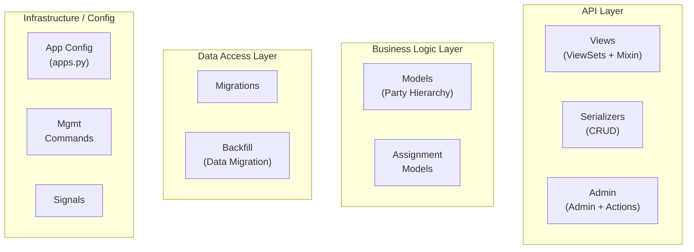

*Figure 3: Internal layer grouping of the `koalixcrm/contacts/` package. Arrows omitted intentionally; this is a structural view only.*

---

### Name Index

| Short alias | Full name |
|---|---|
| Views | `koalixcrm/contacts/views/` — DRF ViewSets and workspace-scoping mixin |
| Serialzrs | `koalixcrm/contacts/serializers/` — DRF ModelSerializer classes |
| AdminReg | `koalixcrm/contacts/admin/` — Django Admin ModelAdmin registrations and bulk conversion actions |
| Models | `koalixcrm/contacts/models/` — Django ORM model classes (Party hierarchy and value objects) |
| AssgnMdls | `koalixcrm/contacts/models/` — Assignment join-table models (`AddressAssignment`, `PhoneAssignment`, `EmailAssignment`) |
| Mgrtns | `koalixcrm/contacts/migrations/` — Django schema migrations (0001–0015) |
| Backfill | `koalixcrm/contacts/backfill.py` and `backfill_verify.py` — Legacy-to-Party data migration helpers |
| AppCfg | `koalixcrm/contacts/apps.py` — Django AppConfig (`ContactsConfig`) |
| MgmtCmds | `koalixcrm/contacts/management/commands/` — Management commands for migration dry-run and reconciliation |
| Signals | `koalixcrm/contacts/signals/` — Django signal receiver package (currently empty, reserved) |

---

### Package and Module Catalogue

#### API Layer

**`views/` — ViewSets and Workspace-Scoping Mixin**

Contains one DRF `BaseModelViewSet` subclass per domain entity plus one shared mixin applied to all
ViewSets in this app.

| Class / File | Responsibility |
|---|---|
| `WorkspaceScopedViewSetMixin` | Mixin applied to all contacts ViewSets; filters querysets by `request.active_workspace` and stamps the active workspace on `perform_create`; falls back to a default `Workspace` for superusers when no active workspace is present |
| `PartyViewSet` | CRUD for the base `Party` aggregate |
| `OrganizationViewSet` | CRUD for `Organization` (legal-entity subtype of `Party`) |
| `PartyContactViewSet` | CRUD for `PartyContact` (natural-person subtype of `Party`) |
| `PartyIdentificationViewSet` | CRUD for `PartyIdentification` (scheme-keyed external identifiers, e.g. VAT number) |
| `PartyRoleViewSet` | CRUD for `PartyRole` (customer, supplier, or other role assignments) |
| `OrganizationMembershipViewSet` | CRUD for `OrganizationMembership` (contact-in-organization links) |
| `OrganizationRelationshipViewSet` | CRUD for `OrganizationRelationship` (parent/child organization links) |
| `AddressViewSet` | CRUD for `Address` (shared postal address value object) |
| `AddressAssignmentViewSet` | CRUD for `AddressAssignment` (purpose-typed party-to-address links) |
| `PhoneNumberViewSet` | CRUD for `PhoneNumber` (E.164 phone value object) |
| `PhoneAssignmentViewSet` | CRUD for `PhoneAssignment` (purpose-typed party-to-phone links) |
| `PartyEmailViewSet` | CRUD for `PartyEmail` (e-mail address value object) |
| `EmailAssignmentViewSet` | CRUD for `EmailAssignment` (purpose-typed party-to-email links) |
| `PartyGroupViewSet` | CRUD for `PartyGroup` (named group, optionally scoped to a role type) |
| `PartyGroupMembershipViewSet` | CRUD for `PartyGroupMembership` (party-in-group links) |
| `CustomerBillingCycleViewSet` | CRUD for `CustomerBillingCycle` (payment terms lookup) |

**`serializers/` — DRF Serializers**

Contains one flat `ModelSerializer` per domain entity. All serializers expose relationships as IDs;
no nested serialization is performed at this layer (nested expansion for PDF output lives in
`contracts/serializers/`).

| Class / File | Responsibility |
|---|---|
| `PartyJSONSerializer` | Standard CRUD serializer for `Party` base fields |
| `OrganizationJSONSerializer` | Standard CRUD serializer for `Organization` (extends Party fields with legal-entity attributes) |
| `PartyContactJSONSerializer` | Standard CRUD serializer for `PartyContact` (extends Party fields with personal attributes and GDPR consent date) |
| `PartyIdentificationJSONSerializer` | Standard CRUD serializer for `PartyIdentification` |
| `PartyRoleJSONSerializer` | Standard CRUD serializer for `PartyRole` |
| `OrganizationMembershipJSONSerializer` | Standard CRUD serializer for `OrganizationMembership` |
| `OrganizationRelationshipJSONSerializer` | Standard CRUD serializer for `OrganizationRelationship` |
| `AddressJSONSerializer` | Standard CRUD serializer for `Address` |
| `AddressAssignmentJSONSerializer` | Standard CRUD serializer for `AddressAssignment` |
| `PhoneNumberJSONSerializer` | Standard CRUD serializer for `PhoneNumber` |
| `PhoneAssignmentJSONSerializer` | Standard CRUD serializer for `PhoneAssignment` |
| `PartyEmailJSONSerializer` | Standard CRUD serializer for `PartyEmail` |
| `EmailAssignmentJSONSerializer` | Standard CRUD serializer for `EmailAssignment` |
| `PartyGroupJSONSerializer` | Standard CRUD serializer for `PartyGroup` |
| `PartyGroupMembershipJSONSerializer` | Standard CRUD serializer for `PartyGroupMembership` |
| `CustomerBillingCycleJSONSerializer` | Full CRUD serializer for `CustomerBillingCycle` including integer payment-day fields |
| `OptionCustomerBillingCycleJSONSerializer` | Read-only slim serializer (id + name only) for embedding billing cycle references in other serializers |

**`admin/` — Django Admin Registrations and Bulk Actions**

Contains `ModelAdmin` subclasses for all contacts domain entities and two bulk admin action functions
for reclassifying parties between subtypes.

| File / Class | Responsibility |
|---|---|
| `party_admin.py` / `PartyAdmin` | List display for `Party` with display name, language, and creation date |
| `party_admin.py` / `OrganizationAdmin` | List display for `Organization` with legal attributes; surfaces the `convert_organizations_to_contacts` bulk action |
| `party_admin.py` / `PartyContactAdmin` | List display for `PartyContact` with name fields and GDPR consent date; surfaces the `convert_contacts_to_organizations` bulk action |
| `party_admin.py` / `PartyIdentificationAdmin` | List display for `PartyIdentification` filtered by scheme |
| `party_admin.py` / `PartyRoleAdmin` | List display for `PartyRole` filtered by role type and primary flag |
| `party_admin.py` / `OrganizationMembershipAdmin` | List display for `OrganizationMembership` |
| `party_admin.py` / `OrganizationRelationshipAdmin` | List display for `OrganizationRelationship` filtered by relationship type |
| `party_admin.py` / `AddressAdmin` | List display for `Address` with searchable street, zip code, and town |
| `party_admin.py` / `AddressAssignmentAdmin` | List display for `AddressAssignment` filtered by purpose and primary flag |
| `party_admin.py` / `PhoneNumberAdmin` | List display for `PhoneNumber` with E.164 search |
| `party_admin.py` / `PhoneAssignmentAdmin` | List display for `PhoneAssignment` filtered by purpose and primary flag |
| `party_admin.py` / `PartyEmailAdmin` | List display for `PartyEmail` with e-mail search |
| `party_admin.py` / `EmailAssignmentAdmin` | List display for `EmailAssignment` filtered by purpose and primary flag |
| `party_admin.py` / `PartyGroupAdmin` | List display for `PartyGroup` filtered by role type scope |
| `party_admin.py` / `PartyGroupMembershipAdmin` | List display for `PartyGroupMembership` |
| `customer_billing_cycle_admin.py` / `OptionCustomerBillingCycle` | Full admin view for `CustomerBillingCycle` with payment-day fields |
| `actions.py` / `convert_organizations_to_contacts` | Bulk admin action: swaps the MTI-child DB row from `crm_organization` to `crm_partycontact` for each selected `Organization`; preserves the parent `Party` row and all attached assignments; removes `OrganizationMembership` and `OrganizationRelationship` rows that become meaningless after conversion |
| `actions.py` / `convert_contacts_to_organizations` | Bulk admin action: swaps the MTI-child DB row from `crm_partycontact` to `crm_organization`; recombines given/family name into `legal_name` |

---

#### Business Logic Layer

**`models/` — Party Hierarchy and Value Objects**

All model classes extend `WorkspaceScopedModel` from `koalixcrm.core`. The domain is structured
around a `Party` root aggregate with two multi-table inheritance (MTI) subtypes and a set of
standalone value-object and assignment-table models.

| Class | DB Table | Responsibility |
|---|---|---|
| `Party` | `crm_party` | Root aggregate for any legal or natural person; carries `display_name`, `default_language`, `last_modified_by`, and an optional `default_billing_cycle` FK to `CustomerBillingCycle` (populated for parties that play the customer role); workspace-scoped |
| `Organization` | `crm_organization` | MTI subtype of `Party` for legal entities; adds `legal_form`, `legal_name`, `registration_number`, and `legal_seat_country`; used as the FK target on commercial documents for buyer/seller parties |
| `PartyContact` | `crm_partycontact` | MTI subtype of `Party` for natural persons (transitional name; to be renamed `Contact` in a follow-up pass); adds `prefix`, `given_name`, `family_name`, `date_of_birth`, and `gdpr_consent_date` |
| `Address` | `crm_address` | Standalone postal address value object; carries `street`, `number`, `additional_address_line_1/2/3`, `zip_code`, `town`, `state`, `country`, and `subdivision_code` (ISO 3166-2 suffix); referenced from `AddressAssignment` |
| `PhoneNumber` | `crm_phonenumber` | Standalone phone value object; stores a single E.164-formatted number; referenced from `PhoneAssignment` |
| `PartyEmail` | `crm_partyemail` | Standalone e-mail address value object (transitional name; to be renamed `EmailAddress`); stores a single validated e-mail field; referenced from `EmailAssignment` |
| `AddressAssignment` | `crm_addressassignment` | Purpose-typed join table linking a `Party` to an `Address`; carries `purpose` (billing/shipping/other), `is_primary`, `valid_from`, `valid_to`; workspace-scoped |
| `PhoneAssignment` | `crm_phoneassignment` | Purpose-typed join table linking a `Party` to a `PhoneNumber`; same validity and purpose fields as `AddressAssignment`; workspace-scoped |
| `EmailAssignment` | `crm_emailassignment` | Purpose-typed join table linking a `Party` to a `PartyEmail`; same validity and purpose fields; workspace-scoped |
| `PartyRole` | `crm_partyrole` | Assigns a typed role (`customer`, `supplier`, or other choice from `PARTY_ROLE_CHOICES`) to a `Party` for a validity period; supports `is_primary` flag; workspace-scoped |
| `PartyIdentification` | `crm_partyidentification` | Attaches a scheme-keyed external identifier (e.g. VAT number, EAN, GLN) to a `Party` for a validity period; workspace-scoped |
| `OrganizationMembership` | `crm_organizationmembership` | Links a `PartyContact` to an `Organization` with an optional `title` and `position`; carries `is_primary`, `valid_from`, `valid_to`; workspace-scoped |
| `OrganizationRelationship` | `crm_organizationrelationship` | Records a typed hierarchical relationship (parent/child) between two `Organization` records; carries `relationship_type` from `ORG_RELATIONSHIP_CHOICES`, `valid_from`, `valid_to`; workspace-scoped |
| `PartyGroup` | `crm_partygroup` | Named group that can optionally be scoped to a specific `role_type_scope`; workspace-scoped |
| `PartyGroupMembership` | `crm_partygroupmembership` | Join table linking a `Party` to a `PartyGroup`; workspace-scoped |
| `CustomerBillingCycle` | `crm_customerbillingcycle` | Lookup table defining payment terms: `time_to_payment_date` (days) and `payment_reminder_time_to_payment` (days); referenced on `Party.default_billing_cycle` and used by the contracts app for invoice due-date calculation |

---

#### Data Access Layer

**`migrations/` — Schema Migrations**

Fifteen Django schema migrations covering the full evolution from the legacy flat Contact model to
the current Party data model:

| Migration | Summary |
|---|---|
| `0001_initial.py` | Creates the initial legacy contacts tables (Contact, Customer, Supplier, Person, CustomerGroup, and associated postal/email/phone address tables) |
| `0002_initial.py` | Extends the initial legacy schema with additional fields |
| `0003_add_postaladdress_subdivision_code.py` | Adds ISO 3166-2 `subdivision_code` field to the legacy postal address table |
| `0004_party_data_model.py` | Introduces the new Party data model: creates `crm_party`, `crm_organization`, `crm_partycontact`, `crm_address`, `crm_addressassignment`, `crm_phonenumber`, `crm_phoneassignment`, `crm_partyemail`, `crm_emailassignment`, `crm_partyidentification`, `crm_partyrole`, `crm_organizationmembership`, `crm_organizationrelationship`, `crm_partygroup`, `crm_partygroupmembership` |
| `0005_backfill_party.py` | Data migration: runs `backfill.forwards()` to populate new Party tables from all legacy Contact, Customer, Supplier, Person, and CustomerGroup rows |
| `0006_verify_ready_for_cutover.py` | Verification migration: runs `backfill_verify.verify_ready_for_cutover()` as a Django system check before destructive legacy-table removal; raises if any invariant fails |
| `0007_party_default_billing_cycle.py` | Adds the `default_billing_cycle` nullable FK to `crm_party` |
| `0008_backfill_party_billing_cycle.py` | Data migration: back-fills `Party.default_billing_cycle` from legacy `Customer.default_customer_billing_cycle` for all migrated customer parties |
| `0009_drop_legacy_models.py` | Destructive: drops all legacy contacts tables (Contact, Customer, Supplier, Person, CustomerGroup, and legacy address/phone/email tables) |
| `0010_drop_partycontact_preferred_language.py` | Removes the now-redundant `preferred_language` field from `crm_partycontact` (language preference is inherited from `Party.default_language`) |
| `0011_workspace_scoping.py` | Adds workspace-scoping FKs to all contacts models in alignment with the `WorkspaceScopedModel` base class introduced in `core` |
| `0012_drop_address_bases.py` | Drops the legacy MTI address-base tables (`PostalAddress`, `PhoneAddress`, `EmailAddress`) |
| `0013_address_split_step1_add.py` | Adds `street` and `number` columns to `crm_address` (step 1 of splitting the legacy `address_line_1` field) |
| `0014_address_split_step2_data.py` | Data migration: splits existing `address_line_1` values into `street` + `number` using locale-aware heuristics (trailing/leading number detection) |
| `0015_address_split_step3_remove.py` | Removes the legacy `address_line_1` column from `crm_address`, leaving only `street` and `number` |

**`backfill.py` and `backfill_verify.py` — Legacy-to-Party Data Migration Helpers**

| Function / Class | Responsibility |
|---|---|
| `backfill.forwards(apps, schema_editor)` | Iterates all legacy Contact, Customer, Supplier, Person, ContactPersonAssociation, PostalAddressForContact, EmailAddressForContact, PhoneAddressForContact, and CustomerGroup rows and creates the corresponding Party-model records; de-duplicates shared address, phone, and e-mail value objects; enforces count invariants with assertions that roll back the migration on mismatch |
| `backfill.reverse(apps, schema_editor)` | Truncates all new Party-model tables without touching legacy tables; used by the reverse migration path |
| `backfill.build_legacy_contact_to_party_mapping(apps)` | Reconstructs the `legacy_contact_id → new_party_id` mapping by zipping legacy Contact PKs and new Organization PKs in insertion order; used by follow-up FK-rewire migrations in the `contracts` app |
| `backfill.build_legacy_customer_group_to_party_group_mapping(apps)` | Reconstructs the `legacy_customer_group_id → new_party_group_id` mapping using the same zip approach |
| `backfill.row_count_report(apps)` | Computes a `(label, expected_new_count, actual_new_count)` report shared between the dry-run and reconcile management commands |
| `backfill_verify.verify_ready_for_cutover(apps, raise_on_failure)` | Runs a suite of invariant checks (count comparisons between legacy and new tables) before the destructive legacy-table drop; called by migration `0006` and by the `contacts_backfill_reconcile` management command |

---

#### Infrastructure / Config

**`apps.py`**

Defines `ContactsConfig(AppConfig)` with `name = 'koalixcrm.contacts'`, `label = 'contacts'`,
`required_peers = ('koalixcrm.core',)`, and `optional_peers = ()`. On `ready()` it registers the
app's peer-dependency system check via `koalixcrm.core.app_checks.register_peer_check`. The
`signals/` package is present but empty, reserved for future signal receiver registration.

**`management/commands/`**

| Command | Responsibility |
|---|---|
| `contacts_backfill_dryrun` | Prints the planned Party backfill row counts (expected vs. current) without writing anything to the database; intended for operator review before deploying the v2.0.0 migration |
| `contacts_backfill_reconcile` | Runs `backfill_verify.verify_ready_for_cutover()` and prints a per-invariant pass/fail table; exits non-zero if any invariant fails, blocking production deployment of the destructive cutover migrations |

---

### Key Collaboration Patterns

**Party as universal FK target.** Every app that references a buyer, seller, contact, or supplier
uses `koalixcrm.contacts.models.Party` (or its subtypes `Organization` and `PartyContact`) as the FK
target. The `contracts` app's `CommercialDocument.party` and `Contract` both point at `Party`.
The `contacts` app itself is therefore the dependency root for all party-related cross-app
relationships, and its data-model stability is critical for the entire system.

**Assignment-table contact data pattern.** Addresses, phone numbers, and e-mail addresses are modelled
as shared value objects (`Address`, `PhoneNumber`, `PartyEmail`) and linked to parties through typed
assignment join tables (`AddressAssignment`, `PhoneAssignment`, `EmailAssignment`). Each assignment
carries a `purpose` (billing, shipping, other), an `is_primary` flag, and a validity period. This
pattern allows a single `Address` row to be shared across multiple parties and used in different roles
without duplication, and allows the `contracts` app to embed party contact data in commercial
document snapshots by reading these assignment tables.

**MTI subtype conversion via raw SQL.** The `admin/actions.py` bulk actions
(`convert_organizations_to_contacts`, `convert_contacts_to_organizations`) perform Django MTI subtype
swaps using raw SQL `DELETE` / `INSERT` pairs rather than the ORM. This approach avoids the ORM's
cascade behaviour, which would delete the parent `Party` row and all linked assignments. The actions
preserve the Party PK, roles, identifications, and all assignment records; only the MTI-child table
row is replaced.

**Backfill migration pipeline.** The v1.14.0 → v2.0.0 upgrade path is structured as a six-step
migration sequence (`0004` schema creation → `0005` data backfill → `0006` verification gate →
`0007` new column → `0008` second data backfill → `0009` destructive drop). The `backfill.py`
module is importable independently of migration file naming restrictions, enabling the same logic to
be called from both migrations and management commands. The verification gate in `0006` rolls back
the entire migration run if row counts do not match the expected invariants.

---

### External Dependencies of the Contacts App

| Dependency | Used for |
|---|---|
| `koalixcrm.core.models.workspace_scoped.WorkspaceScopedModel` | Base class for all contacts models; provides workspace tenant scoping |
| `koalixcrm.core.models.workspace.Workspace` | Lazily resolved in `WorkspaceScopedViewSetMixin.perform_create` to stamp the active workspace on new records |
| `koalixcrm.core.admin.workspace_scoped_admin.WorkspaceScopedModelAdmin` | Base class for all contacts admin views |
| `koalixcrm.core.app_checks.register_peer_check` | System-check registration called in `ContactsConfig.ready()` |
| `koalixcrm.core.const.party` | Constants: `LANGUAGE_CHOICES`, `LEGAL_FORM_CHOICES`, `ASSIGNMENT_PURPOSE_CHOICES`, `PARTY_ROLE_CHOICES`, `IDENTIFICATION_SCHEME_CHOICES`, `ORG_RELATIONSHIP_CHOICES` |
| `koalixcrm.core.const.country.COUNTRIES` | Country code choice list used on `Address.country` and `Organization.legal_seat_country` |
| `koalixcrm.core.const.postaladdressprefix.POSTALADDRESSPREFIX` | Salutation prefix choices used on `PartyContact.prefix` |
| `koalixcrm.shared.base_model_view_set.BaseModelViewSet` | Base ViewSet providing workspace-filtered querysets; inherited by all contacts ViewSets |

---

## Core App — Internal Package Structure

### Overview

The `core` Django app (label `core`, ~3,607 LoC) is the foundational infrastructure layer of
koalixcrm. It provides the tenant-isolation substrate (`Workspace`, `WorkspaceScopedModel`,
`WorkspaceAwareManager`), the access-control grant model (`Role`, `RoleInWorkspace`), shared lookup
models (`Currency`, `Tax`, `Unit` and their conversion transforms), the asynchronous PDF export
pipeline (`PDFExportProcess`, `pdf_export_dispatch`, signal dispatch), and a set of cross-cutting
utilities (middleware, context processors, admin base classes, constants, and management commands)
that are consumed by every other app in the stack.

The app declares `required_peers = ()` and `optional_peers = ('koalixcrm.accounting',)` in its
`AppConfig`. It is the only app with no required peers; all other apps depend on it. On `ready()` it
imports the `pdf_export_signals` module to wire the `post_save` signal on `PDFExportProcess` and
registers its own peer-dependency system check via the `register_peer_check` helper that it itself
provides.

The REST API routes for core domain entities (currencies, taxes, units, transforms,
PDF export processes, and document templates) are defined in `urls.py` and are pre-registered in
a `DefaultRouter`; they are mounted at `/koalixcrm_core/api/v1/<workspace_id>/` once CR-002 is
complete. ViewSet implementations live in the companion package `koalixcrm.core_api_py`.

---

### Layered Architecture Diagram

The diagram below shows the internal layers of `koalixcrm/core/` and the packages within each
layer. No inter-package dependencies are shown; this is a structural view only.

**Figure 4 — Core App: Layered Package Structure**

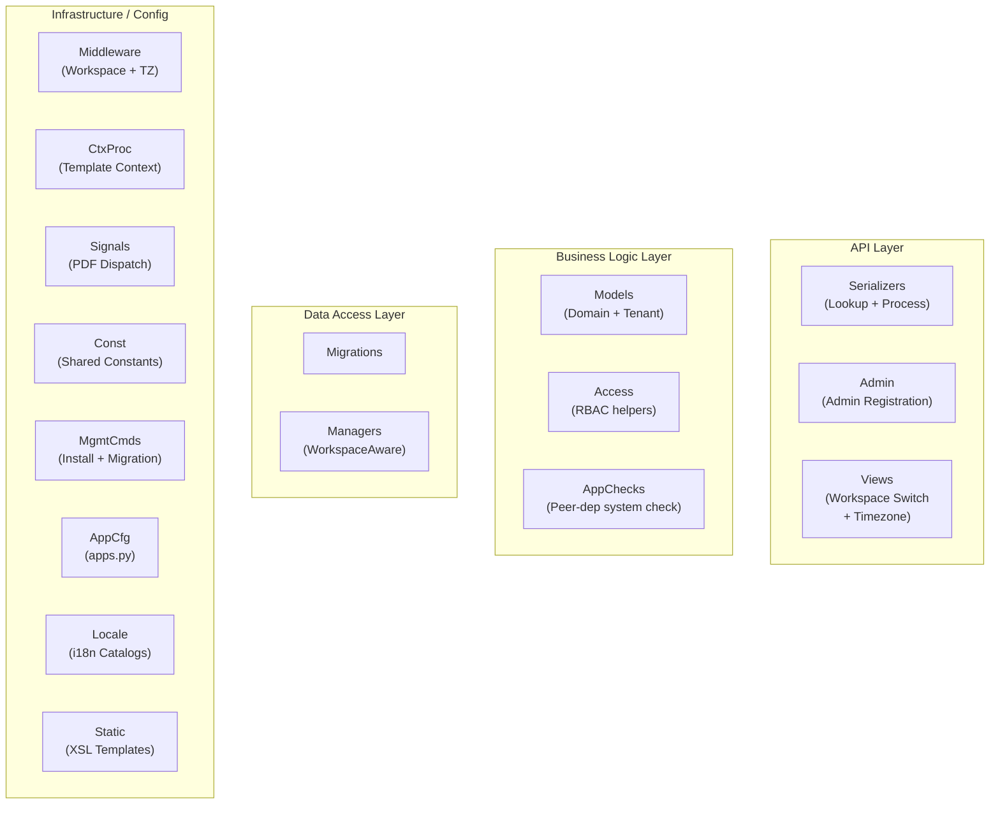

*Figure 4: Internal layer grouping of the `koalixcrm/core/` package. Arrows omitted intentionally; this is a structural view only.*

---

### Name Index

| Short alias | Full name |
|---|---|
| Serialzrs | `koalixcrm/core/serializers/` — DRF ModelSerializer classes for lookup models and `PDFExportProcess` |
| AdminReg | `koalixcrm/core/admin/` — Django Admin ModelAdmin registrations for core entities |
| Views | `koalixcrm/core/views/` — Workspace switch view and timezone setter |
| Models | `koalixcrm/core/models/` — Django ORM model classes (Workspace, tenant scoping, RBAC, lookup tables, PDF export) |
| Access | `koalixcrm/core/access.py` — RBAC helper functions (`effective_roles`, `user_workspaces`, `permissions_for_role`) |
| AppChks | `koalixcrm/core/app_checks.py` — `register_peer_check` system-check helper |
| Mgrtns | `koalixcrm/core/migrations/` — Django schema migrations (0001–0007) |
| Managers | `koalixcrm/core/managers/workspace_aware.py` — `WorkspaceAwareManager` and context-variable helpers |
| Middleware | `koalixcrm/core/middleware/` — `WorkspaceContextMiddleware` and `TimezoneMiddleware` |
| CtxProc | `koalixcrm/core/context_processors.py` — `workspace_context` template context processor |
| Signals | `koalixcrm/core/signals/pdf_export_signals.py` — `post_save` signal that dispatches `PDFExportCommand` |
| Const | `koalixcrm/core/const/` — Shared choice-list constants (countries, party roles, purposes, statuses, address prefixes) |
| MgmtCmds | `koalixcrm/core/management/commands/` — `koalixcrm_install_defaulttemplates` and `sync_split_migrations` |
| AppCfg | `koalixcrm/core/apps.py` — Django AppConfig (`CoreConfig`) |
| Locale | `koalixcrm/core/locale/` — Gettext translation catalogs (de, es, fr, pt_BR) |
| Static | `koalixcrm/core/static/default_templates/` — Bundled XSL/FO templates and font assets |

---

### Package and Module Catalogue

#### API Layer

**`serializers/` — DRF Serializers for Lookup Models and PDF Export**

Contains one or two serializer classes per core domain entity. Lookup-model serializers are embedded
by the `contracts` app's nested document serializer to render full document snapshots for the Java
PDF service.

| Class / File | Responsibility |
|---|---|
| `CurrencyJSONSerializer` | Full CRUD serializer for `Currency` (id, description, short_name, rounding) |
| `OptionTaxJSONSerializer` | Read-only slim serializer for `Tax` (id + name); used for FK embedding |
| `TaxJSONSerializer` | Full CRUD serializer for `Tax` (tax_rate, name); accounting account linkage omitted (moved to `accounting.TaxAccountAssignment` in CR-2c) |
| `OptionUnitJSONSerializer` | Read-only slim serializer for `Unit` (id, description, short_name); used for FK embedding |
| `UnitJSONSerializer` | Full CRUD serializer for `Unit` with nested `is_a_fraction_of` parent reference and `fraction_factor_to_next_higher_unit` |
| `CurrencyTransformJSONSerializer` | Standard CRUD serializer for `CurrencyTransform` (all fields) |
| `UnitTransformJSONSerializer` | Standard CRUD serializer for `UnitTransform` (all fields) |
| `PDFExportProcessJSONSerializer` | Read/update serializer for `PDFExportProcess`; producer fields (source_model, source_id, template_set, triggered_by) are read-only; the Celery worker PATCHes status, result_url, and error_message as the job progresses |

**`admin/` — Django Admin Registrations**

Contains one `ModelAdmin` subclass per core domain entity and one Grappelli dashboard module for
the workspace switcher.

| File / Class | Responsibility |
|---|---|
| `workspace_admin.py` / `WorkspaceAdmin` | List display for `Workspace` (name, organization, color, date_added); read-only timestamp fields |
| `workspace_scoped_admin.py` / `WorkspaceScopedModelAdmin` | Mixin (not a concrete admin): scopes `get_queryset` to the active workspace; filters FK dropdowns to workspace-local rows in `formfield_for_foreignkey`; enforces workspace ownership in `save_model` including cross-FK validation |
| `role_in_workspace_admin.py` / `RoleInWorkspaceAdmin` | List display for `RoleInWorkspace` (group, workspace, role); filters by workspace and role |
| `currency_admin.py` / `CurrencyAdmin` | List display for `Currency` (id, description, short_name, rounding) |
| `currency_transform_admin.py` / `CurrencyTransformAdmin` | Admin view for `CurrencyTransform` |
| `tax_admin.py` / `TaxAdmin` | List display for `Tax` (id, tax_rate, name) |
| `unit_admin.py` / `UnitAdmin` | Admin view for `Unit` |
| `unit_transform_admin.py` / `UnitTransformAdmin` | Admin view for `UnitTransform` |
| `pdf_export_process_admin.py` / `PDFExportProcessAdmin` | List display for `PDFExportProcess` (id, source_model, source_id, status, triggered_by, timestamps); filters by status and source model |
| `dashboard_modules.py` / `WorkspaceSwitcherModule` | Grappelli `DashboardModule` subclass that renders the user's accessible workspaces with their roles; surfaces a POST switch action per workspace; reads `RoleInWorkspace` to populate display rows |

**`views/` — Utility Views**

| Class / Function | Responsibility |
|---|---|
| `workspace_switch.WorkspaceSwitchView` | POST-only `staff_member_required` view; validates that the requesting user holds a `RoleInWorkspace` for the target workspace via `user_workspaces()`; writes a `WorkspaceSwitchEvent` audit row; updates `session['active_workspace_id']`; redirects to `admin:index` |
| `set_timezone.set_timezone` | Login-required view; on POST stores the selected timezone name in `session['django_timezone']`; on GET renders the timezone selection form |

---

#### Business Logic Layer

**`models/` — Domain and Tenant Models**

The core models fall into three groups: the workspace tenant model, the access-control grant
models, and the shared lookup models used by all other apps.

| Class | DB Table | Responsibility |
|---|---|---|
| `Workspace` | `crm_workspace` | Tenant boundary: name, color, optional `Organization` FK (the legal entity the workspace represents), `external_workspace_reference` (short prefix for human-readable IDs), `is_active` flag, and timestamps; not workspace-scoped itself (it is the scope) |
| `WorkspaceScopedModel` | (abstract) | Abstract base class for all tenant-scoped models; adds a non-nullable `workspace` FK with `CASCADE` delete; sets `objects = WorkspaceAwareManager()` so all ORM queries on concrete subclasses are automatically filtered to the active workspace |
| `WorkspaceSwitchEvent` | `crm_workspaceswitchevent` | Append-only audit table; records `user`, `from_workspace`, `to_workspace`, and `timestamp` for every workspace switch; indexed on `(user, timestamp)` |
| `Role` | (TextChoices enum) | Enumeration of workspace-level role codes: ADMIN, EDITOR, VIEWER, COMMENTER, EMPLOYEE, LINE_MANAGER, PROJECT_MANAGER; each maps to a CRUD permission set in `access.permissions_for_role()` |
| `RoleInWorkspace` | `crm_roleinworkspace` | Grant table: binds a Django `auth.Group` to a `Workspace` at a given `Role`; unique on `(group, workspace, role)`; users gain access to a workspace by membership in a group that holds a role there |
| `Currency` | `crm_currency` | Lookup: ISO currency with `short_name` (3 chars), `rounding` decimal; `get_rounding()` defaults to 0.05; `round(value)` performs fixed-resolution rounding |
| `CurrencyTransform` | `crm_currencytransform` | Lookup: conversion factor between two `Currency` records for a given `ProductType`; used by the contracts price calculation layer |
| `Tax` | `crm_tax` | Lookup: named tax rate (`tax_rate` as decimal percentage); `clean()` validates that a `TaxAccountAssignment` with both activa and passiva accounts exists when the `accounting` app is installed |
| `Unit` | `crm_unit` | Lookup: measurement unit with `short_name` (3 chars); optional self-FK `is_a_fraction_of` enables a unit hierarchy (e.g. kg → t) via `fraction_factor_to_next_higher_unit` |
| `UnitTransform` | `crm_unittransform` | Lookup: conversion factor between two `Unit` records for a given `ProductType`; `transform(unit)` returns the target unit if the source matches |
| `PDFExportProcess` | `crm_pdfexportprocess` | Workspace-scoped async job tracker: carries `source_model` (class name), `source_id`, `template_set` FK, `triggered_by` FK, `status` (pending/processing/completed/failed), `result_url`, and `error_message`; written by admin actions in any app that needs PDF output; its `post_save` signal dispatches a `PDFExportCommand` to the configured queue |

**`access.py` — RBAC Helper Functions**

| Function | Responsibility |
|---|---|
| `effective_roles(user, obj)` | Returns the set of `Role` codes the user holds on the object's workspace by joining `user.groups` against `RoleInWorkspace`; superusers receive all roles; objects without a `.workspace` attribute return an empty set |
| `user_workspaces(user)` | Returns a queryset of active `Workspace` rows the user holds any role in via group membership; superusers see all active workspaces |
| `permissions_for_role(role)` | Maps a `Role` value to the set of Django CRUD permission codes (`add`, `change`, `delete`, `view`) according to the CR-8/CR-9 permission matrix |

**`app_checks.py` — Peer-Dependency System Check**

| Function | Responsibility |
|---|---|
| `register_peer_check(app_config)` | Reads `app_config.required_peers` and registers a Django system check function (via `@register()`) that emits an `Error` for each peer not present in `INSTALLED_APPS`; the check fires at startup so missing hard dependencies surface before the first request |

---

#### Data Access Layer

**`migrations/` — Schema Migrations**

Seven Django schema migrations covering the evolution from the initial lookup tables through
workspace scoping and PDF export:

| Migration | Summary |
|---|---|
| `0001_initial.py` | Creates initial core tables: `crm_currency`, `crm_unit`, `crm_tax` (with legacy `accounting.Account` FKs) |
| `0002_transforms.py` | Creates `crm_currencytransform` and `crm_unittransform` |
| `0003_pdf_export_process_links.py` | Preparatory migration adding FK link columns for the PDF export pipeline |
| `0004_pdf_export_process.py` | Creates `crm_pdfexportprocess` with status lifecycle fields, `source_model`, `source_id`, `result_url`, and `error_message` |
| `0005_workspace_and_access.py` | Creates `crm_workspace`, `crm_roleinworkspace`, and `crm_workspaceswitchevent`; establishes the tenant boundary and RBAC grant substrate |
| `0006_pdf_export_process_workspace.py` | Adds the `workspace` FK to `crm_pdfexportprocess`, making it a `WorkspaceScopedModel` |
| `0007_drop_tax_accounting_fks.py` | Removes the legacy `account_activa` and `account_passiva` FKs from `crm_tax` (relocated to `accounting.TaxAccountAssignment` in CR-2c) |

**`managers/workspace_aware.py` — Workspace-Aware ORM Manager**

| Class / Function | Responsibility |
|---|---|
| `WorkspaceAwareManager` | Custom Django `Manager`; `get_queryset()` reads `_active_workspace` from a `ContextVar` and appends `filter(workspace=active)` when a workspace is active; `visible_to(user)` filters to all workspaces accessible to the user via `user_workspaces()` |
| `activate_workspace(ws)` / `deactivate_workspace()` | Set and clear the `_active_workspace` context variable |
| `get_active_workspace()` | Returns the current value of `_active_workspace` |
| `workspace_context(ws)` | Context manager that activates a workspace for its duration and restores the previous value on exit |
| `WorkspaceContextMissing` | Exception raised by `WorkspaceAwareManager` when `raise_on_missing_context=True` and no workspace is active |

---

#### Infrastructure / Config

**`middleware/`**

| Class | Responsibility |
|---|---|
| `WorkspaceContextMiddleware` | WSGI middleware (CR-9 §9.3): resolves the active workspace from `session['active_workspace_id']` for each authenticated request; calls `activate_workspace()` before delegating to the view and `deactivate_workspace()` in the finally block; falls back to the lowest-pk accessible workspace when the session has no valid value; sets `request.active_workspace` |
| `TimezoneMiddleware` | Activates the timezone stored in `session['django_timezone']` for the duration of the request using Django's `timezone.activate()`; deactivates when no session value is present |

**`context_processors.py`**

| Function | Responsibility |
|---|---|
| `workspace_context(request)` | Injects `active_workspace`, `active_workspace_color`, and `user_workspaces` into every Django template context; consumed by `admin/workspace_header.html` and `admin/base_site.html` |

**`signals/pdf_export_signals.py`**

| Receiver | Responsibility |
|---|---|
| `trigger_pdf_export` | `post_save` receiver on `PDFExportProcess` (dispatch_uid protected); on creation constructs a `PDFExportCommand` (from `koalixcrm_mq_commands`) populated with `process_id`, `source_model`, `source_id`, `template_set_id`, and `printed_by_user_id`; calls `get_dispatcher()` to obtain the configured dispatcher and sends the command; marks the process as `failed` if dispatch raises |

**`pdf_export_dispatch.py`**

| Function | Responsibility |
|---|---|
| `get_dispatcher()` | Reads `settings.KOALIXCRM_PDF_EXPORT_DISPATCHER` (defaults to `default_sqs_dispatcher`) and returns the callable via `import_string`; resolved at call time to allow runtime override |
| `default_sqs_dispatcher(command)` | Serialises a `PDFExportCommand` to JSON and sends it to the koalixcrm SQS queue via `koalixcrm_utils.aws_clients.get_sqs_queue` |

**`const/`**

| Module | Responsibility |
|---|---|
| `country.py` | `COUNTRIES` — ISO 3166-1 alpha-2/alpha-3/numeric tuple list for country FK choices |
| `party.py` | `PARTY_ROLE_CHOICES`, `IDENTIFICATION_SCHEME_CHOICES`, `LANGUAGE_CHOICES`, `LEGAL_FORM_CHOICES`, `ASSIGNMENT_PURPOSE_CHOICES`, `ORG_RELATIONSHIP_CHOICES` — shared choice tuples consumed by `contacts` models and admin without circular imports |
| `purpose.py` | Address, phone, and text-paragraph purpose choices (`PURPOSESADDRESSINCONTRACT`, `PURPOSESADDRESSINCUSTOMER`, `PURPOSESTEXTPARAGRAPHINDOCUMENTS`, `PURPOSECALLINCUSTOMER`, `PURPOSEVISITINCUSTOMER`) |
| `status.py` | Document lifecycle status choices (`INVOICESTATUS`, `QUOTATIONSTATUS`, `PURCHASEORDERSTATUS`, `DESPATCHADVICESTATUS`, `CREDITNOTESTATUS`, `CALLSTATUS`) |
| `postaladdressprefix.py` | `POSTALADDRESSPREFIX` — salutation prefix choices (Company, Mrs, Mr, Ms) |

**`management/commands/`**

| Command | Responsibility |
|---|---|
| `koalixcrm_install_defaulttemplates` | Bootstrap command: creates a default `TemplateSet` with bundled XSL files, a default `Currency`, a default `Workspace`, a `UserExtension` for the first superuser, and seed address/phone/email records; intended for fresh development installations |
| `sync_split_migrations` | Reconciles `django_migrations` for legacy and mid-refactor deployments: walks the migration graph and records any `CreateModel` migration as applied when all of its tables already exist in the database; also repairs legacy SQLite schemas where `id` columns lack `INTEGER PRIMARY KEY`; idempotent on up-to-date databases |

**`apps.py`**

Defines `CoreConfig(AppConfig)` with `name = 'koalixcrm.core'`, `label = 'core'`,
`required_peers = ()`, and `optional_peers = ('koalixcrm.accounting',)`. On `ready()` it imports
`koalixcrm.core.signals.pdf_export_signals` to register the `PDFExportProcess` post-save receiver,
and calls `register_peer_check(self)` (a no-op for this app since `required_peers` is empty).

**`locale/`**

Gettext translation catalogs for German (`de`), Spanish (`es`), French (`fr`), and Brazilian
Portuguese (`pt_BR`). Legacy `.crm_legacy.po` files are retained alongside the current catalogs
for reference during the ongoing migration from the monolithic CRM schema.

**`static/default_templates/`**

Bundled XSL/FO print templates (invoice, quotation, sales order, purchase order, despatch advice,
project report, work report) in `de/` and `en/` locale subdirectories, plus shared font assets
(`DejaVuSans`, `dejavusans-bold`) and a font configuration file (`fontconfig.xml`) in `generic/`.
These assets are copied to `STATIC_ROOT` by `collectstatic` and referenced by the
`koalixcrm_install_defaulttemplates` management command.

---

### Key Collaboration Patterns

**Workspace tenant isolation.** `WorkspaceScopedModel` is the abstract base for every mutable
entity in every other app. The `WorkspaceAwareManager` it installs on each concrete subclass reads
the request-scoped `_active_workspace` context variable (set by `WorkspaceContextMiddleware`) and
automatically appends `filter(workspace=active)` to every queryset. This means workspace isolation
operates at the ORM level without requiring explicit filter calls in view or service code.

**RBAC grant resolution.** The `access.py` module provides three pure functions over the
`RoleInWorkspace` table. `user_workspaces()` is used by `WorkspaceContextMiddleware` to find a
fallback workspace on first login and by `WorkspaceSwitchView` to authorise a switch request.
`effective_roles()` is the entry point for per-object access decisions in the view layer.
`permissions_for_role()` translates role codes to Django CRUD permission sets for use in DRF
permission classes.

**PDF export pipeline.** Any app admin action that needs to render a PDF creates a
`PDFExportProcess` record. The `post_save` signal in `pdf_export_signals.py` immediately
constructs a `PDFExportCommand` and dispatches it via the swappable dispatcher. The default
dispatcher (`default_sqs_dispatcher`) sends the command as JSON to the koalixcrm SQS queue, where
the Celery worker picks it up, performs the FOP-based XSL/PDF transformation, uploads the result
to S3, and PATCHes the `PDFExportProcess` status and `result_url` fields. The dispatcher is
overridable per deployment via `settings.KOALIXCRM_PDF_EXPORT_DISPATCHER`.

**Shared lookup tables.** `Currency`, `Tax`, and `Unit` are defined in `core` because they are
referenced by multiple apps: `contracts` references `Currency` on `CommercialDocument` and `Unit`
on `CommercialDocumentPosition`; `products` references `Tax` and `Unit` on `ProductType`; the
`reporting` app references `Currency` on `Project` and `Unit` on `Agreement`. Keeping these tables
in `core` ensures no circular imports and a single authoritative schema location.

**Peer-dependency enforcement.** `register_peer_check` allows any app to declare its
`required_peers` list in its `AppConfig` and have Django's system-check framework enforce those
dependencies at startup. The pattern is used by `contacts`, `contracts`, and `reporting` to surface
misconfigured `INSTALLED_APPS` before any view is ever served.

---

### External Dependencies of the Core App

| Dependency | Used for |
|---|---|
| `koalixcrm_mq_commands.PDFExportCommand` | Command object constructed in `pdf_export_signals.trigger_pdf_export` and dispatched to the SQS queue |
| `koalixcrm_utils.aws_clients.get_sqs_queue` | SQS client factory used in `default_sqs_dispatcher` to obtain the message queue handle |
| `koalixcrm.contacts.Organization` | FK on `Workspace.organization` (optional: the legal entity this workspace represents) |
| `koalixcrm.djangoUserExtension.DocumentTemplate` | FK on `PDFExportProcess.template_set`; the XSL template set used by the Celery worker for FOP rendering |
| `koalixcrm.products.ProductType` | FK on `CurrencyTransform.product_type` and `UnitTransform.product_type`; conversion factors are product-type-specific |
| `grappelli.dashboard.modules.DashboardModule` | Base class for `WorkspaceSwitcherModule` in `dashboard_modules.py` |
| `filebrowser.base.FileObject` | Used in `koalixcrm_install_defaulttemplates` to store XSL file references in the media library |

---

## djangoUserExtension App — Internal Package Structure

### Overview

The `djangoUserExtension` Django app (label `djangoUserExtension`, ~2,268 LoC) provides the
user-profile extension and document-template infrastructure that ties Django's built-in `auth.User`
to the koalixcrm print pipeline. It introduces a `UserExtension` record per staff user (carrying a
default `TemplateSet` and default `Currency`), a hierarchy of ten document-template subtypes
(one per printable document kind), a `TemplateSet` aggregator that maps each document kind to a
concrete template, and purpose-typed assignment records linking a user to postal addresses, phone
numbers, and e-mail addresses.

The app declares `required_peers = ('koalixcrm.core', 'koalixcrm.contacts')` and
`optional_peers = ('koalixcrm.reporting',)` in its `AppConfig`. It is a required peer of the
`accounting` app and an optional peer of `contracts` and `reporting`. All `DocumentTemplate`
subtypes store their XSL file, FOP configuration, and logo via a custom `TemplateFileStorage`
backend backed by S3. The `DocumentTemplateViewSet` exposes read-only REST endpoints that issue
presigned S3 redirect responses for each asset, allowing the Java PDF rendering service to
fetch templates without direct S3 credentials.

---

### Layered Architecture Diagram

The diagram below shows the internal layers of `koalixcrm/djangoUserExtension/` and the packages
within each layer. No inter-package dependencies are shown; this is a structural view only.

**Figure 5 — djangoUserExtension App: Layered Package Structure**

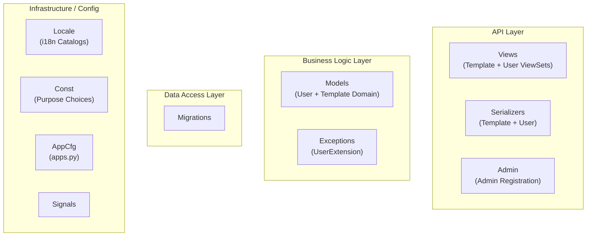

*Figure 5: Internal layer grouping of the `koalixcrm/djangoUserExtension/` package. Arrows omitted intentionally; this is a structural view only.*

---

### Name Index

| Short alias | Full name |
|---|---|
| Views | `koalixcrm/djangoUserExtension/views/` — DRF ViewSets and template error views |
| Serialzrs | `koalixcrm/djangoUserExtension/serializers/` — DRF ModelSerializer classes |
| AdminReg | `koalixcrm/djangoUserExtension/admin/` — Django Admin ModelAdmin registrations |
| Models | `koalixcrm/djangoUserExtension/models/` — Django ORM model classes |
| Exceptions | `koalixcrm/djangoUserExtension/exceptions.py` — User-extension-specific exception classes |
| Mgrtns | `koalixcrm/djangoUserExtension/migrations/` — Django schema migrations (0001–0005) |
| Locale | `koalixcrm/djangoUserExtension/locale/` — Gettext translation catalogs (de, es, fr, pt_BR) |
| Const | `koalixcrm/djangoUserExtension/const/purpose.py` — Purpose choice constants |
| AppCfg | `koalixcrm/djangoUserExtension/apps.py` — Django AppConfig (`DjangoUserExtensionConfig`) |
| Signals | `koalixcrm/djangoUserExtension/signals/` — Signal receiver package (currently empty, reserved) |

---

### Package and Module Catalogue

#### API Layer

**`views/` — ViewSets and Template Error Views**

| Class / File | Responsibility |
|---|---|
| `DocumentTemplateViewSet` | Read-only `GenericViewSet` (list + retrieve) for `DocumentTemplate`; scopes queryset to the active workspace; exposes three presigned-URL redirect actions (`/xsl/`, `/fop-config/`, `/logo/`) allowing the Java PDF service to fetch template assets from S3 without direct credentials |
| `UserExtensionViewSet` | CRUD ViewSet for `UserExtension`; workspace-scoped |
| `template_set_missing.TemplateMissingView` | Template error view rendered when the required print template is absent; surfaced by the time-tracking UI |
| `user_extension_missing.UserExtensionMissingView` | Template error view rendered when the authenticated user has no linked `UserExtension` |

**`serializers/` — DRF Serializers**

| Class / File | Responsibility |
|---|---|
| `OptionDocumentTemplateJSONSerializer` | Base read-only serializer for `DocumentTemplate` (id, title, xsl_file, fop_config_file, logo) |
| `OptionInvoiceTemplateJSONSerializer` … `OptionWorkReportTemplateJSONSerializer` | Per-subtype read-only serializers for the ten `DocumentTemplate` concrete subtypes; used for FK embedding in `TemplateSetJSONSerializer` and nested contract serializers |
| `OptionTemplateSetJSONSerializer` | Read-only serializer for `TemplateSet`; nests all ten per-subtype template serializers |
| `TemplateSetJSONSerializer` | Full read-write serializer for `TemplateSet`; `create()` and `update()` resolve nested template references by id |
| `DocumentTemplateJSONSerializer` | Full serializer for `DocumentTemplate` used by `DocumentTemplateViewSet` |
| `UserExtensionJSONSerializer` | Standard CRUD serializer for `UserExtension` |
| `UserExtensionNestedJSONSerializer` | Nested read-only serializer for `UserExtension`; embeds `OptionTemplateSetJSONSerializer` for use in the contracts nested-document snapshot |
| `UserJSONSerializer` | Read-only serializer for `auth.User` (id, username, first_name, last_name) |

**`admin/` — Django Admin Registrations**

| File / Class | Responsibility |
|---|---|
| `document_template_admin.py` / `OptionDocumentTemplate` | Admin view for `DocumentTemplate` with `InlineTextParagraph` tabular inline for embedded text paragraphs; applies to all concrete template subtypes |
| `user_extension_admin.py` / `OptionUserExtension` | Admin view for `UserExtension` with list display (user, default_template_set, default_currency); surfaces `create_work_report_pdf` bulk action when `koalixcrm.reporting` is installed |

---

#### Business Logic Layer

**`models/` — User and Template Domain Models**

All model classes extend `WorkspaceScopedModel` from `koalixcrm.core`.

| Class | DB Table | Responsibility |
|---|---|---|
| `UserExtension` | `crm_userextension` | Extends `auth.User` for CRM use: FK to `TemplateSet` (default print template collection) and `Currency` (default currency); `get_user_extension(user)` resolves the unique extension for a given user, raising `UserExtensionMissing` or `TooManyUserExtensionsAvailable`; `objects_to_serialize()` assembles the user's contact data (phone, e-mail) for PDF serialization |
| `UserAddressAssignment` | `crm_useraddressassignment` | Purpose-typed assignment linking an `auth.User` to a `contacts.Address`; carries `purpose`, `is_primary`, `valid_from`, `valid_to` |
| `UserPhoneAssignment` | `crm_userphoneassignment` | Purpose-typed assignment linking an `auth.User` to a `contacts.PhoneNumber` |
| `UserEmailAssignment` | `crm_useremailassignment` | Purpose-typed assignment linking an `auth.User` to a `contacts.PartyEmail` |
| `DocumentTemplate` | `crm_documenttemplate` | Abstract-like base model for a print template: `xsl_file`, `fop_config_file`, `logo` stored via `TemplateFileStorage` (S3); `get_xsl_file()` and `get_fop_config_file()` raise typed exceptions if the file is absent; `TextParagraphInDocumentTemplate` records are attached as an inline |
| `InvoiceTemplate` | (MTI child) | Concrete subtype of `DocumentTemplate` for invoice print templates |
| `QuotationTemplate` | (MTI child) | Concrete subtype for quotation print templates |
| `DespatchAdviceTemplate` | (MTI child) | Concrete subtype for despatch advice print templates |
| `PaymentReminderTemplate` | (MTI child) | Concrete subtype for payment reminder print templates |
| `PurchaseOrderTemplate` | (MTI child) | Concrete subtype for purchase order print templates |
| `SalesOrderTemplate` | (MTI child) | Concrete subtype for sales order print templates |
| `ProfitLossStatementTemplate` | (MTI child) | Concrete subtype for profit/loss statement print templates |
| `BalanceSheetTemplate` | (MTI child) | Concrete subtype for balance sheet print templates |
| `MonthlyProjectSummaryTemplate` | (MTI child) | Concrete subtype for monthly project summary print templates |
| `WorkReportTemplate` | (MTI child) | Concrete subtype for work report print templates |
| `TemplateSet` | `crm_templateset` | Aggregates one `DocumentTemplate` per document kind (ten FK fields); `get_template_set(required_template_set)` resolves the correct subtype by class name, raising `TemplateMissingInTemplateSet` if the FK is null |
| `TextParagraphInDocumentTemplate` | `crm_textparagraphindocumenttemplate` | Purpose-tagged free-text paragraph attached to a `DocumentTemplate`; purpose choices from `core.const.purpose` |

**`exceptions.py` — User-Extension Exceptions**

| Class | Responsibility |
|---|---|
| `UserExtensionMissing` | Raised when `UserExtension.get_user_extension()` finds no extension for the user; carries a redirect path to the user-extension-missing error view |
| `TooManyUserExtensionsAvailable` | Raised when more than one `UserExtension` row exists for a user (invariant violation) |
| `TemplateSetMissingForUserExtension` | Raised when `UserExtension.get_template_set()` cannot resolve the required template subtype |
| `UserExtensionPhoneAddressMissing` | Raised by `UserExtension.objects_to_serialize()` when no phone assignment is found for the user |
| `UserExtensionEmailAddressMissing` | Raised by `UserExtension.objects_to_serialize()` when no e-mail assignment is found for the user |

---

#### Data Access Layer

**`migrations/` — Schema Migrations**

| Migration | Summary |
|---|---|
| `0001_initial.py` | Creates `crm_documenttemplate` (and all MTI-child tables), `crm_templateset`, `crm_textparagraphindocumenttemplate`, and `crm_userextension` |
| `0002_documenttemplate_s3_file_fields.py` | Replaces legacy `filebrowser.FileBrowseField` file fields with `FileField` backed by `TemplateFileStorage` (S3); adds `fop_config_file` and `logo` fields |
| `0003_ubl_template_rename.py` | Renames the `SalesDocumentTemplate` family to `CommercialDocumentTemplate` for UBL alignment; adds missing document-type subtype tables |
| `0004_workspace_scoping.py` | Adds workspace-scoping FKs to all `djangoUserExtension` models in alignment with the `WorkspaceScopedModel` base class introduced in `core` |
| `0005_user_address_assignments.py` | Creates `crm_useraddressassignment`, `crm_userphoneassignment`, and `crm_useremailassignment` tables |

---

#### Infrastructure / Config

**`apps.py`**

Defines `DjangoUserExtensionConfig(AppConfig)` with `name = 'koalixcrm.djangoUserExtension'`,
`label = 'djangoUserExtension'`, `required_peers = ('koalixcrm.core', 'koalixcrm.contacts')`, and
`optional_peers = ('koalixcrm.reporting',)`. On `ready()` it registers the app's peer-dependency
system check via `koalixcrm.core.app_checks.register_peer_check`.

**`const/purpose.py`**

Contains purpose choice constants for user contact assignments, complementing the purpose choices
defined in `koalixcrm.core.const.purpose`.

**`locale/`**

Gettext translation catalogs for German (`de`), Spanish (`es`), French (`fr`), and Brazilian
Portuguese (`pt_BR`).

**`signals/`**

Empty signal receiver package, reserved for future signal registration.

---

### Key Collaboration Patterns

**Template resolution chain.** When any app admin action triggers PDF export it creates a
`PDFExportProcess` and must supply a `template_set` FK pointing at a `DocumentTemplate` subtype.
The `TemplateSet.get_template_set(class_name)` method resolves the correct subtype by string key.
`UserExtension.get_template_set()` delegates to the user's `default_template_set` to select the
appropriate template. The Java PDF rendering service then calls
`GET /api/document_templates/{id}/xsl/` and `/fop-config/` to obtain presigned S3 URLs for the
XSL and FOP configuration assets.

**User contact data serialization.** `UserExtension.objects_to_serialize(obj, user)` collects the
auth user record, its `UserExtension`, and the primary phone and e-mail assignments into a list for
inclusion in document XML serialization. This method is called by the legacy synchronous PDF
rendering path (not the async SQS path) and raises typed exceptions if any required contact is
absent.

**Admin action: work-report PDF.** When `koalixcrm.reporting` is installed, `OptionUserExtension`
exposes a `create_work_report_pdf` bulk action. For each selected `UserExtension` it looks up the
linked `HumanResource` (from `reporting`), resolves the `work_report_template` from the user's
default `TemplateSet`, and creates a `PDFExportProcess` record, which the SQS signal dispatches to
the Java PDF service.

---

### External Dependencies of the djangoUserExtension App

| Dependency | Used for |
|---|---|
| `koalixcrm.core.models.workspace_scoped.WorkspaceScopedModel` | Base class for all djangoUserExtension models |
| `koalixcrm.core.models.Currency` | FK on `UserExtension.default_currency` |
| `koalixcrm.core.models.pdf_export_process.PDFExportProcess` | Created in `OptionUserExtension.create_work_report_pdf` admin action |
| `koalixcrm.core.admin.workspace_scoped_admin.WorkspaceScopedModelAdmin` | Base class for `OptionDocumentTemplate` and `OptionUserExtension` admin views |
| `koalixcrm.core.const.party.ASSIGNMENT_PURPOSE_CHOICES` | Purpose choices for user address/phone/email assignment models |
| `koalixcrm.core.const.purpose` | Text-paragraph purpose choices for `TextParagraphInDocumentTemplate` |
| `koalixcrm.core.exceptions` | `TemplateFOPConfigFileMissing`, `TemplateXSLTFileMissing`, `TemplateMissingInTemplateSet`, `IncorrectUseOfAPI` |
| `koalixcrm.contacts.models.Address` | FK target for `UserAddressAssignment.address` |
| `koalixcrm.contacts.models.PhoneNumber` | FK target for `UserPhoneAssignment.phone_number` |
| `koalixcrm.contacts.models.PartyEmail` | FK target for `UserEmailAssignment.email` |
| `koalixcrm.reporting.models.HumanResource` | Looked up in the `create_work_report_pdf` admin action (optional peer) |
| `koalixcrm.shared.permissions.ModelPermissionsWithListView` | DRF permission class used by `DocumentTemplateViewSet` |
| `koalixcrm_utils.s3_storage.TemplateFileStorage` | Custom Django storage backend used on `DocumentTemplate` file fields |
| `koalixcrm_utils.presigned_urls.presigned_get_url_for_field` | Generates presigned S3 GET URLs in `DocumentTemplateViewSet` |

---

## Accounting App — Internal Package Structure

### Overview

The `accounting` Django app (label `accounting`, ~1,724 LoC) provides double-entry bookkeeping
support within koalixcrm. It models a chart of accounts (`Account`), fiscal years
(`AccountingPeriod`), individual postings (`Booking`), a product-category classification for
accounts (`ProductCategory`), and two optional-peer assignment tables (`TaxAccountAssignment`,
`ProductCategoryAssignment`) that attach accounting accounts to `core.Tax` and `products.ProductType`
records without introducing reverse dependencies on those apps.

The app declares `required_peers = ('koalixcrm.core', 'koalixcrm.djangoUserExtension')` and
`optional_peers = ('koalixcrm.products',)`. Because `core` declares this app as an optional peer,
`core.Tax.clean()` conditionally validates that a `TaxAccountAssignment` exists only when the
accounting app is installed. The `admin_hooks.py` module patches the `Tax` and `ProductType` admin
classes at startup to inject inline forms for the two assignment tables, preserving the pre-CR-2c
UX without creating hard circular imports.

Accounting-period balance-sheet and profit/loss-statement PDFs are rendered asynchronously via the
`PDFExportProcess` mechanism: the `OptionAccountingPeriod` admin action enqueues a process, and
the Java PDF service renders the XSL-FO template.

Static XSL templates for balance sheets and profit/loss statements in German and English are
bundled under `accounting/static/default_templates/`.

---

### Layered Architecture Diagram

The diagram below shows the internal layers of `koalixcrm/accounting/` and the packages within
each layer. No inter-package dependencies are shown; this is a structural view only.

**Figure 6 — Accounting App: Layered Package Structure**

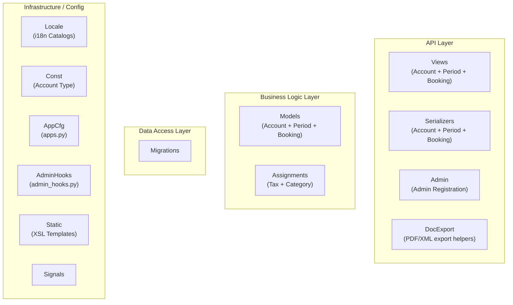

*Figure 6: Internal layer grouping of the `koalixcrm/accounting/` package. Arrows omitted intentionally; this is a structural view only.*

---

### Name Index

| Short alias | Full name |
|---|---|
| Views | `koalixcrm/accounting/views/` — DRF ViewSets for accounts, periods, bookings, and product categories |
| Serialzrs | `koalixcrm/accounting/serializers/` — DRF ModelSerializer classes |
| AdminReg | `koalixcrm/accounting/admin/` — Django Admin ModelAdmin registrations |
| DocExport | `koalixcrm/accounting/views/document_export.py` — Legacy synchronous PDF/XML export helpers |
| Models | `koalixcrm/accounting/models/` — Core ORM models (Account, AccountingPeriod, Booking, ProductCategory) |
| AssgnMdls | `koalixcrm/accounting/models/tax_account_assignment.py` and `product_category_assignment.py` — Optional-peer assignment tables |
| Mgrtns | `koalixcrm/accounting/migrations/` — Django schema migrations (0001–0003) |
| Locale | `koalixcrm/accounting/locale/` — Gettext translation catalogs (de, es, fr, pt_BR) |
| Const | `koalixcrm/accounting/const/accountTypeChoices.py` — Account type choice constants |
| AppCfg | `koalixcrm/accounting/apps.py` — Django AppConfig (`AccountingConfig`) |
| AdminHooks | `koalixcrm/accounting/admin_hooks.py` — Startup patches that inject accounting inlines into `Tax` and `ProductType` admins |
| Static | `koalixcrm/accounting/static/default_templates/` — Bundled XSL templates for balance sheet and profit/loss statement (de, en) |
| Signals | `koalixcrm/accounting/signals/` — Signal receiver package (currently empty, reserved) |

---

### Package and Module Catalogue

#### API Layer

**`views/` — ViewSets**

| Class / File | Responsibility |
|---|---|
| `AccountViewSet` | CRUD ViewSet for `Account` |
| `AccountingPeriodViewSet` | CRUD ViewSet for `AccountingPeriod`; surfaces admin actions to enqueue balance-sheet and profit/loss PDF export processes |
| `BookingViewSet` | CRUD ViewSet for `Booking` |
| `ProductCategoryViewSet` | CRUD ViewSet for `ProductCategory` |
| `document_export.export_pdf` | Legacy helper: synchronously renders a PDF from a model instance using the user's `TemplateSet`; returns `HttpResponse` with PDF content or redirects on error |
| `document_export.export_xml` | Legacy helper: synchronously renders an XML from a model instance |

**`serializers/` — DRF Serializers**

| Class / File | Responsibility |
|---|---|
| `AccountJSONSerializer` | Standard CRUD serializer for `Account` |
| `AccountingPeriodJSONSerializer` | Standard CRUD serializer for `AccountingPeriod` |
| `BookingJSONSerializer` | Standard CRUD serializer for `Booking` |
| `ProductCategoryJSONSerializer` | Standard CRUD serializer for `ProductCategory` |

**`admin/` — Django Admin Registrations**

| File / Class | Responsibility |
|---|---|
| `account_admin.py` / `OptionAccount` | List display for `Account` with `sum_of_all_bookings` computed column; uses `AccountForm` validation to enforce single open-liabilities and open-interests account invariants |
| `accounting_period_admin.py` / `OptionAccountingPeriod` | List display for `AccountingPeriod`; inline `InlineBookings`; `create_pdf_of_balance_sheet` and `create_pdf_of_profit_loss_statement` bulk actions that enqueue `PDFExportProcess` records; uses `AccountingPeriodForm` validation |
| `booking_admin.py` / `OptionBooking` | Admin view for `Booking`; `save_model` stamps `last_modified_by` and `staff` from `request.user` |
| `product_category_admin.py` / `OptionProductCategory` | Admin view for `ProductCategory` |
| `product_category_assignment_admin.py` / `ProductCategoryAssignmentInline` | `TabularInline` injected into `ProductType` admin by `admin_hooks.py` when accounting is installed |
| `tax_account_assignment_admin.py` / `TaxAccountAssignmentInline` | `TabularInline` injected into `Tax` admin by `admin_hooks.py` when accounting is installed |

---

#### Business Logic Layer

**`models/` — Core Accounting Models**

The accounting models do not extend `WorkspaceScopedModel`; they are workspace-global (i.e., the
chart of accounts and journal are shared across all workspaces in an installation).

| Class | DB Table | Responsibility |
|---|---|---|
| `Account` | `crm_account` | Chart-of-accounts entry: `account_number`, `title`, `account_type` (Asset/Liability/Expense/Revenue — from `ACCOUNTTYPECHOICES`), and four boolean flags (`is_open_reliabilities_account`, `is_open_interest_account`, `is_product_inventory_activa`, `is_a_customer_payment_account`); `sum_of_all_bookings()` computes the account balance across all periods; `sum_of_all_bookings_within_accounting_period()` and `sum_of_all_bookings_before_accounting_period()` compute period-scoped sub-totals used for balance sheet and P&L aggregation |
| `AccountingPeriod` | `crm_accountingperiod` | Fiscal year or quarter: `title`, `begin`, `end`, FK to two `DocumentTemplate` records (balance sheet and P&L); `overall_earnings()`, `overall_spendings()`, `overall_assets()`, `overall_liabilities()` aggregate across all accounts for the period; `get_current_valid_accounting_period()` returns the period whose date range covers today; `get_all_prior_accounting_periods()` returns all periods ending before this one's begin date |
| `Booking` | `crm_booking` | Double-entry posting: `from_account` and `to_account` FKs, `amount`, `booking_date`, `accounting_period` FK, optional `booking_reference` FK to `contracts.Invoice`, and audit fields (`staff`, `last_modified_by`) |
| `ProductCategory` | `crm_productcategory` | Accounting classification for products: `title`, `profit_account` FK (type E), `loss_account` FK (type S); links accounting accounts to product-type pricing |

**Assignment Models**

| Class | DB Table | Responsibility |
|---|---|---|
| `TaxAccountAssignment` | `crm_taxaccountassignment` | One-to-one linkage from `core.Tax` to activa and passiva `Account` records; relocated from `core.Tax` in CR-2c to remove the hard dependency from `core` on `accounting` |
| `ProductCategoryAssignment` | `crm_productcategoryassignment` | One-to-one linkage from `products.ProductType` to a `ProductCategory`; relocated from `products.ProductType` in CR-2c for the same isolation reason |

---

#### Data Access Layer

**`migrations/` — Schema Migrations**

| Migration | Summary |
|---|---|
| `0001_initial.py` | Creates `crm_account`, `crm_accountingperiod`, and `crm_booking` tables |
| `0002_initial.py` | Extends the initial schema with additional account and booking fields |
| `0003_tax_and_category_assignments.py` | Creates `crm_taxaccountassignment` and `crm_productcategoryassignment` (CR-2c: moves account FK linkage out of `core.Tax` and `products.ProductType`) |

---

#### Infrastructure / Config

**`apps.py`**

Defines `AccountingConfig(AppConfig)` with `name = 'koalixcrm.accounting'`, `label = 'accounting'`,
`required_peers = ('koalixcrm.core', 'koalixcrm.djangoUserExtension')`, and
`optional_peers = ('koalixcrm.products',)`. On `ready()` it registers the peer-dependency system
check and imports `admin_hooks` to patch the `Tax` and `ProductType` admin classes.

**`admin_hooks.py`**

Contains `_patch_tax_admin()` and `_patch_product_type_admin()`, which dynamically inject
`TaxAccountAssignmentInline` and `ProductCategoryAssignmentInline` into the already-registered
`Tax` and `ProductType` `ModelAdmin` classes at startup. This preserves the inline UX without
requiring `accounting` to be a hard dependency of `core` or `products`.

**`const/accountTypeChoices.py`**

Defines `ACCOUNTTYPECHOICES` — the enumeration of account types: Asset (`A`), Liability (`L`),
Expense (`S`), and Revenue (`E`).

**`static/default_templates/`**

Bundled XSL/FO templates for balance sheets (`balancesheet.xsl`) and profit/loss statements
(`profitlossstatement.xsl`) in German (`de/`) and English (`en/`) locale directories.

**`locale/`**

Gettext translation catalogs for German (`de`), Spanish (`es`), French (`fr`), and Brazilian
Portuguese (`pt_BR`).

**`signals/`**

Empty signal receiver package, reserved for future signal registration.

---

### Key Collaboration Patterns

**Account balance aggregation.** `AccountingPeriod.overall_earnings()` and related methods iterate
`Account.objects.all()` and call per-account aggregation methods. `Account.sum_of_all_bookings()`
reads `Booking` records directly (lazy import to avoid circular references) and applies sign
inversion for liability and expense accounts.

**Period-scoped PDF export.** `OptionAccountingPeriod` admin actions call `_enqueue_async_pdf()`,
which creates a `PDFExportProcess` record referencing the period's `DocumentTemplate` FK. The Java
PDF service retrieves the period's `AccountingPeriod` JSON, fetches the XSL template via
`DocumentTemplateViewSet`, and renders the balance sheet or P&L statement.

**Optional-peer admin injection.** `AccountingConfig.ready()` calls `admin_hooks._patch_tax_admin()`
and `_patch_product_type_admin()` to inject accounting-specific inline forms into the `Tax` and
`ProductType` admin pages. This allows accounting data to be managed from within the core and
products admin pages without those apps depending on `accounting` at import time.

---

### External Dependencies of the Accounting App

| Dependency | Used for |
|---|---|
| `koalixcrm.core.models.Tax` | One-to-one FK target of `TaxAccountAssignment.tax` |
| `koalixcrm.core.models.pdf_export_process.PDFExportProcess` | Created by `OptionAccountingPeriod` admin actions for async PDF rendering |
| `koalixcrm.core.models.workspace.Workspace` | Used in `OptionAccountingPeriod._enqueue_async_pdf()` to resolve the active workspace |
| `koalixcrm.core.app_checks.register_peer_check` | System-check registration called in `AccountingConfig.ready()` |
| `koalixcrm.core.exceptions` | Exception classes imported in `document_export.py` |
| `koalixcrm.djangoUserExtension.models.document_template.DocumentTemplate` | FK on `AccountingPeriod.template_set_balance_sheet` and `template_profit_loss_statement`; resolved in the `OptionAccountingPeriod` admin |
| `koalixcrm.djangoUserExtension.exceptions` | Exception classes imported in `document_export.py` |
| `koalixcrm.products.models.product_type.ProductType` | One-to-one FK target of `ProductCategoryAssignment.product_type` (optional peer) |
| `koalixcrm.contracts.models.Invoice` | FK on `Booking.booking_reference` (optional: a booking may reference the invoice that caused it) |

---

## Products App — Internal Package Structure

### Overview

The `products` Django app (label `products`, ~1,248 LoC) provides the product catalogue and pricing
engine for koalixcrm. It models product types (`ProductType`), a multi-dimensional pricing table
(`Price`, `ProductPrice`) with currency, unit, and party-group dimensions, and a
`CustomerGroupTransform` that applies a multiplicative factor when converting a price from one
party group to another.

The app declares `required_peers = ('koalixcrm.core',)` and `optional_peers = ('koalixcrm.accounting',)`.
It is an optional peer of `contracts` (which uses `ProductType` to price line items) and an
optional peer of `accounting` (which attaches `ProductCategoryAssignment` to `ProductType` via
`admin_hooks`). A `party_group_fk_rewire.py` data migration helper back-fills `PartyGroup` FKs from
the legacy `CustomerGroup` model introduced during the v2.0.0 party-model migration.

---

### Layered Architecture Diagram

The diagram below shows the internal layers of `koalixcrm/products/` and the packages within each
layer. No inter-package dependencies are shown; this is a structural view only.

**Figure 7 — Products App: Layered Package Structure**

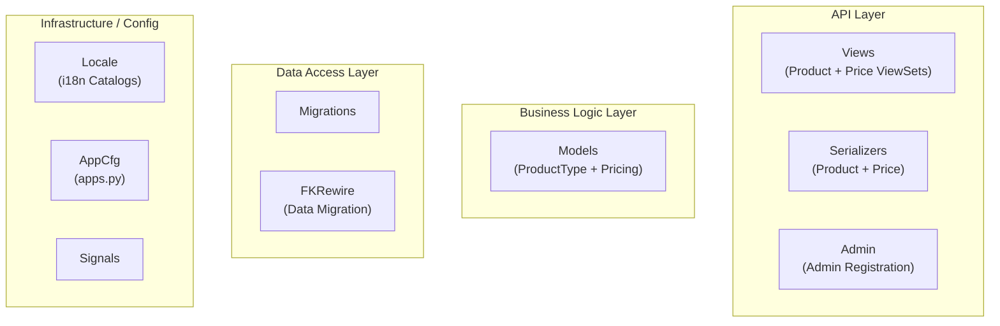

*Figure 7: Internal layer grouping of the `koalixcrm/products/` package. Arrows omitted intentionally; this is a structural view only.*

---

### Name Index

| Short alias | Full name |
|---|---|
| Views | `koalixcrm/products/views/` — DRF ViewSets for product types, prices, and party-group transforms |
| Serialzrs | `koalixcrm/products/serializers/` — DRF ModelSerializer classes |
| AdminReg | `koalixcrm/products/admin/` — Django Admin ModelAdmin registrations |
| Models | `koalixcrm/products/models/` — Django ORM model classes |
| Mgrtns | `koalixcrm/products/migrations/` — Django schema migrations (0001–0006) |
| FKRewire | `koalixcrm/products/party_group_fk_rewire.py` — Data migration helper for party-group FK back-population |
| Locale | `koalixcrm/products/locale/` — Gettext translation catalogs (de, es, fr, pt_BR) |
| AppCfg | `koalixcrm/products/apps.py` — Django AppConfig (`ProductsConfig`) |
| Signals | `koalixcrm/products/signals/` — Signal receiver package (currently empty, reserved) |

---

### Package and Module Catalogue

#### API Layer

**`views/` — ViewSets**

| Class / File | Responsibility |
|---|---|
| `ProductTypeViewSet` | CRUD ViewSet for `ProductType`; workspace-scoped |
| `ProductViewSet` | Workspace-scoped ViewSet for the `Price` base model |
| `ProductPriceViewSet` | CRUD ViewSet for `ProductPrice` |
| `CustomerGroupTransformViewSet` | CRUD ViewSet for `CustomerGroupTransform` |

**`serializers/` — DRF Serializers**

| Class / File | Responsibility |
|---|---|
| `ProductTypeJSONSerializer` | Standard CRUD serializer for `ProductType` |
| `ProductTypeNestedJSONSerializer` | Read-only nested serializer for `ProductType`; used by `contracts` nested document serializer to embed product details in document snapshots |
| `PriceJSONSerializer` | Standard CRUD serializer for the `Price` base model |
| `ProductPriceJSONSerializer` | Standard CRUD serializer for `ProductPrice` |
| `CustomerGroupTransformJSONSerializer` | Standard CRUD serializer for `CustomerGroupTransform` |

**`admin/` — Django Admin Registrations**

| File / Class | Responsibility |
|---|---|
| `product_type_admin.py` | `OptionProductType` — list display for `ProductType` with title, description, default unit, and tax; `ProductTypeTabularInline` for embedding products in other admin views |
| `product_price_admin.py` | Admin view for `ProductPrice` with inline usage on `ProductType`; `InlineProductPrice` tabular inline |
| `customer_group_transform_admin.py` | Admin view for `CustomerGroupTransform` |

---

#### Business Logic Layer

**`models/` — Product Type and Pricing Models**

| Class | DB Table | Responsibility |
|---|---|---|
| `ProductType` | `crm_producttype` | Root product catalogue entry: `title`, `product_type_identifier`, `description`, `default_unit` (FK to `core.Unit`), `tax` (FK to `core.Tax`), audit timestamps; `get_price(date, unit, party, currency)` iterates `ProductPrice` records, applies currency, unit, and party-group transform factors, and returns the lowest applicable price as a `Decimal`; raises `ProductType.NoPriceFound` if no valid price is found; `get_tax_rate()` delegates to `Tax.get_tax_rate()` |
| `Price` | `crm_price` | Abstract-like workspace-scoped base for price records: `unit`, `currency`, `party_group` (FK to `contacts.PartyGroup`, nullable), `price`, `valid_from`, `valid_until`; implements date-range, currency, unit, and party-group matching predicates; `get_currency_transform_factor()`, `get_unit_transform_factor()`, and `get_party_group_transform_factor()` resolve applicable conversion factors from `CurrencyTransform`, `UnitTransform`, and `CustomerGroupTransform` respectively |
| `ProductPrice` | `crm_productprice` | Concrete subtype of `Price`; adds a `product_type` FK, binding a price record to a specific `ProductType` |
| `CustomerGroupTransform` | `crm_customergrouptransform` | Multiplicative conversion factor between two `contacts.PartyGroup` records for a given `ProductType`; `transform(party_group)` returns `to_party_group` if the input matches `from_party_group`; `get_transform_factor()` returns the decimal factor |

---

#### Data Access Layer

**`migrations/` — Schema Migrations**

| Migration | Summary |
|---|---|
| `0001_initial.py` | Creates `crm_producttype`, `crm_price`, `crm_productprice`, and `crm_customergrouptransform` with legacy `CustomerGroup` FK columns |
| `0002_party_group_fks.py` | Adds `contacts.PartyGroup` FK columns alongside the legacy `CustomerGroup` FKs |
| `0003_tighten_party_group_fks.py` | Tightens nullability and adds constraints on the new `PartyGroup` FK columns |
| `0004_drop_legacy_customer_group_fks.py` | Drops the legacy `CustomerGroup` FK columns after back-fill completes |
| `0005_workspace_scoping.py` | Adds workspace-scoping FKs to `ProductType`, `Price`, `ProductPrice`, and `CustomerGroupTransform` |
| `0006_drop_accounting_product_category.py` | Removes the legacy `accounting_product_category` FK from `ProductType` (relocated to `accounting.ProductCategoryAssignment` in CR-2c) |

**`party_group_fk_rewire.py` — Data Migration Helper**

| Function | Responsibility |
|---|---|
| `populate_party_group_fks(apps, schema_editor)` | Back-fills the new `contacts.PartyGroup` FK columns on `Price` and `CustomerGroupTransform` rows from the legacy `CustomerGroup` IDs using the mapping built by `contacts.backfill.build_legacy_customer_group_to_party_group_mapping()` |
| `clear_party_group_fks(apps, schema_editor)` | Clears the party-group FK columns; used by the reverse migration path |

---

#### Infrastructure / Config

**`apps.py`**

Defines `ProductsConfig(AppConfig)` with `name = 'koalixcrm.products'`, `label = 'products'`,
`required_peers = ('koalixcrm.core',)`, and `optional_peers = ('koalixcrm.accounting',)`. On
`ready()` it registers the peer-dependency system check via `register_peer_check`.

**`locale/`**

Gettext translation catalogs for German (`de`), Spanish (`es`), French (`fr`), and Brazilian
Portuguese (`pt_BR`).

**`signals/`**

Empty signal receiver package, reserved for future signal registration.

---

### Key Collaboration Patterns

**Multi-dimensional price resolution.** `ProductType.get_price()` iterates all `ProductPrice`
records for the product and for each applies three independent transform factors: currency (via
`CurrencyTransform`), unit (via `UnitTransform`), and party group (via `CustomerGroupTransform`).
A price record is considered applicable only when all three factors are non-zero and the date falls
within the validity range. When multiple applicable prices exist, the method returns the lowest one,
implementing a "best price for the customer" semantic.

**Party-group pricing transform.** `Price.get_party_group_transform_factor()` inspects the party's
`PartyGroupMembership` records. A direct group match returns factor 1; an indirect match via
`CustomerGroupTransform` (from the price's `party_group` to any of the party's groups) returns the
configured factor. This allows a single price record to apply to a range of customer groups through
a chained transform table.

**Accounting category linkage (optional).** When `koalixcrm.accounting` is installed,
`accounting.admin_hooks._patch_product_type_admin()` injects `ProductCategoryAssignmentInline` into
the `ProductType` admin, allowing operators to assign an accounting product category directly on the
product type form. The assignment itself is stored in `accounting.ProductCategoryAssignment`, not
in `products.ProductType`.

---

### External Dependencies of the Products App

| Dependency | Used for |
|---|---|
| `koalixcrm.core.models.workspace_scoped.WorkspaceScopedModel` | Base class for `ProductType`, `Price`, `ProductPrice`, `CustomerGroupTransform` |
| `koalixcrm.core.models.Unit` | FK on `ProductType.default_unit` and `Price.unit` |
| `koalixcrm.core.models.Currency` | FK on `Price.currency` |
| `koalixcrm.core.models.Tax` | FK on `ProductType.tax`; `get_tax_rate()` delegates to `Tax.get_tax_rate()` |
| `koalixcrm.core.models.CurrencyTransform` | Queried by `Price.get_currency_transform_factor()` |
| `koalixcrm.core.models.UnitTransform` | Queried by `Price.get_unit_transform_factor()` |
| `koalixcrm.core.app_checks.register_peer_check` | System-check registration called in `ProductsConfig.ready()` |
| `koalixcrm.contacts.models.PartyGroup` | FK on `Price.party_group` and `CustomerGroupTransform.from_party_group` / `to_party_group` |
| `koalixcrm.contacts.models.Party` | Type hint in `Price.get_party_group_transform_factor()` and `ProductType.get_price()` |

---

## Subscriptions App — Internal Package Structure

### Overview

The `subscriptions` Django app (label `subscriptions`, ~357 LoC) provides a lightweight
subscription management module for koalixcrm. It models subscription types
(`SubscriptionType`), individual subscription records (`Subscription`) linked to a `contracts.Contract`,
and a subscription event log (`SubscriptionEvent`). The app is the smallest in the stack and is
at an early stage: no REST endpoints are defined (the `subscriptions_api.py` module is a stub),
and it carries no peer-dependency declarations in its `AppConfig`. The `Subscription.create_quotation()`
and `create_invoice()` methods reference the legacy `koalixcrm.core.documents` module, indicating
that this app has not yet been migrated to the current commercial document model.

---

### Layered Architecture Diagram

The diagram below shows the internal layers of `koalixcrm/subscriptions/` and the packages within
each layer. No inter-package dependencies are shown; this is a structural view only.

**Figure 8 — Subscriptions App: Layered Package Structure**

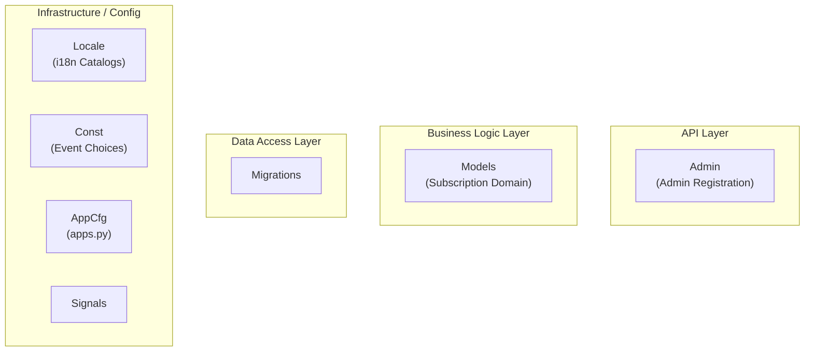

*Figure 8: Internal layer grouping of the `koalixcrm/subscriptions/` package. Arrows omitted intentionally; this is a structural view only.*

---

### Name Index

| Short alias | Full name |
|---|---|
| AdminReg | `koalixcrm/subscriptions/admin/subscription_admin.py` — Django Admin ModelAdmin registration |
| Models | `koalixcrm/subscriptions/models/` — Django ORM model classes |
| Mgrtns | `koalixcrm/subscriptions/migrations/` — Django schema migration (0001) |
| Locale | `koalixcrm/subscriptions/locale/` — Gettext translation catalogs (de, es, fr, pt_BR) |
| Const | `koalixcrm/subscriptions/const/events.py` — Subscription event type choice constants |
| AppCfg | `koalixcrm/subscriptions/apps.py` — Django AppConfig (`SubscriptionsConfig`) |
| Signals | `koalixcrm/subscriptions/signals/` — Signal receiver package (currently empty, reserved) |

---

### Package and Module Catalogue

#### API Layer

**`admin/` — Django Admin Registrations**

| File / Class | Responsibility |
|---|---|
| `subscription_admin.py` | Admin registration for `Subscription`, `SubscriptionType`, and `SubscriptionEvent`; provides list display and basic fieldset configuration for each model |

No REST ViewSets or serializers are implemented; `subscriptions_api.py` is a documentation stub
noting that no REST endpoints are currently defined.

---

#### Business Logic Layer

**`models/` — Subscription Domain Models**

The subscription models do not extend `WorkspaceScopedModel`; they are not workspace-scoped.

| Class | DB Table | Responsibility |
|---|---|---|
| `SubscriptionType` | (subscriptions) | Template for a recurring subscription: references a `products.ProductType` (the subscribed product); carries `cancellation_period` (months), `automatic_contract_extension` (months), `automatic_contract_extension_reminder` (days), `minimum_duration`, `payment_interval` (days), and an optional `contract_document` file via `filebrowser.FileBrowseField` |
| `Subscription` | (subscriptions) | Individual subscription instance: FK to `contracts.Contract` and FK to `SubscriptionType`; `create_subscription_from_contract(contract)` factory method sets the contract FK; `create_quotation()` and `create_invoice()` factory methods create document objects via the legacy `koalixcrm.core.documents` module (not yet migrated to the current commercial document model) |
| `SubscriptionEvent` | (subscriptions) | Event log entry for a subscription: FK to `Subscription`, `event_date`, and `event` (single-character choice from `SUBSCRITIONEVENTS` defined in `const/events.py`) |

---

#### Data Access Layer

**`migrations/` — Schema Migrations**

| Migration | Summary |
|---|---|
| `0001_initial.py` | Creates the initial `SubscriptionType`, `Subscription`, and `SubscriptionEvent` tables |

---

#### Infrastructure / Config

**`apps.py`**

Defines `SubscriptionsConfig(AppConfig)` with `name = 'koalixcrm.subscriptions'` and
`label = 'subscriptions'`. No `required_peers` or `optional_peers` are declared; the app
does not register a peer-dependency system check.

**`const/events.py`**

Defines `SUBSCRITIONEVENTS` — the set of subscription lifecycle event type choices used on
`SubscriptionEvent.event`.

**`locale/`**

Gettext translation catalogs for German (`de`), Spanish (`es`), French (`fr`), and Brazilian
Portuguese (`pt_BR`).

**`signals/`**

Empty signal receiver package, reserved for future signal registration.

---

### Key Collaboration Patterns

**Contract-subscription binding.** A `Subscription` is created by calling
`create_subscription_from_contract(contract)`, which stores the FK to the originating
`contracts.Contract`. This links the recurring subscription metadata to the contractual
agreement from which it was initiated.

**Legacy document factory methods.** `Subscription.create_quotation()` and `create_invoice()`
reference `koalixcrm.core.documents.quotation.Quotation` and `koalixcrm.core.documents.invoice.Invoice`
via the legacy document module path. These methods have not been migrated to the current
`contracts.CommercialDocument` model and rely on field names (`defaultcustomer`, `default_customer`,
`defaultcurrency`, `default_currency`) that are inconsistent, suggesting partial migration state.

---

### External Dependencies of the Subscriptions App

| Dependency | Used for |
|---|---|
| `koalixcrm.contracts.Contract` | FK on `Subscription.contract`; the originating contract for a subscription |
| `koalixcrm.products.ProductType` | FK on `SubscriptionType.product_type`; the subscribed product |
| `koalixcrm.core.documents` (legacy) | Referenced in `Subscription.create_quotation()` and `create_invoice()`; not yet migrated to the current commercial document model |
| `filebrowser.fields.FileBrowseField` | File field on `SubscriptionType.contract_document` for referencing contract PDF files via the Django Filebrowser media library |

---

## Auth Package — Internal Structure

### Overview

The `koalixcrm/auth/` package (~863 LoC) provides all authentication mechanisms for the
koalixcrm REST API and Django Admin. It implements three distinct authentication paths: an
OIDC-based browser login flow (authorization-code + PKCE, multi-provider), an OIDC access-token
authenticator for DRF (Bearer token validation against the OIDC discovery endpoint and JWKS), and
a machine-to-machine (M2M) token authenticator for the Celery worker. A shared OIDC utility
module handles discovery, JWKS fetching, JWT signature validation, and `at_hash` verification. Two
`drf-spectacular` OpenAPI extension classes expose the auth schemes in the generated API schema.

This package is not a Django app; it has no models, migrations, or admin registrations. It is
consumed by the DRF `DEFAULT_AUTHENTICATION_CLASSES` setting and by `projectsettings/urls.py`
for the OIDC login views.

---

### Layered Architecture Diagram

**Figure 9 — Auth Package: Component Structure**

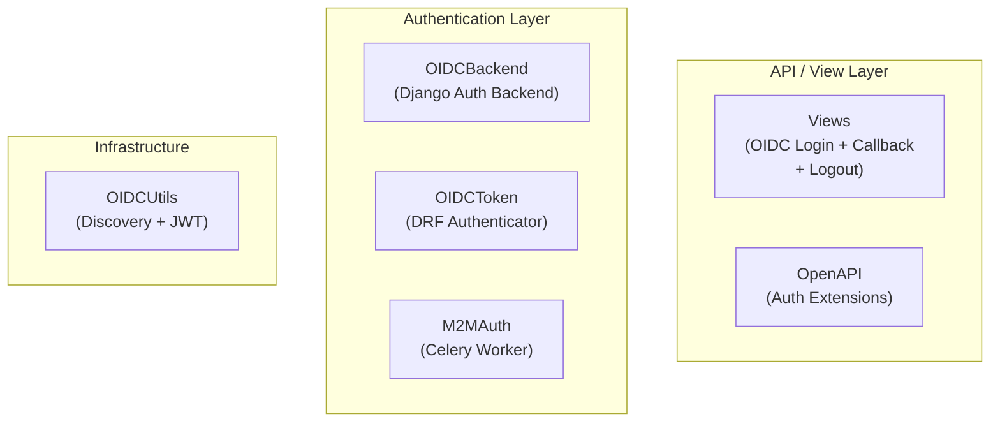

*Figure 9: Component structure of the `koalixcrm/auth/` package. Arrows omitted intentionally; this is a structural view only.*

---

### Name Index

| Short alias | Full name |
|---|---|
| Views | `koalixcrm/auth/oidc_views.py` — `LoginSelectionView`, `OAuthLoginView`, `OAuthCallbackView`, `MultiProviderLogoutView` |
| OpenAPI | `koalixcrm/auth/openapi_extensions.py` — `drf-spectacular` authentication scheme extensions |
| OIDCBackend | `koalixcrm/auth/oidc_backend.py` — `OIDCAuthenticationBackend` Django authentication backend |
| OIDCToken | `koalixcrm/auth/oidc_token_authentication.py` — `OIDCAccessTokenAuthentication` DRF authenticator |
| M2MAuth | `koalixcrm/auth/m2m_authentication.py` — `CeleryWorkerM2MAuthentication` DRF authenticator |
| OIDCUtils | `koalixcrm/auth/oidc_utils.py` — OIDC discovery, JWKS retrieval, JWT validation utilities |

---

### Package and Module Catalogue

#### API / View Layer

**`oidc_views.py` — OIDC Browser Login Views**

| Class / Function | Responsibility |
|---|---|
| `LoginSelectionView` | GET: renders the provider selection page listing all configured OIDC providers from `settings.OIDC_PROVIDERS`; POST: redirects to `OAuthLoginView` for the selected provider |
| `OAuthLoginView` | Initiates the OIDC authorization-code flow: generates a PKCE `code_verifier`/`code_challenge`, stores state and verifier in the session, and redirects the browser to the provider's authorization endpoint |
| `OAuthCallbackView` | Handles the OIDC redirect callback: validates state, exchanges the authorization code for tokens at the provider's token endpoint, extracts user info from the ID token or userinfo endpoint, and calls `OIDCAuthenticationBackend._find_or_create_user()`; stores the provider name in the session for logout |
| `MultiProviderLogoutView` | Extends Django's built-in `LogoutView`; on dispatch, reads the provider name from the session and appends the OIDC RP-Initiated Logout URL (if the provider publishes `end_session_endpoint`) to the post-logout redirect |

**`openapi_extensions.py` — OpenAPI Authentication Extensions**

| Class | Responsibility |
|---|---|
| `CeleryWorkerM2MAuthenticationScheme` | `OpenApiAuthenticationExtension` for `CeleryWorkerM2MAuthentication`; registers an HTTP Bearer security scheme in the generated OpenAPI document |
| `OIDCAccessTokenAuthenticationScheme` | `OpenApiAuthenticationExtension` for `OIDCAccessTokenAuthentication`; registers an HTTP Bearer security scheme for the OIDC access-token flow |

---

#### Authentication Layer

**`oidc_backend.py` — OIDC Django Authentication Backend**

| Class / Function | Responsibility |
|---|---|
| `OIDCAuthenticationBackend` | Django `AUTHENTICATION_BACKENDS` entry; `authenticate()` dispatches to `_authenticate_with_user_info()` (when a userinfo dict is available from the callback) or `_authenticate_with_id_token()` (for direct token-based authentication); both paths call `_find_or_create_user()` and then `_sync_groups_from_provider()` |
| `_find_or_create_user(email, user_info)` | Looks up an `auth.User` by e-mail; creates and activates a new user (carrying `first_name` and `last_name` from claims) if not found |
| `_sync_groups_from_provider(user, claims)` | Reads the `roles` claim from the provider's token claims (configured via `settings.OIDC_PROVIDERS[…]['roles_claim']`) and ensures the user's Django group membership matches the provider-declared roles; adds and removes group memberships atomically |
| `get_user(user_id)` | Standard Django backend lookup by PK |

**`oidc_token_authentication.py` — DRF OIDC Access-Token Authenticator**

| Class / Method | Responsibility |
|---|---|
| `OIDCAccessTokenAuthentication` | DRF `BaseAuthentication` subclass placed in `DEFAULT_AUTHENTICATION_CLASSES`; `authenticate()` extracts the Bearer token from the `Authorization` header via `oidc_utils.get_token_auth_header()`, validates the JWT via `oidc_utils.validate_jwt()` (signature, expiry, audience, issuer), resolves the user e-mail from the claims or by calling the provider's userinfo endpoint, and calls `_find_or_create_user()` to obtain or create the Django user |
| `_fetch_email_from_userinfo(issuer, access_token)` | Fetches the OIDC userinfo endpoint when the JWT payload does not contain an `email` claim directly |
| `_find_or_create_user(email, payload)` | Equivalent to the backend's `_find_or_create_user`; creates an active user on first access |

**`m2m_authentication.py` — Machine-to-Machine DRF Authenticator**

| Class / Method | Responsibility |
|---|---|
| `CeleryWorkerM2MAuthentication` | DRF `BaseAuthentication` subclass for intra-service calls; `authenticate()` checks the request for the expected M2M credentials (`settings.CELERY_WORKER_M2M_OIDC_ISSUER`, `CELERY_WORKER_M2M_CLIENT_ID`); validates the Bearer token using `oidc_utils.validate_jwt()` and returns the configured service account user if valid; returns `None` (pass-through) for requests not carrying M2M credentials |

---

#### Infrastructure

**`oidc_utils.py` — OIDC Discovery and JWT Validation**

| Function | Responsibility |
|---|---|
| `get_oidc_discovery(issuer_url)` | Fetches and returns the OIDC discovery document (`/.well-known/openid-configuration`) for a given issuer; caches the result for the process lifetime |
| `get_jwks(authority_url)` | Fetches the JWKS document from the `jwks_uri` in the discovery document; used for JWT signature verification |
| `validate_jwt(token, issuer, audience)` | Decodes and validates a JWT: verifies the RS256 signature against the provider's JWKS, checks `exp`, `nbf`, `iss`, and `aud` claims; verifies `at_hash` when present using `_verify_at_hash()`; returns the validated claims payload |
| `_verify_at_hash(at_hash, access_token)` | Verifies the `at_hash` claim in the ID token against the SHA-256 hash of the access token (left half, base64url-encoded) |
| `get_token_auth_header(request)` | Extracts the Bearer token string from the HTTP `Authorization` header; returns `None` if absent or malformed |

---

### External Dependencies of the Auth Package

| Dependency | Used for |
|---|---|
| `django.contrib.auth` | `AbstractBaseUser`, `User` model, group membership manipulation in `_sync_groups_from_provider` |
| `rest_framework.authentication.BaseAuthentication` | Base class for `OIDCAccessTokenAuthentication` and `CeleryWorkerM2MAuthentication` |
| `drf_spectacular.extensions.OpenApiAuthenticationExtension` | Base class for the OpenAPI security scheme extensions |
| `PyJWT` (`jwt`) | JWT decode and signature verification in `validate_jwt` |
| `settings.OIDC_PROVIDERS` | Multi-provider configuration: issuer URL, client ID/secret, redirect URI, scopes, roles claim name |
| `settings.CELERY_WORKER_M2M_OIDC_ISSUER` / `CELERY_WORKER_M2M_CLIENT_ID` | M2M authenticator configuration |

---

## Shared Library — Internal Structure

### Overview

The `koalixcrm/shared/` package (~860 LoC) is the internal shared library for the koalixcrm
project. It provides two distinct sets of components used in different contexts:

- **Server-side (Django/DRF):** `BaseModelViewSet`, `WorkspaceScopedViewSetMixin`, and
  `ModelPermissionsWithListView` are imported by all domain-app ViewSets.
- **Client-side (API clients):** `BaseAPIClient`, `BaseModel`, `TokenCache`, and `ObjectCache`
  are consumed by the `*_api_py` client packages that Celery workers and the SQS poller use to
  call the koalixcrm REST API.

This package is not a Django app; it has no models, migrations, or admin registrations.

---

### Layered Architecture Diagram

**Figure 10 — Shared Library: Component Structure**

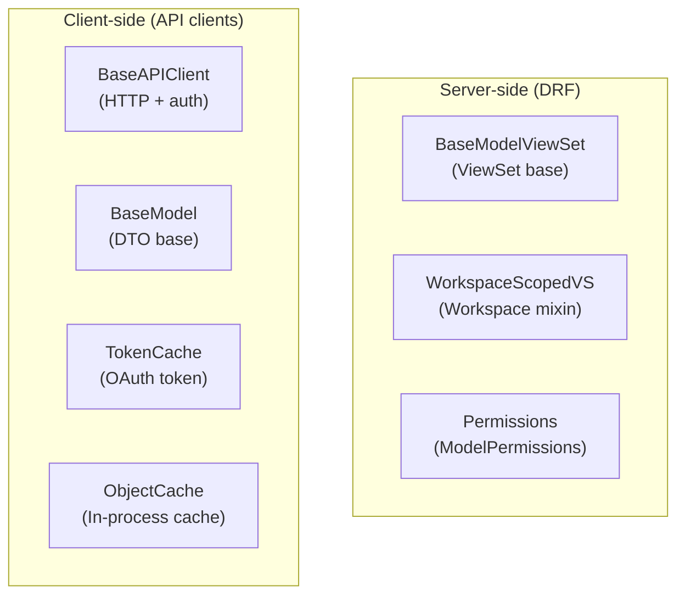

*Figure 10: Component structure of the `koalixcrm/shared/` package. Arrows omitted intentionally; this is a structural view only.*

---

### Name Index

| Short alias | Full name |
|---|---|
| BaseVS | `koalixcrm/shared/base_model_view_set.py` — `BaseModelViewSet` |
| WSScopedVS | `koalixcrm/shared/workspace_scoped_view_set.py` — `WorkspaceScopedViewSetMixin` |
| Perms | `koalixcrm/shared/permissions.py` — `ModelPermissionsWithListView` |
| APIClient | `koalixcrm/shared/api_client.py` — `BaseAPIClient` |
| BaseModel | `koalixcrm/shared/base_model.py` — `BaseModel` |
| TokCache | `koalixcrm/shared/token_cache.py` — `TokenCache` |
| ObjCache | `koalixcrm/shared/object_cache.py` — `ObjectCache` |

---

### Package and Module Catalogue

#### Server-side (Django / DRF)

**`base_model_view_set.py` — Base ViewSet**

| Class | Responsibility |
|---|---|
| `BaseModelViewSet` | Subclass of `viewsets.ModelViewSet`; sets `permission_classes = [IsAuthenticated, ModelPermissionsWithListView]` as the default permission policy for all domain-app ViewSets; subclasses override `queryset` and `serializer_class` only |

**`workspace_scoped_view_set.py` — Workspace-Scoping Mixin**

| Class / Method | Responsibility |
|---|---|
| `WorkspaceScopedViewSetMixin` | Mixin applied to ViewSets that expose workspace-scoped resources; `_resolve_workspace()` reads the `workspace_id` URL kwarg and resolves it to a `Workspace` instance; `get_queryset()` appends `filter(workspace=workspace)` on the base queryset; `perform_create()` stamps the resolved workspace on the new instance before save |

**`permissions.py` — DRF Permission Class**

| Class | Responsibility |
|---|---|
| `ModelPermissionsWithListView` | Subclass of `DjangoModelPermissions`; extends the parent's `perms_map` to require `view` permission for `GET` list requests (`list` action), closing the default DRF behaviour where `GET /` was permitted without any explicit `view` permission |

---

#### Client-side (API Clients)

**`api_client.py` — HTTP API Client Base**

| Class / Method | Responsibility |
|---|---|
| `BaseAPIClient` | Abstract base class for all `*_api_py` client implementations; manages OIDC/OAuth2 token acquisition (`get_token()` via client-credentials or session-cookie flow), HTTP connection setup (`_build_connection()` supports HTTP and HTTPS), request execution (`_execute_request()` with retry, error handling, and JSON parsing), and an optional in-process `ObjectCache`; `_get_object()`, `_get_object_list()`, `_put_full_update()`, and `_patch_partial_update()` provide typed CRUD helpers used by subclasses |
| `_discover_token_endpoint()` | Resolves the OIDC token endpoint via discovery (`oidc_utils.get_oidc_discovery`) when no explicit endpoint is configured |

**`base_model.py` — DTO Base Class**

| Class | Responsibility |
|---|---|
| `BaseModel` | Base class for all client-side data transfer objects (DTOs); `__init__` populates instance attributes from a raw JSON dict via `_populate_from_data()`; `_to_dict()` / `_from_dict()` provide serialization round-trips including nested `BaseModel` subclass reconstruction; `id` property provides typed access to the primary key |

**`token_cache.py` — OAuth Token Cache**

| Class | Responsibility |
|---|---|
| `TokenCache` | Singleton (enforced via `__new__`) that persists OAuth access tokens and their expiry times to a local file (path configured via `settings.TOKEN_CACHE_FILE`); `get_token()` returns a cached valid token or `None` on expiry; `set_token()` stores a new token with an expiry timestamp computed from `expires_in`; `store_token()` combines set and file-persist; `clear()` resets the cache |

**`object_cache.py` — In-process DTO Cache**

| Class | Responsibility |
|---|---|
| `ObjectCache` | Simple in-process dict cache keyed by `(model_class.__name__, object_id)`; used by `BaseAPIClient._get_object()` and `_get_object_list()` to avoid redundant GET requests within a single task invocation; `clear()` resets all entries |

---

### External Dependencies of the Shared Library

| Dependency | Used for |
|---|---|
| `rest_framework.viewsets.ModelViewSet` | Base class for `BaseModelViewSet` |
| `rest_framework.permissions.DjangoModelPermissions` | Base class for `ModelPermissionsWithListView` |
| `rest_framework.permissions.IsAuthenticated` | Default permission class applied in `BaseModelViewSet` |
| `koalixcrm.core.models.workspace.Workspace` | Resolved by `WorkspaceScopedViewSetMixin._resolve_workspace()` |
| `koalixcrm.auth.oidc_utils.get_oidc_discovery` | Used by `BaseAPIClient._discover_token_endpoint()` to obtain the token endpoint URL |
| `http.client` (stdlib) | Low-level HTTP connections used in `BaseAPIClient._build_connection()` |

---

## API Client Libraries — Internal Structure

### Overview

Six `*_api_py` packages (each a sibling of the corresponding domain app inside
`koalixcrm/`) implement typed Python client libraries for the koalixcrm REST API. They are
consumed by the Celery worker and the SQS poller to read from and write to the Django backend
over HTTP. All six packages follow an identical two-layer pattern:

- **`dto/`** — A `BaseModel` subclass per API resource, one file per entity; attributes are
  populated from the JSON response dict.
- **`*_api_client.py`** — A `BaseAPIClient` subclass that wires CRUD methods (get, list, create,
  update) for each resource to the corresponding REST endpoint paths.
- **`*_api.py`** — A thin entry-point module that re-exports the ViewSet classes (for the
  packages that also contain ViewSets, e.g. `core_api_py`) or re-exports the client class.

The three larger packages are documented individually below; the three smaller ones are grouped.

---

### Layered Architecture Diagram

**Figure 11 — API Client Libraries: Component Structure**

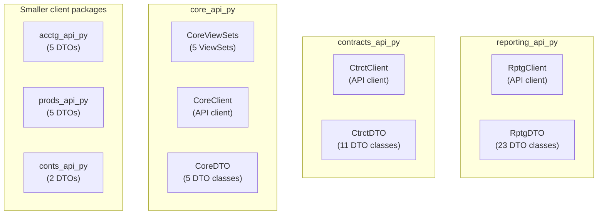

*Figure 11: Component structure of the six `*_api_py` client packages. Arrows omitted intentionally; this is a structural view only.*

---

### Name Index

| Short alias | Full name |
|---|---|
| RptgClient | `koalixcrm/reporting_api_py/reporting_api_client.py` — `KoalixCRMReportingAPIClient` |
| RptgDTO | `koalixcrm/reporting_api_py/dto/` — 23 DTO classes for the reporting domain |
| CtrctClient | `koalixcrm/contracts_api_py/contracts_api_client.py` — `KoalixCRMContractsAPIClient` |
| CtrctDTO | `koalixcrm/contracts_api_py/dto/` — 11 DTO classes for the contracts domain |
| CoreViewSets | `koalixcrm/core_api_py/` (top-level) — 5 DRF ViewSet classes for core lookup models |
| CoreClient | `koalixcrm/core_api_py/core_api_client.py` — `KoalixCRMCoreAPIClient` |
| CoreDTO | `koalixcrm/core_api_py/dto/` — 5 DTO classes for core lookup models |
| acctg_api_py | `koalixcrm/accounting_api_py/` — `KoalixCRMAccountingAPIClient` + 5 DTOs |
| prods_api_py | `koalixcrm/products_api_py/` — `KoalixCRMProductsAPIClient` + 5 DTOs |
| conts_api_py | `koalixcrm/contacts_api_py/` — `KoalixCRMContactsAPIClient` + 2 DTOs |

---

### Reporting API Client (`reporting_api_py`, ~951 LoC)

**`dto/` — DTO Classes**

| DTO | Wraps resource |
|---|---|
| `Project` | Reporting project |
| `ProjectStatus` | Project lifecycle status lookup |
| `Task` | Task within a project |
| `TaskStatus` | Task lifecycle status lookup |
| `Work` | Time-entry record |
| `Agreement` | Rate contract |
| `AgreementStatus` | Agreement status lookup |
| `AgreementType` | Agreement type lookup |
| `Estimation` | Remaining-effort estimate |
| `EstimationStatus` | Estimation status lookup |
| `HumanResource` | Staff resource |
| `Resource` | Generic resource |
| `ResourceManager` | Resource organisational owner |
| `ResourceType` | Resource classification |
| `ResourcePrice` | Resource hourly price |
| `ReportingPeriod` | Calendar-bounded reporting period |
| `ReportingPeriodStatus` | Period lifecycle status |
| `GenericProjectLink` | Polymorphic link from project to any CRM object |
| `GenericTaskLink` | Polymorphic link from task to any CRM object |
| `ProjectLinkType` | Project link type lookup |
| `TaskLinkType` | Task link type lookup |

**`reporting_api_client.py`**

| Class | Responsibility |
|---|---|
| `KoalixCRMReportingAPIClient` | `BaseAPIClient` subclass; exposes `get_*`, `get_*_list`, `create_*`, and `update_*` methods for every DTO type listed above, routing each to the corresponding REST endpoint under `/koalixcrm_reporting/api/v1/<workspace_id>/` |

---

### Contracts API Client (`contracts_api_py`, ~559 LoC)

**`dto/` — DTO Classes**

| DTO | Wraps resource |
|---|---|
| `Contract` | Root contract aggregate |
| `CommercialDocument` | Base commercial document |
| `CommercialDocumentPosition` | Line-item position |
| `Quotation` | Quotation document |
| `SalesOrder` | Sales order document |
| `Invoice` | Invoice document |
| `CreditNote` | Credit note document |
| `PurchaseOrder` | Purchase order document |
| `DespatchAdvice` | Despatch advice document |
| `PaymentReminder` | Payment reminder document |
| `Position` | Abstract position base |

**`contracts_api_client.py`**

| Class | Responsibility |
|---|---|
| `KoalixCRMContractsAPIClient` | `BaseAPIClient` subclass; exposes `get_*`, `get_*_list`, `create_*`, and `update_*` methods for contracts, invoices, quotations, sales orders, purchase orders, despatch advices, payment reminders, and commercial document positions |

---

### Core API Client / ViewSets (`core_api_py`, ~371 LoC)

Unlike the other `*_api_py` packages, `core_api_py` serves a dual role: it contains both
server-side DRF ViewSets (imported by `koalixcrm.core.urls`) and a client-side API client.

**Server-side ViewSets**

| Class / File | Responsibility |
|---|---|
| `CurrencyViewSet` (`currency_view_set.py`) | CRUD ViewSet for `core.Currency`; registered in `koalixcrm.core.urls` |
| `TaxViewSet` (`tax_view_set.py`) | CRUD ViewSet for `core.Tax` |
| `UnitViewSet` (`unit_view_set.py`) | CRUD ViewSet for `core.Unit` |
| `CurrencyTransformViewSet` (`currency_transform_view_set.py`) | CRUD ViewSet for `core.CurrencyTransform` |
| `UnitTransformViewSet` (`unit_transform_view_set.py`) | CRUD ViewSet for `core.UnitTransform` |
| `PDFExportProcessViewSet` (`pdf_export_process_view_set.py`) | CRUD ViewSet for `core.PDFExportProcess`; the Celery worker uses PATCH to update job status |

**`dto/` — DTO Classes**

| DTO | Wraps resource |
|---|---|
| `Currency` | Currency lookup |
| `CurrencyTransform` | Currency conversion factor |
| `Tax` | Tax rate lookup |
| `Unit` | Unit of measure lookup |
| `UnitTransform` | Unit conversion factor |

**`core_api_client.py`**

| Class | Responsibility |
|---|---|
| `KoalixCRMCoreAPIClient` | `BaseAPIClient` subclass; exposes CRUD methods for currencies, taxes, units, currency transforms, and unit transforms; also exposes `update_pdf_export_process()` for the Celery worker to PATCH job status |

---

### Smaller API Client Packages

**`accounting_api_py/`**

| Component | Responsibility |
|---|---|
| `dto/Account`, `AccountingPeriod`, `BaseModel`, `Booking`, `ProductCategory` | Five DTO classes wrapping the accounting REST resources |
| `KoalixCRMAccountingAPIClient` | `BaseAPIClient` subclass; CRUD for accounts, accounting periods, and bookings |

**`products_api_py/`**

| Component | Responsibility |
|---|---|
| `dto/Price`, `Product`, `ProductPrice`, `ProductType`, `CustomerGroupTransform` | Five DTO classes wrapping the products REST resources |
| `KoalixCRMProductsAPIClient` | `BaseAPIClient` subclass; CRUD for product types, prices, and customer-group transforms |

**`contacts_api_py/`**

| Component | Responsibility |
|---|---|
| `dto/CustomerBillingCycle`, `party_dtos` | Two DTO modules wrapping contacts REST resources (billing cycles and the party hierarchy) |
| `KoalixCRMContactsAPIClient` | `BaseAPIClient` subclass; CRUD for parties and billing cycles |

---

### External Dependencies of the API Client Libraries

| Dependency | Used for |
|---|---|
| `koalixcrm.shared.api_client.BaseAPIClient` | Base class for all six client classes |
| `koalixcrm.shared.base_model.BaseModel` | Base class for all DTO classes |
| `koalixcrm.shared.base_model_view_set.BaseModelViewSet` | Base class for the ViewSets in `core_api_py` |
| `koalixcrm.core.serializers` | DRF serializers wired to the ViewSets in `core_api_py` |
| `koalixcrm.auth.oidc_utils` | Consumed by `BaseAPIClient._discover_token_endpoint()` via the shared library |

---

## Microservices Package — Internal Structure

### Overview

The `koalixcrm_microservices/` package (~225 LoC) is the entry-point layer for the asynchronous
processing side of koalixcrm. It provides two independently runnable processes:

- A **Celery worker** (`celery_app.py`) that handles tasks dispatched from within Django (such as
  PDF export jobs). It imports Django, loads the full application context, and registers Celery
  tasks.
- An **SQS poller** (`sqs_poller.py`) that continuously polls the configured SQS queue, deserialises
  inbound `CommandEnvelope` messages, and dispatches them to the appropriate handler (currently
  only `PDFExportCommand` is routed).

Neither component is a Django app; neither has models, migrations, or admin registrations. Both
are invoked as separate OS processes alongside the Django WSGI server.

---

### Layered Architecture Diagram

**Figure 12 — Microservices Package: Component Structure**

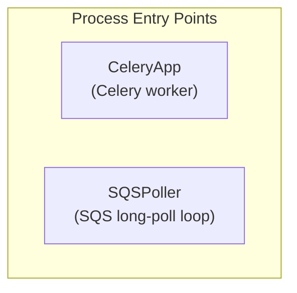

*Figure 12: Component structure of the `koalixcrm_microservices/` package. Arrows omitted intentionally; this is a structural view only.*

---

### Package and Module Catalogue

**`celery_app.py` — Celery Worker Configuration**

| Symbol | Responsibility |
|---|---|
| `app` | `Celery` instance configured with `CELERY_BROKER_URL` (SQS endpoint) and `CELERY_RESULT_BACKEND`; auto-discovers tasks from all installed Django apps via `app.autodiscover_tasks()`; applies SQS-optimised settings (visibility timeout, prefetch multiplier, max tasks per child) from environment variables via `_float_env()` |
| `_on_task_unknown` | Signal handler registered on `task_unknown`; logs unknown task names to prevent silent message loss |
| `_on_worker_ready` | Signal handler registered on `worker_ready`; emits a startup log line with the worker hostname |

**`sqs_poller.py` — SQS Long-Poll Loop**

| Function | Responsibility |
|---|---|
| `_parse_message_body(body)` | Deserialises the raw SQS message body string; handles double-encoded JSON (SNS-wrapped and plain) |
| `dispatch_command(env)` | Receives a `CommandEnvelope`; routes to the appropriate handler based on `env.command_type`; currently handles `PDFExportCommand` by calling the `koalixcrm_microservices` Celery task for PDF rendering; returns `True` on successful dispatch, `False` on unknown command type |
| `start_poller()` | Entry-point function; runs an infinite long-poll loop (`WaitTimeSeconds=20`) against the configured SQS queue using `koalixcrm_utils.aws_clients.get_sqs_queue()`; deletes the message from the queue only after `dispatch_command()` returns `True`; logs unrecognised message types and re-raises on unhandled exceptions |

---

### External Dependencies of the Microservices Package

| Dependency | Used for |
|---|---|
| `celery` | `Celery` application class and signal handling |
| `django` | Full Django stack loaded in `celery_app.py` via `django.setup()` |
| `koalixcrm_mq_commands.envelope.CommandEnvelope` | Deserialised from SQS messages in `sqs_poller.py` |
| `koalixcrm_mq_commands.pdf_export_command.PDFExportCommand` | Extracted from the envelope payload and passed to the Celery task |
| `koalixcrm_utils.aws_clients.get_sqs_queue` | SQS queue handle used by `start_poller()` |
| `projectsettings` | `DJANGO_SETTINGS_MODULE` used by `celery_app.py` |

---

## MQ Commands Library — Internal Structure

### Overview

The `koalixcrm_mq_commands/` package (~93 LoC) is a deliberately minimal shared library that
defines the message contract between the Django backend and the Celery worker / SQS poller. It
contains only plain Python dataclasses with JSON serialization; it must not import Django, Celery,
or any koalixcrm application module. This constraint is enforced by the unit test
`tests/unit/test_mq_commands_is_django_free.py`, which verifies the package can be imported in a
bare Python process without `DJANGO_SETTINGS_MODULE` set.

---

### Layered Architecture Diagram

**Figure 13 — MQ Commands Library: Component Structure**

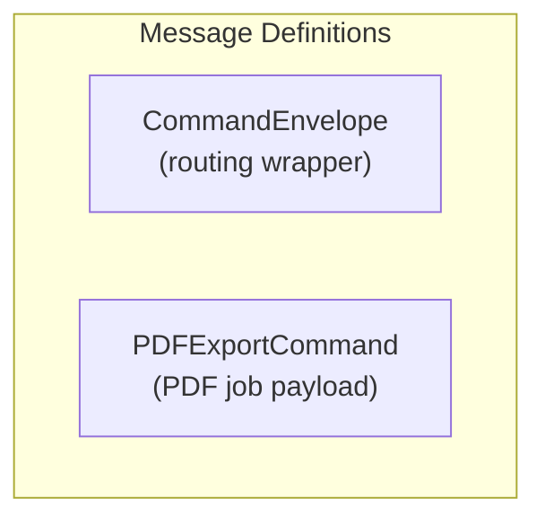

*Figure 13: Component structure of the `koalixcrm_mq_commands/` package. Arrows omitted intentionally; this is a structural view only.*

---

### Package and Module Catalogue

**`envelope.py` — Command Routing Envelope**

| Class | Responsibility |
|---|---|
| `CommandEnvelope` | Dataclass wrapping all outbound MQ messages; fields: `command_type` (string discriminator, e.g. `"PDFExportCommand"`), `payload` (raw dict carrying the command-specific body); `to_json()` serialises to a JSON string; `from_json()` classmethod deserialises from a JSON string or dict, supporting both top-level and SNS-wrapped payloads |

**`pdf_export_command.py` — PDF Export Job Payload**

| Class | Responsibility |
|---|---|
| `PDFExportCommand` | Dataclass representing a PDF export job; fields: `process_id` (PK of `core.PDFExportProcess`), `source_model` (ORM class name), `source_id` (PK of the source instance), `template_set_id`, `printed_by_user_id`; `to_dict()` / `to_json()` serialise for SQS dispatch; `from_dict()` / `from_json()` deserialise on the worker side; `command_type` classmethod returns the routing discriminator string `"PDFExportCommand"` |

---

### External Dependencies of the MQ Commands Library

This package has no external runtime dependencies beyond the Python standard library (`dataclasses`,
`json`). It does not import Django, Celery, boto3, or any other koalixcrm package.

---

## Utilities Library — Internal Structure

### Overview

The `koalixcrm_utils/` package (~575 LoC) is the shared AWS and database utility library for
koalixcrm. It provides factory functions for boto3 S3 and SQS clients, a custom Django storage
backend backed by S3, a presigned URL helper, and two command-line scripts for database operations:
a PostgreSQL-dump-to-SQLite converter (`pg2sqlite.py`) used in the CI/CD pipeline to provision
test databases, and a pre-migration cleanup tool (`pre_migrate_cleanup.py`) that handles SQLite
schema repair before Django migrations are applied.

This package is not a Django app; it has no models, migrations, or admin registrations.

---

### Layered Architecture Diagram

**Figure 14 — Utilities Library: Component Structure**

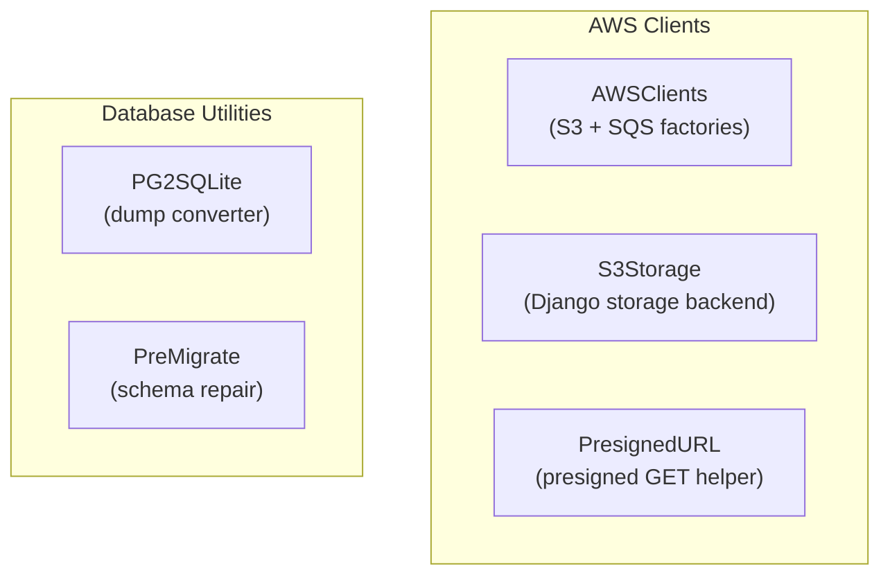

*Figure 14: Component structure of the `koalixcrm_utils/` package. Arrows omitted intentionally; this is a structural view only.*

---

### Name Index

| Short alias | Full name |
|---|---|
| AWSClients | `koalixcrm_utils/aws_clients.py` — boto3 client factory functions |
| S3Storage | `koalixcrm_utils/s3_storage.py` — `TemplateFileStorage` |
| PresignedURL | `koalixcrm_utils/presigned_urls.py` — `presigned_get_url_for_field()` |
| PG2SQLite | `koalixcrm_utils/pg2sqlite.py` — PostgreSQL dump to SQLite converter script |
| PreMigrate | `koalixcrm_utils/pre_migrate_cleanup.py` — SQLite pre-migration schema repair script |

---

### Package and Module Catalogue

**`aws_clients.py` — boto3 Client Factories**

| Function | Responsibility |
|---|---|
| `get_s3_client(region_name, use_presigned_config)` | Returns a boto3 S3 client; uses `AWS_S3_ENDPOINT_URL` from settings to point at MinIO in development; `use_presigned_config=True` returns a client configured with `signature_version=s3v4` and the public-facing `AWS_S3_PRESIGNED_URL_BASE_URL` endpoint, required for generating browser-accessible presigned URLs from inside a Docker network |
| `get_sqs_client(region_name)` | Returns a boto3 SQS client; endpoint resolved from `AWS_SQS_ENDPOINT_URL` (ElasticMQ in development, real SQS in production) |
| `get_sqs_resource(region_name)` | Returns a boto3 SQS `resource` (high-level abstraction); used by `get_sqs_queue()` |
| `get_sqs_queue(queue_name)` | Resolves the SQS queue URL by name (from `AWS_SQS_QUEUE_NAME` setting) and returns the boto3 `Queue` object; consumed by `koalixcrm_microservices.sqs_poller` and `koalixcrm.core.pdf_export_dispatch` |

**`s3_storage.py` — Django Storage Backend**

| Class | Responsibility |
|---|---|
| `TemplateFileStorage` | Subclass of `django-storages` `S3Boto3Storage`; overrides `bucket_name` with `settings.AWS_TEMPLATE_STORAGE_BUCKET_NAME` and `file_overwrite=False`; used as the `storage` argument on `DocumentTemplate` file fields in `djangoUserExtension`; ensures XSL, FOP configuration, and logo assets are stored in a dedicated S3 bucket separate from the general media bucket |

**`presigned_urls.py` — Presigned URL Helper**

| Function | Responsibility |
|---|---|
| `presigned_get_url_for_field(field_file, expires_in)` | Generates a presigned S3 GET URL for a `FieldFile` (i.e. a `DocumentTemplate` file field); calls `get_s3_client(use_presigned_config=True)` to obtain the public-facing S3 client, then calls `generate_presigned_url('get_object', ...)` with a default expiry of `DEFAULT_EXPIRES_IN` seconds (300); returns the presigned URL string |

**`pg2sqlite.py` — PostgreSQL Dump Converter**

| Function | Responsibility |
|---|---|
| `parse_create_table(lines, idx)` | Parses a `CREATE TABLE` block from a PostgreSQL dump file, stripping unsupported constraint types and rewriting column types for SQLite compatibility (e.g. `integer` → `INTEGER`, `boolean` → `INTEGER`) |
| `parse_copy_block(lines, idx)` | Parses a PostgreSQL `COPY … FROM stdin` block and converts it to SQLite-compatible `INSERT INTO` statements; handles `NULL` values and tab-separated column data |
| `main()` | CLI entry point: reads a PostgreSQL dump from stdin, passes it through `parse_create_table` and `parse_copy_block`, and writes SQLite-compatible SQL to stdout |

**`pre_migrate_cleanup.py` — SQLite Pre-migration Schema Repair**

| Function | Responsibility |
|---|---|
| `extract_data(db_path, dump_path)` | Exports all table data from an existing SQLite database to a JSON dump file; preserves row ordering |
| `drop_all_tables(db_path)` | Drops all user tables from the SQLite database (excluding `sqlite_sequence`), clearing the schema entirely |
| `import_data(db_path, dump_path)` | Re-imports rows from the JSON dump produced by `extract_data()` into the freshly migrated schema; handles column-set mismatches by skipping columns absent from the new schema |
| `main()` | CLI entry point: orchestrates `extract_data`, `drop_all_tables`, and `import_data` to clean up a SQLite database before `manage.py migrate` is applied; intended for CI/CD pipelines that provision SQLite test databases from a PostgreSQL dump converted by `pg2sqlite.py` |

---

### External Dependencies of the Utilities Library

| Dependency | Used for |
|---|---|
| `boto3` | S3 and SQS client construction in `aws_clients.py` |
| `django-storages` (`storages.backends.s3boto3.S3Boto3Storage`) | Base class for `TemplateFileStorage` |
| `settings.AWS_S3_ENDPOINT_URL` / `AWS_S3_PRESIGNED_URL_BASE_URL` | MinIO vs. real S3 endpoint selection |
| `settings.AWS_TEMPLATE_STORAGE_BUCKET_NAME` | Dedicated S3 bucket for document templates |
| `settings.AWS_SQS_ENDPOINT_URL` / `AWS_SQS_QUEUE_NAME` | SQS endpoint and queue name |

---

## Project Settings Package — Internal Structure

### Overview

The `projectsettings/` package (~819 LoC) is the Django configuration root for the koalixcrm
application. It provides the settings module hierarchy, the root URLConf, the WSGI entry point,
and a Grappelli dashboard configuration. Settings are stratified into a shared base and two
environment-specific overlays used during local development.

---

### Layered Architecture Diagram

**Figure 15 — Project Settings Package: Component Structure**

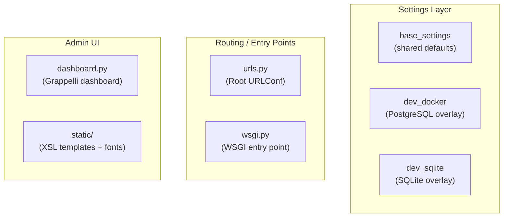

*Figure 15: Component structure of the `projectsettings/` package. Arrows omitted intentionally; this is a structural view only.*

---

### Name Index

| Short alias | Full name |
|---|---|
| BaseSettings | `projectsettings/settings/base_settings.py` — shared Django settings |
| DevDockerSettings | `projectsettings/settings/development_docker_settings.py` — local Docker PostgreSQL overlay |
| DevSQLiteSettings | `projectsettings/settings/development_docker_sqlite_settings.py` — local SQLite overlay |
| URLConf | `projectsettings/urls.py` — root URL patterns and schema endpoint |
| WSGI | `projectsettings/wsgi.py` — WSGI application factory |
| Dashboard | `projectsettings/dashboard.py` — Grappelli admin dashboard configuration |
| StaticAssets | `projectsettings/static/default_templates/` — bundled XSL/FO templates and font assets |

---

### Package and Module Catalogue

**`settings/base_settings.py` — Shared Settings**

The base settings file assembles the complete Django configuration from environment variables and
sensible defaults. Key groups:

| Group | Key settings |
|---|---|
| Installed apps | `PREREQUISITE_APPS` (Django built-ins, DRF, Grappelli, Filebrowser, `django-storages`, `drf-spectacular`) + `PROJECT_APPS` (all eight koalixcrm domain apps, `koalixcrm.shared`, `koalixcrm.auth`); combined into `INSTALLED_APPS` |
| Middleware stack | `SecurityMiddleware`, `SessionMiddleware`, `CommonMiddleware`, `CsrfViewMiddleware`, `AuthenticationMiddleware`, `MessageMiddleware`, `XFrameOptionsMiddleware`, `WorkspaceContextMiddleware`, `TimezoneMiddleware` |
| REST Framework | `DEFAULT_AUTHENTICATION_CLASSES`: `OIDCAccessTokenAuthentication`, `CeleryWorkerM2MAuthentication`, `SessionAuthentication`; `DEFAULT_PERMISSION_CLASSES`: `IsAuthenticated` |
| Authentication backends | `OIDCAuthenticationBackend`, Django's built-in `ModelBackend` |
| Routing | `ROOT_URLCONF = 'projectsettings.urls'` |
| Static / media | `STATIC_ROOT`, `MEDIA_ROOT`, S3 media backend via `django-storages` when `AWS_STORAGE_BUCKET_NAME` is set |
| Password validation | Django's four built-in validators |

**`settings/development_docker_settings.py` — Local Docker PostgreSQL Overlay**

Overrides `DEBUG`, `SECRET_KEY`, `DATABASES` (PostgreSQL via `DATABASE_URL`), `ALLOWED_HOSTS`,
and all AWS/SQS/OIDC settings from environment variables; also sets M2M auth environment
variables (`CELERY_WORKER_M2M_OIDC_ISSUER`, `CELERY_WORKER_M2M_CLIENT_ID`,
`CELERY_WORKER_M2M_CLIENT_SECRET`, `CELERY_WORKER_M2M_SCOPE`).

**`settings/development_docker_sqlite_settings.py` — Local SQLite Overlay**

Overrides `DEBUG = True`, `DATABASES` to use an SQLite file; used by the `pytest.ini` default
(`DJANGO_SETTINGS_MODULE=projectsettings.settings.development_docker_sqlite_settings`) so the
test suite runs without a running PostgreSQL instance.

**`urls.py` — Root URLConf**

The root URL configuration mounts all application REST endpoints under workspace-scoped paths
and the legacy Django Admin under `/admin/`. Key URL groups:

| URL prefix | Mounted app |
|---|---|
| `/koalixcrm_accounting/api/v1/<workspace_id>/` | `koalixcrm.accounting.urls` |
| `/koalixcrm_contacts/api/v1/<workspace_id>/` | `koalixcrm.contacts.urls` |
| `/koalixcrm_products/api/v1/<workspace_id>/` | `koalixcrm.products.urls` |
| `/koalixcrm_core/api/v1/<workspace_id>/` | `koalixcrm.core.urls` |
| `/koalixcrm_contracts/api/v1/<workspace_id>/` | `koalixcrm.contracts.urls` |
| `/koalixcrm_reporting/api/v1/<workspace_id>/` | `koalixcrm.reporting.api_urls` |
| `/koalixcrm/crm/reporting/` | `koalixcrm.reporting.urls` (legacy HTML time-tracking UI) |
| `/admin/` | Django Admin with Grappelli |
| `/grappelli/` | Grappelli admin skin |
| `/api-auth/` | DRF browsable API login/logout |
| `/auth/` | OIDC login/callback/logout views from `koalixcrm.auth` |
| `/api/schema/` | `drf-spectacular` OpenAPI schema endpoint |

**`wsgi.py` — WSGI Entry Point**

Sets `DJANGO_SETTINGS_MODULE` and exposes the standard `application = get_wsgi_application()`
callable consumed by gunicorn or uWSGI.

**`dashboard.py` — Grappelli Admin Dashboard**

Configures the Grappelli dashboard shown on the Django Admin home page: includes the built-in
`AppList` module and the `WorkspaceSwitcherModule` from `koalixcrm.core.admin.dashboard_modules`
as a side panel.

**`static/default_templates/` — Bundled Print Assets**

XSL/FO templates (invoice, quotation, sales order, purchase order, despatch advice, project
report, work report, balance sheet, profit/loss statement) for German (`de/`) and English (`en/`)
locales, plus DejaVu Sans fonts and a font configuration file in `generic/`. These are served via
`collectstatic` and referenced by the `koalixcrm_install_defaulttemplates` management command.

---

### External Dependencies of the Project Settings Package

| Dependency | Used for |
|---|---|
| `koalixcrm.core.middleware` | `WorkspaceContextMiddleware` and `TimezoneMiddleware` in the middleware stack |
| `koalixcrm.auth` | `OIDCAccessTokenAuthentication`, `CeleryWorkerM2MAuthentication`, `OIDCAuthenticationBackend` in REST Framework and auth backend settings |
| `koalixcrm.core.admin.dashboard_modules.WorkspaceSwitcherModule` | Injected into the Grappelli dashboard |
| `drf_spectacular` | `SpectacularAPIView` and `SpectacularSwaggerView` wired in `urls.py` for the OpenAPI schema endpoint |
| `grappelli` | Admin skin and dashboard; `grappelli.urls` mounted in `urls.py` |
| `filebrowser` | Media library; mounted in `urls.py` under `/admin/filebrowser/` |
| `django-storages` | S3 media backend activated in `base_settings.py` when `AWS_STORAGE_BUCKET_NAME` is set |

---

## Test Suite — Structure and Strategy

### Overview

The `tests/` package (~7,919 LoC) contains all automated tests for the koalixcrm project. Tests
are organised by domain and test type, and are executed by pytest with the
`development_docker_sqlite_settings` configuration by default. The test suite is structured into
five distinct layers:

1. **Factories** — `factory_boy` factory classes, one per ORM model, used as shared fixtures
   across all test layers.
2. **Unit tests** (`tests/unit/`) — Pure Python tests that do not require a database or Django;
   validate architectural invariants.
3. **Legacy CRM tests** (`tests/legacy_crm/`) — Django-database tests covering domain model
   business logic (cost, effort, and duration calculations) that predate the current REST API layer.
4. **API client tests** (`tests/*_api_py/`) — Tests for each of the six `*_api_py` client
   packages; verify CRUD round-trips against a live backend using the `APIClient`.
5. **Integration tests** (`tests/integration/`) — Infrastructure smoke tests that require a
   running Docker Compose stack (MinIO, ElasticMQ, Django backend).

---

### Layered Architecture Diagram

**Figure 16 — Test Suite: Structural Organisation**

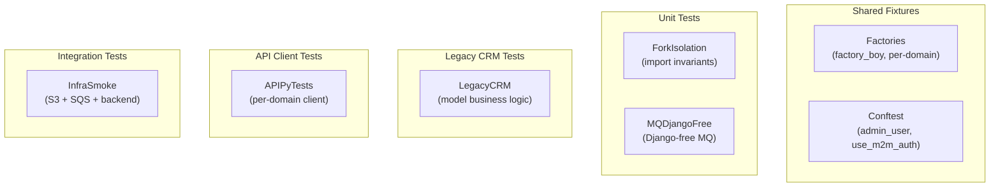

*Figure 16: Structural organisation of the `tests/` package. Arrows omitted intentionally; this is a structural view only.*

---

### Name Index

| Short alias | Full name |
|---|---|
| Factories | `tests/factories/` — `factory_boy` factory classes per domain app |
| Conftest | `conftest.py` (project root) — shared pytest fixtures |
| ForkIsolation | `tests/unit/test_fork_isolation.py` — import invariant checks |
| MQDjangoFree | `tests/unit/test_mq_commands_is_django_free.py` — Django-free MQ commands |
| LegacyCRM | `tests/legacy_crm/` — domain model business logic tests |
| APIPyTests | `tests/accounting_api_py/`, `tests/contacts_api_py/`, `tests/contracts_api_py/`, `tests/products_api_py/`, `tests/reporting_api_py/` — API client tests |
| InfraSmoke | `tests/integration/test_infra_smoke.py` — infrastructure smoke tests |

---

### Test Suite Structure

#### Shared Fixtures

**`tests/factories/` — factory_boy Factories**

Organised into domain sub-packages mirroring the application's app layout. Each sub-package
contains one factory file per ORM model class:

| Sub-package | Factory files |
|---|---|
| `factories/accounting/` | `AccountFactory`, `AccountingPeriodFactory`, `BookingFactory`, `ProductCategoryFactory` |
| `factories/contacts/` | `ContactFactory`, `CustomerBillingCycleFactory`, `CustomerFactory`, `CustomerGroupFactory`, `PostalAddressFactory`, `SupplierFactory`, `UserFactory` |
| `factories/contracts/` | `CommercialDocumentFactory`, `CommercialDocumentPositionFactory`, `ContractFactory`, plus one factory per document subtype (quotation, invoice, sales order, purchase order, credit note, despatch advice, payment reminder) |
| `factories/core/` | `CurrencyFactory`, `CurrencyTransformFactory`, `TaxFactory`, `UnitFactory`, `UnitTransformFactory`, `WorkspaceFactory` |
| `factories/djangoUserExtension/` | `DocumentTemplateFactory`, `TemplateSetFactory`, `UserExtensionFactory` |
| `factories/products/` | `CustomerGroupTransformFactory`, `ProductFactory`, `ProductPriceFactory`, `ProductTypeFactory` |
| `factories/reporting/` | Twenty-one factory files covering every reporting model (projects, tasks, work, agreements, estimations, resources, reporting periods, and all lookup types) |

**`conftest.py` (project root)**

| Fixture | Responsibility |
|---|---|
| `admin_user` | Creates and returns an `auth.User` with `is_staff=True` and `is_superuser=True` using `UserFactory`; `db`-scoped |
| `use_m2m_auth` | Patches the `DEFAULT_AUTHENTICATION_CLASSES` setting to use only `CeleryWorkerM2MAuthentication`, allowing tests to simulate Celery worker API calls |

---

#### Unit Tests

**`tests/unit/test_fork_isolation.py` — Import Invariant Checks**

| Test | What it verifies |
|---|---|
| `test_public_app_has_no_forbidden_imports` | Walks all `.py` files in each `*_api_py` package and asserts that no file imports Django ORM symbols or other forbidden cross-layer modules; enforces the API-client isolation rule (the `*_api_py` packages must not depend on the Django ORM) |
| `test_public_app_has_no_forbidden_string_model_refs` | Checks that `*_api_py` files do not reference Django model class names as strings, closing a loophole the import-name check would miss |

**`tests/unit/test_mq_commands_is_django_free.py`**

| Test | What it verifies |
|---|---|
| `test_mq_commands_does_not_import_django` | Spawns a subprocess without `DJANGO_SETTINGS_MODULE` and imports `koalixcrm_mq_commands`; asserts the import succeeds and that `django` does not appear in `sys.modules` after the import; enforces the CR-3 architectural constraint that `koalixcrm_mq_commands` must remain a pure-Python dataclass library |

---

#### Legacy CRM Tests (`tests/legacy_crm/`)

Contains seventeen Django database tests covering the business logic of the `reporting` and
`contracts` domain models, predating the REST API layer. Tests use `factory_boy` fixtures to
construct model graphs and assert computed properties such as:

- `Project.effective_costs()`, `Project.planned_costs()`, `Project.effective_effort()`
- `Task.effective_costs()` with and without agreements, `Task.planned_costs()`,
  `Task.effective_duration()`, `Task.effective_effort()`, `Task.planned_effort()`,
  `Task.planned_duration()`
- `Work.delete()` mutability guard on a closed `ReportingPeriod`
- `Task.last_status_change` update logic
- `Calculations.calculate_document_price()` for `CommercialDocumentPosition`
- `CommercialDocumentPosition.is_complete_with_price()` predicate

---

#### API Client Tests (`tests/*_api_py/`)

One sub-package per `*_api_py` library. Tests use the `APIClient` (DRF test client) to perform
HTTP CRUD round-trips against the live Django test database and assert that the client library
correctly serialises requests and deserialises responses. Test coverage per domain:

| Sub-package | Covered resources |
|---|---|
| `tests/accounting_api_py/` | Account, AccountingPeriod, Booking (including balance aggregation), ProductCategory |
| `tests/contacts_api_py/` | CustomerBillingCycle |
| `tests/contracts_api_py/` | Contract, Invoice, Quotation |
| `tests/products_api_py/` | ProductType |
| `tests/reporting_api_py/` | Project, ProjectStatus, Task, TaskStatus, Work, Agreement, AgreementStatus, AgreementType, Estimation, EstimationStatus, HumanResource, ReportingPeriod, ReportingPeriodStatus |

---

#### Integration Tests (`tests/integration/`)

| Test | Requires | What it verifies |
|---|---|---|
| `test_minio_roundtrip_on_pdf_bucket` | Live MinIO (S3-compatible) | Writes and reads a test object on the configured PDF bucket; verifies bucket connectivity and credential configuration |
| `test_elasticmq_envelope_roundtrip` | Live ElasticMQ (SQS-compatible) | Sends a `CommandEnvelope` to the SQS queue and reads it back; verifies queue connectivity and message serialization |
| `test_django_backend_reachable` | Live Django WSGI server | Issues an HTTP GET to the admin login URL and asserts a 200 or redirect response; verifies the WSGI stack is up |

Integration tests are marked with `pytest.mark.integration` and are excluded from the default
test run; they are invoked explicitly in CI against a running Docker Compose stack.

---

### External Dependencies of the Test Suite

| Dependency | Used for |
|---|---|
| `pytest` | Test runner and fixture framework |
| `pytest-django` | `db` fixture, `django_db` mark, `APIClient` via `rest_framework.test` |
| `factory_boy` | `DjangoModelFactory` base for all factory classes |
| `boto3` | Direct S3 and SQS clients in `test_infra_smoke.py` |
| `koalixcrm.auth` | `use_m2m_auth` fixture patches authentication classes |
| `projectsettings.settings.development_docker_sqlite_settings` | Default `DJANGO_SETTINGS_MODULE` for the pytest run (configured in `pytest.ini`) |
