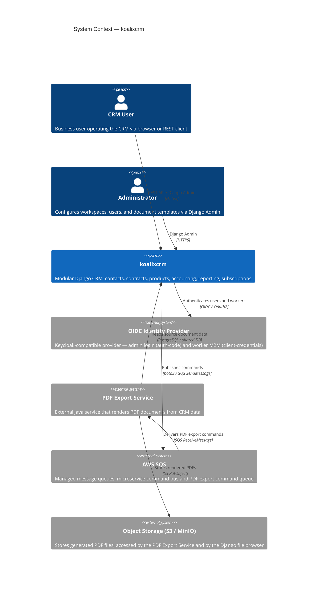
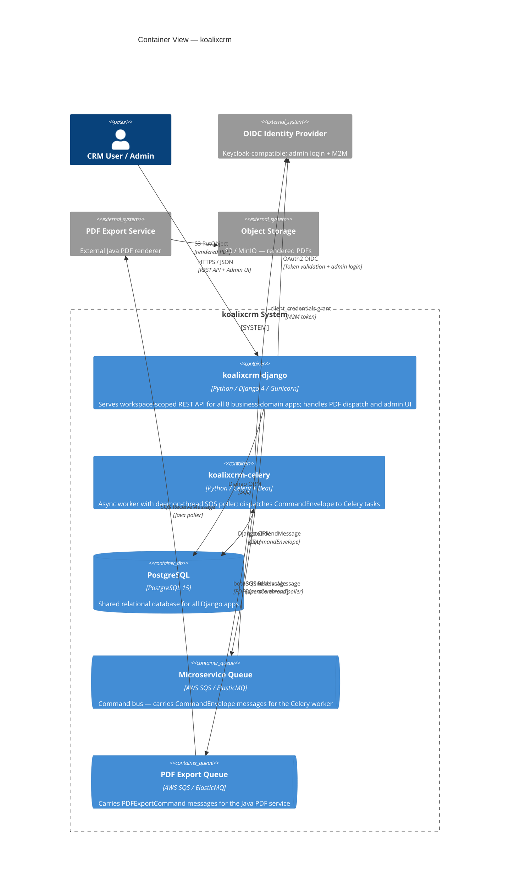
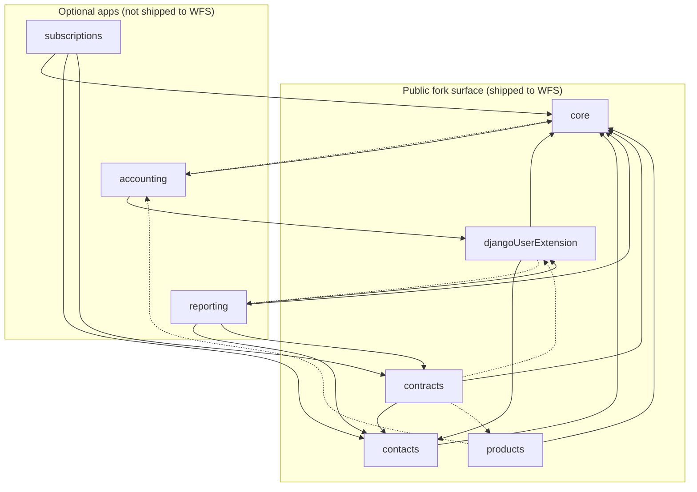
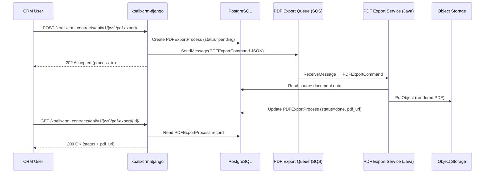

# Software Design: Modular Monolith with Event-Driven Offload via AWS SQS

## Introduction

### Scope

This document details the high-level architecture of the koalixcrm cloud application. It covers the
system context, the container-level deployment topology, the modular boundary enforcement mechanism,
and the asynchronous PDF-export offload path. It provides a catalog of all runtime components and
Django application modules for further analysis.

### Target Audience

The target audience is software architects and development engineers who need to understand the
system's runtime behavior, module boundaries, and async offload mechanism.

### Related Documents

- Entry points and URL routing: [QQ_SD_EntryPoints.md](../03_system_scope_and_context/QQ_SD_EntryPoints.md)
- Optional-app peer-dependency pattern (authoritative source): [QQ_IMPORT_docs-architecture-optional-apps.md](QQ_IMPORT_docs-architecture-optional-apps.md)
- README / project introduction: [QQ_IMPORT_README.md](../01_introduction_and_goals/QQ_IMPORT_README.md)

## System Overview

### Architecture Type

The system operates on a **Modular Monolith with Event-Driven Offload** architecture pattern.

**Classification rationale:**

- There is a single Django WSGI application (`projectsettings/wsgi.py`) that serves all HTTP traffic.
  All eight business-domain Django apps (`core`, `contacts`, `contracts`, `products`, `accounting`,
  `reporting`, `subscriptions`, `djangoUserExtension`) are bundled into one deployable unit, sharing a
  single PostgreSQL database connection pool and a unified URL namespace.
- Clear internal module boundaries exist: each app declares `required_peers` and `optional_peers` in
  its `AppConfig`, enforced by Django system checks at startup via the central
  `koalixcrm.core.app_checks.register_peer_check` helper. This qualifies the application as *modular*
  rather than traditionally tightly coupled.
- A second container runs a Celery worker (`koalixcrm_microservices/celery_app.py`) with a daemon-thread
  SQS poller (`koalixcrm_microservices/sqs_poller.py`). This container is operationally separate but
  built from the same codebase.
- The `TASK_ROUTES` dispatch table in the SQS poller is intentionally empty. The PDF-export workload was
  migrated to an external Java service (`pdf-export-service`) that polls its own SQS queue. The Django
  container publishes `PDFExportCommand` messages to that queue via a swappable dispatcher
  (`KOALIXCRM_PDF_EXPORT_DISPATCHER` setting).
- There are no Kubernetes manifests, service mesh configs, or independent per-domain deployables. The two
  containers (`koalixcrm-django`, `koalixcrm-celery`) are deployed from a single shared codebase and are
  orchestrated by the sibling `koalixcrm_system` repository.

### Service Catalog

The following runtime components have been identified. Detailed per-module documentation will be
provided in separate analyses.

| Service Name | Service Type | Service Description | Service Description Link |
|---|---|---|---|
| **koalixcrm-django** | HTTP API (WSGI / Gunicorn) | Django monolith serving the workspace-scoped REST API for all business domains; handles migrations, static files, and PDF dispatch on startup | (to be filled by ServiceDocumentationAgent) |
| **koalixcrm-celery** | Async Worker + SQS Poller | Celery worker with beat scheduler and a daemon-thread SQS poller (`start_poller`); dispatches `CommandEnvelope` messages to registered Celery tasks; currently acts as a thin relay (task routes empty; PDF export delegated to external Java service) | (to be filled by ServiceDocumentationAgent) |
| **PostgreSQL** | Relational Database | Shared database for all Django apps; accessed via Django ORM / connection pool | (to be filled by ServiceDocumentationAgent) |
| **AWS SQS — microservice queue** | Message Queue | Queue consumed by the Celery worker's daemon-thread SQS poller (`KOALIXCRM_MICROSERVICE_SQS`); carries `CommandEnvelope` messages | (to be filled by ServiceDocumentationAgent) |
| **AWS SQS — PDF export queue** | Message Queue | Queue polled exclusively by the external Java PDF service; Django publishes `PDFExportCommand` messages to it via `default_sqs_dispatcher` | (to be filled by ServiceDocumentationAgent) |
| **PDF Export Service** (external) | External Event Consumer (Java) | External Java service that polls its own SQS queue for `PDFExportCommand` messages and writes rendered PDFs back to shared S3/storage; outside the koalixcrm codebase boundary | (to be filled by ServiceDocumentationAgent) |
| **OIDC Identity Provider** (external) | External Identity Provider | Keycloak-compatible OIDC provider used for admin login (authorization-code flow) and Celery worker M2M authentication (client-credentials grant) | (to be filled by ServiceDocumentationAgent) |
| **ElasticMQ** (dev only) | Local Message Queue | SQS-compatible in-process queue used in the development environment in place of AWS SQS (`SQS_ENDPOINT_URL` env var) | (to be filled by ServiceDocumentationAgent) |

### Django Application Module Catalog

The eight Django business-domain apps are all part of the `koalixcrm-django` container. They share a
single WSGI process and database. Each app's internal structure is documented separately.

| App Name | App Label | REST URL Prefix | Source Directory |
|---|---|---|---|
| `koalixcrm.core` | `core` | `/koalixcrm_core/api/v1/<ws>/` | `koalixcrm/core/` |
| `koalixcrm.contacts` | `contacts` | `/koalixcrm_contacts/api/v1/<ws>/` | `koalixcrm/contacts/` |
| `koalixcrm.contracts` | `contract_object_management` | `/koalixcrm_contracts/api/v1/<ws>/` | `koalixcrm/contracts/` |
| `koalixcrm.products` | `products` | `/koalixcrm_products/api/v1/<ws>/` | `koalixcrm/products/` |
| `koalixcrm.accounting` | `accounting` | `/koalixcrm_accounting/api/v1/<ws>/` | `koalixcrm/accounting/` |
| `koalixcrm.reporting` | `reporting` | `/koalixcrm_reporting/api/v1/<ws>/` | `koalixcrm/reporting/` |
| `koalixcrm.subscriptions` | `subscriptions` | (no REST API registered) | `koalixcrm/subscriptions/` |
| `koalixcrm.djangoUserExtension` | `djangoUserExtension` | (no REST API registered) | `koalixcrm/djangoUserExtension/` |

### Service Communication Topology

The Django container handles all synchronous HTTP traffic and publishes asynchronous commands to AWS
SQS. The Celery worker container consumes `CommandEnvelope` messages from its dedicated microservice
queue via a daemon-thread SQS poller. The external Java PDF service polls a separate SQS queue for
`PDFExportCommand` messages; Django is publisher-only on that queue. Authentication is delegated to
an external OIDC provider (Keycloak-compatible) for both the admin UI login and the Celery M2M
credential flow. There is no direct inter-container HTTP call; all async coupling is queue-mediated.

## Architectural Diagrams

### System Context

This diagram shows koalixcrm as the single system under documentation, its human users, and the
external systems it depends on (Figure 1).

### Container View

This diagram shows the two deployable containers inside the koalixcrm system boundary and the
external systems they interact with (Figure 2).

### Internal Module Structure of the Django Container

This diagram shows the Django app boundaries and their peer-dependency relationships inside the
`koalixcrm-django` container (Figure 3). Solid arrows are `required_peers` (enforced at startup).
Dashed arrows are `optional_peers` (runtime `apps.is_installed` branches; degrade silently when absent).

*Solid arrow: `required_peers` — startup check registers a `django.core.checks.Error`; missing peer aborts startup. Dashed arrow: `optional_peers` — informational; missing peer triggers silent runtime degradation via `apps.is_installed` branches.*

### PDF Export / Async Offload Flow

This sequence illustrates how a PDF export request is dispatched through the system (Figure 4).

## Modular Boundary Enforcement

The modular boundary mechanism is documented authoritatively in
[QQ_IMPORT_docs-architecture-optional-apps.md](QQ_IMPORT_docs-architecture-optional-apps.md). The
following section summarises the key design decisions as they appear in the source code.

### Mechanism

Each Django app's `AppConfig` (in `koalixcrm/<app>/apps.py`) declares two class-level tuples:

| Attribute | Enforcement | Meaning |
|---|---|---|
| `required_peers` | Startup-time `django.core.checks.Error` | App cannot function without the listed peer; missing peer aborts startup |
| `optional_peers` | Informational only | App degrades gracefully when peer is absent; runtime branches use `apps.is_installed()` |

The shared helper `koalixcrm.core.app_checks.register_peer_check` (in
`koalixcrm/core/app_checks.py`) is called from each app's `ready()` method. It registers a
`@register()` system-check function that iterates `required_peers` and appends an `Error` for each
peer absent from `INSTALLED_APPS`. Django's system-check framework runs this at `manage.py runserver`,
`manage.py migrate`, and via the production WSGI entry point (`projectsettings/wsgi.py`), so no
misconfigured deployment can silently slip through.

### App Dependency Matrix

Rows are host apps; columns are peer apps. `R` = `required_peers` (startup-enforced). `O` =
`optional_peers` (runtime branch). `—` = no declared relationship.

| Host \ Peer | core | contacts | contracts | djangoUserExt | products | accounting | reporting | subscriptions |
|---|:---:|:---:|:---:|:---:|:---:|:---:|:---:|:---:|
| core | — | — | — | — | — | O | — | — |
| contacts | R | — | — | — | — | — | — | — |
| contracts | R | R | — | O | O | — | — | — |
| djangoUserExtension | R | R | — | — | — | — | O | — |
| products | R | — | — | — | — | O | — | — |
| accounting | R | — | — | R | — | — | — | — |
| reporting | R | R | R | R | — | — | — | — |
| subscriptions | R | R | R | — | — | — | — | — |

### Fork Isolation

The five public apps (`core`, `contacts`, `contracts`, `djangoUserExtension`, `products`) form the
*fork-public surface* consumed by downstream deployments such as the WFS
(`qq_workflow_support_webapp_backend`). The optional apps (`accounting`, `reporting`,
`subscriptions`) are absent from WFS deployments.

The unit test `tests/unit/test_fork_isolation.py` enforces that no public app contains a top-level
module-level import from any optional app. Violation of this invariant fails the test suite.

### Swappable Integration Points

One settings-based integration seam exists for cases where the behaviour is universal but the
backend varies per deployment:

| Setting | Default | Purpose |
|---|---|---|
| `KOALIXCRM_PDF_EXPORT_DISPATCHER` | `koalixcrm.core.pdf_export_dispatch.default_sqs_dispatcher` | Callable invoked when a `PDFExportProcess` record is created. WFS overrides this to use its own broker/poller fleet instead of running a separate SQS client layer. Resolved at call time via `django.utils.module_loading.import_string`. |

## Celery / SQS Offload Path

### Components

| Component | File | Role |
|---|---|---|
| `celery_app.py` | `koalixcrm_microservices/celery_app.py` | Defines the `Celery` application instance, broker URL (SQS), and the `worker_ready` signal handler that starts the SQS poller daemon thread |
| `sqs_poller.py` | `koalixcrm_microservices/sqs_poller.py` | Endless-loop poller: receives up to 5 messages per cycle, deserialises `CommandEnvelope`, dispatches to the `TASK_ROUTES` table, deletes handled messages |
| `TASK_ROUTES` | `koalixcrm_microservices/sqs_poller.py` | Dispatch table mapping `CommandEnvelope.type` strings to Celery task dotted paths; currently empty — no Python-side tasks remain after PDF export migrated to Java |
| `pdf_export_dispatch.py` | `koalixcrm/core/pdf_export_dispatch.py` | Default SQS dispatcher; serialises `PDFExportCommand` to JSON and calls `get_sqs_queue().send_message()`; resolved via `KOALIXCRM_PDF_EXPORT_DISPATCHER` setting at call time |

### Startup Sequence

The SQS poller is not a standalone process. At `worker_ready` signal time, the Celery container's
`_on_worker_ready` handler spawns `start_poller` as a `threading.Thread(daemon=True)`. The thread
is controlled by the `ENABLE_SQS_POLLER` environment variable (`true` by default). When set to
`false`, the poller is skipped and the Celery worker acts as a pure task executor (currently with
no registered tasks).

### Environment Variables

| Variable | Consumer | Purpose |
|---|---|---|
| `CELERY_BROKER_URL` | `celery_app.py` | SQS broker URL (`sqs://…`) |
| `CELERY_RESULT_BACKEND` | `celery_app.py` | Result backend URL |
| `CELERY_SQS` | `celery_app.py` | Default Celery task queue name |
| `KOALIXCRM_MICROSERVICE_SQS` | `sqs_poller.py` | Queue name polled for `CommandEnvelope` messages |
| `SQS_ENDPOINT_URL` | `celery_app.py`, `aws_clients` | If set, overrides to local ElasticMQ endpoint (dev only) |
| `ENABLE_SQS_POLLER` | `celery_app.py` | Set to `false` to disable the daemon poller thread |
| `POLL_SLEEP_SECONDS` | `sqs_poller.py` | Idle sleep between poll cycles (default `2` s) |
| `KOALIXCRM_PDF_EXPORT_DISPATCHER` | `pdf_export_dispatch.py` | Dotted-path override for the PDF export callable |
| `AWS_REGION` | `celery_app.py` | AWS region for SQS queue URL construction |
| `AWS_PROFILE` | `celery_app.py` | Named AWS profile for STS identity resolution (prod) |
