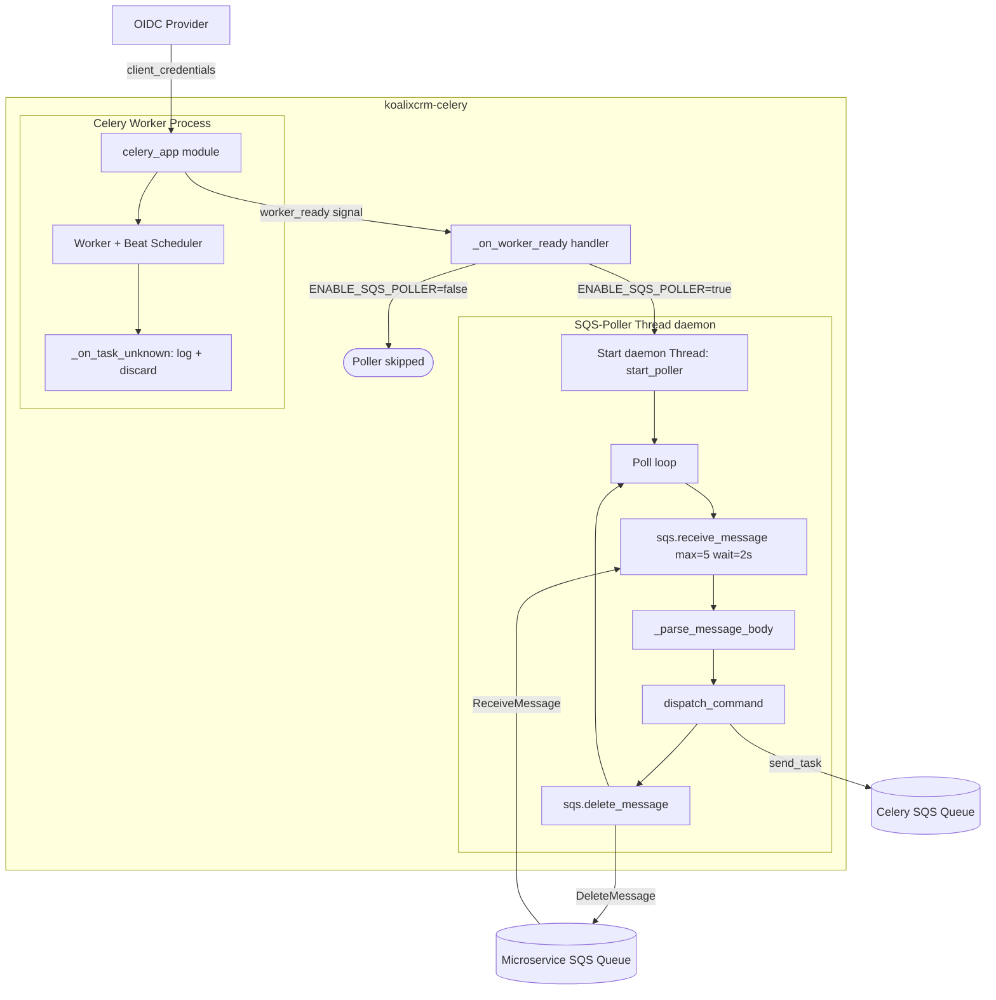
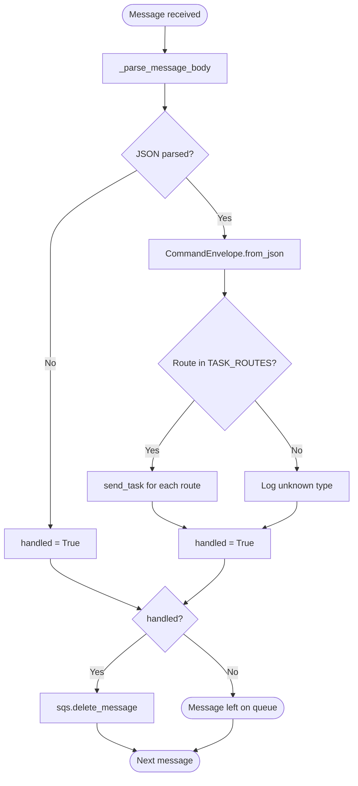

# Service Documentation: koalixcrm-celery

## Service Overview

**Source Directory:** `docker/prod/Dockerfile.celery`, `koalixcrm_microservices/`

**Purpose:** The `koalixcrm-celery` container runs the Celery distributed task worker
for the koalixcrm system. It provides two concurrent runtime mechanisms: a standard
Celery worker process (including beat scheduler) that can execute registered Python
tasks, and a daemon-thread SQS long-poll loop that receives `CommandEnvelope`
messages from the dedicated microservice SQS queue and dispatches them to Celery
tasks. In the current codebase the `TASK_ROUTES` dispatch table is empty and the
Celery beat schedule is empty, because the PDF export workload was migrated to an
external Java service. The container is retained as the extensibility point for
future Python-side asynchronous workloads.

## Service Behavior

### Startup Sequence

The production container CMD is:

```shell
celery -A koalixcrm_microservices.celery_app worker -l info -B
```

This starts a Celery worker process with the beat scheduler embedded in the same
process (`-B`). During module import of `koalixcrm_microservices.celery_app`, the
following happens at module load time:

1. The `Celery` application instance is created with the SQS broker URL and result
   backend from environment variables.
2. SQS broker transport options are configured. Two branches:
   - **Local (ElasticMQ):** when `SQS_ENDPOINT_URL` is set, uses a fixed
     `account_id = 000000000000` and a short `WaitTimeSeconds = 2`.
   - **AWS:** when `SQS_ENDPOINT_URL` is not set, calls `boto3 STS
     get_caller_identity` to resolve the AWS account ID and constructs the standard
     SQS queue URL. If the STS call fails, `account_id` is set to `None` and the
     predefined queue map is left empty, which causes Celery to fall back to
     auto-resolving the queue URL.
3. `app.conf.imports = []` — no task modules are loaded.
4. `app.conf.beat_schedule = {}` — no scheduled tasks.

Once the worker process has fully initialised, Celery fires the `worker_ready`
signal. The `_on_worker_ready` signal handler then starts the SQS poller daemon
thread, controlled by `ENABLE_SQS_POLLER` (default `true`).

### SQS Poller Daemon Thread

The poller runs in a Python daemon thread (`threading.Thread(daemon=True)`) named
`SQS-Poller`. It runs an endless loop polling the queue named by
`KOALIXCRM_MICROSERVICE_SQS`:

1. Resolves the queue URL via `sqs.get_queue_url` on every iteration (not cached).
2. Calls `sqs.receive_message` with `MaxNumberOfMessages=5`, `WaitTimeSeconds=2`,
   `VisibilityTimeout=60`.
3. For each received message: parses the body as a `CommandEnvelope` JSON object.
   Handles double-encoded JSON (attempts `json.loads` twice).
4. Calls `dispatch_command(env)`, which looks up `env.type` in `TASK_ROUTES`. If a
   route is found, sends each listed Celery task via `celery_app.send_task`. If no
   route is found, the command is logged and treated as handled.
5. Successfully handled messages are deleted from the queue via
   `sqs.delete_message`. Messages that cannot be parsed are also deleted to prevent
   repeated delivery of unrecognisable payloads.
6. When no messages are received, the thread sleeps for `POLL_SLEEP_SECONDS`
   (default: 2 seconds) before the next iteration.

Because the thread is a daemon thread, it terminates automatically when the Celery
worker process exits.

### Current Operational State

The `TASK_ROUTES` dict in `sqs_poller.py` is intentionally empty. All
`CommandEnvelope` messages received are treated as having no registered handler:
the type is logged and the message is deleted from the queue. No Celery tasks are
currently dispatched by the poller. The Celery beat schedule is also empty. The
container therefore acts as a thin relay infrastructure that is ready to accept
Python-side tasks but does not execute any at this time.

The PDF export path does not pass through this container. The
`koalixcrm-django` container publishes `PDFExportCommand` messages directly to a
separate SQS queue that the external Java PDF export service polls. The
`koalixcrm-celery` container has no involvement in that flow.

### Error Handling

- **Unknown Celery task names:** the `_on_task_unknown` signal handler logs a
  warning and returns, effectively acknowledging and discarding the message.
- **SQS poll errors:** caught by the outer `try/except` in `start_poller`; logged
  and the loop sleeps before retrying.
- **Queue URL resolution failure:** caught per-iteration; logged and the loop
  sleeps before retrying.
- **Task dispatch failure:** individual `send_task` calls for each route are wrapped
  in `try/except`; one failing route does not prevent other routes from being tried.

## Service Details

### Inputs and Outputs

**Inputs:**

- `CommandEnvelope` JSON messages received from the `KOALIXCRM_MICROSERVICE_SQS`
  SQS queue via the daemon-thread poller
- Celery task messages from the `CELERY_SQS` SQS queue consumed by the Celery
  worker (currently no tasks are registered)
- The `worker_ready` Celery signal (internal, triggers poller startup)
- `ENABLE_SQS_POLLER` environment variable (controls whether the poller thread
  starts)

**Outputs:**

- Celery task invocations via `celery_app.send_task` when a matching route is
  found in `TASK_ROUTES` (currently no routes are defined; no tasks are dispatched)
- SQS `delete_message` calls to the `KOALIXCRM_MICROSERVICE_SQS` queue for every
  handled message (including unrecognised message types)
- Log lines to stdout for all queue activity, unknown command types, and errors

### State Management

The container is stateless. It holds no persistent state. The following transient
in-process state exists:

- **`app` (Celery instance):** created at module import; shared between the Celery
  worker and beat processes within the same container.
- **`TASK_ROUTES` dict:** module-level constant in `sqs_poller.py`; empty in the
  current codebase.
- **SQS boto3 client:** created once per poller thread invocation inside
  `start_poller()` and reused across poll iterations.
- **AWS account ID:** resolved once at module import via STS; held in the
  `celery_app` module's global scope for the lifetime of the process.

### Scaling and Performance

The container runs a single Celery worker process with an embedded beat scheduler.
Multiple replicas can be deployed, but since `TASK_ROUTES` is empty no Python-side
task work would be distributed across them. The SQS poller daemon thread in each
replica polls the same queue; SQS message visibility timeout (60 seconds) prevents
the same message from being processed by multiple pollers concurrently.

The Celery broker `visibility_timeout` is set to 3600 seconds and
`task_acks_late = False` (messages are acknowledged at receive time). A worker
crash after receiving a message but before processing it does not result in
re-delivery.

The `wait_time_seconds` for the Celery broker transport is 2 seconds in local
(ElasticMQ) mode and 20 seconds in AWS mode, which controls long-poll hold time for
Celery's own queue consumption. The daemon-thread poller uses a fixed
`WaitTimeSeconds=2` on its `receive_message` call regardless of environment.

## Service Interactions

### Interactions with Other Services

| External System | Direction | Protocol | Purpose |
|---|---|---|---|
| AWS SQS — Microservice Queue | Read (inbound) | boto3 / HTTPS | Daemon-thread poller consumes `CommandEnvelope` messages |
| AWS SQS — Celery Broker Queue | Read (inbound) | Celery / kombu / HTTPS | Celery worker consumes task messages (no tasks currently registered) |
| AWS STS | Read (outbound) | boto3 / HTTPS | Resolves AWS account ID at startup for SQS URL construction (prod only) |
| OIDC Identity Provider | Read (outbound) | OIDC client-credentials grant | Obtains M2M access tokens for authenticating REST API calls back to the Django container, when future tasks call the API |
| PostgreSQL | (no direct connection in current code) | — | Not accessed directly by the Celery container in the current codebase |

The `koalixcrm-celery` container does not receive HTTP traffic. It does not connect
to the `koalixcrm-django` container directly. All messaging is queue-mediated via
SQS. The M2M OIDC credentials (`CELERY_WORKER_M2M_*`) are configured in the
container for future use by tasks that need to authenticate to the Django REST API.

### Inter-Service Communication Types

This service uses the following types of inter-service communication mechanisms:

- **Message Queue (inbound, consume)** — consumes `CommandEnvelope` messages from
  an AWS SQS queue via a daemon-thread long-poll loop
- **Message Queue (inbound, Celery broker)** — Celery worker receives task messages
  from a separate AWS SQS queue via the kombu SQS transport
- **OIDC / OAuth2 (outbound)** — client-credentials grant for M2M token acquisition
  (configured; used by future task implementations)

For detailed information about these communication mechanisms, refer to the
ISC Documentation (QQ_SD_ISCDocumentation_SQS.md) and
[Access Control Documentation](../08_cross_cutting_concepts/QQ_SD_AccessControl.md).

## Service Architecture Diagram

The following diagram shows the internal structure of the `koalixcrm-celery`
container and its external connections (Figure 1).



**Caption: Figure 1 — koalixcrm-celery internal structure and external connections**

The following diagram shows the per-message processing flow inside the poller thread
(Figure 2).



**Caption: Figure 2 — koalixcrm-celery per-message dispatch flow**

## Configuration Reference

### Environment Variables

| Variable | Default | Purpose |
|---|---|---|
| `CELERY_BROKER_URL` | (required) | SQS broker URL in the form `sqs://` used by Celery's kombu transport |
| `CELERY_RESULT_BACKEND` | (required) | Celery task result backend URL |
| `CELERY_SQS` | (required) | Name of the SQS queue used as the Celery broker queue |
| `KOALIXCRM_MICROSERVICE_SQS` | `koalixcrm-microservice-sqs` | Name of the SQS queue polled by the daemon-thread poller for `CommandEnvelope` messages |
| `SQS_ENDPOINT_URL` | (none) | SQS endpoint override; when set, uses ElasticMQ instead of AWS SQS |
| `ENABLE_SQS_POLLER` | `true` | Set to `false` to disable the daemon-thread poller; the Celery worker continues to run |
| `POLL_SLEEP_SECONDS` | `2` | Idle sleep duration (in seconds) between poll cycles when the queue is empty |
| `AWS_REGION` | `eu-west-3` | AWS region used for SQS URL construction |
| `AWS_PROFILE` | (none) | Named AWS credentials profile for STS identity resolution in production |
| `AWS_ACCESS_KEY_ID` | (none) | AWS access key; for local dev only — use IAM roles in production |
| `AWS_SECRET_ACCESS_KEY` | (none) | AWS secret key; for local dev only |
| `KOALIXCRM_VERSION` | `vX.Y.Z-develop` | Application version stamped from `APP_VERSION` build arg |
| `LOG_LEVEL` | `INFO` | Python logging level for the celery_app logger |
| `CELERY_WORKER_M2M_OIDC_ISSUER` | (none) | OIDC issuer for M2M client-credentials token acquisition |
| `CELERY_WORKER_M2M_CLIENT_ID` | (none) | M2M client ID |
| `CELERY_WORKER_M2M_CLIENT_SECRET` | (none) | M2M client secret |
| `CELERY_WORKER_M2M_SCOPE` | (none) | M2M token scope |

### Celery Broker Transport Options

| Option | Local (ElasticMQ) | AWS |
|---|---|---|
| `polling_interval` | 1 s | 1 s |
| `visibility_timeout` | 3600 s | 3600 s |
| `wait_time_seconds` | 2 s | 20 s |
| `queue_name_prefix` | `''` | `''` |

### Image Build Arguments

| Build Arg | Purpose |
|---|---|
| `APP_VERSION` | Application version string; stamped into OCI image label `org.opencontainers.image.version` |
| `VCS_REF` | Git commit SHA; stamped into OCI image label `org.opencontainers.image.revision` |

## Related Documents

- [Service Architecture Overview](QQ_SD_ServiceArchitecture.md)
- [koalixcrm-django Service Documentation](QQ_SD_ServiceDocumentation_DjangoApp.md)
- [koalixcrm_microservices Low-Level Documentation](koalixcrm_microservices/QQ_LL_Doc_Microservices.md)
- [koalixcrm_mq_commands Low-Level Documentation](koalixcrm_mq_commands/QQ_LL_Doc_MQCommands.md)
- [koalixcrm_utils Low-Level Documentation](koalixcrm_utils/QQ_LL_Doc_Utils.md)
- [Setup — Local Docker Desktop](../07_deployment_view/QQ_IMPORT_docs-setup-local-docker-desktop.md)
- [Setup — Linux Server](../07_deployment_view/QQ_IMPORT_docs-setup-linux-server.md)

## List of Illustrations

| Figure | Title |
|---|---|
| Figure 1 | koalixcrm-celery internal structure and external connections |
| Figure 2 | koalixcrm-celery per-message dispatch flow |
