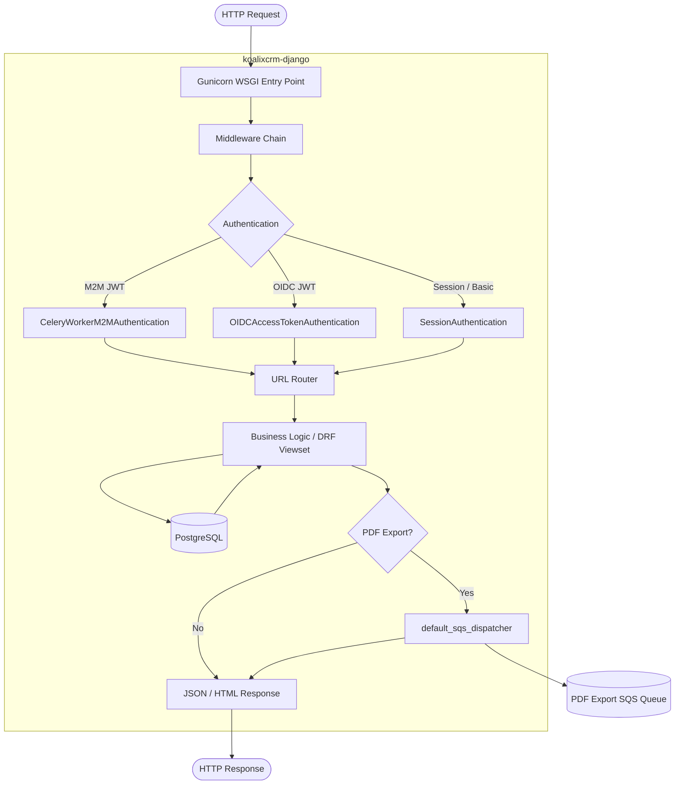
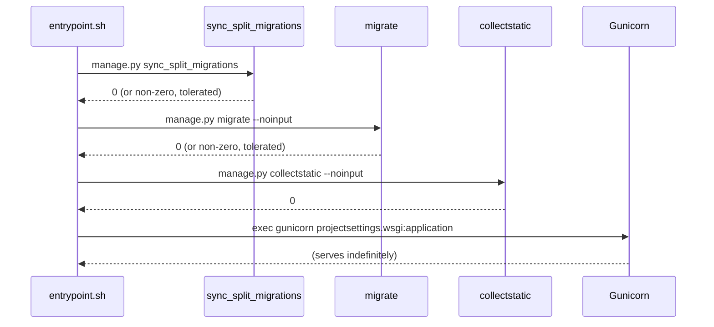

# Service Documentation: koalixcrm-django

## Service Overview

**Source Directory:** `docker/prod/Dockerfile.django`, `docker/prod/entrypoint.sh`, `projectsettings/`

**Purpose:** The `koalixcrm-django` container is the primary HTTP service of the
koalixcrm system. It runs the Django modular monolith under a Gunicorn WSGI server,
serving the workspace-scoped REST API for all eight business-domain applications
(`core`, `contacts`, `contracts`, `products`, `accounting`, `reporting`,
`subscriptions`, `djangoUserExtension`), the Django Admin UI, and the PDF-export
command dispatch path. All synchronous user-facing traffic is handled by this
container.

## Service Behavior

### Startup Sequence

The production container executes `docker/prod/entrypoint.sh` at start time. The
script runs three management commands in order before handing off to Gunicorn:

1. `python manage.py sync_split_migrations` — reconciles the Django migration
   history for databases that were created by legacy or mid-refactor deployments.
   This command detects whether tables corresponding to `CreateModel` operations
   already exist and records those migrations as applied without re-running them,
   enabling a safe upgrade path from older schema versions. Failure is non-fatal
   (`|| true`).
2. `python manage.py migrate --noinput` — applies any outstanding database
   migrations. Failure is non-fatal, allowing startup to continue in environments
   where the database may not yet be reachable. Non-fatal behavior is intentional
   for container orchestration scenarios where the database may start after the
   application container.
3. `python manage.py collectstatic --noinput` — gathers all static assets into
   `STATIC_ROOT` for serving.

After these steps, Gunicorn is started on `0.0.0.0:8000` with the configured number
of worker processes and request timeout.

### Request Handling

The WSGI entry point is `projectsettings/wsgi.py`. Gunicorn pre-forks multiple
worker processes (default: 3) that each load the Django application. Incoming HTTP
requests are dispatched by Django's URL router (`projectsettings/urls.py`), which
routes requests to the appropriate application viewset.

Authentication for each request is evaluated by the DRF authentication chain in the
order defined in `REST_FRAMEWORK.DEFAULT_AUTHENTICATION_CLASSES`:

1. `CeleryWorkerM2MAuthentication` — validates a JWT from a Celery M2M client using
   the `CELERY_WORKER_M2M_OIDC_ISSUER` and `CELERY_WORKER_M2M_CLIENT_ID` settings.
   Automatically provisions a Django service user for the M2M client on first
   encounter.
2. `OIDCAccessTokenAuthentication` — validates a JWT issued by the admin OIDC
   provider (`OIDC_ISSUER`), maps it to a Django user.
3. `SessionAuthentication` — standard Django session cookie authentication used by
   the Admin UI.
4. `BasicAuthentication` — HTTP Basic, used for tooling and testing.

All API endpoints require an authenticated user (`IsAuthenticated` permission class).

### PDF Export Dispatch

When a PDF export is triggered (POST to the PDF export endpoint), the Django
container creates a `PDFExportProcess` tracking record and invokes the configured
dispatcher callable. The default dispatcher (`default_sqs_dispatcher` in
`koalixcrm/core/pdf_export_dispatch.py`) serializes a `PDFExportCommand` to JSON
and publishes it to the PDF export SQS queue. The Django container is the publisher
only; rendering is performed by the external Java PDF export service. The dispatcher
is swappable via the `KOALIXCRM_PDF_EXPORT_DISPATCHER` setting to support fork
deployments with a different broker.

### Modular Boundary Enforcement

At startup, each of the eight business-domain apps calls
`koalixcrm.core.app_checks.register_peer_check` from its `ready()` method, which
registers Django system-check functions. These checks verify that all `required_peers`
declared in each app's `AppConfig` are present in `INSTALLED_APPS`. A missing required
peer aborts startup with a `django.core.checks.Error`. Optional peers produce no
error but degrade corresponding functionality at runtime.

For the full peer-dependency matrix see
[QQ_SD_ServiceArchitecture.md](QQ_SD_ServiceArchitecture.md#app-dependency-matrix).

## Service Details

### Inputs and Outputs

**Inputs:**

- HTTP requests (JSON REST API) from CRM users via the workspace-scoped URL
  prefixes (e.g. `/koalixcrm_contracts/api/v1/<ws>/`)
- HTTP requests to the Django Admin UI at `/admin/`
- Authentication tokens (OIDC JWTs, session cookies, HTTP Basic credentials) in
  request headers or cookies
- Database state from PostgreSQL (read via Django ORM on every request)
- Static file requests at `/static/` (served by Gunicorn in the absence of a
  reverse proxy)

**Outputs:**

- JSON HTTP responses for all REST API endpoints
- HTML pages for the Django Admin UI
- `PDFExportCommand` messages published to the PDF export SQS queue (when a
  PDF export is requested)
- Database writes to PostgreSQL (via Django ORM) for all create/update/delete
  operations across all eight apps
- Static files collected to `STATIC_ROOT` at startup

### State Management

The container is stateless with respect to request data. All persistent state is
stored in PostgreSQL. The container holds the following transient in-process state:

- **Gunicorn worker processes** — each worker independently loads and holds the
  Django application in memory. Worker state is not shared between processes.
- **Static files** — collected to the filesystem inside the container at startup
  (`STATIC_ROOT`). These files are re-collected on every container start.
- **OIDC JWKS cache** — the OIDC token authentication layer caches the JSON Web Key
  Set fetched from the identity provider's JWKS endpoint in memory for the lifetime
  of the process.

No distributed cache (Redis, Memcached) is configured. Session state is stored in
the PostgreSQL database via Django's database session backend.

### Scaling and Performance

Horizontal scaling is supported by increasing the number of container replicas
behind a load balancer, because the service is stateless. The Gunicorn worker count
within a single container is controlled by the `GUNICORN_WORKERS` environment
variable (default: 3). The request timeout is controlled by `GUNICORN_TIMEOUT`
(default: 120 seconds).

The `sync_split_migrations` and `migrate` startup steps execute on every container
start. In a multi-replica deployment, these steps run concurrently on each starting
replica. Django's migration framework uses database-level locking to prevent
concurrent migration runs from conflicting, but the locking behavior depends on the
PostgreSQL configuration.

## Service Interactions

### Interactions with Other Services

| External System | Direction | Protocol | Purpose |
|---|---|---|---|
| PostgreSQL | Read / Write | Django ORM / SQL | Persistent storage for all eight business-domain apps |
| OIDC Identity Provider | Read (outbound) | OIDC / HTTPS | Validates access tokens (admin login and M2M) via JWKS endpoint |
| AWS SQS — PDF Export Queue | Write (outbound) | boto3 / HTTPS | Publishes `PDFExportCommand` JSON messages |
| AWS SQS — Microservice Queue | Write (outbound) | boto3 / HTTPS | Publishes `CommandEnvelope` JSON messages for the Celery worker |
| Object Storage (S3 / MinIO) | Read | boto3 / HTTPS | File browser access to uploaded files (`FILEBROWSER_DIRECTORY`) |

The Django container does not call the `koalixcrm-celery` container directly. All
asynchronous coupling is queue-mediated. The container does not call the PDF export
service directly; it only publishes to the queue that the Java service polls.

### Inter-Service Communication Types

This service uses the following types of inter-service communication mechanisms:

- **REST API (inbound)** — exposes a versioned, workspace-scoped JSON REST API
  consumed by CRM users and M2M clients
- **Message Queue (outbound, publish-only)** — publishes commands to AWS SQS queues
  for asynchronous processing by the Celery worker and the external Java PDF service
- **Shared Database** — reads and writes a shared PostgreSQL database; the database
  is also accessed directly by the external Java PDF export service to read source
  document data and update export status
- **OIDC / OAuth2** — validates identity tokens issued by the external OIDC provider

For detailed information about these communication mechanisms, refer to the
ISC Documentation (QQ_SD_ISCDocumentation_SQS.md) and
[Access Control Documentation](../08_cross_cutting_concepts/QQ_SD_AccessControl.md).

## Service Architecture Diagram

The following diagram shows the internal processing flow of a single HTTP request
through the `koalixcrm-django` container (Figure 1).

**Caption: Figure 1 — koalixcrm-django request-handling flow**

The following diagram shows the startup sequence executed by the container
entrypoint before Gunicorn starts (Figure 2).

**Caption: Figure 2 — koalixcrm-django container startup sequence**

## Configuration Reference

### Environment Variables

| Variable | Default | Purpose |
|---|---|---|
| `DJANGO_SETTINGS_MODULE` | `projectsettings.settings.production_docker_postgres_settings` | Django settings module loaded by the entrypoint |
| `GUNICORN_WORKERS` | `3` | Number of Gunicorn pre-fork worker processes |
| `GUNICORN_TIMEOUT` | `120` | Gunicorn worker request timeout in seconds |
| `DJANGO_SECRET_KEY` | `modify_during_deployment` | Django secret key; must be set to a unique secret in production |
| `DJANGO_DEBUG` | `True` | Enables Django debug mode; must be `False` in production |
| `KOALIXCRM_VERSION` | `vX.Y.Z-develop` | Application version stamped from `APP_VERSION` build arg |
| `KOALIXCRM_LANGUAGE_CODE` | `en-us` | Django `LANGUAGE_CODE`; valid values: `en-us`, `de`, `fr`, `es`, `pt-br` |
| `POSTGRES_DB` | `koalixcrm` | PostgreSQL database name |
| `POSTGRES_USER` | `koalixcrm` | PostgreSQL user |
| `POSTGRES_PASSWORD` | `koalixcrm` | PostgreSQL password |
| `POSTGRES_HOST` | `postgres` | PostgreSQL host |
| `POSTGRES_PORT` | `5432` | PostgreSQL port |
| `OIDC_ISSUER` | (none) | OIDC issuer URL for access token validation |
| `OIDC_ACCEPTED_AUDIENCES` | (none) | Comma-separated list of accepted token audiences |
| `ADMIN_OIDC_ISSUER` | (none) | OIDC issuer for the Django Admin login flow |
| `ADMIN_OIDC_CLIENT_ID` | (none) | OIDC client ID for admin login |
| `ADMIN_OIDC_CLIENT_SECRET` | (none) | OIDC client secret for admin login |
| `CELERY_WORKER_M2M_OIDC_ISSUER` | (none) | OIDC issuer for M2M token validation |
| `CELERY_WORKER_M2M_CLIENT_ID` | (none) | Expected M2M client ID |
| `CELERY_WORKER_M2M_CLIENT_SECRET` | (none) | M2M client secret |
| `CELERY_WORKER_M2M_SCOPE` | (none) | Expected M2M token scope |
| `S3_ENDPOINT_URL` | (none) | S3 endpoint override; when set, uses MinIO instead of AWS S3 |
| `S3_PDF_BUCKET` | `koalixcrm-pdf-exports` | S3 bucket name for PDF export storage |
| `SQS_ENDPOINT_URL` | (none) | SQS endpoint override; when set, uses ElasticMQ instead of AWS SQS |
| `AWS_REGION` | `eu-west-3` | AWS region for SQS and S3 |
| `AWS_ACCESS_KEY_ID` | (none) | AWS access key; for local dev only — use IAM roles in production |
| `AWS_SECRET_ACCESS_KEY` | (none) | AWS secret key; for local dev only |
| `KOALIXCRM_PDF_EXPORT_DISPATCHER` | `koalixcrm.core.pdf_export_dispatch.default_sqs_dispatcher` | Dotted-path callable for PDF export dispatch; overridable per deployment |
| `SITE_URL` | (empty) | Base URL used for constructing OAuth callback URLs |

### Exposed Port

| Port | Protocol | Purpose |
|---|---|---|
| `8000` | TCP / HTTP | Gunicorn WSGI server — serves all HTTP traffic |

### Image Build Arguments

| Build Arg | Purpose |
|---|---|
| `APP_VERSION` | Application version string; stamped into `koalixcrm/version.py` and OCI image label `org.opencontainers.image.version` |
| `VCS_REF` | Git commit SHA; stamped into OCI image label `org.opencontainers.image.revision` |

## Related Documents

- [Service Architecture Overview](QQ_SD_ServiceArchitecture.md)
- [Component Architecture](QQ_SD_ComponentArchitecture.md)
- [koalixcrm-celery Service Documentation](QQ_SD_ServiceDocumentation_CeleryWorker.md)
- [koalixcrm_microservices Low-Level Documentation](koalixcrm_microservices/QQ_LL_Doc_Microservices.md)
- [koalixcrm_mq_commands Low-Level Documentation](koalixcrm_mq_commands/QQ_LL_Doc_MQCommands.md)
- [Auth Low-Level Documentation](koalixcrm/auth/QQ_LL_Doc_Auth.md)
- [Setup — Local Docker Desktop](../07_deployment_view/QQ_IMPORT_docs-setup-local-docker-desktop.md)
- [Setup — Linux Server](../07_deployment_view/QQ_IMPORT_docs-setup-linux-server.md)

## List of Illustrations

| Figure | Title |
|---|---|
| Figure 1 | koalixcrm-django request-handling flow |
| Figure 2 | koalixcrm-django container startup sequence |
