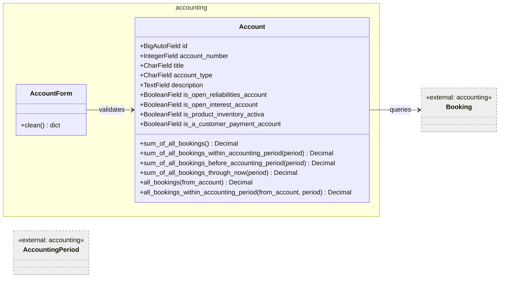
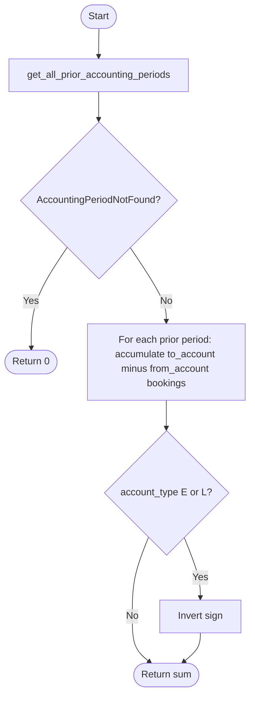
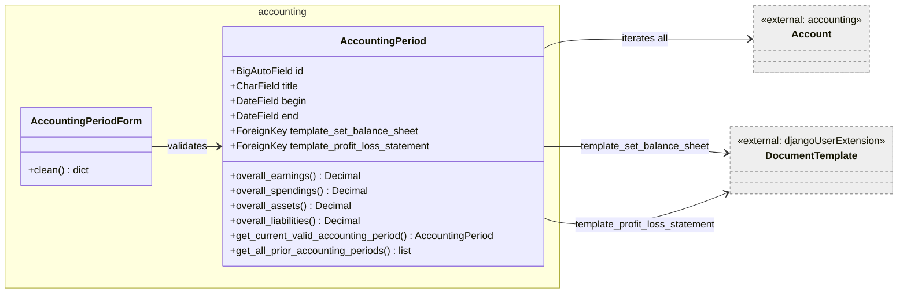
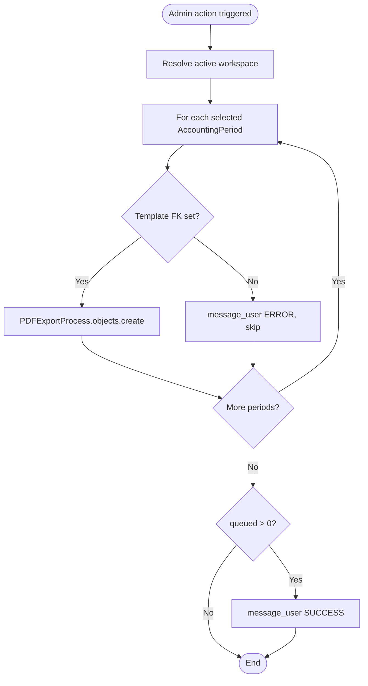
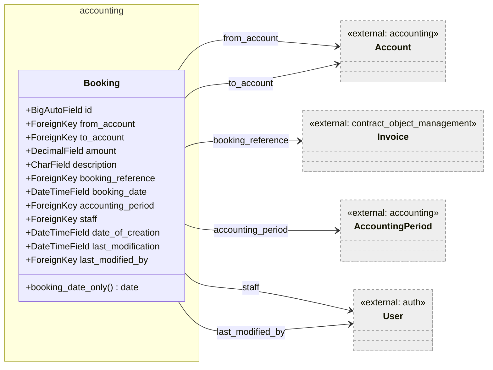
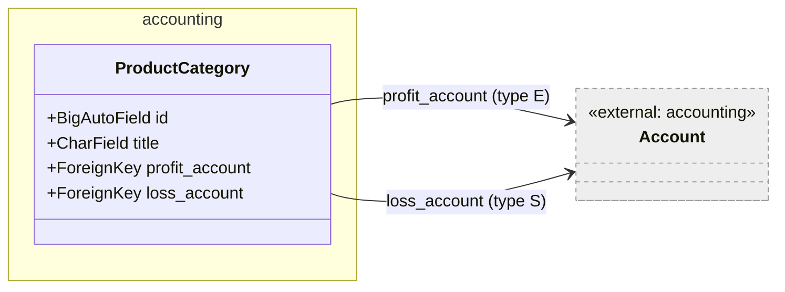
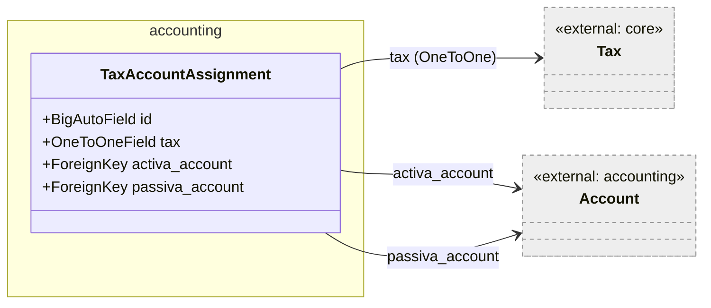
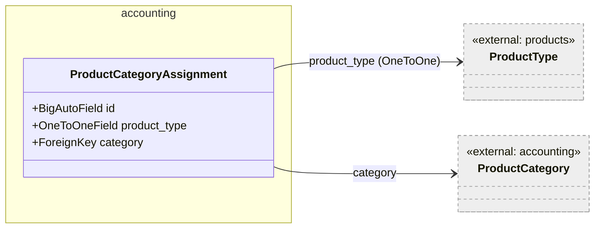
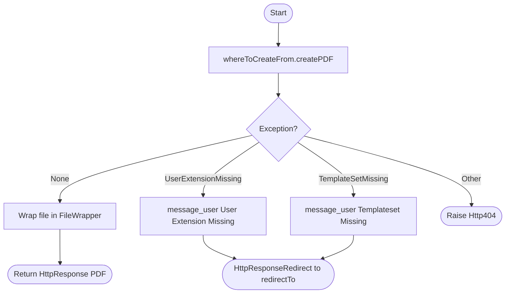
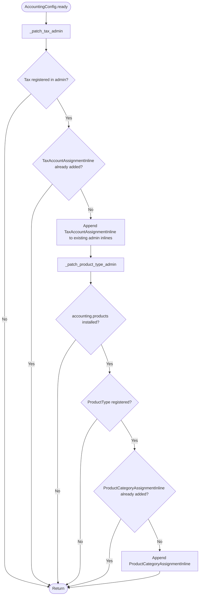

# Accounting — Low-Level Documentation

## Introduction

### Scope

This document describes the implementation of the `koalixcrm.accounting` Django application. The following
source files are covered:

- `models/account.py` — `Account`, `AccountForm`, `OptionAccount`
- `models/accounting_period.py` — `AccountingPeriod`, `AccountingPeriodForm`, `OptionAccountingPeriod`
- `models/booking.py` — `Booking`, `OptionBooking`, `InlineBookings`
- `models/product_category.py` — `ProductCategory`, `OptionProductCategory`
- `models/tax_account_assignment.py` — `TaxAccountAssignment`
- `models/product_category_assignment.py` — `ProductCategoryAssignment`
- `serializers/account_serializer.py` — `AccountJSONSerializer`, `AccountBookingSumsSerializer`,
  `OptionAccountJSONSerializer`
- `serializers/accounting_period_serializer.py` — `AccountingPeriodJSONSerializer`,
  `AccountingPeriodReportSerializer`, `OptionAccountingPeriodJSONSerializer`
- `serializers/booking_serializer.py` — `BookingJSONSerializer`, `UserJSONSerializer`
- `serializers/product_category_serializer.py` — `ProductCategoryJSONSerializer`,
  `ProductCategoryMinimalJSONSerializer`
- `views/account_view_set.py` — `AccountViewSet`
- `views/accounting_period_view_set.py` — `AccountingPeriodViewSet`
- `views/booking_view_set.py` — `BookingViewSet`
- `views/product_category_view_set.py` — `ProductCategoryViewSet`
- `views/document_export.py` — `export_pdf`, `export_xml` stand-alone functions
- `admin_hooks.py` — `_patch_tax_admin`, `_patch_product_type_admin`
- `const/accountTypeChoices.py` — `ACCOUNTTYPECHOICES`
- `exceptions.py` — custom accounting exception classes

### Target Audience

Software development engineers who need to use, modify, or extend the `accounting` application.

### Glossary

| Term/Acronym | Full Form | Description |
|---|---|---|
| E | Earnings | Account type for income/revenue accounts (credit-normal). |
| S | Spendings | Account type for expense accounts. |
| L | Liabilities | Account type for liability accounts (credit-normal). |
| A | Assets | Account type for asset accounts. |
| AccountingPeriod | — | A fiscal period (e.g. a quarter or year) defined by a begin/end date, used to scope bookings. |
| Booking | — | A double-entry accounting record moving an amount from one account to another. |
| FOP | Formatting Objects Processor | Apache FOP; used to render PDF financial reports. |
| PDFExportProcess | — | Core model that enqueues async PDF rendering via SQS/Java pdf-export-service. |
| CR-2c | Change Request 2c | Migration initiative that relocated Tax-to-Account and ProductType-to-ProductCategory linkages from their originating apps into the accounting app. |

---

## Detailed Components

### Account

Figure 1 — Account class

`Account` represents a ledger account in the chart of accounts. The `account_type` field uses single
character codes from `ACCOUNTTYPECHOICES` (`E`=Earnings, `S`=Spendings, `L`=Liabilities, `A`=Assets).
Four boolean flags designate special singleton roles: only one account in the system may carry
`is_open_reliabilities_account=True` (and it must be type `L`), only one may carry
`is_open_interest_account=True` (type `A`), while `is_a_customer_payment_account` and
`is_product_inventory_activa` may be assigned to any number of type-`A` accounts. These constraints are
enforced in `AccountForm.clean`.

The sign convention for Earnings (`E`) and Liabilities (`L`) account types is inverted in all aggregation
methods: the computed sum `to_account - from_account` is negated, reflecting the credit-normal convention
for these account types.

#### Methods

##### `sum_of_all_bookings() -> Decimal`

Computes the net balance of all bookings across all accounting periods. Delegates to `all_bookings` for
the `to_account` side and the `from_account` side, then subtracts and applies the sign inversion for `E`
and `L` accounts.

##### `sum_of_all_bookings_within_accounting_period(accounting_period) -> Decimal`

Same arithmetic as `sum_of_all_bookings` but filtered to bookings belonging to `accounting_period`.

##### `sum_of_all_bookings_before_accounting_period(current_accounting_period) -> Decimal`

Aggregates net booking sums for all accounting periods whose `end` date precedes the `begin` of
`current_accounting_period`. Returns `Decimal(0)` when `AccountingPeriodNotFound` is raised (no prior
periods exist).

Figure 2 — `sum_of_all_bookings_before_accounting_period` control flow

##### `sum_of_all_bookings_through_now(current_accounting_period) -> Decimal`

Returns the sum of `sum_of_all_bookings_within_accounting_period` plus
`sum_of_all_bookings_before_accounting_period`. This is the running balance up to and including the
current period.

**`all_bookings(from_account: bool) -> Decimal` (internal)**

Issues a database query for all `Booking` objects where `from_account` or `to_account` matches `self.id`
(chosen by the `from_account` parameter) and sums their `amount` fields in Python.

**`all_bookings_within_accounting_period(from_account, accounting_period) -> Decimal` (internal)**

Same as `all_bookings` but additionally filters `accounting_period=accounting_period.id`.

#### AccountForm

`AccountForm` overrides `clean()` to enforce the singleton and type constraints of the four boolean flags.
All errors are collected into a list and raised together as a single `forms.ValidationError`.

---

### AccountingPeriod

Figure 3 — AccountingPeriod class

`AccountingPeriod` represents a fiscal period (e.g. "Year 2024", "Q1 2024") defined by `begin` and `end`
dates. It carries optional FKs to two `DocumentTemplate` instances used for PDF report generation (balance
sheet and profit/loss statement). Both FKs point at the base `djangoUserExtension.DocumentTemplate` using
string references and distinct `related_name` values.

#### AccountingPeriod Methods

##### `overall_earnings() -> Decimal`

Iterates all `Account` objects in the database and sums `sum_of_all_bookings_within_accounting_period`
for accounts with `account_type == "E"`. The iteration is performed in Python after loading all accounts
into memory.

##### `overall_spendings() -> Decimal`

Same as `overall_earnings` but selects type `"S"` accounts.

##### `overall_assets() -> Decimal`

Iterates type `"A"` accounts and calls `sum_of_all_bookings_through_now` (cumulative balance including
prior periods).

##### `overall_liabilities() -> Decimal`

Iterates type `"L"` accounts and calls `sum_of_all_bookings_through_now`.

**`get_current_valid_accounting_period() -> AccountingPeriod`** (static)

Scans all `AccountingPeriod` rows in Python and returns the first one whose `begin < date.today() < end`.
Raises `AccountingPeriodNotFound` when no matching period is found.

##### `get_all_prior_accounting_periods() -> list[AccountingPeriod]`

Returns all periods whose `end` is strictly before `self.begin`. Raises `AccountingPeriodNotFound` when
the resulting list is empty.

#### OptionAccountingPeriod (admin class)

Provides two bulk admin actions: `create_pdf_of_balance_sheet` and `create_pdf_of_profit_loss_statement`.
Both delegate to `_enqueue_async_pdf`, which creates `PDFExportProcess` records in the database for each
selected period. The Java pdf-export-service picks these up from SQS asynchronously. Missing templates are
reported via `message_user(level=ERROR)` and the affected period is skipped.

Figure 4 — `_enqueue_async_pdf` control flow

---

### Booking

Figure 5 — Booking class

`Booking` is the core double-entry accounting record. Every booking transfers an `amount` from
`from_account` to `to_account`, scoped to an `accounting_period`. The optional `booking_reference` FK
links a booking to the `Invoice` that triggered it. `staff` and `last_modified_by` are both limited to
staff users (`limit_choices_to={'is_staff': True}`).

`date_of_creation` uses `auto_now=True` (updates on every save) and `last_modification` uses
`auto_now_add=True` (set only on creation). This is the reverse of the usual Django convention and should
be noted when reading historical records.

`booking_date_only()` is a display helper for the admin list that strips the time component from the
`DateTimeField`.

`OptionBooking.save_model` sets both `staff` and `last_modified_by` to `request.user` on both create and
change operations.

---

### ProductCategory

Figure 6 — ProductCategory class

`ProductCategory` groups products for accounting purposes by binding them to a specific earnings account
(`profit_account`, constrained to `account_type="E"`) and a specific expense account (`loss_account`,
constrained to `account_type="S"`). These constraints are enforced at the database query level via
`limit_choices_to` on each FK, but are not re-validated in a custom form.

---

### TaxAccountAssignment

Figure 7 — TaxAccountAssignment class

`TaxAccountAssignment` is the result of change request CR-2c, which relocated the Tax-to-Account linkage
from `core.Tax` into the `accounting` app to preserve fork-isolation. When `koalixcrm.accounting` is not
installed, `core.Tax` exists as a pure tax-rate record with no accounting associations.

Each row maps one `core.Tax` to an activa (asset) account and a passiva (liability) account, both
nullable. The relationship is one-to-one via `related_name="account_assignment"` on the Tax side.

---

### ProductCategoryAssignment

Figure 8 — ProductCategoryAssignment class

`ProductCategoryAssignment` is the second CR-2c relocation: the FK from `products.ProductType` to
`accounting.ProductCategory` is moved here. One row per `ProductType` optionally assigns it to a
`ProductCategory` for profit/loss account routing. Accessible from `ProductType` as
`product_type.product_category_assignment`.

---

### Serializers

#### AccountJSONSerializer / AccountBookingSumsSerializer

`AccountJSONSerializer` exposes all account fields for standard CRUD operations.

`AccountBookingSumsSerializer` is used by the Java pdf-export-service to retrieve the four booking
aggregates for one account in the context of a specific `AccountingPeriod`. The period is passed via
serializer `context["accounting_period"]`. The four `SerializerMethodField` entries call the
corresponding `Account` aggregation methods:

| Field | Calls |
|---|---|
| `sum_within_accounting_period` | `sum_of_all_bookings_within_accounting_period(period)` |
| `sum_through_now` | `sum_of_all_bookings_through_now(period)` |
| `sum_before_accounting_period` | `sum_of_all_bookings_before_accounting_period(period)` |
| `sum_total` | `sum_of_all_bookings()` |

#### AccountingPeriodReportSerializer

Bundles the complete data payload for a FOP report in a single REST fetch: the period header, four overall
aggregates (earnings, spendings, assets, liabilities), and per-account booking sums for every account in
the system. The `get_accounts` method loads all `Account` records and serializes them with
`AccountBookingSumsSerializer` using the period as context.

#### BookingJSONSerializer

Implements `create` and `update` with manual FK deserialization: the nested `from_account`,
`to_account`, and `accounting_period` dicts are popped from `validated_data`, and the ORM object is
looked up by `id`. `staff` and `last_modified_by` are always set to `request.user` from the serializer
context.

#### ProductCategoryJSONSerializer

Implements `create` and `update` with manual FK deserialization for `profit_account` and `loss_account`.

---

### Views

#### AccountViewSet

Extends `BaseModelViewSet`. The `booking_sums` custom action (`GET /accounts/{id}/booking-sums/`)
accepts an `accounting_period` query parameter, validates its presence and existence, and returns the
`AccountBookingSumsSerializer` payload. Raises `ValidationError` when the parameter is missing and
`NotFound` when the period does not exist.

#### AccountingPeriodViewSet

Extends `BaseModelViewSet`. The `report_data` custom action (`GET /accounting_periods/{id}/report-data/`)
returns the full `AccountingPeriodReportSerializer` payload for use by the pdf-export-service.

#### BookingViewSet / ProductCategoryViewSet

Standard `BaseModelViewSet` instances with no custom actions.

---

### Stand-alone Functions

#### `export_pdf(calling_model_admin, request, whereToCreateFrom, whatToCreate, redirectTo)`

Located in `views/document_export.py`. Calls `whereToCreateFrom.createPDF(request.user, whatToCreate)`,
wraps the resulting file in a `FileWrapper`, and returns an `HttpResponse` with `content_type=application/pdf`.
On `TemplateSetMissing` or `UserExtensionMissing` it redirects to `redirectTo` and appends an error
message via `calling_model_admin.message_user`. Any other exception raises `Http404`.

Figure 9 — `export_pdf` control flow

#### `export_xml(callingModelAdmin, request, whereToCreateFrom, whatToCreate, redirectTo)`

Same structure as `export_pdf` but calls `whereToCreateFrom.createXML` and returns
`content_type=application/xml` via the deprecated `mimetype` kwarg to `HttpResponse`.

---

### admin_hooks.py — `_patch_tax_admin` and `_patch_product_type_admin`

These two module-level functions run when `AccountingConfig.ready()` is called (Django app startup). They
inject accounting-specific inline admin classes into already-registered admin pages for `core.Tax` and
`products.ProductType`, restoring the pre-CR-2c UX where tax account assignments and product category
assignments were visible directly on those change pages.

Figure 10 — admin_hooks startup patching flow

---

## Persistent Storage

| Table | Content |
|---|---|
| `accounting_account` | All ledger accounts |
| `accounting_accountingperiod` | Fiscal periods |
| `accounting_booking` | Double-entry booking records |
| `accounting_productcategory` | Product categories with profit/loss account links |
| `accounting_taxaccountassignment` | Tax-to-account assignments (one-to-one with `core_tax`) |
| `accounting_productcategoryassignment` | ProductType-to-ProductCategory assignments |

---

## Access to External Interfaces

| Interface | Type of Call | Notes |
|---|---|---|
| SQS (via `PDFExportProcess.objects.create`) | Blocking write | Enqueues async PDF rendering; the Java pdf-export-service polls SQS |
| Django ORM (PostgreSQL) | Blocking read/write | All booking aggregation queries; full table scans of `Account` and `Booking` tables |

The account aggregation methods (`all_bookings`, `all_bookings_within_accounting_period`) load all
matching `Booking` objects into Python memory and sum `amount` in a loop. For large datasets this may
have scalability implications.

---

## Design Patterns Used

- **Double-entry bookkeeping model:** `Booking` enforces the accounting discipline of a debit account
  (`from_account`) and a credit account (`to_account`) for every transaction.
- **Credit-normal sign inversion:** `E` and `L` account types negate their computed sums, implementing
  the convention that credit-normal accounts increase on the credit side.
- **Admin monkey-patching:** `admin_hooks.py` augments third-party (within the same project) admin
  registrations at startup to add cross-app inline editors without coupling the source app to the
  accounting app at import time.

---

## External Dependencies

| Requirement | Version/Details | Notes/Assumptions |
|---|---|---|
| Django | >= 3.2 | ORM, admin, forms |
| djangorestframework | — | Serializers and viewsets |
| `koalixcrm.core` | internal | `PDFExportProcess`, `Workspace`, `Tax`, exceptions |
| `koalixcrm.djangoUserExtension` | internal | `DocumentTemplate` referenced in `AccountingPeriod` template FKs |
| `koalixcrm.contract_object_management` | internal | `Invoice` referenced in `Booking.booking_reference` |

---

## Appendix

### References

- Source: `koalixcrm/accounting/models/`
- Source: `koalixcrm/accounting/serializers/`
- Source: `koalixcrm/accounting/views/`
- Source: `koalixcrm/accounting/admin_hooks.py`

### List of Illustrations

| Figure | Title |
|---|---|
| Figure 1 | Account class |
| Figure 2 | `sum_of_all_bookings_before_accounting_period` control flow |
| Figure 3 | AccountingPeriod class |
| Figure 4 | `_enqueue_async_pdf` control flow |
| Figure 5 | Booking class |
| Figure 6 | ProductCategory class |
| Figure 7 | TaxAccountAssignment class |
| Figure 8 | ProductCategoryAssignment class |
| Figure 9 | `export_pdf` control flow |
| Figure 10 | admin_hooks startup patching flow |
