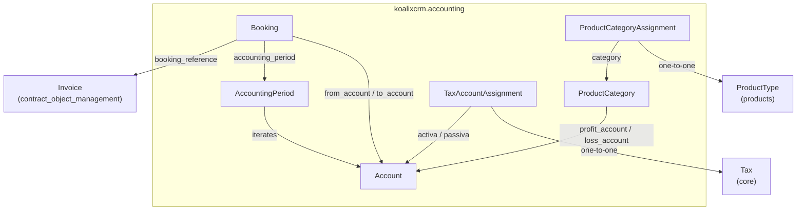
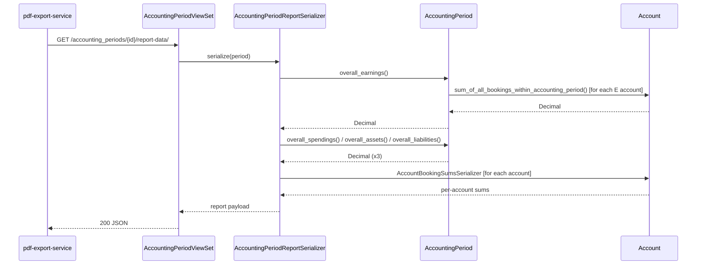
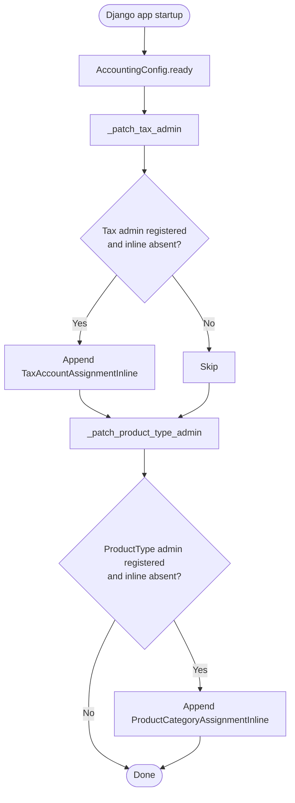
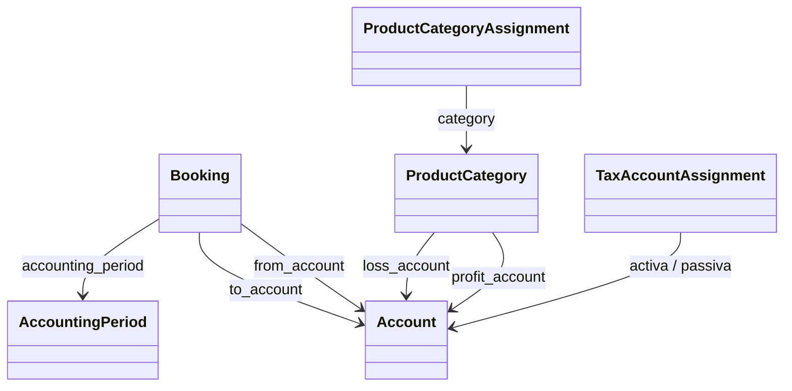

# Accounting — Mid-Level Documentation

## Introduction

### Purpose

This document describes the `koalixcrm.accounting` Django application at the module level. It covers the
package structure, the relationships between the six model components, the two key runtime interaction
sequences, the design patterns that govern the implementation, and the external interfaces the package
depends on.

Method-level detail is intentionally omitted here. For field definitions, method signatures, control-flow
diagrams, and admin class descriptions, refer to the low-level document:
[QQ_LL_Doc_Accounting.md](QQ_LL_Doc_Accounting.md).

### Contents Overview

- Package diagram showing all model components and their relationships
- Interaction diagrams for the P&L report generation flow and the admin hook startup sequence
- Combined class diagram (relationships only; no method detail)
- Design patterns used
- External dependencies
- Testing status
- Appendix with reference links and list of illustrations

### Target Audience

Software development engineers who use, extend, or integrate with the `koalixcrm.accounting` package.

### Glossary

| Term / Acronym | Full Form | Description |
|---|---|---|
| E | Earnings | Account type for income/revenue ledger accounts (credit-normal). |
| S | Spendings | Account type for expense ledger accounts. |
| L | Liabilities | Account type for liability ledger accounts (credit-normal). |
| A | Assets | Account type for asset ledger accounts. |
| AccountingPeriod | — | A fiscal period (e.g. a financial year or quarter) scoping all bookings within it. |
| Booking | — | A double-entry record transferring an amount from one ledger account to another. |
| FOP | Formatting Objects Processor | Apache FOP; used by the pdf-export-service to render PDF financial reports. |
| PDFExportProcess | — | Core model that enqueues async PDF rendering tasks via SQS for the Java pdf-export-service. |
| CR-2c | Change Request 2c | Migration that relocated Tax-to-Account and ProductType-to-ProductCategory linkages into the accounting app to preserve fork-isolation. |
| DRF | Django REST Framework | The REST layer providing serializers and viewsets for this package. |

---

## Package Diagram

The diagram below shows the six model components of `koalixcrm.accounting` and their principal
relationships. Components outside the accounting package are shown with a dashed border.

Figure 1 — Package structure of koalixcrm.accounting

### Component References (Low-Level Detail)

- [Account](QQ_LL_Doc_Accounting.md#account)
- [AccountingPeriod](QQ_LL_Doc_Accounting.md#accountingperiod)
- [Booking](QQ_LL_Doc_Accounting.md#booking)
- [ProductCategory](QQ_LL_Doc_Accounting.md#productcategory)
- [TaxAccountAssignment](QQ_LL_Doc_Accounting.md#taxaccountassignment)
- [ProductCategoryAssignment](QQ_LL_Doc_Accounting.md#productcategoryassignment)

---

## Interaction Diagrams

### P&L Report Generation

When the Java pdf-export-service requests report data, it calls the `report_data` REST action on
`AccountingPeriodViewSet`. The viewset delegates serialization to `AccountingPeriodReportSerializer`,
which collects the four overall aggregates directly from `AccountingPeriod` methods
(`overall_earnings`, `overall_spendings`, `overall_assets`, `overall_liabilities`). Each of those
methods iterates all `Account` objects in memory and calls the appropriate `Account.sum_*` aggregation
method to obtain the per-account balance for the requested period. The combined payload — period header,
four aggregates, and per-account booking sums — is returned as a single JSON response.

Figure 2 — P&L report generation sequence

For method-level detail on the aggregation logic and sign inversion, see
[QQ_LL_Doc_Accounting.md — Account](QQ_LL_Doc_Accounting.md#account) and
[AccountingPeriod](QQ_LL_Doc_Accounting.md#accountingperiod).

### Admin Hook Startup Patching

During Django application startup, `AccountingConfig.ready()` calls `_patch_tax_admin` and
`_patch_product_type_admin` in sequence. Each function looks up the already-registered admin class for
its target model and appends an accounting-specific inline class to that admin's `inlines` list,
provided the inline has not been added previously. This approach injects cross-app UI without coupling
the source apps (`core`, `products`) to the accounting app at import time.

Figure 3 — Admin hook startup patching flow

For the full idempotency guard detail, see
[QQ_LL_Doc_Accounting.md — admin_hooks.py](QQ_LL_Doc_Accounting.md#admin_hookspy--_patch_tax_admin-and-_patch_product_type_admin).

---

## Class Diagrams per Package

The diagram below shows all six model classes with their inter-model relationships. Field and method
detail is omitted; refer to [QQ_LL_Doc_Accounting.md](QQ_LL_Doc_Accounting.md) for those.

Figure 4 — koalixcrm.accounting model class relationships

---

## Design Patterns Used

### Double-Entry Bookkeeping Model

Every financial transaction is represented by a single `Booking` record that names both a debit account
(`from_account`) and a credit account (`to_account`). No amount enters or leaves the system without
both sides being recorded, preserving the fundamental accounting identity.

### Credit-Normal Sign Inversion

Ledger accounts of type `E` (Earnings) and `L` (Liabilities) carry a credit-normal convention: their
balance grows on the credit side. The `Account` aggregation methods implement this by negating the
computed `to_account minus from_account` sum for these two types. The inversion is applied uniformly in
all four aggregation methods. See [QQ_LL_Doc_Accounting.md — Account](QQ_LL_Doc_Accounting.md#account)
for the per-method detail.

### Admin Monkey-Patching

`admin_hooks.py` modifies already-registered Django admin classes at startup without touching the source
apps that own those admin registrations. This keeps `koalixcrm.core` and `koalixcrm.products` free of
any import-time dependency on `koalixcrm.accounting`, while still presenting a unified change page to
the Django admin user.

---

## External Dependencies

| Dependency | Version / Details | Role within this package |
|---|---|---|
| Django | >= 3.2 | ORM, admin framework, forms |
| Django REST Framework | — | Serializers and viewsets for the REST API |
| `koalixcrm.core` | internal | Provides `PDFExportProcess` (SQS enqueueing), `Workspace`, `Tax`, and shared exception classes |
| `koalixcrm.djangoUserExtension` | internal | Provides `DocumentTemplate` referenced by `AccountingPeriod` template FKs |
| `koalixcrm.contract_object_management` | internal | Provides `Invoice` referenced by `Booking.booking_reference` |
| SQS / Java pdf-export-service | external async | Receives PDF render tasks created via `PDFExportProcess.objects.create` |

---

## Testing

No unit-test coverage information is available in the source files reviewed (Information not available).

---

## Appendix

### References

- Low-level document: [QQ_LL_Doc_Accounting.md](QQ_LL_Doc_Accounting.md)

### List of Illustrations

| Figure | Title |
|---|---|
| Figure 1 | Package structure of koalixcrm.accounting |
| Figure 2 | P&L report generation sequence |
| Figure 3 | Admin hook startup patching flow |
| Figure 4 | koalixcrm.accounting model class relationships |
