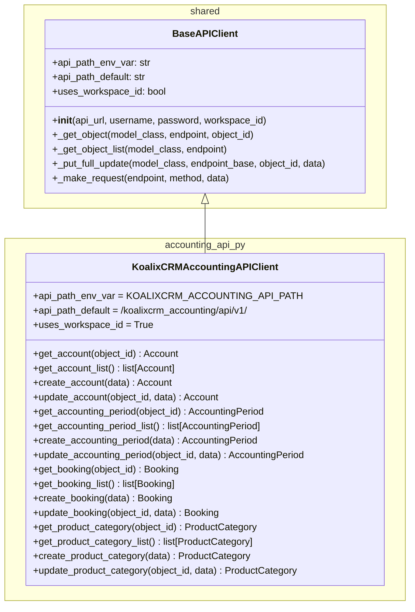
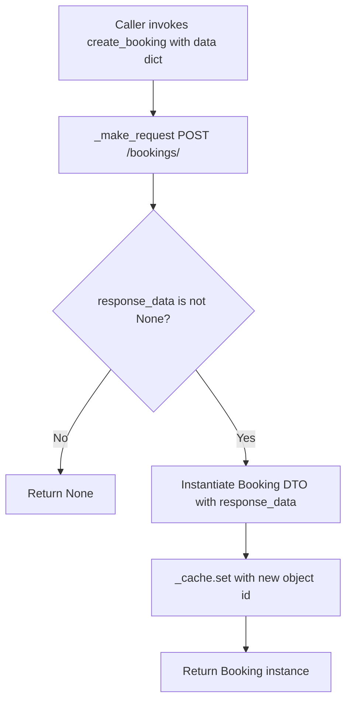
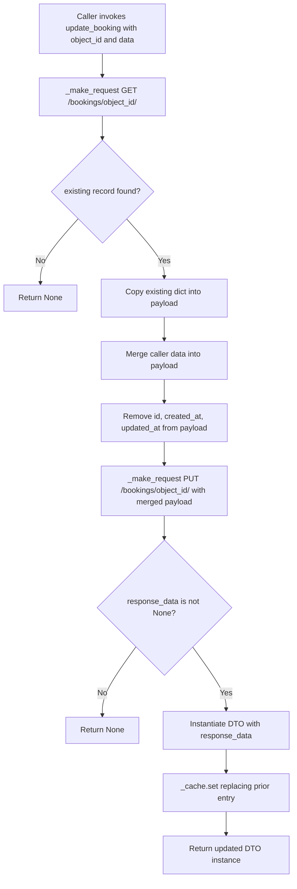
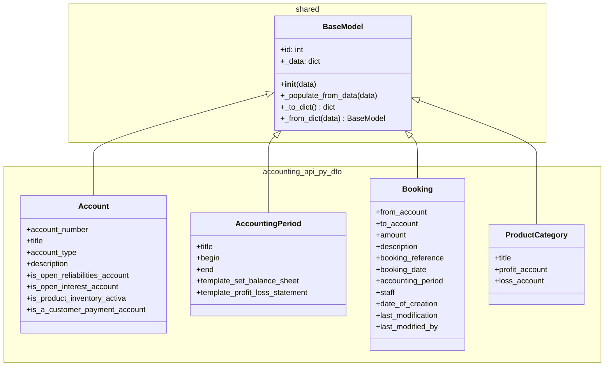

# Low-Level Documentation: koalixcrm/accounting_api_py

## 1. Introduction

### 1.1 Scope

This document covers the `koalixcrm/accounting_api_py` package, which provides the
programmatic interface used by internal consumers — primarily Celery workers and
agent workflows — to read and write accounting data in the koalixCRM backend. The
package consists of three layers:

- A concrete API client (`KoalixCRMAccountingAPIClient`) that translates Python
  method calls into HTTP requests directed at the accounting REST API.
- A set of Data Transfer Objects (DTOs) that represent accounting domain entities
  as Python objects after deserialisation from JSON responses.
- A re-export module (`accounting_api.py`) that exposes the server-side Django REST
  Framework ViewSets for URL routing within the Django application.

The package does not contain business logic. It is a thin translation layer between
the REST interface and calling code.

### 1.2 Target Audience

- Backend developers integrating Celery tasks or agent code with the accounting
  subsystem.
- Developers maintaining or extending the accounting REST API ViewSets.
- Architects reviewing the client/server split between the Django application and
  the automation layer.

### 1.3 Glossary

**Double-entry bookkeeping**
A fundamental accounting principle requiring that every financial transaction is
recorded in at least two accounts: a debit on one account (the source, `from_account`)
and a credit on another (the destination, `to_account`). The sum of all debits must
equal the sum of all credits at all times.

**Chart of accounts**
The complete, structured list of all accounts maintained by an organisation. Each
account occupies a defined role — liabilities, interest, inventory, customer
receipts — expressed in koalixCRM as boolean flags on the `Account` DTO.

**Accounting period**
A defined calendar interval (e.g., a fiscal year or quarter) that serves as the
reference frame for grouping bookings and producing financial statements such as the
balance sheet and the profit-and-loss statement.

**Booking**
A single double-entry transaction that moves a monetary amount from one account to
another within a specific accounting period. A booking carries a reference,
a booking date, the responsible staff member, and audit timestamps.

---

## 2. KoalixCRMAccountingAPIClient

### 2.1 Class Diagram

### 2.2 Description

`KoalixCRMAccountingAPIClient` is the sole concrete API client in this package. It
extends `BaseAPIClient` (from `koalixcrm/shared/api_client.py`) without adding an
`__init__` override; the parent constructor handles all authentication, URL
resolution, token cache initialisation, and object cache creation.

The class declares three class-level attributes that control how `BaseAPIClient`
constructs request URLs:

- `api_path_env_var = 'KOALIXCRM_ACCOUNTING_API_PATH'` — the name of the
  environment variable from which the API path prefix is read at runtime. This
  allows deployments to point the client at different accounting API mount points
  without code changes.
- `api_path_default = '/koalixcrm_accounting/api/v1/'` — the fallback path used
  when the environment variable is absent.
- `uses_workspace_id = True` — instructs `BaseAPIClient` to insert the
  `workspace_id` value between the path prefix and the resource endpoint when
  building the full URL path. The resulting path pattern is
  `/koalixcrm_accounting/api/v1/{workspace_id}/{resource}/`.

The client manages four accounting resource families, each covered by a consistent
set of four operations: `get`, `get_list`, `create`, and `update`. Delete is
intentionally absent at the client level, reflecting the accounting domain's
requirement for audit-safe records.

### 2.3 Methods

#### 2.3.1 Account Operations

`get_account(object_id)` delegates to `_get_object`, which checks the in-process
object cache before issuing a `GET /accounts/{id}/` request. The returned dict is
wrapped in an `Account` DTO and stored in the cache before being returned. Returns
`None` when the server responds with a non-success status.

`get_account_list()` delegates to `_get_object_list`, which issues `GET /accounts/`
and transparently follows DRF pagination `next` links until the full result set is
collected. Each item is wrapped in an `Account` DTO and cached by its `id`.

`create_account(data)` issues a `POST /accounts/` request directly via
`_make_request`, wraps the response in an `Account` DTO, and writes the new object
into the cache. Bypassing `_get_object` here is intentional: the object does not
yet exist in the cache, so there is no cached entry to check or invalidate.

`update_account(object_id, data)` delegates to `_put_full_update`, which fetches the
current server-side representation, merges the caller-supplied `data` dict into it
(removing `id`, `created_at`, and `updated_at` to avoid read-only field conflicts),
and sends the merged payload as a `PUT /accounts/{id}/` request. The response is
wrapped in a fresh `Account` DTO and replaces the previous cache entry.

#### 2.3.2 AccountingPeriod Operations

The four `accounting_period` methods follow an identical pattern, targeting the
`/accounting-periods/` resource path. `get_accounting_period(object_id)`,
`get_accounting_period_list()`, `create_accounting_period(data)`, and
`update_accounting_period(object_id, data)` apply the same delegation strategy as
their Account counterparts.

#### 2.3.3 Booking Operations

`get_booking`, `get_booking_list`, `create_booking`, and `update_booking` target the
`/bookings/` resource path. The `create_booking` method is the most significant in
accounting workflows because it creates the permanent ledger entry that implements a
double-entry transaction. The caller must supply both `from_account` and `to_account`
references together with an `amount` and an `accounting_period` reference in the
`data` dict; the client does not enforce this invariant itself.

#### 2.3.4 ProductCategory Operations

`get_product_category`, `get_product_category_list`, `create_product_category`, and
`update_product_category` target the `/product-categories/` resource path and follow
the same pattern. Product categories are comparatively lightweight objects; their
accounting relevance lies in the `profit_account` and `loss_account` references that
link commerce to the chart of accounts.

### 2.4 Request Flow for create_* Methods

The following diagram shows the internal flow for `create_booking`; the pattern
applies equally to `create_account`, `create_accounting_period`, and
`create_product_category`.

### 2.5 Request Flow for update_* Methods

The following diagram shows `_put_full_update`, which backs all four `update_*`
methods.

---

## 3. DTO Classes

### 3.1 Class Diagram

All four DTO classes, together with `BaseModel` from `koalixcrm/shared/base_model.py`,
fit within a single diagram because the total component count does not exceed nine.

### 3.2 Account

`Account` represents a single entry in the chart of accounts. Its `account_number`
is the human-readable identifier used in financial reports. The `title` is the
display name. The `account_type` carries a string code that maps to the backend's
enumeration of account categories (e.g., asset, liability, equity, revenue,
expense); the exact permitted values are defined by the backend model and are not
validated on the client side.

The four boolean flags distinguish the functional role of the account within the
ledger:

- `is_open_reliabilities_account` marks the account as the designated bucket for
  outstanding liabilities that have not yet been settled — typically a creditor
  control account.
- `is_open_interest_account` marks the account for recording accrued or outstanding
  interest, used in interest-bearing financial instruments.
- `is_product_inventory_activa` identifies the account as an inventory asset
  account, where the monetary value of physical stock is posted.
- `is_a_customer_payment_account` designates the account as the clearing account
  for incoming customer payments, used in accounts-receivable workflows.

Only one of these flags should be true for any given account in a well-structured
chart of accounts. The client DTO does not enforce mutual exclusivity; that
constraint lives in the backend.

### 3.3 AccountingPeriod

`AccountingPeriod` defines a bounded calendar interval used to group bookings for
financial reporting. The `title` provides a human-readable label (e.g., "FY 2025").
The `begin` and `end` fields carry the date boundaries of the period as ISO 8601
date strings, consistent with the backend model's `DateField` serialisation.

The `template_set_balance_sheet` and `template_profit_loss_statement` fields hold
foreign-key references (serialised as integer IDs) to template set objects that
control how the balance sheet and the profit-and-loss statement are rendered for
this period. These references are resolved server-side when generating financial
reports; the client DTO treats them as opaque integer values.

### 3.4 Booking

`Booking` is the central DTO of this package. It encodes a single double-entry
transaction. The double-entry structure is expressed by two mandatory reference
fields: `from_account` holds a foreign-key reference to the account being debited
(the source of funds), and `to_account` holds a reference to the account being
credited (the destination of funds). Both are serialised as integer IDs pointing to
`Account` objects. The `amount` is the monetary value of the transaction.

The `accounting_period` field links the booking to its enclosing `AccountingPeriod`,
ensuring that the booking appears in the correct set of financial statements.

`booking_date` records when the economic event occurred, which may differ from the
system timestamps. `booking_reference` is a human-assigned or system-assigned
reference string (such as an invoice number) that connects the booking to an
originating business document.

The `staff` field references the user responsible for creating or authorising the
booking. The three audit fields — `date_of_creation`, `last_modification`, and
`last_modified_by` — are populated by the backend and are present in the DTO for
read-access; they are stripped from PUT payloads by `_put_full_update` before
submission to avoid read-only field conflicts.

### 3.5 ProductCategory

`ProductCategory` links a product category to two accounts in the chart of accounts.
The `title` names the category. The `profit_account` reference identifies the
revenue or income account to which revenue derived from products in this category
is posted. The `loss_account` reference identifies the expense or cost account to
which losses or costs for products in this category are posted. Both are foreign-key
references serialised as integer IDs. This mapping ensures that sales and cost
postings flow automatically into the correct chart-of-accounts positions when the
CRM generates bookings from sales documents.

### 3.6 Note on accounting_api_py/dto/base_model.py

The file `koalixcrm/accounting_api_py/dto/base_model.py` exists in the package
directory but contains no code — it is a single-line placeholder (the file is
essentially empty beyond a possible encoding comment). The DTO classes do not import
from this file; they import `BaseModel` directly from
`koalixcrm/shared/base_model.py`. The placeholder file has no functional effect and
is present as a structural marker, possibly for future package-local overrides of
`BaseModel`.

---

## 4. accounting_api.py — ViewSet Re-export Module

`accounting_api.py` is a thin aggregation module whose sole purpose is to collect
the four Django REST Framework ViewSets that implement the accounting REST API and
expose them under a single import path for URL routing.

It imports and re-exports:

- `AccountViewSet` from `koalixcrm.accounting.views.account_view_set`
- `AccountingPeriodViewSet` from `koalixcrm.accounting.views.accounting_period_view_set`
- `BookingViewSet` from `koalixcrm.accounting.views.booking_view_set`
- `ProductCategoryViewSet` from `koalixcrm.accounting.views.product_category_view_set`

All four names are listed in `__all__`, making them the canonical public surface of
this module. The ViewSet implementations themselves reside in
`koalixcrm/accounting/views/`; this module does not add logic, middleware, or
routing — that is handled by the Django URL configuration that consumes it.

The module does not depend on any DTO or client class within `accounting_api_py`. It
exists on the server side of the package's conceptual split: the client-facing code
lives in `accounting_api_client.py` and `dto/`, while `accounting_api.py` is the
server-facing entry point for the URL router.

---

## 5. Access to External Interfaces

`KoalixCRMAccountingAPIClient` communicates with the koalixCRM backend over HTTP or
HTTPS. The base URL is taken from the `KOALIXCRM_API_URL` environment variable and
is parsed by `BaseAPIClient._build_connection()` to construct an
`http.client.HTTPConnection` or `http.client.HTTPSConnection` instance. No third-party
HTTP library is used; the standard library is the sole transport.

The four resource endpoints accessed by this client are:

| Resource | HTTP Path Pattern |
|---|---|
| Account | `/koalixcrm_accounting/api/v1/{workspace_id}/accounts/` |
| AccountingPeriod | `/koalixcrm_accounting/api/v1/{workspace_id}/accounting-periods/` |
| Booking | `/koalixcrm_accounting/api/v1/{workspace_id}/bookings/` |
| ProductCategory | `/koalixcrm_accounting/api/v1/{workspace_id}/product-categories/` |

The `{workspace_id}` segment is injected because `uses_workspace_id = True`. The
client does not call any external system other than the koalixCRM backend.

---

## 6. Security

Authentication is handled entirely by `BaseAPIClient` and is not overridden in this
package. Two authentication modes are supported, selected at construction time:

- **M2M OIDC client credentials flow** (default for Celery workers and agent code):
  credentials are read from `CELERY_WORKER_M2M_CLIENT_ID`,
  `CELERY_WORKER_M2M_CLIENT_SECRET`, `CELERY_WORKER_M2M_OIDC_ISSUER`, and
  optionally `CELERY_WORKER_M2M_SCOPE`. Tokens are cached in a `TokenCache` instance
  and refreshed automatically on 401/403 responses.
- **HTTP Basic Auth** (available for testing): activated by passing `username` and
  `password` to the constructor.

The API path for this client is controlled by the environment variable
`KOALIXCRM_ACCOUNTING_API_PATH`. The base URL is controlled by `KOALIXCRM_API_URL`.
Neither variable carries credentials; they carry only addressing information.

An optional custom origin verification header (`X-Custom-Origin-Verify`) is sent when
`X_CUSTOM_ORIGIN_VERIFICATION_ON` is set to `true` and
`X_CUSTOM_ORIGIN_VERIFICATION_KEY` is populated. This provides a lightweight
server-side check that requests originate from a known client context.

All secrets (client secret, token values, Basic Auth credentials) are held
exclusively in memory at runtime. No secret is written to disk, logged, or included
in any DTO field. The DTO fields documented in this file are data-only and contain
no authentication material.

---

## 7. Design Patterns

**Template Method (inherited from BaseAPIClient).** The four CRUD helper methods
(`_get_object`, `_get_object_list`, `_make_request`, `_put_full_update`) in
`BaseAPIClient` constitute a template that each concrete client fills in by
supplying resource-specific endpoint strings and DTO class references. The concrete
client methods in `KoalixCRMAccountingAPIClient` are one-liners that delegate
entirely to these helpers.

**Cache-aside.** The object cache (`ObjectCache`, managed by `BaseAPIClient`) is
populated on every read and write. On `_get_object`, the cache is checked before
issuing a network request; on `create_*` and `update_*`, the cache entry is written
after a successful response. This reduces redundant network calls when the same
object is accessed multiple times within a request cycle.

**DTO (Data Transfer Object).** The four DTO classes carry no behaviour beyond the
serialisation primitives inherited from `BaseModel`. They exist solely to give the
JSON response a typed Python representation with named attributes, avoiding raw dict
access in calling code.

**Re-export aggregation.** `accounting_api.py` applies the facade variant of
aggregation: it imports four ViewSet classes from their individual implementation
modules and re-exports them under a single name. The URL configuration imports from
this single module rather than from four separate view modules.

---

## 8. External Dependencies

All dependencies of this package are part of the koalixCRM Python standard library
and the Python standard library itself. No third-party packages are imported directly
by any file in `accounting_api_py`.

| Dependency | Origin | Used by |
|---|---|---|
| `koalixcrm.shared.api_client.BaseAPIClient` | Internal shared library | `accounting_api_client.py` |
| `koalixcrm.shared.base_model.BaseModel` | Internal shared library | All four DTO files |
| `koalixcrm.accounting.views.*ViewSet` | Internal accounting app | `accounting_api.py` |
| `typing` | Python standard library | All files |
| `__future__.annotations` | Python standard library | All files |

---

## 9. Appendix

### 9.1 File Inventory

| File | Role |
|---|---|
| `accounting_api_client.py` | Concrete API client (`KoalixCRMAccountingAPIClient`) |
| `accounting_api.py` | ViewSet re-export module for URL routing |
| `dto/account.py` | `Account` DTO |
| `dto/accounting_period.py` | `AccountingPeriod` DTO |
| `dto/booking.py` | `Booking` DTO |
| `dto/product_category.py` | `ProductCategory` DTO |
| `dto/base_model.py` | Empty placeholder file — no code |

### 9.2 Environment Variables Referenced

| Variable | Default | Purpose |
|---|---|---|
| `KOALIXCRM_API_URL` | (none, required) | Base URL of the koalixCRM backend |
| `KOALIXCRM_ACCOUNTING_API_PATH` | `/koalixcrm_accounting/api/v1/` | API path prefix for accounting resources |
| `CELERY_WORKER_M2M_CLIENT_ID` | (none) | OIDC client ID for M2M auth |
| `CELERY_WORKER_M2M_CLIENT_SECRET` | (none) | OIDC client secret for M2M auth |
| `CELERY_WORKER_M2M_OIDC_ISSUER` | (none) | OIDC issuer URL for token discovery |
| `CELERY_WORKER_M2M_SCOPE` | (none) | Optional OAuth2 scope |
| `X_CUSTOM_ORIGIN_VERIFICATION_ON` | `false` | Enable custom origin header |
| `X_CUSTOM_ORIGIN_VERIFICATION_KEY` | (empty) | Value of the custom origin header |
