# Auth Package — Low-Level Documentation

## Introduction

### Scope

This document covers the `koalixcrm/auth/` package, which implements all authentication
mechanisms used by koalixcrm. The following source files are described:

| File | Purpose |
|------|---------|
| `oidc_utils.py` | Shared OIDC discovery, JWKS fetching, JWT validation, and header parsing utilities |
| `oidc_token_authentication.py` | DRF `BaseAuthentication` subclass for validating OIDC access tokens (Bearer JWT) in REST API requests |
| `m2m_authentication.py` | DRF `BaseAuthentication` subclass for machine-to-machine (Client Credentials Grant) JWT authentication |
| `oidc_backend.py` | Django authentication backend for browser-based OIDC session login |
| `oidc_views.py` | Django views implementing the browser OIDC login flow (selection, redirect, callback, logout) |
| `openapi_extensions.py` | `drf-spectacular` `OpenApiAuthenticationExtension` registrations for the two authenticators |
| `__init__.py` | Package entry point; imports `openapi_extensions` to trigger side-effect registration |

### Target Audience

Software development engineers who need to understand, modify, or extend the authentication
layer of koalixcrm.

### Glossary

| Term/Acronym | Full Form | Description |
|---|---|---|
| OIDC | OpenID Connect | Identity layer on top of OAuth 2.0 providing user authentication |
| JWT | JSON Web Token | Compact, URL-safe token format used to transmit claims between parties |
| JWKS | JSON Web Key Set | Published set of public keys used to verify JWT signatures |
| M2M | Machine-to-Machine | Non-interactive authentication using the OAuth 2.0 Client Credentials Grant |
| DRF | Django REST Framework | Python library for building REST APIs with Django |
| Bearer token | — | HTTP Authorization scheme: `Authorization: Bearer <token>` |
| `at_hash` | Access Token Hash | JWT claim in an ID token binding it to a specific access token |
| `azp` | Authorized Party | JWT claim indicating the client to which the token was issued |
| `sub` | Subject | JWT claim that identifies the principal (user or service) |
| `kid` | Key ID | JWKS claim identifying which public key was used to sign a JWT |
| RS256 | RSA Signature with SHA-256 | Asymmetric JWT signing algorithm used by all supported OIDC providers |

---

## Detailed Components

### `oidc_utils` — Shared OIDC Utilities

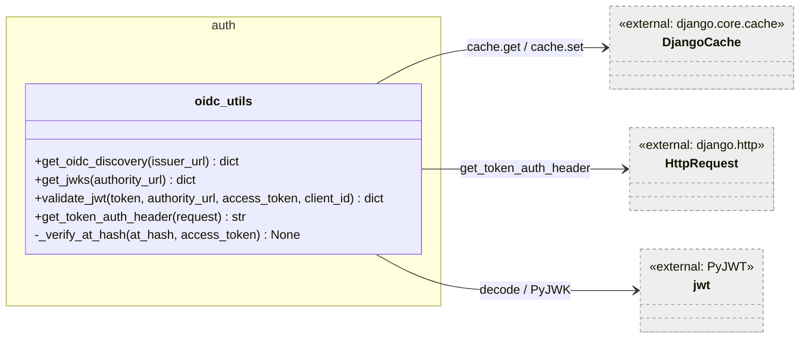

**Caption: Figure 1 — oidc_utils module relationships**

This module is stateless and provides four public functions and one private helper.
All network I/O results are stored in Django's cache framework for one hour
(`JWKS_CACHE_TIMEOUT = OIDC_DISCOVERY_CACHE_TIMEOUT = 3600 s`) to avoid repeated
round-trips to the identity provider on every request.

#### `get_oidc_discovery(issuer_url)`

**Signature:** `get_oidc_discovery(issuer_url: str | None) -> dict[str, Any] | None`

Fetches the OIDC well-known discovery document from
`{issuer_url}/.well-known/openid-configuration`. Returns `None` on any network or
parse failure. Results are cached under `oidc_discovery_{hash(issuer_url)}`.

#### `get_jwks(authority_url)`

**Signature:** `get_jwks(authority_url: str | None) -> dict[str, Any] | None`

Retrieves the JSON Web Key Set. First calls `get_oidc_discovery` to find the
`jwks_uri`; if discovery fails it falls back to
`{authority_url}/.well-known/jwks.json`. Results are cached under
`oidc_jwks_{hash(authority_url)}`.

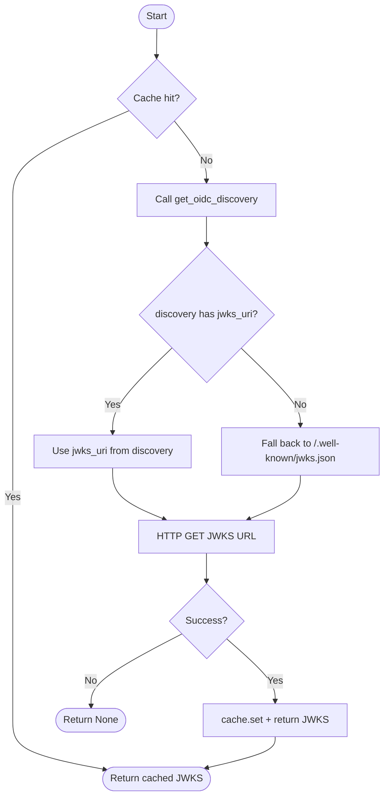

**Caption: Figure 2 — get_jwks control flow**

#### `validate_jwt(token, authority_url, access_token, client_id)`

**Signature:**
`validate_jwt(token: str, authority_url: str | None, access_token: str | None = None, client_id: str | None = None) -> dict[str, Any]`

Full JWT validation. Fetches the JWKS, matches the key by `kid`, constructs a
`PyJWK` signing key, and calls `jwt.decode` with RS256. When `client_id` is
provided it is passed as the expected audience; when omitted audience verification
is skipped (used for access tokens whose audience varies by provider). When
`access_token` is provided and the decoded payload contains `at_hash`, the hash is
verified via `_verify_at_hash`. Raises `AuthenticationFailed` on any validation
failure; never returns `None` — callers can trust the returned payload is authentic.

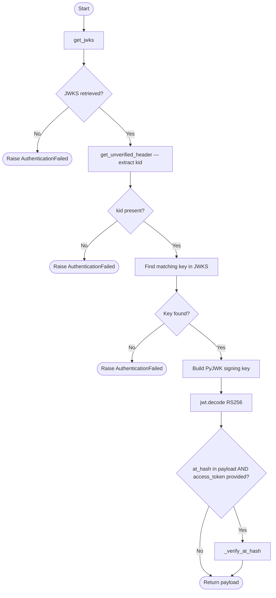

**Caption: Figure 3 — validate_jwt control flow**

#### `get_token_auth_header(request)`

**Signature:** `get_token_auth_header(request: HttpRequest) -> str | None`

Extracts the token from the `Authorization: Bearer <token>` header. Returns `None`
if the header is absent, does not use the `Bearer` scheme, or has an unexpected
number of parts. This function is intentionally non-raising: callers use `None` to
signal that this authenticator does not apply to the request.

#### `_verify_at_hash(at_hash, access_token)` (private)

**Signature:** `_verify_at_hash(at_hash: str, access_token: str) -> None`

Computes SHA-256 of the access token, takes the first 16 bytes, and compares
the Base64url encoding against `at_hash`. Raises `jwt.InvalidTokenError` on
mismatch. This is the OIDC Core §3.3.2.9 binding check between an ID token and
its accompanying access token.

---

### `OIDCAccessTokenAuthentication`

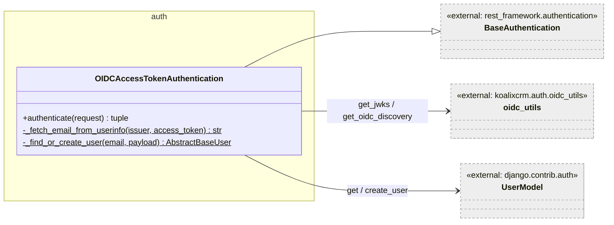

**Caption: Figure 4 — OIDCAccessTokenAuthentication class**

This class is the DRF authenticator for all REST API endpoints. It validates Bearer
JWTs issued by any standards-compliant OIDC provider. The provider is identified by
`OIDC_ISSUER` in Django settings; accepted audiences are listed in
`OIDC_ACCEPTED_AUDIENCES`. Users are identified by email, not by `sub`, which allows
the same Django user to authenticate across multiple OIDC clients. Names are kept in
sync on each successful login, but never overwritten with empty values.

#### `authenticate(request)`

**Signature:** `authenticate(request: HttpRequest) -> tuple[AbstractBaseUser, dict] | None`

Returns `None` (unapplied) if the `Authorization` header is missing, the token
header is malformed, `OIDC_ISSUER` is not configured, or the `kid` in the token
header does not match any key in the JWKS. Raises `AuthenticationFailed` for
tokens that are structurally valid but fail signature, expiry, or audience checks.

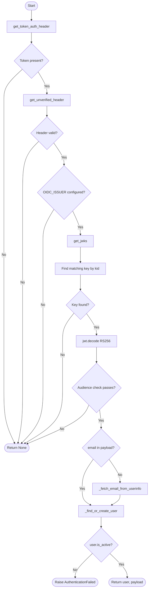

**Caption: Figure 5 — OIDCAccessTokenAuthentication.authenticate flow**

#### `_fetch_email_from_userinfo(issuer, access_token)` (private, static)

Calls the OIDC `userinfo_endpoint` (discovered from the well-known document) with
the access token as a Bearer credential and extracts the `email` field. Returns
`None` on any network or parse failure. Used as a fallback when the access token
itself does not carry an `email` claim (e.g., opaque-style access tokens from
Cognito).

#### `_find_or_create_user(email, payload)` (private, static)

Looks up a `UserModel` by email. If found, syncs `first_name` / `last_name` from
`given_name` / `family_name` claims if they are non-empty and different. If not
found, auto-provisions a new user inside a `transaction.atomic()` block. Raises
`AuthenticationFailed` on `IntegrityError` (concurrent creation race).

---

### `CeleryWorkerM2MAuthentication`

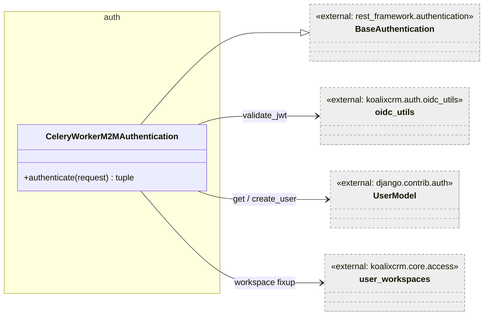

**Caption: Figure 6 — CeleryWorkerM2MAuthentication class**

This class authenticates machine-to-machine clients using the OAuth 2.0 Client
Credentials Grant. The issuer is separate from the user-facing OIDC issuer and is
configured via `CELERY_WORKER_M2M_OIDC_ISSUER`. Identity is established via the
`client_id` or `azp` claim, which is mapped to a Django service user by username.
Service users are auto-provisioned on first contact.

A non-obvious responsibility of this authenticator is patching
`request.active_workspace` when it is `None`. Because `WorkspaceContextMiddleware`
runs before DRF authentication and sees `AnonymousUser`, it cannot set a workspace
for M2M requests. This authenticator repairs the gap by assigning the first
workspace accessible to the service user, enabling workspace-scoped viewsets to
function correctly for M2M clients.

#### `authenticate(request)`

**Signature:** `authenticate(request: HttpRequest) -> tuple[AbstractBaseUser, dict] | None`

Returns `None` at any early-exit condition: missing Bearer header, malformed JWT
header, unconfigured issuer, or token issued by a different issuer. Uses
unverified decoding to cheaply check `iss` and `azp`/`client_id` before performing
the full cryptographic validation via `validate_jwt`.

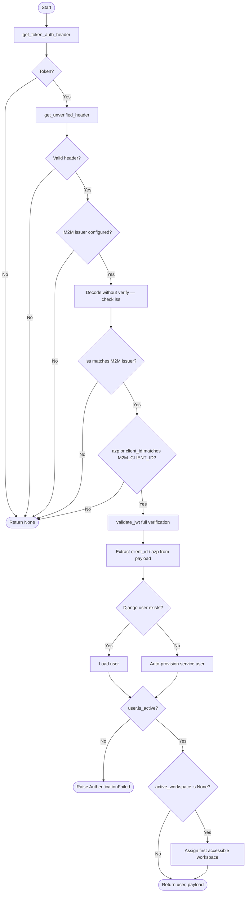

**Caption: Figure 7 — CeleryWorkerM2MAuthentication.authenticate flow**

---

### `OIDCAuthenticationBackend`

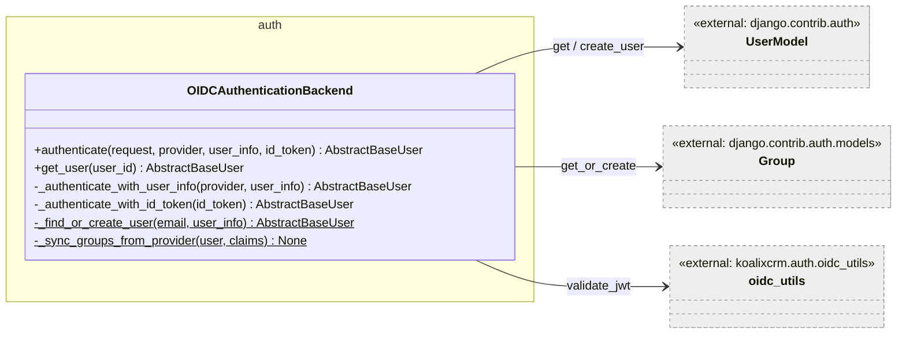

**Caption: Figure 8 — OIDCAuthenticationBackend class**

This Django authentication backend handles session-based authentication for the
admin UI. It is called by `django.contrib.auth.authenticate()` after
`OAuthCallbackView` obtains user info from the OIDC provider. The primary path
(`_authenticate_with_user_info`) uses a standardized user-info dict supplied by the
view. A legacy secondary path (`_authenticate_with_id_token`) validates a raw ID
token directly; this is retained for backwards compatibility.

Group membership from the provider is merged additively into Django groups: existing
Django group assignments are never removed. Three claim locations are checked in
priority order: `cognito:groups`, `groups`, `realm_access.roles`.

#### `authenticate(request, provider, user_info, id_token)`

**Signature:**
`authenticate(request, provider=None, user_info=None, id_token=None, **kwargs) -> AbstractBaseUser | None`

Dispatches to `_authenticate_with_user_info` when `provider` and `user_info` are
both present, otherwise to `_authenticate_with_id_token` when `id_token` is
present. Returns `None` when neither condition is met, allowing Django to try the
next backend in `AUTHENTICATION_BACKENDS`.

#### `_sync_groups_from_provider(user, claims)` (private, static module function)

Additively merges provider-supplied group names into Django groups. Groups that
already exist are reused via `get_or_create`. This function is a module-level
private function (not a method) called from `_authenticate_with_user_info`.

---

### Browser Login Views (`oidc_views.py`)

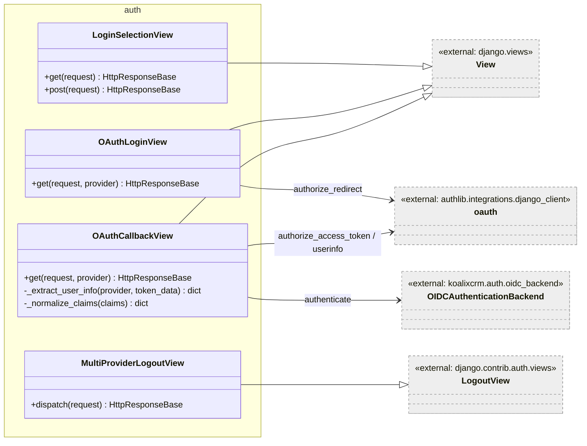

**Caption: Figure 9 — Browser OIDC login view classes**

These views implement the browser-based Authorization Code Flow with PKCE. The
OAuth client is registered at module load time using `authlib`'s `OAuth` registry
if `ADMIN_OIDC_ISSUER` is set in settings. The `code_challenge_method = 'S256'`
configuration enforces PKCE on all authorization requests. When `ADMIN_OIDC_ISSUER`
is not configured the views fall back to Django's built-in admin `LoginView`,
allowing local development and end-to-end tests to work without a live Keycloak
instance.

#### `LoginSelectionView`

Handles the admin login entry point (`/auth/login/`). When already authenticated,
redirects to `next` or the admin index. When OIDC is configured, redirects to
`OAuthLoginView`. Otherwise renders Django's admin login template, also handling
credential `POST` requests for the fallback path.

#### `OAuthLoginView`

Handles `GET /auth/login/<provider>/`. Stores any `next` URL in the session, builds
the absolute callback URI using `SITE_URL` if available, and calls
`oauth_client.authorize_redirect` to send the browser to the identity provider.

#### `OAuthCallbackView`

Handles `GET /auth/callback/<provider>/`. Exchanges the authorization code for
tokens, extracts user info via three fallback strategies (token response
`userinfo`, userinfo endpoint call, ID token claims), authenticates the user,
calls `login(request, user)`, and redirects to the stored `next` URL or the admin
index. Access to the admin is guarded: non-staff users are logged out and receive
HTTP 403.

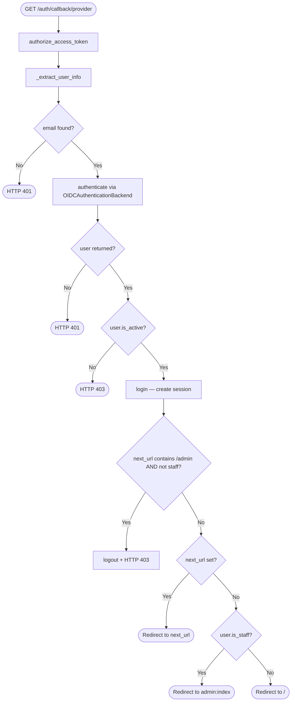

**Caption: Figure 10 — OAuthCallbackView.get control flow**

#### `_extract_user_info(provider, token_data)` (private)

Tries three sources in order: `token_data['userinfo']`, the userinfo endpoint, and
base64-decoded ID token claims. Returns `None` if no source yields an email.

#### `MultiProviderLogoutView`

Extends Django's `LogoutView`. After calling `logout(request)`, it discovers the
`end_session_endpoint` from the OIDC discovery document and redirects the browser
there with `post_logout_redirect_uri` and `client_id` parameters, enabling
federated single logout. Falls back to `login-selection` if the endpoint cannot be
discovered.

---

### `openapi_extensions.py`

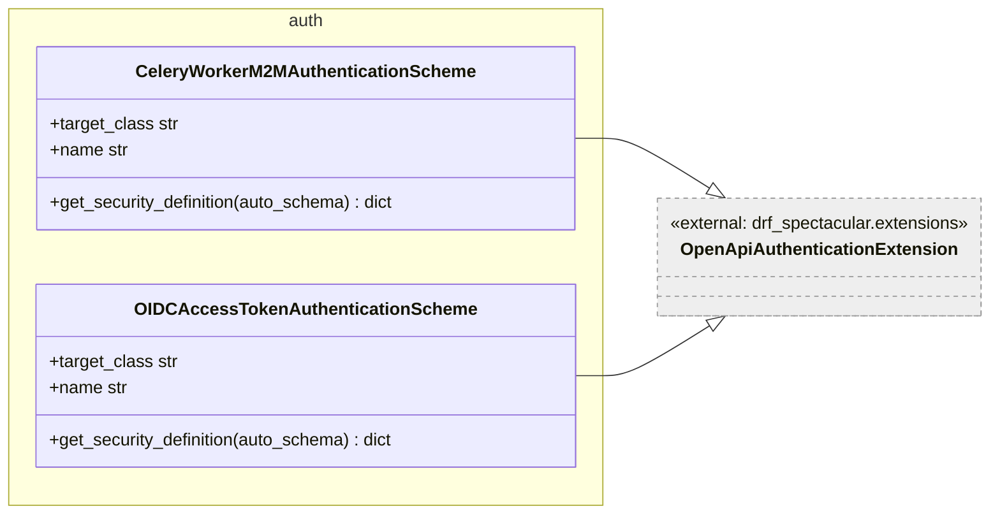

**Caption: Figure 11 — OpenAPI authentication extension classes**

Both classes subclass `OpenApiAuthenticationExtension` from `drf-spectacular`. Each
declares `target_class` pointing to the authenticator it describes. The
`get_security_definition` method returns an OpenAPI 3 `securityScheme` object of
type `http`, scheme `bearer`, format `JWT`. The registration takes effect as a
side effect of importing the module, which is triggered unconditionally by
`koalixcrm/auth/__init__.py`.

---

## Persistent Storage

The auth package does not own any database tables. User records and group
assignments are written to Django's built-in `auth_user` and `auth_group` tables
via Django's ORM.

---

## In-Memory State

The `oauth` module-level `OAuth` instance in `oidc_views.py` holds registered
provider configurations. This is process-level state initialised at Django startup.
In a horizontally scaled deployment every process holds its own copy, which is
correct because the object only stores static configuration.

JWKS and discovery documents are cached in Django's cache framework (not in-process
memory), making the cache entries shared across processes when a distributed cache
backend is used.

---

## Access to External Interfaces

| Interface | Type of Call | Expected Duration | Notes |
|-----------|-------------|-------------------|-------|
| OIDC discovery endpoint `/.well-known/openid-configuration` | Blocking HTTP GET (stdlib `urlopen`) | ~100–500 ms | Cached for 1 hour; only on cache miss |
| JWKS endpoint `/.well-known/jwks.json` | Blocking HTTP GET (stdlib `urlopen`) | ~100–500 ms | Cached for 1 hour; only on cache miss |
| OIDC userinfo endpoint | Blocking HTTP GET (stdlib `urlopen`) | ~100–500 ms | Only called when access token lacks `email` claim |
| OIDC token endpoint | Blocking HTTP POST via authlib | ~200–800 ms | Only during callback code exchange |
| OIDC end_session_endpoint | Browser redirect (no server-side call) | — | HTTP 302 issued to client browser |

---

## Security

### Assets

| Asset | Description | Security Measure | Assessment of Criticality |
|-------|-------------|------------------|---------------------------|
| `ADMIN_OIDC_CLIENT_SECRET` | Client secret for admin OIDC app | Read from environment variable at startup | Uncritical when delivered via secret manager; critical if logged or stored in version control |
| `CELERY_WORKER_M2M_CLIENT_SECRET` | Client secret for M2M client credentials grant | Read from environment variable at startup | Uncritical when delivered via secret manager |
| `OIDC_ISSUER` | Issuer URL used as the trust anchor for JWT validation | Read from environment variable; used as `issuer` in `jwt.decode` | Uncritical — publicly known URL; critical if tampered with |
| `CELERY_WORKER_M2M_OIDC_ISSUER` | Separate trust anchor for M2M tokens | Read from environment variable | Same criticality as `OIDC_ISSUER` |
| Session cookie | Django session after successful OIDC login | Django session framework; `HttpOnly` and `Secure` flags depend on deployment settings | Uncritical when TLS is enforced at the load balancer |
| JWT token (Bearer) | Short-lived access token in `Authorization` header | Validated cryptographically (RS256, expiry, issuer, audience) | Uncritical — time-limited, provider-signed |

---

## Design Patterns Used

**Strategy** — `AUTHENTICATION_BACKENDS` is a list of backend classes, each
implementing `authenticate`. Django iterates them in order, using the first
non-`None` result. `OIDCAuthenticationBackend` and Django's built-in
`ModelBackend` are both registered, allowing OIDC-authenticated and
password-authenticated sessions to coexist.

**Chain of Responsibility** — DRF's `DEFAULT_AUTHENTICATION_CLASSES` list applies
the same pattern for API requests: `CeleryWorkerM2MAuthentication`,
`OIDCAccessTokenAuthentication`, `SessionAuthentication`, and `BasicAuthentication`
are tried in order. Each returns `None` to pass, or a `(user, token)` tuple to
claim the request.

**Decorator / Side-Effect Registration** — `__init__.py` imports
`openapi_extensions` solely for the side effect of registering the
`OpenApiAuthenticationExtension` subclasses with `drf-spectacular`'s class registry.

**Singleton-like Module State** — The `authlib` `OAuth` instance in `oidc_views.py`
is module-level and configured once at import time.

---

## External Dependencies

| Requirement | Version/Details | Notes |
|-------------|-----------------|-------|
| `PyJWT` | `>=2.0` | JWT decoding and `PyJWK` key construction |
| `authlib` | `>=1.0` | `django_client.OAuth` for Authorization Code + PKCE flow |
| `djangorestframework` | `>=3.14` | `BaseAuthentication`, `AuthenticationFailed` |
| `drf-spectacular` | `>=0.27` | `OpenApiAuthenticationExtension` |
| `django` | `>=4.2` | Cache framework, auth framework, session middleware |

---

## Appendix

### References

- [drf-spectacular Authentication Extensions](https://drf-spectacular.readthedocs.io/en/latest/customization.html#authentication)
- [OIDC Core Specification §3.3.2.9 — at_hash](https://openid.net/specs/openid-connect-core-1_0.html#CodeFlowTokenValidation)
- [RFC 6749 — Client Credentials Grant](https://datatracker.ietf.org/doc/html/rfc6749#section-4.4)
- [authlib Django Integration](https://docs.authlib.org/en/latest/client/django.html)

### List of Illustrations

| Figure | Title |
|--------|-------|
| Figure 1 | oidc_utils module relationships |
| Figure 2 | get_jwks control flow |
| Figure 3 | validate_jwt control flow |
| Figure 4 | OIDCAccessTokenAuthentication class |
| Figure 5 | OIDCAccessTokenAuthentication.authenticate flow |
| Figure 6 | CeleryWorkerM2MAuthentication class |
| Figure 7 | CeleryWorkerM2MAuthentication.authenticate flow |
| Figure 8 | OIDCAuthenticationBackend class |
| Figure 9 | Browser OIDC login view classes |
| Figure 10 | OAuthCallbackView.get control flow |
| Figure 11 | OpenAPI authentication extension classes |
