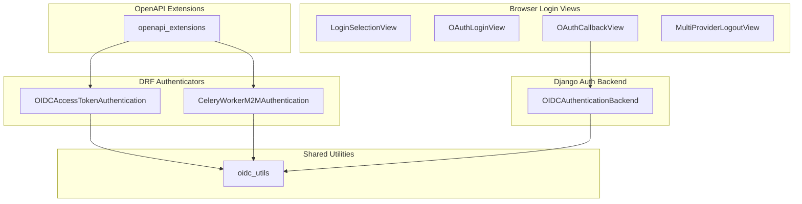
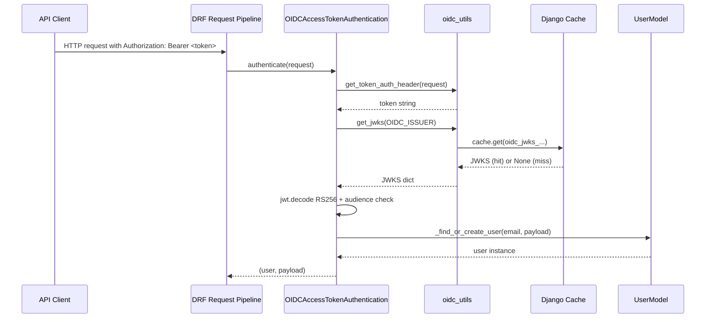
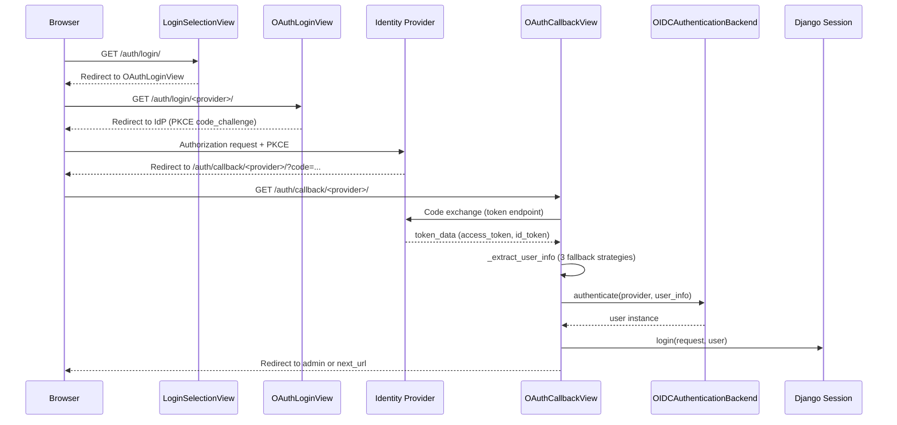
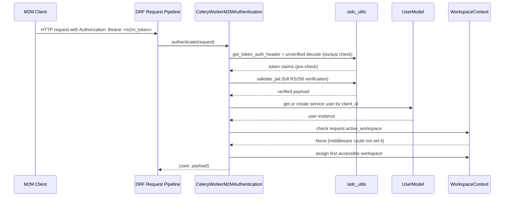
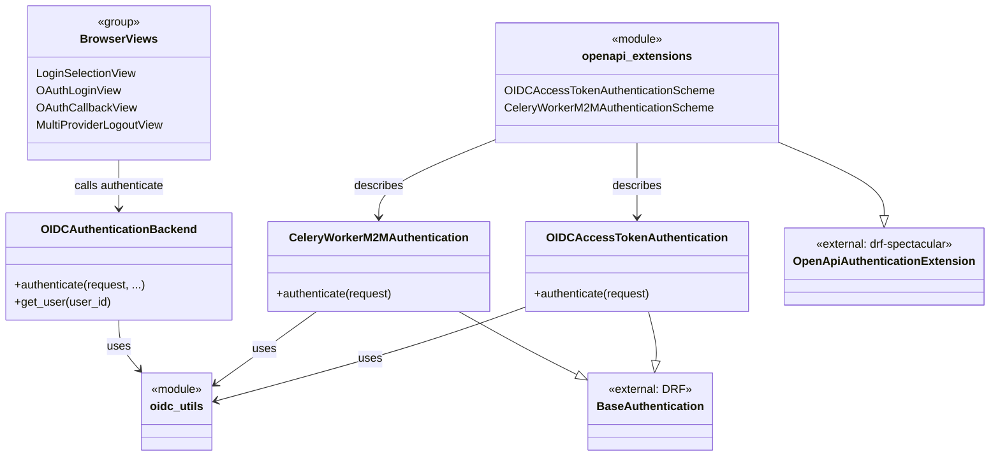

# Auth Package — Mid-Level Documentation

## Introduction

### Purpose

The `koalixcrm/auth/` package implements all authentication mechanisms for koalixcrm.
It covers three distinct authentication paths:

- **Browser-based OIDC session login** for the Django admin interface, using the
  Authorization Code Flow with PKCE.
- **DRF Bearer JWT authentication** for REST API endpoints, supporting both
  user-facing access tokens and machine-to-machine (Client Credentials Grant) tokens.
- **OpenAPI security scheme registration** so that generated API specifications
  accurately describe the authentication requirements of each endpoint.

### Contents Overview

| Component | Role |
|---|---|
| `oidc_utils` | Stateless shared utilities: discovery, JWKS fetching, JWT validation, header parsing |
| `OIDCAccessTokenAuthentication` | DRF authenticator for user-facing Bearer JWTs |
| `CeleryWorkerM2MAuthentication` | DRF authenticator for M2M Client Credentials tokens |
| `OIDCAuthenticationBackend` | Django auth backend for browser OIDC session login |
| Browser login views | `LoginSelectionView`, `OAuthLoginView`, `OAuthCallbackView`, `MultiProviderLogoutView` |
| `openapi_extensions` | `drf-spectacular` security scheme registrations |

### Target Audience

Software development engineers who need to understand how the authentication layer
is structured, how the components interact, and where to extend or modify behaviour.
For method-level detail, see [QQ_LL_Doc_Auth.md](QQ_LL_Doc_Auth.md).

### Glossary

| Term / Acronym | Full Form | Description |
|---|---|---|
| OIDC | OpenID Connect | Identity layer on top of OAuth 2.0 providing user authentication |
| JWT | JSON Web Token | Compact, URL-safe token format used to transmit claims between parties |
| JWKS | JSON Web Key Set | Published set of public keys used to verify JWT signatures |
| M2M | Machine-to-Machine | Non-interactive authentication using the OAuth 2.0 Client Credentials Grant |
| DRF | Django REST Framework | Python library for building REST APIs with Django |
| Bearer token | — | HTTP Authorization scheme: `Authorization: Bearer <token>` |
| PKCE | Proof Key for Code Exchange | OAuth 2.0 extension that binds an authorization code to the client that requested it |
| RS256 | RSA Signature with SHA-256 | Asymmetric JWT signing algorithm used by all supported OIDC providers |
| `at_hash` | Access Token Hash | JWT claim in an ID token binding it to a specific access token |
| `azp` | Authorized Party | JWT claim indicating the client to which the token was issued |

---

## Package Diagram

The following diagram groups the package components by responsibility and shows
the key dependency relationships between them.

Figure 1 — Auth package component groups and key dependencies

For method signatures, control-flow diagrams, and class-level detail, see
[QQ_LL_Doc_Auth.md](QQ_LL_Doc_Auth.md).

---

## Interaction Diagrams

### DRF API Request Authentication (Bearer JWT)

This sequence shows how a REST API request carrying a Bearer JWT is validated and
resolved to a Django user. `oidc_utils` is the shared utility module; cache hits
skip the network calls entirely.

Figure 2 — DRF API request authentication sequence (Bearer JWT)

### Browser OIDC Login Flow

This sequence shows the browser-based Authorization Code Flow with PKCE. The IdP
interaction steps (authorization redirect and token exchange) are collapsed for
clarity.

Figure 3 — Browser OIDC login flow sequence

### M2M Authentication and Workspace Fixup

This sequence shows how a Celery worker or other M2M client is authenticated and
how the workspace gap left by middleware is repaired.

Figure 4 — M2M authentication and workspace fixup sequence

---

## Class Diagrams

The following diagram shows the inheritance hierarchy and key usage relationships
between the main classes in the package. Method bodies are omitted; see
[QQ_LL_Doc_Auth.md](QQ_LL_Doc_Auth.md) for full signatures.

Figure 5 — Auth package class relationships

---

## Design Patterns Used

**Strategy** — Django's `AUTHENTICATION_BACKENDS` setting holds an ordered list of
backend classes, each implementing `authenticate`. Django iterates them and uses the
first non-`None` result. `OIDCAuthenticationBackend` and Django's built-in
`ModelBackend` coexist in this list, allowing OIDC-authenticated and
password-authenticated sessions to operate simultaneously.

**Chain of Responsibility** — DRF's `DEFAULT_AUTHENTICATION_CLASSES` applies the
same pattern for API requests. `CeleryWorkerM2MAuthentication`,
`OIDCAccessTokenAuthentication`, `SessionAuthentication`, and `BasicAuthentication`
are tried in order. Each returns `None` to pass the request on, or a `(user, token)`
tuple to claim it.

**Side-Effect Registration** — `koalixcrm/auth/__init__.py` imports
`openapi_extensions` solely for the side effect of registering
`OpenApiAuthenticationExtension` subclasses with `drf-spectacular`'s class registry.
No explicit registration call is needed at the call site.

**Singleton-like Module State** — The `authlib` `OAuth` instance in `oidc_views.py`
is created at module import time and holds the registered OIDC provider
configurations for the lifetime of the process. In a horizontally scaled deployment
each process maintains its own copy, which is correct because the object stores only
static configuration.

---

## External Dependencies

| Package | Minimum Version | Role in this package |
|---|---|---|
| `PyJWT` | `>=2.0` | JWT decoding and `PyJWK` signing-key construction in `oidc_utils` |
| `authlib` | `>=1.0` | Authorization Code + PKCE flow via `django_client.OAuth` in `oidc_views` |
| `djangorestframework` | `>=3.14` | `BaseAuthentication` base class and `AuthenticationFailed` exception |
| `drf-spectacular` | `>=0.27` | `OpenApiAuthenticationExtension` base class in `openapi_extensions` |
| `django` | `>=4.2` | Cache framework, auth framework, session middleware, ORM |

---

## Testing

Information not available.

---

## Appendix

### References

- [QQ_LL_Doc_Auth.md](QQ_LL_Doc_Auth.md) — Low-level documentation with full method
  signatures, control-flow diagrams, and security asset inventory for the
  `koalixcrm/auth/` package.

### List of Illustrations

| Figure | Title |
|---|---|
| Figure 1 | Auth package component groups and key dependencies |
| Figure 2 | DRF API request authentication sequence (Bearer JWT) |
| Figure 3 | Browser OIDC login flow sequence |
| Figure 4 | M2M authentication and workspace fixup sequence |
| Figure 5 | Auth package class relationships |
