# Low-Level Documentation: contacts.models

## Introduction

### Scope

This document covers all Django model classes defined under
`koalixcrm/contacts/models/` and publicly re-exported via the package's
`__init__.py`. The following source files and their classes are documented here:

| Source File | Class(es) |
|---|---|
| `models/__init__.py` | Package namespace — re-exports only |
| `models/party.py` | `Party` |
| `models/organization.py` | `Organization` |
| `models/natural_person.py` | `PartyContact` |
| `models/address.py` | `Address` |
| `models/address_assignment.py` | `AddressAssignment` |
| `models/customer_billing_cycle.py` | `CustomerBillingCycle` |
| `models/email_assignment.py` | `EmailAssignment` |
| `models/organization_membership.py` | `OrganizationMembership` |
| `models/organization_relationship.py` | `OrganizationRelationship` |
| `models/party_email.py` | `PartyEmail` |
| `models/party_group.py` | `PartyGroup` |
| `models/party_group_membership.py` | `PartyGroupMembership` |
| `models/party_identification.py` | `PartyIdentification` |
| `models/party_role.py` | `PartyRole` |
| `models/phone_assignment.py` | `PhoneAssignment` |
| `models/phone_number.py` | `PhoneNumber` |

The signals directory (`contacts/signals/__init__.py`) is empty; no signal
handlers are defined in this package at the time of writing.

### Target Audience

The primary audience is the software development engineer who needs to use,
modify, or extend the contacts data model.

### Glossary

| Term/Acronym | Full Form | Description |
|---|---|---|
| CRM | Customer Relationship Management | The domain this application covers: managing parties, their roles, and interactions. |
| MTI | Multi-Table Inheritance | Django's mechanism for subclassing a model: the child table holds only the new columns and shares the parent's primary key via a one-to-one link. |
| Party | — | The abstract entity that can play many roles (customer, supplier, employee, etc.). Both organizations and natural persons are parties. |
| Party Role | — | A typed label that describes the business function a party has within the system (e.g. "customer", "supplier"). |
| Assignment table | — | A join table that links a canonical record (address, email, phone) to a party and annotates the link with a purpose and validity window. |
| GLN | Global Location Number | A GS1 identifier for legal entities and locations. |
| DUNS | Data Universal Numbering System | A nine-digit Dun & Bradstreet identifier for businesses. |
| LEI | Legal Entity Identifier | A 20-character ISO 17442 identifier for entities participating in financial transactions. |
| UID | Unternehmens-Identifikationsnummer | Swiss company identifier (format: CHE-xxx.xxx.xxx). |
| IBAN | International Bank Account Number | A standardized international numbering system for bank accounts. |
| E.164 | — | ITU-T recommendation for international telephone numbering; example format: `+41441234567`. |
| ISO 3166-1 alpha-2 | — | Two-letter country codes (e.g. `CH`, `DE`). Used in `country` fields. |
| ISO 3166-2 | — | Standard for sub-country codes (cantons, states). The `subdivision_code` field stores the suffix portion. |
| GDPR | General Data Protection Regulation | EU regulation governing personal data; `gdpr_consent_date` records when a person gave consent. |
| UBL | Universal Business Language | OASIS standard XML vocabulary for business documents; referenced in code comments as the planned export target. |
| Workspace | — | The multi-tenancy unit. Every `WorkspaceScopedModel` carries a `workspace` foreign key that scopes all data to one tenant. |

---

## Detailed Component

### Overview: class hierarchy and relationships

The diagram below summarises the full model graph at a glance. Detailed
per-class diagrams follow in the subsections.

**Figure 1 — contacts.models overview**

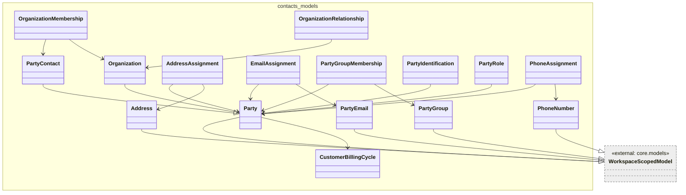

*Caption: Figure 1 — Full entity and inheritance graph for `contacts.models`. MTI
inheritance is shown as `--|>`. Foreign keys are shown as `-->`. External base
classes are greyed out.*

---

### Party

**Figure 2 — Party class diagram**

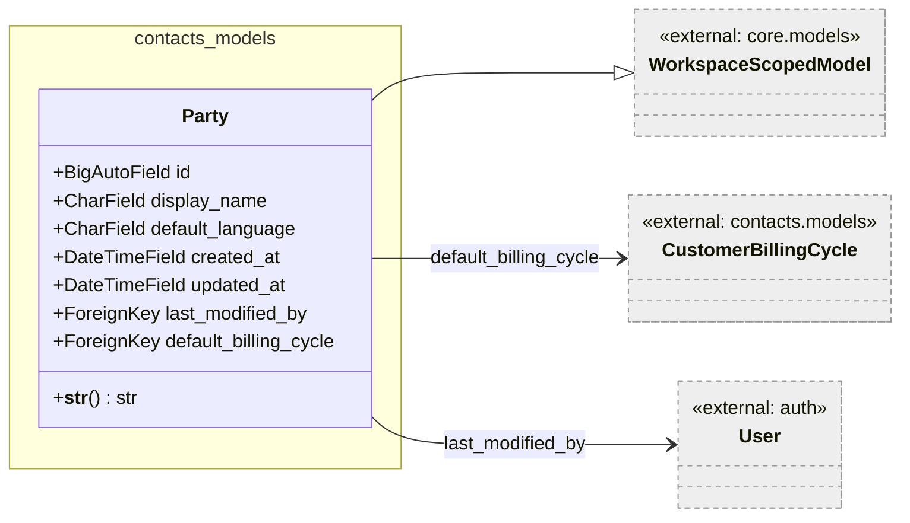

*Caption: Figure 2 — `Party` class with its MTI parent and foreign-key targets.*

`Party` is the central entity of the contacts domain. It represents any actor in
the system — a company, a person, or an abstract counterpart — without
prescribing its concrete type. Concrete subtypes (`Organization`, `PartyContact`)
add type-specific columns via Django MTI; each subtype row shares the parent
primary key.

The `display_name` field is the single human-readable label shown everywhere in
the UI and on documents. It is not computed from subtype fields; it must be set
explicitly, which allows both organizations and persons to use a freely chosen
display string.

`default_language` is a nullable ISO 639-1 two-letter code drawn from
`LANGUAGE_CHOICES` (`de`, `fr`, `it`, `en`). It is used downstream to select
the document language when generating correspondence. Parties that do not require
language-specific treatment may leave it null.

`default_billing_cycle` is nullable because `Party` itself is generic — only
parties that carry the `customer` role require a billing cycle. The field was
moved from the legacy `Customer` model in issue #395 to allow the billing cycle
to be managed at the party level.

`last_modified_by` is constrained to `is_staff=True` users and uses
`on_delete=PROTECT`, preventing deletion of a staff account while any party
still references it as its last editor. The field is nullable to cover
programmatically created parties that have no human editor.

`created_at` and `updated_at` are set automatically by Django's `auto_now_add`
and `auto_now` mechanisms; they cannot be set via the ORM.

The database table is `crm_party`.

#### `__str__`

Returns `self.display_name`. Trivial delegation — no flow diagram required.

---

### Organization

**Figure 3 — Organization class diagram**

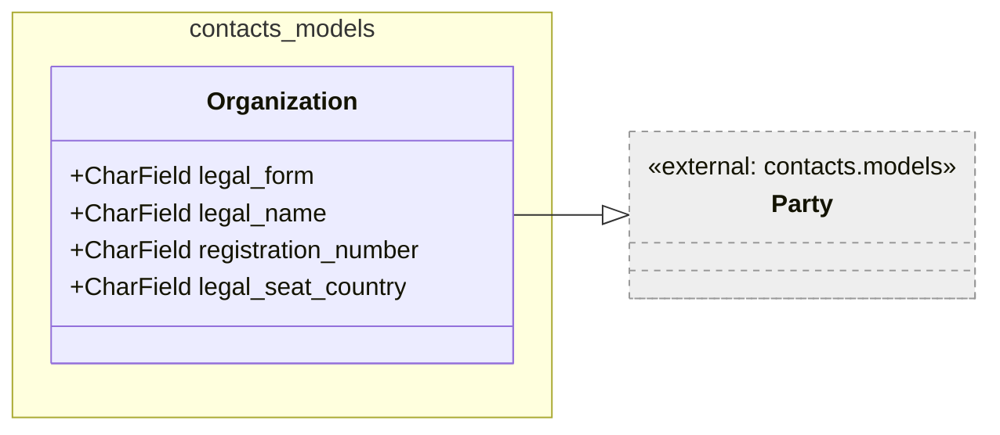

*Caption: Figure 3 — `Organization` inherits `Party` via MTI. The diagram shows
only the columns owned by the `crm_organization` table.*

`Organization` is the MTI child that models a legal entity (company, association,
public body, etc.). Its database table `crm_organization` stores only the
organization-specific columns; the full record is assembled by joining with
`crm_party` on the shared primary key.

`legal_form` constrains to `LEGAL_FORM_CHOICES` (AG, GmbH, Verein, Stiftung,
Einzelfirma, Holding, KG, AG & Co. KG, Public body, Other). It is optional
because not all counterparts in the system have a Swiss or German legal form.

`legal_name` and `registration_number` are free-form text. `legal_name` is
distinct from `display_name` on the parent: the display name is the commonly
used short name while `legal_name` carries the full registered firm name.

`legal_seat_country` stores an ISO 3166-1 alpha-2 country code. The choices are
derived from the `COUNTRIES` constant at field definition time — the tuple
expression `[(x[0], x[3]) for x in COUNTRIES]` extracts code and display name.
This means valid choices are fixed at migration time, not at runtime.

`Organization` defines no methods beyond those inherited from `Party` and
`WorkspaceScopedModel`.

---

### PartyContact (natural person)

**Figure 4 — PartyContact class diagram**

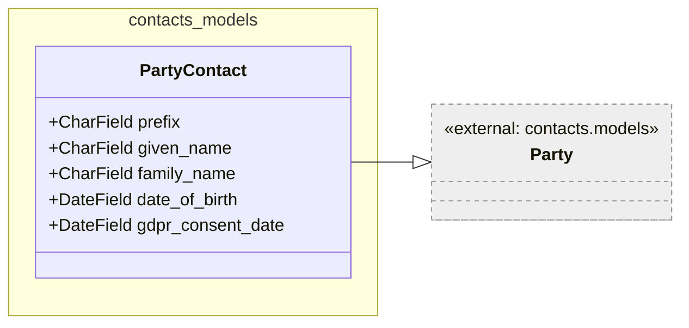

*Caption: Figure 4 — `PartyContact` inherits `Party` via MTI. Table
`crm_partycontact` holds only the person-specific columns.*

`PartyContact` represents a natural person (contact, employee, individual). The
class name is a transitional name from the coexistence period during issues
#392–#394; it is scheduled to be renamed to `Contact` once the legacy model is
fully removed.

`prefix` maps to `POSTALADDRESSPREFIX` (`F` = Company, `W` = Mrs, `H` = Mr,
`G` = Ms). It is nullable because prefix usage is optional and culturally
dependent.

`gdpr_consent_date` records the calendar date on which the person gave consent
under GDPR. A null value indicates that no explicit consent has been recorded.
This field is significant for compliance: downstream processes that send
marketing communication must check this field before including a contact.

`default_language` is inherited from `Party` — it is not repeated on
`PartyContact`, giving organizations and persons a single field for language
preference.

`PartyContact` defines no methods beyond those inherited.

---

### Address

**Figure 5 — Address class diagram**

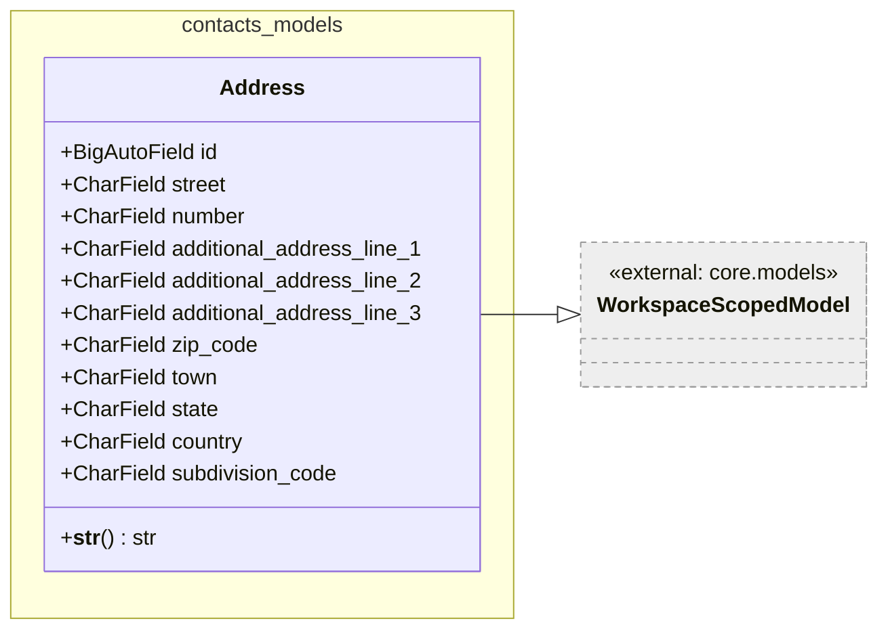

*Caption: Figure 5 — `Address` as a standalone canonical record; linked to
parties via `AddressAssignment`.*

`Address` is a canonical, reusable address record stored in `crm_address`. It is
not embedded in a party record; instead it is linked by one or more
`AddressAssignment` rows. This separation allows the same physical address to be
referenced by multiple parties, and allows a party to hold multiple addresses for
different purposes (billing, shipping, legal seat) without duplicating address
data.

All fields are nullable, reflecting that incomplete addresses are common in
practice (e.g. a PO box has no street and number).

`country` stores an ISO 3166-1 alpha-2 code. `subdivision_code` stores the
suffix portion of an ISO 3166-2 code (e.g. `ZH` for the canton of Zurich in
Switzerland), which allows province-level granularity without redundantly
repeating the country code.

The three `additional_address_line_*` fields exist for address formats that do
not fit into the street/number/zip/town structure (care-of lines, building names,
floor, mailbox).

#### `__str__`

Returns a human-readable one-line summary built from the non-null values of
`street`, `number`, `zip_code`, `town`, and `country`.

**Figure 6 — `Address.__str__` flow**

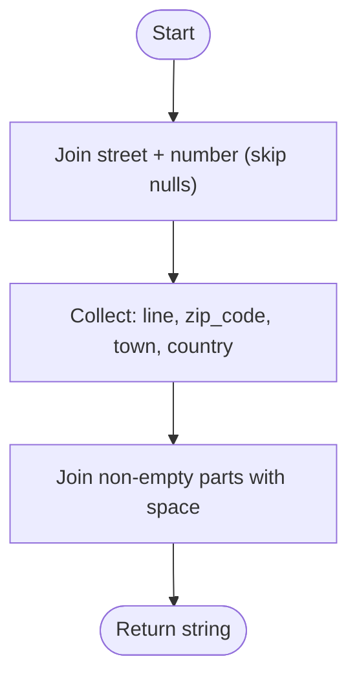

*Caption: Figure 6 — Logic of `Address.__str__`: two-stage join that first
combines street and number, then combines all non-null parts.*

---

### AddressAssignment

**Figure 7 — AddressAssignment class diagram**

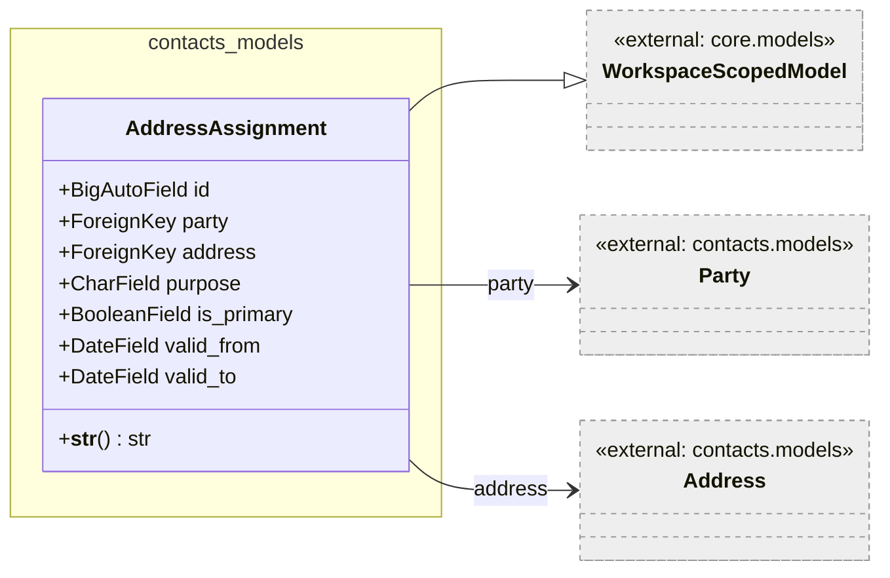

*Caption: Figure 7 — `AddressAssignment` as the link between a party and a
canonical address record, annotated with purpose and validity.*

`AddressAssignment` is the join table that links a `Party` to an `Address` and
annotates that link with a `purpose` (from `ASSIGNMENT_PURPOSE_CHOICES`: primary,
billing, shipping, legal, visit, other), a boolean `is_primary`, and an optional
validity window (`valid_from` / `valid_to`).

`on_delete=CASCADE` on both foreign keys means that deleting a party deletes all
its address assignments, and deleting an address record deletes all assignments
that reference it.

`is_primary` is separate from `purpose='primary'` in the choice list; it is a
convenience flag for queries that need the single main address regardless of
purpose category.

`valid_from` and `valid_to` are nullable dates that allow an address to be active
during a specific period only (e.g. a temporary shipping address during a
relocation).

#### `__str__`

Returns `"{party_id}-{purpose}-{address_id}"` using the raw foreign key integer
values. Trivial — no flow diagram required.

---

### CustomerBillingCycle

**Figure 8 — CustomerBillingCycle class diagram**

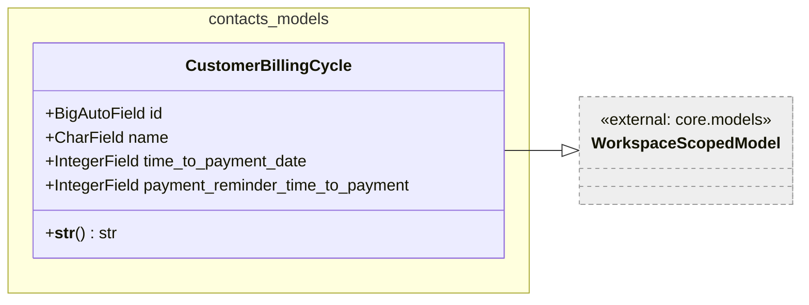

*Caption: Figure 8 — `CustomerBillingCycle` as a standalone lookup record.*

`CustomerBillingCycle` is a reference-data record that defines timing parameters
for invoicing. It is stored in `crm_customerbillingcycle` and referenced
(optionally) from `Party.default_billing_cycle`.

`time_to_payment_date` is the number of days from the invoice issue date to the
payment due date (e.g. 30 for "net 30"). `payment_reminder_time_to_payment` is
the number of days before the payment due date at which a payment reminder should
be sent. Both are plain integers; the unit (days) is implicit.

`on_delete=PROTECT` on the `Party.default_billing_cycle` FK ensures that a
billing cycle in use cannot be deleted without first reassigning all parties that
reference it.

#### `__str__`

Returns the id and name separated by a space. Trivial — no flow diagram required.

---

### PartyEmail

**Figure 9 — PartyEmail class diagram**

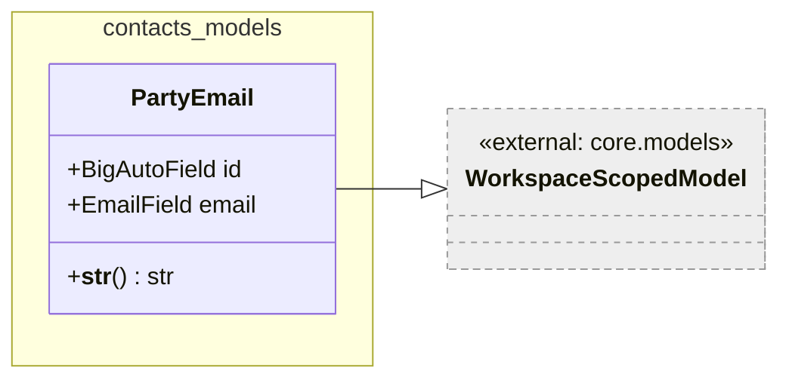

*Caption: Figure 9 — `PartyEmail` as a canonical email address record.*

`PartyEmail` is a canonical email address record stored in `crm_partyemail`. Like
`Address` and `PhoneNumber`, it is not embedded in a party row; `EmailAssignment`
joins it to one or more parties. The class name is transitional; the planned
permanent name (after the legacy model is removed) is `EmailAddress`.

`email` is validated at the Django form/serializer level by `EmailField`; the
database column is a `varchar(200)`. Uniqueness is not enforced at the model
level, allowing the same email address to be registered as separate records if
needed (e.g. an address migrated from two legacy records).

---

### EmailAssignment

**Figure 10 — EmailAssignment class diagram**

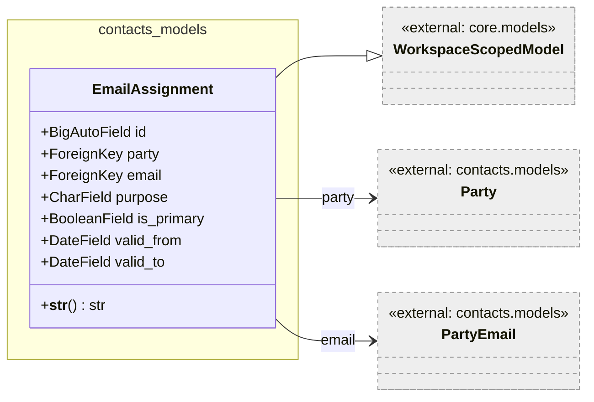

*Caption: Figure 10 — `EmailAssignment` linking a party to a canonical email
address with purpose and validity.*

`EmailAssignment` follows the same assignment pattern as `AddressAssignment`. It
links a `Party` to a `PartyEmail` and annotates the link with `purpose` (same
`ASSIGNMENT_PURPOSE_CHOICES` as address assignments), `is_primary`, `valid_from`,
and `valid_to`. Both foreign keys use `on_delete=CASCADE`.

#### `__str__`

Returns `"{party_id}-{purpose}-{email_id}"`. Trivial — no flow diagram required.

---

### PhoneNumber

**Figure 11 — PhoneNumber class diagram**

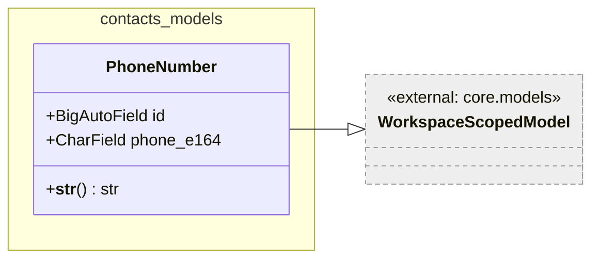

*Caption: Figure 11 — `PhoneNumber` as a canonical phone number record.*

`PhoneNumber` stores a single phone number in E.164 format in `crm_phonenumber`.
The E.164 format mandates a leading `+` followed by the country calling code and
the subscriber number (e.g. `+41441234567`). The column is a plain `varchar(32)`;
format validation is not enforced at the database or model level — it must be
enforced by the caller (form validators, serializers).

---

### PhoneAssignment

**Figure 12 — PhoneAssignment class diagram**

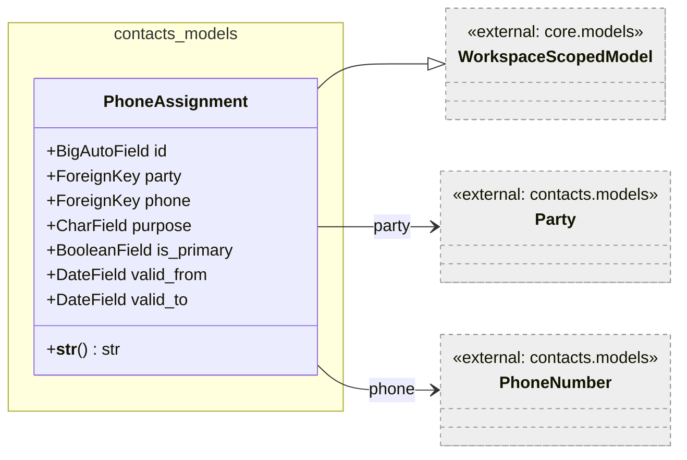

*Caption: Figure 12 — `PhoneAssignment` linking a party to a canonical phone
number with purpose and validity.*

`PhoneAssignment` follows the same pattern as `AddressAssignment` and
`EmailAssignment`. It links a `Party` to a `PhoneNumber` and annotates the link
with `purpose`, `is_primary`, `valid_from`, and `valid_to`. Both foreign keys use
`on_delete=CASCADE`.

#### `__str__`

Returns `"{party_id}-{purpose}-{phone_id}"`. Trivial — no flow diagram required.

---

### OrganizationMembership

**Figure 13 — OrganizationMembership class diagram**

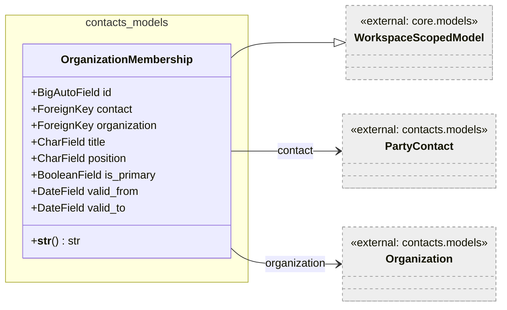

*Caption: Figure 13 — `OrganizationMembership` associating a natural person with
an organization.*

`OrganizationMembership` captures the relationship between a natural person
(`PartyContact`) and an organization, stored in `crm_organizationmembership`.
Both foreign keys cascade on deletion.

`title` and `position` are free-text fields describing the person's role within
the organization (e.g. `Dr.` as title and `Head of Finance` as position). They
are nullable; not every membership has a formal title or position.

`is_primary` marks the primary membership when a person belongs to multiple
organizations. `valid_from` / `valid_to` define the period of membership.

#### `__str__`

Returns `"{contact_id}@{organization_id}"`. Trivial — no flow diagram required.

---

### OrganizationRelationship

**Figure 14 — OrganizationRelationship class diagram**

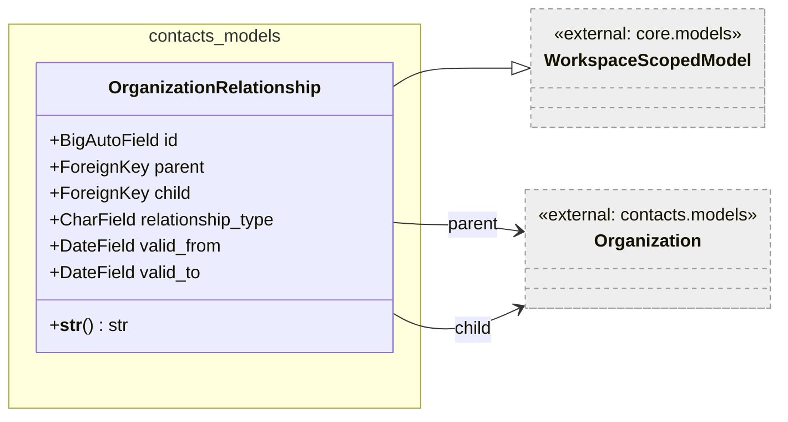

*Caption: Figure 14 — `OrganizationRelationship` as a directed edge between two
organizations.*

`OrganizationRelationship` models a directed, typed relationship between two
organizations, stored in `crm_organizationrelationship`. Both `parent` and
`child` are foreign keys to `Organization` with `on_delete=CASCADE`. The
`relationship_type` is drawn from `ORG_RELATIONSHIP_CHOICES`: `parent_of`,
`subsidiary_of`, `partner_of`, `franchise_of`.

The directional semantics are defined by the pair `(parent, relationship_type,
child)`. For example, the tuple `(AcmeCorp, parent_of, AcmeSubsidiary)` expresses
that AcmeCorp is the parent of AcmeSubsidiary.

`valid_from` and `valid_to` allow temporal scoping of a relationship (e.g. a
joint-venture that exists for a defined period).

#### `__str__`

Returns `"{parent_id}-{relationship_type}->{child_id}"`. Trivial — no flow
diagram required.

---

### PartyGroup

**Figure 15 — PartyGroup class diagram**

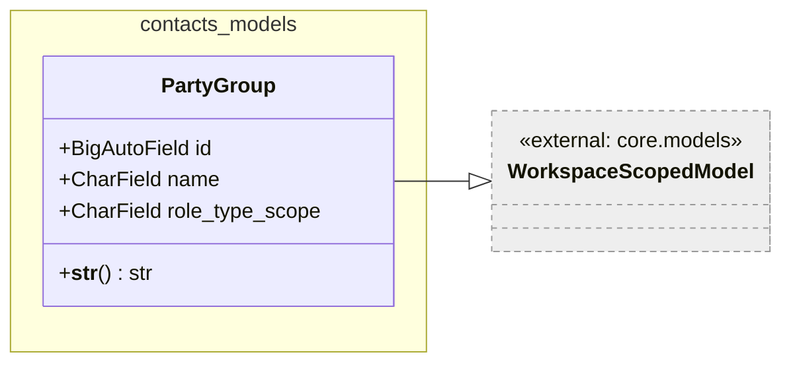

*Caption: Figure 15 — `PartyGroup` as a named collection with an optional role
filter.*

`PartyGroup` is a named collection of parties, stored in `crm_partygroup`. It is
intended for segmentation or categorization (e.g. a mailing list, a price
category).

`role_type_scope` is an optional filter: when set to a value from
`PARTY_ROLE_CHOICES`, it signals that only parties playing that role should be
members of this group. This is a soft constraint documented in the `help_text`
field; enforcement is left to the application layer.

---

### PartyGroupMembership

**Figure 16 — PartyGroupMembership class diagram**

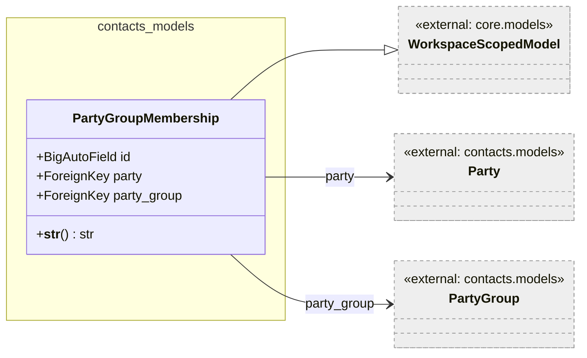

*Caption: Figure 16 — `PartyGroupMembership` as a pure join between a party and
a group.*

`PartyGroupMembership` is a plain many-to-many join table stored in
`crm_partygroupmembership`. It carries no extra columns beyond the two foreign
keys, and both use `on_delete=CASCADE`.

---

### PartyIdentification

**Figure 17 — PartyIdentification class diagram**

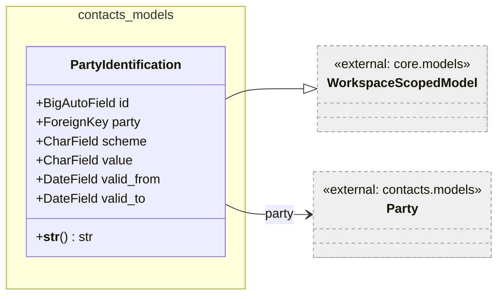

*Caption: Figure 17 — `PartyIdentification` attaching an external identifier to
a party.*

`PartyIdentification` stores external identifiers for a party, one row per
identifier, in `crm_partyidentification`. The `scheme` field selects the
identification standard from `IDENTIFICATION_SCHEME_CHOICES`:

| Scheme | Standard |
|---|---|
| `internal` | Internal system ID |
| `vat` | VAT registration number |
| `uid` | Swiss UID (CHE-xxx.xxx.xxx) |
| `gln` | GS1 Global Location Number |
| `duns` | Dun & Bradstreet DUNS number |
| `lei` | Legal Entity Identifier (ISO 17442) |
| `iban` | International Bank Account Number |

`value` is a free-form string; the maximum length of 128 characters accommodates
all listed schemes. Uniqueness within a scheme is not enforced at the model level.

`valid_from` / `valid_to` allow identifiers to be scoped to a period, which is
relevant for identifiers that change over time (e.g. a UID that changes after a
restructuring).

#### `__str__`

Returns `"{scheme}:{value}"`. Trivial — no flow diagram required.

---

### PartyRole

**Figure 18 — PartyRole class diagram**

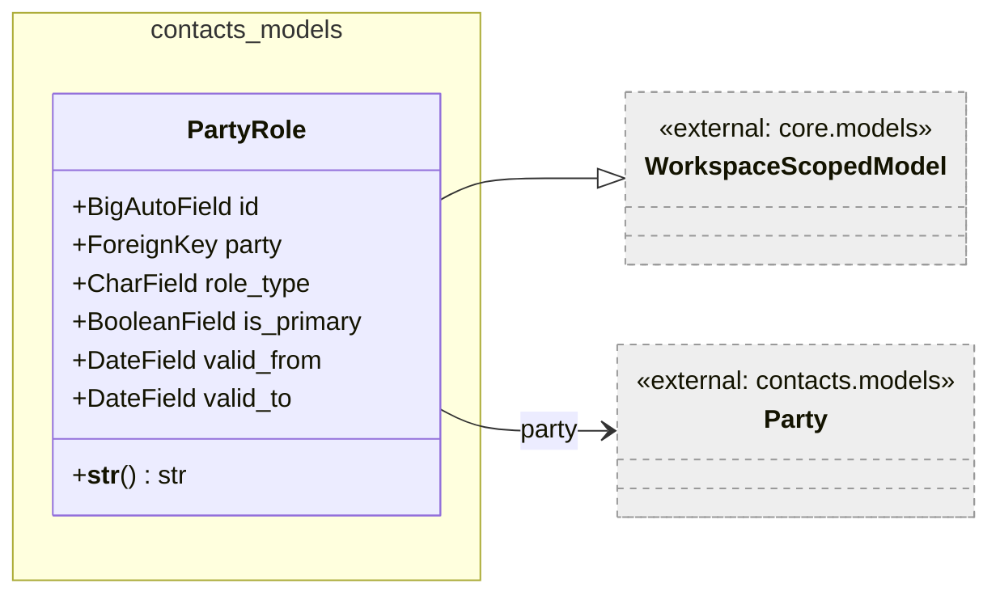

*Caption: Figure 18 — `PartyRole` attaching a typed role to a party.*

`PartyRole` records a business function that a party fulfills, stored in
`crm_partyrole`. A party may hold multiple roles simultaneously (e.g. a company
that is both a customer and a supplier). Each role is a separate row.

`role_type` is drawn from `PARTY_ROLE_CHOICES`: customer, supplier, lead,
prospect, employee, partner, bank, authority. The set of roles a party holds
determines which workflows and documents apply to it in the rest of the
application.

`is_primary` marks the dominant role when a party holds more than one.
`valid_from` and `valid_to` scope the role to a time period (e.g. a lead that
became a customer on a specific date).

---

## Persistent Storage

All models in this package write to a relational database via the Django ORM.
Multi-tenancy is enforced by the `workspace` foreign key inherited from
`WorkspaceScopedModel`. The `WorkspaceAwareManager` (attached as `objects` on
every scoped model) is expected to filter by workspace on all standard querysets,
preventing cross-tenant data leakage.

### Database tables

| Class | Table | Notes |
|---|---|---|
| `Party` | `crm_party` | MTI parent; every `Organization` and `PartyContact` row has a corresponding row here. |
| `Organization` | `crm_organization` | MTI child; joined to `crm_party` on `party_ptr_id`. |
| `PartyContact` | `crm_partycontact` | MTI child; joined to `crm_party` on `party_ptr_id`. |
| `Address` | `crm_address` | Standalone canonical record. |
| `AddressAssignment` | `crm_addressassignment` | Join with purpose and validity window. |
| `CustomerBillingCycle` | `crm_customerbillingcycle` | Reference data; protected from deletion via `PROTECT` on the `Party` FK. |
| `PartyEmail` | `crm_partyemail` | Standalone canonical email record. |
| `EmailAssignment` | `crm_emailassignment` | Join with purpose and validity window. |
| `PhoneNumber` | `crm_phonenumber` | Standalone canonical phone record. |
| `PhoneAssignment` | `crm_phoneassignment` | Join with purpose and validity window. |
| `OrganizationMembership` | `crm_organizationmembership` | Person-to-organization link with title and period. |
| `OrganizationRelationship` | `crm_organizationrelationship` | Organization-to-organization directed edge with type and period. |
| `PartyGroup` | `crm_partygroup` | Named segment / collection. |
| `PartyGroupMembership` | `crm_partygroupmembership` | Many-to-many join between `Party` and `PartyGroup`. |
| `PartyIdentification` | `crm_partyidentification` | External identifiers per scheme. |
| `PartyRole` | `crm_partyrole` | One row per role a party holds. |

### Key constraints and deletion behaviour

- Deleting a `Party` cascades to `AddressAssignment`, `EmailAssignment`,
  `PhoneAssignment`, `PartyGroupMembership`, `PartyIdentification`, and
  `PartyRole`.
- Deleting an `Organization` (MTI child) also deletes the parent `Party` row;
  the cascade from `Party` then deletes all assignment rows.
- Deleting a `CustomerBillingCycle` is blocked (`PROTECT`) as long as any
  `Party` references it via `default_billing_cycle`.
- Deleting a `Party` is blocked (`PROTECT`) as long as any `Party` references the
  same `auth.User` via `last_modified_by`.
- Uniqueness on `(party, role_type)` for `PartyRole` is not enforced at the
  model level; duplicate role rows are possible and must be prevented at the
  application layer.
- Uniqueness on `(party, scheme)` for `PartyIdentification` is not enforced at
  the model level.

### No custom indexes defined

No explicit `indexes` are declared in any `Meta` class within this package.
Database-level performance tuning of foreign-key lookups (e.g. on `party_id`,
`role_type`, `scheme`) is left to database migrations or DBA configuration.

---

## Security

### Assets

| Asset | Description | Security Measure | Assessment of Criticality |
|---|---|---|---|
| `gdpr_consent_date` on `PartyContact` | Records whether a natural person has given GDPR consent. | Stored as a plain `DateField`; access is controlled at the application/API layer, not at the model level. | The field must only be readable and writable by authorized staff. No model-level access restriction is present. |
| `date_of_birth` on `PartyContact` | Personal data — date of birth of a natural person. | Stored as a plain `DateField`; no encryption. | Constitutes personally identifiable information (PII) under GDPR. Access must be restricted by the authorization layer. |
| `email` on `PartyEmail` | Email address — a personal data point. | Stored as plain text in `crm_partyemail`. | PII under GDPR. No model-level encryption or masking. |
| `phone_e164` on `PhoneNumber` | Phone number in E.164 format — a personal data point. | Stored as plain text in `crm_phonenumber`. | PII under GDPR. No model-level encryption or masking. |
| `value` on `PartyIdentification` (scheme `iban`) | Bank account number. | Stored as plain text. | Financial identifier. Exposure outside authorized contexts is a risk. |

No secrets (passwords, API keys, tokens) are stored in any model in this package.
Multi-tenant data isolation relies entirely on the `workspace` FK and
`WorkspaceAwareManager`; if that manager is bypassed (e.g. via `Party._default_manager`
or raw SQL), cross-tenant access is possible.

---

## Design Patterns Used

### Multi-Table Inheritance (MTI)

`Organization` and `PartyContact` each inherit from `Party` using Django's
Multi-Table Inheritance. This creates a concrete table for the parent and one
additional table per subtype. The subtype row references the parent row via
`party_ptr_id` (a one-to-one link on the primary key). This pattern was chosen
to allow polymorphic querying on `Party` while keeping type-specific columns
cleanly separated.

### Assignment (Link) Tables with Validity Windows

Instead of embedding contact details (address, email, phone) as foreign keys
directly on `Party`, the design uses separate canonical records
(`Address`, `PartyEmail`, `PhoneNumber`) joined to parties via assignment tables
(`AddressAssignment`, `EmailAssignment`, `PhoneAssignment`). Each assignment row
carries a `purpose`, an `is_primary` flag, and a validity window
(`valid_from` / `valid_to`). This pattern allows:
- One canonical record to be shared by multiple parties.
- A party to hold multiple addresses / emails / phones, each for a different
  purpose.
- Historical versioning of contact details via overlapping validity windows.

### Multi-Tenancy via Abstract Base Class

All models inherit from `WorkspaceScopedModel`, which adds a `workspace` FK and
replaces the default manager with `WorkspaceAwareManager`. This centralizes
tenant-scoping in one abstract class, making it impossible to accidentally create
a model that escapes the tenancy boundary by forgetting to add a workspace field.

### Role-Based Classification (Open Role List)

Rather than creating separate tables for customers, suppliers, employees, etc.,
a `PartyRole` row with a `role_type` field is used. This allows a party to hold
multiple roles simultaneously and avoids a proliferation of entity types for each
business function. The valid role values are defined as constants in
`core.const.party` and shared across models, admin, and serializers.

---

## External Dependencies

| Requirement | Version/Details | Notes |
|---|---|---|
| Django ORM (`django.db.models`) | As specified in the project's `requirements.txt` or `pyproject.toml` | Provides `Model`, `CharField`, `ForeignKey`, `BigAutoField`, `DateField`, `DateTimeField`, `BooleanField`, `IntegerField`, `EmailField`, `on_delete` constants. |
| `django.utils.translation.gettext` | Bundled with Django | Used for `verbose_name` and `verbose_name_plural` on all models; enables i18n of admin labels. |
| `koalixcrm.core.models.workspace_scoped.WorkspaceScopedModel` | Internal — `core` app | Abstract base providing the `workspace` FK and `WorkspaceAwareManager`. |
| `koalixcrm.core.const.party` | Internal — `core` app | Provides `LANGUAGE_CHOICES`, `LEGAL_FORM_CHOICES`, `ASSIGNMENT_PURPOSE_CHOICES`, `PARTY_ROLE_CHOICES`, `IDENTIFICATION_SCHEME_CHOICES`, `ORG_RELATIONSHIP_CHOICES`. |
| `koalixcrm.core.const.country.COUNTRIES` | Internal — `core` app | Provides the country code list used for `country` and `legal_seat_country` fields. |
| `koalixcrm.core.const.postaladdressprefix.POSTALADDRESSPREFIX` | Internal — `core` app | Provides the salutation prefix choices for `PartyContact.prefix`. |

---

## Appendix

### References

- `koalixcrm/contacts/models/__init__.py` — package namespace and migration note
  regarding legacy model removal (issues #392–#396).
- `koalixcrm/core/const/party.py` — choice constant definitions referenced by
  multiple models in this package.
- `koalixcrm/core/models/workspace_scoped.py` — abstract base class providing
  multi-tenancy support.

### List of Illustrations

| Figure | Title |
|---|---|
| Figure 1 | contacts.models overview — full entity and inheritance graph |
| Figure 2 | Party class diagram |
| Figure 3 | Organization class diagram |
| Figure 4 | PartyContact class diagram |
| Figure 5 | Address class diagram |
| Figure 6 | Address.__str__ flow |
| Figure 7 | AddressAssignment class diagram |
| Figure 8 | CustomerBillingCycle class diagram |
| Figure 9 | PartyEmail class diagram |
| Figure 10 | EmailAssignment class diagram |
| Figure 11 | PhoneNumber class diagram |
| Figure 12 | PhoneAssignment class diagram |
| Figure 13 | OrganizationMembership class diagram |
| Figure 14 | OrganizationRelationship class diagram |
| Figure 15 | PartyGroup class diagram |
| Figure 16 | PartyGroupMembership class diagram |
| Figure 17 | PartyIdentification class diagram |
| Figure 18 | PartyRole class diagram |
