# Low-Level Documentation: Contacts — Views, Serializers, Admin, Management Commands

## Introduction

### Scope

This document covers the implementation of the REST API layer, Django admin
registrations, and management commands of the `koalixcrm.contacts` application.
Specifically, the following source files are described:

| File | Description |
|------|-------------|
| `contacts/views/__init__.py` | Public export list of all ViewSet classes |
| `contacts/views/customer_billing_cycle_view_set.py` | `CustomerBillingCycleViewSet` |
| `contacts/views/party_view_sets.py` | `WorkspaceScopedViewSetMixin` and the 14 Party-model ViewSets |
| `contacts/serializers/__init__.py` | Public export list of all serializer classes |
| `contacts/serializers/customer_billing_cycle_serializer.py` | `OptionCustomerBillingCycleJSONSerializer`, `CustomerBillingCycleJSONSerializer` |
| `contacts/serializers/party_serializers.py` | 15 flat `ModelSerializer` classes for the Party data model |
| `contacts/admin/__init__.py` | Wildcard re-export of admin registrations |
| `contacts/admin/actions.py` | `convert_organizations_to_contacts`, `convert_contacts_to_organizations` bulk admin actions |
| `contacts/admin/customer_billing_cycle_admin.py` | `OptionCustomerBillingCycle` admin class |
| `contacts/admin/party_admin.py` | 14 Party-model admin classes |
| `contacts/management/commands/contacts_backfill_dryrun.py` | `Command` — read-only row-count report before migration |
| `contacts/management/commands/contacts_backfill_reconcile.py` | `Command` — pre-cutover invariant verification |
| `contacts/apps.py` | `ContactsConfig` Django AppConfig |
| `contacts/urls.py` | DRF `DefaultRouter` registration and URL patterns |

### Target Audience

The primary target audience is the software development engineer who needs to
understand, use, modify, or extend the contacts REST API, the Django admin
interface, or the migration support commands.

### Glossary

| Term/Acronym | Full Form | Description |
|--------------|-----------|-------------|
| DRF | Django REST Framework | Python library providing serialization, authentication, viewsets, and routing for REST APIs built on Django. |
| MTI | Multi-Table Inheritance | Django ORM pattern in which a child model gets its own database table linked by a shared primary key to the parent table. `Organization` and `PartyContact` both extend `Party` via MTI. |
| Party | — | Abstract legal entity that can be either an organization or a natural person. The central entity of the v2.0.0 contacts data model. |
| ViewSet | — | DRF class that combines CRUD operations (list, retrieve, create, update, destroy) into a single class, registered with a DRF Router. |
| Workspace | — | Multi-tenancy scope unit in koalixcrm. Every workspace-scoped model row belongs to exactly one workspace. |
| Active Workspace | — | The workspace resolved from the current HTTP request, stored as `request.active_workspace` by middleware. |
| Superuser | — | Django user with `is_superuser=True`, exempt from workspace filtering. |
| Backfill | — | One-time data migration that creates Party/Organization/PartyContact rows from the legacy contacts schema. Described in `contacts.0005_backfill_party`. |
| Cutover | — | The irreversible step in the v1.14.0 → v2.0.0 upgrade that drops legacy tables. |
| E164 | E.164 | ITU-T standard for international phone number formatting (e.g. `+41791234567`). |
| GDPR | General Data Protection Regulation | EU privacy regulation; `gdpr_consent_date` tracks when a natural person consented to data processing. |

---

## Detailed Component

### Application Configuration — `ContactsConfig`

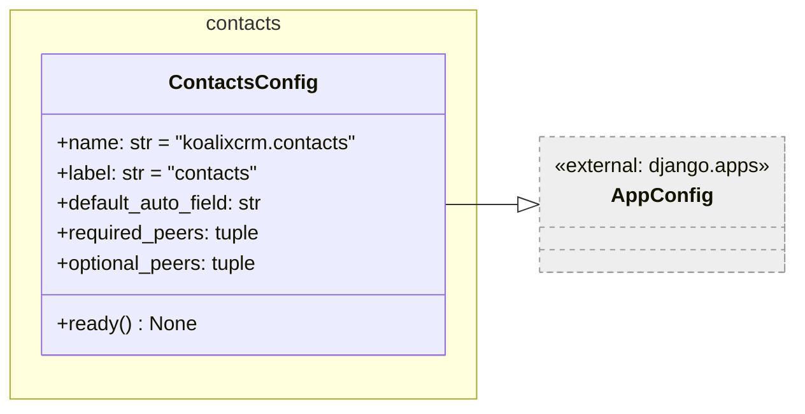

**Figure 1 — ContactsConfig class diagram**

`ContactsConfig` is the Django AppConfig for the `koalixcrm.contacts` application.
It sets `default_auto_field` to `BigAutoField` so all auto-generated primary keys
use 64-bit integers. It declares `required_peers = ('koalixcrm.core',)`, meaning
the `koalixcrm.core` application must be installed; `optional_peers` is empty.

The `ready()` method — called by Django once all apps are loaded — registers a
peer-check hook via `koalixcrm.core.app_checks.register_peer_check(self)`. This
hook verifies at startup that every entry in `required_peers` is present in
`INSTALLED_APPS`.

---

### URL Configuration — `urls.py`

`urls.py` builds the contacts REST API URL patterns using DRF's `DefaultRouter`.
The router registers 16 ViewSets and produces the standard DRF URL pattern set
(list, detail, format suffixes) for each. The base path is:

```text
/koalixcrm_contacts/api/v1/<workspace_id>/
```

The module comment states that this file is currently inert — it is imported but
not yet wired into `projectsettings/urls.py`. It becomes active once change
request CR-R2 of CR-002 lands.

| Router prefix | ViewSet | Basename |
|---------------|---------|----------|
| `customer-billing-cycles` | `CustomerBillingCycleViewSet` | `customer-billing-cycle` |
| `parties` | `PartyViewSet` | `party` |
| `organizations` | `OrganizationViewSet` | `organization` |
| `party-contacts` | `PartyContactViewSet` | `party-contact` |
| `party-identifications` | `PartyIdentificationViewSet` | `party-identification` |
| `party-roles` | `PartyRoleViewSet` | `party-role` |
| `organization-memberships` | `OrganizationMembershipViewSet` | `organization-membership` |
| `organization-relationships` | `OrganizationRelationshipViewSet` | `organization-relationship` |
| `addresses` | `AddressViewSet` | `address` |
| `address-assignments` | `AddressAssignmentViewSet` | `address-assignment` |
| `phone-numbers` | `PhoneNumberViewSet` | `phone-number` |
| `phone-assignments` | `PhoneAssignmentViewSet` | `phone-assignment` |
| `party-emails` | `PartyEmailViewSet` | `party-email` |
| `email-assignments` | `EmailAssignmentViewSet` | `email-assignment` |
| `party-groups` | `PartyGroupViewSet` | `party-group` |
| `party-group-memberships` | `PartyGroupMembershipViewSet` | `party-group-membership` |

Note: `urls.py` imports the ViewSets from `koalixcrm.contacts_api_py.contacts_api`
rather than from `koalixcrm.contacts.views` directly. This indirection path is
separate from the classes defined in the `views/` package; the ViewSet
implementations documented below are in `contacts/views/`.

---

### ViewSets

#### `WorkspaceScopedViewSetMixin`

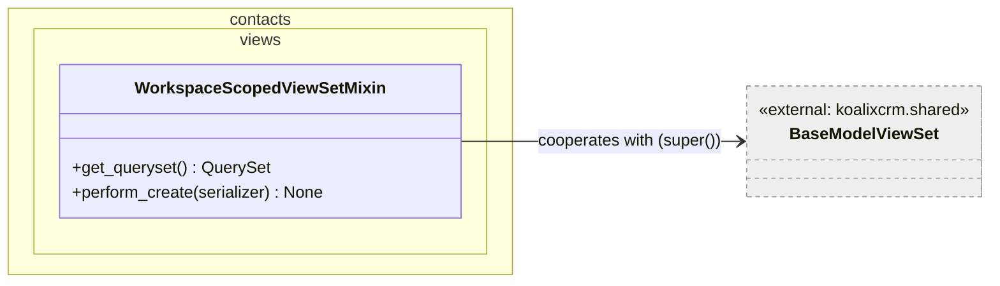

**Figure 2 — WorkspaceScopedViewSetMixin class diagram**

`WorkspaceScopedViewSetMixin` is a Python mixin (not a standalone ViewSet) that
implements two cross-cutting behaviours shared by all Party-model ViewSets:
workspace-scoped queryset filtering and workspace-stamping on object creation. It
calls `super()` cooperatively so it can be combined with `BaseModelViewSet` via
Python's MRO.

**`get_queryset() -> QuerySet`**

Retrieves the base queryset from `super()`, then applies workspace filtering.

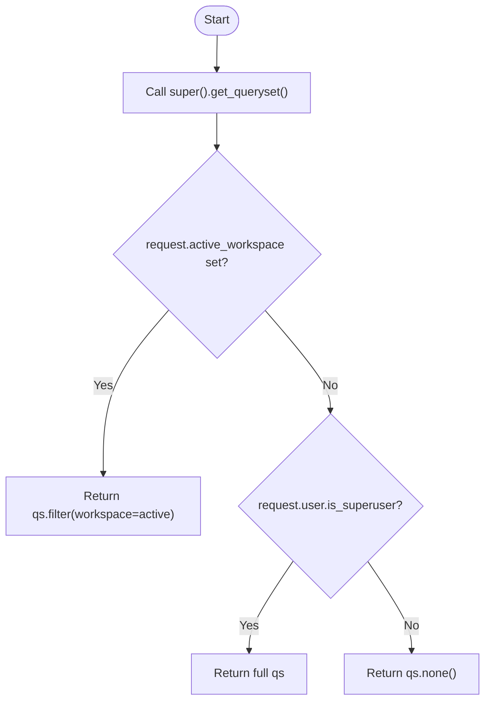

**Figure 3 — WorkspaceScopedViewSetMixin.get_queryset flow**

A non-superuser request without an active workspace resolves to an empty queryset,
effectively hiding all records. Superuser requests without an active workspace see
all records across all workspaces.

**`perform_create(serializer: BaseSerializer) -> None`**

Called by DRF when a POST request creates a new object. It stamps the
`workspace` field before saving.

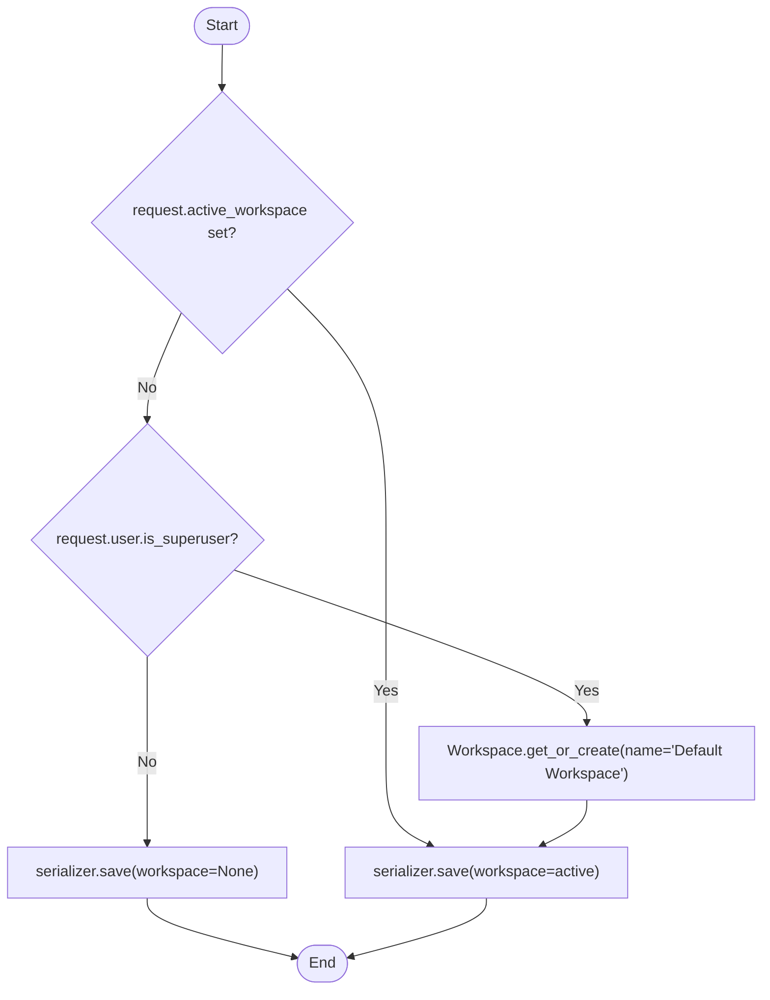

**Figure 4 — WorkspaceScopedViewSetMixin.perform_create flow**

When a superuser creates an object without an active workspace, the method
ensures a `Default Workspace` exists (creating it if needed) and attaches the new
object to it. A non-superuser call without an active workspace saves with
`workspace=None`; this case is prevented in practice by `get_queryset` returning
`qs.none()`, but the create path does not explicitly block it.

---

#### `CustomerBillingCycleViewSet`

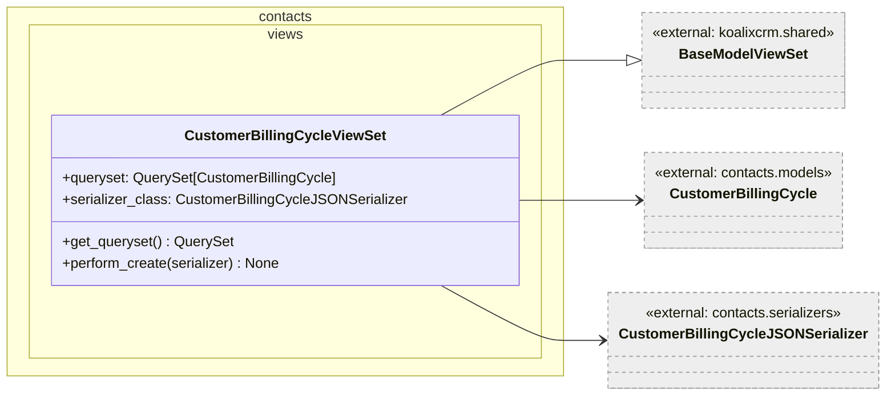

**Figure 5 — CustomerBillingCycleViewSet class diagram**

`CustomerBillingCycleViewSet` exposes the `CustomerBillingCycle` model via the
REST API. Unlike the Party-model ViewSets it does not use
`WorkspaceScopedViewSetMixin`; instead it directly re-implements the same
workspace-scoping logic inline within `get_queryset` and `perform_create`. The
logic is identical in behaviour to the mixin variants.

**`get_queryset() -> QuerySet[CustomerBillingCycle]`**

Calls `super().get_queryset()` then applies the same workspace-filtering pattern:
active workspace → filter; no active workspace + superuser → full queryset; no
active workspace + non-superuser → empty queryset.

**`perform_create(serializer: BaseSerializer) -> None`**

Same pattern as `WorkspaceScopedViewSetMixin.perform_create`: stamps workspace
on save, creating a `Default Workspace` if the request has none and the user is a
superuser.

---

#### Party-Model ViewSets (14 classes)

All 14 classes in `party_view_sets.py` follow the same structural pattern: they
mix in `WorkspaceScopedViewSetMixin` before `BaseModelViewSet` and declare a
`queryset` and `serializer_class`. No additional methods are defined — the full
behaviour is inherited.

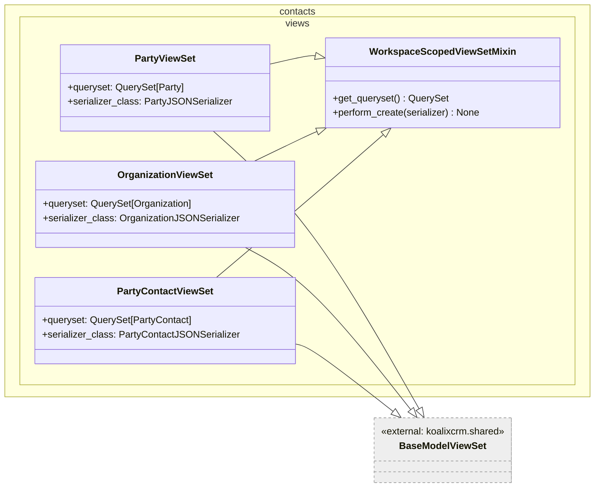

**Figure 6 — Core Party ViewSet hierarchy (representative subset)**

The remaining 11 ViewSets follow the identical pattern. They are listed below with
their model and serializer assignments:

| ViewSet | Model | Serializer |
|---------|-------|------------|
| `PartyViewSet` | `Party` | `PartyJSONSerializer` |
| `OrganizationViewSet` | `Organization` | `OrganizationJSONSerializer` |
| `PartyContactViewSet` | `PartyContact` | `PartyContactJSONSerializer` |
| `PartyIdentificationViewSet` | `PartyIdentification` | `PartyIdentificationJSONSerializer` |
| `PartyRoleViewSet` | `PartyRole` | `PartyRoleJSONSerializer` |
| `OrganizationMembershipViewSet` | `OrganizationMembership` | `OrganizationMembershipJSONSerializer` |
| `OrganizationRelationshipViewSet` | `OrganizationRelationship` | `OrganizationRelationshipJSONSerializer` |
| `AddressViewSet` | `Address` | `AddressJSONSerializer` |
| `AddressAssignmentViewSet` | `AddressAssignment` | `AddressAssignmentJSONSerializer` |
| `PhoneNumberViewSet` | `PhoneNumber` | `PhoneNumberJSONSerializer` |
| `PhoneAssignmentViewSet` | `PhoneAssignment` | `PhoneAssignmentJSONSerializer` |
| `PartyEmailViewSet` | `PartyEmail` | `PartyEmailJSONSerializer` |
| `EmailAssignmentViewSet` | `EmailAssignment` | `EmailAssignmentJSONSerializer` |
| `PartyGroupViewSet` | `PartyGroup` | `PartyGroupJSONSerializer` |
| `PartyGroupMembershipViewSet` | `PartyGroupMembership` | `PartyGroupMembershipJSONSerializer` |

---

### Serializers

#### `OptionCustomerBillingCycleJSONSerializer`

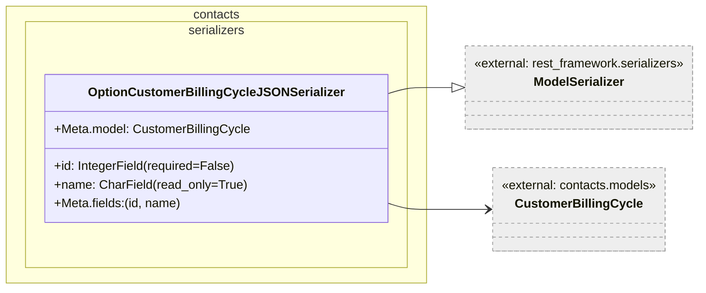

**Figure 7 — OptionCustomerBillingCycleJSONSerializer class diagram**

A lightweight serializer intended for use in dropdown/option contexts (e.g. a
foreign-key select list). It exposes only `id` and `name`. The `id` field is
declared with `required=False` so that inline references from other serializers
can omit it when creating new objects. The `name` field is read-only.

---

#### `CustomerBillingCycleJSONSerializer`

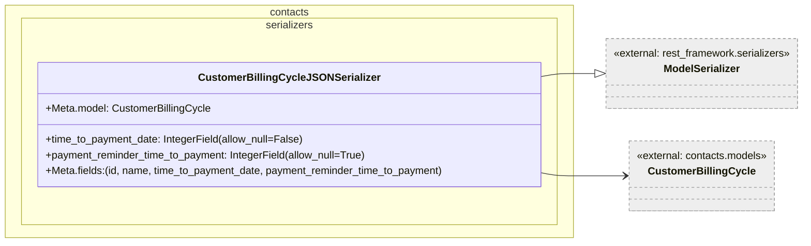

**Figure 8 — CustomerBillingCycleJSONSerializer class diagram**

The full CRUD serializer for `CustomerBillingCycle`. It exposes all four fields
of the model. `time_to_payment_date` is declared as non-nullable (`allow_null=False`),
enforcing that a payment due date must always be set. `payment_reminder_time_to_payment`
is nullable, accommodating billing cycles that do not send reminders.

---

#### Party-Model Serializers (15 classes)

All 15 Party-model serializers in `party_serializers.py` are flat
`ModelSerializer` subclasses. The module comment explicitly states that nested
or custom `create`/`update` behaviour is deferred. Relationships to other models
are serialized as primary-key integers.

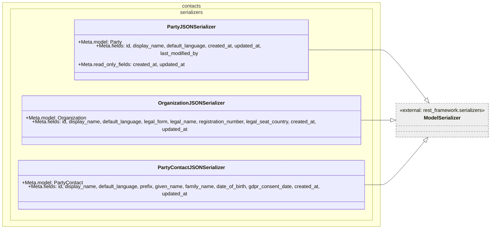

**Figure 9 — Core Party serializers (representative subset)**

The full list of serializers and their exposed fields:

| Serializer | Model | Fields (besides `id`) |
|------------|-------|----------------------|
| `PartyJSONSerializer` | `Party` | `display_name`, `default_language`, `created_at`*, `updated_at`*, `last_modified_by` |
| `OrganizationJSONSerializer` | `Organization` | `display_name`, `default_language`, `legal_form`, `legal_name`, `registration_number`, `legal_seat_country`, `created_at`*, `updated_at`* |
| `PartyContactJSONSerializer` | `PartyContact` | `display_name`, `default_language`, `prefix`, `given_name`, `family_name`, `date_of_birth`, `gdpr_consent_date`, `created_at`*, `updated_at`* |
| `PartyIdentificationJSONSerializer` | `PartyIdentification` | `party`, `scheme`, `value`, `valid_from`, `valid_to` |
| `PartyRoleJSONSerializer` | `PartyRole` | `party`, `role_type`, `is_primary`, `valid_from`, `valid_to` |
| `OrganizationMembershipJSONSerializer` | `OrganizationMembership` | `contact`, `organization`, `title`, `position`, `is_primary`, `valid_from`, `valid_to` |
| `OrganizationRelationshipJSONSerializer` | `OrganizationRelationship` | `parent`, `child`, `relationship_type`, `valid_from`, `valid_to` |
| `AddressJSONSerializer` | `Address` | `street`, `number`, `additional_address_line_1/2/3`, `zip_code`, `town`, `state`, `country`, `subdivision_code` |
| `AddressAssignmentJSONSerializer` | `AddressAssignment` | `party`, `address`, `purpose`, `is_primary`, `valid_from`, `valid_to` |
| `PhoneNumberJSONSerializer` | `PhoneNumber` | `phone_e164` |
| `PhoneAssignmentJSONSerializer` | `PhoneAssignment` | `party`, `phone`, `purpose`, `is_primary`, `valid_from`, `valid_to` |
| `PartyEmailJSONSerializer` | `PartyEmail` | `email` |
| `EmailAssignmentJSONSerializer` | `EmailAssignment` | `party`, `email`, `purpose`, `is_primary`, `valid_from`, `valid_to` |
| `PartyGroupJSONSerializer` | `PartyGroup` | `name`, `role_type_scope` |
| `PartyGroupMembershipJSONSerializer` | `PartyGroupMembership` | `party`, `party_group` |

Fields marked with `*` are declared `read_only_fields`.

---

### Admin

#### `OptionCustomerBillingCycle` (customer_billing_cycle_admin.py)

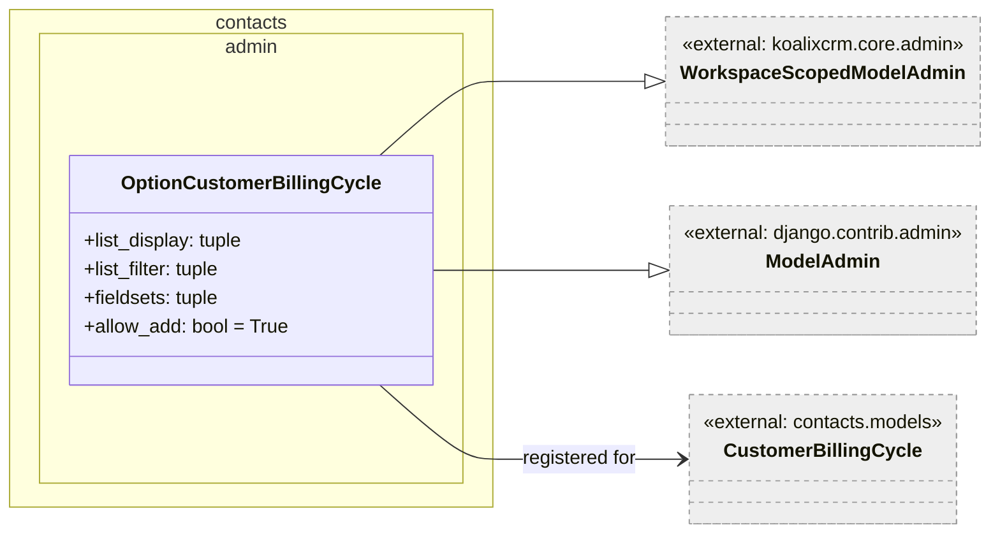

**Figure 10 — OptionCustomerBillingCycle admin class diagram**

`OptionCustomerBillingCycle` is registered with `admin.site.register` (not the
`@admin.register` decorator) and administers the `CustomerBillingCycle` model.
The list view displays `id`, `name`, `time_to_payment_date`, and
`payment_reminder_time_to_payment`. Workspace filtering is applied by the
`WorkspaceScopedModelAdmin` mixin. The single fieldset groups the three editable
fields. `allow_add = True` enables the "Add" button.

---

#### Party-Model Admin Classes (party_admin.py)

All 14 admin classes in `party_admin.py` use the `@admin.register` decorator and
extend both `WorkspaceScopedModelAdmin` and `admin.ModelAdmin`. They provide
`list_display`, `list_filter`, and optionally `search_fields` and `actions`
configurations. No custom `fieldsets`, inlines, or overriding methods are defined
at this stage; the module comment states that full admin UX is deferred to a later
PR.

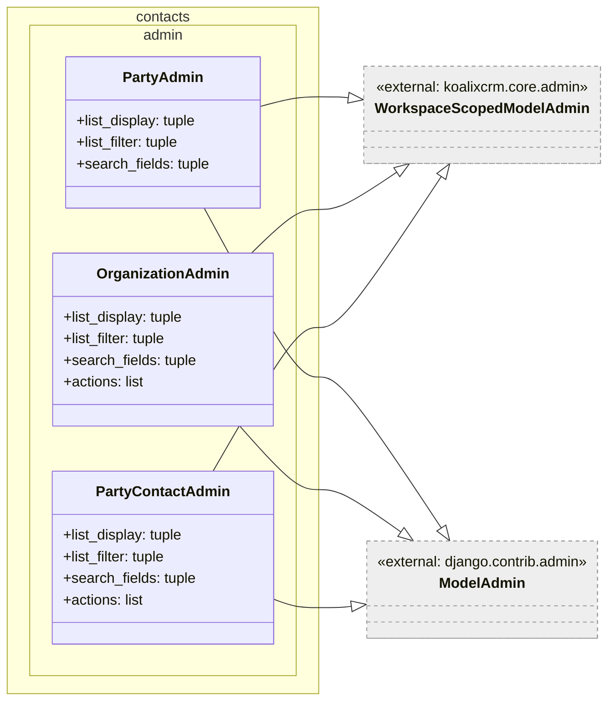

**Figure 11 — Representative Party admin classes**

The complete list of admin registrations, their `list_display` fields, and any
special configuration:

| Admin class | Model | Notable configuration |
|-------------|-------|-----------------------|
| `PartyAdmin` | `Party` | `search_fields = (display_name,)` |
| `OrganizationAdmin` | `Organization` | `search_fields` on `display_name`, `legal_name`, `registration_number`; `actions = [convert_organizations_to_contacts]` |
| `PartyContactAdmin` | `PartyContact` | `search_fields` on `display_name`, `given_name`, `family_name`; `actions = [convert_contacts_to_organizations]` |
| `PartyIdentificationAdmin` | `PartyIdentification` | `list_filter` on `scheme` and `workspace` |
| `PartyRoleAdmin` | `PartyRole` | `list_filter` on `role_type`, `is_primary`, `workspace` |
| `OrganizationMembershipAdmin` | `OrganizationMembership` | `list_filter` on `is_primary`, `workspace` |
| `OrganizationRelationshipAdmin` | `OrganizationRelationship` | `list_filter` on `relationship_type`, `workspace` |
| `AddressAdmin` | `Address` | `search_fields` on `street`, `zip_code`, `town` |
| `AddressAssignmentAdmin` | `AddressAssignment` | `list_filter` on `purpose`, `is_primary`, `workspace` |
| `PhoneNumberAdmin` | `PhoneNumber` | `search_fields = (phone_e164,)` |
| `PhoneAssignmentAdmin` | `PhoneAssignment` | `list_filter` on `purpose`, `is_primary`, `workspace` |
| `PartyEmailAdmin` | `PartyEmail` | `search_fields = (email,)` |
| `EmailAssignmentAdmin` | `EmailAssignment` | `list_filter` on `purpose`, `is_primary`, `workspace` |
| `PartyGroupAdmin` | `PartyGroup` | `list_filter` on `role_type_scope`, `workspace`; `search_fields = (name,)` |
| `PartyGroupMembershipAdmin` | `PartyGroupMembership` | `list_filter = (workspace,)` |

---

#### `WorkspaceScopedModelAdmin` (referenced base — `koalixcrm.core.admin`)

`WorkspaceScopedModelAdmin` is defined in `koalixcrm/core/admin/workspace_scoped_admin.py`
and is documented here because it is the shared base for all contacts admin classes.
It overrides three Django admin methods:

**`get_queryset(request) -> QuerySet`**

Returns the full queryset for superusers. For all other users, if an active
workspace is set on the request, it filters by `workspace=active`. If no active
workspace is set for a non-superuser, it returns the unfiltered queryset (the
base queryset as-is), which in practice is controlled by other middleware.

**`formfield_for_foreignkey(db_field, request, **kwargs) -> Any`**

When rendering a form, if the related model has a `workspace` attribute and an
active workspace is present on the request, the FK dropdown is filtered to only
show objects belonging to that workspace.

**`save_model(request, obj, form, change) -> None`**

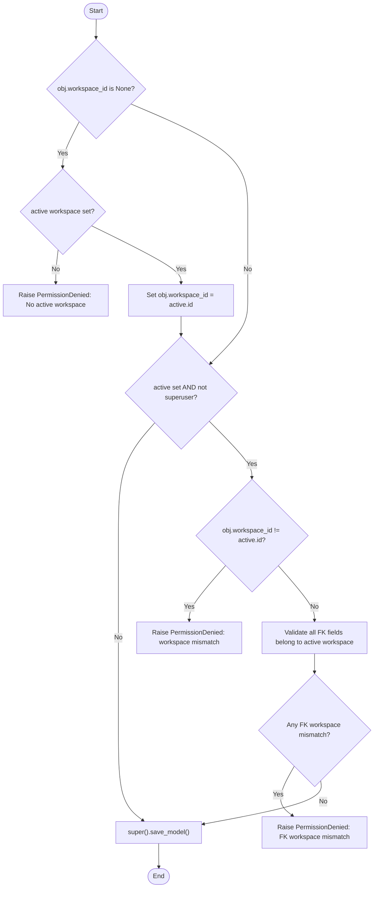

**Figure 12 — WorkspaceScopedModelAdmin.save_model flow**

This method enforces two invariants: (1) every saved object must be assigned a
workspace; (2) non-superusers may not save an object whose workspace or any
referenced FK workspace does not match the active workspace on the request.

---

### Admin Bulk Actions (actions.py)

#### `_split_display_name` (internal helper)

`_split_display_name(display_name: str | None) -> tuple[str, str]`

Splits a `display_name` string into `(given_name, family_name)` on the first
whitespace. If the input is `None` or empty, it returns `('', '')`. If the name
has no whitespace (single token), it returns `('', full_string)`. This is a
best-effort heuristic; the module comment explicitly notes that the admin can
refine the result manually.

---

#### `convert_organizations_to_contacts`

A Django admin bulk action registered with `@admin.action`. It appears on the
`OrganizationAdmin` changelist and converts selected `Organization` rows to
`PartyContact` rows without deleting or re-creating the parent `Party` row,
preserving all attached Party-level data (roles, addresses, phones, emails,
identifications, and document FKs).

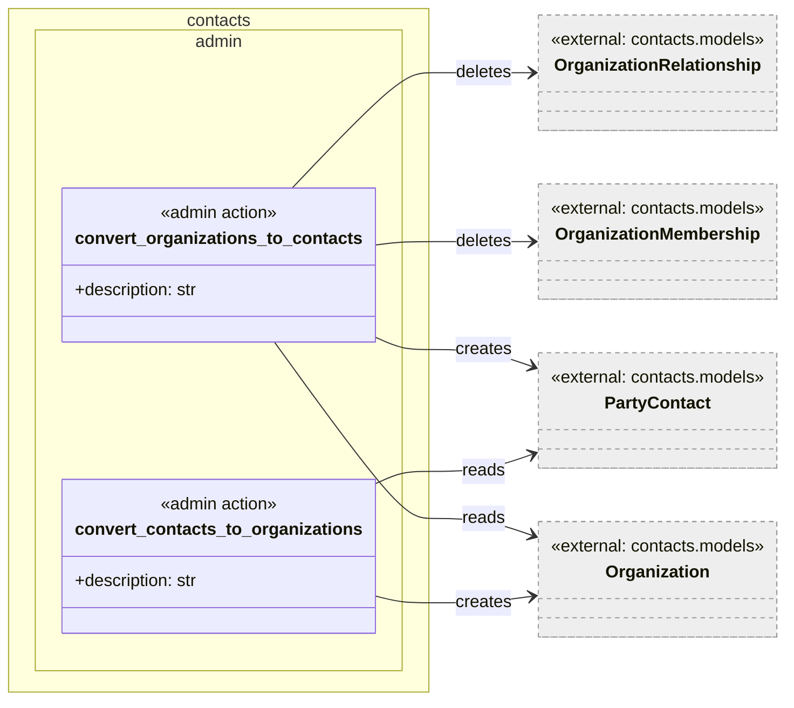

**Figure 13 — Admin bulk action relationships**

**Flow of `convert_organizations_to_contacts`:**

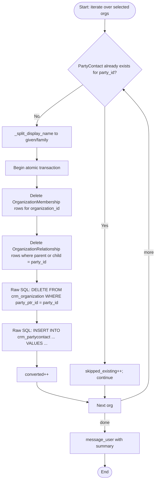

**Figure 14 — convert_organizations_to_contacts flow**

The action uses raw SQL for the MTI child-row swap rather than the ORM, because
calling `Organization.delete()` via the ORM would cascade onto the parent `Party`
row and destroy all attached data. The raw DELETE + INSERT swaps only the MTI child
table entry. `OrganizationMembership` and `OrganizationRelationship` rows are
removed because they are semantically meaningless for a natural person.

---

#### `convert_contacts_to_organizations`

A Django admin bulk action registered with `@admin.action`. It appears on the
`PartyContactAdmin` changelist and performs the inverse conversion: `PartyContact`
→ `Organization`. It uses the same raw-SQL MTI swap pattern.

**Flow of `convert_contacts_to_organizations`:**

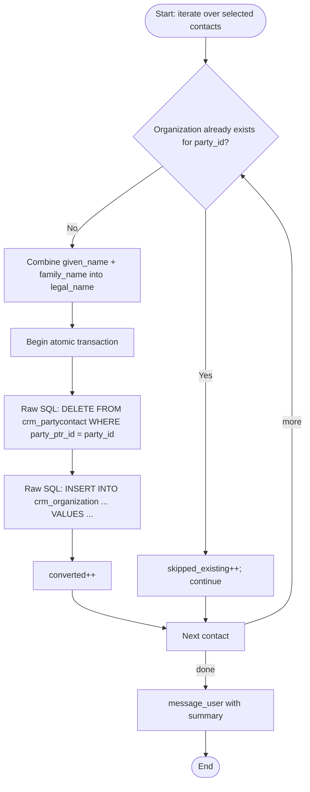

**Figure 15 — convert_contacts_to_organizations flow**

The resulting `Organization` row is populated with `legal_name` derived from the
contact's `given_name` and `family_name`. The parent `Party.display_name` is left
unchanged.

---

### Management Commands

#### `contacts_backfill_dryrun` — `Command`

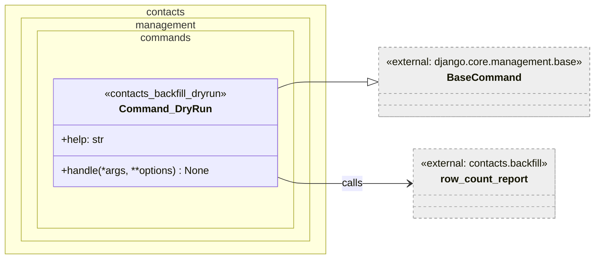

**Figure 16 — contacts_backfill_dryrun Command class diagram**

This management command is a read-only diagnostic tool. It calls
`koalixcrm.contacts.backfill.row_count_report(apps)` and prints a formatted
table to `stdout` showing, for each entity type involved in the Party backfill,
how many rows are expected and how many already exist.

**`handle(*args, **options) -> None`**

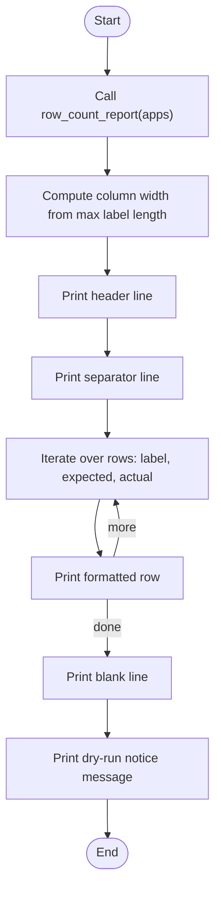

**Figure 17 — contacts_backfill_dryrun.handle flow**

The command writes nothing to the database. It is intended to be run on a
production-sized snapshot before applying migration `contacts.0005_backfill_party`,
to give operators visibility into the expected data volume. The final output line
explicitly reminds the operator that no rows were written.

---

#### `contacts_backfill_reconcile` — `Command`

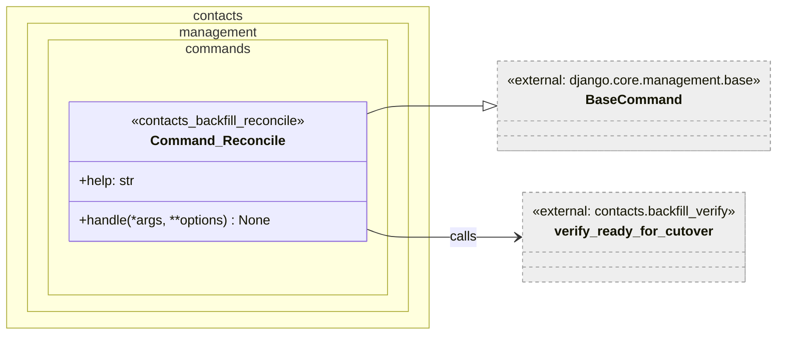

**Figure 18 — contacts_backfill_reconcile Command class diagram**

This management command is a pre-cutover verification tool. It calls
`koalixcrm.contacts.backfill_verify.verify_ready_for_cutover(apps, raise_on_failure=False)`
and prints the result of each invariant check. If any invariant fails the command
exits with status 1 (non-zero), blocking deployment automation from proceeding.

The same verification logic is also executed non-interactively inside migration
`contacts.0006_verify_ready_for_cutover`. This command is the operator-facing view
of that same logic.

**`handle(*args, **options) -> None`**

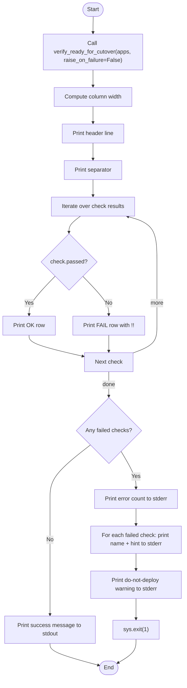

**Figure 19 — contacts_backfill_reconcile.handle flow**

The command uses `self.stdout` for tabular output and `self.style.ERROR` with
`self.stderr` for failure messages, conforming to Django management command
conventions. The non-zero exit via `sys.exit(1)` is intentional: it enables CI
pipelines and deploy scripts to treat a failed verification as a hard stop.

---

## Access to External Interfaces

### REST API Endpoints

Every contacts ViewSet is backed by `BaseModelViewSet`, which inherits from DRF's
`ModelViewSet`. The `DefaultRouter` registration in `urls.py` exposes the following
standard HTTP operations for each registered prefix:

| HTTP method | Action | URL pattern |
|-------------|--------|-------------|
| `GET` | list | `/<prefix>/` |
| `POST` | create | `/<prefix>/` |
| `GET` | retrieve | `/<prefix>/{id}/` |
| `PUT` | update | `/<prefix>/{id}/` |
| `PATCH` | partial_update | `/<prefix>/{id}/` |
| `DELETE` | destroy | `/<prefix>/{id}/` |

All 16 prefixes from the router table in the URL Configuration section above are
exposed with this full set of operations.

The base URL is:

```text
/koalixcrm_contacts/api/v1/<workspace_id>/
```

Note: the URL configuration is currently not wired into the project's root
`urls.py` and is therefore inert in production until CR-R2 of CR-002 lands.

### Django Admin

| Model | Admin class | Admin URL prefix |
|-------|-------------|-----------------|
| `CustomerBillingCycle` | `OptionCustomerBillingCycle` | `contacts/customerbillingcycle/` |
| `Party` | `PartyAdmin` | `contacts/party/` |
| `Organization` | `OrganizationAdmin` | `contacts/organization/` |
| `PartyContact` | `PartyContactAdmin` | `contacts/partycontact/` |
| `PartyIdentification` | `PartyIdentificationAdmin` | `contacts/partyidentification/` |
| `PartyRole` | `PartyRoleAdmin` | `contacts/partyrole/` |
| `OrganizationMembership` | `OrganizationMembershipAdmin` | `contacts/organizationmembership/` |
| `OrganizationRelationship` | `OrganizationRelationshipAdmin` | `contacts/organizationrelationship/` |
| `Address` | `AddressAdmin` | `contacts/address/` |
| `AddressAssignment` | `AddressAssignmentAdmin` | `contacts/addressassignment/` |
| `PhoneNumber` | `PhoneNumberAdmin` | `contacts/phonenumber/` |
| `PhoneAssignment` | `PhoneAssignmentAdmin` | `contacts/phoneassignment/` |
| `PartyEmail` | `PartyEmailAdmin` | `contacts/partyemail/` |
| `EmailAssignment` | `EmailAssignmentAdmin` | `contacts/emailassignment/` |
| `PartyGroup` | `PartyGroupAdmin` | `contacts/partygroup/` |
| `PartyGroupMembership` | `PartyGroupMembershipAdmin` | `contacts/partygroupmembership/` |

### External Module Dependencies (management commands)

| Interface | Caller | Type of call | Nature |
|-----------|--------|--------------|--------|
| `contacts.backfill.row_count_report` | `contacts_backfill_dryrun` | Function call | Read-only; queries legacy and new tables |
| `contacts.backfill_verify.verify_ready_for_cutover` | `contacts_backfill_reconcile` | Function call | Read-only; checks row-count invariants |
| `django.apps.apps` | Both commands | In-process registry | Accessed as Django app registry argument |

---

## Security

### Permission Classes on ViewSets

`BaseModelViewSet` (the base class of all contacts ViewSets) declares:

```python
permission_classes = [IsAuthenticated, ModelPermissionsWithListView]
```

`IsAuthenticated` ensures that unauthenticated requests are rejected with HTTP 401
before any view logic runs. `ModelPermissionsWithListView` extends DRF's
`DjangoModelPermissions` to additionally require `view` permission for list
endpoints (standard `DjangoModelPermissions` only checks write permissions on POST/
PUT/PATCH/DELETE, leaving list endpoints unrestricted for authenticated users).

No per-ViewSet permission override is present; all contacts endpoints use the same
permission baseline.

### Workspace Isolation

The workspace-scoping logic in `WorkspaceScopedViewSetMixin.get_queryset` and
`CustomerBillingCycleViewSet.get_queryset` ensures that non-superuser requests
cannot read data outside their active workspace. A non-superuser request without
an active workspace receives an empty queryset for all contacts endpoints.

The `WorkspaceScopedModelAdmin.save_model` method enforces workspace integrity on
write: it blocks saving objects whose workspace field or referenced FK workspaces
do not match the active workspace on the request.

### Assets

| Asset | Description | Security Measure | Assessment of Criticality |
|-------|-------------|------------------|---------------------------|
| Active workspace identity | The `request.active_workspace` attribute determines data scope | Set by middleware from session/token data; ViewSets do not set it themselves | Uncritical — middleware responsibility |
| GDPR consent date | `gdpr_consent_date` on `PartyContact` exposed via API and admin | No special encryption; stored in database; access gated by `IsAuthenticated` + `ModelPermissionsWithListView` | Uncritical at this layer — access control is the protection |

---

## Design Patterns Used

### Mixin for Cross-Cutting Queryset Behaviour

`WorkspaceScopedViewSetMixin` implements the DRF cooperative multiple-inheritance
pattern. It calls `super().get_queryset()` and `super().perform_create()`, allowing
it to be composed with any `ModelViewSet` subclass via Python's MRO. All 14
Party-model ViewSets use the `(WorkspaceScopedViewSetMixin, BaseModelViewSet)`
combination.

### Template Method (BaseModelViewSet)

`BaseModelViewSet` defines the invariant parts of ViewSet behaviour (authentication,
permissions, filter backends) and leaves the variable parts (`queryset`,
`serializer_class`, `get_queryset`, `perform_create`) to subclasses.

### Raw SQL for MTI Child-Row Swap (admin actions)

The admin bulk actions deliberately bypass the ORM for the MTI child-table swap
(`DELETE` + `INSERT` on `crm_organization` / `crm_partycontact`). This is a
conscious application of the repository anti-pattern avoidance: using the ORM's
`delete()` on an MTI child would cascade to the parent, destroying data. The raw
SQL confines the operation to the child table only.

### Django Management Command as Operator Tool

Both management commands wrap library functions (`row_count_report`,
`verify_ready_for_cutover`) that are also called from migrations. The command
layer adds human-friendly formatting and, in the case of `contacts_backfill_reconcile`,
a non-zero exit code so that CI pipelines and deploy scripts can treat failures
as hard stops.

---

## External Dependencies

| Requirement | Version/Details | Notes |
|-------------|-----------------|-------|
| Django | ≥ 3.2 (exact version from project `requirements.txt`) | `BaseCommand`, `ModelAdmin`, `admin.register`, `transaction.atomic`, `connection.cursor` |
| Django REST Framework | ≥ 3.14 (exact version from project `requirements.txt`) | `ModelSerializer`, `ModelViewSet`, `DefaultRouter`, `IsAuthenticated`, `SearchFilter`, `OrderingFilter` |
| `koalixcrm.shared.base_model_view_set` | Internal | `BaseModelViewSet` — provides authentication and permission defaults |
| `koalixcrm.shared.permissions` | Internal | `ModelPermissionsWithListView` |
| `koalixcrm.core.admin.workspace_scoped_admin` | Internal | `WorkspaceScopedModelAdmin` mixin |
| `koalixcrm.core.models.workspace` | Internal | `Workspace` model — imported lazily inside `perform_create` |
| `koalixcrm.contacts.backfill` | Internal | `row_count_report` function used by `contacts_backfill_dryrun` |
| `koalixcrm.contacts.backfill_verify` | Internal | `verify_ready_for_cutover` function used by `contacts_backfill_reconcile` |
| `koalixcrm.core.app_checks` | Internal | `register_peer_check` called from `ContactsConfig.ready()` |

---

## Appendix

### References

- DRF ViewSets: <https://www.django-rest-framework.org/api-guide/viewsets/>
- DRF Routers: <https://www.django-rest-framework.org/api-guide/routers/>
- DRF Serializers: <https://www.django-rest-framework.org/api-guide/serializers/>
- Django admin actions: <https://docs.djangoproject.com/en/stable/ref/contrib/admin/actions/>
- Django management commands: <https://docs.djangoproject.com/en/stable/howto/custom-management-commands/>
- Django Multi-Table Inheritance: <https://docs.djangoproject.com/en/stable/topics/db/models/#multi-table-inheritance>

### List of Illustrations

| Figure | Title | Section |
|--------|-------|---------|
| Figure 1 | ContactsConfig class diagram | Application Configuration |
| Figure 2 | WorkspaceScopedViewSetMixin class diagram | ViewSets |
| Figure 3 | WorkspaceScopedViewSetMixin.get_queryset flow | ViewSets |
| Figure 4 | WorkspaceScopedViewSetMixin.perform_create flow | ViewSets |
| Figure 5 | CustomerBillingCycleViewSet class diagram | ViewSets |
| Figure 6 | Core Party ViewSet hierarchy | ViewSets |
| Figure 7 | OptionCustomerBillingCycleJSONSerializer class diagram | Serializers |
| Figure 8 | CustomerBillingCycleJSONSerializer class diagram | Serializers |
| Figure 9 | Core Party serializers | Serializers |
| Figure 10 | OptionCustomerBillingCycle admin class diagram | Admin |
| Figure 11 | Representative Party admin classes | Admin |
| Figure 12 | WorkspaceScopedModelAdmin.save_model flow | Admin |
| Figure 13 | Admin bulk action relationships | Admin Bulk Actions |
| Figure 14 | convert_organizations_to_contacts flow | Admin Bulk Actions |
| Figure 15 | convert_contacts_to_organizations flow | Admin Bulk Actions |
| Figure 16 | contacts_backfill_dryrun Command class diagram | Management Commands |
| Figure 17 | contacts_backfill_dryrun.handle flow | Management Commands |
| Figure 18 | contacts_backfill_reconcile Command class diagram | Management Commands |
| Figure 19 | contacts_backfill_reconcile.handle flow | Management Commands |
