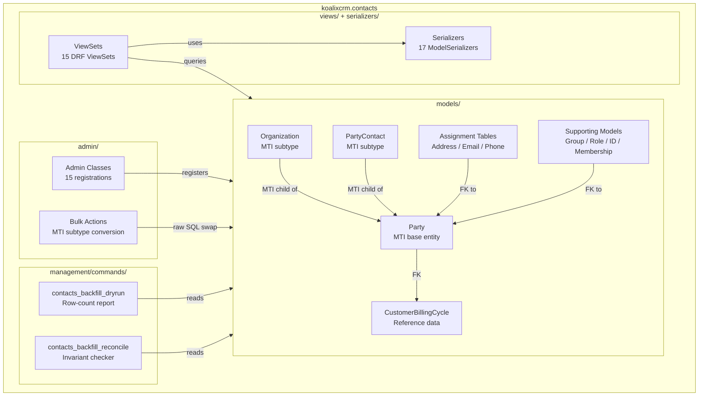
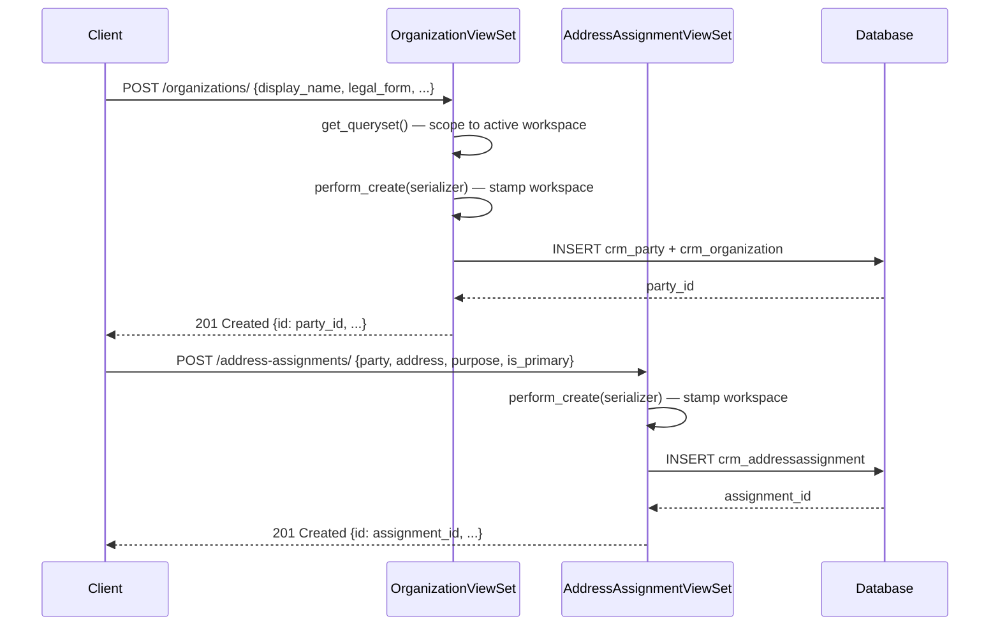
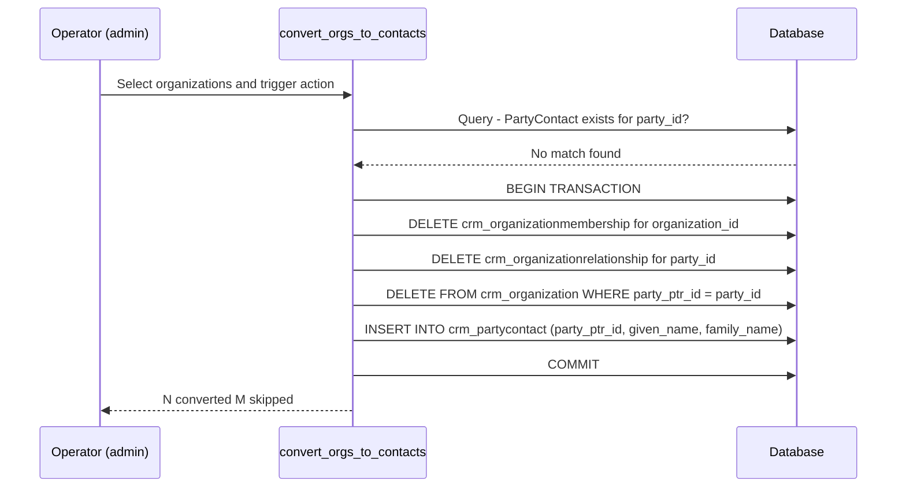
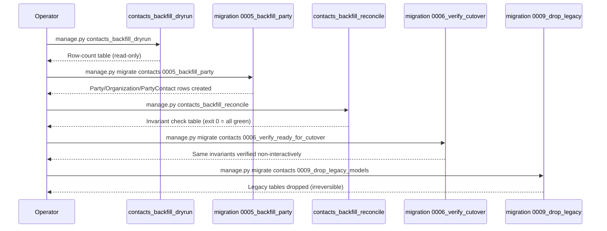
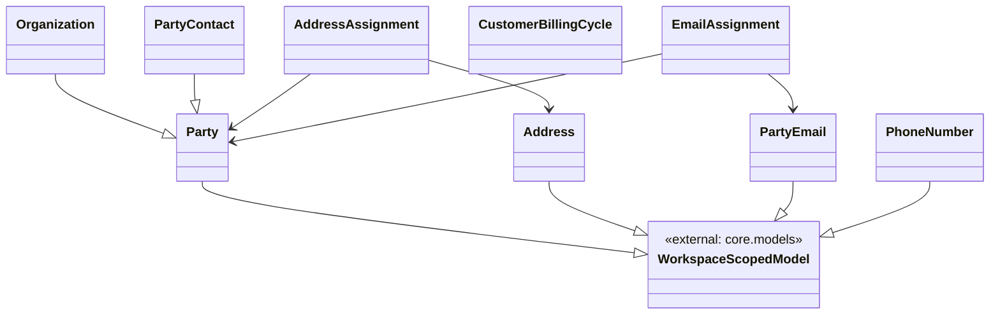

# Mid-Level Documentation: contacts Package

## Introduction

### Purpose of the Package

The `koalixcrm.contacts` package provides the universal Party data model for
koalixCRM. It defines the abstract legal-entity concept (a `Party`) and its two
concrete subtypes (`Organization` for legal entities and `PartyContact` for
natural persons), together with all supporting models for contact details
(addresses, phone numbers, e-mail addresses), identifications, group membership,
and organizational relationships.

The `Party` model is the central foreign-key target consumed by the `core`,
`crm`, and other koalixCRM apps. Every business document (invoice, offer,
delivery) in the system ultimately references a `Party`.

The package also includes the REST API layer (DRF ViewSets and serializers), the
Django admin registrations, and two management commands that support the one-time
v1.14.0 → v2.0.0 data migration (backfill pipeline).

### Contents Overview

| Sub-package / Module | Contents |
|----------------------|----------|
| `models/` | 16 Django model classes — `Party`, `Organization`, `PartyContact`, `Address`, `AddressAssignment`, `CustomerBillingCycle`, `PartyEmail`, `EmailAssignment`, `PhoneNumber`, `PhoneAssignment`, `OrganizationMembership`, `OrganizationRelationship`, `PartyGroup`, `PartyGroupMembership`, `PartyIdentification`, `PartyRole` |
| `serializers/` | 17 DRF `ModelSerializer` classes — one per model plus an option-list variant for `CustomerBillingCycle` |
| `views/` | `WorkspaceScopedViewSetMixin` and 15 DRF ViewSets (one per REST resource) |
| `admin/` | 15 Django admin classes plus 2 bulk actions (`convert_organizations_to_contacts`, `convert_contacts_to_organizations`) |
| `management/commands/` | `contacts_backfill_dryrun` (read-only row-count report) and `contacts_backfill_reconcile` (pre-cutover invariant checker) |
| `migrations/` | 15 Django migration files (0001–0015) covering the initial schema, the v2.0.0 Party backfill pipeline, and the subsequent address-split refactoring |
| `apps.py` | `ContactsConfig` — Django AppConfig registering the required peer `koalixcrm.core` |
| `signals/` | Empty; no signal handlers are defined at the time of writing |

### Target Audience

The primary audience is a software development engineer who intends to use,
extend, or integrate with the contacts package from another part of the
koalixCRM codebase.

### Glossary

| Term/Acronym | Full Form | Description |
|--------------|-----------|-------------|
| MTI | Multi-Table Inheritance | Django ORM pattern: a child model gets its own database table containing only the subtype-specific columns; the child row references the parent row via a shared primary key (`party_ptr_id`). |
| Party | — | The abstract legal entity that can be either an organization or a natural person. The central model of the contacts package and the shared FK target for all other apps. |
| Assignment table | — | A join table that links a canonical record (address, email, phone) to a `Party`, annotating the link with a purpose and an optional validity window. |
| DRF | Django REST Framework | Python library that provides serializers, ViewSets, and routers for building REST APIs on top of Django. |
| Workspace | — | Multi-tenancy unit in koalixCRM. Every `WorkspaceScopedModel` row belongs to exactly one workspace. |
| Backfill | — | The one-time data migration (issue #393–#396, migration `contacts.0005_backfill_party`) that creates `Party`, `Organization`, and `PartyContact` rows from the legacy contacts schema before the destructive v2.0.0 cutover. |
| Cutover | — | The irreversible step that drops the legacy tables (`contacts.0009_drop_legacy_models`), completing the v1.14.0 → v2.0.0 upgrade. |
| GLN | Global Location Number | A GS1 identifier for legal entities and locations, stored via `PartyIdentification`. |
| DUNS | Data Universal Numbering System | A nine-digit Dun & Bradstreet business identifier, stored via `PartyIdentification`. |
| LEI | Legal Entity Identifier | A 20-character ISO 17442 identifier for entities in financial transactions, stored via `PartyIdentification`. |
| UID | Unternehmens-Identifikationsnummer | Swiss company identifier (CHE-xxx.xxx.xxx), stored via `PartyIdentification`. |
| IBAN | International Bank Account Number | Standardized bank account identifier, stored via `PartyIdentification`. |
| E.164 | — | ITU-T format for international telephone numbers (e.g. `+41441234567`). Used in `PhoneNumber.phone_e164`. |
| GDPR | General Data Protection Regulation | EU privacy regulation; `PartyContact.gdpr_consent_date` records when a natural person consented. |
| PII | Personally Identifiable Information | Data that can be used to identify a natural person; subject to GDPR handling requirements. |

---

## Package Diagram

The diagram below shows the major components of the contacts package, their
grouping, and their principal relationships. Internal class-level detail is
omitted here; see the linked LL documents.

**Figure 1 — contacts package overview**

*Caption: Figure 1 — High-level component grouping and relationships in the
contacts package. MTI inheritance is labelled explicitly; all other arrows
denote usage or registration relationships.*

Related detailed documentation:

- [Contacts Models LL](QQ_LL_Doc_Contacts_Models.md)
- [Contacts Views, Admin and Management Commands LL](QQ_LL_Doc_Contacts_ViewsAdminManagement.md)

---

## Interaction Diagrams

### Party Creation and Address Assignment Flow

This sequence describes the full process by which a client (e.g. the Django
admin or a REST API consumer) creates a new `Organization` party and assigns a
billing address to it.

The entry point is a POST request to the `organizations` ViewSet, followed by a
separate POST request to the `address-assignments` ViewSet.

**Figure 2 — Party creation and address assignment sequence**

*Caption: Figure 2 — Two-step party creation: first create the Organization
(which inserts rows in both `crm_party` and `crm_organization`), then create
the `AddressAssignment` linking the new party to an existing `Address` record.*

Note: the `Address` record itself must already exist (or be created via
`POST /addresses/`) before the assignment can be made. The address is a
canonical, reusable record shared across multiple parties.

---

### MTI Subtype Conversion Flow (Admin Bulk Action)

The admin bulk actions allow an operator to convert an `Organization` row to a
`PartyContact` row (or vice versa) without touching the parent `Party` row. This
preserves all attached party data (roles, addresses, emails, phones,
identifications, and FKs from other apps).

**Figure 3 — MTI subtype conversion (Organization to PartyContact)**

*Caption: Figure 3 — Raw-SQL MTI child-row swap. The parent `crm_party` row is
intentionally left untouched, preserving all attached Party-level data.*

---

### Backfill Migration Pipeline

The following diagram shows the sequence of management commands and migrations
that constitute the v1.14.0 → v2.0.0 data migration pipeline. This is a
one-time operation, not a recurring process.

**Figure 4 — v2.0.0 backfill pipeline**

*Caption: Figure 4 — Operator-guided backfill pipeline. Steps DRY and REC are
manual; the migrations are applied with `manage.py migrate`. The operator must
confirm each intermediate state before proceeding to the destructive drop step.*

---

## Class Diagrams per Package

The diagram below shows the full set of model classes and their inheritance and
foreign-key relationships within the contacts package. Method signatures and
field lists are omitted here; see [Contacts Models LL](QQ_LL_Doc_Contacts_Models.md)
for per-class detail.

**Figure 5 — contacts.models class diagram**

*Caption: Figure 5 — Core Party MTI hierarchy and assignment-table relationships
(subset showing the three assignment chains). The full model graph including
`PhoneAssignment`, `OrganizationMembership`, `OrganizationRelationship`,
`PartyGroup`, `PartyGroupMembership`, `PartyIdentification`, `PartyRole`, and
`CustomerBillingCycle` is documented in
[Contacts Models LL](QQ_LL_Doc_Contacts_Models.md) Figure 1.*

The diagram is split at the assignment-table boundary to stay within the
diagram complexity budget. The remaining supporting models all reference `Party`
via a foreign key with `on_delete=CASCADE`; their full class diagrams are in the
LL document.

---

## Design Patterns Used

### Multi-Table Inheritance (MTI) Subtype Pattern

`Organization` and `PartyContact` each inherit from `Party` using Django's
Multi-Table Inheritance. Two concrete database tables are produced:
`crm_organization` and `crm_partycontact`. Each subtype row shares the primary
key with the parent `crm_party` row via a `party_ptr_id` one-to-one link.

This pattern allows polymorphic querying on `Party` (to retrieve any counterpart
regardless of subtype) while keeping subtype-specific columns cleanly separated.
The admin bulk-action commands exploit this by using raw SQL to swap the MTI
child table entry without touching the parent row, thereby preserving all attached
Party-level data during subtype conversion.

See [Contacts Models LL](QQ_LL_Doc_Contacts_Models.md) — Design Patterns Used,
and [Contacts Views, Admin and Management Commands LL](QQ_LL_Doc_Contacts_ViewsAdminManagement.md)
— Design Patterns Used for implementation detail.

### Assignment-Table Pattern with Validity Windows

Rather than embedding address, email, or phone data as foreign keys directly on
`Party`, the design uses canonical records (`Address`, `PartyEmail`,
`PhoneNumber`) that are linked to parties via dedicated assignment tables
(`AddressAssignment`, `EmailAssignment`, `PhoneAssignment`). Each assignment row
carries:

- `purpose` — the reason for the link (primary, billing, shipping, legal, visit, other)
- `is_primary` — convenience flag for the dominant record
- `valid_from` / `valid_to` — optional dates scoping the assignment to a period

This allows one canonical record to be shared by multiple parties, a party to
hold multiple contact details for different purposes, and historical versioning
of contact details without overwriting records.

### Multi-Tenancy via Abstract Base Class (`WorkspaceScopedModel`)

Every model inherits from `WorkspaceScopedModel` (defined in
`koalixcrm.core.models`), which injects a `workspace` foreign key and replaces
the default Django manager with `WorkspaceAwareManager`. This ensures that
tenant-scoping is structurally impossible to omit when adding new models to the
package.

At the API layer, `WorkspaceScopedViewSetMixin` enforces the same boundary: it
filters querysets to the active workspace and stamps the workspace on newly
created objects.

### Role-Based Classification via `PartyRole`

Instead of dedicated tables for each business function (customer, supplier,
employee, …), a `PartyRole` row with a controlled `role_type` field is used.
This allows a party to hold multiple roles simultaneously (e.g. a company that
is both a customer and a supplier) and avoids entity proliferation. The valid
role values are defined as constants in `koalixcrm.core.const.party`.

### Django Management Command as Operator Tool

Both management commands (`contacts_backfill_dryrun`,
`contacts_backfill_reconcile`) wrap library functions (`row_count_report`,
`verify_ready_for_cutover`) that are also invoked from migrations. The command
layer adds human-readable tabular formatting and, in the case of
`contacts_backfill_reconcile`, a non-zero exit code to allow CI pipelines and
deploy scripts to treat a failed verification as a hard stop.

---

## External Dependencies

| Requirement | Version/Details | Notes |
|-------------|-----------------|-------|
| Django | As specified in project `requirements.txt` | ORM (`django.db.models`), admin framework (`django.contrib.admin`), management commands (`django.core.management.base.BaseCommand`), `transaction.atomic`, `connection.cursor` |
| Django REST Framework | As specified in project `requirements.txt` | `ModelSerializer`, `ModelViewSet`, `DefaultRouter`, `IsAuthenticated`, `SearchFilter`, `OrderingFilter` |
| `koalixcrm.core.models.WorkspaceScopedModel` | Internal — `core` app | Abstract base providing the `workspace` FK and `WorkspaceAwareManager` |
| `koalixcrm.core.const.party` | Internal — `core` app | Choice constants: `LANGUAGE_CHOICES`, `LEGAL_FORM_CHOICES`, `ASSIGNMENT_PURPOSE_CHOICES`, `PARTY_ROLE_CHOICES`, `IDENTIFICATION_SCHEME_CHOICES`, `ORG_RELATIONSHIP_CHOICES` |
| `koalixcrm.core.const.country.COUNTRIES` | Internal — `core` app | Country code list used for `country` and `legal_seat_country` fields |
| `koalixcrm.core.const.postaladdressprefix.POSTALADDRESSPREFIX` | Internal — `core` app | Salutation prefix choices for `PartyContact.prefix` |
| `koalixcrm.shared.base_model_view_set.BaseModelViewSet` | Internal — `shared` app | Provides authentication and permission defaults for all ViewSets |
| `koalixcrm.shared.permissions.ModelPermissionsWithListView` | Internal — `shared` app | Permission class requiring `view` permission for list endpoints |
| `koalixcrm.core.admin.WorkspaceScopedModelAdmin` | Internal — `core` app | Admin mixin enforcing workspace-scoped queryset and save validation |
| `koalixcrm.core.models.Workspace` | Internal — `core` app | Accessed lazily in `perform_create` to resolve or create a default workspace |
| `koalixcrm.contacts.backfill.row_count_report` | Internal — contacts package | Function called by `contacts_backfill_dryrun` management command |
| `koalixcrm.contacts.backfill_verify.verify_ready_for_cutover` | Internal — contacts package | Function called by `contacts_backfill_reconcile` management command |
| `koalixcrm.core.app_checks.register_peer_check` | Internal — `core` app | Called from `ContactsConfig.ready()` to verify `koalixcrm.core` is installed |

---

## Testing

Information not available: No test files were found in the `koalixcrm/contacts/`
directory tree at the time of writing. It is not known whether tests for this
package exist in a shared test directory outside the package, or whether they are
absent entirely. No unit-test coverage figures can be reported.

---

## Appendix

### References

- [Contacts Models LL](QQ_LL_Doc_Contacts_Models.md)
- [Contacts Views, Admin and Management Commands LL](QQ_LL_Doc_Contacts_ViewsAdminManagement.md)
- [Django Multi-Table Inheritance](https://docs.djangoproject.com/en/stable/topics/db/models/#multi-table-inheritance)
- [Django REST Framework ViewSets](https://www.django-rest-framework.org/api-guide/viewsets/)
- [Django REST Framework Routers](https://www.django-rest-framework.org/api-guide/routers/)
- [Django management commands](https://docs.djangoproject.com/en/stable/howto/custom-management-commands/)

### List of Illustrations

| Figure | Title |
|--------|-------|
| Figure 1 | contacts package overview — component grouping and relationships |
| Figure 2 | Party creation and address assignment sequence |
| Figure 3 | MTI subtype conversion (Organization to PartyContact) |
| Figure 4 | v2.0.0 backfill pipeline |
| Figure 5 | contacts.models class diagram (core MTI hierarchy and assignment tables) |
