# Low-Level Documentation: `koalixcrm/contacts_api_py`

**Document type:** Low-Level (LL) Component Documentation
**Scope:** Package `koalixcrm/contacts_api_py` — HTTP API client, Party data model DTOs, and ViewSet re-export module
**Source files:**

- `koalixcrm/contacts_api_py/contacts_api_client.py`
- `koalixcrm/contacts_api_py/contacts_api.py`
- `koalixcrm/contacts_api_py/dto/customer_billing_cycle.py`
- `koalixcrm/contacts_api_py/dto/party_dtos.py`

---

## 1. Introduction

### 1.1 Scope and Purpose

The `contacts_api_py` package is the Python client-side boundary for the KoalixCRM Contacts REST service. It provides three layers of abstraction:

1. A typed HTTP client (`KoalixCRMContactsAPIClient`) that issues authenticated REST calls and maps responses to DTO instances.
2. A consolidated set of value-object DTOs (`party_dtos.py`, `customer_billing_cycle.py`) that mirror the serializer field lists of the server-side Contacts application.
3. A thin re-export module (`contacts_api.py`) that surfaces the server-side Django REST Framework ViewSets for URL routing.

The package is consumed by Celery workers and other internal services that need to read or write contact-related data programmatically. It is not a public API; it is an internal integration boundary.

### 1.2 Target Audience

This document is intended for backend developers working on the KoalixCRM platform who need to understand the client implementation, extend it with new endpoints, or trace a data flow involving contact records.

### 1.3 Glossary — Party Data Model Terms

**Party**
The abstract root entity representing any addressable actor in the system. A Party is either a natural person (represented as a `PartyContact`) or a legal entity (represented as an `Organization`). The Party concept replaced the legacy Customer/Supplier/Person/Contact/CustomerGroup model in v2.0.0.

**Organization**
A Party subtype representing a legal entity. Carries legal registration data (legal form, legal name, registration number, legal seat country).

**PartyContact**
A Party subtype representing a natural person. The name is transitional — see ADR 0001 in the server-side codebase. Holds personal identification fields (prefix, given name, family name, date of birth) and the GDPR consent date.

**PartyRole**
A time-bounded assignment of a business role type (e.g., customer, supplier) to a Party. A Party may hold multiple roles simultaneously. The `is_primary` flag marks the principal role.

**OrganizationMembership**
A time-bounded record linking a `PartyContact` (the `contact` field) to an `Organization`, capturing the person's title and position within that organization.

**Assignment pattern**
The pattern used for all contact-data resources (Address, PhoneNumber, PartyEmail). The contact datum itself (e.g., an `Address`) is a standalone entity that can be shared. An assignment record (`AddressAssignment`, `PhoneAssignment`, `EmailAssignment`) links the datum to a Party with a `purpose`, `is_primary` flag, and `valid_from`/`valid_to` temporal validity range. This avoids duplicating contact data across parties and supports historical tracking.

**valid_from / valid_to**
ISO-8601 date fields present on assignment DTOs and relationship DTOs. Together they define the temporal interval during which the assignment or relationship is considered active. A `valid_to` of `null` means the record is open-ended (currently active).

---

## 2. Historical Context: Migration from Legacy Model (v2.0.0)

Prior to v2.0.0 the Contacts service exposed dedicated endpoints for Customer, Supplier, Person, Contact, CustomerGroup, and contact address sub-types (ContactPostalAddress, ContactPhoneAddress, ContactEmailAddress). These had corresponding client methods and DTOs in the legacy code.

Issue #395 removed all of these endpoints and their supporting views, serializers, and URL routes. Issue #394 introduced the Party data model as the replacement. The `contacts_api_client.py` module docstring makes this explicit:

> "The legacy Customer / Supplier / Person / Contact / CustomerGroup / Contact{Postal,Phone,Email}Address endpoints and their client methods are gone as of v2.0.0 (issue #395). Everything goes through the Party data model DTOs below."

Callers that held references to the old client methods (e.g., `get_customer`, `create_supplier`) must be updated to the new Party-model methods. There is no compatibility shim; the migration was a hard cut.

The `party_dtos.py` module similarly documents its consolidation rationale in its module docstring: legacy DTOs used one file per class; the new DTOs are consolidated into a single module because they are value-object shells with no custom behaviour.

---

## 3. Component: `KoalixCRMContactsAPIClient`

### 3.1 Overview

`KoalixCRMContactsAPIClient` is the single entry point for all programmatic access to the Contacts REST API. It extends `BaseAPIClient` (from `koalixcrm/shared/api_client.py`) and adds 68 public CRUD methods — four per resource (get, list, create, update) — across 17 resource types.

The class sets three class-level attributes that configure the inherited base:

- `api_path_env_var = "KOALIXCRM_CONTACTS_API_PATH"` — the environment variable that overrides the API path.
- `api_path_default = "/koalixcrm_contacts/api/v1/"` — the default path used if the environment variable is absent.
- `uses_workspace_id = True` — instructs `BaseAPIClient` to insert the workspace identifier into every URL path, resulting in paths of the form `/koalixcrm_contacts/api/v1/{workspace_id}/{resource}/`.

The `__init__` method accepts `api_url`, `username`, `password`, and `workspace_id` and delegates directly to `super().__init__()` with no additional initialisation logic.

### 3.2 Inheritance and Context Boundary

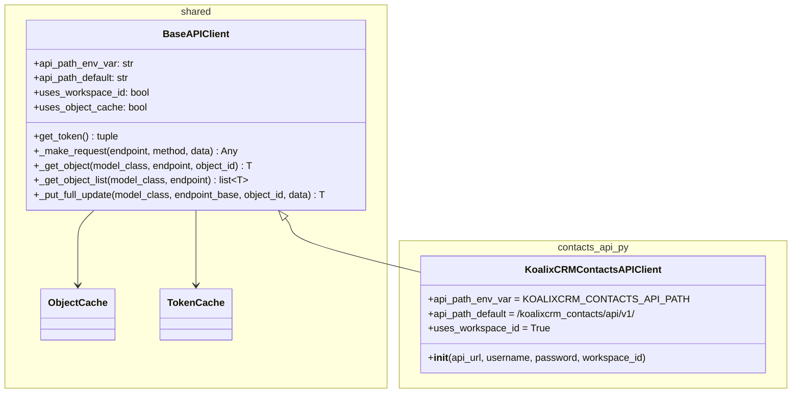

`BaseAPIClient` handles all transport concerns: OIDC M2M token acquisition (client credentials flow via OIDC discovery), Basic Auth session login (for test environments), HTTP/HTTPS connection management, retry on 401/403, object caching, and DRF-paginated list traversal. `KoalixCRMContactsAPIClient` adds no transport logic; its sole contribution is the resource-specific method set.

### 3.3 CRUD Method Groups — Overview

The 68 CRUD methods follow a strict naming convention and delegate to three base helpers:

- `_get_object(ModelClass, "/resource-path", id)` — cache-then-fetch by primary key.
- `_get_object_list(ModelClass, "/resource-path/")` — paginated fetch of all records.
- `_make_request("/resource-path/", method="POST", data=...)` + manual cache write — create.
- `_put_full_update(ModelClass, "/resource-path", id, data)` — GET-then-PUT merge update.

The create pattern is deliberately explicit at the subclass level: the client calls `_make_request` directly, wraps the response in the DTO, stores it in `self._cache`, and returns it. This keeps the create path visible and avoids an overly generic helper that would hide the DTO instantiation.

The diagram below groups methods by resource family (overview level, six groups shown):

```mermaid
classDiagram
    namespace billing {
        class CustomerBillingCycleMethods {
            +get_customer_billing_cycle(object_id)
            +get_customer_billing_cycle_list()
            +create_customer_billing_cycle(data)
            +update_customer_billing_cycle(object_id, data)
        }
    }
    namespace core_party {
        class PartyMethods {
            +get_party(object_id)
            +get_party_list()
            +create_party(data)
            +update_party(object_id, data)
        }
        class OrganizationMethods {
            +get_organization(object_id)
            +get_organization_list()
            +create_organization(data)
            +update_organization(object_id, data)
        }
        class PartyContactMethods {
            +get_party_contact(object_id)
            +get_party_contact_list()
            +create_party_contact(data)
            +update_party_contact(object_id, data)
        }
    }
    namespace identity_roles {
        class PartyIdentificationMethods {
            +get_party_identification(object_id)
            +get_party_identification_list()
            +create_party_identification(data)
            +update_party_identification(object_id, data)
        }
        class PartyRoleMethods {
            +get_party_role(object_id)
            +get_party_role_list()
            +create_party_role(data)
            +update_party_role(object_id, data)
        }
    }
    KoalixCRMContactsAPIClient --> CustomerBillingCycleMethods
    KoalixCRMContactsAPIClient --> PartyMethods
    KoalixCRMContactsAPIClient --> OrganizationMethods
    KoalixCRMContactsAPIClient --> PartyContactMethods
    KoalixCRMContactsAPIClient --> PartyIdentificationMethods
    KoalixCRMContactsAPIClient --> PartyRoleMethods
```

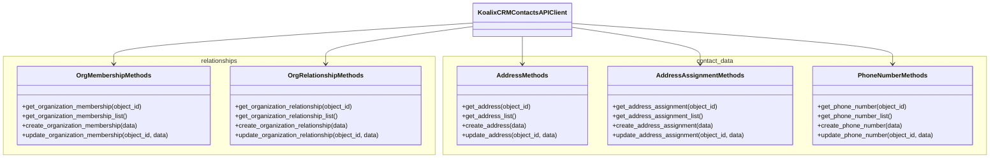

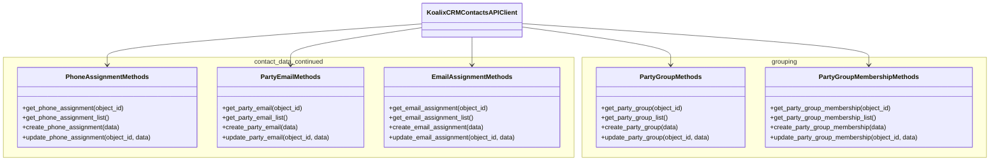

### 3.4 Create Method Flow

The create methods share an identical flow. The Organization create is representative; all others follow the same pattern with different DTO types and endpoint paths.

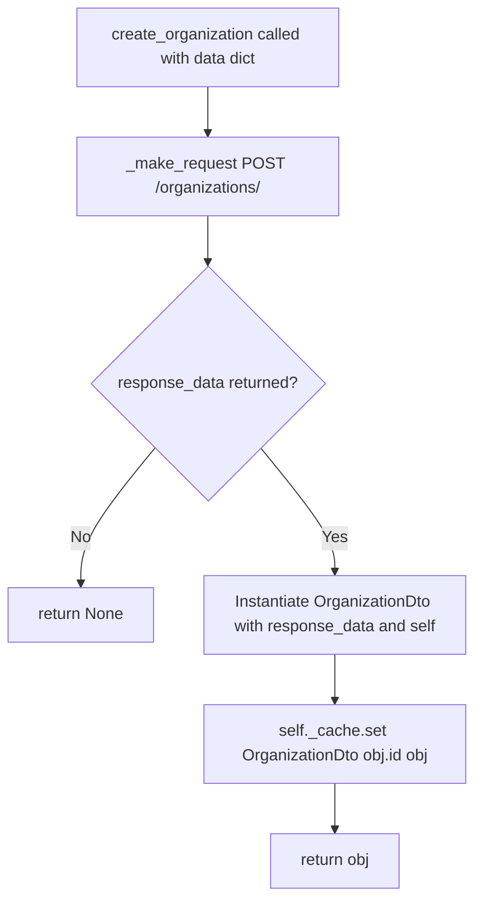

The `update_*` methods delegate to `_put_full_update` in `BaseAPIClient`, which performs a GET to retrieve the current server state, merges the caller-supplied `data` dict over it (stripping `id`, `created_at`, `updated_at`), and issues a PUT. This ensures the full object is always sent, which is required by the DRF ModelSerializer PUT semantics on the server side.

### 3.5 Resource-to-Endpoint Mapping

| Client method prefix | REST endpoint path |
|---|---|
| `*_customer_billing_cycle*` | `/customer-billing-cycles` |
| `*_party*` | `/parties` |
| `*_organization` (core type) | `/organizations` |
| `*_party_contact*` | `/party-contacts` |
| `*_party_identification*` | `/party-identifications` |
| `*_party_role*` | `/party-roles` |
| `*_organization_membership*` | `/organization-memberships` |
| `*_organization_relationship*` | `/organization-relationships` |
| `*_address` (core type) | `/addresses` |
| `*_address_assignment*` | `/address-assignments` |
| `*_phone_number*` | `/phone-numbers` |
| `*_phone_assignment*` | `/phone-assignments` |
| `*_party_email*` | `/party-emails` |
| `*_email_assignment*` | `/email-assignments` |
| `*_party_group` (core type) | `/party-groups` |
| `*_party_group_membership*` | `/party-group-memberships` |

All paths are relative to the workspace-scoped base: `/koalixcrm_contacts/api/v1/{workspace_id}/`.

---

## 4. Component: Party Data Model DTOs (`party_dtos.py`)

### 4.1 Module Design

`party_dtos.py` consolidates all 14 Party data model DTOs into a single module. All classes extend `BaseModel` from `koalixcrm/shared/base_model.py`. `BaseModel` stores the raw server response in `self._data`, exposes `id` as a read-only property backed by `_data['id']`, and populates all other attributes from the response dict via `_populate_from_data`. The `__init__` of each DTO class pre-declares its fields as `None` before calling `super().__init__(data)`, which ensures attribute existence even when the server response omits optional fields.

No DTO class contains custom methods or computed properties. They are pure value-object shells whose attribute names mirror the serializer field names on the server side.

The client module (`contacts_api_client.py`) imports all 14 DTOs with `as` aliases (e.g., `Address as AddressDto`, `Party as PartyDto`) to avoid name collisions in the client's own namespace.

### 4.2 Core Party Types

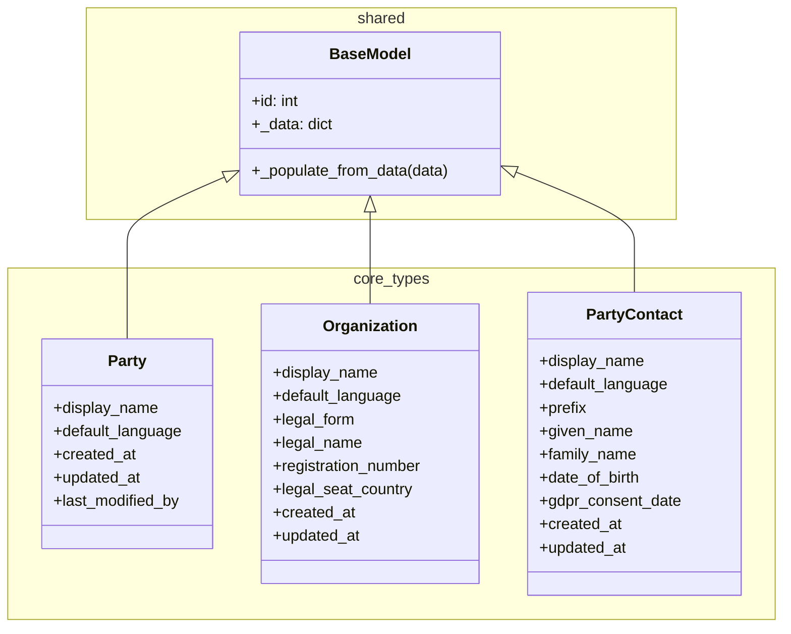

**Party** is the generic party record. Its `display_name` is the system-computed label used in UI dropdowns and search results. The `default_language` indicates the preferred communication language for this party. The `last_modified_by` field carries the identity of the last user to modify the record, which is absent from `Organization` because that DTO does not expose it at this endpoint level.

**Organization** extends the Party concept with legal entity attributes. The `legal_form` holds a coded value for the legal structure (e.g., AG, GmbH). The `legal_name` is the registered name as it appears in official records, which may differ from `display_name`. The `registration_number` is the number assigned by the registration authority. The `legal_seat_country` is the country code of the registered office.

**PartyContact** represents a natural person. The `prefix` is an optional honorific or title prefix. The `given_name` and `family_name` together constitute the person's name. The `date_of_birth` is an ISO-8601 date. The `gdpr_consent_date` records the date on which the data subject gave explicit consent for their personal data to be processed; its presence is a legally significant field. See the Security section for GDPR treatment. The class docstring explicitly marks this as a transitional name pending resolution of ADR 0001.

### 4.3 Identification and Roles

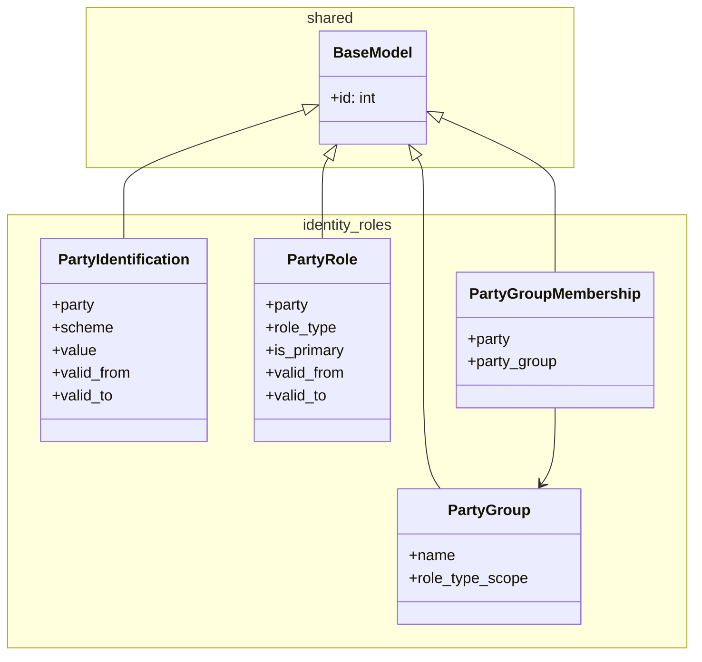

**PartyIdentification** associates an external identifier with a Party. The `scheme` indicates the identification system (e.g., VAT-number scheme, national ID scheme). The `value` is the identifier string within that scheme. The `valid_from` and `valid_to` fields bound the period during which this identification is valid, supporting historic identification records (e.g., a party that changed VAT registration).

**PartyRole** assigns a business role to a Party within a time window. The `role_type` is a coded value from the server-side role taxonomy (e.g., customer, supplier, partner). The `is_primary` boolean indicates whether this is the party's main role when multiple roles overlap. The `valid_from` and `valid_to` fields follow the same temporal validity convention as PartyIdentification.

**PartyGroup** is a named grouping construct. The `name` is the human-readable label. The `role_type_scope` constrains which role types are eligible for membership in this group, preventing semantically inconsistent groupings (e.g., a supplier-only group cannot contain customer-only parties).

**PartyGroupMembership** is a junction record linking a `party` to a `party_group`. It carries no temporal validity or purpose fields; membership is considered current for as long as the record exists.

### 4.4 Relationship DTOs

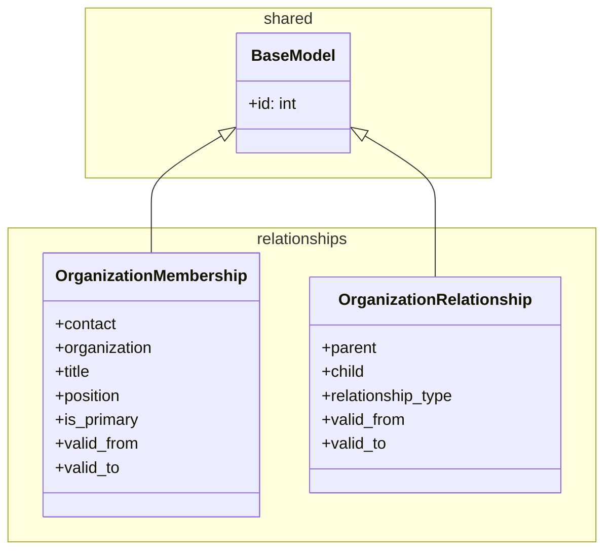

**OrganizationMembership** expresses that a natural person (`contact`, referencing a `PartyContact`) has a position within an `Organization`. The `title` is an optional display label (e.g., "Head of Procurement"). The `position` is a more structured role label within the organization. The `is_primary` flag marks the organisation that is considered the person's primary employer or affiliation when multiple memberships are active. The `valid_from` and `valid_to` dates track employment periods; a `null` `valid_to` means the membership is ongoing.

**OrganizationRelationship** expresses a directed relationship between two organizations (`parent` and `child`). The `relationship_type` codes the nature of the relationship (e.g., subsidiary, branch). The directionality is significant: `parent` is the controlling or owning entity.

### 4.5 Contact Data DTOs

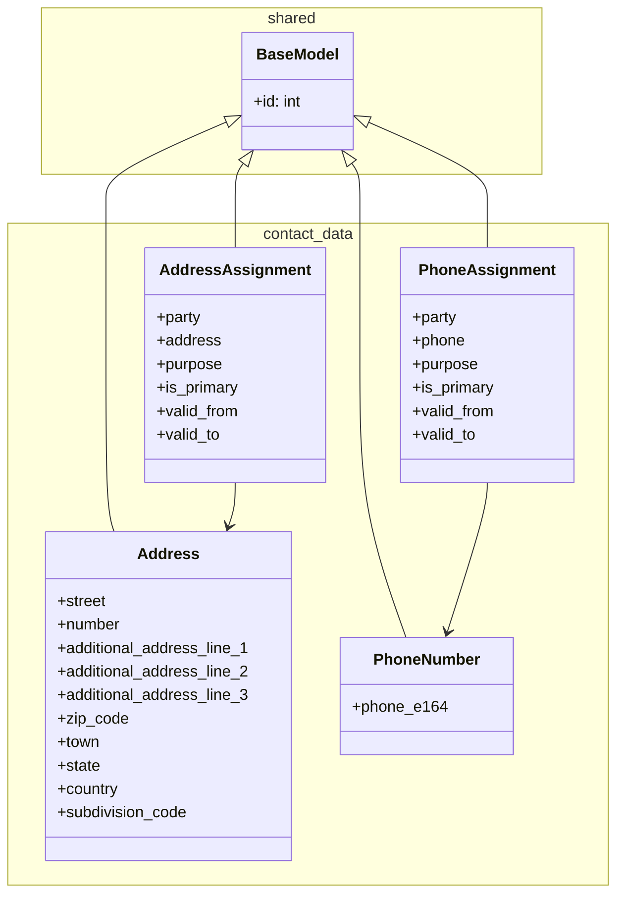

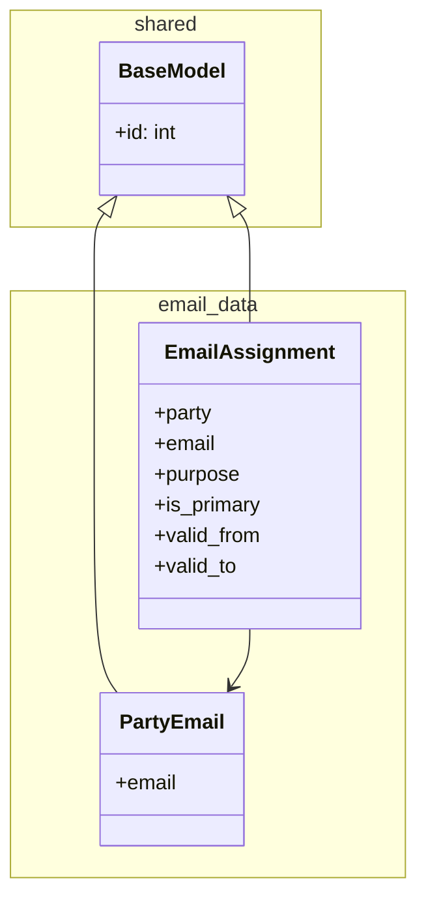

**Address** is the canonical postal address entity. It supports structured decomposition: `street` and `number` for the street line, three `additional_address_line` fields for care-of, building, or floor information, `zip_code`, `town`, `state`, and `country` for geographic location, and `subdivision_code` for ISO 3166-2 regional codes. An Address record can be shared by multiple parties via `AddressAssignment` records.

**AddressAssignment** links an `Address` to a `Party` with a `purpose` (e.g., billing, delivery, registered office), an `is_primary` flag for the principal address of a given purpose, and `valid_from`/`valid_to` temporal validity.

**PhoneNumber** is intentionally minimal: it contains a single `phone_e164` field. The field name signals that the server enforces E.164 international phone number format (e.g., `+41441234567`). This avoids storing phone numbers in ambiguous local formats.

**PhoneAssignment** follows the same assignment pattern as `AddressAssignment`: it links a `PhoneNumber` to a `Party` with `purpose`, `is_primary`, and `valid_from`/`valid_to`.

**PartyEmail** stores a single `email` address string. Like `PhoneNumber`, it is a standalone reusable entity.

**EmailAssignment** links a `PartyEmail` to a `Party` with `purpose`, `is_primary`, and `valid_from`/`valid_to`.

---

## 5. Component: `CustomerBillingCycle`

`CustomerBillingCycle` lives in its own module (`dto/customer_billing_cycle.py`) separate from `party_dtos.py`. This reflects that it predates the Party data model migration and belongs to the billing configuration domain rather than the contact data domain.

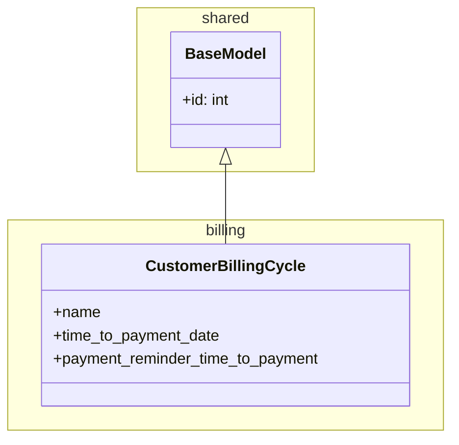

The `name` field is the human-readable label for the billing cycle (e.g., "30 days net"). The `time_to_payment_date` is a duration or integer representing the number of days from invoice date to payment due date. The `payment_reminder_time_to_payment` is a duration or integer representing how far in advance of the due date a payment reminder is sent. Both duration fields mirror the server-side model fields and their units are determined by the server's serializer contract.

---

## 6. Component: `contacts_api.py` — ViewSet Re-Export Module

`contacts_api.py` is a pure re-export module. It imports 16 Django REST Framework ViewSets from two locations in the server-side `koalixcrm.contacts` application and places them in the package's public `__all__`:

- `CustomerBillingCycleViewSet` — from `koalixcrm.contacts.views.customer_billing_cycle_view_set`
- All 15 Party-model ViewSets — from `koalixcrm.contacts.views.party_view_sets`

The module docstring records the same migration context: legacy Customer/Supplier/Person/Contact/CustomerGroup viewsets are absent from v2.0.0 onward.

This module is the registration point for URL routing in the project settings. The URL router in `projectsettings/urls.py` imports ViewSets from here rather than directly from their implementation modules, providing a stable, single-point import path that insulates the URL configuration from internal reorganisations of the views package.

The 16 re-exported ViewSets are:

`CustomerBillingCycleViewSet`, `PartyViewSet`, `OrganizationViewSet`, `PartyContactViewSet`, `PartyIdentificationViewSet`, `PartyRoleViewSet`, `OrganizationMembershipViewSet`, `OrganizationRelationshipViewSet`, `AddressViewSet`, `AddressAssignmentViewSet`, `PhoneNumberViewSet`, `PhoneAssignmentViewSet`, `PartyEmailViewSet`, `EmailAssignmentViewSet`, `PartyGroupViewSet`, `PartyGroupMembershipViewSet`.

---

## 7. Access to External Interfaces

`KoalixCRMContactsAPIClient` accesses one external system: the KoalixCRM Contacts REST API.

The base URL is taken from the `KOALIXCRM_API_URL` environment variable (resolved in `BaseAPIClient.__init__`). The workspace-scoped API path is resolved from `KOALIXCRM_CONTACTS_API_PATH` with a default of `/koalixcrm_contacts/api/v1/`. All resource paths are appended beneath the workspace prefix at runtime.

In production the client uses OIDC M2M token acquisition (client credentials grant). The token endpoint is discovered via OIDC well-known configuration at `{CELERY_WORKER_M2M_OIDC_ISSUER}/.well-known/openid-configuration`. Tokens are cached in a `TokenCache` instance and refreshed on 401/403 responses. In test environments the client falls back to HTTP Basic Auth (username and password passed to the constructor).

The client does not access any other external interfaces. It does not emit events, write to message queues, or call other services.

---

## 8. Security

### 8.1 Environment Variables and Credentials

The following environment variables carry sensitive values and must not be logged or exposed:

- `KOALIXCRM_API_URL` — base URL of the target API server.
- `CELERY_WORKER_M2M_CLIENT_ID` and `CELERY_WORKER_M2M_CLIENT_SECRET` — OIDC client credentials for M2M authentication.
- `CELERY_WORKER_M2M_OIDC_ISSUER` — the OIDC issuer URL.
- `CELERY_WORKER_M2M_SCOPE` — the OAuth scope for token requests.
- `X_CUSTOM_ORIGIN_VERIFICATION_KEY` — the secret value for the `X-Custom-Origin-Verify` header, used by the server to reject requests from unknown origins.

The `KOALIXCRM_CONTACTS_API_PATH` variable is not sensitive (it is a URL path, not a secret) but controls routing behaviour.

### 8.2 GDPR Sensitivity of Personal Contact Data

Several fields in the Party data model hold personal data subject to GDPR obligations:

- `PartyContact.given_name`, `PartyContact.family_name`, `PartyContact.prefix` — personal identification data.
- `PartyContact.date_of_birth` — special-category data in some jurisdictions.
- `PartyContact.gdpr_consent_date` — records the legal basis for processing the person's data. This field must be treated as a compliance record: it must not be cleared or backdated without a corresponding legal justification. Any system that creates or updates `PartyContact` records must ensure that `gdpr_consent_date` is set when required by the applicable data processing agreement.
- `AddressAssignment`, `PhoneAssignment`, `EmailAssignment` and their referenced entities (`Address`, `PhoneNumber`, `PartyEmail`) — contact data that can identify or locate an individual.

Callers processing these DTOs in batch jobs or exports must apply appropriate data minimisation and access control. The assignment pattern (shared datum + assignment record) means that deleting an assignment does not delete the underlying contact datum; dedicated cleanup processes must address orphaned `Address`, `PhoneNumber`, and `PartyEmail` records.

---

## 9. Design Patterns

### 9.1 Assignment Pattern for Contact Data

The address, phone, and email resources follow a two-table assignment pattern:

1. The contact datum (`Address`, `PhoneNumber`, `PartyEmail`) is a standalone entity persisted independently of any party.
2. An assignment record (`AddressAssignment`, `PhoneAssignment`, `EmailAssignment`) links the datum to a party with contextual metadata: `purpose`, `is_primary`, `valid_from`, `valid_to`.

This pattern allows a single address (e.g., a shared corporate address) to be assigned to multiple parties without duplication. It also allows historical tracking: changing a party's address creates a new assignment with the old one closed (`valid_to` set) rather than overwriting the record. Callers that need the currently active address for a party must filter on `valid_to IS NULL` (or equivalent) and `is_primary = True`.

### 9.2 Party Data Model Pattern

The Party data model decouples the abstract concept of an addressable entity (Party) from its concrete subtype (Organization or PartyContact). Business roles (customer, supplier) are attached to parties via `PartyRole` records rather than being encoded as model subclasses. This allows a single party to hold multiple roles simultaneously and enables role changes over time without migrating data between tables.

The pattern has a direct implication for client code: there is no `get_customer` method. To retrieve all parties acting as customers, the caller must query the `PartyRole` endpoint filtered by `role_type` and then fetch the associated party records. The client currently provides only unfiltered list methods; filtering is left to the server-side query parameters or to the caller's post-processing.

### 9.3 GET-then-PUT Update Pattern

The `_put_full_update` helper implements a read-modify-write cycle: it GETs the current server state, merges the caller's partial update dict over it (stripping server-managed fields `id`, `created_at`, `updated_at`), and PUTs the merged payload. This is required because the server-side DRF serializers reject partial payloads on PUT. The consequence is an extra round-trip per update and a race condition window: if another process modifies the record between the GET and the PUT, the caller's changes will overwrite the intervening modifications silently. In the current architecture this is accepted as a known trade-off; PATCH-based partial updates are available in `BaseAPIClient._patch_partial_update` but are not exposed by the contacts client.

---

## 10. External Dependencies

| Dependency | Location | Purpose |
|---|---|---|
| `koalixcrm.shared.api_client.BaseAPIClient` | `koalixcrm/shared/api_client.py` | Transport, authentication, caching, CRUD helpers |
| `koalixcrm.shared.base_model.BaseModel` | `koalixcrm/shared/base_model.py` | DTO base class with attribute population and serialisation |
| `koalixcrm.shared.object_cache.ObjectCache` | `koalixcrm/shared/object_cache.py` | In-memory DTO cache keyed by (type, id) |
| `koalixcrm.shared.token_cache.TokenCache` | `koalixcrm/shared/token_cache.py` | OIDC token cache with expiry tracking |
| `koalixcrm.contacts.views.customer_billing_cycle_view_set` | Server-side | DRF ViewSet imported by `contacts_api.py` |
| `koalixcrm.contacts.views.party_view_sets` | Server-side | DRF ViewSets for all Party-model resources |
| Python stdlib: `http.client`, `json`, `urllib.parse`, `socket`, `base64` | stdlib | HTTP transport (no third-party HTTP library) |

The package has no third-party Python package dependencies beyond what `BaseAPIClient` and `BaseModel` bring in. All HTTP communication uses the Python standard library.

---

## 11. Appendix

### 11.1 ADR Reference

- **ADR 0001** (referenced in `PartyContact` docstring): Defines the transitional naming decision for the natural-person subtype. The current name `PartyContact` is acknowledged as a placeholder pending a more precise term. Refer to the server-side ADR document for the full rationale.

### 11.2 Issue References

- **Issue #394**: Introduced the Party data model and all Party-model resources, serializers, and URL routes.
- **Issue #395**: Removed the legacy Customer, Supplier, Person, Contact, CustomerGroup, and contact address endpoints and their client-side equivalents.

### 11.3 File Locations

| File | Role |
|---|---|
| `koalixcrm/contacts_api_py/contacts_api_client.py` | HTTP client — `KoalixCRMContactsAPIClient` |
| `koalixcrm/contacts_api_py/contacts_api.py` | ViewSet re-export for URL routing |
| `koalixcrm/contacts_api_py/dto/party_dtos.py` | 14 Party data model DTOs |
| `koalixcrm/contacts_api_py/dto/customer_billing_cycle.py` | `CustomerBillingCycle` DTO |
| `koalixcrm/shared/api_client.py` | `BaseAPIClient` — transport and auth base |
| `koalixcrm/shared/base_model.py` | `BaseModel` — DTO attribute population base |
