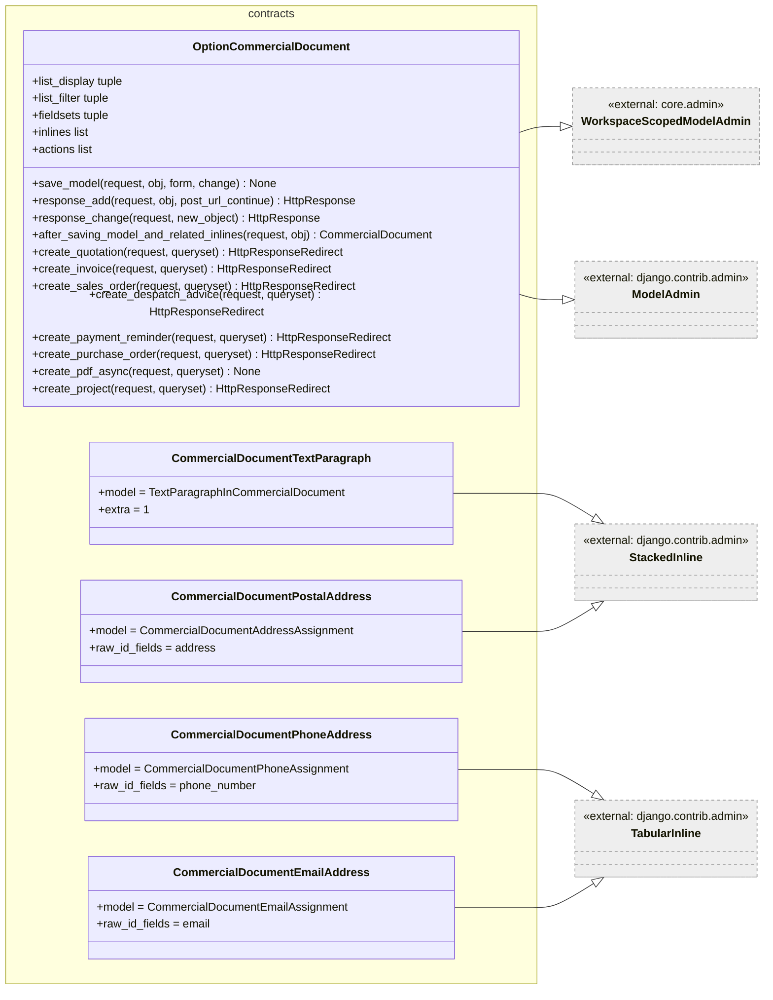
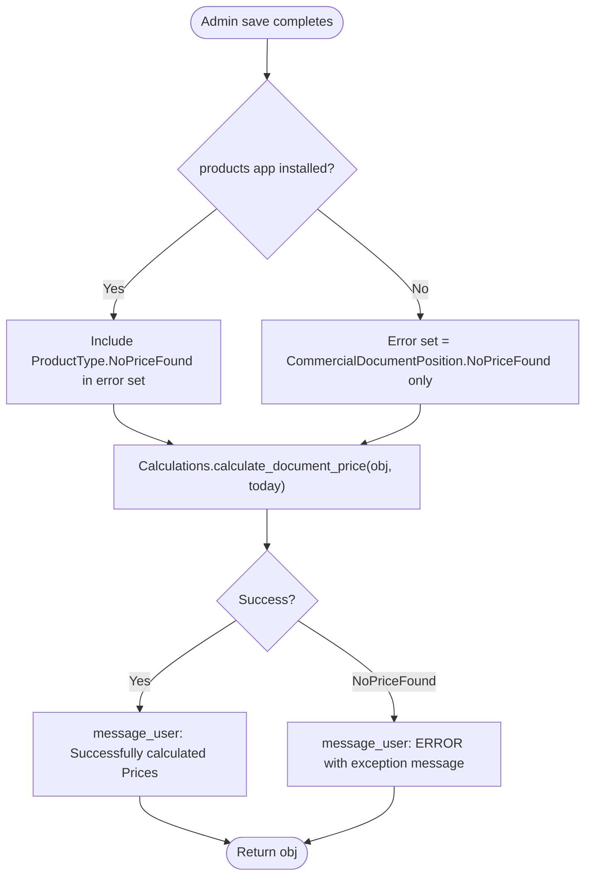
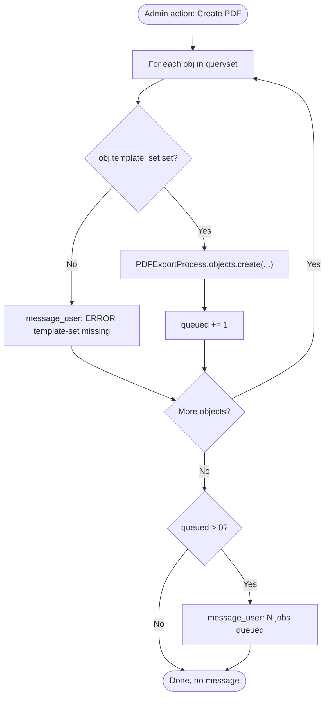
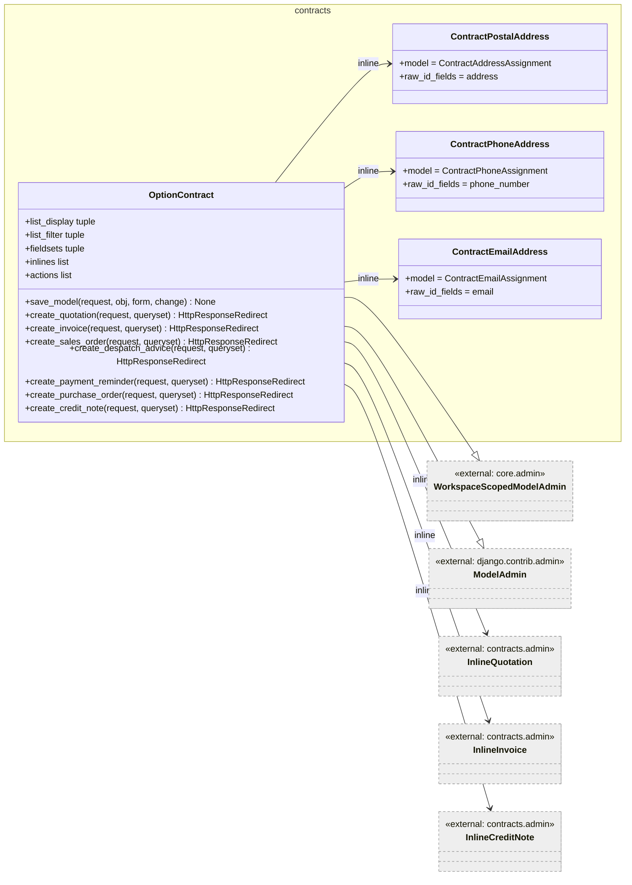
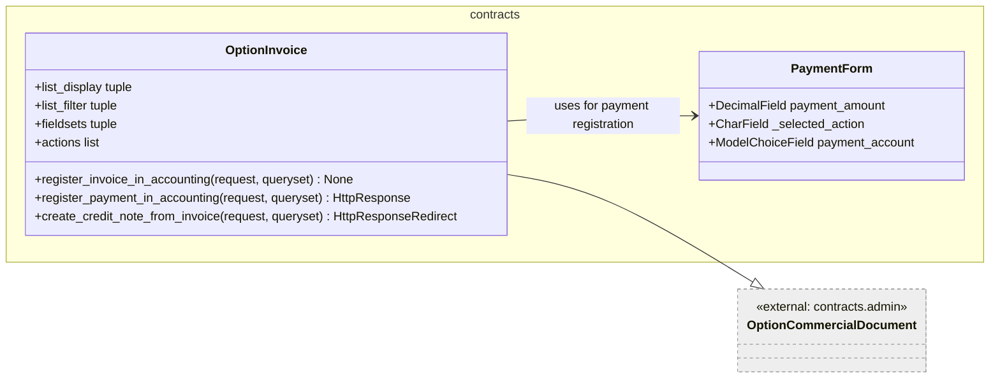
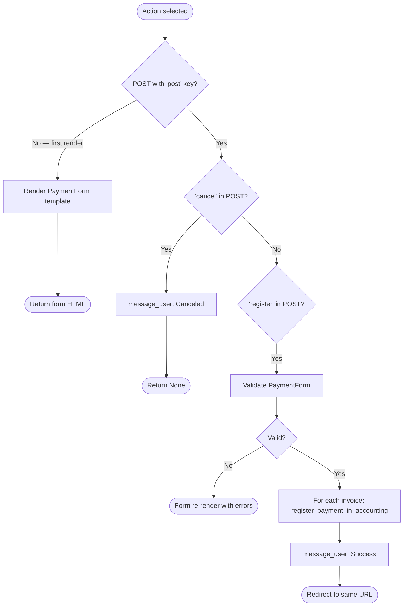
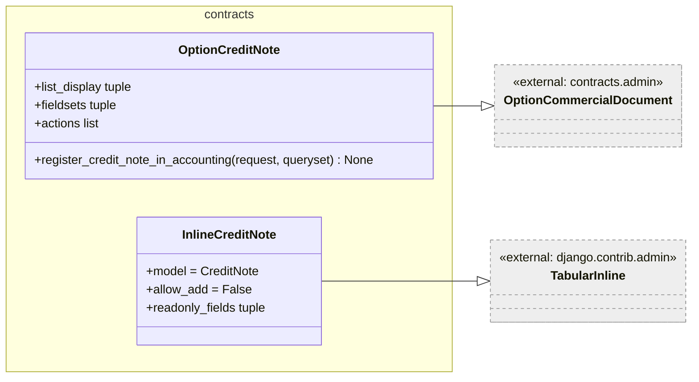
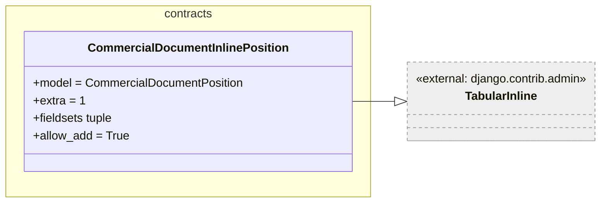
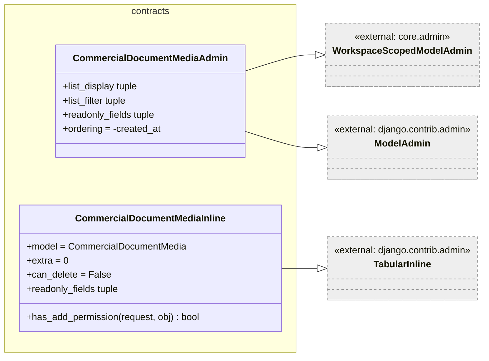

# Low-Level Documentation: Contracts — Admin and Calculations

## Introduction

### Scope

This document covers all Django Admin classes and registrations defined in `koalixcrm/contracts/admin/`, plus the `Calculations` service class from `koalixcrm/contracts/models/calculations.py`. The latter is documented here because its primary callers are the admin actions that trigger price recalculation.

| File | Classes |
|------|---------|
| `admin/__init__.py` | Registration of all admin classes |
| `commercial_document_admin.py` | `OptionCommercialDocument` (base admin), inline classes |
| `commercial_document_position_admin.py` | `CommercialDocumentInlinePosition` |
| `commercial_document_media_admin.py` | `CommercialDocumentMediaAdmin`, `CommercialDocumentMediaInline` |
| `contract_admin.py` | `OptionContract`, inline address/phone/email classes |
| `invoice_admin.py` | `OptionInvoice`, `InlineInvoice`, `PaymentForm` |
| `quotation_admin.py` | `OptionQuotation`, `InlineQuotation` |
| `sales_order_admin.py` | `OptionSalesOrder` |
| `purchase_order_admin.py` | `OptionPurchaseOrder` |
| `credit_note_admin.py` | `OptionCreditNote`, `InlineCreditNote` |
| `despatch_advice_admin.py` | `OptionDespatchAdvice` |
| `payment_reminder_admin.py` | `OptionPaymentReminder` |
| `models/calculations.py` | `Calculations` |

The `Calculations` class is also described in detail in [`QQ_LL_Doc_Contracts_Models.md`](./QQ_LL_Doc_Contracts_Models.md); this document focuses on its integration with the admin layer.

### Target Audience

The primary audience for this documentation is the software development engineer who needs to maintain or extend the Django Admin interface for the contracts domain.

### Glossary

| Term/Acronym | Full Form | Description |
|--------------|-----------|-------------|
| ModelAdmin | — | Django class that controls how a model is displayed and edited in the admin site |
| StackedInline / TabularInline | — | Django inline admin classes for editing related objects on the parent's change page |
| action | — | Admin bulk action shown in the "Action" drop-down on list views |
| PluginProcessor | — | Project-level extension mechanism that allows installed plugins to inject additional inlines and actions |
| FOP | XSL-FO | Apache FO Processor — the rendering engine for PDF output |
| PDFExportProcess | — | Django model in `koalixcrm.core` that queues and tracks async PDF rendering jobs |

---

## Detailed Component

### OptionCommercialDocument (Base Admin)

Figure 1 — OptionCommercialDocument and its inline classes

`OptionCommercialDocument` is the base admin class for all commercial document types. Concrete document admin classes (e.g. `OptionInvoice`, `OptionQuotation`) extend it and add their document-specific fieldsets and actions.

The five inline classes registered on `OptionCommercialDocument.inlines` — positions, text paragraphs, postal addresses, phone numbers, emails, and media — appear on every document change page regardless of document type.

`CommercialDocumentPostalAddress` uses `raw_id_fields = ('address',)` to avoid loading a potentially large address queryset into a `<select>` widget; the same applies to `phone_number` and `email` in the other inline classes.

#### `save_model(request, obj, form, change)`

Sets `last_modified_by` and, on creation, `staff` to the requesting user in both the add and change cases. The `change` flag is inspected but both branches execute the same assignment — the code does not differentiate between create and update for `last_modified_by`.

#### `response_add(request, obj, post_url_continue)`

Calls `after_saving_model_and_related_inlines()` (which triggers price recalculation) and sets `custom_date_field` to today before delegating to the Django parent `response_add`.

#### `response_change(request, new_object)`

Calls `after_saving_model_and_related_inlines()` before delegating to the Django parent `response_change`. Price recalculation therefore runs on every admin save.

#### `after_saving_model_and_related_inlines(request, obj)`

Figure 2 — after_saving_model_and_related_inlines flow

This method is the primary trigger for price recalculation in the admin workflow. It catches `NoPriceFound` exceptions from both the position layer and (when installed) the products price list, displaying user-visible error messages without raising an HTTP error.

#### Document creation actions (`create_quotation`, `create_invoice`, etc.)

Each action method iterates the queryset but processes only the first selected object (the loop returns after the first iteration). It delegates to `CreateNewDocumentView.create_new_document()`. The caller receives a redirect to the newly created document's admin change page on success, or to the relevant template configuration page on failure.

#### `create_pdf_async(request, queryset)`

Queues a `PDFExportProcess` record for each selected document that has a `template_set`. Documents without a template set produce an error message and are skipped. The Celery worker picks up the process record, renders the PDF via FOP, uploads it to S3, and posts a `CommercialDocumentMedia` row.

Figure 3 — create_pdf_async flow

#### `create_project(request, queryset)` (conditional)

Only defined when `koalixcrm.reporting` is installed. Delegates to `CreateTaskView.create_project()` from the reporting module. The action is registered on `OptionQuotation` actions.

---

### OptionContract

Figure 4 — OptionContract

`OptionContract` is the admin class for `Contract`. Unlike `OptionCommercialDocument`, it does not trigger automatic price recalculation on save — contracts do not carry a price themselves. Its `save_model` sets `last_modified_by` and `staff` similarly.

The contract change page shows read-only inline summaries of linked quotations, invoices, and credit notes (`InlineQuotation`, `InlineInvoice`, `InlineCreditNote`). These are read-only previews with a change link — they cannot be edited from the contract change page (`allow_add = False`).

`OptionContract.actions` list is `['create_quotation', 'create_invoice', 'create_purchase_order', 'create_credit_note']`. Plugin actions are appended via `PluginProcessor`.

---

### OptionInvoice

Figure 5 — OptionInvoice

`OptionInvoice` extends `OptionCommercialDocument` with two accounting-integration actions and a credit-note creation action.

#### `register_invoice_in_accounting(request, queryset)`

Calls `Invoice.register_invoice_in_accounting(request)` for each selected invoice, catching `OpenInterestAccountMissing` and `IncompleteInvoice` exceptions and displaying them as admin error messages. On success, a single success message is shown for the whole batch.

#### `register_payment_in_accounting(request, queryset)`

Two-phase admin action using an intermediate HTML form (`crm/admin/register_payment.html`). On the first request, the `PaymentForm` (with a decimal amount field and an account selector) is rendered. On form submission with `"register"`, it calls `Invoice.register_payment_in_accounting()` for each selected invoice and redirects back. On `"cancel"`, it shows an error message and returns.

Figure 6 — register_payment_in_accounting flow

#### `PaymentForm`

`PaymentForm` is an inner Django form class. Its `payment_account` field queryset is populated at instantiation time via `_activa_account_queryset()`, which returns accounts of type `'A'` from the accounting plugin, or an empty tuple when the accounting app is not installed. This lazy queryset resolution prevents import errors in deployments without the accounting plugin.

#### `InlineInvoice`

Read-only `TabularInline` that appears on the `OptionContract` change page. Shows `link_to_invoice` (an HTML link), contract, party, due date, status, and pricing data. `allow_add = False` prevents creation of invoices from the contract inline — they must be created via the admin action.

---

### OptionQuotation

Extends `OptionCommercialDocument` with `valid_until` and `status` in the fieldset. Actions include `create_sales_order`, `create_invoice`, `create_quotation`, `create_despatch_advice`, `create_purchase_order`, `create_project`, and `create_pdf_async`. The `create_project` action is only available when `koalixcrm.reporting` is installed — its inclusion in the `actions` list unconditionally may raise an `AttributeError` in deployments without the reporting app; this is a known behaviour of the current implementation.

`InlineQuotation` is the read-only inline shown on the contract change page, following the same pattern as `InlineInvoice`.

---

### OptionSalesOrder

Extends `OptionCommercialDocument` without adding any extra fields. Actions: `create_invoice`, `create_quotation`, `create_despatch_advice`, `create_purchase_order`, `create_pdf_async`.

---

### OptionPurchaseOrder

Extends `OptionCommercialDocument` with a `status` field in the fieldset. Comments in the source note that the supplier is the inherited `CommercialDocument.party` (the dedicated `supplier` FK was removed in v2.0.0). Actions include accounting registration actions (`register_invoice_in_accounting`, `register_payment_in_accounting`) which are inherited from `OptionInvoice`-equivalent paths — however, `OptionPurchaseOrder` does not inherit from `OptionInvoice`. These action names refer to methods defined on `OptionCommercialDocument`. Information not available: how `register_invoice_in_accounting` and `register_payment_in_accounting` are resolvable on `OptionPurchaseOrder` given that neither `OptionCommercialDocument` nor `OptionPurchaseOrder` defines them directly. This may be an outstanding bug.

---

### OptionCreditNote

Figure 7 — OptionCreditNote

`OptionCreditNote` extends `OptionCommercialDocument` with `corrects_invoice`, `status`, `issue_date`, and `reason` in the fieldset. Its sole additional action is `register_credit_note_in_accounting`, which mirrors the invoice registration action but calls `CreditNote.register_credit_note_in_accounting(request)`.

---

### OptionDespatchAdvice

Extends `OptionCommercialDocument` with a `status` field. Actions: `create_sales_order`, `create_invoice`, `create_pdf_async`.

---

### OptionPaymentReminder

Extends `OptionCommercialDocument` with `payable_until`, `status`, `payment_bank_reference`, and `iteration_number` in the fieldset. Includes accounting-related actions in the actions list; the same caveat about action name resolution described for `OptionPurchaseOrder` applies here.

---

### CommercialDocumentInlinePosition

Figure 8 — CommercialDocumentInlinePosition

The inline for editing line items on every commercial document change page. The field list is built dynamically at module load time by `_position_fields()`: the `product_type` field is included only when `koalixcrm.products` is installed. This allows the contracts module to function independently of the products module.

#### `_position_fields()` (module-level function)

Returns a tuple of field names for the inline's fieldset. Appends `product_type` conditionally using `apps.is_installed('koalixcrm.products')`. This function is evaluated once at class definition time (Python class body executes at import).

---

### CommercialDocumentMediaAdmin and CommercialDocumentMediaInline

Figure 9 — CommercialDocumentMediaAdmin and inline

`CommercialDocumentMediaAdmin` is a standalone admin for browsing S3 media records. All sensitive fields (`s3_url`, `s3_key`, `status`, `pdf_export_process`, `created_by`, `created_at`, `last_updated_at`) are read-only, preventing manual edits to records created by the Celery worker.

`CommercialDocumentMediaInline` appears on every document change page (it is part of `OptionCommercialDocument.inlines`). It is fully read-only: `can_delete = False` and `has_add_permission()` always returns `False`. It gives the admin user a view of which PDF exports have been run for a document, with a change link to the full media record.

---

### Admin Registration Summary

The `admin/__init__.py` registers all model–admin pairs:

| Model | Admin Class |
|-------|-------------|
| `CommercialDocumentMedia` | `CommercialDocumentMediaAdmin` |
| `Contract` | `OptionContract` |
| `Quotation` | `OptionQuotation` |
| `SalesOrder` | `OptionSalesOrder` |
| `DespatchAdvice` | `OptionDespatchAdvice` |
| `Invoice` | `OptionInvoice` |
| `PaymentReminder` | `OptionPaymentReminder` |
| `PurchaseOrder` | `OptionPurchaseOrder` |
| `CreditNote` | `OptionCreditNote` |

Note that `CommercialDocument` and `CommercialDocumentPosition` are not registered directly — positions are edited exclusively as inlines on their parent document.

---

## Calculations Integration with Admin

The `Calculations.calculate_document_price()` static method is called from `OptionCommercialDocument.after_saving_model_and_related_inlines()` after every admin save. This means price recalculation runs synchronously in the HTTP response cycle. For documents with many positions and product-type price lookups, this may increase response time noticeably. Information not available: whether any performance threshold or timeout is applied.

The method is also available for programmatic use (e.g. from management commands or tests) without going through the admin.

---

## Persistent Storage

Admin actions that create new documents or register accounting bookings write to the database. The `create_pdf_async` action writes a `PDFExportProcess` row. No admin action reads from or writes to S3 directly; that is the responsibility of the Celery worker.

---

## In-Memory State

`OptionCommercialDocument.inlines` and `actions` are class-level lists. `PluginProcessor.getPluginAdditions()` appends plugin contributions to these lists at class definition time (module import). This means that plugin additions are applied once at startup and are shared across all instances of the admin class.

---

## Access to External Interfaces

| Interface | Type of Call | Expected Duration | Notes |
|-----------|--------------|-------------------|-------|
| `Calculations.calculate_document_price` | Blocking, DB read + write | ~50–500 ms | Scales with number of positions and product price lookups |
| `PDFExportProcess.objects.create` | Blocking DB write | ~5–20 ms | Queues async PDF job; the actual rendering is asynchronous |
| `CreateNewDocumentView.create_new_document` | Blocking DB write | ~20–100 ms | Creates the new document and clones positions |
| `accounting.models.*` | Blocking DB read/write | ~20–100 ms | Accounting registration actions; optional plugin |
| `CreateTaskView.create_project` | Blocking DB write | ~20–50 ms | Reporting plugin; conditional |

---

## Security

### Assets

| Asset | Description | Security Measure | Assessment of Criticality |
|-------|-------------|------------------|---------------------------|
| Admin access | Access to all admin views | Controlled by Django's staff/superuser flags and `ModelPermissions`; `WorkspaceScopedModelAdmin` restricts queryset | Uncritical — standard Django admin security model |
| Payment account selection | `PaymentForm.payment_account` queryset restricted to type-A accounts | Filtered server-side; form is not accessible to non-staff users | Uncritical |
| PDF S3 URL / key | Visible in `CommercialDocumentMediaAdmin` | Read-only in admin; authentication required | Uncritical — staff-only view |

---

## Design Patterns Used

### Template Method (Admin Actions)

All document-creation actions on `OptionCommercialDocument` and `OptionContract` follow the same skeleton: iterate queryset, delegate to `CreateNewDocumentView.create_new_document`, return after first object. The concrete document type is the only variable.

### Observer-like Post-Save Hook

`response_add` and `response_change` act as post-save hooks, calling `after_saving_model_and_related_inlines()` before delegating to the Django parent. This ensures price recalculation runs after all inlines (including positions) have been saved, without overriding `save_model`.

### Conditional Registration

`create_project` is defined inside an `if apps.is_installed('koalixcrm.reporting'):` block at class definition time, making the action invisible in deployments without the reporting plugin.

### Plugin Extension Point

`PluginProcessor` implements an open extension point: installed plugins register additional inlines and actions under named keys (e.g. `"contractInlines"`, `"invoiceActions"`), which are appended to the respective class-level lists at startup.

---

## External Dependencies

| Requirement | Version/Details | Notes |
|-------------|-----------------|-------|
| Django Admin | Django ≥ 4.x | All admin classes depend on `django.contrib.admin` |
| `koalixcrm.core.admin.workspace_scoped_admin` | Internal | Provides `WorkspaceScopedModelAdmin` |
| `koalixcrm.plugin` | Internal | Provides `PluginProcessor` for extension points |
| `koalixcrm.accounting` | Internal, optional | Provides `Account`, `Booking`, `AccountingPeriod` for accounting actions |
| `koalixcrm.reporting` | Internal, optional | Provides `CreateTaskView` for the `create_project` action |
| `koalixcrm.core.models.pdf_export_process` | Internal | Provides `PDFExportProcess` for async PDF queuing |

---

## Appendix

### References

- Source files: `koalixcrm/contracts/admin/`, `koalixcrm/contracts/models/calculations.py`
- Related documentation: [`QQ_LL_Doc_Contracts_Models.md`](./QQ_LL_Doc_Contracts_Models.md), [`QQ_LL_Doc_Contracts_ViewsSerializers.md`](./QQ_LL_Doc_Contracts_ViewsSerializers.md)

### List of Illustrations

| Figure | Title |
|--------|-------|
| Figure 1 | OptionCommercialDocument and its inline classes |
| Figure 2 | after_saving_model_and_related_inlines flow |
| Figure 3 | create_pdf_async flow |
| Figure 4 | OptionContract |
| Figure 5 | OptionInvoice |
| Figure 6 | register_payment_in_accounting flow |
| Figure 7 | OptionCreditNote |
| Figure 8 | CommercialDocumentInlinePosition |
| Figure 9 | CommercialDocumentMediaAdmin and inline |
