# Low-Level Documentation: Contracts — Models

## Introduction

### Scope

This document covers all Django model classes defined in
`koalixcrm/contracts/models/`. The files documented are:

| File | Classes |
|------|---------|
| `contract.py` | `Contract`, `ContractAddressAssignment`, `ContractPhoneAssignment`, `ContractEmailAssignment` |
| `commercial_document.py` | `CommercialDocument`, `TextParagraphInCommercialDocument`, `CommercialDocumentAddressAssignment`, `CommercialDocumentPhoneAssignment`, `CommercialDocumentEmailAssignment` |
| `commercial_document_position.py` | `Position`, `CommercialDocumentPosition` |
| `commercial_document_media.py` | `CommercialDocumentMedia` |
| `invoice.py` | `Invoice` |
| `quotation.py` | `Quotation` |
| `sales_order.py` | `SalesOrder` |
| `purchase_order.py` | `PurchaseOrder` |
| `credit_note.py` | `CreditNote` |
| `despatch_advice.py` | `DespatchAdvice` |
| `payment_reminder.py` | `PaymentReminder` |
| `calculations.py` | `Calculations` |

### Target Audience

The primary audience for this documentation is the software development engineer who needs to understand, modify, or extend the contracts domain model.

### Glossary

| Term/Acronym | Full Form | Description |
|--------------|-----------|-------------|
| MTI | Multi-Table Inheritance | Django pattern where each subclass gets its own DB table linked via a shared primary key to the parent table |
| FK | Foreign Key | A database relation linking one table's row to another |
| UBL | Universal Business Language | OASIS standard XML schema for commercial documents used by the Java PDF worker |
| PDF worker | — | External Java service that reads the nested serializer output and renders PDFs |
| Party | — | Abstract contact entity; concrete subclasses are `Organization` and `PartyContact` |
| Workspace | — | Tenant-level scoping entity; every workspace-scoped row carries a `workspace` FK |
| TemplateSet | — | Container that maps document type names to FOP/XSL-FO templates |

---

## Detailed Component

### Contract

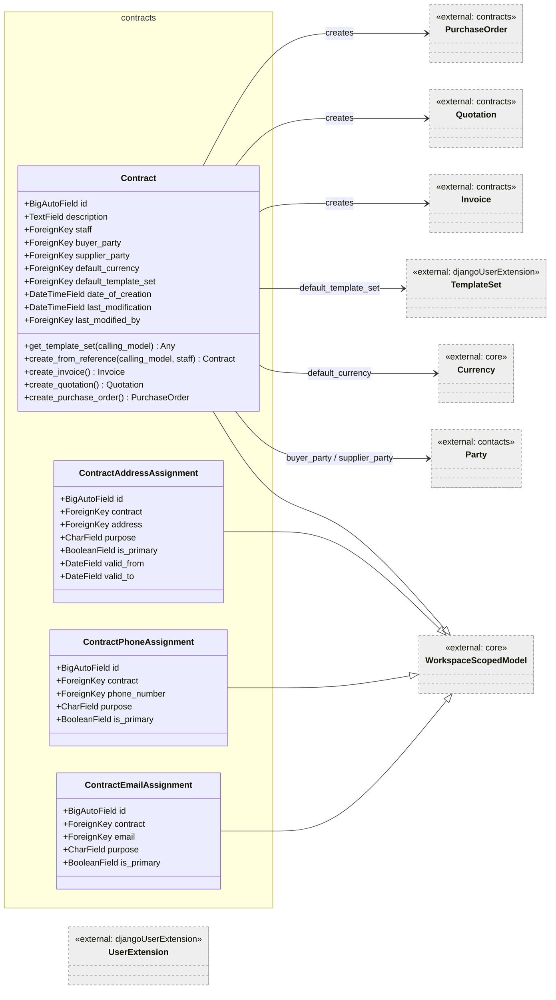

Figure 1 — Contract and its contact-assignment satellites

`Contract` is the root aggregate of the contracts domain. It holds the commercial relationship between a buyer and a supplier party, a default currency for all documents derived from it, and a pointer to the template set that defines which FOP templates are used when rendering documents to PDF. Every commercial document (Invoice, Quotation, etc.) is attached to exactly one Contract.

The three assignment classes — `ContractAddressAssignment`, `ContractPhoneAssignment`, `ContractEmailAssignment` — implement a loose-link pattern: instead of embedding contact fields directly on the contract they point at shared `contacts.*` rows and classify the relationship with a `purpose` code and optional validity period.

The `staff` FK is nullable so contracts can exist before a staff member is assigned.

#### `get_template_set(calling_model)`

Signature: `get_template_set(self, calling_model: models.Model) -> Any`

Retrieves the document-type-specific template from the contract's `default_template_set`. It passes the concrete Python class name (e.g. `"Invoice"`) to `TemplateSet.get_template_set()`, which performs the look-up in the template registry. Raises `TemplateSetMissingInContract` when `default_template_set` is `None`.

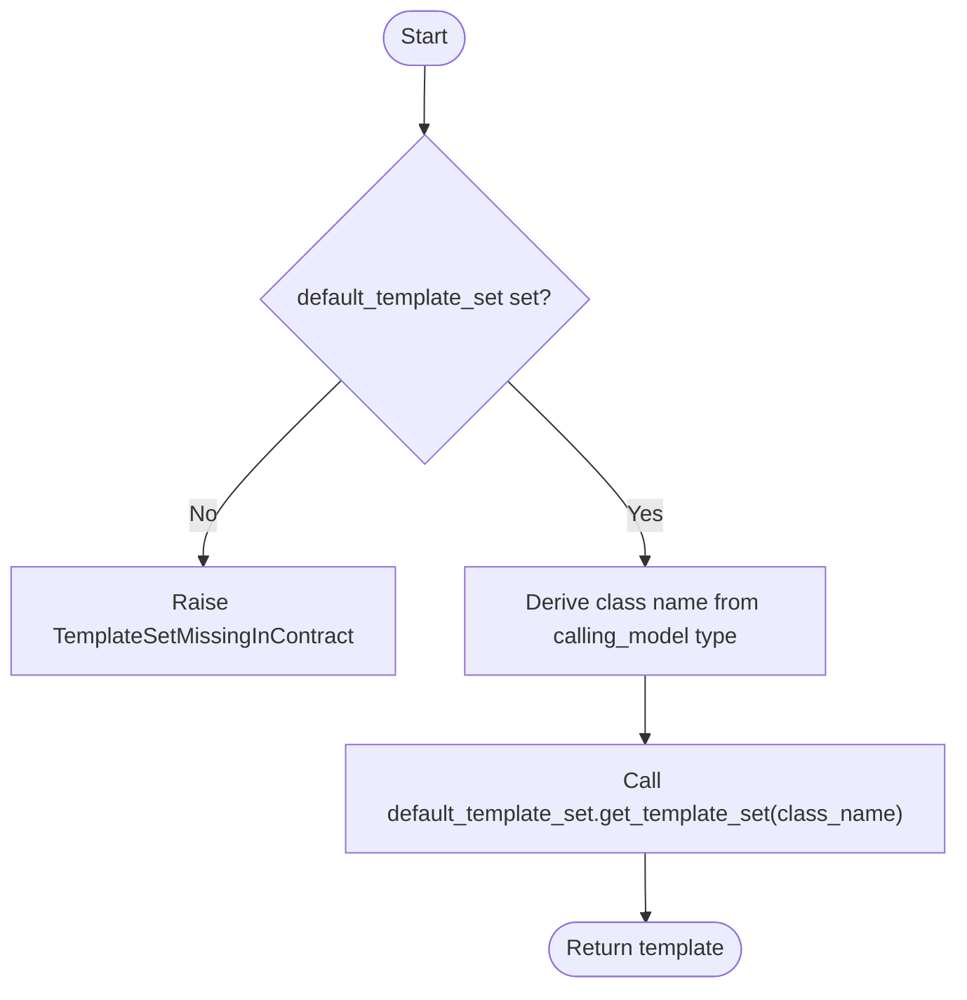

Figure 2 — get_template_set flow

#### `create_from_reference(calling_model, staff)`

Signature: `create_from_reference(self, calling_model: models.Model, staff: User) -> Contract`

Bootstraps a new contract from an existing model (typically a CRM contact). It reads the staff user's default currency and template set from the `UserExtension`, sets audit fields, and saves. Returns `self`.

#### `create_invoice()`, `create_quotation()`, `create_purchase_order()`

Each of these factory methods instantiates the corresponding document subclass and calls `create_from_reference(self)` on it, delegating the full initialisation to the document. They exist on `Contract` so admin actions can call them without importing the concrete document module at the top level.

---

### CommercialDocument

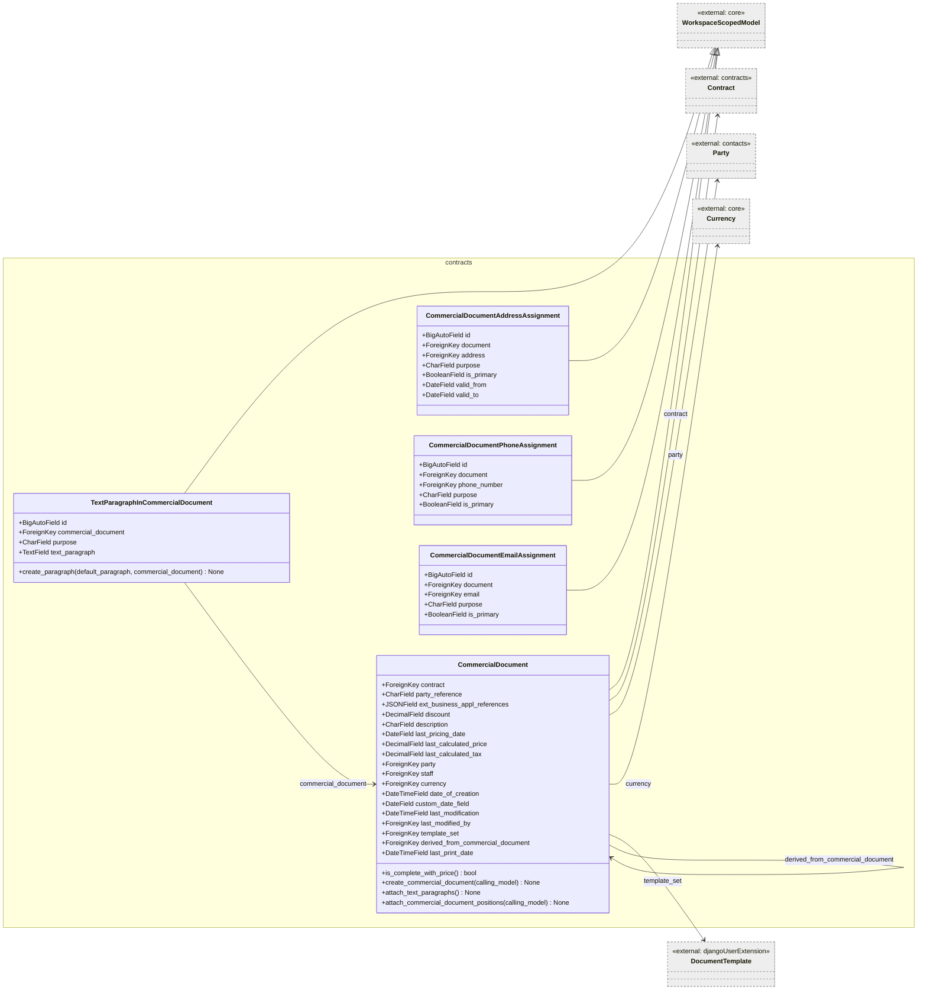

Figure 3 — CommercialDocument and its satellites

`CommercialDocument` is the abstract parent (in business terms; it is a concrete Django model via MTI) shared by all document types (Invoice, Quotation, SalesOrder, PurchaseOrder, DespatchAdvice, CreditNote, PaymentReminder). It owns the common header fields: the contract link, the counterparty (`party`), the currency, the pricing cache (`last_calculated_price`, `last_calculated_tax`, `last_pricing_date`), and the document-to-document derivation chain (`derived_from_commercial_document`).

The `ext_business_appl_references` JSON field stores opaque references to external ERP or workflow systems; its schema is not enforced at the model level.

`custom_date_field` is set to today by `OptionCommercialDocument.response_add` after every admin save; its specific business meaning is not documented in the source code. Information not available: business semantic of `custom_date_field` beyond the admin hook.

`last_print_date` is not updated automatically; it must be set by the caller after a successful PDF export.

#### `is_complete_with_price()`

Returns `True` only when both `last_pricing_date` and `last_calculated_price` are non-null. Used by Invoice and CreditNote before accounting registration.

#### `create_commercial_document(calling_model)`

Signature: `create_commercial_document(self, calling_model: models.Model) -> None`

Populates common header fields by copying from the `calling_model`, which may be either a `Contract` or another `CommercialDocument`.

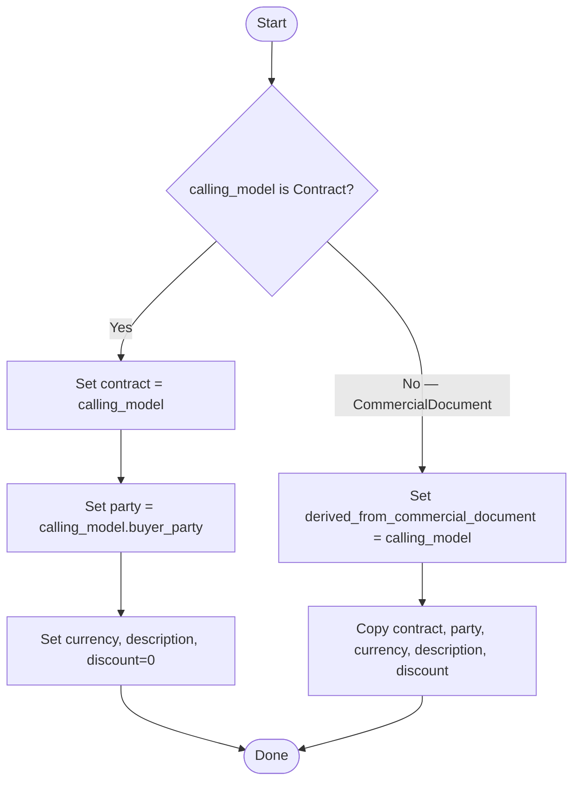

Figure 4 — create_commercial_document dispatch

The workspace is also copied from the calling model so that workspace-scoped model constraints are satisfied when admin actions bypass `WorkspaceScopedModelAdmin.save_model`.

#### `attach_text_paragraphs()`

Queries `TextParagraphInDocumentTemplate` for every paragraph linked to `self.template_set`, then calls `TextParagraphInCommercialDocument.create_paragraph()` for each. This stamps the boilerplate text blocks (e.g., terms and conditions, greeting, closing) onto the newly created document.

#### `attach_commercial_document_positions(calling_model)`

When `calling_model` is a `CommercialDocument`, retrieves all its positions and deep-copies each one onto `self` via `CommercialDocumentPosition.create_position()`. No positions are attached when `calling_model` is a `Contract`.

---

### Position and CommercialDocumentPosition

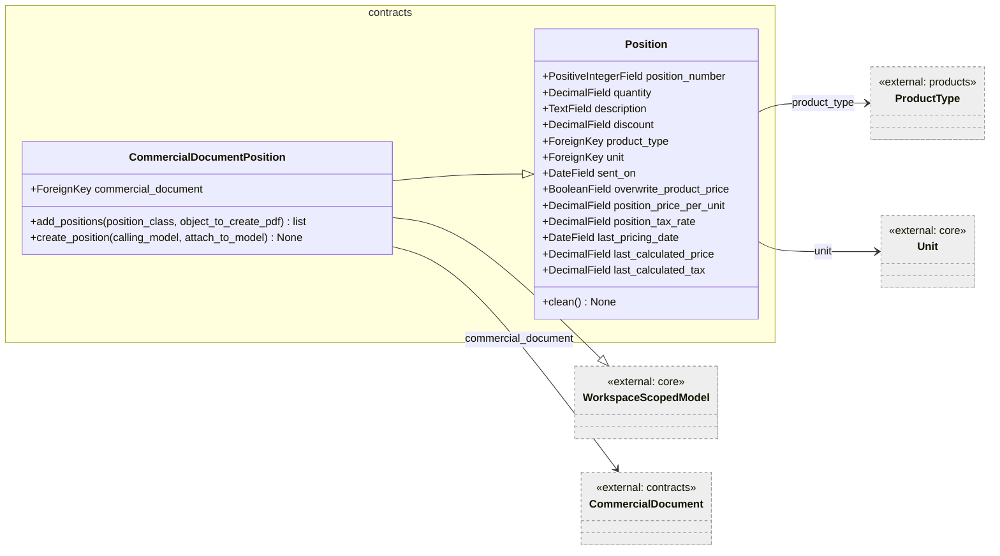

Figure 5 — Position hierarchy

`Position` is an abstract base class (concrete Django model, not abstract in the Python sense) that holds all the line-item fields shared across document types. `CommercialDocumentPosition` extends it via Python multiple inheritance (also inheriting `WorkspaceScopedModel`) and adds the `commercial_document` FK.

The `overwrite_product_price` / `position_price_per_unit` pair allow a user to manually set a price that overrides what the product type's price list would return. The `position_tax_rate` fallback serves the same override role for tax when no `product_type` is linked.

`Meta.ordering = ["position_number"]` guarantees deterministic output order without an explicit `order_by` call.

#### `Position.clean()`

Validates that when no `product_type` is linked, the user has both checked `overwrite_product_price` and provided a `position_price_per_unit`. Both conditions are checked together and reported as separate field-level errors. Also raises a validation error if a `product_type` is referenced but the `products` app is not installed.

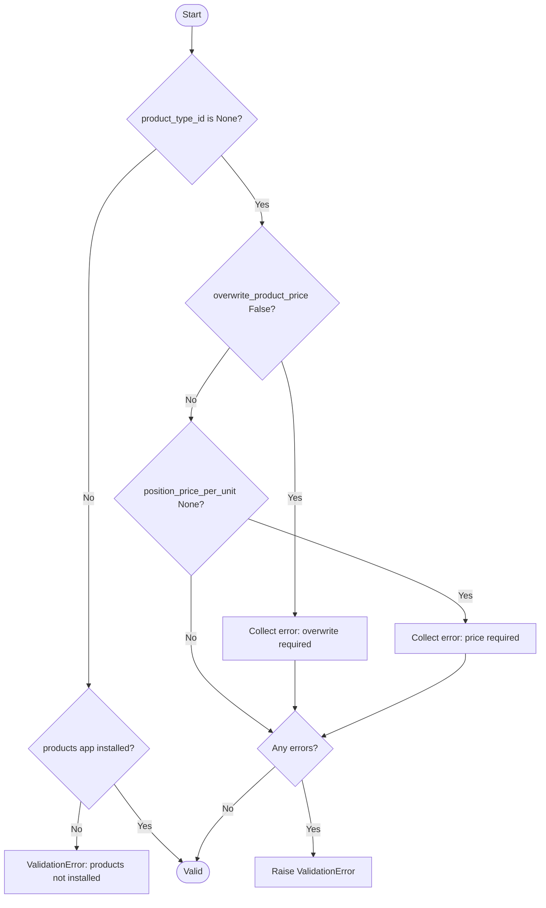

Figure 6 — Position.clean() validation flow

#### `CommercialDocumentPosition.add_positions(position_class, object_to_create_pdf)` (static)

Builds and returns the list of ORM objects that the PDF serialization layer needs. For each position it includes the position itself, the base `Position` row, the `ProductType` (when installed), and the `Unit`. This pre-loading pattern avoids N+1 queries inside the FOP template rendering.

#### `CommercialDocumentPosition.create_position(calling_model, attach_to_model)`

Deep-copies all field values from `calling_model` (a `Position`) onto `self` and sets `commercial_document = attach_to_model`. Used by `CommercialDocument.attach_commercial_document_positions()` to clone line items when deriving a new document from an existing one.

---

### CommercialDocumentMedia

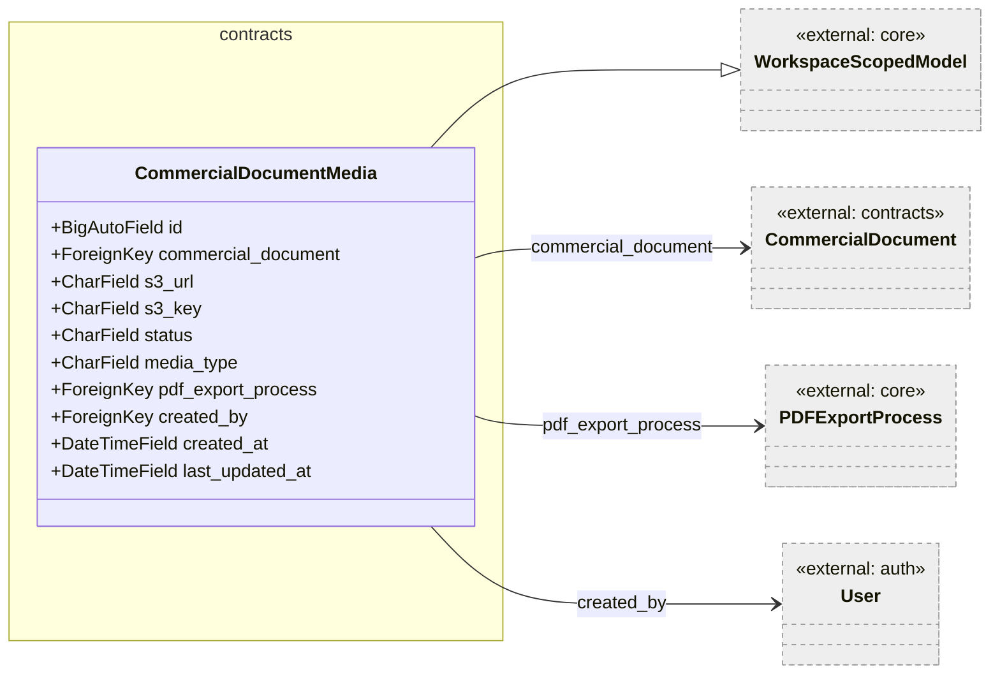

Figure 7 — CommercialDocumentMedia

`CommercialDocumentMedia` is an append-only record created by the Celery PDF export task after a successful upload to S3 or MinIO. The `status` field (`pending`, `processing`, `completed`, `failed`) reflects the lifecycle of the async export. The `s3_key` stores the object key inside the bucket while `s3_url` stores the full, directly accessible URL.

`pdf_export_process` is nullable (`SET_NULL` on delete) so media records survive process-record cleanup. `created_by` is nullable for the same reason.

The model enforces no mutation after creation at the ORM level; the ViewSet limits HTTP verbs to `GET` and `POST` only.

---

### Invoice

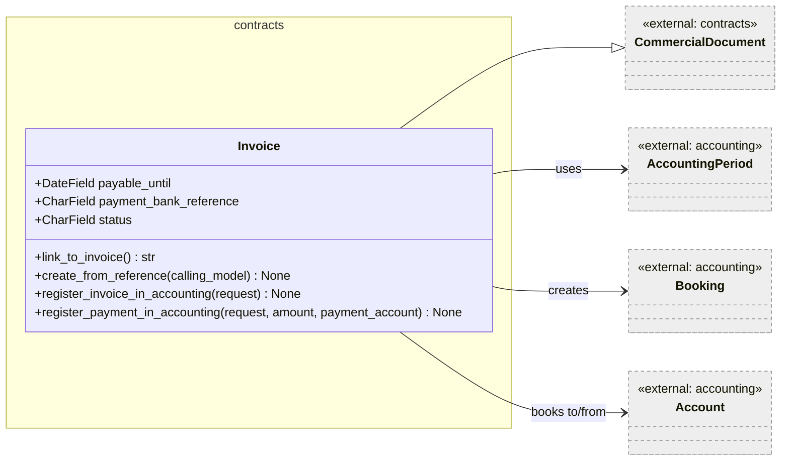

Figure 8 — Invoice

`Invoice` extends `CommercialDocument` with a payment deadline (`payable_until`), an optional bank reference, and a status code from the `INVOICESTATUS` choices. It is the only document type that directly integrates with the optional accounting plugin.

`status` is initialised to `'C'` (created) by `create_from_reference`. Information not available: the full status transition graph for invoices — no state machine is defined in the source.

#### `create_from_reference(calling_model)`

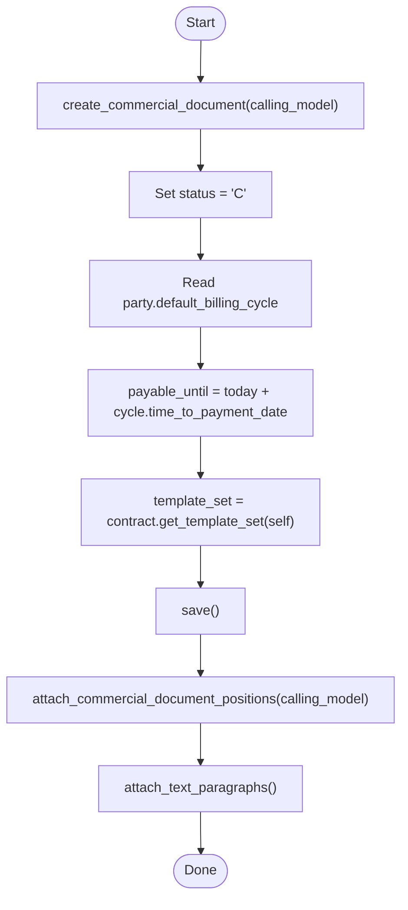

Figure 9 — Invoice.create_from_reference flow

#### `register_invoice_in_accounting(request)`

Groups positions by their `product.accounting_product_categorie.profitAccount`, checks that the invoice has a calculated price and that an open-interest account exists, guards against duplicate registration (raises `InvoiceAlreadyRegistered` if a booking for this invoice already exists in the current period), then creates one `Booking` per profit account — debiting the activa (open-interest) account and crediting each profit account.

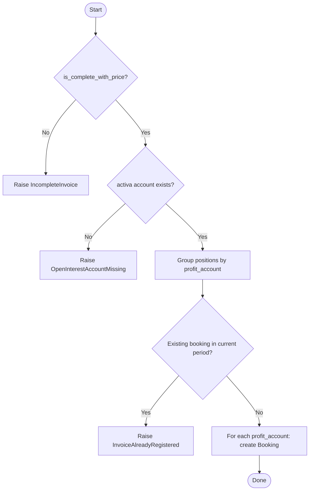

Figure 10 — register_invoice_in_accounting flow

#### `register_payment_in_accounting(request, amount, payment_account)`

Creates a single `Booking` that moves `amount` from the open-interest account to the chosen `payment_account`, recording the actual payment receipt. Unlike `register_invoice_in_accounting` it does not guard against duplicate registration at the model level.

---

### Quotation

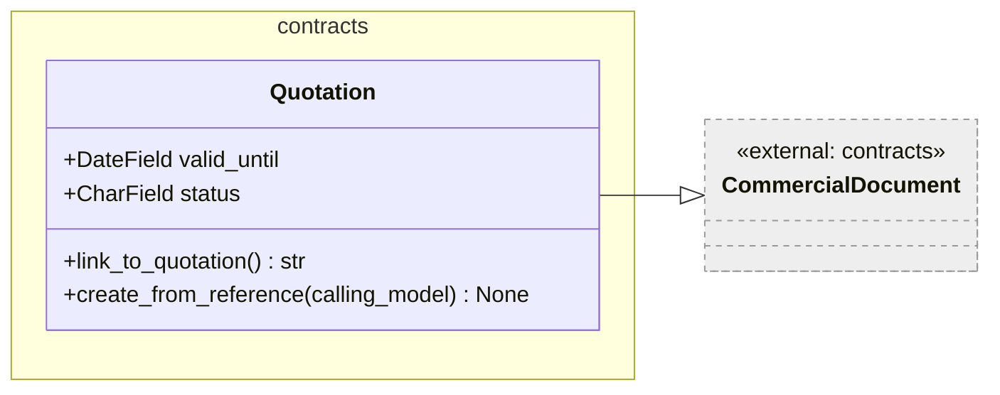

Figure 11 — Quotation

`Quotation` extends `CommercialDocument` with a validity deadline and a status (from `QUOTATIONSTATUS`). Status is initialised to `'I'` (in-progress) by `create_from_reference`. `valid_until` is set to today's date; business users are expected to update it manually.

`create_from_reference` follows the same pattern as Invoice: delegates to `create_commercial_document`, sets type-specific fields, resolves the template, saves, then clones positions and text paragraphs.

---

### SalesOrder

`SalesOrder` extends `CommercialDocument` with no additional fields. `create_from_reference` follows the standard pattern without setting type-specific status or deadline fields. Information not available: the intended lifecycle states for a SalesOrder — no status field exists on this subclass.

---

### PurchaseOrder

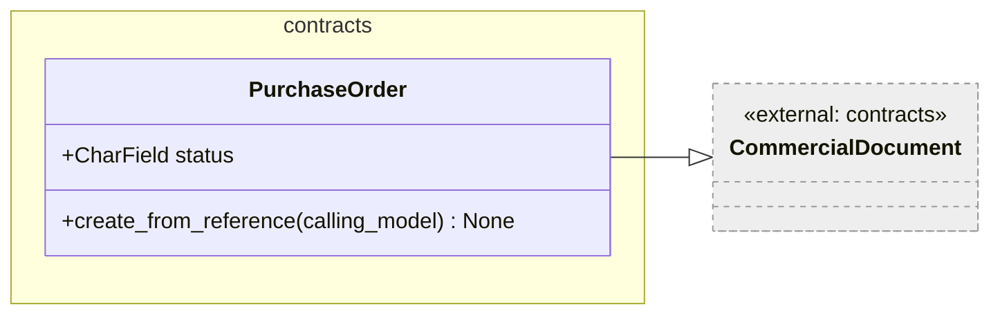

Figure 12 — PurchaseOrder

`PurchaseOrder` uses the inherited `CommercialDocument.party` FK as the supplier reference. A dedicated `supplier` FK was removed in issue #395 G3. Status is initialised to `'O'` (open) by `create_from_reference`. The staff assignment is re-written after `save()` from `calling_model.staff` — this is a leftover pattern from the legacy code; the same value was already set by `create_commercial_document`.

---

### CreditNote

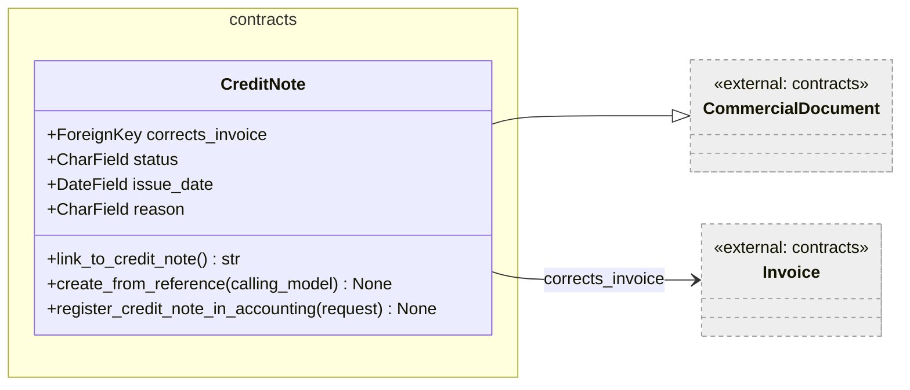

Figure 13 — CreditNote

`CreditNote` is the reversal document for an `Invoice`. When created from an Invoice, `corrects_invoice` is set to that invoice. The `corrects_invoice` FK is nullable so credit notes can also be created from other document types (e.g. from a `Contract`) without a direct invoice link.

`register_credit_note_in_accounting` performs the mirror-image bookings to `register_invoice_in_accounting`: the booking direction is reversed (debit profit account, credit activa) to cancel the original revenue recognition.

---

### DespatchAdvice

`DespatchAdvice` extends `CommercialDocument` with a `tracking_reference` string and a status (from `DESPATCHADVICESTATUS`). Status is initialised to `'C'` (created). It represents the physical shipment notification document in the document lifecycle.

---

### PaymentReminder

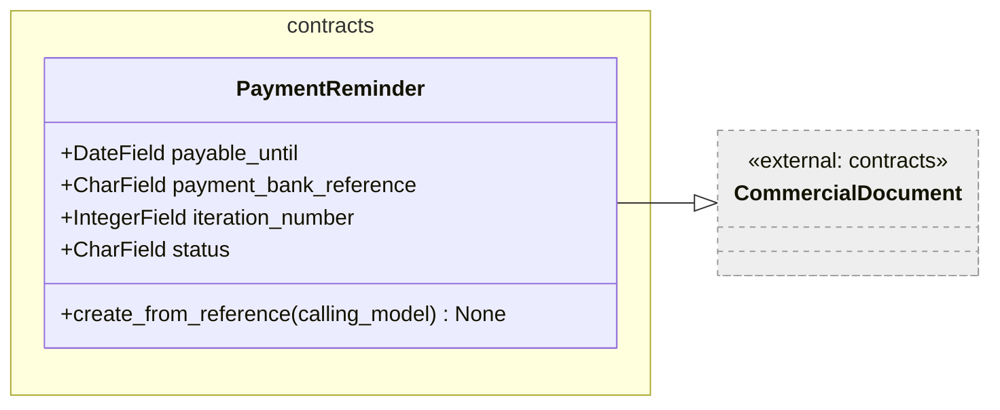

Figure 14 — PaymentReminder

`PaymentReminder` extends `CommercialDocument` with a new payment deadline (derived from `party.default_billing_cycle.payment_reminder_time_to_payment`), an optional bank reference, and an `iteration_number` (constrained 1–3) that tracks which dunning level the reminder represents. Status is initialised to `'C'`.

---

### Calculations

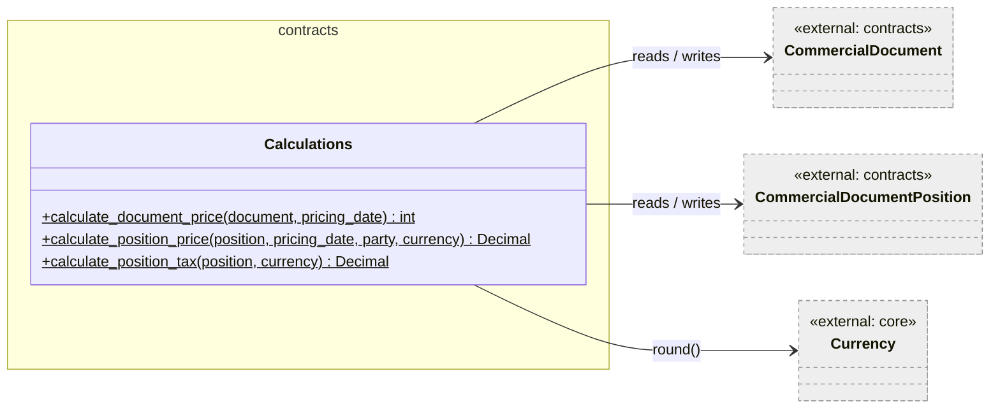

Figure 15 — Calculations service class

`Calculations` is a stateless service class containing only `@staticmethod` methods. It is separated from the models to avoid circular imports. It reads and writes the `last_calculated_price`, `last_calculated_tax`, and `last_pricing_date` cache fields on both documents and positions.

#### `calculate_document_price(document, pricing_date)` (static)

Signature: `calculate_document_price(document: CommercialDocument, pricing_date: date) -> int`

Iterates over all positions of the document, accumulates price and tax, applies the document-level discount, rounds both totals via `currency.round()`, writes the results to the document, and saves. Returns `1` on success.

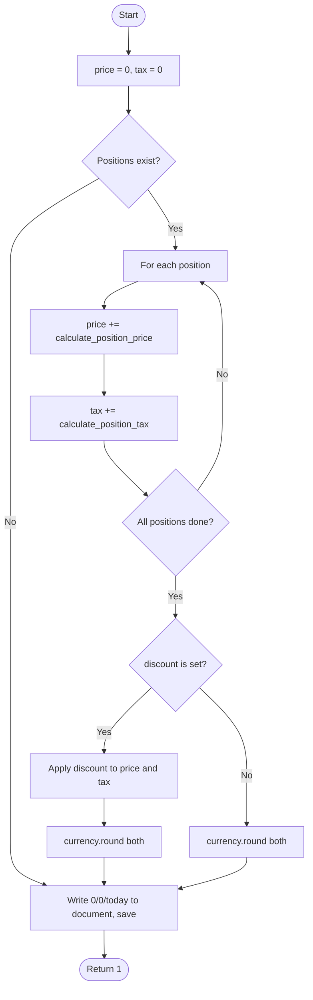

Figure 16 — calculate_document_price flow

#### `calculate_position_price(position, pricing_date, party, currency)` (static)

Signature: `calculate_position_price(position, pricing_date, party, currency) -> Decimal`

Resolves the unit price: if `product_type_id` is absent or `overwrite_product_price` is `True`, uses `position_price_per_unit` directly; otherwise calls `product_type.get_price(pricing_date, unit, party, currency)`. Raises `CommercialDocumentPosition.NoPriceFound` when no price is available. Then multiplies by quantity and applies position-level discount. Saves the result back to the position.

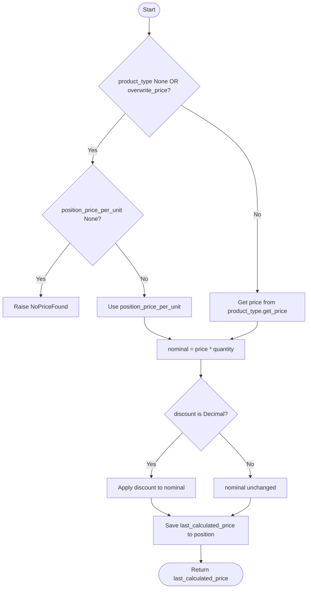

Figure 17 — calculate_position_price flow

#### `calculate_position_tax(position, currency)` (static)

Signature: `calculate_position_tax(position, currency) -> Decimal`

Resolves tax rate in order: (1) `product_type.get_tax_rate()` if a product type is linked, (2) `position_tax_rate` as a position-local fallback, (3) zero. Applies the rate to the discounted nominal total. Saves and returns `last_calculated_tax`.

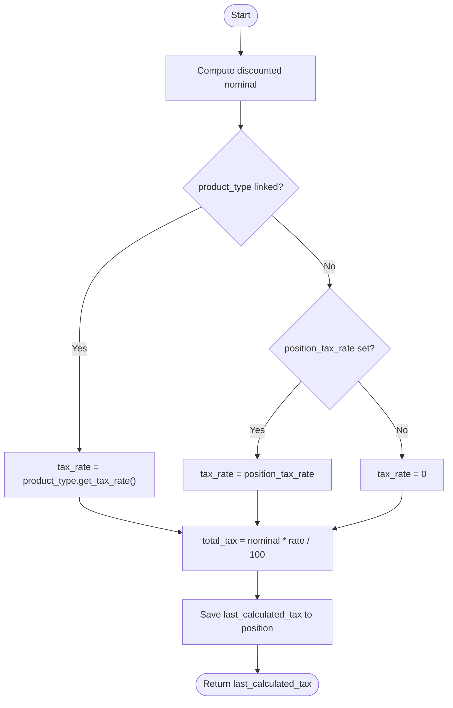

Figure 18 — calculate_position_tax flow

---

## Persistent Storage

All model classes write to the PostgreSQL database. The relevant tables (from `db_table` declarations) are:

| Table | Class |
|-------|-------|
| `crm_contract` | `Contract` |
| `crm_contractaddressassignment` | `ContractAddressAssignment` |
| `crm_contractphoneassignment` | `ContractPhoneAssignment` |
| `crm_contractemailassignment` | `ContractEmailAssignment` |
| `crm_commercialdocument` | `CommercialDocument` |
| `crm_textparagraphincommercialdocument` | `TextParagraphInCommercialDocument` |
| `crm_commercialdocumentaddressassignment` | `CommercialDocumentAddressAssignment` |
| `crm_commercialdocumentphoneassignment` | `CommercialDocumentPhoneAssignment` |
| `crm_commercialdocumentemailassignment` | `CommercialDocumentEmailAssignment` |
| `crm_position` | `Position` |
| `crm_commercialdocumentposition` | `CommercialDocumentPosition` |
| `crm_commercialdocumentmedia` | `CommercialDocumentMedia` |
| `crm_invoice` | `Invoice` |
| `crm_quotation` | `Quotation` |
| `crm_salesorder` | `SalesOrder` |
| `crm_purchaseorder` | `PurchaseOrder` |
| `crm_creditnote` | `CreditNote` |
| `crm_despatchadvice` | `DespatchAdvice` |
| `crm_paymentreminder` | `PaymentReminder` |

Django MTI means that `Invoice` rows span two tables: `crm_commercialdocument` for the base fields and `crm_invoice` for the subclass-specific fields, joined on the shared primary key.

The `Calculations` class writes directly to position and document rows without going through a dedicated service transaction. If `calculate_document_price` raises mid-loop, partial position updates may be committed while the document header remains at its previous value. Information not available: whether a compensating transaction or retry mechanism exists at the call site.

---

## In-Memory State

None of the classes in this module maintain in-memory state between requests. The `Calculations` class is fully stateless.

---

## Access to External Interfaces

| Interface | Type of Call | Expected Duration | Notes |
|-----------|--------------|-------------------|-------|
| `product_type.get_price(...)` | Blocking DB read (via products app) | ~10–50 ms | Called once per position in price recalculation |
| `product_type.get_tax_rate()` | Blocking DB read or attribute | ~1–5 ms | Called once per position |
| `currency.round(value)` | In-process computation | < 1 ms | No external call |
| `accounting.models.*` | Blocking DB read/write (optional plugin) | ~20–100 ms | Guarded by local import to keep accounting optional |
| `UserExtension.get_user_extension(id)` | Blocking DB read | ~5–20 ms | Called once per contract creation from reference |

---

## Security

### Assets

| Asset | Description | Security Measure | Assessment of Criticality |
|-------|-------------|------------------|---------------------------|
| `party_reference` | Opaque reference string from external party | Stored as plain text; no PII enforcement | Uncritical in isolation; depends on what callers put in |
| `ext_business_appl_references` | JSON blob with external system references | Stored as plain JSON; no encryption | Uncritical — opaque identifiers only |
| `payment_bank_reference` | Bank reference string on invoices and payment reminders | Stored as plain text | Uncritical — not a secret credential |

No credentials or cryptographic secrets are stored in these models.

---

## Design Patterns Used

### Multi-Table Inheritance (MTI)

`CommercialDocument` serves as the shared parent table for all document types. Django stores base fields in `crm_commercialdocument` and subclass-specific fields in each subclass's table, joined on the primary key. This allows polymorphic queries on the parent and type-safe access through the subclass.

### Factory Method

`Contract.create_invoice()`, `Contract.create_quotation()`, and `Contract.create_purchase_order()` are factory methods that encapsulate the instantiation and initialisation protocol for each document type.

### Template Method

`create_from_reference()` on each document subclass follows a fixed skeleton: call `create_commercial_document()`, set type-specific fields, call `contract.get_template_set()`, `save()`, `attach_commercial_document_positions()`, `attach_text_paragraphs()`. The common steps are inherited; subclasses extend only the type-specific fields.

### Stateless Service

`Calculations` implements the price and tax computation as a pure stateless service class with only `@staticmethod` methods, avoiding any coupling to a specific document instance at class scope.

---

## External Dependencies

| Requirement | Version/Details | Notes |
|-------------|-----------------|-------|
| Django ORM | Django ≥ 4.x (inferred from `JSONField` and `BigAutoField` usage) | All model classes depend on `django.db.models` |
| `koalixcrm.core` | Internal | Provides `WorkspaceScopedModel`, `Currency`, `Unit`, `PDFExportProcess` |
| `koalixcrm.contacts` | Internal | Provides `Party`, `Address`, `PhoneNumber`, `PartyEmail` |
| `koalixcrm.djangoUserExtension` | Internal | Provides `DocumentTemplate`, `TemplateSet`, `TextParagraphInDocumentTemplate`, `UserExtension` |
| `koalixcrm.products` | Internal, optional | Provides `ProductType` with price and tax-rate resolution; guarded by `apps.is_installed()` |
| `koalixcrm.accounting` | Internal, optional | Provides `Booking`, `AccountingPeriod`, `Account`; guarded by local import |

---

## Appendix

### References

- Source files: `koalixcrm/contracts/models/`
- Related documentation: [`QQ_LL_Doc_Contracts_ViewsSerializers.md`](./QQ_LL_Doc_Contracts_ViewsSerializers.md), [`QQ_LL_Doc_Contracts_Admin.md`](./QQ_LL_Doc_Contracts_Admin.md)

### List of Illustrations

| Figure | Title |
|--------|-------|
| Figure 1 | Contract and its contact-assignment satellites |
| Figure 2 | get_template_set flow |
| Figure 3 | CommercialDocument and its satellites |
| Figure 4 | create_commercial_document dispatch |
| Figure 5 | Position hierarchy |
| Figure 6 | Position.clean() validation flow |
| Figure 7 | CommercialDocumentMedia |
| Figure 8 | Invoice |
| Figure 9 | Invoice.create_from_reference flow |
| Figure 10 | register_invoice_in_accounting flow |
| Figure 11 | Quotation |
| Figure 12 | PurchaseOrder |
| Figure 13 | CreditNote |
| Figure 14 | PaymentReminder |
| Figure 15 | Calculations service class |
| Figure 16 | calculate_document_price flow |
| Figure 17 | calculate_position_price flow |
| Figure 18 | calculate_position_tax flow |
