# Low-Level Documentation: Contracts — Views and Serializers

## Introduction

### Scope

This document covers all Django REST Framework ViewSets, mixins, and serializer classes defined in:

| Directory | Files |
|-----------|-------|
| `koalixcrm/contracts/views/` | `contract_view_set.py`, `invoice_view_set.py`, `quotation_view_set.py`, `sales_order_view_set.py`, `purchase_order_view_set.py`, `credit_note_view_set.py`, `despatch_advice_view_set.py`, `payment_reminder_view_set.py`, `commercial_document_media_view_set.py`, `commercial_document_position_view_set.py`, `nested_detail_mixin.py`, `newdocument.py` |
| `koalixcrm/contracts/serializers/` | `contract_serializer.py`, `commercial_document_serializer.py`, `invoice_serializer.py`, `quotation_serializer.py`, `sales_order_serializer.py`, `purchase_order_serializer.py`, `credit_note_serializer.py`, `despatch_advice_serializer.py`, `payment_reminder_serializer.py`, `commercial_document_position_serializer.py`, `commercial_document_media_serializer.py`, `nested_commercial_document.py` |

### Target Audience

The primary audience for this documentation is the software development engineer responsible for maintaining the REST API layer or developing integrations with the contracts module.

### Glossary

| Term/Acronym | Full Form | Description |
|--------------|-----------|-------------|
| DRF | Django REST Framework | The HTTP API framework used for ViewSets and serializers |
| ViewSet | — | DRF class that bundles list/create/retrieve/update/destroy actions |
| CRUD serializer | — | Flat serializer used for normal read/write API operations |
| Nested serializer | — | Deep, read-only serializer that assembles the full document snapshot for the PDF worker |
| PDF worker | — | External Java service that consumes the nested endpoint and renders PDFs |
| UBL | Universal Business Language | OASIS XML standard; the nested shape mirrors the UBL document structure |
| Party | — | Abstract contact entity; resolved to `Organization` or `PartyContact` at runtime |
| Tax summary | — | Aggregation of position tax amounts grouped by tax rate |
| Workspace | — | Tenant-level scoping entity; all queryset filters use `workspace` |

---

## Detailed Component

### ViewSets

#### ContractViewSet

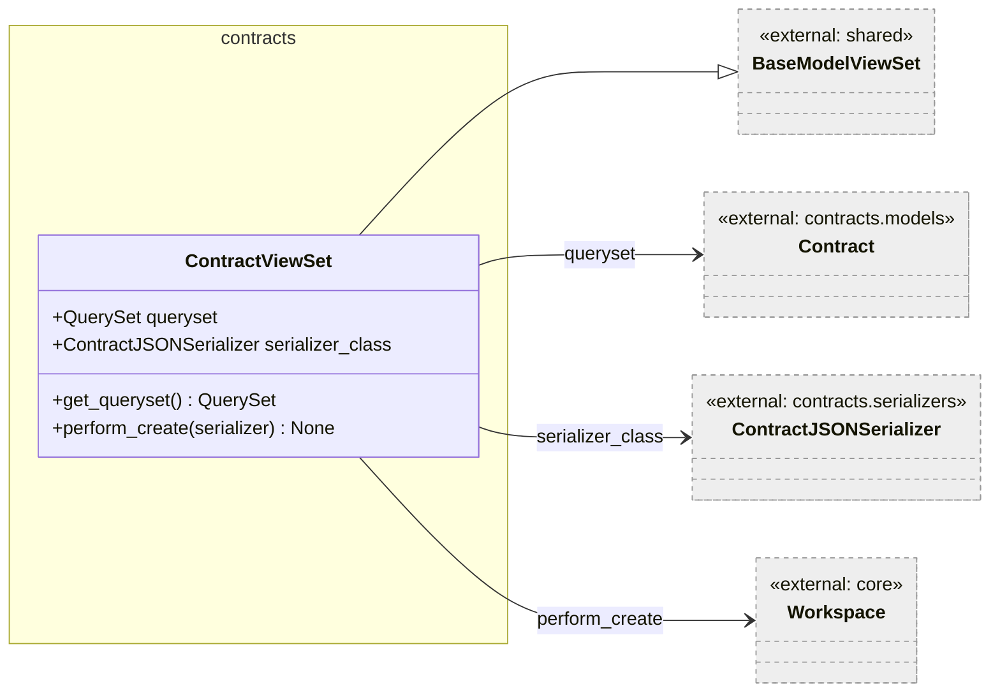

Figure 1 — ContractViewSet

`ContractViewSet` exposes the standard CRUD operations for `Contract`. It inherits from `BaseModelViewSet` (from `koalixcrm.shared`), which provides DRF's `ModelViewSet` behaviour with any project-wide permission and authentication configuration.

##### `get_queryset()`

Signature: `get_queryset(self) -> QuerySet[Contract]`

Returns all contracts for superusers, filters by the request's `active_workspace` for regular users, and returns an empty queryset when no workspace is active.

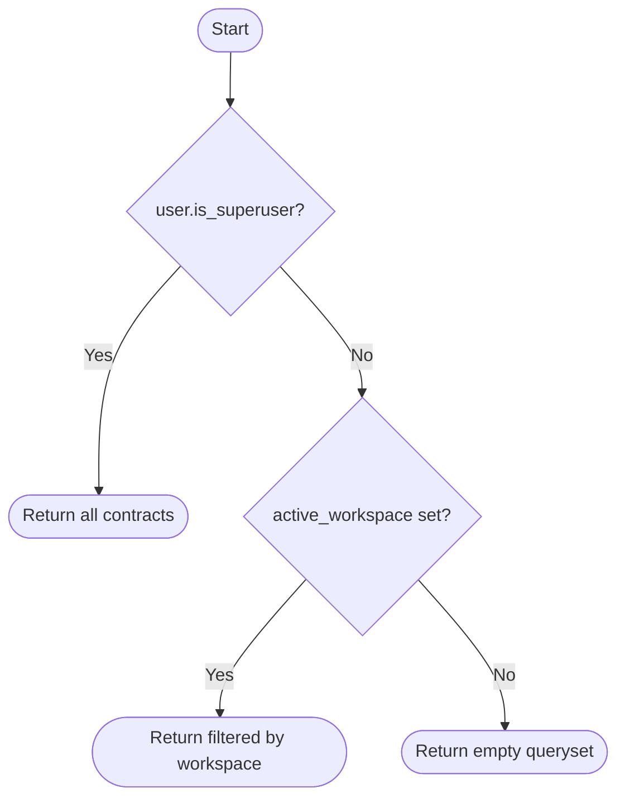

Figure 2 — ContractViewSet.get_queryset flow

##### `perform_create(serializer)`

Signature: `perform_create(self, serializer: BaseSerializer) -> None`

Resolves the workspace for the new object. For superusers without an active workspace, it falls back to creating or reusing a `Default Workspace` record. Then saves with `workspace=active`.

---

#### Document ViewSets (InvoiceViewSet, QuotationViewSet, PurchaseOrderViewSet, CreditNoteViewSet, DespatchAdviceViewSet, PaymentReminderViewSet)

All six document-type ViewSets share the same structural pattern and are documented together.

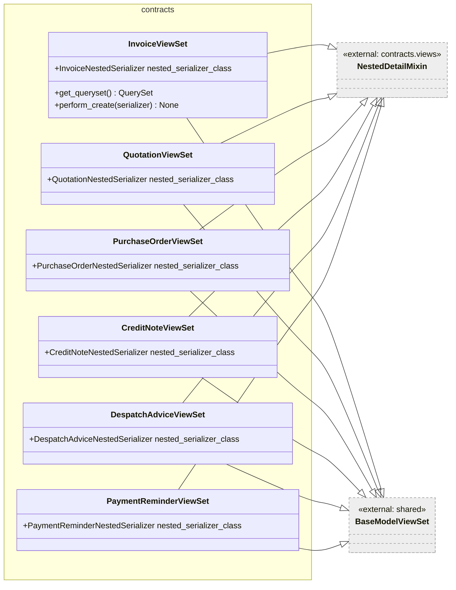

Figure 3 — Document ViewSet inheritance

Each ViewSet:

- Sets `queryset` to `DocumentType.objects.all()`
- Sets `serializer_class` to the flat `DocumentTypeJSONSerializer`
- Sets `nested_serializer_class` to the deep `DocumentTypeNestedSerializer`
- Overrides `get_queryset()` with the same workspace-scoping logic as `ContractViewSet`
- Overrides `perform_create()` with the same workspace-assignment logic

`SalesOrderViewSet` follows the same pattern but does not mix in `NestedDetailMixin` — no nested endpoint is exposed for sales orders.

---

#### NestedDetailMixin

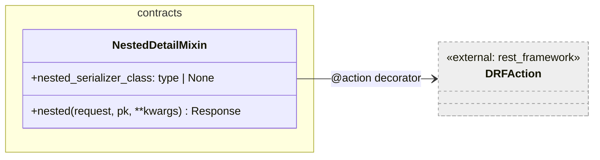

Figure 4 — NestedDetailMixin

`NestedDetailMixin` adds a single read-only detail action at `GET /{model}/{id}/nested/`. It resolves the object via `self.get_object()` (which applies the ViewSet's normal permission and queryset pipeline) and serializes it through `nested_serializer_class`.

Subclasses must set `nested_serializer_class`; failing to do so raises `NotImplementedError` at call time, not at class-definition time.

The mixin deliberately keeps normal write operations flowing through the simpler flat serializers, so the nested endpoint is purely for reading — intended for the PDF worker to obtain a complete document snapshot in one request.

##### `nested(request, pk, **kwargs)`

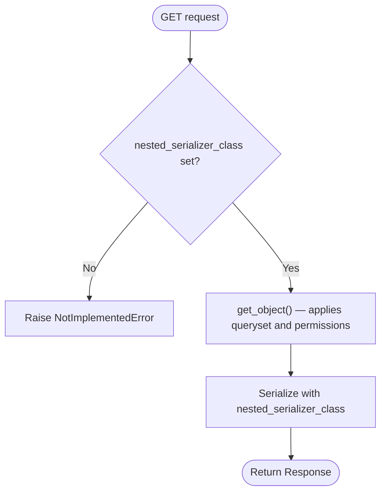

Figure 5 — NestedDetailMixin.nested flow

---

#### CommercialDocumentMediaViewSet

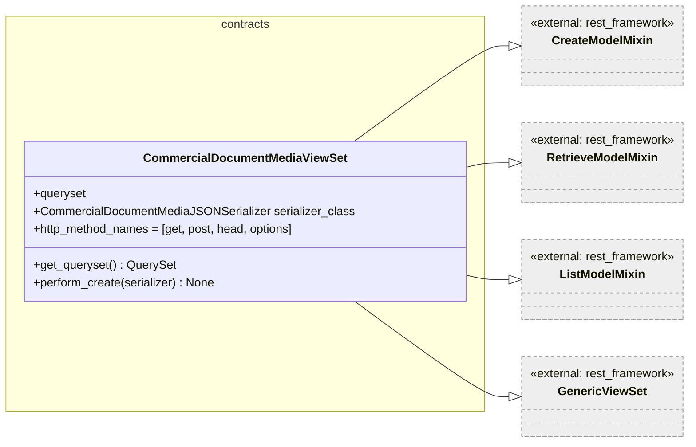

Figure 6 — CommercialDocumentMediaViewSet

`CommercialDocumentMediaViewSet` deliberately omits update and delete mixins. Media records are append-only: the PDF worker POSTs a row after a successful S3 upload; no client may modify or remove it. The `http_method_names` list enforces this at the ViewSet level. `permission_classes` includes both `IsAuthenticated` and `ModelPermissionsWithListView` (a project-level custom permission class).

---

#### CommercialDocumentPositionViewSet

Standard `BaseModelViewSet` for line items. `get_queryset()` and `perform_create()` follow the same workspace-scoping pattern as the other ViewSets.

---

#### CreateNewDocumentView

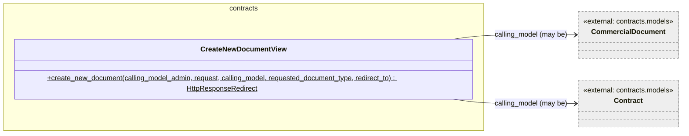

Figure 7 — CreateNewDocumentView

`CreateNewDocumentView` is a utility class (not a DRF ViewSet) that encapsulates the admin-action document-creation flow. Its sole static method `create_new_document` instantiates a `requested_document_type`, calls `create_from_reference(calling_model)`, and returns a redirect to the new document's admin change view. On `TemplateSetMissingInContract` or `TemplateMissingInTemplateSet` it redirects to the relevant admin page and messages the user with an error instead of raising an HTTP 404.

##### `create_new_document(calling_model_admin, request, calling_model, requested_document_type, redirect_to)` (static)

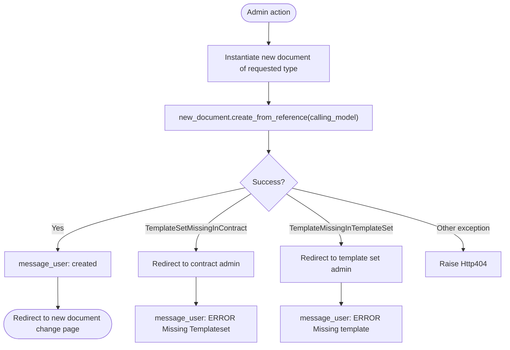

Figure 8 — create_new_document flow

---

### Serializers

#### Flat (CRUD) Serializers

All flat serializers follow the same minimal pattern: a `ModelSerializer` subclass with a `Meta` inner class. Most declare `fields = '__all__'` with `read_only_fields = ('workspace',)` where applicable.

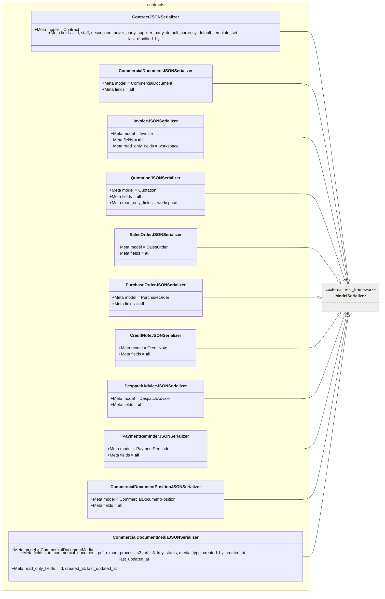

Figure 9 — Flat serializer hierarchy

`ContractJSONSerializer` is the only serializer that enumerates fields explicitly rather than using `'__all__'`, excluding auto-timestamps and workspace from the API surface.

`CommercialDocumentMediaJSONSerializer` declares an explicit field list and marks `id`, `created_at`, and `last_updated_at` as read-only, preventing clients from overriding system-assigned values.

---

#### Nested Serializers (`nested_commercial_document.py`)

The nested serializer module assembles the full document snapshot that the Java PDF worker reads via `GET /{document-type}/{id}/nested/`. It contains several collaborating classes.

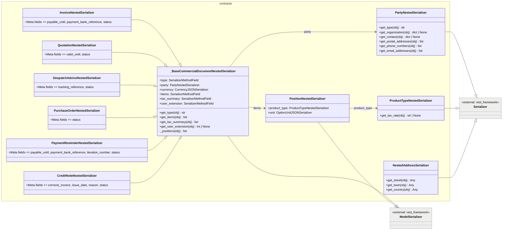

Figure 10 — Nested serializer hierarchy

##### `_BaseCommercialDocumentNestedSerializer`

The private base class provides the common fields for all document types. It is not registered to a model directly; subclasses set their `Meta.model` to the concrete Django model. The `fields` tuple is inherited and extended by each subclass via Python class-level `Meta` inheritance.

**`get_type(obj)`** returns the concrete Python class name (e.g. `"Invoice"`) so the PDF worker can select the correct XmlBuilder without inspecting the URL.

**`_positions(obj)`** (private) fetches `CommercialDocumentPosition` rows for the document ordered by `position_number`. It is called by both `get_items` and `get_tax_summary` to avoid code duplication, but this means two separate DB queries are issued per nested request — one for items, one for the tax summary.

**`get_items(obj)`** passes the position list through `PositionNestedSerializer` and returns the serialized list.

**`get_tax_summary(obj)`** delegates to the module-level `_compute_tax_summary` function.

**`get_user_extension(obj)`** looks up the `UserExtension` linked to `obj.staff_id` and returns its `id` (or `None`). The PDF worker fetches the full user-extension data from a separate endpoint using this id.

##### `PartyNestedSerializer`

Resolves a `Party` to either an `Organization` or a `PartyContact` by querying the MTI satellite tables directly. Returns a discriminated structure with a `type` field (`"organization"` / `"contact"` / `"party"`) so the PDF worker can pick the appropriate name rendering path.

Address, phone, and email data are sourced from the assignment tables (`AddressAssignment`, `PhoneAssignment`, `EmailAssignment`) rather than from embedded fields, reflecting the loose-link contact model.

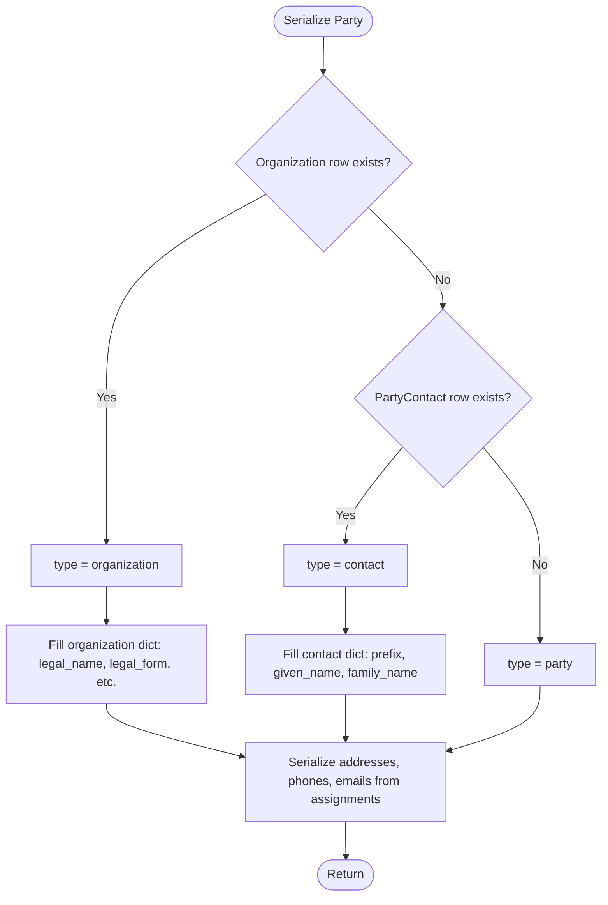

Figure 11 — PartyNestedSerializer resolution flow

##### `_compute_tax_summary(positions)` (module-level function)

Signature: `_compute_tax_summary(positions: list[CommercialDocumentPosition]) -> list[dict[str, str]]`

Aggregates positions by tax rate into an `OrderedDict`. For each position it resolves the rate key from (1) `product_type.tax.get_tax_rate()`, (2) `position_tax_rate`, or (3) the literal string `"unknown"`. Accumulates `taxable_amount` and `tax_amount` per bucket, then converts all `Decimal` values to strings for JSON serialization.

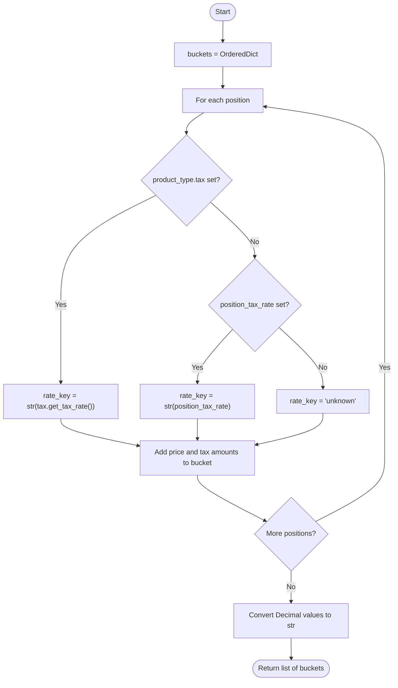

Figure 12 — _compute_tax_summary flow

---

## In-Memory State

None of the serializer or ViewSet classes maintain in-memory state between requests. `_compute_tax_summary` operates on a list passed in per call.

The `_positions()` private method on `_BaseCommercialDocumentNestedSerializer` is called twice per nested request (once for `get_items`, once for `get_tax_summary`). The results are not cached between the two calls.

---

## Access to External Interfaces

| Interface | Type of Call | Expected Duration | Notes |
|-----------|--------------|-------------------|-------|
| Django ORM — position query | Blocking DB read | ~10–30 ms | Called twice per nested request (items + tax summary) |
| Django ORM — Organization/PartyContact MTI lookup | Blocking DB read | ~5–20 ms | Two separate queries per nested serialization |
| Django ORM — AddressAssignment / PhoneAssignment / EmailAssignment | Blocking DB read | ~5–20 ms per assignment type | Three queries inside `PartyNestedSerializer` |
| Django ORM — UserExtension | Blocking DB read | ~5–10 ms | One query in `get_user_extension` |
| `Workspace.objects.get_or_create` | Blocking DB read/write | ~5–20 ms | Called in `perform_create` for superusers without active workspace |

The nested endpoint issues a relatively high number of DB queries per request (positions ×2, party type check ×2, assignments ×3, user extension ×1 = at minimum 9 queries). No `select_related` or `prefetch_related` is applied at the ViewSet level. Information not available: whether the project uses database-level query logging or N+1 detection in CI.

---

## Security

### Assets

| Asset | Description | Security Measure | Assessment of Criticality |
|-------|-------------|------------------|---------------------------|
| Workspace tenancy | All querysets filter by `active_workspace` | Enforced in every `get_queryset` override; superusers bypass | Uncritical for superusers by design; non-superusers cannot access other workspaces |
| Authentication | DRF permission classes on each ViewSet | `IsAuthenticated` + `ModelPermissionsWithListView` on media ViewSet; inherited from `BaseModelViewSet` on others | Information not available: the exact permission classes on `BaseModelViewSet` |

---

## Design Patterns Used

### Mixin Composition

`NestedDetailMixin` and `BaseModelViewSet` are composed via Python multiple inheritance. Each ViewSet that needs the nested endpoint simply adds `NestedDetailMixin` to its base class list.

### Discriminated Serializer

`PartyNestedSerializer` uses a `type` discriminator field to tell the consumer which branch of the party data is populated, avoiding a union type.

### Separate Read/Write Serializers

The flat `*JSONSerializer` classes handle write operations; the `*NestedSerializer` classes handle the deep read for the PDF worker. This separation ensures that write validation stays simple and the nested shape can evolve independently of the CRUD API.

### Append-Only ViewSet

`CommercialDocumentMediaViewSet` restricts itself to create/list/retrieve by only mixing in the three relevant DRF mixins and restricting `http_method_names`.

---

## External Dependencies

| Requirement | Version/Details | Notes |
|-------------|-----------------|-------|
| Django REST Framework | ≥ 3.14 (inferred) | All ViewSets and serializers depend on `rest_framework` |
| `koalixcrm.shared.base_model_view_set` | Internal | Provides `BaseModelViewSet` |
| `koalixcrm.shared.permissions` | Internal | Provides `ModelPermissionsWithListView` |
| `koalixcrm.core.serializers` | Internal | Provides `CurrencyJSONSerializer`, `OptionTaxJSONSerializer`, `OptionUnitJSONSerializer` |
| `koalixcrm.contacts.models` | Internal | Provides `Organization`, `PartyContact`, `AddressAssignment`, `PhoneAssignment`, `EmailAssignment` |
| `koalixcrm.djangoUserExtension.models` | Internal | Provides `UserExtension` |

---

## Appendix

### References

- Source files: `koalixcrm/contracts/views/`, `koalixcrm/contracts/serializers/`
- Related documentation: [`QQ_LL_Doc_Contracts_Models.md`](./QQ_LL_Doc_Contracts_Models.md), [`QQ_LL_Doc_Contracts_Admin.md`](./QQ_LL_Doc_Contracts_Admin.md)

### List of Illustrations

| Figure | Title |
|--------|-------|
| Figure 1 | ContractViewSet |
| Figure 2 | ContractViewSet.get_queryset flow |
| Figure 3 | Document ViewSet inheritance |
| Figure 4 | NestedDetailMixin |
| Figure 5 | NestedDetailMixin.nested flow |
| Figure 6 | CommercialDocumentMediaViewSet |
| Figure 7 | CreateNewDocumentView |
| Figure 8 | create_new_document flow |
| Figure 9 | Flat serializer hierarchy |
| Figure 10 | Nested serializer hierarchy |
| Figure 11 | PartyNestedSerializer resolution flow |
| Figure 12 | `_compute_tax_summary` flow |
