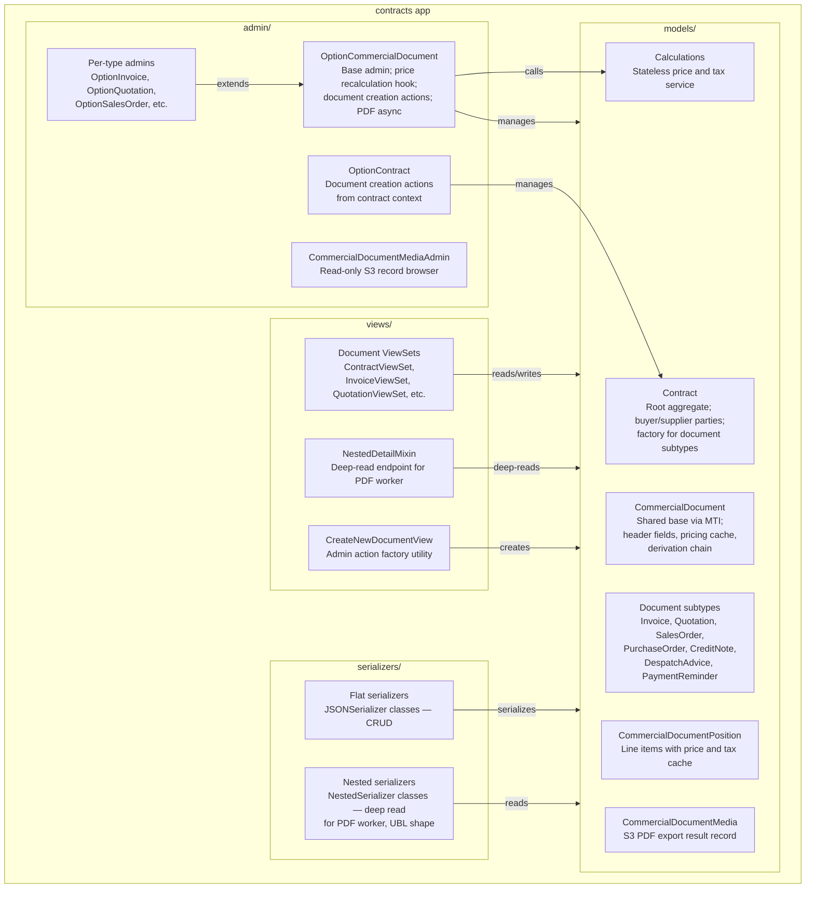
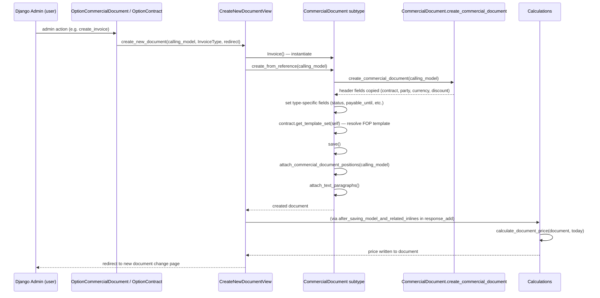
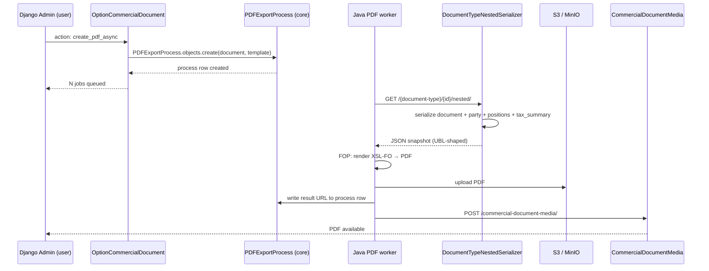
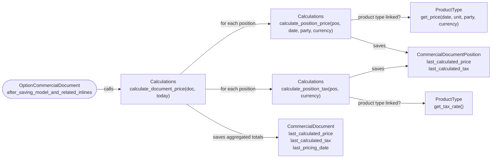
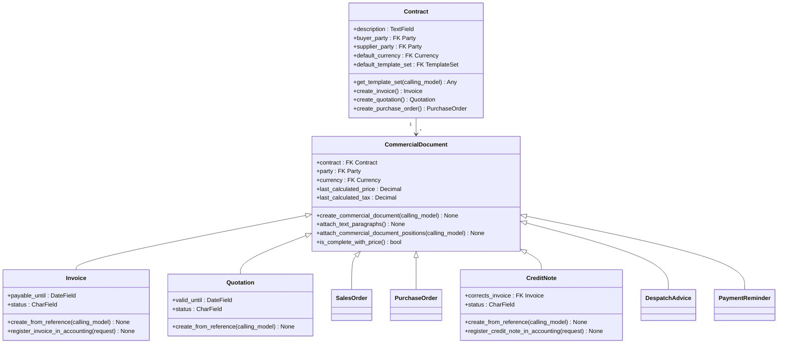
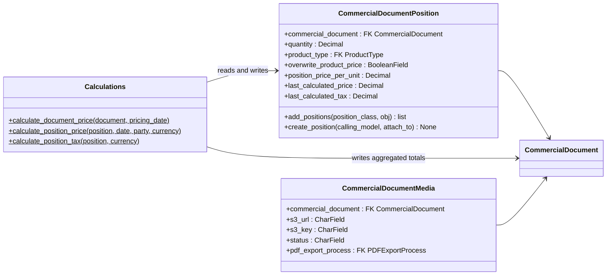
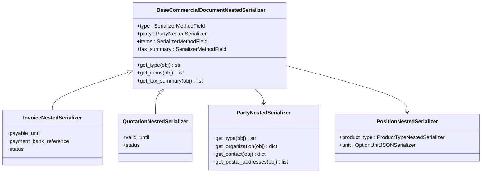

# Mid-Level Documentation — Contracts App

## Introduction

### Purpose of the Package

The `contracts` app manages the commercial document lifecycle within koalixcrm. Its responsibility spans from the initial `Contract` relationship through the creation, pricing, and PDF export of derivative commercial documents: `Quotation`, `SalesOrder`, `Invoice`, `PurchaseOrder`, `CreditNote`, `DespatchAdvice`, and `PaymentReminder`.

The app is the primary producer of commercial documents that are consumed downstream by the accounting plugin (for booking registration) and by the reporting app (for project creation from quotations). It is the owner of the `Contract` aggregate and all document subtypes; other apps depend on it but do not own document state.

### Contents Overview

| Sub-package / module | Responsibility |
|---|---|
| `models/` | Domain model: `Contract`, `CommercialDocument` (base), seven document subtypes, `CommercialDocumentPosition`, `CommercialDocumentMedia`, `Calculations` service class |
| `views/` | DRF ViewSets for all document types, `NestedDetailMixin` (deep read endpoint for the PDF worker), `CreateNewDocumentView` (factory utility) |
| `serializers/` | Flat `*JSONSerializer` classes for CRUD; deep `*NestedSerializer` classes that produce the UBL-shaped snapshot consumed by the Java PDF worker |
| `admin/` | `OptionCommercialDocument` (base admin with price recalculation hook), per-document-type admin extensions, `OptionContract`, and `CommercialDocumentMediaAdmin` |
| `signals/` | Empty module — no signal handlers are currently registered |
| `migrations/` | Django schema migrations (16 files) |
| `const/` | Document status constants (single file) |

### Target Audience

Software development engineers who need to integrate with, extend, or maintain the commercial document lifecycle in koalixcrm. Readers are expected to be familiar with Django, Django REST Framework, and the koalixcrm multi-tenant (`workspace`) model.

### Glossary

| Term/Acronym | Full Form | Description |
|---|---|---|
| MTI | Multi-Table Inheritance | Django pattern where each subclass gets its own DB table linked via a shared primary key to the parent table. |
| FK | Foreign Key | A database relation linking one table's row to another. |
| UBL | Universal Business Language | OASIS standard XML/JSON schema for commercial documents; the nested serializer shape mirrors UBL. |
| PDF worker | — | External Java service that reads the nested endpoint and renders PDFs via FOP. |
| FOP | Apache Formatting Objects Processor | Java component that converts XSL-FO markup to PDF. |
| Party | — | Abstract contact entity; concrete subclasses are `Organization` and `PartyContact`. |
| Workspace | — | Tenant-level scoping entity; every workspace-scoped row carries a `workspace` FK. |
| TemplateSet | — | Container that maps document type names to FOP/XSL-FO templates. |
| DRF | Django REST Framework | The HTTP API library used for all JSON endpoints. |
| PDFExportProcess | — | Core model that queues and tracks async PDF rendering jobs consumed by the Java worker via SQS. |
| PluginProcessor | — | Project-level extension mechanism that allows installed plugins to inject admin inlines and actions. |

---

## Package Diagram

*Figure 1: Internal structure of the contracts app.*

Related low-level documentation:

- [Contracts models](QQ_LL_Doc_Contracts_Models.md)
- [Views and Serializers](QQ_LL_Doc_Contracts_ViewsSerializers.md)
- [Admin and Calculations](QQ_LL_Doc_Contracts_Admin.md)

---

## Interaction Diagrams

### Document Creation Factory Chain

When a user triggers a "Create Invoice" action from a `Contract` or another document in the Django Admin, a factory chain runs synchronously in the HTTP response cycle.

*Figure 2: Factory chain for document creation from a commercial document or contract.*

### PDF Export Async Flow

An admin user selects documents and triggers "Create PDF async". The PDF is rendered by an external Java service and the result is posted back as a `CommercialDocumentMedia` record.

*Figure 3: Asynchronous PDF export triggered from the Django Admin.*

### Price and Tax Calculation Data Flow

After every admin save of a document (via `response_add` / `response_change`), `Calculations.calculate_document_price()` recomputes the cached price and tax totals synchronously.

*Figure 4: Synchronous price and tax recalculation flow triggered on every admin save.*

---

## Class Diagrams per Package

### Contract and document hierarchy

*Figure 5: Contract root aggregate and the MTI document hierarchy. For full field and method lists see [QQ_LL_Doc_Contracts_Models.md](QQ_LL_Doc_Contracts_Models.md).*

### Position and calculations

*Figure 6: Line item and calculation relationships. For full detail see [QQ_LL_Doc_Contracts_Models.md](QQ_LL_Doc_Contracts_Models.md).*

### Nested serializer hierarchy

*Figure 7: Nested serializer hierarchy used by the Java PDF worker. For full detail see [QQ_LL_Doc_Contracts_ViewsSerializers.md](QQ_LL_Doc_Contracts_ViewsSerializers.md).*

---

## Design Patterns Used

**Multi-Table Inheritance (MTI).** `CommercialDocument` is the shared parent table for all seven document types. Django stores common fields in `crm_commercialdocument` and subclass-specific fields in each subclass table, joined on the primary key. This allows polymorphic queries on the parent and type-safe access through the subclass.

**Factory Method.** `Contract.create_invoice()`, `Contract.create_quotation()`, and `Contract.create_purchase_order()` are factory methods that encapsulate the instantiation and initialisation protocol for each document type. The `CreateNewDocumentView.create_new_document()` utility follows the same factory delegation pattern at the admin layer.

**Template Method.** `create_from_reference()` on each document subclass follows a fixed skeleton: call `create_commercial_document()`, set type-specific fields, resolve the FOP template via `contract.get_template_set()`, `save()`, `attach_commercial_document_positions()`, `attach_text_paragraphs()`. The common steps are inherited; subclasses add only their type-specific fields.

**Separate read/write serializers.** Flat `*JSONSerializer` classes handle CRUD API operations. Deep `*NestedSerializer` classes, mounted at `GET /{type}/{id}/nested/` via `NestedDetailMixin`, produce the full UBL-shaped snapshot for the Java PDF worker. This separation keeps write validation simple and allows the nested shape to evolve independently.

**Stateless service class.** `Calculations` contains only `@staticmethod` methods and holds no instance state. It can be called from admin, tests, or management commands without constructing an object.

**Observer-like post-save hook.** `OptionCommercialDocument.response_add()` and `response_change()` call `after_saving_model_and_related_inlines()` after all inlines (including positions) have been saved, ensuring price recalculation runs against the final set of line items without overriding Django's `save_model()`.

**Append-only media records.** `CommercialDocumentMediaViewSet` mixes in only Create/List/Retrieve DRF mixins and restricts `http_method_names` to GET and POST. This enforces append-only semantics: PDF export results written by the Celery/Java worker cannot be modified or deleted via the API.

**Plugin extension point.** `PluginProcessor` appends plugin-provided inlines and actions to class-level lists on `OptionCommercialDocument` and `OptionContract` at module import time, allowing optional plugins (e.g. accounting, reporting) to extend the admin without modifying the contracts app.

---

## Dependencies on Other Modules

| Dependency | Direction | What is used |
|---|---|---|
| `koalixcrm.core` | Inbound | `WorkspaceScopedModel` (base class for all tenant-scoped models), `Currency.round()`, `Unit`, `PDFExportProcess`, `WorkspaceScopedModelAdmin`, `BaseModelViewSet` |
| `koalixcrm.contacts` | Inbound | `Party`, `Organization`, `PartyContact`, address/phone/email assignment models — used for party resolution in nested serializers and for the contact assignment satellites on `Contract` and `CommercialDocument` |
| `koalixcrm.djangoUserExtension` | Inbound | `DocumentTemplate`, `TemplateSet`, `TextParagraphInDocumentTemplate`, `UserExtension` — template resolution and default currency/template set on document creation |
| `koalixcrm.products` | Inbound, optional | `ProductType` with `get_price()` and `get_tax_rate()` — guarded by `apps.is_installed('koalixcrm.products')`; contracts can function without the products app |
| `koalixcrm.accounting` | Inbound, optional | `Booking`, `AccountingPeriod`, `Account` — used only by `Invoice.register_invoice_in_accounting()` and `CreditNote.register_credit_note_in_accounting()`; guarded by local import |
| `koalixcrm.reporting` | Outbound (optional) | `CreateTaskView` — the reporting app reads `Contract` and `CommercialDocument` to create projects; the contracts admin's `create_project` action delegates to the reporting module when it is installed |
| `koalixcrm.shared` | Inbound | `BaseModelViewSet`, `ModelPermissionsWithListView` |
| `koalixcrm.plugin` | Inbound | `PluginProcessor` — extension mechanism for admin inlines and actions |

---

## External Dependencies

| Requirement | Version/Details | Notes |
|---|---|---|
| Django | ≥ 4.x (inferred from `JSONField` and `BigAutoField` usage) | ORM, admin, forms |
| Django REST Framework | ≥ 3.14 (inferred) | All ViewSets and serializers |
| PostgreSQL (via Django ORM) | Any version supported by Django | All model persistence; 16 migration files manage the schema |

---

## Testing

The LL documentation references no dedicated test files within the `contracts` app. The `Calculations` class — particularly the partial-save risk in `calculate_document_price()` when an exception is raised mid-loop — is the highest-value unit-test target. The nested serializer `_compute_tax_summary()` function and the `PartyNestedSerializer` MTI branch logic are the next highest-value targets.

---

## Appendix

### References

- [Contracts models](QQ_LL_Doc_Contracts_Models.md)
- [Views and Serializers](QQ_LL_Doc_Contracts_ViewsSerializers.md)
- [Admin and Calculations](QQ_LL_Doc_Contracts_Admin.md)
- Django MTI documentation: <https://docs.djangoproject.com/en/stable/topics/db/models/#multi-table-inheritance>
- Django REST Framework: <https://www.django-rest-framework.org/>

### List of Illustrations

| Figure | Title |
|---|---|
| Figure 1 | Contracts app internal structure |
| Figure 2 | Document creation factory sequence |
| Figure 3 | Async PDF export sequence |
| Figure 4 | Price and tax calculation data flow |
| Figure 5 | Contract and CommercialDocument MTI hierarchy |
| Figure 6 | Position and Calculations relationships |
| Figure 7 | Nested serializer structure for PDF worker |
