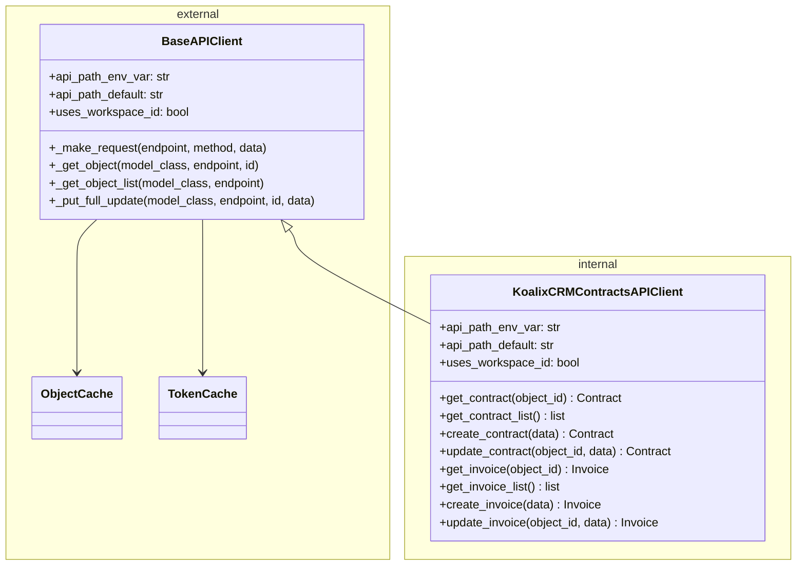
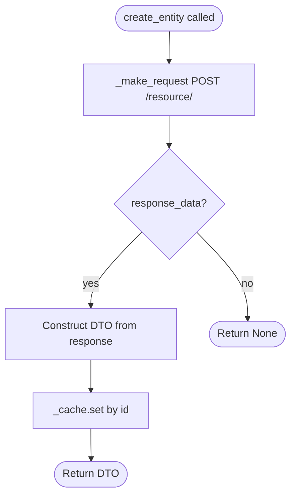
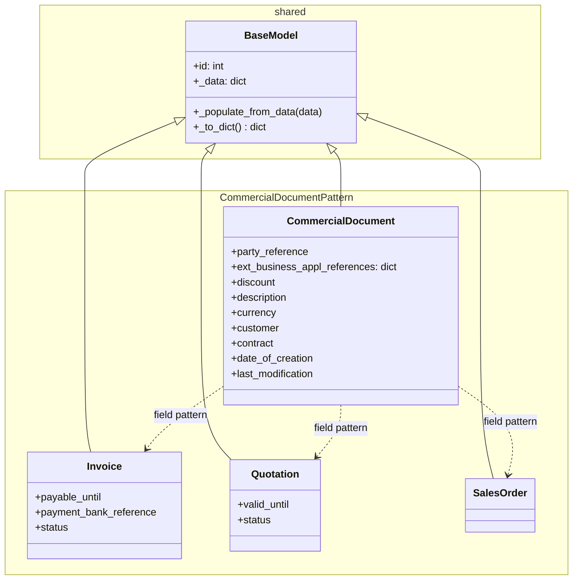
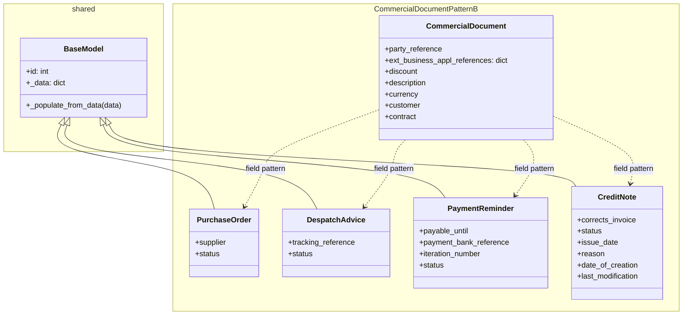
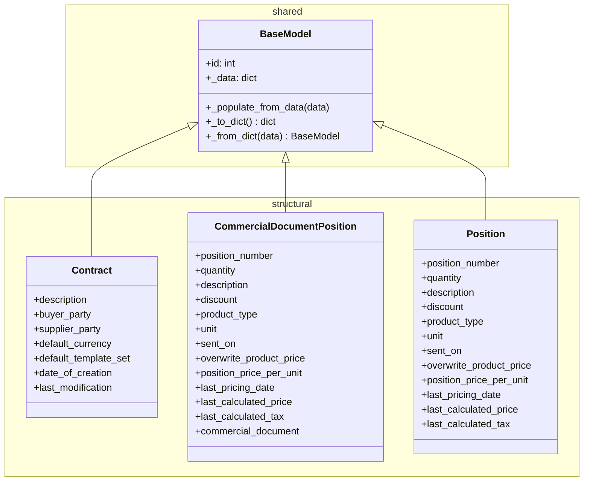

# Low-Level Documentation: `koalixcrm/contracts_api_py`

**Arc42 Chapter 5 — Building Block View, Level 3**
**Package:** `koalixcrm/contracts_api_py`
**Date:** 2026-06-26

---

## 1. Introduction

### 1.1 Scope

This document provides source-level documentation for the `koalixcrm/contracts_api_py` Python package. The package is the programmatic client for the KoalixCRM Contracts REST API. It exposes a typed, cache-aware API client class and a corresponding set of Data Transfer Objects (DTOs) that represent the entities managed by the Contracts service. The package also re-exports the Django REST Framework ViewSets that back the server-side endpoints, placing both sides of the interface in a single importable location.

The source files covered are:

- `koalixcrm/contracts_api_py/contracts_api_client.py` — `KoalixCRMContractsAPIClient`
- `koalixcrm/contracts_api_py/contracts_api.py` — ViewSet re-export module
- `koalixcrm/contracts_api_py/dto/commercial_document.py` — `CommercialDocument`
- `koalixcrm/contracts_api_py/dto/invoice.py` — `Invoice`
- `koalixcrm/contracts_api_py/dto/quotation.py` — `Quotation`
- `koalixcrm/contracts_api_py/dto/purchase_order.py` — `PurchaseOrder`
- `koalixcrm/contracts_api_py/dto/sales_order.py` — `SalesOrder`
- `koalixcrm/contracts_api_py/dto/despatch_advice.py` — `DespatchAdvice`
- `koalixcrm/contracts_api_py/dto/payment_reminder.py` — `PaymentReminder`
- `koalixcrm/contracts_api_py/dto/credit_note.py` — `CreditNote`
- `koalixcrm/contracts_api_py/dto/contract.py` — `Contract`
- `koalixcrm/contracts_api_py/dto/commercial_document_position.py` — `CommercialDocumentPosition`
- `koalixcrm/contracts_api_py/dto/position.py` — `Position`

### 1.2 Target Audience

This document is intended for backend developers integrating with the KoalixCRM Contracts API from Python, developers maintaining or extending the client library, and architects reviewing the contracts domain boundary.

### 1.3 Glossary

| Term | Definition |
|---|---|
| BaseAPIClient | Shared parent class in `koalixcrm/shared/api_client.py` providing authentication, request execution, caching, and CRUD helpers. |
| BaseModel | Shared parent class in `koalixcrm/shared/base_model.py` providing dict-hydration and serialisation for all DTOs. |
| DTO | Data Transfer Object. A plain Python class hydrated from a JSON response dictionary. |
| M2M | Machine-to-machine OAuth 2.0 client credentials flow used for service-to-service authentication. |
| ObjectCache | In-process per-type identity cache managed by `BaseAPIClient`. |
| ViewSet | A Django REST Framework class bundling list, create, retrieve, update, and destroy handlers for one resource. |
| Workspace ID | A tenant scoping identifier inserted into every URL path when `uses_workspace_id = True`. |

---

## 2. `KoalixCRMContractsAPIClient`

### 2.1 Class Diagram

The diagram below shows the inheritance hierarchy and the internal/external boundary of the client component. External types that are defined outside this package are shown in a separate namespace block.

### 2.2 Description

`KoalixCRMContractsAPIClient` is a concrete subclass of `BaseAPIClient`. It does not override `__init__`; all construction logic, authentication setup, and cache initialisation are handled by the parent class. The subclass contributes only three class-level configuration attributes and the domain-specific CRUD methods.

The `api_path_env_var` attribute is set to `"KOALIXCRM_CONTRACTS_API_PATH"`. At construction time `BaseAPIClient.__init__` reads this variable from the environment; if the variable is absent the value falls back to `api_path_default`, which is `"/koalixcrm_contracts/api/v1/"`. The `uses_workspace_id` flag is set to `True`, which instructs the parent class to insert the caller-supplied workspace identifier as a path segment between the API prefix and every resource endpoint, producing URLs of the form `/koalixcrm_contracts/api/v1/<workspace_id>/<resource>/`.

### 2.3 CRUD Methods

The client exposes four methods per resource entity: `get_<entity>`, `get_<entity>_list`, `create_<entity>`, and `update_<entity>`. The entities covered are Contract, Invoice, Quotation, PurchaseOrder, SalesOrder, DespatchAdvice, PaymentReminder, CommercialDocumentPosition, and CreditNote. The method signatures are uniform across all entities; only the DTO class name and the URL path segment differ.

`get_<entity>(object_id: int)` — Delegates to `BaseAPIClient._get_object`, which first checks the `ObjectCache`. On a cache miss it issues a `GET` request to `/<resource>/<id>/` and constructs the DTO from the response, populating the cache before returning.

`get_<entity>_list()` — Delegates to `BaseAPIClient._get_object_list`. Retrieves the full collection, following Django REST Framework pagination (`next` links) until exhausted. Each item is constructed as a DTO and stored in the `ObjectCache`.

`create_<entity>(data: dict[str, Any])` — Issues a direct `POST` request via `_make_request` rather than using a generic helper. On a successful response (`200` or `201`) it constructs the DTO, stores it in the `ObjectCache` keyed by the returned `id`, and returns it. On failure it returns `None`.

`update_<entity>(object_id: int, data: dict[str, Any])` — Delegates to `BaseAPIClient._put_full_update`. The helper first fetches the current state of the object via `GET`, merges the caller-supplied fields over the fetched payload (excluding read-only fields `id`, `created_at`, and `updated_at`), and submits the merged payload as a `PUT` request. This ensures full-object semantics are satisfied even when the caller supplies only a partial update dictionary.

The flow diagram below captures the create path, which is the only path not delegated to a generic helper:

---

## 3. DTO Classes — Commercial Documents Group

### 3.1 Shared Field Pattern: `CommercialDocument`

`CommercialDocument` is a concrete Python class in `dto/commercial_document.py`. It has no dedicated API endpoint; it is never directly instantiated by the client. Its purpose is to document the canonical set of fields that every commercial document entity in the Contracts domain shares. The concrete document DTOs — `Invoice`, `Quotation`, `PurchaseOrder`, `SalesOrder`, `DespatchAdvice`, `PaymentReminder`, and `CreditNote` — do not Python-inherit from `CommercialDocument`. Instead each declares the same shared fields independently in its own `__init__`. This is a copy-field pattern: the shared structure is conceptual, not implemented through class inheritance.

All DTOs in this group extend `BaseModel` from `koalixcrm/shared/base_model.py`. `BaseModel.__init__` accepts the raw response `dict` and calls `_populate_from_data`, which iterates the dictionary and sets matching attributes on the instance. Fields declared in `__init__` before `super().__init__` serve as typed defaults (all initialised to `None` or an empty dict), ensuring the attribute exists on the object even when the API response omits the key.

The shared fields present across all concrete commercial document DTOs are:

- `party_reference` — an identifier linking the document to a trading party record.
- `ext_business_appl_references` — a dictionary of cross-references to external business applications, defaulting to an empty dict.
- `discount` — the discount amount or rate applicable to the document.
- `description` — a free-text description of the document.
- `currency` — the currency in which the document amounts are expressed.
- `customer` — a reference to the customer associated with the document.
- `contract` — a reference to the parent contract under which this document was issued.

### 3.2 Class Diagram — Commercial Document Subgroup A

This diagram shows the structural relationship between `CommercialDocument` and the first four concrete types. Arrows denote conceptual field inheritance (not Python class inheritance).

### 3.3 `Invoice`

`Invoice` represents a payment demand issued to a customer. In addition to the full set of shared commercial document fields it carries `payable_until`, which is the date by which payment is due; `payment_bank_reference`, which identifies the bank account or payment instruction to be used; and `status`, which tracks the document's lifecycle state (e.g. draft, sent, paid). Unlike `CommercialDocument`, `Invoice` does not declare `date_of_creation` or `last_modification` as explicit defaults — those fields arrive through `_populate_from_data` when the API response includes them.

### 3.4 `Quotation`

`Quotation` represents a commercial offer made to a prospective customer. It extends the shared field set with `valid_until`, the expiry date after which the quoted prices are no longer binding, and `status`, reflecting the quotation's lifecycle (e.g. draft, sent, accepted, rejected). Like `Invoice`, it does not explicitly declare `date_of_creation` or `last_modification` as default attributes.

### 3.5 `SalesOrder`

`SalesOrder` represents a confirmed order from a customer. It carries exactly the shared commercial document fields — `party_reference`, `ext_business_appl_references`, `discount`, `description`, `currency`, `customer`, and `contract` — with no additional unique fields. It does not declare `date_of_creation` or `last_modification` as defaults. Fields of that name present in the API response are populated dynamically by `_populate_from_data`.

### 3.6 Class Diagram — Commercial Document Subgroup B

### 3.7 `PurchaseOrder`

`PurchaseOrder` represents an order placed by the organisation to a supplier. In addition to the shared commercial document fields it adds `supplier`, a reference to the supplying party, and `status`, reflecting the order's processing state. The `customer` field in this context represents the internal entity placing the order. It does not declare `date_of_creation` or `last_modification` as explicit defaults.

### 3.8 `DespatchAdvice`

`DespatchAdvice` represents a shipping notification accompanying a physical goods delivery. It extends the shared commercial document fields with `tracking_reference`, which holds the logistics carrier tracking identifier, and `status`, reflecting whether the advice has been issued or acknowledged. Notably, `DespatchAdvice` does not declare `date_of_creation` or `last_modification` as default attributes; those fields are omitted from the initial defaults and are populated only if present in the API response.

### 3.9 `PaymentReminder`

`PaymentReminder` represents an overdue payment notice sent to a customer. It extends the shared commercial document fields with `payable_until`, the date by which the outstanding balance must be settled; `payment_bank_reference`, identifying the target bank account; `iteration_number`, an integer indicating how many reminders have been issued for the same original invoice; and `status`. It does not declare `date_of_creation` or `last_modification` as explicit defaults.

### 3.10 `CreditNote`

`CreditNote` represents a correction or reversal of a previously issued invoice. It is the only concrete commercial document DTO that explicitly declares both `date_of_creation` and `last_modification` as default attributes in its `__init__`. In addition to the full set of shared commercial document fields it carries `corrects_invoice`, a reference to the invoice being corrected; `status`, reflecting the credit note's lifecycle; `issue_date`, the date the credit note was generated; and `reason`, a free-text explanation for the correction.

---

## 4. DTO Classes — Structural DTOs Group

### 4.1 Class Diagram

### 4.2 `Contract`

`Contract` represents the master agreement between a buyer party and a supplier party. It is the root entity to which all commercial documents (invoices, orders, credit notes, etc.) are associated via their `contract` reference field.

The fields it declares are: `description`, a free-text summary of the agreement; `buyer_party`, a reference to the purchasing organisation or person; `supplier_party`, a reference to the supplying organisation; `default_currency`, the currency applied by default to documents issued under this contract; `default_template_set`, a reference to the document template configuration used when generating PDFs or formatted outputs; `date_of_creation`, the timestamp at which the contract was first persisted; and `last_modification`, the timestamp of the most recent change.

### 4.3 `CommercialDocumentPosition`

`CommercialDocumentPosition` represents a single line item within a commercial document (invoice, sales order, purchase order, etc.). It has a dedicated API endpoint at `/commercial-document-positions/` and is directly managed via the client.

It carries the following fields: `position_number`, an integer ordering the line item within its parent document; `quantity`, the number of units; `description`, a description of the goods or service in this line; `discount`, a line-level discount amount or rate; `product_type`, a reference to the product or service catalogue entry; `unit`, the unit of measure (e.g. piece, kilogram, hour); `sent_on`, the date the goods for this position were physically dispatched; `overwrite_product_price`, a boolean flag that, when true, causes `position_price_per_unit` to take precedence over the catalogue price; `position_price_per_unit`, the manually specified unit price when the overwrite flag is active; `last_pricing_date`, the date at which the pricing was last evaluated; `last_calculated_price`, the computed total price for this position at last evaluation; `last_calculated_tax`, the computed tax amount for this position at last evaluation; and `commercial_document`, a foreign key reference binding the position to its parent commercial document.

### 4.4 `Position`

`Position` carries the same fields as `CommercialDocumentPosition` with the single omission of `commercial_document`. It represents a position record that is not directly bound to a parent document reference within the DTO itself. This variant is used in contexts where the parent document association is carried out of band or is not relevant to the operation being performed. The field set covers `position_number`, `quantity`, `description`, `discount`, `product_type`, `unit`, `sent_on`, `overwrite_product_price`, `position_price_per_unit`, `last_pricing_date`, `last_calculated_price`, and `last_calculated_tax`.

---

## 5. `contracts_api.py` — ViewSet Re-Export Module

`contracts_api.py` is a thin re-export module. It imports the nine Django REST Framework ViewSets from their canonical locations under `koalixcrm.contracts.views.*` and places them in `__all__`, making them importable directly from `koalixcrm.contracts_api_py`. This allows URL router configurations and test harnesses to import all ViewSets from a single stable location without depending on the internal `koalixcrm.contracts.views` path.

The ViewSets re-exported are:

- `ContractViewSet` — from `koalixcrm.contracts.views.contract_view_set`
- `InvoiceViewSet` — from `koalixcrm.contracts.views.invoice_view_set`
- `QuotationViewSet` — from `koalixcrm.contracts.views.quotation_view_set`
- `PurchaseOrderViewSet` — from `koalixcrm.contracts.views.purchase_order_view_set`
- `SalesOrderViewSet` — from `koalixcrm.contracts.views.sales_order_view_set`
- `DespatchAdviceViewSet` — from `koalixcrm.contracts.views.despatch_advice_view_set`
- `PaymentReminderViewSet` — from `koalixcrm.contracts.views.payment_reminder_view_set`
- `CommercialDocumentPositionViewSet` — from `koalixcrm.contracts.views.commercial_document_position_view_set`
- `CreditNoteViewSet` — from `koalixcrm.contracts.views.credit_note_view_set`

The module contains no logic, no configuration, and no side effects. Its role is purely organisational.

---

## 6. Access to External Interfaces

`KoalixCRMContractsAPIClient` communicates exclusively over HTTP or HTTPS with the KoalixCRM backend API. The base URL is resolved at construction time from the `KOALIXCRM_API_URL` environment variable. Every request uses the full path built by combining the API prefix (`/koalixcrm_contracts/api/v1/`), the workspace ID segment (when `workspace_id` is supplied), and the resource-specific endpoint.

The client does not consume any message queues, file systems, or databases directly. It does make one outbound network call to an OIDC well-known endpoint (`CELERY_WORKER_M2M_OIDC_ISSUER/.well-known/openid-configuration`) at startup when using M2M authentication, in order to discover the token endpoint URL before requesting a client credentials token.

The ViewSets re-exported by `contracts_api.py` are server-side components. They are wired into the Django URL router by the application configuration layer and are not called directly by the client-side code in this package.

---

## 7. Security

Authentication credentials and service locations are communicated to the client exclusively through environment variables. No credentials are hard-coded in the source.

| Environment Variable | Purpose |
|---|---|
| `KOALIXCRM_API_URL` | Base URL of the KoalixCRM API server. |
| `KOALIXCRM_CONTRACTS_API_PATH` | Path prefix for the Contracts API. Defaults to `/koalixcrm_contracts/api/v1/`. |
| `CELERY_WORKER_M2M_CLIENT_ID` | OAuth 2.0 client identifier for M2M authentication. |
| `CELERY_WORKER_M2M_CLIENT_SECRET` | OAuth 2.0 client secret for M2M authentication. |
| `CELERY_WORKER_M2M_OIDC_ISSUER` | OIDC issuer URL used for token endpoint discovery. |
| `CELERY_WORKER_M2M_SCOPE` | Optional OAuth 2.0 scope requested with the client credentials grant. |
| `X_CUSTOM_ORIGIN_VERIFICATION_ON` | Enables the custom origin verification header when set to `true`. |
| `X_CUSTOM_ORIGIN_VERIFICATION_KEY` | Secret value placed in the `X-Custom-Origin-Verify` header when origin verification is active. |
| `KOALIXCRM_TOKEN_SAVE_TO_ENV` | When `true`, persists the obtained access token back to the environment for reuse across process boundaries. |

Tokens are cached in `TokenCache` to avoid redundant network round-trips to the OIDC provider. On a `401` or `403` response the client clears the cache and retries exactly once with a freshly obtained token before propagating the failure as `None`.

When `username` and `password` are supplied to the constructor instead of M2M credentials, the client switches to HTTP Basic Authentication. The credentials are base64-encoded and placed in the `Authorization: Basic` header on every request. This mode is intended for integration testing with Django `LiveServerTestCase` environments and is not recommended for production deployments.

---

## 8. Design Patterns

**Template Method via Inheritance.** `BaseAPIClient` defines the structure of every request as a sequence of fixed steps — build connection, build headers, build path, execute, handle errors — and exposes `_make_request` as the single entry point. `KoalixCRMContractsAPIClient` participates in this pattern through its class-level attributes (`api_path_env_var`, `api_path_default`, `uses_workspace_id`) which the parent class reads during `__init__` and path-building to parameterise behaviour without requiring subclass method overrides.

**Identity Map (Object Cache).** `BaseAPIClient` maintains an `ObjectCache` that maps (type, id) pairs to hydrated DTO instances. Every `_get_object`, `_get_object_list`, and mutation method (`create_*`, `update_*`) consults and updates this cache. The `create_*` methods in `KoalixCRMContractsAPIClient` manually call `_cache.set` after constructing the new DTO, while the generic helpers handle this automatically. This prevents duplicate network fetches for the same object within a single client session.

**Prototype Default Fields.** Every DTO class declares all its fields explicitly in `__init__` with a default value of `None` (or `{}` for `ext_business_appl_references`) before calling `super().__init__(data)`. The parent class then overwrites those attributes via `setattr` for every key present in the response dict. This pattern guarantees that attribute access never raises `AttributeError` for fields declared in the spec but absent from a partial API response.

**Re-Export Facade.** `contracts_api.py` acts as a facade that consolidates access to the ViewSet layer. Callers that need the server-side components import them through the package public surface rather than navigating the internal `koalixcrm.contracts.views` tree.

---

## 9. External Dependencies

| Dependency | Location | Purpose |
|---|---|---|
| `koalixcrm.shared.api_client.BaseAPIClient` | `koalixcrm/shared/api_client.py` | Parent class providing auth, HTTP, cache, and CRUD infrastructure. |
| `koalixcrm.shared.base_model.BaseModel` | `koalixcrm/shared/base_model.py` | Parent class for all DTOs; handles dict hydration and serialisation. |
| `koalixcrm.shared.object_cache.ObjectCache` | `koalixcrm/shared/object_cache.py` | In-process identity cache, managed by `BaseAPIClient`. |
| `koalixcrm.shared.token_cache.TokenCache` | `koalixcrm/shared/token_cache.py` | In-process OAuth token cache with TTL, managed by `BaseAPIClient`. |
| `koalixcrm.contracts.views.*` | `koalixcrm/contracts/views/` | Django REST Framework ViewSets re-exported by `contracts_api.py`. |
| Python standard library (`http.client`, `json`, `urllib.parse`, `socket`, `base64`, `os`) | stdlib | Used by `BaseAPIClient` for HTTP I/O and environment access; no third-party HTTP framework is used. |

---

## 10. Appendix

### 10.1 API Endpoint Summary

| Entity | Endpoint path segment | Client methods |
|---|---|---|
| Contract | `/contracts/` | `get_contract`, `get_contract_list`, `create_contract`, `update_contract` |
| Invoice | `/invoices/` | `get_invoice`, `get_invoice_list`, `create_invoice`, `update_invoice` |
| Quotation | `/quotations/` | `get_quotation`, `get_quotation_list`, `create_quotation`, `update_quotation` |
| PurchaseOrder | `/purchase-orders/` | `get_purchase_order`, `get_purchase_order_list`, `create_purchase_order`, `update_purchase_order` |
| SalesOrder | `/sales-orders/` | `get_sales_order`, `get_sales_order_list`, `create_sales_order`, `update_sales_order` |
| DespatchAdvice | `/despatch-advices/` | `get_despatch_advice`, `get_despatch_advice_list`, `create_despatch_advice`, `update_despatch_advice` |
| PaymentReminder | `/payment-reminders/` | `get_payment_reminder`, `get_payment_reminder_list`, `create_payment_reminder`, `update_payment_reminder` |
| CommercialDocumentPosition | `/commercial-document-positions/` | `get_commercial_document_position`, `get_commercial_document_position_list`, `create_commercial_document_position`, `update_commercial_document_position` |
| CreditNote | `/credit-notes/` | `get_credit_note`, `get_credit_note_list`, `create_credit_note`, `update_credit_note` |

### 10.2 DTO Field Comparison: `CommercialDocumentPosition` vs `Position`

`CommercialDocumentPosition` and `Position` share identical fields with one difference: `CommercialDocumentPosition` declares `commercial_document` as an explicit attribute linking the position to its parent document, while `Position` omits this field. All other fields — `position_number`, `quantity`, `description`, `discount`, `product_type`, `unit`, `sent_on`, `overwrite_product_price`, `position_price_per_unit`, `last_pricing_date`, `last_calculated_price`, `last_calculated_tax` — are present in both classes.

### 10.3 Source File Locations

| Class | Source file |
|---|---|
| `KoalixCRMContractsAPIClient` | `koalixcrm/contracts_api_py/contracts_api_client.py` |
| ViewSet re-exports | `koalixcrm/contracts_api_py/contracts_api.py` |
| `CommercialDocument` | `koalixcrm/contracts_api_py/dto/commercial_document.py` |
| `Invoice` | `koalixcrm/contracts_api_py/dto/invoice.py` |
| `Quotation` | `koalixcrm/contracts_api_py/dto/quotation.py` |
| `SalesOrder` | `koalixcrm/contracts_api_py/dto/sales_order.py` |
| `PurchaseOrder` | `koalixcrm/contracts_api_py/dto/purchase_order.py` |
| `DespatchAdvice` | `koalixcrm/contracts_api_py/dto/despatch_advice.py` |
| `PaymentReminder` | `koalixcrm/contracts_api_py/dto/payment_reminder.py` |
| `CreditNote` | `koalixcrm/contracts_api_py/dto/credit_note.py` |
| `Contract` | `koalixcrm/contracts_api_py/dto/contract.py` |
| `CommercialDocumentPosition` | `koalixcrm/contracts_api_py/dto/commercial_document_position.py` |
| `Position` | `koalixcrm/contracts_api_py/dto/position.py` |
