# Core Infrastructure — Low-Level Documentation

## Introduction

### Scope

This document covers the cross-cutting infrastructure layer of the `koalixcrm.core`
Django application. The following source files are described:

| File | Description |
|------|-------------|
| `core/access.py` | Workspace-level access-control helper functions |
| `core/app_checks.py` | Django system-check registration helper |
| `core/apps.py` | `AppConfig` (`CoreConfig`) — application lifecycle entry point |
| `core/context_processors.py` | Template context processor: active workspace injection |
| `core/pdf_export_dispatch.py` | Swappable PDF-export dispatcher |
| `core/middleware/timezoneMiddleware.py` | Per-request timezone activation |
| `core/middleware/workspace_context.py` | Per-request workspace activation |
| `core/signals/pdf_export_signals.py` | `post_save` signal handler for `PDFExportProcess` |
| `core/views/set_timezone.py` | View: user timezone selection |
| `core/views/workspace_switch.py` | View: workspace switcher endpoint |
| `core/serializers/currency_serializer.py` | DRF serializer for `Currency` |
| `core/serializers/currency_transform_serializer.py` | DRF serializer for `CurrencyTransform` |
| `core/serializers/pdf_export_process_serializer.py` | DRF serializer for `PDFExportProcess` |
| `core/serializers/tax_serializer.py` | DRF serializers for `Tax` |
| `core/serializers/unit_serializer.py` | DRF serializers for `Unit` |
| `core/serializers/unit_transform_serializer.py` | DRF serializer for `UnitTransform` |
| `core/admin/currency_admin.py` | Django admin: `CurrencyAdmin` |
| `core/admin/currency_transform_admin.py` | Django admin inline: `CurrencyTransformInlineAdmin` |
| `core/admin/dashboard_modules.py` | Grappelli dashboard: `WorkspaceSwitcherModule` |
| `core/admin/pdf_export_process_admin.py` | Django admin: `PDFExportProcessAdmin` |
| `core/admin/role_in_workspace_admin.py` | Django admin: `RoleInWorkspaceAdmin` |
| `core/admin/tax_admin.py` | Django admin: `TaxAdmin` |
| `core/admin/unit_admin.py` | Django admin: `UnitAdmin` |
| `core/admin/unit_transform_admin.py` | Django admin inline: `UnitTransformInlineAdmin` |
| `core/admin/workspace_admin.py` | Django admin: `WorkspaceAdmin` |
| `core/admin/workspace_scoped_admin.py` | Mixin: `WorkspaceScopedModelAdmin` |
| `core/management/commands/koalixcrm_install_defaulttemplates.py` | Management command: seed default data |
| `core/management/commands/sync_split_migrations.py` | Management command: reconcile legacy migrations |
| `core/urls.py` | REST API URL router for core resources |

### Target Audience

The primary audience is software development engineers who need to use, modify, or
extend the `koalixcrm.core` package.

### Glossary

| Term/Acronym | Full Form | Description |
|--------------|-----------|-------------|
| CR-4 | Change Request 4 | Design decision introducing the swappable PDF-export dispatcher |
| CR-8 | Change Request 8 | Design decision introducing workspace-level roles and the grant substrate |
| CR-9 | Change Request 9 | Design decision introducing workspace-scoped model admin and context processors |
| DRF | Django REST Framework | Third-party library providing API views, serializers, and routers |
| RBAC | Role-Based Access Control | Access-control model where permissions are attached to roles rather than individual users |
| SQS | Simple Queue Service | AWS managed message queue used as the default PDF-export transport |
| MTI | Multi-Table Inheritance | Django ORM pattern where a child model stores its extra columns in a separate table |
| RoleInWorkspace | — | Join-table model binding a Django `Group` to a `Workspace` with a specific `Role` code |
| Superuser | — | Django user flag (`is_superuser=True`) that bypasses all workspace-level access checks |
| `active_workspace` | — | Request-scoped Python attribute set by `WorkspaceContextMiddleware`; accessed by views and admin |
| XSL | Extensible Stylesheet Language | File format used for PDF template definitions in the default-template seed command |
| FOP | Apache Formatting Objects Processor | Tool that renders XSL-FO documents to PDF |

---

## Detailed Component

### Access Control (`access.py`)

The access module exposes three pure functions that implement the workspace-level
RBAC substrate defined in CR-8 §8.5. All imports of ORM models are deferred to
function body scope to avoid circular-import problems at module load time.

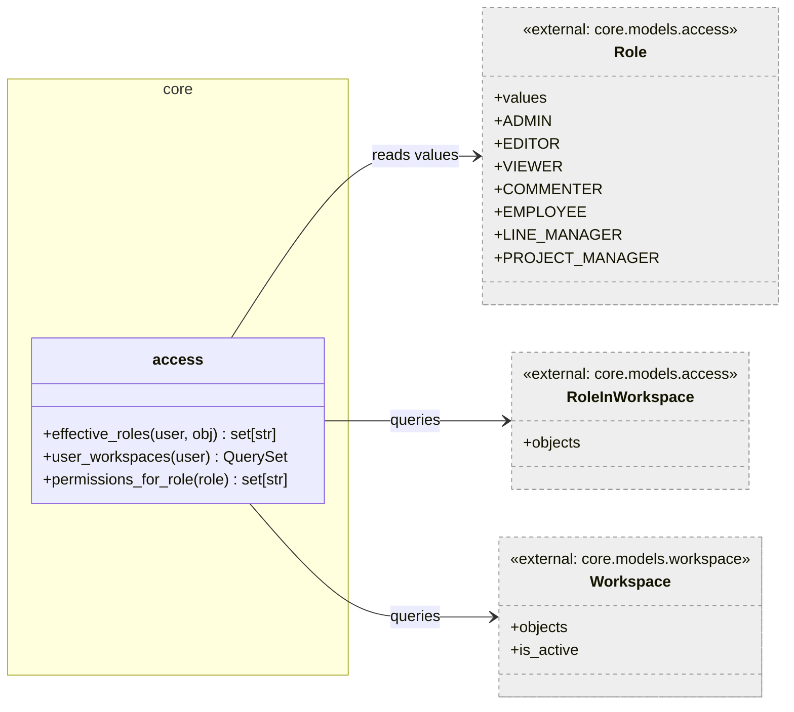
```mermaid
classDiagram
    direction LR

    namespace core {
        class access {
            +effective_roles(user, obj) set[str]
            +user_workspaces(user) QuerySet
            +permissions_for_role(role) set[str]
        }
    }

    class Role:::external {
        <<external: core.models.access>>
        +values
        +ADMIN
        +EDITOR
        +VIEWER
        +COMMENTER
        +EMPLOYEE
        +LINE_MANAGER
        +PROJECT_MANAGER
    }

    class RoleInWorkspace:::external {
        <<external: core.models.access>>
        +objects
    }

    class Workspace:::external {
        <<external: core.models.workspace>>
        +objects
        +is_active
    }

    access --> Role : reads values
    access --> RoleInWorkspace : queries
    access --> Workspace : queries

    classDef external fill:#eee,stroke:#999,stroke-dasharray:4 4;
```

**Figure 1 — Access control module and its model dependencies**

#### `effective_roles(user, obj)`

Signature: `effective_roles(user: AbstractBaseUser | None, obj: Any) -> set[str]`

Returns the set of `Role` code strings that `user` holds on the object `obj`.
Roles are derived from `RoleInWorkspace` rows that link any of the user's Django
`Group` memberships to `obj.workspace`.

Three early-exit branches exist before touching the database:

- If `user` is `None` or unauthenticated, returns an empty set immediately.
- If `user.is_superuser` is `True`, returns all defined `Role` values without
  querying `RoleInWorkspace`.
- If `obj.workspace` is absent (guarded via `getattr`), returns an empty set —
  this protects pre-CR-9 models that lack workspace scoping.

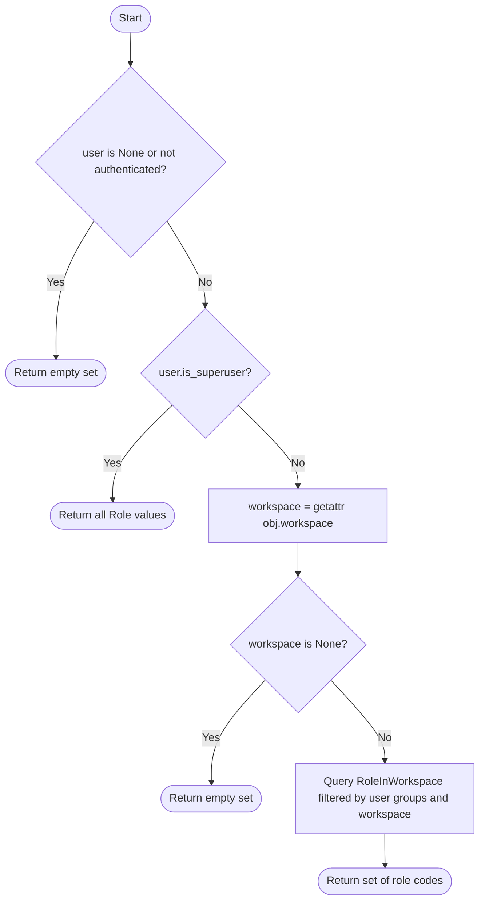
```mermaid
flowchart TD
    A([Start]) --> B{user is None or not authenticated?}
    B -->|Yes| Z1([Return empty set])
    B -->|No| C{user.is_superuser?}
    C -->|Yes| Z2([Return all Role values])
    C -->|No| D[workspace = getattr obj.workspace]
    D --> E{workspace is None?}
    E -->|Yes| Z3([Return empty set])
    E -->|No| F[Query RoleInWorkspace filtered by user groups and workspace]
    F --> Z4([Return set of role codes])
```

**Figure 2 — `effective_roles` control flow**

#### `user_workspaces(user)`

Signature: `user_workspaces(user: AbstractBaseUser | None) -> QuerySet`

Returns a `QuerySet` of active `Workspace` rows accessible to `user` via any group
membership. Deactivated workspaces (those with `is_active=False`) are excluded even
when a stale `RoleInWorkspace` row still references them. Used by the dashboard
switcher, the workspace-switch view authorisation check, and
`WorkspaceContextMiddleware`.

- Unauthenticated or `None` users receive `Workspace.objects.none()`.
- Superusers receive all active workspaces without further filtering.

#### `permissions_for_role(role)`

Signature: `permissions_for_role(role: str) -> set[str]`

Maps a `Role` value string to a subset of the Django per-model action codes
`{'add', 'change', 'delete', 'view'}`. The mapping implements the policy from
CR §9.8 — for example `ADMIN` receives all four actions while `VIEWER`,
`COMMENTER`, and `EMPLOYEE` receive only `view`. An unrecognised role value returns
an empty set.

---

### System Checks (`app_checks.py`)

The `app_checks` module provides a single helper function used by `AppConfig.ready()`
to register a Django system check that enforces hard application dependencies.

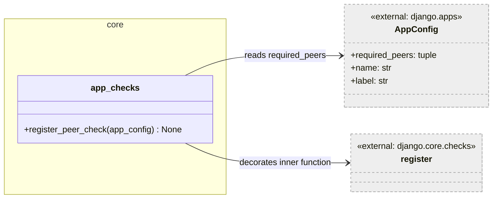
```mermaid
classDiagram
    direction LR

    namespace core {
        class app_checks {
            +register_peer_check(app_config) None
        }
    }

    class AppConfig:::external {
        <<external: django.apps>>
        +required_peers: tuple
        +name: str
        +label: str
    }

    class register:::external {
        <<external: django.core.checks>>
    }

    app_checks --> AppConfig : reads required_peers
    app_checks --> register : decorates inner function

    classDef external fill:#eee,stroke:#999,stroke-dasharray:4 4;
```

**Figure 3 — `app_checks` module structure**

#### `register_peer_check(app_config)`

Signature: `register_peer_check(app_config: AppConfig) -> None`

Reads `app_config.required_peers` (a tuple of dotted app-label strings such as
`'koalixcrm.contacts'`). If the tuple is empty or absent, the function returns
immediately without registering anything. Otherwise it defines and registers an
inner function `_check_required_peers` using Django's `@register()` decorator.

At Django startup the registered check iterates `required_peers` and emits one
`Error` per peer not present in `INSTALLED_APPS`. Each error carries the id
`{app_label}.E001` and a hint advising the developer to either add the missing peer
or remove the depending application.

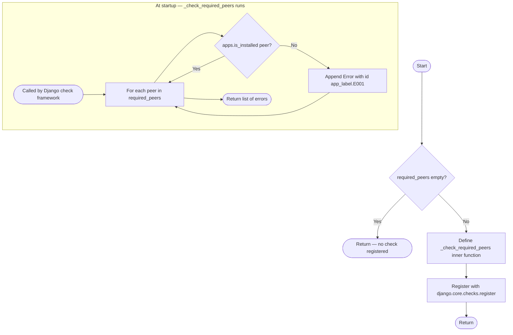
```mermaid
flowchart TD
    A([Start]) --> B{required_peers empty?}
    B -->|Yes| Z([Return — no check registered])
    B -->|No| C[Define _check_required_peers inner function]
    C --> D[Register with django.core.checks.register]
    D --> E([Return])

    subgraph "At startup — _check_required_peers runs"
        F([Called by Django check framework]) --> G[For each peer in required_peers]
        G --> H{apps.is_installed peer?}
        H -->|No| I[Append Error with id app_label.E001]
        H -->|Yes| G
        I --> G
        G --> J([Return list of errors])
    end
```

**Figure 4 — `register_peer_check` and the registered check function**

---

### Application Configuration (`apps.py`)

`CoreConfig` is the `AppConfig` subclass that registers the `koalixcrm.core`
application with Django. Its `ready()` method performs two startup actions in
order:

1. Imports `koalixcrm.core.signals.pdf_export_signals` so that the `post_save`
   receiver for `PDFExportProcess` is connected before any request is handled.
2. Calls `register_peer_check(self)` to register the peer-dependency system check.
   `CoreConfig.required_peers` is empty, so the check returns immediately; this
   call is present for forward compatibility when peers are declared in future.

`CoreConfig.optional_peers` lists `'koalixcrm.accounting'` as informational only —
the application runs without it, but some template types are skipped.

---

### Middleware

#### `TimezoneMiddleware` (`middleware/timezoneMiddleware.py`)

`TimezoneMiddleware` is a standard Django new-style middleware. It activates the
Django timezone setting for the duration of each request based on the value stored
in the session under the key `django_timezone`.

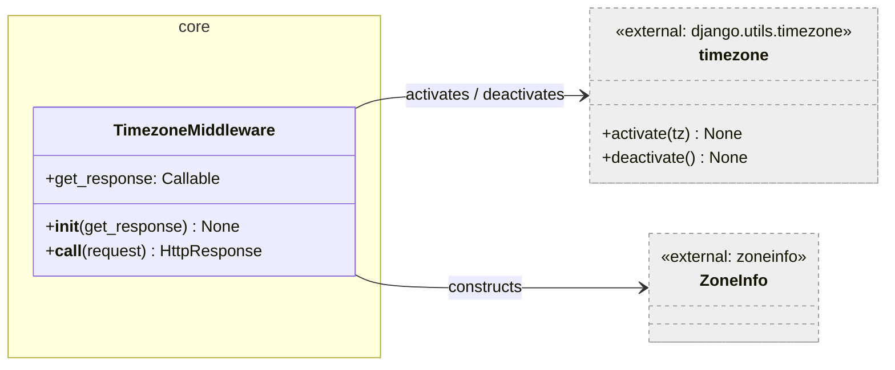
```mermaid
classDiagram
    direction LR

    namespace core {
        class TimezoneMiddleware {
            +get_response: Callable
            +__init__(get_response) None
            +__call__(request) HttpResponse
        }
    }

    class timezone:::external {
        <<external: django.utils.timezone>>
        +activate(tz) None
        +deactivate() None
    }

    class ZoneInfo:::external {
        <<external: zoneinfo>>
    }

    TimezoneMiddleware --> timezone : activates / deactivates
    TimezoneMiddleware --> ZoneInfo : constructs

    classDef external fill:#eee,stroke:#999,stroke-dasharray:4 4;
```

**Figure 5 — `TimezoneMiddleware` class structure**

**`__call__(request)`**

Reads `request.session['django_timezone']`. If a value is present it constructs a
`ZoneInfo` object and calls `django.utils.timezone.activate()`. If the session key
is absent, `timezone.deactivate()` resets Django to the `TIME_ZONE` setting. The
next middleware or view is then called unconditionally via `self.get_response`.

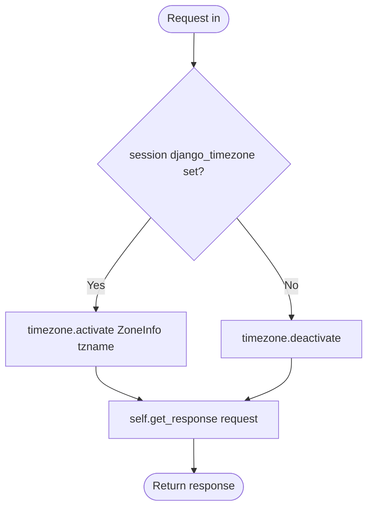
```mermaid
flowchart TD
    A([Request in]) --> B{session django_timezone set?}
    B -->|Yes| C[timezone.activate ZoneInfo tzname]
    B -->|No| D[timezone.deactivate]
    C --> E[self.get_response request]
    D --> E
    E --> F([Return response])
```

**Figure 6 — `TimezoneMiddleware.__call__` control flow**

---

#### `WorkspaceContextMiddleware` (`middleware/workspace_context.py`)

`WorkspaceContextMiddleware` activates the session-stored workspace for the
duration of each authenticated request. It attaches the resolved `Workspace`
instance to `request.active_workspace` and calls the workspace manager functions
`activate_workspace` / `deactivate_workspace` around the downstream call chain.
`deactivate_workspace` is called in a `finally` block to guarantee cleanup even
when the view raises an exception.

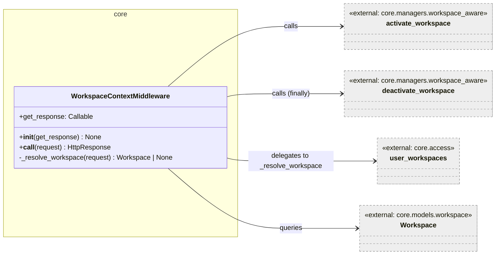
```mermaid
classDiagram
    direction LR

    namespace core {
        class WorkspaceContextMiddleware {
            +get_response: Callable
            +__init__(get_response) None
            +__call__(request) HttpResponse
            -_resolve_workspace(request) Workspace | None
        }
    }

    class activate_workspace:::external {
        <<external: core.managers.workspace_aware>>
    }

    class deactivate_workspace:::external {
        <<external: core.managers.workspace_aware>>
    }

    class user_workspaces:::external {
        <<external: core.access>>
    }

    class Workspace:::external {
        <<external: core.models.workspace>>
    }

    WorkspaceContextMiddleware --> activate_workspace : calls
    WorkspaceContextMiddleware --> deactivate_workspace : calls (finally)
    WorkspaceContextMiddleware --> user_workspaces : delegates to _resolve_workspace
    WorkspaceContextMiddleware --> Workspace : queries

    classDef external fill:#eee,stroke:#999,stroke-dasharray:4 4;
```

**Figure 7 — `WorkspaceContextMiddleware` class structure**

**`__call__(request)`**

For unauthenticated requests `request.active_workspace` is set to `None` and the
request passes through immediately. For authenticated requests `_resolve_workspace`
is called first, then `activate_workspace` is called if a workspace was resolved.
The view chain runs inside a `try/finally` so that `deactivate_workspace` is
always invoked.

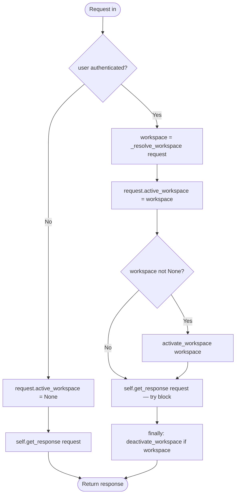
```mermaid
flowchart TD
    A([Request in]) --> B{user authenticated?}
    B -->|No| C[request.active_workspace = None]
    C --> D[self.get_response request]
    D --> Z([Return response])
    B -->|Yes| E[workspace = _resolve_workspace request]
    E --> F[request.active_workspace = workspace]
    F --> G{workspace not None?}
    G -->|Yes| H[activate_workspace workspace]
    G -->|No| I[self.get_response request — try block]
    H --> I
    I --> J[finally: deactivate_workspace if workspace]
    J --> Z
```

**Figure 8 — `WorkspaceContextMiddleware.__call__` control flow**

**`_resolve_workspace(request)` (private)**

Looks up `session['active_workspace_id']`. If the stored pk maps to an active
`Workspace`, that object is returned. If the session value is missing or the
workspace no longer exists (deleted or deactivated), the method falls back to the
first accessible workspace ordered by primary key, stores its pk in the session,
and returns it. Returns `None` if the user has no accessible workspace at all.

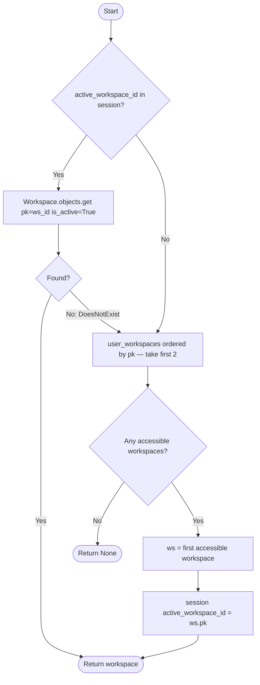
```mermaid
flowchart TD
    A([Start]) --> B{active_workspace_id in session?}
    B -->|Yes| C[Workspace.objects.get pk=ws_id is_active=True]
    C --> D{Found?}
    D -->|Yes| Z1([Return workspace])
    D -->|No: DoesNotExist| E
    B -->|No| E[user_workspaces ordered by pk — take first 2]
    E --> F{Any accessible workspaces?}
    F -->|No| Z2([Return None])
    F -->|Yes| G[ws = first accessible workspace]
    G --> H[session active_workspace_id = ws.pk]
    H --> Z1
```

**Figure 9 — `_resolve_workspace` control flow**

---

### Signals (`signals/pdf_export_signals.py`)

The signals module contains a single Django signal receiver connected to
`PDFExportProcess.post_save`. The module is imported during `CoreConfig.ready()`
to ensure the receiver is registered before any requests are handled.

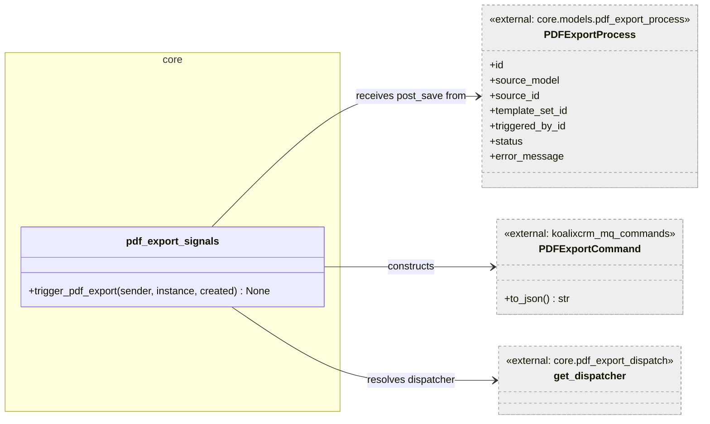
```mermaid
classDiagram
    direction LR

    namespace core {
        class pdf_export_signals {
            +trigger_pdf_export(sender, instance, created) None
        }
    }

    class PDFExportProcess:::external {
        <<external: core.models.pdf_export_process>>
        +id
        +source_model
        +source_id
        +template_set_id
        +triggered_by_id
        +status
        +error_message
    }

    class PDFExportCommand:::external {
        <<external: koalixcrm_mq_commands>>
        +to_json() str
    }

    class get_dispatcher:::external {
        <<external: core.pdf_export_dispatch>>
    }

    pdf_export_signals --> PDFExportProcess : receives post_save from
    pdf_export_signals --> PDFExportCommand : constructs
    pdf_export_signals --> get_dispatcher : resolves dispatcher

    classDef external fill:#eee,stroke:#999,stroke-dasharray:4 4;
```

**Figure 10 — `pdf_export_signals` module dependencies**

#### `trigger_pdf_export(sender, instance, created, **kwargs)`

Connected to `post_save` for `PDFExportProcess` with `dispatch_uid` to prevent
duplicate registrations. On every save it immediately returns if `created` is
`False` — updates to an existing record do not re-trigger export.

For a newly created record it builds a `PDFExportCommand` from the instance's
fields and obtains the configured dispatcher via `get_dispatcher()`. If the
dispatcher raises any exception the signal handler catches it, logs the error, and
writes `status='failed'` and `error_message` back to the instance using
`update_fields` to avoid triggering another `post_save`.

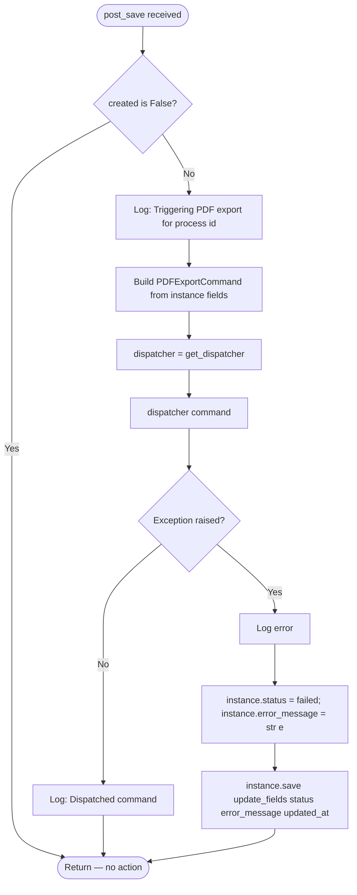
```mermaid
flowchart TD
    A([post_save received]) --> B{created is False?}
    B -->|Yes| Z([Return — no action])
    B -->|No| C[Log: Triggering PDF export for process id]
    C --> D[Build PDFExportCommand from instance fields]
    D --> E[dispatcher = get_dispatcher]
    E --> F[dispatcher command]
    F --> G{Exception raised?}
    G -->|No| H[Log: Dispatched command]
    G -->|Yes| I[Log error]
    I --> J[instance.status = failed; instance.error_message = str e]
    J --> K[instance.save update_fields status error_message updated_at]
    H --> Z
    K --> Z
```

**Figure 11 — `trigger_pdf_export` signal handler control flow**

---

### Context Processors (`context_processors.py`)

The module provides a single Django template context processor function.

#### `workspace_context(request)`

Signature: `workspace_context(request: HttpRequest) -> dict[str, Any]`

Injects three keys into the template context for every request:

- `active_workspace` — the `Workspace` object attached to the request by
  `WorkspaceContextMiddleware`, or `None`.
- `active_workspace_color` — the `color` field of the active workspace, or an
  empty string when no workspace is active.
- `user_workspaces` — a Python list of `Workspace` objects accessible to the
  authenticated user, populated via `user_workspaces(request.user)`. For
  unauthenticated requests this list is empty.

The function reads `request.active_workspace` with `getattr` to avoid `AttributeError`
in tests or middleware configurations that do not include
`WorkspaceContextMiddleware`.

---

### PDF Export Dispatch (`pdf_export_dispatch.py`)

This module implements a Strategy pattern for sending `PDFExportCommand` messages.
The active strategy is resolved at call time (not at import time) so that Django
settings may change between module load and the first use.

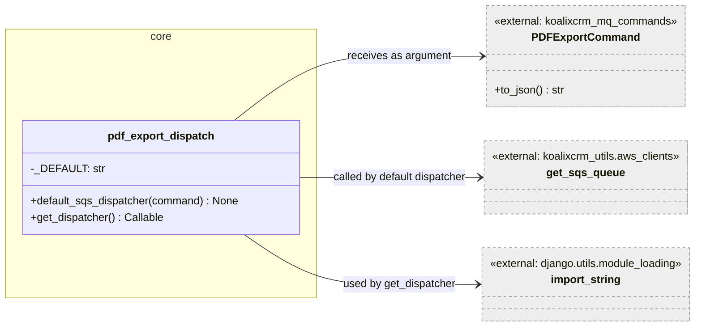
```mermaid
classDiagram
    direction LR

    namespace core {
        class pdf_export_dispatch {
            +default_sqs_dispatcher(command) None
            +get_dispatcher() Callable
            -_DEFAULT: str
        }
    }

    class PDFExportCommand:::external {
        <<external: koalixcrm_mq_commands>>
        +to_json() str
    }

    class get_sqs_queue:::external {
        <<external: koalixcrm_utils.aws_clients>>
    }

    class import_string:::external {
        <<external: django.utils.module_loading>>
    }

    pdf_export_dispatch --> PDFExportCommand : receives as argument
    pdf_export_dispatch --> get_sqs_queue : called by default dispatcher
    pdf_export_dispatch --> import_string : used by get_dispatcher

    classDef external fill:#eee,stroke:#999,stroke-dasharray:4 4;
```

**Figure 12 — PDF export dispatch module**

#### `get_dispatcher()`

Signature: `get_dispatcher() -> Callable[[PDFExportCommand], None]`

Reads `settings.KOALIXCRM_PDF_EXPORT_DISPATCHER`. If the setting is absent, the
module-level constant `_DEFAULT` (`"koalixcrm.core.pdf_export_dispatch.default_sqs_dispatcher"`)
is used. The dotted path is resolved to a callable via `django.utils.module_loading.import_string`.
Callers (notably the `trigger_pdf_export` signal handler) are responsible for
exception handling.

#### `default_sqs_dispatcher(command)`

Signature: `default_sqs_dispatcher(command: PDFExportCommand) -> None`

The built-in implementation. Obtains a reference to the koalixcrm SQS queue via
`koalixcrm_utils.aws_clients.get_sqs_queue()` and sends the command's JSON
representation as the message body. `get_sqs_queue` is imported inside the function
body to keep the SQS client import lazy — it is not needed when a fork overrides
the dispatcher.

---

### Views

#### `set_timezone` view (`views/set_timezone.py`)

Signature: `set_timezone(request: HttpRequest) -> HttpResponse`

A function-based view decorated with `@login_required`. On `GET` it renders the
template `crm/admin/set_timezone.html` with a sorted list of all IANA timezone
names from the `zoneinfo` standard library module. On `POST` it stores the
submitted `timezone` value in the session under `django_timezone` and redirects
to `/`.

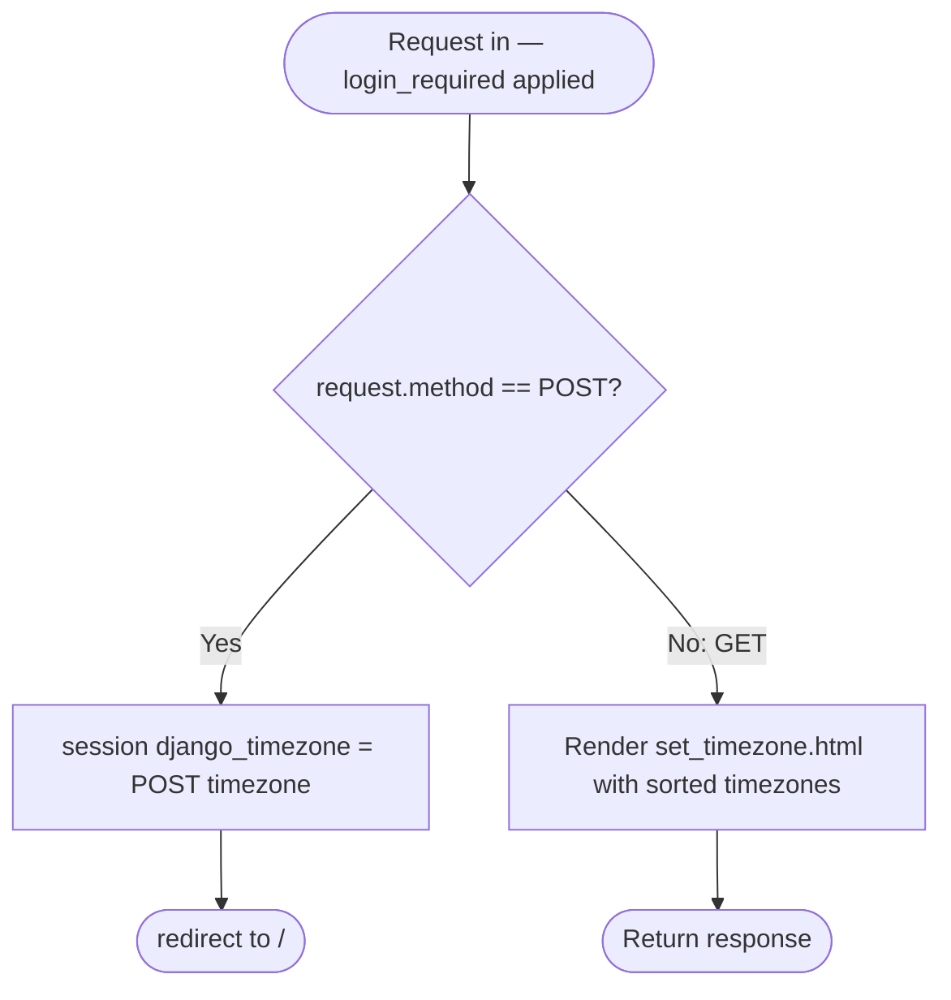
```mermaid
flowchart TD
    A([Request in — login_required applied]) --> B{request.method == POST?}
    B -->|Yes| C[session django_timezone = POST timezone]
    C --> D([redirect to /])
    B -->|No: GET| E[Render set_timezone.html with sorted timezones]
    E --> F([Return response])
```

**Figure 13 — `set_timezone` view control flow**

---

#### `WorkspaceSwitchView` (`views/workspace_switch.py`)

`WorkspaceSwitchView` is a class-based Django `View` restricted to POST requests
and protected by `@staff_member_required`. It validates the submitted `workspace_id`,
checks that the requesting user holds any role in the target workspace (via
`user_workspaces`), writes an audit `WorkspaceSwitchEvent` row, and stores the
new workspace pk in the session before redirecting to the admin index.

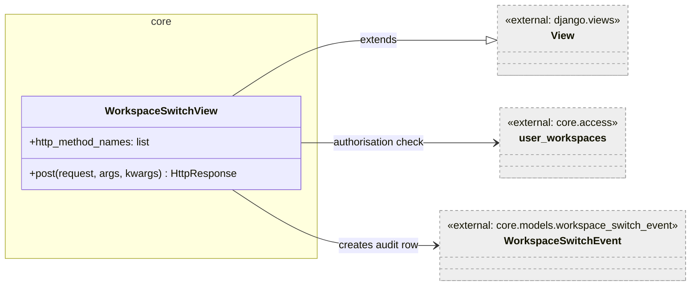
```mermaid
classDiagram
    direction LR

    namespace core {
        class WorkspaceSwitchView {
            +http_method_names: list
            +post(request, args, kwargs) HttpResponse
        }
    }

    class View:::external {
        <<external: django.views>>
    }

    class user_workspaces:::external {
        <<external: core.access>>
    }

    class WorkspaceSwitchEvent:::external {
        <<external: core.models.workspace_switch_event>>
    }

    WorkspaceSwitchView --|> View : extends
    WorkspaceSwitchView --> user_workspaces : authorisation check
    WorkspaceSwitchView --> WorkspaceSwitchEvent : creates audit row

    classDef external fill:#eee,stroke:#999,stroke-dasharray:4 4;
```

**Figure 14 — `WorkspaceSwitchView` class structure**

**`post(request, *args, **kwargs)`**

The method enforces authentication (raises `PermissionDenied` for unauthenticated
calls even though `staff_member_required` should already redirect them), validates
`workspace_id` is a non-empty integer, checks workspace accessibility, writes the
audit record, and redirects.

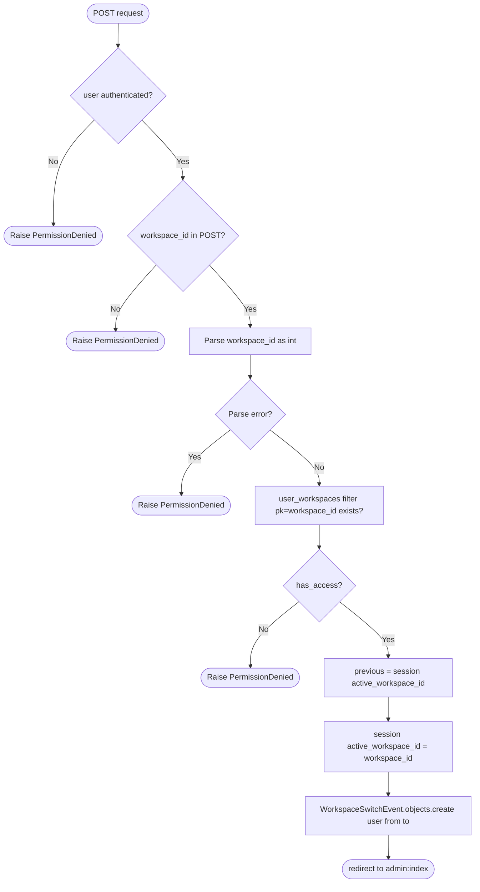
```mermaid
flowchart TD
    A([POST request]) --> B{user authenticated?}
    B -->|No| E1([Raise PermissionDenied])
    B -->|Yes| C{workspace_id in POST?}
    C -->|No| E2([Raise PermissionDenied])
    C -->|Yes| D[Parse workspace_id as int]
    D --> F{Parse error?}
    F -->|Yes| E3([Raise PermissionDenied])
    F -->|No| G[user_workspaces filter pk=workspace_id exists?]
    G --> H{has_access?}
    H -->|No| E4([Raise PermissionDenied])
    H -->|Yes| I[previous = session active_workspace_id]
    I --> J[session active_workspace_id = workspace_id]
    J --> K[WorkspaceSwitchEvent.objects.create user from to]
    K --> L([redirect to admin:index])
```

**Figure 15 — `WorkspaceSwitchView.post` control flow**

---

### Serializers

All serializers in this package extend DRF `ModelSerializer` and are located under
`core/serializers/`.

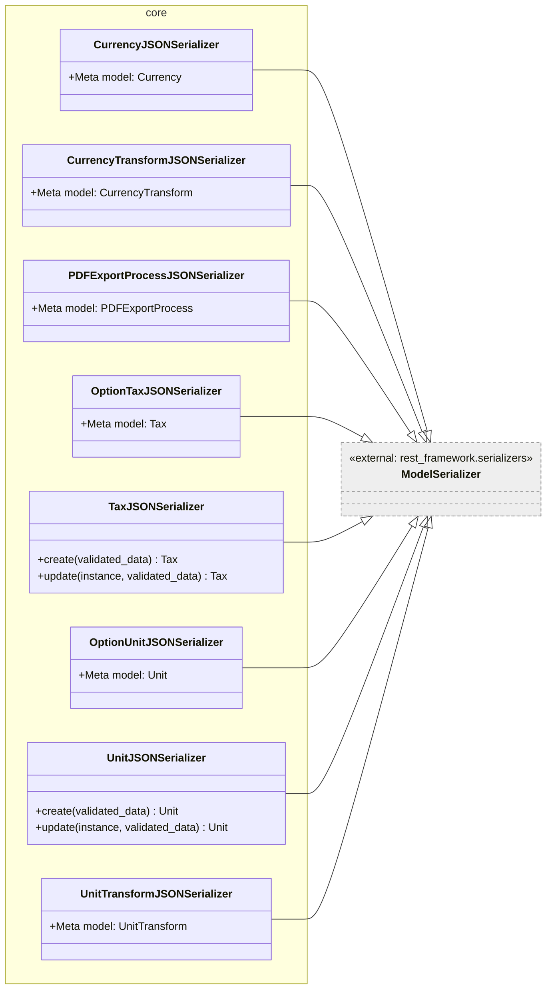
```mermaid
classDiagram
    direction LR

    namespace core {
        class CurrencyJSONSerializer {
            +Meta model: Currency
        }
        class CurrencyTransformJSONSerializer {
            +Meta model: CurrencyTransform
        }
        class PDFExportProcessJSONSerializer {
            +Meta model: PDFExportProcess
        }
        class OptionTaxJSONSerializer {
            +Meta model: Tax
        }
        class TaxJSONSerializer {
            +create(validated_data) Tax
            +update(instance, validated_data) Tax
        }
        class OptionUnitJSONSerializer {
            +Meta model: Unit
        }
        class UnitJSONSerializer {
            +create(validated_data) Unit
            +update(instance, validated_data) Unit
        }
        class UnitTransformJSONSerializer {
            +Meta model: UnitTransform
        }
    }

    class ModelSerializer:::external {
        <<external: rest_framework.serializers>>
    }

    CurrencyJSONSerializer --|> ModelSerializer
    CurrencyTransformJSONSerializer --|> ModelSerializer
    PDFExportProcessJSONSerializer --|> ModelSerializer
    OptionTaxJSONSerializer --|> ModelSerializer
    TaxJSONSerializer --|> ModelSerializer
    OptionUnitJSONSerializer --|> ModelSerializer
    UnitJSONSerializer --|> ModelSerializer
    UnitTransformJSONSerializer --|> ModelSerializer

    classDef external fill:#eee,stroke:#999,stroke-dasharray:4 4;
```

**Figure 16 — Serializer class hierarchy**

#### `CurrencyJSONSerializer`

Serializes the `Currency` model exposing `id`, `description`, `short_name`, and
`rounding`. All fields carry `required=False` to permit partial payloads.

#### `CurrencyTransformJSONSerializer`

Serializes `CurrencyTransform` with `fields = '__all__'`. No field overrides; the
DRF auto-generated field set is used.

#### `PDFExportProcessJSONSerializer`

Serializes `PDFExportProcess` for read and worker-callback use. The fields
`source_model`, `source_id`, `template_set`, `triggered_by`, `created_at`, and
`updated_at` are declared `read_only` — these are set by the Django producer at
creation time and must not be overwritten by the PDF worker's PATCH callback. The
fields `status`, `result_url`, and `error_message` are writable so the worker can
report progress.

#### `OptionTaxJSONSerializer`

A lightweight serializer exposing only `id` and `name` for use in option lists
(foreign-key dropdowns). `name` is read-only.

#### `TaxJSONSerializer`

Full Tax serializer for create and update operations. Overrides `create` and
`update` rather than using DRF's default `save()` delegation, constructing the
model instance explicitly.

**`TaxJSONSerializer.create(validated_data)`**

Instantiates a `Tax` object, assigns `tax_rate` and `name`, and calls `save()`.

**`TaxJSONSerializer.update(instance, validated_data)`**

Assigns `tax_rate` and `name` from `validated_data` to the existing instance and
calls `save()`.

#### `OptionUnitJSONSerializer`

Lightweight serializer for `Unit` exposing `id`, `description`, and `short_name`;
`description` and `short_name` are read-only.

#### `UnitJSONSerializer`

Full Unit serializer. Nests `OptionUnitJSONSerializer` for the `is_a_fraction_of`
foreign key (depth=1). Overrides `create` and `update` to handle the nested
`is_a_fraction_of` representation, which DRF cannot handle automatically without
a custom `create`.

**`UnitJSONSerializer.create(validated_data)`**

Pops `is_a_fraction_of` from `validated_data`. If the nested dict carries an `id`
key, the corresponding `Unit` is loaded from the database; otherwise the field is
set to `None`. The remaining scalar fields are assigned and `save()` is called.

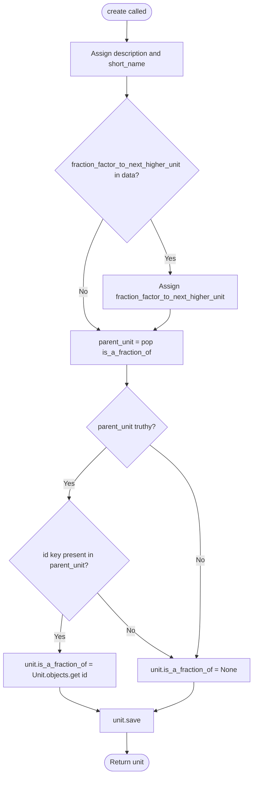
```mermaid
flowchart TD
    A([create called]) --> B[Assign description and short_name]
    B --> C{fraction_factor_to_next_higher_unit in data?}
    C -->|Yes| D[Assign fraction_factor_to_next_higher_unit]
    C -->|No| E
    D --> E[parent_unit = pop is_a_fraction_of]
    E --> F{parent_unit truthy?}
    F -->|Yes| G{id key present in parent_unit?}
    G -->|Yes| H[unit.is_a_fraction_of = Unit.objects.get id]
    G -->|No| I[unit.is_a_fraction_of = None]
    F -->|No| I
    H --> J[unit.save]
    I --> J
    J --> Z([Return unit])
```

**Figure 17 — `UnitJSONSerializer.create` control flow**

**`UnitJSONSerializer.update(instance, validated_data)`**

Updates scalar fields with `.get()` fallback to existing values. Pops
`is_a_fraction_of`; if the nested dict is truthy, loads the related unit by id or
leaves the existing FK when the id key is absent; if the nested dict is falsy,
clears the relationship. Saves and returns the instance.

#### `UnitTransformJSONSerializer`

Serializes `UnitTransform` with `fields = '__all__'`. No field overrides.

---

### Admin

#### `CurrencyAdmin`

Registered for `Currency` via `@admin.register`. Displays `id`, `description`,
`short_name`, and `rounding` in the list view. Allows creation.

#### `CurrencyTransformInlineAdmin`

A `TabularInline` for `CurrencyTransform` with one extra empty row and collapsible
display. Exposes `from_currency`, `to_currency`, and `factor`. Intended to be
included in a parent model admin (not registered standalone).

#### `TaxAdmin`

Registered for `Tax` via `@admin.register`. Displays `id`, `tax_rate`, and `name`.
Allows creation.

#### `UnitAdmin`

Registered for `Unit` via `@admin.register`. Displays `id`, `description`,
`short_name`, `is_a_fraction_of`, and `fraction_factor_to_next_higher_unit`.
Allows creation.

#### `UnitTransformInlineAdmin`

A `TabularInline` for `UnitTransform` with one extra empty row and collapsible
display. Exposes `from_unit`, `to_unit`, and `factor`. Intended to be included in
a parent model admin.

#### `WorkspaceAdmin`

Registered for `Workspace` via `@admin.register`. Displays `name`, `organization`,
`color`, and `date_added`. `date_added` and `last_modified` are read-only.
Timestamps are shown in a collapsible fieldset.

#### `RoleInWorkspaceAdmin`

Registered for `RoleInWorkspace` via `@admin.register`. Displays `group`,
`workspace`, and `role`. Supports filtering by `workspace` and `role`. `group` uses
`raw_id_fields` to avoid loading all groups in a dropdown for large installations.

#### `PDFExportProcessAdmin`

Registered for `PDFExportProcess` via `admin.site.register`. Displays summary
columns for the export request and its processing state. `status`, `result_url`,
`error_message`, `created_at`, and `updated_at` are all read-only — these fields
are set by the worker, not by admin users. Default ordering is by `created_at`
descending so the most recent export attempts appear first.

---

#### `WorkspaceSwitcherModule` (`admin/dashboard_modules.py`)

`WorkspaceSwitcherModule` is a Grappelli `DashboardModule` that renders the list of
workspaces the current user can access and provides a switch action. It is intended
to appear as the first module on the admin index dashboard.

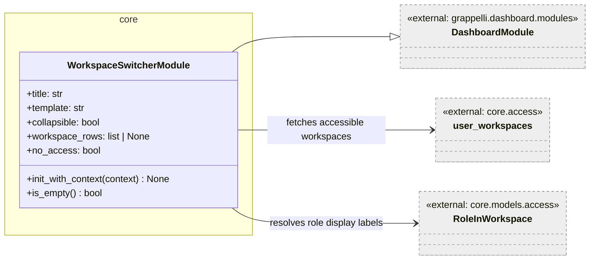
```mermaid
classDiagram
    direction LR

    namespace core {
        class WorkspaceSwitcherModule {
            +title: str
            +template: str
            +collapsible: bool
            +workspace_rows: list | None
            +no_access: bool
            +init_with_context(context) None
            +is_empty() bool
        }
    }

    class DashboardModule:::external {
        <<external: grappelli.dashboard.modules>>
    }

    class user_workspaces:::external {
        <<external: core.access>>
    }

    class RoleInWorkspace:::external {
        <<external: core.models.access>>
    }

    WorkspaceSwitcherModule --|> DashboardModule
    WorkspaceSwitcherModule --> user_workspaces : fetches accessible workspaces
    WorkspaceSwitcherModule --> RoleInWorkspace : resolves role display labels

    classDef external fill:#eee,stroke:#999,stroke-dasharray:4 4;
```

**Figure 18 — `WorkspaceSwitcherModule` structure**

**`init_with_context(context)`**

Called by Grappelli when rendering the dashboard. Retrieves the request from the
context, resolves the active workspace id from the session, calls `user_workspaces`
to fetch all accessible `Workspace` objects, and queries `RoleInWorkspace` for each
to build human-readable role display labels. The result is a list of dicts stored in
`self.workspace_rows`. If no workspaces are accessible, `self.no_access` is set to
`True` and a placeholder child is inserted so `is_empty()` returns `False` and the
module still renders with an explanatory message.

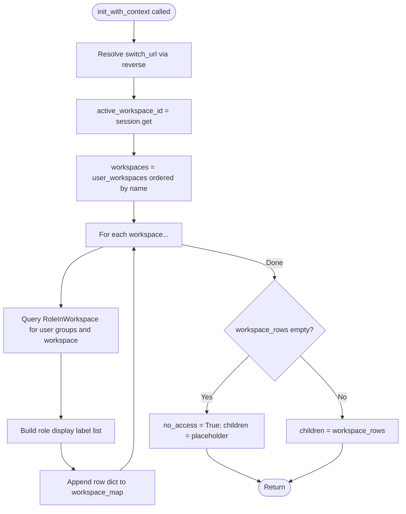
```mermaid
flowchart TD
    A([init_with_context called]) --> B[Resolve switch_url via reverse]
    B --> C[active_workspace_id = session.get]
    C --> D[workspaces = user_workspaces ordered by name]
    D --> E[For each workspace...]
    E --> F[Query RoleInWorkspace for user groups and workspace]
    F --> G[Build role display label list]
    G --> H[Append row dict to workspace_map]
    H --> E
    E -->|Done| I{workspace_rows empty?}
    I -->|Yes| J[no_access = True; children = placeholder]
    I -->|No| K[children = workspace_rows]
    J --> Z([Return])
    K --> Z
```

**Figure 19 — `WorkspaceSwitcherModule.init_with_context` control flow**

**`is_empty()`**

Always returns `False` so the module is always rendered on the dashboard regardless
of whether workspace rows are present.

---

#### `WorkspaceScopedModelAdmin` (`admin/workspace_scoped_admin.py`)

`WorkspaceScopedModelAdmin` is a mixin (not registered standalone) for
`ModelAdmin` classes whose models inherit from `WorkspaceScopedModel`. It overrides
three `ModelAdmin` hook methods to enforce workspace isolation.

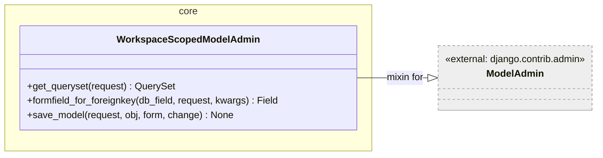
```mermaid
classDiagram
    direction LR

    namespace core {
        class WorkspaceScopedModelAdmin {
            +get_queryset(request) QuerySet
            +formfield_for_foreignkey(db_field, request, kwargs) Field
            +save_model(request, obj, form, change) None
        }
    }

    class ModelAdmin:::external {
        <<external: django.contrib.admin>>
    }

    WorkspaceScopedModelAdmin --|> ModelAdmin : mixin for

    classDef external fill:#eee,stroke:#999,stroke-dasharray:4 4;
```

**Figure 20 — `WorkspaceScopedModelAdmin` mixin**

**`get_queryset(request)`**

Returns the full queryset for superusers. For other users, filters to
`workspace=active` where `active` is `request.active_workspace`. If no workspace
is active, the unfiltered queryset is returned (deferring scoping to the view's
own logic).

**`formfield_for_foreignkey(db_field, request, **kwargs)`**

Restricts FK dropdown options to rows belonging to the active workspace, but only
for related models that have a `workspace` attribute. Superusers see all rows.

**`save_model(request, obj, form, change)`**

Enforces two workspace invariants before delegating to the parent `save_model`:

1. If `obj.workspace_id` is `None` and there is an active workspace, it assigns
   the active workspace id. If there is no active workspace in this case, it raises
   `PermissionDenied`.
2. For non-superusers with an active workspace, it verifies that `obj.workspace_id`
   matches `active.id`, and that every FK field on the object pointing to a
   workspace-scoped related model also belongs to the active workspace. Any mismatch
   raises `PermissionDenied`.

```mermaid
flowchart TD
    A([save_model called]) --> B[active = request.active_workspace]
    B --> C{obj.workspace_id is None?}
    C -->|Yes| D{active is None?}
    D -->|Yes| E1([Raise PermissionDenied — no active workspace])
    D -->|No| F[obj.workspace_id = active.id]
    C -->|No| G
    F --> G{active not None AND not superuser?}
    G -->|No| Z[super.save_model]
    G -->|Yes| H{obj.workspace_id != active.id?}
    H -->|Yes| E2([Raise PermissionDenied — workspace mismatch])
    H -->|No| I[For each FK field on obj._meta.get_fields]
    I --> J{related_model has workspace attr?}
    J -->|No| I
    J -->|Yes| K{FK value exists in active workspace?}
    K -->|No| E3([Raise PermissionDenied — related obj wrong workspace])
    K -->|Yes| I
    I -->|All fields checked| Z
    Z --> ZZ([Return])
```

**Figure 21 — `WorkspaceScopedModelAdmin.save_model` control flow**

---

### Management Commands

#### `koalixcrm_install_defaulttemplates` (`management/commands/koalixcrm_install_defaulttemplates.py`)

This `BaseCommand` subclass seeds an empty installation with a default template
set, currency, workspace, user extension, and related contact data (address, phone,
email). It is intended to run once after `migrate` on a fresh database.

```mermaid
classDiagram
    direction LR

    namespace core {
        class Command {
            +help: str
            +args: str
            +label: str
            +store_default_template_xsl_file(language, file_name)$ Any
            +path_of_default_template_file(language, file_name)$ str
            +store_xsl_file(xsl_file_path)$ Any
            +handle(args, options) None
        }
    }

    class BaseCommand:::external {
        <<external: django.core.management.base>>
    }

    Command --|> BaseCommand

    classDef external fill:#eee,stroke:#999,stroke-dasharray:4 4;
```

**Figure 22 — `koalixcrm_install_defaulttemplates` command class**

**`handle(*args, **options)`**

Creates a `TemplateSet` with English XSL files for each document type (invoice,
quotation, sales order, purchase order, despatch advice). If `koalixcrm.accounting`
is in `INSTALLED_APPS`, the profit/loss statement and balance sheet XSL files are
also registered. Sets generic assets (logo, FOP configuration, placeholder text
fields) and saves the template set. Creates a USD `Currency`. Gets or creates a
`Default Workspace`. Creates a `UserExtension` for the first `User` in the
database, wiring the template set, currency, and workspace. Finally creates and
assigns a primary address, phone number, and email address for that user.

```mermaid
flowchart TD
    A([handle called]) --> B[Create TemplateSet with XSL files EN]
    B --> C{koalixcrm.accounting in INSTALLED_APPS?}
    C -->|Yes| D[Add profit/loss and balance sheet XSL files]
    C -->|No| E
    D --> E[Set logo, FOP config, text placeholders, save TemplateSet]
    E --> F[Create Currency USD]
    F --> G[Workspace.get_or_create Default Workspace]
    G --> H[user = User.objects.all 0]
    H --> I[Create UserExtension for user]
    I --> J[Create Address — assign to workspace and user]
    J --> K[Create PhoneNumber — assign to workspace and user]
    K --> L[Create PartyEmail — assign to workspace and user]
    L --> Z([Return])
```

**Figure 23 — `koalixcrm_install_defaulttemplates.handle` control flow**

**Static helper methods**

- `path_of_default_template_file(language, file_name)` — Constructs the file path
  under `STATIC_ROOT/default_templates/{language}/{file_name}`. Opens the file to
  verify its existence; if `FileNotFoundError` is raised, it prints a message
  suggesting `collectstatic` and returns the path regardless (allowing the caller
  to store the path even if the file could not be opened).
- `store_xsl_file(xsl_file_path)` — Constructs an `XSLFile` model instance using
  `filebrowser.base.FileObject` as the file reference and saves it.
- `store_default_template_xsl_file(language, file_name)` — Composes the two
  helpers above: resolves the path then creates and stores the `XSLFile` record.

---

#### `sync_split_migrations` (`management/commands/sync_split_migrations.py`)

This `BaseCommand` subclass reconciles the `django_migrations` table for legacy or
mid-refactor database deployments. It addresses two classes of problems:

1. Legacy databases where the `django_migrations` table lacks `AUTOINCREMENT`,
   preventing Django's recorder from functioning.
2. Legacy SQLite tables where `id` or `<model>_ptr_id` columns lack a proper
   `PRIMARY KEY` declaration, causing `foreign_key_check` failures during later
   migrations.
3. Migrations that exist in the current graph but have not been recorded as applied,
   even though the tables they would create already exist in the database
   (a `--fake-initial` generalised beyond `0001_initial`).

```mermaid
classDiagram
    direction LR

    namespace core {
        class Command {
            +help: str
            +handle(args, options) None
            -_upgrade_migrations_table_if_legacy() None
            -_upgrade_legacy_id_columns() None
            -_needs_id_upgrade(table_name, create_sql) bool
            -_rebuild_sqlite_table(table_name, create_sql) None
            -_tables_created_by(migration, app_label) list[str]
            -_record_applied(app, name) None
        }
    }

    class BaseCommand:::external {
        <<external: django.core.management.base>>
    }

    class MigrationLoader:::external {
        <<external: django.db.migrations.loader>>
    }

    class MigrationRecorder:::external {
        <<external: django.db.migrations.recorder>>
    }

    Command --|> BaseCommand
    Command --> MigrationLoader : reads migration graph
    Command --> MigrationRecorder : records applied migrations

    classDef external fill:#eee,stroke:#999,stroke-dasharray:4 4;
```

**Figure 24 — `sync_split_migrations` command class**

**`handle(*args, **options)`**

Calls the upgrade helpers in sequence, then scans the migration graph for unrecorded
migrations whose tables all exist in the live database.

```mermaid
flowchart TD
    A([handle called]) --> B[_upgrade_migrations_table_if_legacy]
    B --> C[_upgrade_legacy_id_columns]
    C --> D[recorder.ensure_schema]
    D --> E[applied = recorder.applied_migrations]
    E --> F[present = introspection.table_names]
    F --> G[loader = MigrationLoader]
    G --> H[For each key in loader.graph.nodes]
    H --> I{key in applied?}
    I -->|Yes| H
    I -->|No| J[create_tables = _tables_created_by migration]
    J --> K{create_tables empty?}
    K -->|Yes| H
    K -->|No| L{All tables in present?}
    L -->|No| H
    L -->|Yes| M[_record_applied app name]
    M --> N[applied.add key]
    N --> H
    H -->|Done| Z([Return])
```

**Figure 25 — `sync_split_migrations.handle` control flow**

**`_upgrade_migrations_table_if_legacy()`** (private)

Checks whether `django_migrations` exists and whether its CREATE statement lacks
`AUTOINCREMENT` or `PRIMARY KEY`. If the legacy schema is detected, it reads all
existing rows, drops the table, recreates it using `MigrationRecorder.ensure_schema()`
(which produces the modern schema), and re-inserts the saved rows.

**`_upgrade_legacy_id_columns()`** (private)

SQLite-only. Queries `sqlite_master` for all user tables, calls
`_needs_id_upgrade` for each, and invokes `_rebuild_sqlite_table` for any that
require it.

**`_needs_id_upgrade(table_name, create_sql)`** (private)

Returns `True` when a table has no primary key declared (checked via `PRAGMA table_info`)
and its CREATE SQL matches either `LEGACY_ID_RE` (root-model `id` column without
`PRIMARY KEY`) or `LEGACY_PTR_ID_RE` (MTI child `_ptr_id` column without `PRIMARY KEY`).

**`_rebuild_sqlite_table(table_name, create_sql)`** (private)

Performs the SQLite "recreate table" idiom: creates a temporary table with the
corrected column definition, copies all rows into it, drops the original, renames
the temporary table back, and recreates any indexes. Foreign key checks are
disabled for the duration of the operation via `PRAGMA foreign_keys=OFF` in a
`try/finally` block. MTI child tables use `INTEGER PRIMARY KEY` without
`AUTOINCREMENT` because their pk value is supplied by the ORM rather than SQLite.

```mermaid
flowchart TD
    A([_rebuild_sqlite_table called]) --> B[Collect existing index DDL from sqlite_master]
    B --> C[PRAGMA foreign_keys=OFF]
    C --> D[Create temp table with corrected id column]
    D --> E[INSERT INTO tmp SELECT all FROM original]
    E --> F[DROP original table]
    F --> G[ALTER tmp RENAME TO original]
    G --> H[Recreate each index]
    H --> I[PRAGMA foreign_keys=ON — finally block]
    I --> Z([Return])
```

**Figure 26 — `_rebuild_sqlite_table` control flow**

**`_tables_created_by(migration, app_label)`** (private)

Iterates `migration.operations` and returns the expected database table name for
each operation whose class name is `CreateModel` or `CreateModelIfNotExists`. The
table name is taken from `op.options['db_table']` if set, otherwise inferred as
`{app_label}_{model_name.lower()}`.

**`_record_applied(app, name)`** (private)

Calls `MigrationRecorder(connection).record_applied(app, name)` and writes a
success line to `stdout`.

---

### URL Configuration (`urls.py`)

The `urls.py` module declares a `DefaultRouter` with the following endpoint
registrations. The comment in the file notes that this router is not yet mounted in
the main URL configuration and is currently inert — importing it has no effect on
the running URL conf until CR-R2 of CR-002 is applied.

| Basename | ViewSet | Route prefix |
|----------|---------|--------------|
| `currency` | `CurrencyViewSet` | `currencies/` |
| `tax` | `TaxViewSet` | `taxes/` |
| `unit` | `UnitViewSet` | `units/` |
| `currency-transform` | `CurrencyTransformViewSet` | `currency-transforms/` |
| `unit-transform` | `UnitTransformViewSet` | `unit-transforms/` |
| `pdf-export-process` | `PDFExportProcessViewSet` | `pdf-export-processes/` |
| `document-template` | `DocumentTemplateViewSet` | `document-templates/` |

The `ViewSet` implementations (`CurrencyViewSet`, `TaxViewSet`, `UnitViewSet`,
`CurrencyTransformViewSet`, `UnitTransformViewSet`) reside in
`koalixcrm.core_api_py.core_api`. `PDFExportProcessViewSet` is in
`koalixcrm.core_api_py.pdf_export_process_view_set`. `DocumentTemplateViewSet`
is imported from `koalixcrm.djangoUserExtension.views`.

---

## Persistent Storage

The management commands write directly to the database:

- `koalixcrm_install_defaulttemplates` — creates rows in `TemplateSet`, `XSLFile`,
  `Currency`, `Workspace`, `UserExtension`, `UserAddressAssignment`,
  `UserPhoneAssignment`, `UserEmailAssignment`, and the underlying address, phone,
  and email tables.
- `sync_split_migrations` — writes to the `django_migrations` table and, on SQLite,
  rebuilds user tables in-place by creating temporary tables, copying data, and
  renaming.

The `trigger_pdf_export` signal handler may write back to the `PDFExportProcess`
table (`status`, `error_message`, `updated_at`) when the dispatcher raises an
exception.

---

## In-Memory State

`WorkspaceContextMiddleware` calls `activate_workspace` and `deactivate_workspace`
from `koalixcrm.core.managers.workspace_aware`. The nature of the in-memory state
held by those functions (thread-local vs. context-variable) is defined in the
`managers.workspace_aware` module, which is outside the scope of this document.
The middleware guarantees that `deactivate_workspace` is called in a `finally`
block, so workspace state does not leak between requests even under exception
conditions.

Information not available: the internal mechanism of `activate_workspace` and
`deactivate_workspace` (thread-local, `contextvars`, or other approach).

---

## Access to External Interfaces

| Interface | Type of Call | Notes |
|-----------|--------------|-------|
| AWS SQS (`koalixcrm_utils.aws_clients.get_sqs_queue`) | Blocking write — `queue.send_message` | Called by `default_sqs_dispatcher` inside the `trigger_pdf_export` signal handler. Exceptions are caught and written back to `PDFExportProcess.status`. |
| Django ORM / SQLite or Postgres | Blocking read/write | Used by all admin classes, serializers, signal handler, views, and management commands. |
| `filebrowser.base.FileObject` | Filesystem read (path resolution) | Used by `koalixcrm_install_defaulttemplates` to register XSL and image files. |
| `sqlite_master` / SQLite PRAGMA | Blocking DDL | Used by `sync_split_migrations` to inspect and rebuild legacy table schemas. |

---

## Security

### Assets

| Asset | Description | Security Measure | Assessment of Criticality |
|-------|-------------|------------------|---------------------------|
| `session['active_workspace_id']` | Integer pk identifying the user's active workspace | Stored in the server-side Django session; not exposed to the client beyond the session cookie | Uncritical — value is validated against the database on each resolution |
| `session['django_timezone']` | IANA timezone string submitted by an authenticated user | Written from `request.POST['timezone']` without further validation beyond the `@login_required` guard | Uncritical — the value is used only for `ZoneInfo` construction; an invalid string would raise `zoneinfo.ZoneInfoNotFoundError` at the next request |
| AWS SQS queue URL / credentials | Used to publish `PDFExportCommand` messages | Credentials are managed by `koalixcrm_utils.aws_clients`; not present in this module | Information not available: the credential sourcing mechanism in `koalixcrm_utils` |

### Authentication and Permission Checks

- `WorkspaceSwitchView.post` checks `request.user.is_authenticated` explicitly and
  calls `user_workspaces(...).filter(pk=workspace_id).exists()` to verify the user
  has any role in the target workspace before the session is modified.
- `WorkspaceScopedModelAdmin.save_model` raises `PermissionDenied` when an object
  is saved to a workspace the requesting user's session does not match, and cross-
  checks all FK fields for workspace membership.
- `set_timezone` is protected by `@login_required`.
- `WorkspaceSwitchView` is protected by `@staff_member_required`.
- `effective_roles` returns an empty set for unauthenticated users and for objects
  without a workspace, preventing accidental permission elevation for un-scoped models.

---

## Design Patterns Used

### Middleware Pattern

`TimezoneMiddleware` and `WorkspaceContextMiddleware` follow Django's new-style
middleware pattern: a callable class with `__init__(get_response)` and
`__call__(request)`. Each wraps the downstream call chain to inject per-request
state before and clean it up after.

### Observer / Signal Pattern

`trigger_pdf_export` uses Django's signal / receiver mechanism. The
`PDFExportProcess` model acts as the subject; the signal handler is the observer.
Decoupling is achieved via `dispatch_uid` so the connection is idempotent regardless
of how many times the signals module is imported.

### Strategy Pattern

`pdf_export_dispatch.get_dispatcher()` implements the Strategy pattern. The
`KOALIXCRM_PDF_EXPORT_DISPATCHER` Django setting selects a strategy at runtime.
The default strategy (`default_sqs_dispatcher`) sends to AWS SQS; forks can
substitute an alternative without modifying the caller.

### Mixin Pattern

`WorkspaceScopedModelAdmin` is a mixin rather than a standalone class. It composes
with any `ModelAdmin` subclass whose model is workspace-scoped, applying the same
queryset filter, FK restriction, and save invariants without requiring inheritance
from a common base model admin.

### Template Method Pattern

The management command `Command.handle` in `sync_split_migrations` delegates to
several private helper methods (`_upgrade_migrations_table_if_legacy`,
`_upgrade_legacy_id_columns`, `_tables_created_by`, `_record_applied`) that can be
understood as template steps with the orchestration logic in `handle`.

---

## External Dependencies

| Requirement | Version/Details | Notes |
|-------------|-----------------|-------|
| Django | `>=3.2` (inferred from use of `BigAutoField` and modern middleware) | Provides `AppConfig`, `BaseCommand`, `ModelAdmin`, `signals`, `session`, ORM |
| Django REST Framework | Not pinned in this module | Provides `ModelSerializer`, `DefaultRouter` |
| `grappelli` | Not pinned | Provides `DashboardModule` used by `WorkspaceSwitcherModule` |
| `filebrowser` | Not pinned | `FileObject` used in `koalixcrm_install_defaulttemplates` |
| `koalixcrm_mq_commands` | Not pinned | Provides `PDFExportCommand` dataclass |
| `koalixcrm_utils` | Not pinned | Provides `get_sqs_queue` for the default SQS dispatcher |
| `zoneinfo` | Python 3.9+ standard library | Timezone activation in `TimezoneMiddleware` and `set_timezone` view |

---

## Appendix

### References

- [Django System Checks framework](https://docs.djangoproject.com/en/stable/topics/checks/)
- [Django Middleware](https://docs.djangoproject.com/en/stable/topics/http/middleware/)
- [Django Signals](https://docs.djangoproject.com/en/stable/topics/signals/)
- [Django REST Framework Serializers](https://www.django-rest-framework.org/api-guide/serializers/)
- [Django Management Commands](https://docs.djangoproject.com/en/stable/howto/custom-management-commands/)
- CR-8 §8.1–§8.6: Workspace-level role and grant design (internal change request)
- CR-9 §9.3, §9.5, §9.6: Workspace-scoped admin and context processor design (internal change request)
- CR-4: Swappable PDF-export dispatcher design (internal change request)

### List of Illustrations

| Figure | Title |
|--------|-------|
| Figure 1 | Access control module and its model dependencies |
| Figure 2 | `effective_roles` control flow |
| Figure 3 | `app_checks` module structure |
| Figure 4 | `register_peer_check` and the registered check function |
| Figure 5 | `TimezoneMiddleware` class structure |
| Figure 6 | `TimezoneMiddleware.__call__` control flow |
| Figure 7 | `WorkspaceContextMiddleware` class structure |
| Figure 8 | `WorkspaceContextMiddleware.__call__` control flow |
| Figure 9 | `_resolve_workspace` control flow |
| Figure 10 | `pdf_export_signals` module dependencies |
| Figure 11 | `trigger_pdf_export` signal handler control flow |
| Figure 12 | PDF export dispatch module |
| Figure 13 | `set_timezone` view control flow |
| Figure 14 | `WorkspaceSwitchView` class structure |
| Figure 15 | `WorkspaceSwitchView.post` control flow |
| Figure 16 | Serializer class hierarchy |
| Figure 17 | `UnitJSONSerializer.create` control flow |
| Figure 18 | `WorkspaceSwitcherModule` structure |
| Figure 19 | `WorkspaceSwitcherModule.init_with_context` control flow |
| Figure 20 | `WorkspaceScopedModelAdmin` mixin |
| Figure 21 | `WorkspaceScopedModelAdmin.save_model` control flow |
| Figure 22 | `koalixcrm_install_defaulttemplates` command class |
| Figure 23 | `koalixcrm_install_defaulttemplates.handle` control flow |
| Figure 24 | `sync_split_migrations` command class |
| Figure 25 | `sync_split_migrations.handle` control flow |
| Figure 26 | `_rebuild_sqlite_table` control flow |
