# Low-Level Documentation: core/models and core/managers

## Introduction

### Scope

This document covers all Django model classes defined in
`koalixcrm/core/models/` and all custom manager classes defined in
`koalixcrm/core/managers/`. The following source files are described:

| Source File | Primary Content |
|---|---|
| `core/models/workspace.py` | `Workspace` model |
| `core/models/workspace_scoped.py` | `WorkspaceScopedModel` abstract base |
| `core/models/workspace_switch_event.py` | `WorkspaceSwitchEvent` model |
| `core/models/access.py` | `Role` text-choices enum, `RoleInWorkspace` model |
| `core/models/currency.py` | `Currency` model |
| `core/models/currency_transform.py` | `CurrencyTransform` model |
| `core/models/tax.py` | `Tax` model |
| `core/models/unit.py` | `Unit` model |
| `core/models/unit_transform.py` | `UnitTransform` model |
| `core/models/pdf_export_process.py` | `PDFExportProcess` model |
| `core/managers/__init__.py` | Public re-exports from `workspace_aware` |
| `core/managers/workspace_aware.py` | `WorkspaceAwareManager`, context helpers |

### Target Audience

The target audience for this documentation is the software development engineer
who works on, extends, or integrates with the `koalixcrm.core` Django application.

### Glossary

| Term/Acronym | Full Form | Description |
|---|---|---|
| Workspace | — | The coarse tenant scope shared between koalixcrm and the WFS module. Every piece of business data belongs to exactly one workspace. |
| WorkspaceScopedModel | — | Abstract Django model base class that adds the `workspace` FK and attaches `WorkspaceAwareManager` to all concrete subclasses. |
| Role | — | Text-choices enumeration of named permission levels that a group may hold inside a workspace. |
| RoleInWorkspace | — | A concrete grant record that binds a Django auth `Group` to a `Workspace` at a given `Role`. |
| Currency | — | A monetary unit (e.g. CHF, EUR) with a display symbol and a rounding resolution. |
| CurrencyTransform | — | A product-type-specific exchange-rate factor between two currencies. |
| Tax | — | A named tax rate stored as a percentage. |
| TaxAccountAssignment | — | A related object (in `koalixcrm.accounting`) that maps a `Tax` to ledger accounts. Referenced but not defined here. |
| Unit | — | A named measurement unit (e.g. kg, pcs) that may be a fraction of another unit. |
| UnitTransform | — | A product-type-specific conversion factor between two units. |
| PDFExportProcess | — | A persistent record tracking the lifecycle of an asynchronous FOP-based PDF generation job. |
| WorkspaceAwareManager | — | Custom Django `Manager` subclass that automatically filters querysets by the active workspace stored in a `ContextVar`. |
| ContextVar | — | Python `contextvars.ContextVar` — a per-task (per-coroutine/thread) variable; used here to hold the active workspace without using a thread-local. |
| FOP | Apache FOP | Apache Formatting Objects Processor — an XSL-FO based PDF renderer used for document generation. |
| SQS | Amazon SQS | Amazon Simple Queue Service — the message broker that transports `PDFExportCommand` messages to the Celery worker. |
| WFS | Workflow System | The workflow sub-system of the koalixcrm platform that shares the `Workspace` tenant concept. |
| CR-8 / CR-9 | Change Request 8 / 9 | Internal design change requests that introduced the Workspace and WorkspaceScopedModel patterns. |
| RBAC | Role-Based Access Control | The access-control model used by `RoleInWorkspace`. |

---

## Detailed Component

### Workspace

#### Class Diagram

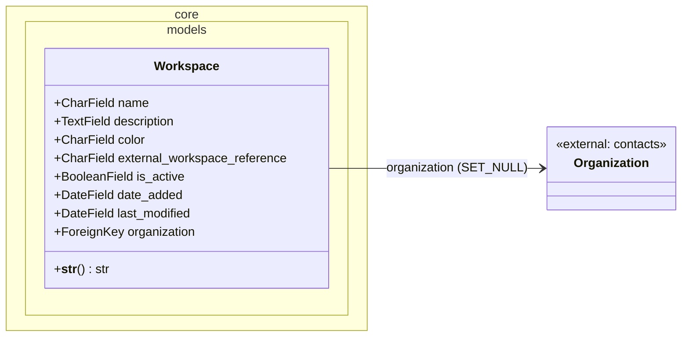

#### Description

`Workspace` is the tenant root entity of the koalixcrm platform, introduced by
CR-8 §8.1. Every business object that participates in multi-tenancy carries a FK
to exactly one `Workspace`. The model is a concrete `django.db.models.Model` with
no additional base class.

The `name` field is unique across the entire database, providing a
human-readable identifier for tenant isolation. The `external_workspace_reference`
field stores a short prefix (e.g. `REP`, `MSD`) used to build human-readable
composite identifiers such as `REP-TASK-1`; it is optional and defaults to an
empty string. The `color` field is a seven-character hex color string (e.g.
`#3a7bd5`) that the admin header uses as a visual cue to prevent workspace
mix-ups when a user switches between tenants.

The `is_active` flag is indexed (`db_index=True`) because workspace-aware
queries that filter for active workspaces are expected to be frequent. The
`date_added` and `last_modified` fields are managed automatically by Django
(`auto_now_add` and `auto_now`).

The optional `organization` FK links the workspace to a legal entity in the
`contacts` application. It uses `SET_NULL` on delete, so removing an organization
does not cascade-delete workspaces.

#### `__str__`

Returns the `name` of the workspace. Trivial delegation — no flow diagram required.

---

### WorkspaceScopedModel

#### Class Diagram

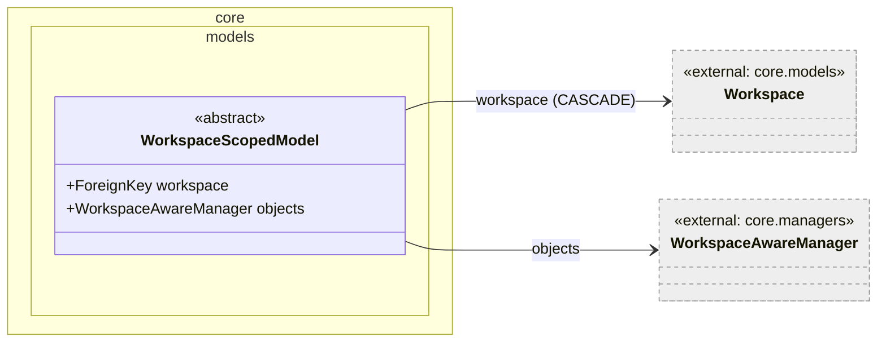

#### Description

`WorkspaceScopedModel` is the single abstract base class that any model must
inherit from to become tenant-aware. Defined in CR-9 §9.1, it provides two
things automatically to all concrete subclasses:

1. A non-optional `workspace` ForeignKey to `core.Workspace` with
   `on_delete=CASCADE`. The `related_name='+'` suppresses the reverse accessor on
   `Workspace`, avoiding name collisions across the many models that inherit this
   base.
2. A class-level `objects` manager set to `WorkspaceAwareManager()`. This manager
   transparently scopes all queryset operations to the active workspace stored in
   the `_active_workspace` ContextVar, so callers do not need to add
   `.filter(workspace=...)` manually.

Because the class is abstract (`Meta.abstract = True`), no database table is
created for `WorkspaceScopedModel` itself. All its fields are merged into the
concrete subclass table at migration time.

`PDFExportProcess` is the only model within `core/` that directly subclasses
`WorkspaceScopedModel`. Other applications in the koalixcrm platform reference
this base class for their own models.

---

### WorkspaceSwitchEvent

#### Class Diagram

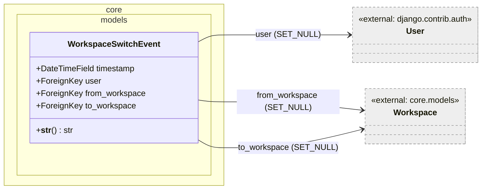

#### Description

`WorkspaceSwitchEvent` is an append-only audit log record that is written every
time a user changes their active workspace, whether through the dashboard module
or the admin header switcher, as specified in CR-8 §8.6. The model does not
inherit `WorkspaceScopedModel` — it intentionally sits outside tenant scoping
because it records the act of crossing workspace boundaries.

All three FKs (`user`, `from_workspace`, `to_workspace`) use `SET_NULL` on
delete, ensuring that deleting a user or a workspace does not remove audit
history. `from_workspace` is additionally nullable (`blank=True`) to support the
case where the user switches into a workspace for the first time and had no prior
active workspace.

The `timestamp` field is set automatically at creation (`auto_now_add=True`). The
default ordering is `['-timestamp']` (most recent first).

A composite database index on `(user, timestamp)` is declared in `Meta.indexes`
to support efficient per-user history queries.

#### `__str__`

Returns a human-readable summary including the user, source workspace, target
workspace, and timestamp. Trivial string formatting — no flow diagram required.

---

### Role

#### Description

`Role` is a `django.db.models.TextChoices` enumeration. It defines the seven
named permission levels that the access-control system recognises:

| Value | Display Label | Intended Semantics |
|---|---|---|
| `admin` | Admin (full control) | Full administrative rights within a workspace |
| `editor` | Editor (edit + read) | Can create and modify records |
| `viewer` | Viewer (read only) | Read-only access |
| `commenter` | Commenter (read + comment) | Read access plus comment rights |
| `employee` | Employee (WFS: workflow participant) | WFS workflow participation |
| `line_manager` | Line Manager (WFS: people management) | WFS team-lead role |
| `project_manager` | Project Manager (WFS: project lead) | WFS project-lead role |

`Role` is not a database model. It is used as the `choices` source for the
`role` `CharField` on `RoleInWorkspace`, and is available for import wherever
role comparisons are needed. Per the source file docstring, object-level grants
(`RoleOnObject`) are deferred to a later change request (CR-10).

---

### RoleInWorkspace

#### Class Diagram

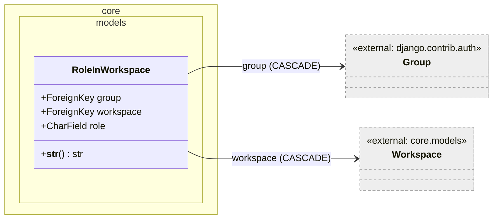

#### Description

`RoleInWorkspace` is the workspace-level grant record that implements RBAC. It
binds a Django auth `Group` (not an individual `User`) to a `Workspace` at a
specific `Role`, as described in CR-8 §8.3. Users gain workspace access
indirectly through their membership in one or more groups.

The `group` FK carries `db_index=True` explicitly, in addition to the implicit
index that Django creates for FK columns, signalling that lookups by group are a
common access pattern. Both FK columns use `CASCADE` deletion semantics: removing
a group or a workspace removes all associated role grants.

The three-column `unique_together` constraint on `(group, workspace, role)`
prevents duplicate grants of the same role to the same group in the same
workspace, while still allowing the same group to hold multiple distinct roles.

The `role` field stores one of the `Role.choices` values as a plain `CharField`
of max length 64. The `get_role_display()` helper (generated by Django's
`TextChoices`) returns the human-readable label.

#### `__str__`

Returns `"<group.name> → <workspace.name> (<role display>)"`. Trivial string
formatting — no flow diagram required.

---

### Currency

#### Class Diagram

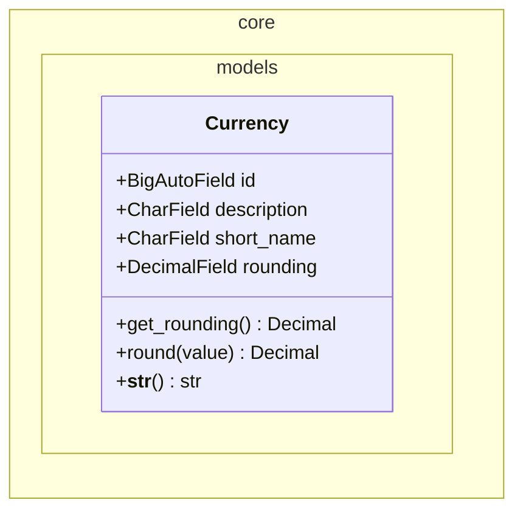

#### Description

`Currency` is a lookup model that stores a monetary unit together with its
display symbol and rounding resolution. It carries no FKs to other models;
other models reference `Currency` via ForeignKey.

The `short_name` field is a three-character string (e.g. `CHF`, `EUR`) displayed
after prices in the UI. The `rounding` field records the minimum increment to
which monetary values in this currency should be rounded (e.g. `0.05` for Swiss
francs). It is nullable; the `get_rounding` method returns `Decimal('0.05')` as
the default when the field is `None`.

#### `get_rounding`

Signature: `get_rounding() -> Decimal`

Returns the stored `rounding` value if set, otherwise the constant
`Decimal('0.05')`. The method has a single branch and is straightforward — no
flow diagram required.

#### `round`

Signature: `round(value: Decimal) -> Decimal`

Rounds `value` down to the nearest multiple of the rounding resolution by integer
truncation:

```python
rounded_value = int(value / self.get_rounding()) * self.get_rounding()
```

This is a floor-rounding (truncation toward zero) approach, not banker's
rounding. The caller receives a `Decimal` result.

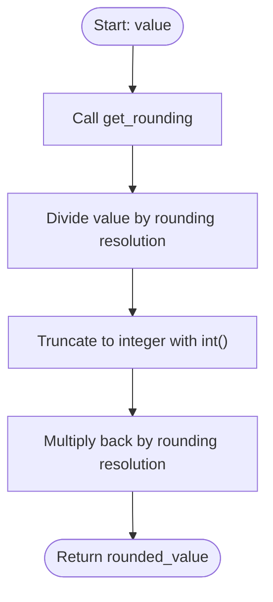

---

### CurrencyTransform

#### Class Diagram

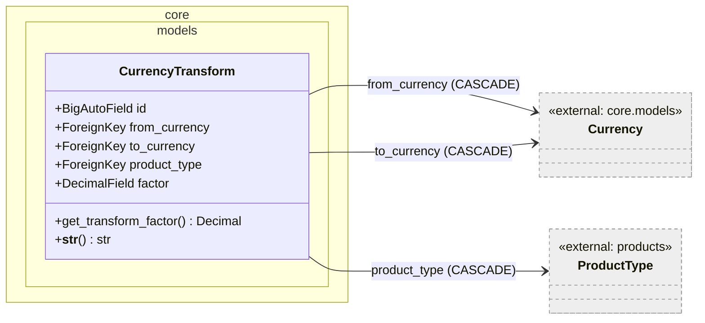

#### Description

`CurrencyTransform` represents a directional exchange-rate factor between two
currencies, scoped to a specific `ProductType`. The same currency pair may carry
different rates for different product types. All three FK fields are non-nullable
(`blank=False, null=False`), meaning every transform record must reference a
concrete source currency, target currency, and product type.

The `factor` field holds the multiplicative factor applied to an amount in
`from_currency` to produce the equivalent amount in `to_currency`. It is stored
with up to 17 significant digits and 2 decimal places.

The `from_currency` and `to_currency` FKs both point to `Currency` but use
different `related_name` values (`db_reltransformfromcurrency` and
`db_reltransformtocurrency`) to enable reverse lookups from a currency to all
transforms that start or end at it.

#### `get_transform_factor`

Signature: `get_transform_factor() -> Decimal`

Returns `self.factor` directly. Trivial accessor — no flow diagram required.

---

### Tax

#### Class Diagram

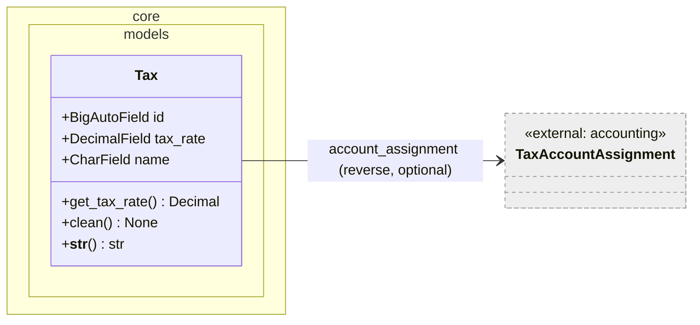

#### Description

`Tax` records a named percentage tax rate. Per the model's docstring, the
historical FK linkages to `accounting.Account` have been relocated to the
`accounting.TaxAccountAssignment` related object (introduced in CR-2c), so `Tax`
itself has no direct FK to any accounting model. This allows the model to be used
in deployments where the `koalixcrm.accounting` application is not installed.

The `tax_rate` field is a `DecimalField` with 5 total digits and 2 decimal
places, representing a percentage (e.g. `7.70` for 7.7% VAT).

#### `get_tax_rate`

Signature: `get_tax_rate() -> Decimal`

Returns `self.tax_rate`. Trivial accessor — no flow diagram required.

#### `clean`

Signature: `clean() -> None`

This method implements optional cross-model validation that is active only when
the `koalixcrm.accounting` application is installed. It enforces the invariant
that each `Tax` instance must have a corresponding `TaxAccountAssignment` with
both `activa_account` and `passiva_account` populated.

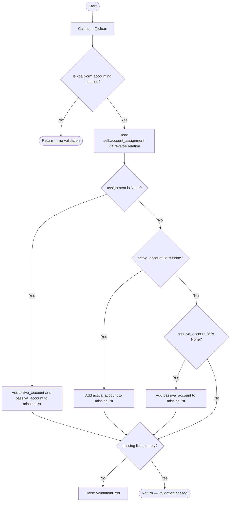

The method accesses `account_assignment` via `getattr(self, 'account_assignment', None)`,
which gracefully handles the case where no `TaxAccountAssignment` row exists for
this `Tax` (Django raises `RelatedObjectDoesNotExist` on direct attribute access in
that scenario; `getattr` with a default of `None` avoids the exception).

---

### Unit

#### Class Diagram

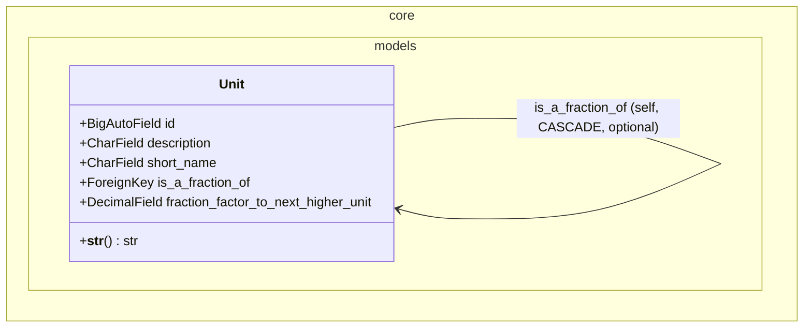

#### Description

`Unit` is a lookup model for measurement units. It models a simple hierarchy
where a finer unit (e.g. gram) can declare itself a fraction of a coarser unit
(e.g. kilogram) via the self-referential FK `is_a_fraction_of`. The
`fraction_factor_to_next_higher_unit` field stores the numeric factor relating
the two levels (e.g. `1000.0000000000` for grams-to-kilograms). Both the FK and
the factor are optional (`blank=True, null=True`), so standalone units without a
hierarchy parent are fully supported.

The `short_name` field is a three-character string displayed in the UI after a
quantity value. Deletion of a parent unit cascades through child units because
the FK uses `on_delete=CASCADE`.

The `Unit` model carries no methods beyond `__str__`. Actual conversion
arithmetic is handled by `UnitTransform`.

---

### UnitTransform

#### Class Diagram

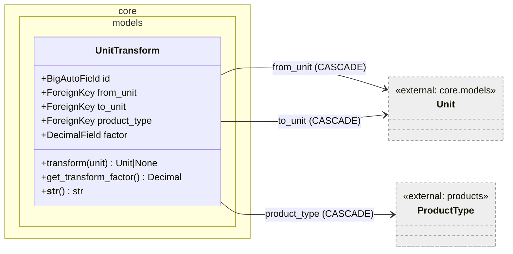

#### Description

`UnitTransform` stores a directional, product-type-scoped conversion factor
between two `Unit` instances. It mirrors the design of `CurrencyTransform`: the
same unit pair may carry different factors for different product types.

All three FK fields are non-nullable. The `from_unit` and `to_unit` FKs use
distinct `related_name` values (`db_reltransfromfromunit`,
`db_reltransfromtounit`) to allow reverse lookups from a unit.

The `factor` field stores the multiplicative value applied to a quantity in
`from_unit` to obtain the equivalent quantity in `to_unit` (up to 17 significant
digits, 2 decimal places).

#### `transform`

Signature: `transform(unit: Unit) -> Unit | None`

Returns `self.to_unit` if the supplied `unit` equals `self.from_unit`, otherwise
returns `None`. This enables callers to test whether this transform is applicable
for a given source unit before using it.

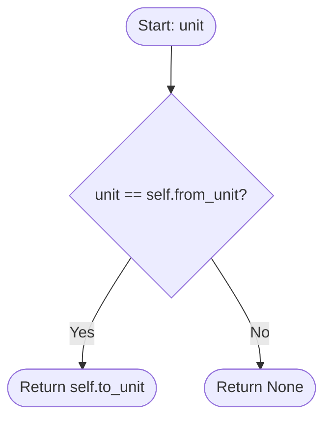

#### `get_transform_factor`

Signature: `get_transform_factor() -> Decimal`

Returns `self.factor`. Trivial accessor — no flow diagram required.

---

### PDFExportProcess

#### Class Diagram

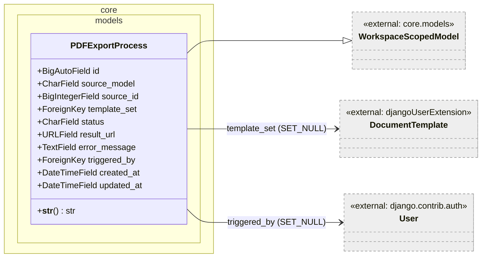

#### Description

`PDFExportProcess` tracks the full lifecycle of an asynchronous PDF generation
job, inheriting tenant scoping from `WorkspaceScopedModel`. Each instance
represents one export request: which business object (`source_model` +
`source_id`) should be rendered, which `DocumentTemplate` to use, and who
initiated the request.

Per the model's docstring, creation of a `PDFExportProcess` record triggers a
Django signal that enqueues a `PDFExportCommand` on SQS. A Celery worker picks up
the command and performs the FOP-based PDF transformation. The worker updates the
`status` field and, on success, writes the resulting S3 URL into `result_url`. On
failure, it stores the error description in `error_message`.

**Status lifecycle.** The `status` field accepts one of four string values:

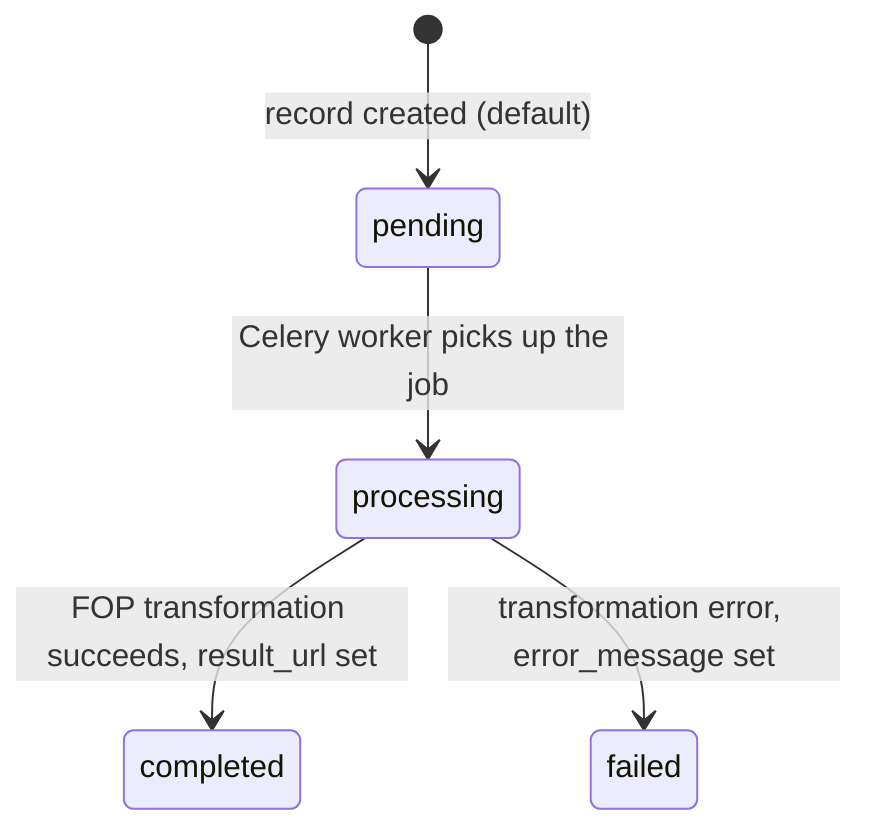

The `source_model` field holds the class name of the business object as a string
(e.g. `"Invoice"`, `"Quotation"`). Together with `source_id`, it provides a
generic pointer to the source record without a direct FK — allowing any model
type to be the export subject without schema changes.

The `template_set` FK uses `SET_NULL` on delete, so deleting a `DocumentTemplate`
does not cascade-delete the export history. Similarly, `triggered_by` uses
`SET_NULL`, preserving audit records even after a user account is removed.

The `created_at` and `updated_at` timestamps are managed automatically by Django.
Default ordering is `['-created_at']` (most recent first).

#### `__str__`

Returns `"PDFExport #<id> [<status>] <source_model>:<source_id>"`. Trivial string
formatting — no flow diagram required.

---

### WorkspaceAwareManager

#### Class Diagram

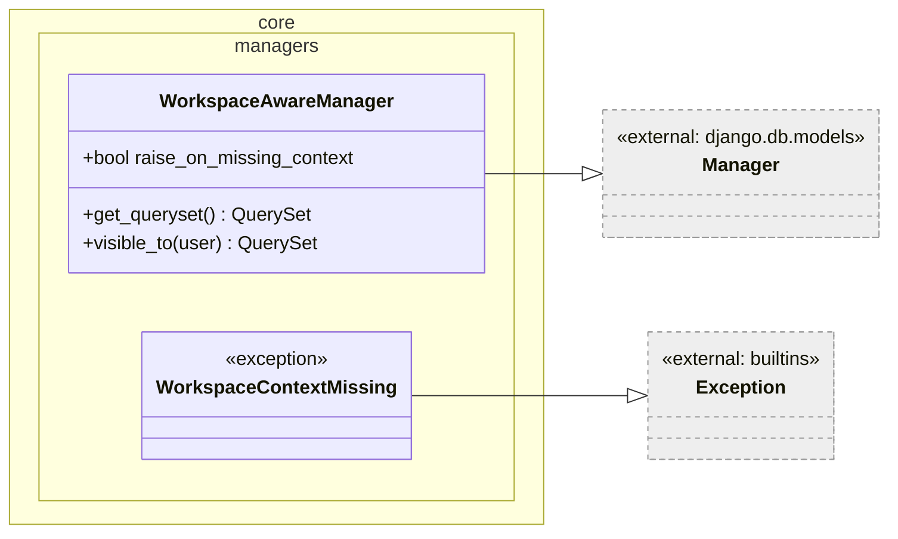

#### Description

`WorkspaceAwareManager` is the custom Django `Manager` that implements automatic
tenant scoping at the queryset level (CR-9 §9.2). It is registered as the
`objects` manager on `WorkspaceScopedModel` and thereby inherited by all concrete
tenant-scoped models.

The scoping state is stored in a module-level `ContextVar[Workspace | None]`
named `_active_workspace` with a default of `None`. Because `ContextVar` is
per-task (per async task or per OS thread), concurrent requests do not interfere
with each other's active workspace.

The class attribute `raise_on_missing_context` defaults to `False`. When `False`,
a missing workspace context causes `get_queryset` to return an unfiltered
queryset (all rows). When `True`, the same condition raises
`WorkspaceContextMissing`. This flag allows a given manager instance to opt into
stricter behaviour if the calling application requires it.

`WorkspaceContextMissing` is a plain `Exception` subclass with no additional
fields. It is raised only when `raise_on_missing_context=True` and no workspace
is active.

#### `get_queryset`

Signature: `get_queryset() -> QuerySet`

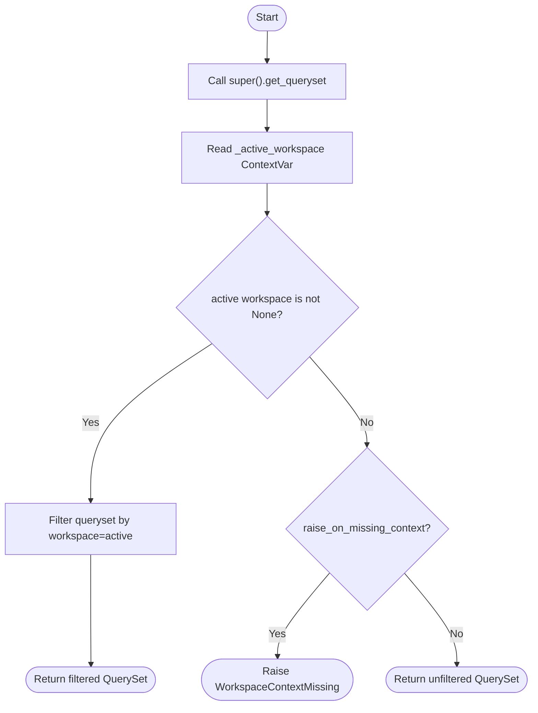

#### `visible_to`

Signature: `visible_to(user: AbstractBaseUser) -> QuerySet`

Delegates to the `user_workspaces(user)` helper (imported from
`koalixcrm.core.access`) to obtain the set of workspaces the user may access,
then filters the manager's queryset to rows belonging to those workspaces. The
import is deferred (inside the method body) to avoid a circular-import issue
between the managers and access modules.

This method is an alternative to the context-based scoping for cases where the
caller knows which user's perspective to apply but does not want to manipulate the
`ContextVar`. It can be combined with additional queryset filters by the caller.

---

### Context Helpers (module-level functions in `workspace_aware.py`)

The module exposes four public callables alongside `WorkspaceAwareManager`:

#### `activate_workspace`

Signature: `activate_workspace(ws: Workspace) -> None`

Sets the `_active_workspace` ContextVar to `ws`. After this call, all
`WorkspaceAwareManager.get_queryset()` invocations in the same task/thread will
filter by `ws`. There is no return value and no exception path.

#### `deactivate_workspace`

Signature: `deactivate_workspace() -> None`

Resets the `_active_workspace` ContextVar to `None`, removing the active
workspace filter. Equivalent to calling `activate_workspace(None)` conceptually,
but uses `ContextVar.set` which is the correct API.

#### `get_active_workspace`

Signature: `get_active_workspace() -> Workspace | None`

Returns the current value of `_active_workspace`, or `None` if no workspace is
active. Trivial read — no flow diagram required.

#### `workspace_context`

Signature: `workspace_context(ws: Workspace) -> Iterator[Workspace]`

A `@contextmanager` that activates `ws` on entry and restores the previous state
on exit using `ContextVar.reset(token)`. This is the preferred way to temporarily
scope a block of code to a workspace because it correctly restores the previous
value (which may itself be a non-None workspace) rather than resetting to `None`.

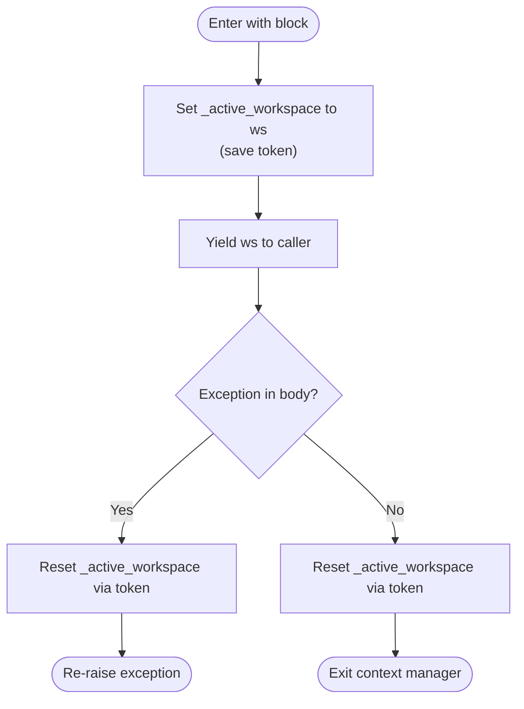

The `finally` block guarantees the reset even when the `with` body raises an
exception.

---

## Persistent Storage

The following table summarises the database tables introduced by the models in
this module, together with their key constraints and relationships.

| Table | Model | Key Constraints |
|---|---|---|
| `crm_workspace` | `Workspace` | `name` unique; `is_active` indexed |
| `crm_workspaceswitchevent` | `WorkspaceSwitchEvent` | Index on `(user, timestamp)` |
| `crm_roleinworkspace` | `RoleInWorkspace` | `unique_together`: `(group, workspace, role)` |
| `crm_currency` | `Currency` | No unique constraints; `short_name` is 3 chars |
| `crm_currencytransform` | `CurrencyTransform` | All FKs non-nullable |
| `crm_tax` | `Tax` | No unique constraints |
| `crm_unit` | `Unit` | Self-referential FK (`is_a_fraction_of`) |
| `crm_unittransform` | `UnitTransform` | All FKs non-nullable |
| `crm_pdfexportprocess` | `PDFExportProcess` | Inherits `workspace` FK from `WorkspaceScopedModel`; ordered by `-created_at` |

`WorkspaceScopedModel` is abstract and contributes no table of its own; its
`workspace` FK column appears in the concrete subclass table (`crm_pdfexportprocess`).

---

## In-Memory State

The `core.managers` module holds one piece of in-memory state:

**`_active_workspace: ContextVar[Workspace | None]`**

This module-level `ContextVar` stores the active workspace for the current
execution context (async task or OS thread). It is accessed only through the
public helpers (`activate_workspace`, `deactivate_workspace`,
`get_active_workspace`, `workspace_context`) and read by
`WorkspaceAwareManager.get_queryset`.

Because `ContextVar` values are per-task, horizontal scaling (multiple
WSGI/ASGI worker processes or multiple async tasks) does not cause cross-request
leakage. However, within a single task the active workspace is a global side
effect: any code in the same call stack that calls a `WorkspaceAwareManager`
will see the same filter. Callers should use `workspace_context` (which saves and
restores the previous value) rather than `activate_workspace` / `deactivate_workspace`
directly whenever re-entrant usage is possible.

There is no persistent or distributed cache involved; the `ContextVar` is
discarded at the end of each request/task lifecycle.

---

## Design Patterns Used

### Multi-Tenancy via WorkspaceScopedModel

The `Workspace` / `WorkspaceScopedModel` pair implements a **shared-schema
multi-tenancy** pattern: all tenants share a single database and all tenant-owned
tables carry a discriminator FK (`workspace`). The `WorkspaceAwareManager`
automatically applies the discriminator filter at the queryset level, so
application code within a request context does not need to pass the workspace
explicitly on every query.

### Repository / Custom Manager

`WorkspaceAwareManager` follows the **Repository** pattern variant common in
Django: it centralises the data-access policy (workspace filtering, user-visible
scoping) in a single place and exposes it to all models that inherit
`WorkspaceScopedModel`. The `visible_to(user)` method is a query factory that
encapsulates an access-policy decision (which workspaces a user may see) rather
than scattering that logic across views.

### Context Object (ContextVar)

The `_active_workspace` `ContextVar` implements the **Context Object** pattern:
a piece of ambient, implicit state that crosses call boundaries without requiring
it to be threaded through every function signature. The `workspace_context` context
manager provides safe, RAII-style lifecycle management for that state.

### Transform / Conversion Objects

`CurrencyTransform` and `UnitTransform` implement the **Transform** pattern: each
record encapsulates a single directional conversion with a factor, scoped by
product type. Callers use `get_transform_factor()` to retrieve the factor and
apply it themselves, or (for `UnitTransform`) use `transform(unit)` to verify
applicability before converting.

### State Machine (PDFExportProcess)

`PDFExportProcess.status` implements a simple **State Machine** with four states
(`pending`, `processing`, `completed`, `failed`). The transitions are driven by
external actors (the Django signal handler and the Celery worker), not by methods
on the model itself.

---

## External Dependencies

| Requirement | Version/Details | Notes |
|---|---|---|
| Django | `>=4.2` (inferred from project requirements) | `django.db.models`, `django.contrib.auth`, `django.apps`, `django.core.exceptions` |
| Python | `>=3.10` (inferred from `ContextVar` usage and type annotations) | `contextlib`, `contextvars`, `decimal`, `typing` |
| `koalixcrm.contacts` | Internal application | `contacts.Organization` referenced by `Workspace.organization` |
| `koalixcrm.products` | Internal application | `products.ProductType` referenced by `CurrencyTransform` and `UnitTransform` |
| `djangoUserExtension` | Internal application | `djangoUserExtension.DocumentTemplate` referenced by `PDFExportProcess.template_set` |
| `koalixcrm.accounting` | Internal application (optional) | `Tax.clean()` conditionally validates against `accounting.TaxAccountAssignment` only when this app is installed |
| `koalixcrm.core.access` | Internal module | `user_workspaces(user)` helper used by `WorkspaceAwareManager.visible_to` |

---

## Appendix

### References

- CR-8 §8.1–§8.6: Internal change request introducing `Workspace`, `RoleInWorkspace`, and `WorkspaceSwitchEvent`
- CR-9 §9.1–§9.2: Internal change request introducing `WorkspaceScopedModel` and `WorkspaceAwareManager`
- CR-2c: Internal change request relocating tax account linkages to `accounting.TaxAccountAssignment`
- CR-10: Deferred change request for object-level grants (`RoleOnObject`) — not yet implemented

### List of Illustrations

| Figure | Location |
|---|---|
| Workspace class diagram | [Workspace — Class Diagram](#class-diagram) |
| WorkspaceScopedModel class diagram | [WorkspaceScopedModel — Class Diagram](#class-diagram-1) |
| WorkspaceSwitchEvent class diagram | [WorkspaceSwitchEvent — Class Diagram](#class-diagram-2) |
| RoleInWorkspace class diagram | [RoleInWorkspace — Class Diagram](#class-diagram-3) |
| Currency class diagram | [Currency — Class Diagram](#class-diagram-4) |
| Currency.round flowchart | [Currency.round — Flowchart](#round) |
| CurrencyTransform class diagram | [CurrencyTransform — Class Diagram](#class-diagram-5) |
| Tax class diagram | [Tax — Class Diagram](#class-diagram-6) |
| Tax.clean flowchart | [Tax.clean — Flowchart](#clean) |
| Unit class diagram | [Unit — Class Diagram](#class-diagram-7) |
| UnitTransform class diagram | [UnitTransform — Class Diagram](#class-diagram-8) |
| UnitTransform.transform flowchart | [UnitTransform.transform — Flowchart](#transform) |
| PDFExportProcess class diagram | [PDFExportProcess — Class Diagram](#class-diagram-9) |
| PDFExportProcess status state machine | [PDFExportProcess — State Machine](#description-8) |
| WorkspaceAwareManager class diagram | [WorkspaceAwareManager — Class Diagram](#class-diagram-10) |
| WorkspaceAwareManager.get_queryset flowchart | [get_queryset — Flowchart](#get_queryset) |
| workspace_context flowchart | [workspace_context — Flowchart](#workspace_context) |
