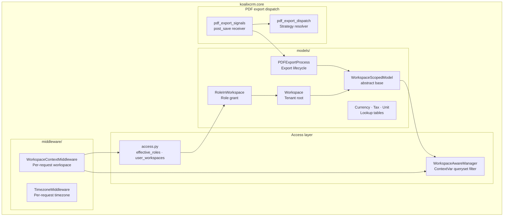
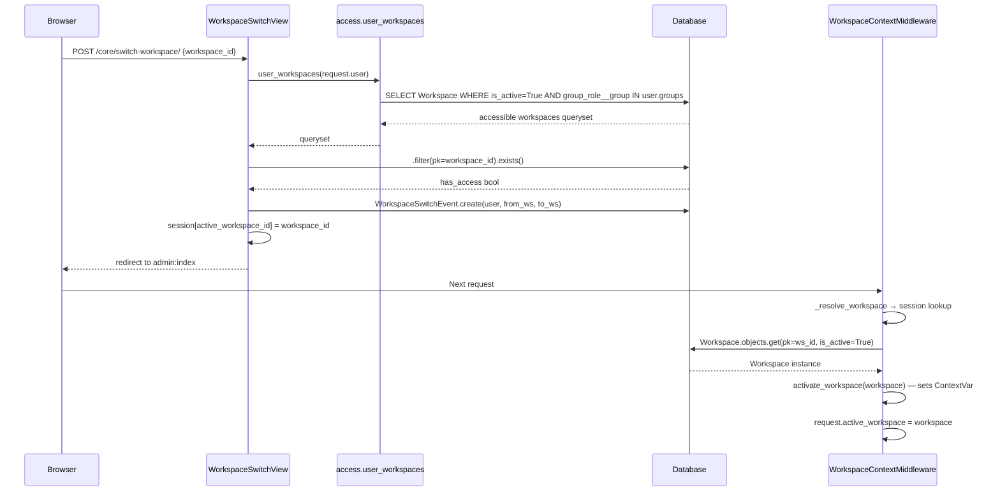
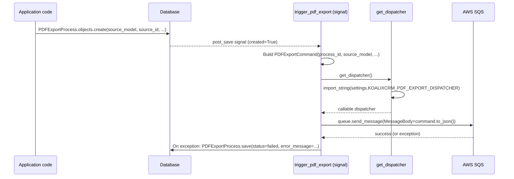
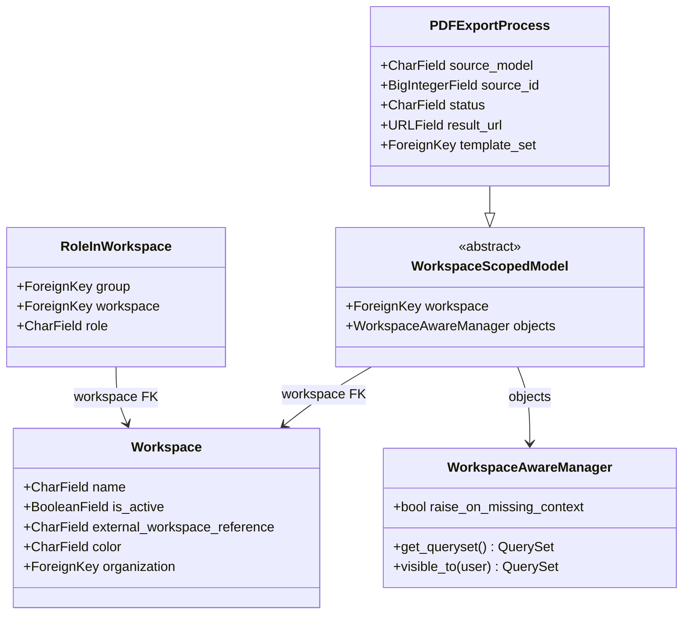
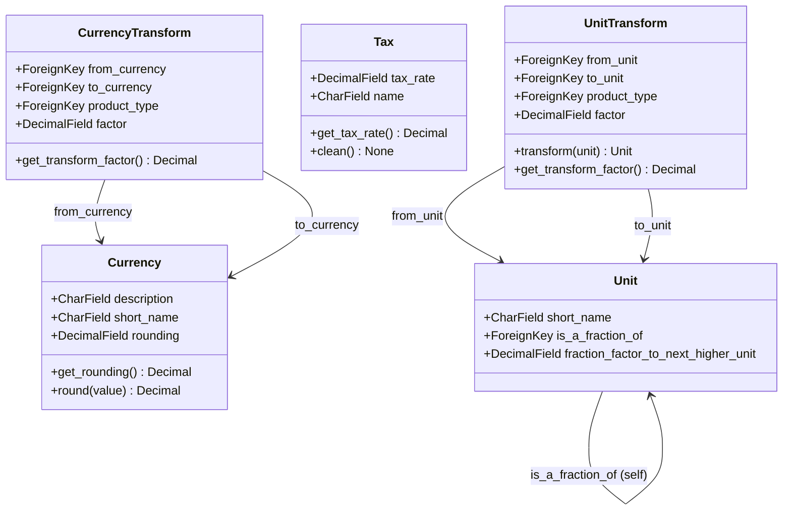

# Mid-Level Documentation: koalixcrm.core

## Introduction

### Purpose of the Package

The `koalixcrm.core` Django application is the foundational layer of the koalixCRM platform. It
provides four cross-cutting capabilities that all other applications depend on:

1. **Tenant isolation** — the `Workspace` model and `WorkspaceScopedModel` abstract base establish
   a shared-schema multi-tenancy substrate. Every business object that participates in tenancy
   carries a FK to exactly one `Workspace`.
2. **Role-Based Access Control (RBAC)** — the `RoleInWorkspace` model and the `access` module
   implement workspace-level permission grants, mapping Django auth `Group` memberships to named
   roles within a workspace.
3. **Shared lookup tables** — `Currency`, `CurrencyTransform`, `Tax`, `Unit`, and `UnitTransform`
   are platform-wide reference data consumed by all other applications.
4. **Asynchronous PDF export infrastructure** — the `PDFExportProcess` model, the signal handler,
   and the swappable dispatcher form the pipeline through which any application can request
   FOP-based PDF generation without coupling to the transport layer.

### Contents Overview

| Sub-package / Module | Role |
|---|---|
| `core/models/` | Workspace, RBAC, lookup table, and PDFExportProcess ORM models |
| `core/managers/` | `WorkspaceAwareManager` and ContextVar-based context helpers |
| `core/access.py` | Pure functions implementing the RBAC query substrate |
| `core/app_checks.py` | Peer-dependency system-check helper |
| `core/apps.py` | `CoreConfig` — application lifecycle entry point |
| `core/middleware/` | Per-request timezone and workspace activation |
| `core/signals/` | `post_save` signal handler that triggers PDF export dispatch |
| `core/pdf_export_dispatch.py` | Swappable dispatcher strategy (Strategy pattern) |
| `core/views/` | Workspace-switch and timezone-selection views |
| `core/serializers/` | DRF serializers for core models |
| `core/admin/` | Django admin registrations and `WorkspaceScopedModelAdmin` mixin |
| `core/management/commands/` | Seed and migration-repair management commands |
| `core/static/` | Default XSL FOP template files |
| `core/locale/` | Translation catalogues (de, es, fr, pt_BR) |

### Target Audience

Software development engineers who need to use, extend, or integrate with the `koalixcrm.core`
package. Engineers who write new Django apps within the koalixCRM platform should read this
document to understand how to inherit tenant isolation and PDF export capabilities.

### Glossary

| Term/Acronym | Full Form | Description |
|---|---|---|
| Workspace | — | The coarse tenant scope. Every business object that participates in multi-tenancy belongs to exactly one `Workspace`. |
| WorkspaceScopedModel | — | Abstract Django model base class adding the `workspace` FK and attaching `WorkspaceAwareManager` to all concrete subclasses. |
| ContextVar | Python `contextvars.ContextVar` | A per-task (per-coroutine or per-OS-thread) variable used to hold the active workspace without using a thread-local. |
| RBAC | Role-Based Access Control | Access-control model where permissions are attached to named roles rather than individual users. |
| Role | — | `TextChoices` enumeration of seven named permission levels a `Group` may hold inside a workspace. |
| RoleInWorkspace | — | Join-table model binding a Django auth `Group` to a `Workspace` at a given `Role`. |
| WorkspaceAwareManager | — | Custom Django `Manager` that automatically scopes querysets to the active workspace held in a `ContextVar`. |
| PDFExportProcess | — | Persistent record tracking the full lifecycle of an asynchronous FOP-based PDF generation job. |
| FOP | Apache Formatting Objects Processor | XSL-FO based PDF renderer used for document generation. |
| SQS | Amazon Simple Queue Service | AWS managed message queue used as the default PDF-export transport. |
| DRF | Django REST Framework | Third-party library providing API views and serializers. |
| CR-4 / CR-8 / CR-9 | Change Request 4 / 8 / 9 | Internal design change requests introducing the PDF dispatcher, Workspace/RBAC, and WorkspaceScopedModel/admin, respectively. |
| WFS | Workflow System | The workflow sub-system of the koalixCRM platform that shares the `Workspace` tenant concept. |
| MTI | Multi-Table Inheritance | Django ORM pattern where a child model stores its extra columns in a separate table. |
| XSL | Extensible Stylesheet Language | File format used for PDF template definitions. |

---

## Package Diagram

**Figure 1 — core package structure and internal dependencies**

Detailed component documentation:

- [Core Models and Managers LL](QQ_LL_Doc_Core_Models.md)
- [Core Infrastructure LL](QQ_LL_Doc_Core_Infrastructure.md)

---

## Interaction Diagrams

### Workspace Switching Flow

A user switches their active workspace through the admin header or the Grappelli dashboard
switcher. The following sequence shows the complete path from the POST submission to the next
request operating under the new workspace.

**Figure 2 — Workspace switching sequence**

For implementation details of `WorkspaceSwitchView` and `WorkspaceContextMiddleware` see
[Core Infrastructure LL](QQ_LL_Doc_Core_Infrastructure.md). For the `WorkspaceAwareManager`
ContextVar mechanism see [Core Models and Managers LL](QQ_LL_Doc_Core_Models.md).

---

### PDF Export Dispatch Flow

Any application creates a `PDFExportProcess` record to trigger an asynchronous PDF generation.
The following sequence shows the path from record creation to the message being enqueued on SQS.

**Figure 3 — PDF export dispatch sequence**

The Celery worker (outside `core`) consumes the SQS message, performs the FOP transformation,
and writes the result URL or error back to the `PDFExportProcess` row via the
`PDFExportProcessJSONSerializer`.

For signal handler implementation details see [Core Infrastructure LL](QQ_LL_Doc_Core_Infrastructure.md).
For `PDFExportProcess` status state machine see [Core Models and Managers LL](QQ_LL_Doc_Core_Models.md).

---

## Class Diagrams per Package

### models/ and managers/

**Figure 4 — Workspace, RBAC, and manager classes**

**Figure 5 — Lookup table models**

---

## Design Patterns Used

### ContextVar-Based Tenant Isolation

`WorkspaceAwareManager` reads a module-level `ContextVar[Workspace | None]` named
`_active_workspace` inside `get_queryset`. Because `ContextVar` is scoped per async task or OS
thread, concurrent requests cannot read each other's active workspace. The public helpers
`activate_workspace`, `deactivate_workspace`, `get_active_workspace`, and `workspace_context`
are the only permitted entry points to this state.

The `workspace_context` context manager uses `ContextVar.reset(token)` on exit, which correctly
restores the previous value rather than unconditionally setting `None`. This makes it safe for
re-entrant or nested usage.

`WorkspaceContextMiddleware` calls `activate_workspace` on entry and `deactivate_workspace` in a
`finally` block so the ContextVar is always cleared at request boundary, even when the view
raises an exception.

See [Core Models and Managers LL — WorkspaceAwareManager](QQ_LL_Doc_Core_Models.md) for method-level detail.

### Manager / Repository Pattern

`WorkspaceAwareManager` centralises the data-access policy for all tenant-scoped models in a
single place. The `visible_to(user)` method encapsulates the access-policy decision (which
workspaces a user may see) by delegating to `user_workspaces(user)` from `access.py`, rather
than scattering that logic across views.

### RBAC via RoleInWorkspace

Permissions are granted to Django auth `Group` objects, not to individual users. Each
`RoleInWorkspace` row binds a `Group` to a `Workspace` at one of seven `Role` values. The
`effective_roles(user, obj)` helper traverses the `user → groups → RoleInWorkspace` chain
to produce the set of role codes the user holds on a given object. `permissions_for_role(role)`
maps a role code to Django per-model action codes (`add`, `change`, `delete`, `view`).

Superusers bypass all workspace-level checks by receiving all role values without querying
`RoleInWorkspace`. Unauthenticated users and objects without a `workspace` attribute both return
empty sets immediately.

See [Core Infrastructure LL — Access Control](QQ_LL_Doc_Core_Infrastructure.md) for
function-level flow diagrams.

### Observer / Signal Pattern

`trigger_pdf_export` is registered as a `post_save` receiver on `PDFExportProcess` using
`dispatch_uid` to prevent duplicate registrations. The model acts as the subject; the signal
handler is the observer. This decouples the act of requesting a PDF (creating the record) from
the transport logic (enqueuing the command).

The signal handler is connected in `CoreConfig.ready()` by importing the signals module, which
is the idiomatic Django pattern for ensuring receivers are registered before the first request.

### Strategy Pattern (PDF Dispatcher)

`get_dispatcher()` reads `settings.KOALIXCRM_PDF_EXPORT_DISPATCHER` at call time and resolves
the configured dotted path to a callable via `django.utils.module_loading.import_string`. The
default strategy is `default_sqs_dispatcher`, which sends a JSON-encoded `PDFExportCommand` to
the koalixCRM SQS queue. Forks can substitute an alternative dispatcher without modifying the
signal handler or the model.

### Peer-Dependency System Checks

`register_peer_check(app_config)` reads the `required_peers` tuple from any `AppConfig` and
registers a Django system check that emits an `Error` for each missing peer at startup. This
surfaces hard application dependencies at `manage.py check` time rather than at first-request
time. `CoreConfig.required_peers` is currently empty; the mechanism is in place for peer
declarations added in future.

See [Core Infrastructure LL — System Checks](QQ_LL_Doc_Core_Infrastructure.md) for flow detail.

---

## External Dependencies

| Requirement | Version/Details | Notes |
|---|---|---|
| Django | `>=4.2` (inferred from `BigAutoField` default and type annotations) | ORM, `AppConfig`, middleware, signals, session, management commands, admin, `import_string` |
| Python | `>=3.9` (requires `zoneinfo` standard library) | `contextvars.ContextVar`, `contextlib.contextmanager`, `zoneinfo.ZoneInfo`, `decimal.Decimal` |
| Django REST Framework | Not pinned in source | `ModelSerializer`, `DefaultRouter` used in `serializers/` and `urls.py` |
| `grappelli` | Not pinned in source | `DashboardModule` used by `WorkspaceSwitcherModule` |
| `filebrowser` | Not pinned in source | `FileObject` used in `koalixcrm_install_defaulttemplates` |
| `koalixcrm_mq_commands` | Not pinned in source | Provides the `PDFExportCommand` dataclass used by the signal handler and dispatcher |
| `koalixcrm_utils` | Not pinned in source | Provides `get_sqs_queue` called by `default_sqs_dispatcher` |
| `koalixcrm.contacts` | Internal application | `contacts.Organization` referenced by `Workspace.organization` |
| `koalixcrm.products` | Internal application | `products.ProductType` referenced by `CurrencyTransform` and `UnitTransform` |
| `djangoUserExtension` | Internal application | `DocumentTemplate` referenced by `PDFExportProcess.template_set`; `DocumentTemplateViewSet` in `urls.py` |
| `koalixcrm.accounting` | Internal application (optional) | `Tax.clean()` conditionally validates against `accounting.TaxAccountAssignment`; `koalixcrm_install_defaulttemplates` conditionally registers accounting XSL files |

---

## Testing

Information not available: the `core` package does not contain a `tests/` directory or any test
files within the source tree examined. No unit tests, integration tests, or test fixtures were
found for the models, managers, middleware, signals, views, or serializers in this package.

---

## Appendix

### References

- [Core Models and Managers — Low-Level Documentation](QQ_LL_Doc_Core_Models.md)
- [Core Infrastructure — Low-Level Documentation](QQ_LL_Doc_Core_Infrastructure.md)
- CR-4: Swappable PDF-export dispatcher design (internal change request)
- CR-8 §8.1–§8.6: `Workspace`, `RoleInWorkspace`, `WorkspaceSwitchEvent`, and access-control design
- CR-9 §9.1–§9.3: `WorkspaceScopedModel`, `WorkspaceAwareManager`, middleware, and context processor design
- CR-10: Deferred object-level grants (`RoleOnObject`) — not yet implemented
- [Django System Checks framework](https://docs.djangoproject.com/en/stable/topics/checks/)
- [Django Signals documentation](https://docs.djangoproject.com/en/stable/topics/signals/)
- [Python contextvars — ContextVar](https://docs.python.org/3/library/contextvars.html)

### List of Illustrations

| Figure | Title |
|---|---|
| Figure 1 | core package structure and internal dependencies |
| Figure 2 | Workspace switching sequence |
| Figure 3 | PDF export dispatch sequence |
| Figure 4 | Workspace, RBAC, and manager classes |
| Figure 5 | Lookup table models |
