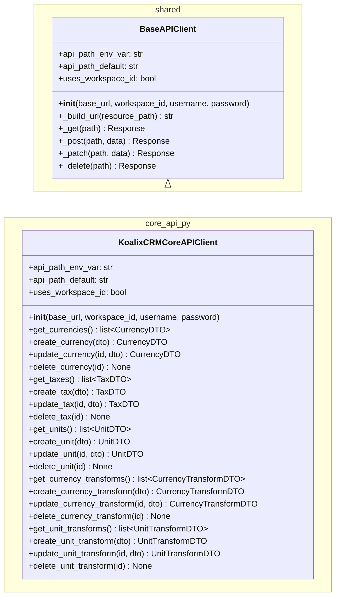
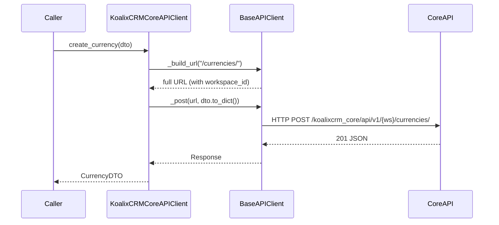
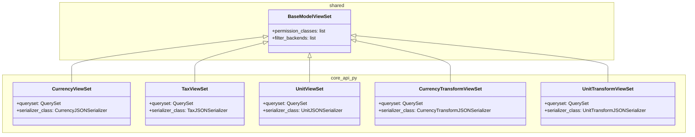
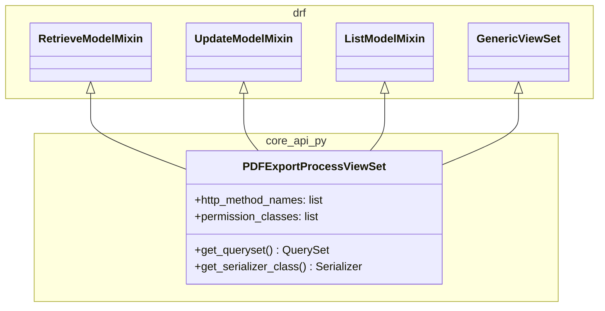
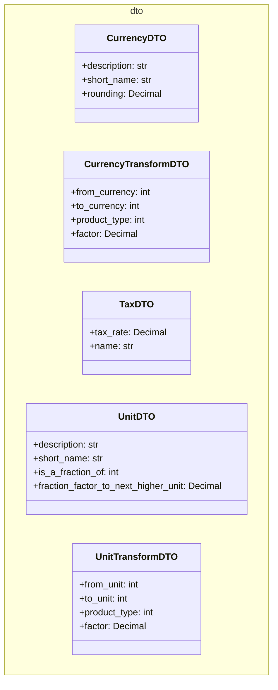

# Low-Level Documentation: `koalixcrm/core_api_py`

**Document type:** QQ Low-Level Component Documentation
**Package:** `koalixcrm/core_api_py`
**Version:** 1.0
**Date:** 2026-06-26

---

## 1. Introduction

### 1.1 Scope

This document describes the internal design and component structure of the `koalixcrm/core_api_py` Python package. The package serves two distinct purposes:

1. **Server-side REST API exposure:** Django REST Framework ViewSets that expose the core financial and unit domain models (Currency, Tax, Unit, and their transform relationships) as JSON REST endpoints, and a restricted ViewSet for the PDF export process lifecycle.
2. **Client-side API access:** A typed Python client class (`KoalixCRMCoreAPIClient`) that other services or test harnesses can use to consume the REST endpoints programmatically.

Data Transfer Objects (DTOs) provide the typed, serializable representations shared by both the client and the API layer.

### 1.2 Target Audience

- Backend developers extending or maintaining the `koalixcrm` core API endpoints.
- Developers of services that consume the core API programmatically via `KoalixCRMCoreAPIClient`.
- Architects reviewing the API surface and access-control model.

### 1.3 Glossary

| Term | Definition |
|---|---|
| DTO | Data Transfer Object — a plain Python dataclass used to carry typed field values across API boundaries. |
| ViewSet | A Django REST Framework class that combines CRUD endpoint logic for a single model. |
| BaseModelViewSet | The shared base class (from `koalixcrm/shared/base_model_view_set.py`) that applies uniform permission and filter configuration to all standard ViewSets. |
| BaseAPIClient | The shared base class (from `koalixcrm/shared/api_client.py`) providing HTTP session management, auth, and workspace-scoped URL construction. |
| ModelPermissionsWithListView | A custom DRF permission class that enforces Django object-level permissions and additionally gates list views. |
| workspace_id | A tenant/workspace identifier injected into API URLs when `uses_workspace_id = True`. |
| PDF Export Process | A background job entity whose lifecycle (status, result URL, error message) is managed by admin action; not creatable or deletable via the REST API. |

---

## 2. Detailed Component: `KoalixCRMCoreAPIClient`

### 2.1 Overview

`KoalixCRMCoreAPIClient` is a typed Python client for the `koalixcrm_core` REST API. It extends `BaseAPIClient` from the shared layer, inheriting HTTP session management, authentication handling, and workspace-scoped URL construction. The class adds typed CRUD methods for each core domain resource: Currency, Tax, Unit, CurrencyTransform, and UnitTransform.

**Source file:** `koalixcrm/core_api_py/core_api_client.py`

### 2.2 Class Diagram



### 2.3 Class Attributes

| Attribute | Value | Purpose |
|---|---|---|
| `api_path_env_var` | `'KOALIXCRM_CORE_API_PATH'` | Environment variable that overrides the default API path prefix. |
| `api_path_default` | `'/koalixcrm_core/api/v1/'` | Default API path prefix used when the env var is not set. |
| `uses_workspace_id` | `True` | Instructs `BaseAPIClient` to inject the workspace ID into every constructed URL. |

### 2.4 Constructor

```python
def __init__(self, base_url: str, workspace_id: int, username: str, password: str)
```

The constructor delegates entirely to `BaseAPIClient.__init__`, passing all four arguments through. No additional initialization logic is performed. `BaseAPIClient` sets up the HTTP session, authenticates with the supplied credentials, and configures the URL builder using `api_path_env_var`, `api_path_default`, and `uses_workspace_id`.

### 2.5 CRUD Method Groups

Each resource group follows the same pattern: the client constructs a resource-specific path, delegates to the appropriate `BaseAPIClient` HTTP method, and deserializes the JSON response into the corresponding DTO.

#### 2.5.1 Currency Methods (`/currencies`)

| Method | HTTP | Path | Input | Output |
|---|---|---|---|---|
| `get_currencies()` | GET | `/currencies/` | — | `list[CurrencyDTO]` |
| `create_currency(dto)` | POST | `/currencies/` | `CurrencyDTO` | `CurrencyDTO` |
| `update_currency(id, dto)` | PATCH | `/currencies/{id}/` | `CurrencyDTO` | `CurrencyDTO` |
| `delete_currency(id)` | DELETE | `/currencies/{id}/` | — | `None` |

#### 2.5.2 Tax Methods (`/taxes`)

| Method | HTTP | Path | Input | Output |
|---|---|---|---|---|
| `get_taxes()` | GET | `/taxes/` | — | `list[TaxDTO]` |
| `create_tax(dto)` | POST | `/taxes/` | `TaxDTO` | `TaxDTO` |
| `update_tax(id, dto)` | PATCH | `/taxes/{id}/` | `TaxDTO` | `TaxDTO` |
| `delete_tax(id)` | DELETE | `/taxes/{id}/` | — | `None` |

#### 2.5.3 Unit Methods (`/units`)

| Method | HTTP | Path | Input | Output |
|---|---|---|---|---|
| `get_units()` | GET | `/units/` | — | `list[UnitDTO]` |
| `create_unit(dto)` | POST | `/units/` | `UnitDTO` | `UnitDTO` |
| `update_unit(id, dto)` | PATCH | `/units/{id}/` | `UnitDTO` | `UnitDTO` |
| `delete_unit(id)` | DELETE | `/units/{id}/` | — | `None` |

#### 2.5.4 CurrencyTransform Methods (`/currency-transforms`)

| Method | HTTP | Path | Input | Output |
|---|---|---|---|---|
| `get_currency_transforms()` | GET | `/currency-transforms/` | — | `list[CurrencyTransformDTO]` |
| `create_currency_transform(dto)` | POST | `/currency-transforms/` | `CurrencyTransformDTO` | `CurrencyTransformDTO` |
| `update_currency_transform(id, dto)` | PATCH | `/currency-transforms/{id}/` | `CurrencyTransformDTO` | `CurrencyTransformDTO` |
| `delete_currency_transform(id)` | DELETE | `/currency-transforms/{id}/` | — | `None` |

#### 2.5.5 UnitTransform Methods (`/unit-transforms`)

| Method | HTTP | Path | Input | Output |
|---|---|---|---|---|
| `get_unit_transforms()` | GET | `/unit-transforms/` | — | `list[UnitTransformDTO]` |
| `create_unit_transform(dto)` | POST | `/unit-transforms/` | `UnitTransformDTO` | `UnitTransformDTO` |
| `update_unit_transform(id, dto)` | PATCH | `/unit-transforms/{id}/` | `UnitTransformDTO` | `UnitTransformDTO` |
| `delete_unit_transform(id)` | DELETE | `/unit-transforms/{id}/` | — | `None` |

### 2.6 Request/Response Flow

All CRUD methods follow the same two-step flow. The following diagram illustrates the pattern for a `create_*` call; the pattern is identical for get, update, and delete operations with the corresponding HTTP verb.



---

## 3. Detailed Component: ViewSet Classes

### 3.1 BaseModelViewSet (External Reference)

**Source file:** `koalixcrm/shared/base_model_view_set.py`

`BaseModelViewSet` is defined in the shared layer and is referenced here because all standard core API ViewSets inherit from it. It extends DRF's `viewsets.ModelViewSet` and applies the following configuration uniformly to all subclasses:

- **`permission_classes`:** `[IsAuthenticated, ModelPermissionsWithListView]` — requires an authenticated session and enforces Django model-level permissions, including on list endpoints.
- **`filter_backends`:** `[SearchFilter, OrderingFilter]` — all list endpoints support `?search=` and `?ordering=` query parameters automatically.

Subclasses only need to declare `queryset` and `serializer_class`; all HTTP methods (GET list, GET detail, POST, PUT, PATCH, DELETE) are provided by `ModelViewSet`.

### 3.2 Standard ViewSets

The following five ViewSets follow the same structural pattern: each extends `BaseModelViewSet`, declares a `queryset` over the corresponding Django ORM model, and assigns a JSON serializer. No additional method overrides are present.

#### 3.2.1 Class Diagram



#### 3.2.2 CurrencyViewSet

**Source file:** `koalixcrm/core_api_py/currency_view_set.py`

Exposes the `Currency` model as a fully RESTful resource. The `queryset` is `Currency.objects.all()` and the serializer is `CurrencyJSONSerializer`. Inherits all CRUD endpoints and permission/filter configuration from `BaseModelViewSet`.

#### 3.2.3 TaxViewSet

**Source file:** `koalixcrm/core_api_py/tax_view_set.py`

Exposes the `Tax` model as a fully RESTful resource. The `queryset` is `Tax.objects.all()` and the serializer is `TaxJSONSerializer`. Inherits all CRUD endpoints and permission/filter configuration from `BaseModelViewSet`.

#### 3.2.4 UnitViewSet

**Source file:** `koalixcrm/core_api_py/unit_view_set.py`

Exposes the `Unit` model as a fully RESTful resource. The `queryset` is `Unit.objects.all()` and the serializer is `UnitJSONSerializer`. Inherits all CRUD endpoints and permission/filter configuration from `BaseModelViewSet`.

#### 3.2.5 CurrencyTransformViewSet

**Source file:** `koalixcrm/core_api_py/currency_transform_view_set.py`

Exposes the `CurrencyTransform` model as a fully RESTful resource. The `queryset` is `CurrencyTransform.objects.all()` and the serializer is `CurrencyTransformJSONSerializer`. Inherits all CRUD endpoints and permission/filter configuration from `BaseModelViewSet`.

#### 3.2.6 UnitTransformViewSet

**Source file:** `koalixcrm/core_api_py/unit_transform_view_set.py`

Exposes the `UnitTransform` model as a fully RESTful resource. The `queryset` is `UnitTransform.objects.all()` and the serializer is `UnitTransformJSONSerializer`. Inherits all CRUD endpoints and permission/filter configuration from `BaseModelViewSet`.

### 3.3 PDFExportProcessViewSet

**Source file:** `koalixcrm/core_api_py/pdf_export_process_view_set.py`

`PDFExportProcessViewSet` intentionally diverges from the standard ViewSet pattern. It does not extend `BaseModelViewSet`. Instead it composes DRF mixins directly:

```python
class PDFExportProcessViewSet(
    mixins.RetrieveModelMixin,
    mixins.UpdateModelMixin,
    mixins.ListModelMixin,
    GenericViewSet,
):
```

#### 3.3.1 Class Diagram



#### 3.3.2 Design Intent

The PDF export process has an asymmetric lifecycle: a process record is created by a Django admin action and must not be created or deleted through the REST API. Only its lifecycle columns (status, result URL, error message) are updated by the background worker and are therefore exposed as writable. Accordingly:

- `CreateModelMixin` and `DestroyModelMixin` are deliberately excluded — POST and DELETE are not supported.
- `http_method_names = ["get", "patch", "head", "options"]` restricts the endpoint at the HTTP layer, rejecting any other verb before Django routing logic is reached.
- `permission_classes = [IsAuthenticated, ModelPermissionsWithListView]` mirrors the standard ViewSet permission policy.

This design ensures that the REST API cannot be used to create spurious PDF export records or remove records that a background process may still be referencing.

#### 3.3.3 Allowed HTTP Operations

| HTTP Method | DRF Action | Effect |
|---|---|---|
| GET (list) | `list` | Returns all PDF export process records visible to the caller. |
| GET (detail) | `retrieve` | Returns a single PDF export process record by ID. |
| PATCH | `partial_update` | Updates lifecycle columns (status, result URL, error message) on an existing record. |
| HEAD | — | Supported for cache/ETag negotiation. |
| OPTIONS | — | Returns allowed methods and schema. |
| POST | — | Rejected (405 Method Not Allowed). |
| PUT | — | Rejected (405 Method Not Allowed). |
| DELETE | — | Rejected (405 Method Not Allowed). |

---

## 4. Detailed Component: DTO Classes

### 4.1 Overview

The `koalixcrm/core_api_py/dto/` directory contains five DTO classes. Each DTO is a plain Python dataclass representing the serializable form of one core domain entity. DTOs are used by `KoalixCRMCoreAPIClient` to pass typed data to and receive typed data from the REST API without coupling callers to Django ORM models.

### 4.2 Class Diagram



### 4.3 CurrencyDTO

**Source file:** `koalixcrm/core_api_py/dto/currency_dto.py`

Represents a currency denomination.

| Field | Type | Description |
|---|---|---|
| `description` | `str` | Human-readable name of the currency (e.g., "Swiss Franc"). |
| `short_name` | `str` | ISO or abbreviated currency code (e.g., "CHF"). |
| `rounding` | `Decimal` | Smallest unit to which amounts in this currency are rounded (e.g., 0.05 for CHF). |

### 4.4 CurrencyTransformDTO

**Source file:** `koalixcrm/core_api_py/dto/currency_transform_dto.py`

Represents an exchange-rate rule between two currencies for a specific product type.

| Field | Type | Description |
|---|---|---|
| `from_currency` | `int` | Primary key of the source `Currency`. |
| `to_currency` | `int` | Primary key of the target `Currency`. |
| `product_type` | `int` | Primary key of the product type to which this rate applies. |
| `factor` | `Decimal` | Multiplier that converts an amount in `from_currency` to `to_currency`. |

### 4.5 TaxDTO

**Source file:** `koalixcrm/core_api_py/dto/tax_dto.py`

Represents a tax definition.

| Field | Type | Description |
|---|---|---|
| `tax_rate` | `Decimal` | Tax rate as a decimal fraction (e.g., 0.077 for 7.7% VAT). |
| `name` | `str` | Human-readable label for the tax (e.g., "MwSt 7.7%"). |

### 4.6 UnitDTO

**Source file:** `koalixcrm/core_api_py/dto/unit_dto.py`

Represents a unit of measure and its optional relationship to a higher-level unit.

| Field | Type | Description |
|---|---|---|
| `description` | `str` | Human-readable name of the unit (e.g., "Kilogram"). |
| `short_name` | `str` | Abbreviated unit symbol (e.g., "kg"). |
| `is_a_fraction_of` | `int` | Primary key of the parent `Unit` that this unit is a subdivision of, or `None` if it is a base unit. |
| `fraction_factor_to_next_higher_unit` | `Decimal` | Numeric factor relating this unit to the parent unit (e.g., 1000 for gram → kilogram). |

### 4.7 UnitTransformDTO

**Source file:** `koalixcrm/core_api_py/dto/unit_transform_dto.py`

Represents a unit conversion rule between two units for a specific product type.

| Field | Type | Description |
|---|---|---|
| `from_unit` | `int` | Primary key of the source `Unit`. |
| `to_unit` | `int` | Primary key of the target `Unit`. |
| `product_type` | `int` | Primary key of the product type to which this conversion applies. |
| `factor` | `Decimal` | Multiplier that converts a quantity in `from_unit` to `to_unit`. |

---

## 5. `core_api.py` ViewSet Re-export Module

**Source file:** `koalixcrm/core_api_py/core_api.py`

`core_api.py` is a thin aggregation module. Its sole purpose is to re-export the standard ViewSets from a single, stable import location so that URL routers and other consumers do not need to know the internal file layout of the package.

The module's `__all__` exports the following names:

- `CurrencyViewSet`
- `TaxViewSet`
- `UnitViewSet`
- `CurrencyTransformViewSet`
- `UnitTransformViewSet`

`PDFExportProcessViewSet` is defined within the `core_api_py` package but is **not** included in `core_api.py`'s `__all__`. It is registered with the URL router directly from its own module (`pdf_export_process_view_set.py`), keeping the asymmetric lifecycle semantics explicit and separate from the standard CRUD surface.

---

## 6. Access to External Interfaces

### 6.1 REST API Endpoints Provided (Server Side)

The ViewSets registered via `core_api.py` and the URL router expose the following endpoint groups under the configured API path prefix (`/koalixcrm_core/api/v1/{workspace_id}/`):

| Resource | Path segment | ViewSet |
|---|---|---|
| Currency | `currencies/` | `CurrencyViewSet` |
| Tax | `taxes/` | `TaxViewSet` |
| Unit | `units/` | `UnitViewSet` |
| CurrencyTransform | `currency-transforms/` | `CurrencyTransformViewSet` |
| UnitTransform | `unit-transforms/` | `UnitTransformViewSet` |
| PDF Export Process | `pdf-export-processes/` | `PDFExportProcessViewSet` |

All endpoints require an authenticated session. List endpoints support `?search=` and `?ordering=` for the standard ViewSets; these filters are also available on `PDFExportProcessViewSet` if configured in the router.

### 6.2 REST API Consumed (Client Side)

`KoalixCRMCoreAPIClient` consumes the same endpoints listed above. The base URL and workspace ID are provided at construction time; the API path prefix is resolved from the `KOALIXCRM_CORE_API_PATH` environment variable or the default `/koalixcrm_core/api/v1/`.

### 6.3 Django ORM

The ViewSets access the database exclusively through Django ORM querysets:

- `Currency.objects.all()`
- `Tax.objects.all()`
- `Unit.objects.all()`
- `CurrencyTransform.objects.all()`
- `UnitTransform.objects.all()`

No raw SQL is used. The ORM layer is the only point of database access within this package.

---

## 7. Security

### 7.1 Authentication and Authorization

All ViewSets enforce `IsAuthenticated` as a baseline requirement. No anonymous access is possible. In addition, `ModelPermissionsWithListView` applies Django's built-in object-permission system, gating list endpoints as well as detail operations.

### 7.2 HTTP Method Restriction for PDFExportProcessViewSet

`PDFExportProcessViewSet` declares `http_method_names = ["get", "patch", "head", "options"]` at the class level. This restriction is enforced by DRF's `GenericViewSet` dispatch mechanism before any permission check or mixin logic is reached, providing defense in depth against accidental creation or deletion of PDF export process records.

### 7.3 Environment Variable: API Path Override

| Variable | Default | Effect |
|---|---|---|
| `KOALIXCRM_CORE_API_PATH` | `/koalixcrm_core/api/v1/` | Overrides the API path prefix used by `KoalixCRMCoreAPIClient` when constructing request URLs. Useful in non-standard deployment configurations. |

The variable is consumed by `BaseAPIClient` via the `api_path_env_var` attribute declared on `KoalixCRMCoreAPIClient`. No secrets or credentials are stored in this variable.

---

## 8. Design Patterns

### 8.1 Template Method Pattern

`KoalixCRMCoreAPIClient` and all ViewSets rely on the Template Method pattern via inheritance. `BaseAPIClient` defines the invariant algorithm (session setup, URL construction, HTTP dispatch) and declares abstract or overridable hooks (`api_path_env_var`, `api_path_default`, `uses_workspace_id`). `KoalixCRMCoreAPIClient` fills in only the resource-specific values; all boilerplate is resolved in the base class. Similarly, `BaseModelViewSet` defines the permission and filter policy; each ViewSet subclass supplies only `queryset` and `serializer_class`.

### 8.2 Data Transfer Object (DTO) Pattern

The five DTO classes in `koalixcrm/core_api_py/dto/` decouple the client-facing API contract from the Django ORM model structure. Callers of `KoalixCRMCoreAPIClient` work exclusively with typed DTO instances and are not exposed to ORM internals, migration state, or Django model lifecycle methods. This also makes the client usable in environments that do not have Django installed.

### 8.3 DRF ModelViewSet Composition

The standard ViewSets (`CurrencyViewSet`, `TaxViewSet`, `UnitViewSet`, `CurrencyTransformViewSet`, `UnitTransformViewSet`) follow DRF's ModelViewSet composition model: `BaseModelViewSet` inherits from `viewsets.ModelViewSet`, which internally composes all six action mixins (`CreateModelMixin`, `RetrieveModelMixin`, `UpdateModelMixin`, `DestroyModelMixin`, `ListModelMixin`, `GenericViewSet`). `PDFExportProcessViewSet` selectively composes only three of those mixins to enforce the restricted lifecycle contract, demonstrating that the mixin composition model allows fine-grained HTTP surface control without requiring custom method overrides.

### 8.4 Module Aggregation / Facade

`core_api.py` acts as a facade module: it re-exports the public ViewSet names from a single location, hiding the internal file structure from the router registration code. Adding a new standard ViewSet requires only updating the source ViewSet file and adding its name to `core_api.py`'s `__all__`; the router registration site does not need to track individual module paths.

---

## 9. External Dependencies

| Dependency | Package | Usage within this module |
|---|---|---|
| Django REST Framework | `djangorestframework` | `BaseModelViewSet` (via `viewsets.ModelViewSet`), mixin classes (`RetrieveModelMixin`, `UpdateModelMixin`, `ListModelMixin`, `GenericViewSet`), permission classes (`IsAuthenticated`), filter backends (`SearchFilter`, `OrderingFilter`). |
| Django | `django` | ORM querysets (`Model.objects.all()`), permission infrastructure used by `ModelPermissionsWithListView`. |
| Python standard library | `decimal` | `Decimal` type used in DTO fields for monetary and numeric precision. |

No third-party HTTP libraries are introduced at this layer; all outbound HTTP in the client is handled by `BaseAPIClient` in the shared layer.

---

## 10. Appendix

### 10.1 File Inventory

| File | Role |
|---|---|
| `koalixcrm/core_api_py/core_api_client.py` | `KoalixCRMCoreAPIClient` class |
| `koalixcrm/core_api_py/core_api.py` | ViewSet re-export aggregation module |
| `koalixcrm/core_api_py/dto/currency_dto.py` | `CurrencyDTO` |
| `koalixcrm/core_api_py/dto/currency_transform_dto.py` | `CurrencyTransformDTO` |
| `koalixcrm/core_api_py/dto/tax_dto.py` | `TaxDTO` |
| `koalixcrm/core_api_py/dto/unit_dto.py` | `UnitDTO` |
| `koalixcrm/core_api_py/dto/unit_transform_dto.py` | `UnitTransformDTO` |
| `koalixcrm/core_api_py/currency_view_set.py` | `CurrencyViewSet` |
| `koalixcrm/core_api_py/currency_transform_view_set.py` | `CurrencyTransformViewSet` |
| `koalixcrm/core_api_py/tax_view_set.py` | `TaxViewSet` |
| `koalixcrm/core_api_py/unit_view_set.py` | `UnitViewSet` |
| `koalixcrm/core_api_py/unit_transform_view_set.py` | `UnitTransformViewSet` |
| `koalixcrm/core_api_py/pdf_export_process_view_set.py` | `PDFExportProcessViewSet` |
| `koalixcrm/shared/base_model_view_set.py` | `BaseModelViewSet` (external reference) |
| `koalixcrm/shared/api_client.py` | `BaseAPIClient` (external reference) |

### 10.2 Relationship to Sibling Packages

The `core_api_py` package covers the financial and unit reference data domain. Other `koalixcrm` sub-packages follow the same ViewSet and client pattern but expose different domain models (e.g., projects, accounting, CRM contacts). Each has its own `BaseAPIClient` subclass with a distinct `api_path_env_var` and `api_path_default`, and its own `core_api.py` aggregation module.
