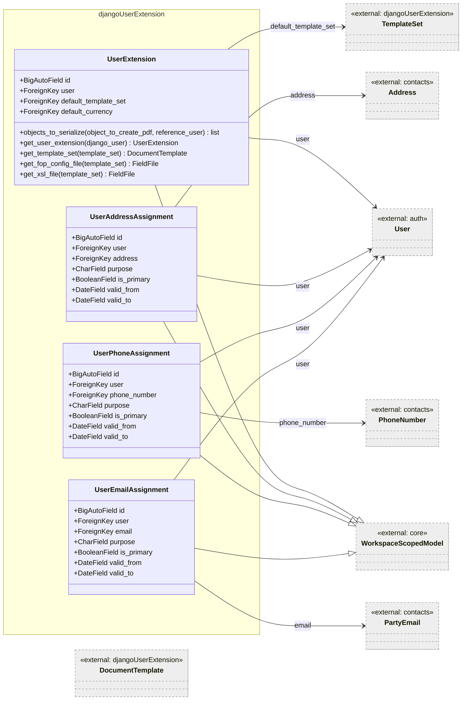
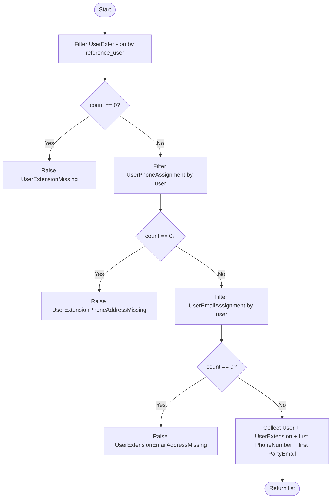
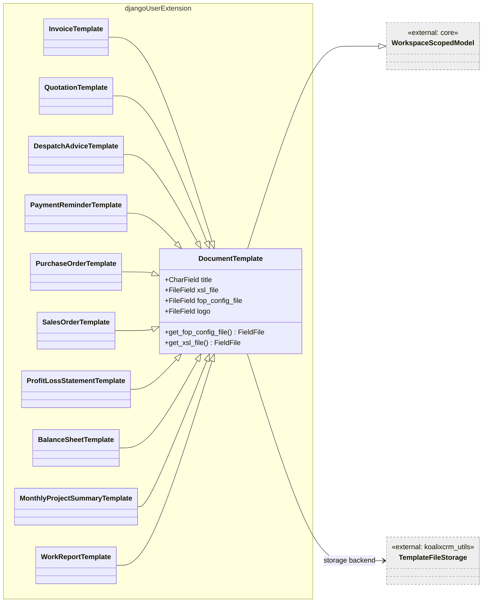
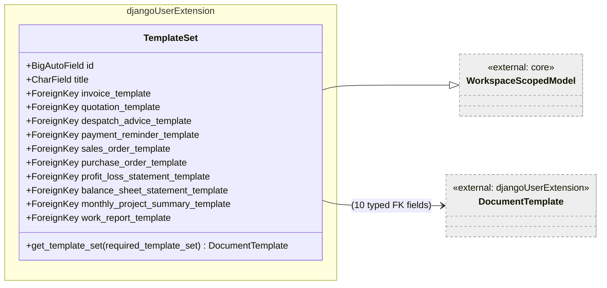
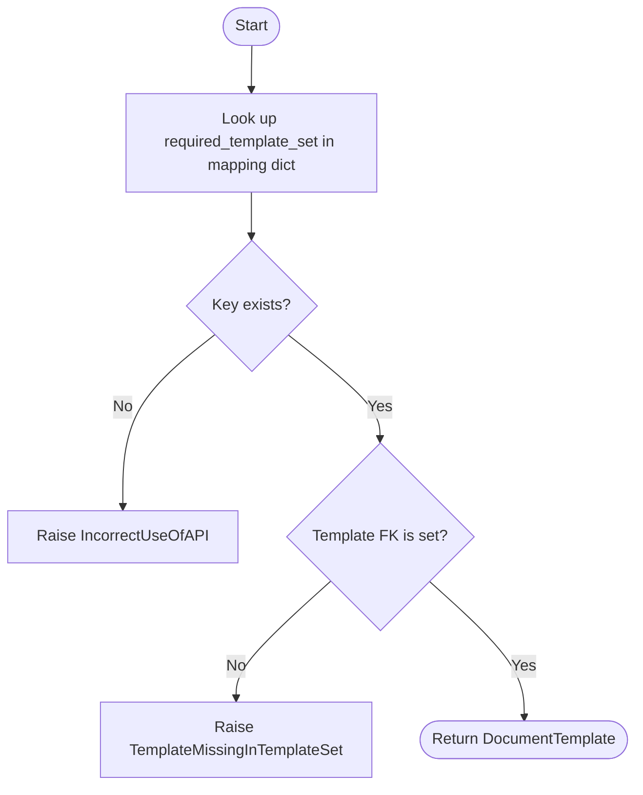
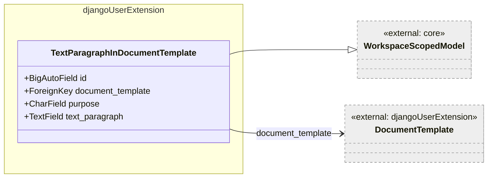
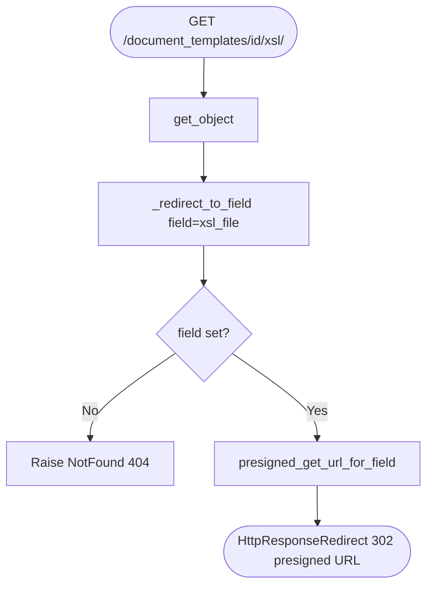

# DjangoUserExtension — Low-Level Documentation

## Introduction

### Scope

This document describes the implementation of the `koalixcrm.djangoUserExtension` Django application. The
following source files are covered:

- `models/user_extension.py` — `UserExtension`, `UserAddressAssignment`, `UserPhoneAssignment`,
  `UserEmailAssignment`, `OptionUserExtension`
- `models/document_template.py` — `DocumentTemplate` and its ten MTI subclasses, `OptionDocumentTemplate`
- `models/template_set.py` — `TemplateSet`, `OptionTemplateSet`
- `models/text_paragraph.py` — `TextParagraphInDocumentTemplate`, `InlineTextParagraph`
- `exceptions.py` — five custom exception classes
- `const/purpose.py` — `PURPOSESADDRESSINUSEREXTENTION` constant
- `serializers/user_extension_rest.py` — `OptionUserExtensionJSONSerializer`
- `serializers/user_extension_nested.py` — `UserExtensionNestedSerializer` and its nested serializers
- `serializers/document_template_serializer.py` — `DocumentTemplateJSONSerializer`
- `serializers/document_template_rest.py` — ten per-subtype option serializers
- `serializers/template_set_rest.py` — `OptionTemplateSetJSONSerializer`, `TemplateSetJSONSerializer`
- `serializers/user_rest.py` — `UserSerializer`
- `views/user_extension_view_set.py` — `UserExtensionViewSet`
- `views/document_template_view_set.py` — `DocumentTemplateViewSet`
- `views/user_extension_missing.py` — missing-extension redirect view
- `views/template_set_missing.py` — missing-template-set redirect view
- `admin/user_extension_admin.py` — admin registrations
- `admin/document_template_admin.py` — document template admin registrations

### Target Audience

Software development engineers who need to use, modify, or extend the `djangoUserExtension` application.

### Glossary

| Term/Acronym | Full Form | Description |
|---|---|---|
| MTI | Multi-Table Inheritance | Django pattern where each subclass has its own database table linked to the parent table by a one-to-one primary key. |
| FOP | Formatting Objects Processor | Apache FOP; a print formatter driven by XSL-FO stylesheets, used to generate PDFs. |
| XSL / XSL-FO | Extensible Stylesheet Language / Formatting Objects | Stylesheet language for describing print output; used here to drive FOP. |
| TemplateSet | — | An aggregate that groups one `DocumentTemplate` subtype per document kind, assigned to a `UserExtension`. |
| WorkspaceScopedModel | — | Base class that adds a `workspace` FK to support multi-tenant data isolation. |
| S3 | Amazon Simple Storage Service | Object-store backend where XSL, FOP config, and logo files are stored. |
| Presigned URL | — | Time-limited AWS S3 URL that grants unauthenticated download access to a single object. |
| MTI subtype | — | A concrete child class that inherits from `DocumentTemplate`; each subtype corresponds to one document kind. |

---

## Detailed Components

### UserExtension

Figure 1 — UserExtension and contact-assignment classes

`UserExtension` extends the standard Django `User` with a default `TemplateSet` and default `Currency`.
It is the anchor point for per-user configuration of the PDF generation pipeline.

Each `UserExtension` is linked to a single `User` and belongs to exactly one `Workspace` (via
`WorkspaceScopedModel`). The `default_template_set` FK controls which XSL/FOP template files are used when
this user triggers a PDF export. The `default_currency` FK stores the user's preferred reporting currency.

The three assignment models — `UserAddressAssignment`, `UserPhoneAssignment`, and `UserEmailAssignment` —
replace earlier MTI satellite models. Each row links a Django `User` to a contact-app record (`Address`,
`PhoneNumber`, or `PartyEmail`) and carries a `purpose` code (from `ASSIGNMENT_PURPOSE_CHOICES`), an
`is_primary` flag, and optional validity dates.

#### Methods

**`objects_to_serialize(object_to_create_pdf, reference_user) -> list`** (static)

Assembles the list of Django model instances required to serialize a full user context for PDF export. It
checks that exactly one `UserExtension` exists for `reference_user` and that at least one phone and one
e-mail assignment exist. Raises `UserExtensionMissing`, `UserExtensionPhoneAddressMissing`, or
`UserExtensionEmailAddressMissing` when any requirement is absent.

Figure 2 — `objects_to_serialize` control flow

**`get_user_extension(django_user) -> UserExtension`** (static)

Returns the single `UserExtension` for `django_user`. Raises `TooManyUserExtensionsAvailable` when more
than one row is found, or `UserExtensionMissing` when none is found. This is the standard access pattern
used by other apps to resolve a user's template configuration.

##### `get_template_set(template_set) -> DocumentTemplate`

Returns the resolved `DocumentTemplate` from `self.default_template_set` for the given template type. The
current implementation only handles `work_report_template`; for any other type it returns without a value.
Raises `TemplateSetMissingForUserExtension` when the matched field is not set.

**`get_fop_config_file(template_set) -> FieldFile`** / **`get_xsl_file(template_set) -> FieldFile`**

Delegates to `get_template_set` to resolve the `DocumentTemplate`, then calls the respective accessor on
the resolved template. These are thin delegation methods.

#### OptionUserExtension (admin class)

Registers `UserExtension` in the Django admin with workspace filter. Conditionally registers a
`create_work_report_pdf` bulk action when `koalixcrm.reporting` is installed. The action creates
`PDFExportProcess` records for each selected user's attached `HumanResource`, using the
`work_report_template` from the user's `TemplateSet`. Errors are reported per row via `message_user`.

---

### DocumentTemplate and MTI Subclasses

Figure 3 — DocumentTemplate MTI hierarchy

`DocumentTemplate` is the abstract base for all PDF rendering templates. It stores three file assets using
`TemplateFileStorage` (an S3-backed storage backend from `koalixcrm_utils`): the XSL-FO stylesheet
(`xsl_file`), an optional Apache FOP configuration file (`fop_config_file`), and an optional logo image.

The ten MTI subclasses — `InvoiceTemplate`, `QuotationTemplate`, `DespatchAdviceTemplate`,
`PaymentReminderTemplate`, `PurchaseOrderTemplate`, `SalesOrderTemplate`, `ProfitLossStatementTemplate`,
`BalanceSheetTemplate`, `MonthlyProjectSummaryTemplate`, `WorkReportTemplate` — add no fields and exist
solely to allow `TemplateSet` to hold type-safe FK references to each document kind. Django MTI creates a
separate database table per subclass.

`xsl_file` is required (no `blank=True`); `fop_config_file` and `logo` are optional.

#### DocumentTemplate Methods

##### `get_fop_config_file() -> FieldFile`

Returns `self.fop_config_file` when set. Raises `TemplateFOPConfigFileMissing` (from `core.exceptions`)
when the field is empty.

##### `get_xsl_file() -> FieldFile`

Returns `self.xsl_file` when set. Raises `TemplateXSLTFileMissing` (from `core.exceptions`) when the
field is empty.

#### OptionDocumentTemplate (admin class)

Shared admin class registered for all ten MTI subclasses. Provides workspace-scoped list view and includes
`InlineTextParagraph` so text paragraphs can be managed directly on the template change page.

---

### TemplateSet

Figure 4 — TemplateSet class

`TemplateSet` groups exactly one `DocumentTemplate` subtype for each of the ten supported document kinds.
All FK fields are nullable (`blank=True, null=True`), meaning a template set may be incomplete; callers
that require a specific template must handle `TemplateMissingInTemplateSet`.

#### TemplateSet Methods

##### `get_template_set(required_template_set: str) -> DocumentTemplate`

Looks up the template for the requested document kind using a static string-to-attribute mapping. Raises
`TemplateMissingInTemplateSet` when the mapped FK is `None`, and `IncorrectUseOfAPI` when
`required_template_set` is not a recognised key.

Figure 5 — `get_template_set` control flow

---

### TextParagraphInDocumentTemplate

Figure 6 — TextParagraphInDocumentTemplate

`TextParagraphInDocumentTemplate` stores freeform text paragraphs that are embedded into a document
template at a designated position identified by `purpose` (e.g., header, footer, boilerplate). The
`purpose` field uses the `PURPOSESTEXTPARAGRAPHINDOCUMENTS` choices from `core.const.purpose`.

`InlineTextParagraph` is the corresponding `TabularInline` admin class used on the `DocumentTemplate`
change page.

---

### Serializers

#### DocumentTemplateJSONSerializer

Serializes `DocumentTemplate` metadata for the PDF worker. The three binary file assets are never
embedded in the payload; instead the serializer exposes `xsl_href`, `fop_config_href`, and `logo_href`
fields that contain REST URLs pointing to detail actions on `DocumentTemplateViewSet`. Those actions
redirect to short-lived presigned S3 download URLs.

The `_detail_url` helper resolves the correct named URL (`document-template-xsl`, etc.) including the
`workspace_id` path argument extracted from the incoming request's `resolver_match`. This makes the
generated hrefs workspace-aware without hard-coding any path segment.

#### TemplateSetJSONSerializer / OptionTemplateSetJSONSerializer

`OptionTemplateSetJSONSerializer` is read-only and embeds each template FK as a nested typed serializer
(the ten `Option*JSONSerializer` classes from `document_template_rest.py`).

`TemplateSetJSONSerializer` supports `create` and `update`. Both methods follow the same pattern for each
of the ten template FKs: pop the nested dict from `validated_data`, check whether an `id` key is present,
and resolve the corresponding subtype ORM object. On `create`, missing keys set the FK to `None`; on
`update`, missing keys set the FK to `None` (clearing the assignment), while a dict without an `id` keeps
the existing FK. The `create` method has a bug: it calls `template_set.save()` but does not return the
saved instance.

#### UserExtensionNestedSerializer

Designed to serve the PDF worker's need for a single-fetch user context payload. It nests:

- `UserMinimalSerializer` — Django `User` fields (id, username, first/last name, email)
- `CurrencyJSONSerializer` — default currency
- `postal_addresses` — via `get_postal_addresses`: all `UserAddressAssignment` rows for the user,
  flattened with address fields via `source=` traversal
- `phone_addresses` — via `get_phone_addresses`: all `UserPhoneAssignment` rows, including `phone_e164`
- `email_addresses` — via `get_email_addresses`: all `UserEmailAssignment` rows, including `email_address`

Each of the three `get_*` methods issues a separate ORM query filtered by `user_id`.

---

### Views

#### UserExtensionViewSet

Read-only viewset (`RetrieveModelMixin` + `ListModelMixin`). Scopes the queryset to `active_workspace`
from the request, or returns all records for superusers. `perform_create` is defined (creates a default
workspace for superusers lacking one) even though write methods are not exposed by `http_method_names`.

#### DocumentTemplateViewSet

Read-only viewset with three `@action` detail endpoints: `xsl`, `fop-config`, and `logo`. Each action
calls `_redirect_to_field`, which raises `NotFound` when the field is not set, and otherwise calls
`presigned_get_url_for_field` to obtain a presigned S3 URL and returns a `302` redirect.

Figure 7 — DocumentTemplateViewSet presigned-URL redirect flow

---

## Persistent Storage

All three binary asset fields on `DocumentTemplate` (`xsl_file`, `fop_config_file`, `logo`) are stored in
S3 via `TemplateFileStorage`. The ORM tables are:

| Table | Content |
|---|---|
| `djangouserextension_documenttemplate` | Base template rows (shared across all MTI subtypes) |
| `djangouserextension_invoicetemplate` | MTI extension table for InvoiceTemplate (PK only) |
| *(similarly for each of the nine other subtypes)* | |
| `djangouserextension_templateset` | TemplateSet rows |
| `djangouserextension_userextension` | UserExtension rows |
| `djangouserextension_useraddressassignment` | Address assignment rows |
| `djangouserextension_userphoneassignment` | Phone assignment rows |
| `djangouserextension_useremailassignment` | Email assignment rows |
| `crm_textparagraphindocumenttemplate` | Text paragraph rows (legacy table name) |

---

## Access to External Interfaces

| Interface | Type of Call | Notes |
|---|---|---|
| AWS S3 (via `TemplateFileStorage`) | Blocking read/write on file upload/download | Uploads occur on admin save; reads occur on `presigned_get_url_for_field` calls. |
| `presigned_get_url_for_field` (koalixcrm_utils) | Blocking read | Generates a time-limited presigned URL; actual binary transfer is client-to-S3. |

---

## Security

### Assets

| Asset | Description | Security Measure | Assessment of Criticality |
|---|---|---|---|
| S3 file URLs | URLs for XSL, FOP config, and logo files | Served only as time-limited presigned URLs via REST; files not directly embedded in API responses | Uncritical |
| S3 credentials | AWS credentials used by `TemplateFileStorage` | Configured via environment/IAM role, not stored in application code | Uncritical |

---

## Design Patterns Used

- **Multi-Table Inheritance (MTI):** The ten `DocumentTemplate` subclasses use Django MTI so that `TemplateSet` can reference each document kind with a type-safe FK while sharing a single base table for common fields.
- **Delegation (Template Method):** `UserExtension.get_fop_config_file` and `get_xsl_file` delegate to `get_template_set` and then to `DocumentTemplate`'s accessors, separating template resolution from file retrieval.
- **Plugin-style admin patching:** `OptionUserExtension.actions` is built conditionally at class definition time (`apps.is_installed("koalixcrm.reporting")`), allowing the work-report action to appear only when the reporting app is installed.

---

## External Dependencies

| Requirement | Version/Details | Notes/Assumptions |
|---|---|---|
| Django | >= 3.2 (BigAutoField default) | Required for all ORM models |
| djangorestframework | — | Used for all serializers and viewsets |
| `koalixcrm_utils.s3_storage.TemplateFileStorage` | Internal package | S3-backed storage for template files |
| `koalixcrm_utils.presigned_urls.presigned_get_url_for_field` | Internal package | Generates S3 presigned download URLs |
| `filebrowser` | — | Not used in current models (removed in migration 0002); present only in migration history |

---

## Appendix

### References

- Source: `koalixcrm/djangoUserExtension/models/`
- Source: `koalixcrm/djangoUserExtension/serializers/`
- Source: `koalixcrm/djangoUserExtension/views/`

### List of Illustrations

| Figure | Title |
|---|---|
| Figure 1 | UserExtension and contact-assignment classes |
| Figure 2 | `objects_to_serialize` control flow |
| Figure 3 | DocumentTemplate MTI hierarchy |
| Figure 4 | TemplateSet class |
| Figure 5 | `get_template_set` control flow |
| Figure 6 | TextParagraphInDocumentTemplate |
| Figure 7 | DocumentTemplateViewSet presigned-URL redirect flow |
