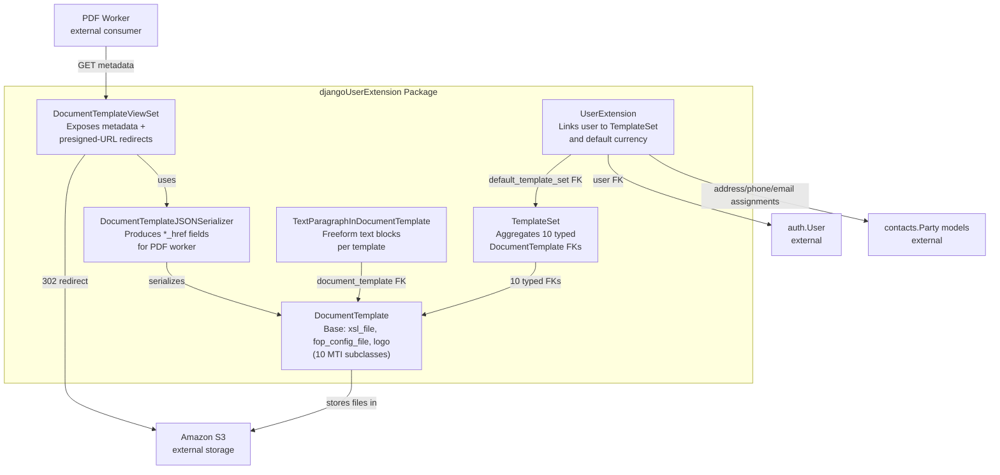
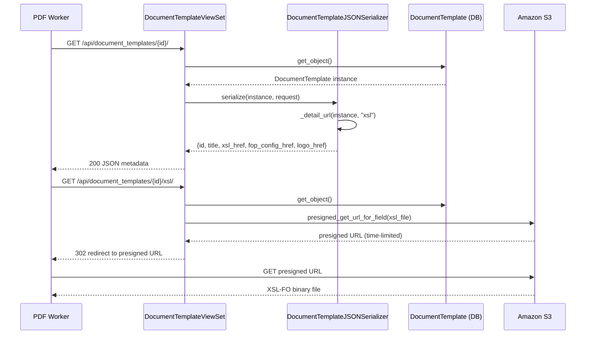
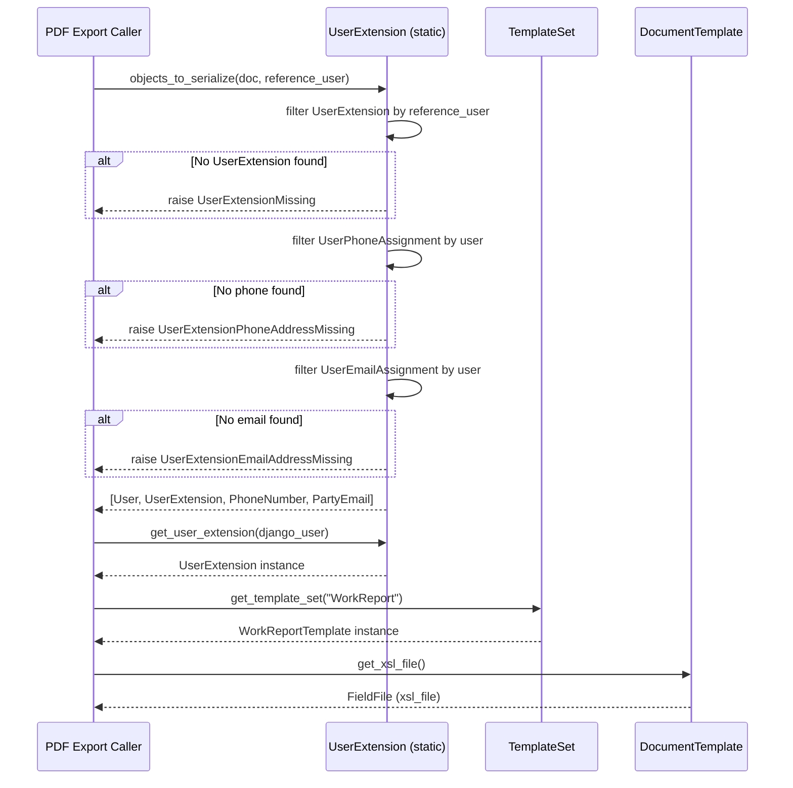
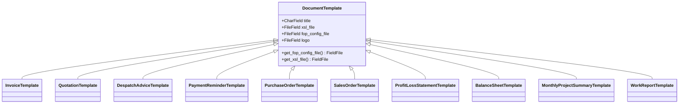
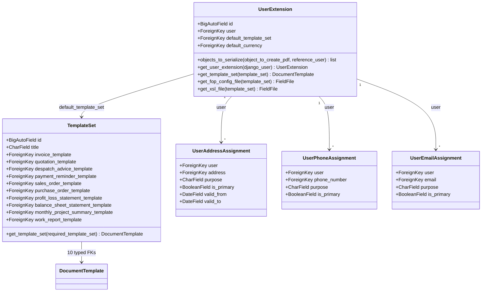

# DjangoUserExtension — Mid-Level Documentation

## Introduction

### Purpose of the Package

The `koalixcrm.djangoUserExtension` Django application manages the configuration
that ties a Django user to the PDF export pipeline. It provides:

- A hierarchy of XSL-based document templates (`DocumentTemplate` and ten MTI
  subclasses) stored in Amazon S3.
- A `TemplateSet` aggregator that maps one template to each supported document kind.
- A `UserExtension` profile that links a Django `auth.User` to a `TemplateSet` and
  a default currency.
- REST endpoints that expose template metadata and serve file assets as short-lived
  presigned S3 URLs.
- GDPR-compliant contact assignment models (`UserAddressAssignment`,
  `UserPhoneAssignment`, `UserEmailAssignment`) that link users to contact-app
  party records.

### Contents Overview

| Sub-module | Contents |
|---|---|
| `models/document_template.py` | `DocumentTemplate` base class and ten MTI subclasses |
| `models/template_set.py` | `TemplateSet` aggregator and `OptionTemplateSet` admin class |
| `models/user_extension.py` | `UserExtension`, three contact-assignment models, `OptionUserExtension` admin class |
| `models/text_paragraph.py` | `TextParagraphInDocumentTemplate`, `InlineTextParagraph` admin inline |
| `serializers/` | Seven serializer modules covering templates, template sets, user extensions, and users |
| `views/` | `DocumentTemplateViewSet`, `UserExtensionViewSet`, and two redirect views |
| `admin/` | Admin registrations for all models |
| `exceptions.py` | Five custom exception classes |
| `const/purpose.py` | `PURPOSESADDRESSINUSEREXTENTION` constant |

### Target Audience

Software development engineers who need to use, modify, or extend the
`djangoUserExtension` application; in particular those integrating with the
PDF export pipeline or extending user profile data.

### Glossary

| Term/Acronym | Full Form | Description |
|---|---|---|
| MTI | Multi-Table Inheritance | Django pattern where each subclass has its own database table linked to the parent table by a one-to-one primary key. |
| FOP | Formatting Objects Processor | Apache FOP; a print formatter driven by XSL-FO stylesheets, used to generate PDFs. |
| XSL / XSL-FO | Extensible Stylesheet Language / Formatting Objects | Stylesheet language for describing print output; used here to drive FOP. |
| TemplateSet | — | An aggregate that groups one `DocumentTemplate` subtype per document kind, assigned to a `UserExtension`. |
| WorkspaceScopedModel | — | Base class that adds a `workspace` FK to support multi-tenant data isolation. |
| S3 | Amazon Simple Storage Service | Object-store backend where XSL, FOP config, and logo files are stored. |
| Presigned URL | — | Time-limited AWS S3 URL that grants unauthenticated download access to a single object. |
| MTI subtype | — | A concrete child class that inherits from `DocumentTemplate`; each subtype corresponds to one document kind. |
| PDF worker | — | The external service or process that calls the REST API to obtain template metadata and file assets before rendering a PDF. |

---

## Package Diagram

The diagram below shows the structural relationships between the main components
of the `djangoUserExtension` package and its interaction with the S3 storage
backend and Django's `auth.User`.

Figure 1 — DjangoUserExtension package structure and external interactions

- [DjangoUserExtension LL Documentation](QQ_LL_Doc_DjangoUserExtension.md)

---

## Interaction Diagrams

### Template Resolution and PDF Export Handoff

This process describes the sequence from the moment a PDF worker requests
template metadata through to downloading the XSL-FO stylesheet from S3. The
entry point is `GET /api/document_templates/{id}/`.

The PDF worker first fetches the template metadata to obtain `*_href` URLs, then
follows those URLs to receive presigned S3 redirects, and finally downloads the
binary assets directly from S3.

Figure 2 — Template resolution and PDF export handoff sequence

### UserExtension Resolution for PDF Context

This process describes how a PDF export caller resolves user context — phone
number, e-mail, and template references — before rendering a document. The entry
point is `UserExtension.objects_to_serialize(object_to_create_pdf, reference_user)`.

Figure 3 — UserExtension resolution and template lookup for PDF context

---

## Class Diagrams per Package

### DocumentTemplate Hierarchy

Figure 4 — DocumentTemplate MTI class hierarchy

### TemplateSet and UserExtension

Figure 5 — TemplateSet and UserExtension class relationships

---

## Design Patterns Used

### Multi-Table Inheritance (MTI) for Templates

`DocumentTemplate` uses Django's MTI so that `TemplateSet` can hold ten
type-safe FK references — one per document kind — while all templates share a
single base table (`djangouserextension_documenttemplate`) for the common
`title`, `xsl_file`, `fop_config_file`, and `logo` fields. Each subclass (e.g.
`InvoiceTemplate`) has its own table containing only the Django-generated
one-to-one link back to the base table. None of the subclasses add domain fields;
their purpose is type identity.

### Aggregator / Registry Pattern for TemplateSet

`TemplateSet.get_template_set(required_template_set: str)` uses a static
string-to-attribute mapping dictionary to resolve which of the ten FK fields to
return. This avoids a chain of `if/elif` branches and allows the mapping to be
inspected as data. Callers pass a string key (e.g. `"Invoice"`, `"WorkReport"`)
and receive the corresponding `DocumentTemplate` subtype instance or an exception.

### S3 Presigned URL Pattern

Template binary assets (`xsl_file`, `fop_config_file`, `logo`) are never
included in API responses. Instead, `DocumentTemplateJSONSerializer` emits
`*_href` fields that point to detail action URLs on `DocumentTemplateViewSet`.
When a client follows one of those URLs, the viewset calls
`presigned_get_url_for_field` (from `koalixcrm_utils`) and returns a `302`
redirect to a time-limited S3 URL. The binary transfer occurs directly between
the client and S3, keeping the application server out of the data path.

### Delegation for File Accessor Methods

`UserExtension.get_fop_config_file` and `get_xsl_file` are thin delegation
methods: they call `get_template_set` to resolve the `DocumentTemplate`, then
forward the call to the template's own file accessor. This separates the concern
of template resolution (which document kind to use for this user) from the concern
of file retrieval (whether the file field is populated).

---

## External Dependencies

| Requirement | Version/Details | Notes/Assumptions |
|---|---|---|
| Django | >= 3.2 (BigAutoField default) | Required for all ORM models, admin, and auth integration |
| djangorestframework | Not pinned in this module | Used for all serializers and viewsets |
| `koalixcrm_utils.s3_storage.TemplateFileStorage` | Internal package | S3-backed `FileField` storage; applied to all three file fields on `DocumentTemplate` |
| `koalixcrm_utils.presigned_urls.presigned_get_url_for_field` | Internal package | Generates time-limited S3 presigned download URLs; called in `DocumentTemplateViewSet._redirect_to_field` |
| `koalixcrm.core.models.workspace_scoped.WorkspaceScopedModel` | Internal | Base class providing multi-tenant workspace FK for all models in this package |
| `koalixcrm.contacts` — `Address`, `PhoneNumber`, `PartyEmail` | Internal app | Target models for the three contact-assignment FK fields on `UserExtension` |
| `django.contrib.auth.User` | Django built-in | Referenced by `UserExtension.user` FK and all three contact-assignment models |
| `factory_boy` | Test dependency | Used in `tests/factories/djangoUserExtension/` to build model instances in tests |

---

## Testing

No dedicated unit-test module exists for `djangoUserExtension` in the
`tests/` tree. Test coverage is provided indirectly through:

- **Factory classes** in `tests/factories/djangoUserExtension/`:
  `factory_document_template.py`, `factory_template_set.py`, and
  `factory_user_extension.py` supply `DocumentTemplate` subtype instances,
  `TemplateSet`, and `UserExtension` objects to integration and end-to-end tests
  in other modules (e.g. `legacy_crm`, `reporting_api_py`, `e2e`).
- **End-to-end tests** in `tests/e2e/` use `StandardUserExtensionFactory` as
  a prerequisite fixture, exercising the full resolution path (user →
  UserExtension → TemplateSet → DocumentTemplate) indirectly.
- **Integration tests** in `tests/core_api_py/test_pdf_service_endpoints.py`
  and `tests/reporting_api_py/` exercise the REST endpoints that depend on
  `UserExtension` and `DocumentTemplate` data.

There are no unit tests that exercise `TemplateSet.get_template_set`,
`UserExtension.objects_to_serialize`, or `DocumentTemplateViewSet._redirect_to_field`
in isolation.

---

## Appendix

### References

- [DjangoUserExtension LL Documentation](QQ_LL_Doc_DjangoUserExtension.md)

### List of Illustrations

| Figure | Title |
|---|---|
| Figure 1 | DjangoUserExtension package structure and external interactions |
| Figure 2 | Template resolution and PDF export handoff sequence |
| Figure 3 | UserExtension resolution and template lookup for PDF context |
| Figure 4 | DocumentTemplate MTI class hierarchy |
| Figure 5 | TemplateSet and UserExtension class relationships |

### Additional Resources and Further Reading

- [Django Multi-Table Inheritance documentation](https://docs.djangoproject.com/en/stable/topics/db/models/#multi-table-inheritance)
- [Amazon S3 Presigned URLs — AWS documentation](https://docs.aws.amazon.com/AmazonS3/latest/userguide/ShareObjectPreSignedURL.html)
- [Apache FOP documentation](https://xmlgraphics.apache.org/fop/)
