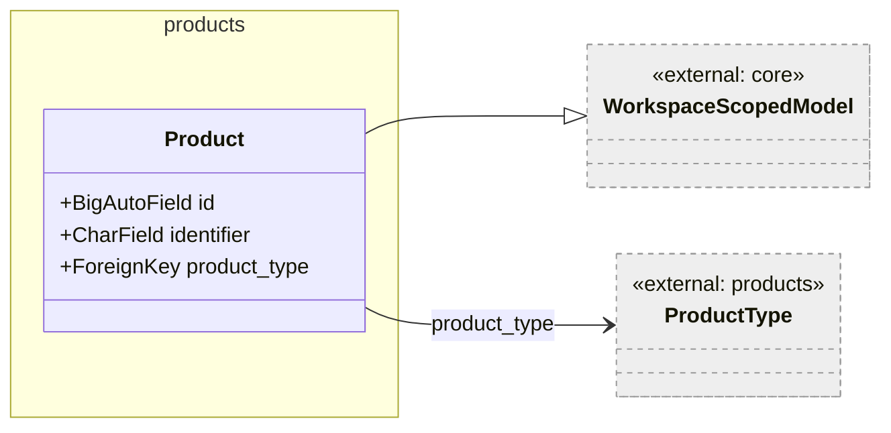
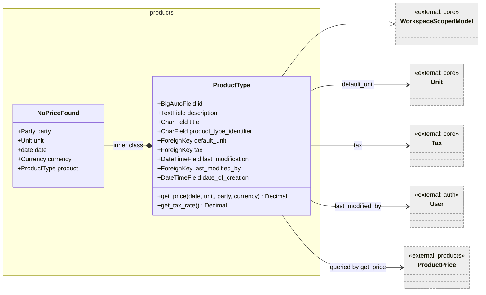
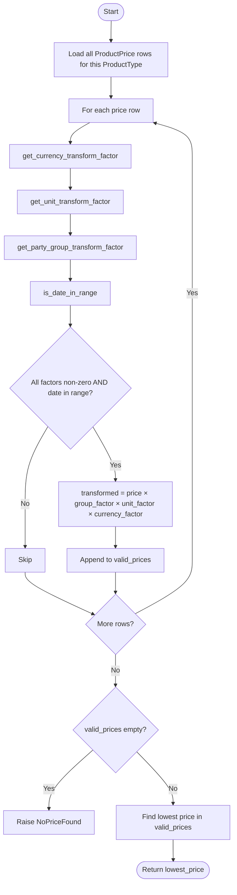
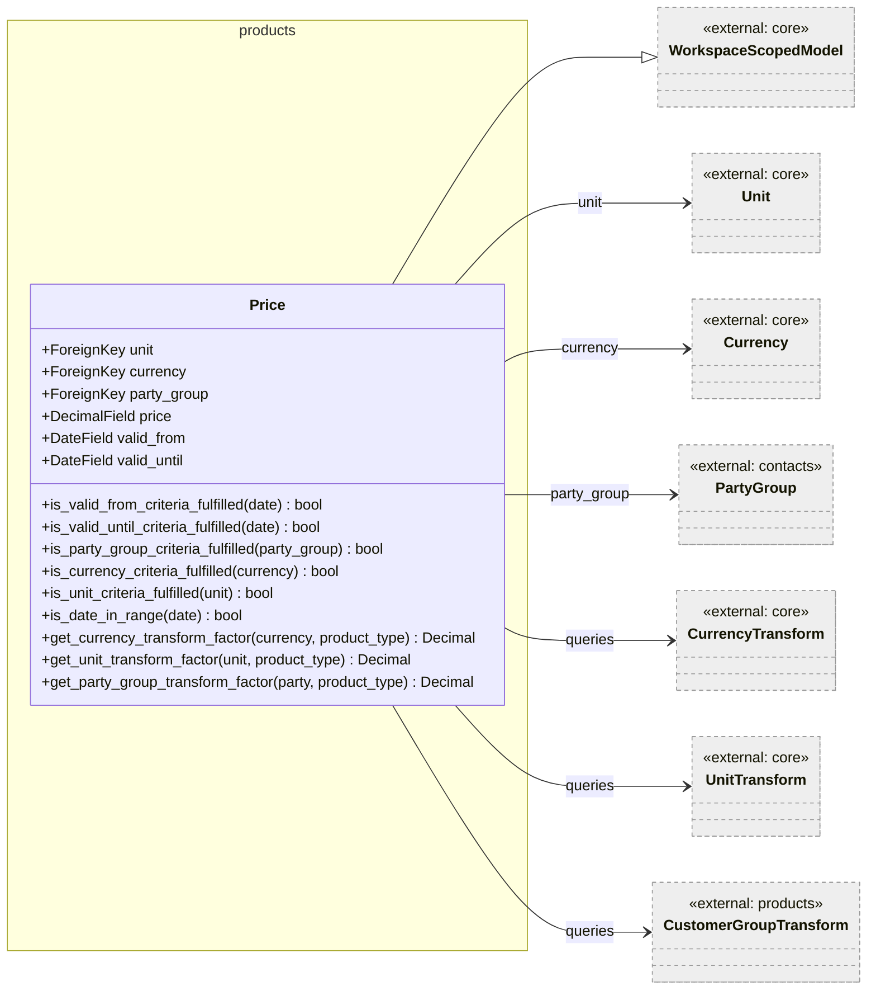
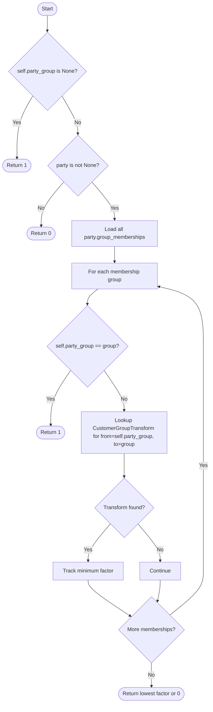
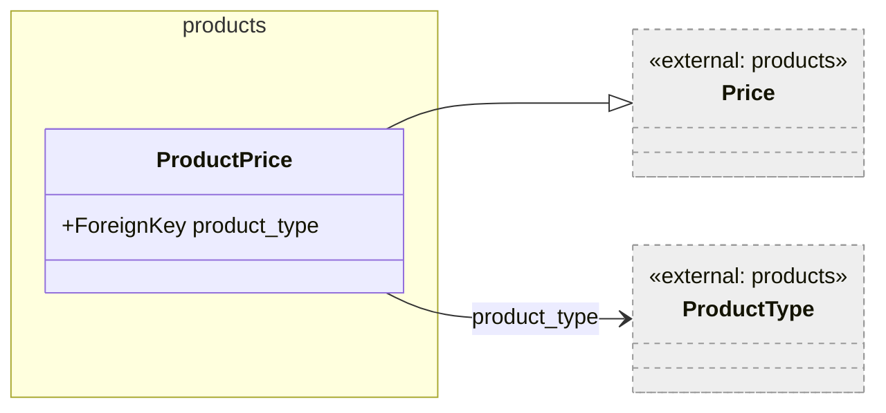
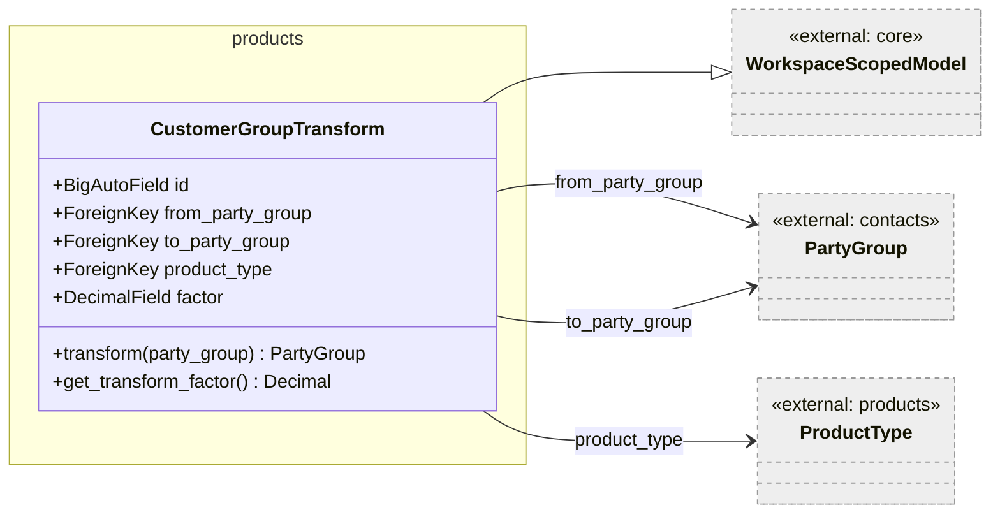

# Products — Low-Level Documentation

## Introduction

### Scope

This document describes the implementation of the `koalixcrm.products` Django application. The following
source files are covered:

- `models/product.py` — `Product`
- `models/product_type.py` — `ProductType` (including the inner `NoPriceFound` exception)
- `models/price.py` — `Price`
- `models/product_price.py` — `ProductPrice`
- `models/customer_group_transform.py` — `CustomerGroupTransform`
- `serializers/product_type_serializer.py` — `ProductJSONSerializer`
- `serializers/product_price_serializer.py` — `ProductPriceJSONSerializer`
- `serializers/customer_group_transform_serializer.py` — `CustomerGroupTransformJSONSerializer`
- `serializers/price_serializer.py` — `PriceJSONSerializer`
- `serializers/product_serializer.py` — `ProductJSONSerializer` (product-level)
- `views/product_type_view_set.py` — `ProductTypeViewSet`
- `views/product_price_view_set.py` — `ProductPriceViewSet`
- `views/customer_group_transform_view_set.py` — `CustomerGroupTransformViewSet`
- `views/product_view_set.py` — `ProductViewSet`
- `admin/product_type_admin.py` — `ProductTypeAdmin`
- `admin/product_price_admin.py` — `ProductPriceInlineAdmin`
- `admin/customer_group_transform_admin.py` — `CustomerGroupTransformInlineAdmin`
- `party_group_fk_rewire.py` — migration utility functions

### Target Audience

Software development engineers who need to use, modify, or extend the `products` application.

### Glossary

| Term/Acronym | Full Form | Description |
|---|---|---|
| ProductType | — | The catalog entity representing a product with its pricing rules and tax assignment. |
| ProductPrice | — | A concrete price row for a `ProductType` valid within an optional date range and for an optional party group. |
| Price | — | Abstract base model for all price records; carries currency, unit, party group, validity dates, and price amount. |
| PartyGroup | — | A group classification of parties (customers) used to apply group-specific pricing. |
| CustomerGroupTransform | — | A per-product-type price multiplication factor between two `PartyGroup` values. |
| WorkspaceScopedModel | — | Base class that adds a `workspace` FK for multi-tenant data isolation. |
| CurrencyTransform | — | Core model that holds a conversion factor between two currencies for a given product type. |
| UnitTransform | — | Core model that holds a conversion factor between two units for a given product type. |

---

## Detailed Components

### Product

Figure 1 — Product class

`Product` is a lightweight instance model that links a specific product instance (identified by
`identifier`) to its `ProductType`. It inherits workspace scoping from `WorkspaceScopedModel`. No methods
beyond Django defaults are defined. The `identifier` field is optional (`null=True, blank=True`).

---

### ProductType

Figure 2 — ProductType class

`ProductType` is the central product catalog entity. It carries a human-readable `title`, an optional
`product_type_identifier` (product number), a mandatory `default_unit`, and a mandatory `tax` FK that
determines the applicable VAT rate.

`last_modification` uses `auto_now=True` (updated on every save); `date_of_creation` uses
`auto_now_add=True`.

`NoPriceFound` is an inner exception class raised by `get_price` when no valid price combination can be
resolved for the given parameters.

#### Methods

##### `get_price(date, unit, party, currency) -> Decimal`

Finds the applicable price for this product type. It loads all `ProductPrice` rows for this product type,
then filters them in Python by evaluating three transform factors and a date-range check for each row.
Only rows where all three factors are non-zero and the date is in range are considered valid. Among all
valid prices it returns the lowest transformed price.

Figure 3 — `get_price` control flow

##### `get_tax_rate() -> Decimal`

Delegates to `self.tax.get_tax_rate()`.

---

### Price

Figure 4 — Price class

`Price` is the abstract base for all price records. It is not abstract in the Django sense (it has its own
table `crm_price`) but acts as a base class via standard inheritance from which `ProductPrice` extends via
MTI. The `party_group` FK is nullable, meaning a price with `party_group=None` applies to all customers
regardless of group.

`valid_from` and `valid_until` are both optional. When both are `None`, the price is always valid. When
only one is set, only that bound is checked.

#### Price Methods

##### `is_date_in_range(date) -> bool`

Four-branch logic: if both `valid_from` and `valid_until` are `None`, returns `True`; if only one is set,
checks that bound; if both are set, checks `valid_from <= date <= valid_until`.

##### `get_currency_transform_factor(currency, product_type) -> Decimal | int`

Returns `1` when `self.currency == currency`. Otherwise looks up `CurrencyTransform` for the
`(self.currency, currency, product_type)` triple and returns the transform factor. Returns `0` when no
match exists (ORM `get` would raise `DoesNotExist`, but the caller in `ProductType.get_price` catches
factor==0 to exclude the row).

##### `get_unit_transform_factor(unit, product_type) -> Decimal | int`

Same pattern as `get_currency_transform_factor` but for `UnitTransform`.

##### `get_party_group_transform_factor(party, product_type) -> Decimal | int`

More complex: if `self.party_group` is `None`, returns `1` (universal price). If `party` is provided,
iterates all `PartyGroupMembership` rows of the party. For each membership's `party_group`, returns `1`
on a direct match, or looks up `CustomerGroupTransform` for the `(self.party_group, group, product_type)`
triple and tracks the minimum non-zero factor found.

Figure 5 — `get_party_group_transform_factor` control flow

---

### ProductPrice

Figure 6 — ProductPrice class

`ProductPrice` extends `Price` via Django MTI (table `crm_productprice`) by adding a `product_type` FK.
It is the concrete price record used by `ProductType.get_price`. It adds no methods beyond `__str__`.

---

### CustomerGroupTransform

Figure 7 — CustomerGroupTransform class

`CustomerGroupTransform` defines a price scaling factor (`factor`) applicable when the requesting party
belongs to `to_party_group` but the price row is defined for `from_party_group`. It is product-type
scoped, allowing different transform factors per product.

#### CustomerGroupTransform Methods

##### `transform(party_group) -> PartyGroup | None`

Returns `self.to_party_group` when `party_group == self.from_party_group`, else `None`. Convenience check
used to verify direction of a transform.

##### `get_transform_factor() -> Decimal`

Returns `self.factor`.

---

### Serializers

#### ProductJSONSerializer (ProductType serializer)

Serializes `ProductType` with nested `OptionUnitJSONSerializer` and `OptionTaxJSONSerializer`. Both
`create` and `update` manually pop and resolve the nested FK dicts by `id`. The docstring notes that
the `accounting_product_category` FK was relocated to `accounting.ProductCategoryAssignment` as part of
CR-2c and is no longer present on this serializer.

#### ProductPriceJSONSerializer

Exposes `ProductPrice` fields including the inherited `Price` fields. Workspace-scoped queryset in the
corresponding viewset.

#### CustomerGroupTransformJSONSerializer

Serializes `CustomerGroupTransform` with party group and product type FKs.

---

### Views

All three viewsets — `ProductTypeViewSet`, `ProductPriceViewSet`, and `CustomerGroupTransformViewSet` —
follow the same pattern:

1. `get_queryset` returns records filtered to `active_workspace` when set, all records for superusers,
   or an empty queryset otherwise.
2. `perform_create` assigns the `active_workspace` to the new instance, creating a default workspace for
   superusers without one.

All viewsets extend `BaseModelViewSet` and use the corresponding serializer class.

---

### ProductTypeAdmin

`ProductTypeAdmin` is registered with `@admin.register(ProductType)` and inherits from both
`WorkspaceScopedModelAdmin` and `admin.ModelAdmin`. It includes four inline admin classes:

- `ProductPriceInlineAdmin` — manages `ProductPrice` rows directly on the product type page
- `UnitTransformInlineAdmin` — manages unit conversion factors
- `CurrencyTransformInlineAdmin` — manages currency conversion factors
- `CustomerGroupTransformInlineAdmin` — manages customer group price transforms

---

### party_group_fk_rewire.py

Contains migration utility functions used by `0002_party_group_fks.py` and `0004_drop_legacy_customer_group_fks.py`
to backfill and clean up the transition from the old `customer_group` FK (pointing at `crm.CustomerGroup`)
to the new `party_group` FK (pointing at `contacts.PartyGroup`). These functions are only relevant in the
migration context and are not called from application code.

---

## Persistent Storage

| Table | Content |
|---|---|
| `crm_product` | Product instance records |
| `crm_producttype` | Product type catalog |
| `crm_price` | Base price rows (shared via MTI) |
| `crm_productprice` | Product-specific price rows (extends `crm_price`) |
| `crm_customergrouptransform` | Per-product party group price transform factors |

---

## Access to External Interfaces

| Interface | Type of Call | Notes |
|---|---|---|
| Django ORM (PostgreSQL) | Blocking read | `get_price` loads all `ProductPrice` rows for a product type into memory and evaluates transform factors in Python. For products with many prices this may have scalability implications. |
| `CurrencyTransform.objects.get` | Blocking read | Called per price row in `get_currency_transform_factor`; raises `DoesNotExist` if no transform is defined. |
| `UnitTransform.objects.get` | Blocking read | Called per price row in `get_unit_transform_factor`; raises `DoesNotExist` if no transform is defined. |

---

## Design Patterns Used

- **Multi-Table Inheritance:** `ProductPrice` inherits from `Price` to extend the base price entity with
  a product-type FK while reusing all validity and transform logic.
- **Strategy-like price resolution:** `get_price` delegates currency, unit, and party-group matching to
  dedicated methods on `Price`, keeping the resolution algorithm composable.
- **Lowest-price selection:** Among all valid transformed prices, `get_price` returns the minimum, i.e.
  it applies the most favourable price for the customer.

---

## External Dependencies

| Requirement | Version/Details | Notes/Assumptions |
|---|---|---|
| Django | >= 3.2 | ORM, admin |
| djangorestframework | — | Serializers and viewsets |
| `koalixcrm.core` | internal | `Unit`, `Currency`, `Tax`, `CurrencyTransform`, `UnitTransform`, `WorkspaceScopedModel` |
| `koalixcrm.contacts` | internal | `PartyGroup`, `Party`, `PartyGroupMembership` |

---

## Appendix

### References

- Source: `koalixcrm/products/models/`
- Source: `koalixcrm/products/serializers/`
- Source: `koalixcrm/products/views/`
- Source: `koalixcrm/products/admin/`

### List of Illustrations

| Figure | Title |
|---|---|
| Figure 1 | Product class |
| Figure 2 | ProductType class |
| Figure 3 | `get_price` control flow |
| Figure 4 | Price class |
| Figure 5 | `get_party_group_transform_factor` control flow |
| Figure 6 | ProductPrice class |
| Figure 7 | CustomerGroupTransform class |
