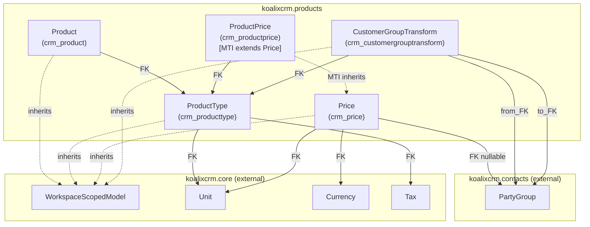
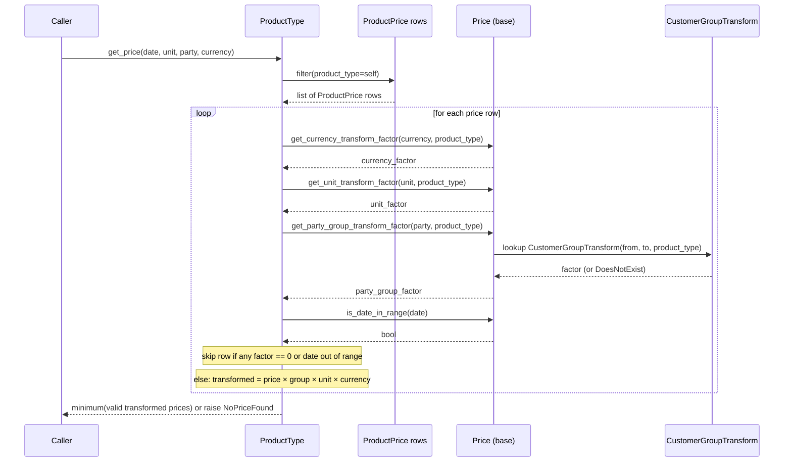
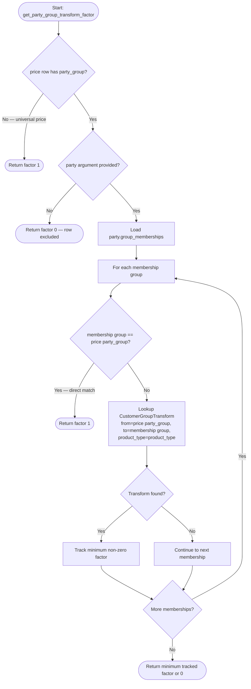
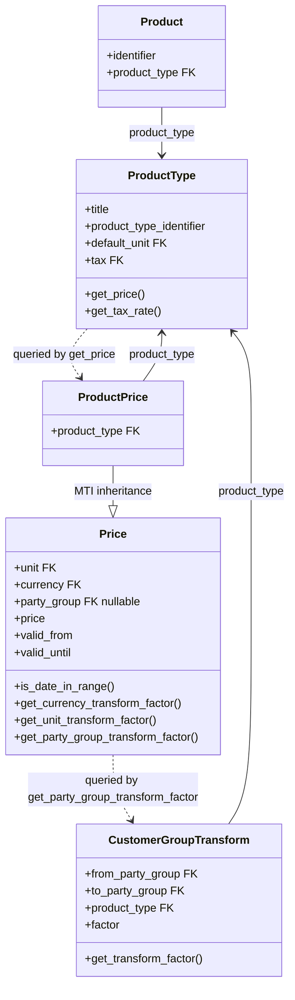

# Products — Mid-Level Documentation

## Introduction

### Purpose

This document describes the `koalixcrm.products` Django application at the module level. It covers
the package structure, the relationships between its components, the two key runtime interactions
(price resolution and party group transform lookup), and the design patterns that shape the package.

Method-level detail, field listings, and control-flow descriptions are intentionally omitted here;
refer to [QQ_LL_Doc_Products.md](QQ_LL_Doc_Products.md) for that depth.

### Contents Overview

- Package structure and component diagram
- Interaction diagrams: price resolution and party group transform lookup
- Class diagram for the products package
- Design patterns used
- External dependencies
- Testing notes
- Appendix

### Target Audience

Software development engineers who use, extend, or integrate the `koalixcrm.products` application.
Readers are expected to be familiar with Django ORM concepts, Django REST Framework, and
multi-table inheritance.

### Glossary

| Term | Description |
|---|---|
| ProductType | The catalog entity representing a product definition; central to pricing resolution. |
| ProductPrice | A concrete price row scoped to a ProductType; extends Price via MTI. |
| Price | Base model (own table `crm_price`) that carries validity bounds, party group, unit, currency, and the three transform-factor methods. |
| CustomerGroupTransform | A per-product-type price scaling factor between two PartyGroups. |
| MTI | Multi-Table Inheritance — Django mechanism where a child model has its own table plus a pointer to the parent table. |
| PartyGroup | A group classification of parties (customers) used for group-specific pricing, defined in `koalixcrm.contacts`. |
| WorkspaceScopedModel | Base class from `koalixcrm.core` that adds a `workspace` FK for multi-tenant data isolation. |
| CurrencyTransform | Core model holding a conversion factor between two currencies for a given product type. |
| UnitTransform | Core model holding a conversion factor between two units for a given product type. |
| NoPriceFound | Inner exception raised by `ProductType.get_price` when no valid price can be resolved. |

---

## Package Diagram

The diagram below shows the five model components of `koalixcrm.products` and their relationships.
External dependencies from `koalixcrm.core` and `koalixcrm.contacts` are shown with dashed borders.

Figure 1 — Package structure of koalixcrm.products

For field-level detail on each component see [QQ_LL_Doc_Products.md](QQ_LL_Doc_Products.md).

---

## Interaction Diagrams

### Price Resolution (get_price)

When a caller needs the applicable price for a product type, it calls
`ProductType.get_price(date, unit, party, currency)`. The method loads all `ProductPrice` rows for
that product type from the database and evaluates three transform factors plus a date-range check for
each row in Python. Only rows where all factors are non-zero and the date is within range contribute
to the result; the minimum transformed price is returned. If no row qualifies, `NoPriceFound` is
raised.

Figure 2 — Price resolution sequence for ProductType.get_price

### Party Group Transform Lookup (get_party_group_transform_factor)

`Price.get_party_group_transform_factor(party, product_type)` is the most complex of the three
factor methods. It short-circuits early when no party group is set on the price row (universal price),
and otherwise iterates the party's group memberships looking for a direct match or a
`CustomerGroupTransform` bridge.

Figure 3 — Party group transform lookup flowchart

---

## Class Diagrams per Package

The diagram below shows the five model classes in `koalixcrm.products` with their inheritance and
association relationships. Field names and method signatures are omitted; see
[QQ_LL_Doc_Products.md](QQ_LL_Doc_Products.md) for complete detail.

Figure 4 — Class diagram of koalixcrm.products models

---

## Design Patterns Used

### Multi-Table Inheritance

`ProductPrice` extends `Price` via Django MTI. `Price` has its own database table (`crm_price`) and
`ProductPrice` has a separate table (`crm_productprice`) that holds only the additional `product_type`
FK, with a pointer back to the base row. This allows `Price` to serve as a reusable base for
future price subtypes while keeping the validity and transform logic in one place.

### Strategy-like Price Resolution

`ProductType.get_price` delegates currency matching, unit matching, and party group matching to
dedicated methods on `Price` (`get_currency_transform_factor`, `get_unit_transform_factor`,
`get_party_group_transform_factor`). Each method encapsulates its own lookup logic and returns a
scalar factor, which the caller combines. This keeps the resolution algorithm composable and each
factor independently testable.

### Lowest-Price Selection

Among all price rows that pass the validity and factor checks, `get_price` returns the minimum
transformed price. This ensures the most favourable applicable price is always returned to the
customer.

---

## External Dependencies

| Dependency | Source | What products uses it for |
|---|---|---|
| Django >= 3.2 | Third-party | ORM models, admin, migrations |
| Django REST Framework | Third-party | `BaseModelViewSet`, serializers |
| `koalixcrm.core` — `WorkspaceScopedModel` | Internal | Multi-tenant workspace scoping for all models |
| `koalixcrm.core` — `Unit`, `Currency`, `Tax` | Internal | FK targets on ProductType and Price |
| `koalixcrm.core` — `CurrencyTransform`, `UnitTransform` | Internal | Transform factor lookups in `get_currency_transform_factor` and `get_unit_transform_factor` |
| `koalixcrm.contacts` — `PartyGroup`, `Party`, `PartyGroupMembership` | Internal | Party group FK on Price; membership iteration in `get_party_group_transform_factor` |

---

## Testing

No unit-test coverage information is available in the source files reviewed (Information not
available).

---

## Appendix

### References

- [QQ_LL_Doc_Products.md](QQ_LL_Doc_Products.md) — Low-level documentation for `koalixcrm.products`
  (field listings, method signatures, and control-flow detail)

### List of Illustrations

| Figure | Title |
|---|---|
| Figure 1 | Package structure of koalixcrm.products |
| Figure 2 | Price resolution sequence for ProductType.get_price |
| Figure 3 | Party group transform lookup flowchart |
| Figure 4 | Class diagram of koalixcrm.products models |
