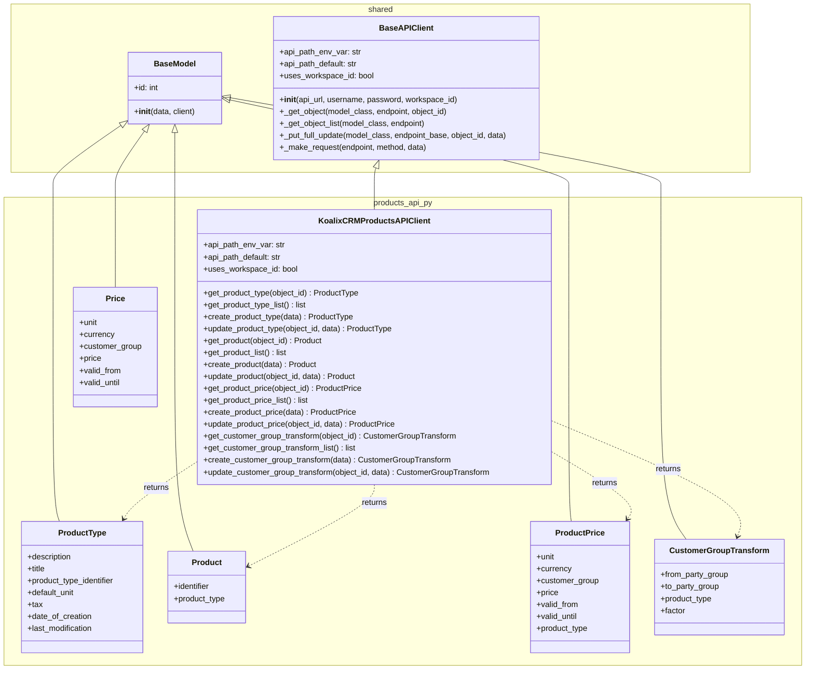
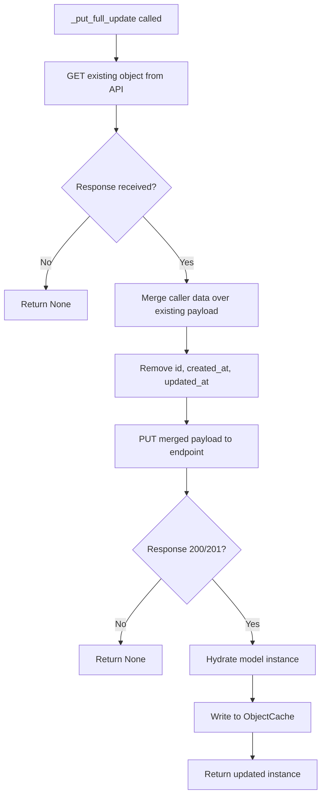

# Low-Level Documentation: `koalixcrm/products_api_py`

Arc42 Chapter 5 — Building Block View, Low Level

---

## 1. Introduction

### 1.1 Scope

This document covers all source files in the `koalixcrm/products_api_py` package:

- `koalixcrm/products_api_py/products_api_client.py` — `KoalixCRMProductsAPIClient`
- `koalixcrm/products_api_py/products_api.py` — ViewSet re-export module
- `koalixcrm/products_api_py/dto/product_type.py` — `ProductType`
- `koalixcrm/products_api_py/dto/product.py` — `Product`
- `koalixcrm/products_api_py/dto/product_price.py` — `ProductPrice`
- `koalixcrm/products_api_py/dto/customer_group_transform.py` — `CustomerGroupTransform`
- `koalixcrm/products_api_py/dto/price.py` — `Price`

The package has two distinct responsibilities. On the server side, `products_api.py` re-exports the Django REST Framework ViewSets that register the Products domain endpoints in the URL router. On the client side, `KoalixCRMProductsAPIClient` and the accompanying DTOs provide a typed Python interface for consuming those same endpoints from external processes such as Celery workers or inter-service calls.

### 1.2 Target Audience

Developers integrating with or extending the Products REST API, developers maintaining Celery workers that consume product catalog data, and architects reviewing the inter-service boundary between the Products domain and its external consumers.

### 1.3 Glossary

| Term | Definition |
|---|---|
| BaseAPIClient | Shared base class in `koalixcrm/shared/api_client.py` providing authentication, request execution, caching, and CRUD helpers inherited by all domain API clients. |
| BaseModel | Shared base class in `koalixcrm/shared/base_model.py` that hydrates instance attributes from a raw API response dictionary. |
| DTO | Data Transfer Object — a lightweight class that holds the deserialized fields of a single API resource. |
| M2M | Machine-to-machine authentication using the OIDC client credentials flow. |
| ObjectCache | In-memory per-client cache (`koalixcrm/shared/object_cache.py`) keyed by model class and integer ID. |
| ProductType | The product template / catalog entry. Defines what a product is (title, description, tax, default unit). |
| Product | An individual trackable item that instantiates a ProductType. |
| ProductPrice | A time-bounded price record for a ProductType, segmented by customer group. |
| CustomerGroupTransform | A pricing multiplier between two party groups for a given ProductType. Post-v2.0.0 this references `party_group` fields on both sides (replacing the legacy `CustomerGroup` foreign key). |
| Price | A generic price DTO present in the package but not consumed by any client method in the current implementation. |
| workspace_id | An integer tenant discriminator injected into the URL path when `uses_workspace_id = True`. |
| ViewSet | A Django REST Framework class that groups list/retrieve/create/update/destroy actions for a single resource type. |

---

## 2. KoalixCRMProductsAPIClient

### 2.1 Overview

`KoalixCRMProductsAPIClient` is the sole API client class in this package. It extends `BaseAPIClient` and adds CRUD methods for four Products domain resources: ProductType, Product, ProductPrice, and CustomerGroupTransform. Authentication, request execution, token management, and object caching are all delegated to the base class; this class contributes only the endpoint routing and resource-specific instantiation logic.

The class declares three class-level configuration attributes that `BaseAPIClient.__init__` reads during construction. `api_path_env_var` is set to `"KOALIXCRM_PRODUCTS_API_PATH"`, which names the environment variable from which the API path prefix is read. `api_path_default` is set to `"/koalixcrm_products/api/v1/"`, providing a fallback when the environment variable is absent. `uses_workspace_id` is set to `True`, instructing the base class to inject the `workspace_id` integer into every constructed URL path between the API prefix and the endpoint segment.

The explicit `__init__` method accepts four optional arguments — `api_url`, `username`, `password`, and `workspace_id` — and forwards all of them directly to `super().__init__()`. No additional initialization logic is present; the method exists to make the constructor signature discoverable to type checkers and callers.

### 2.2 Class Diagram



### 2.3 Endpoint Naming Note

The ProductType resource is served at the `/products` endpoint, not `/product-types`. This naming reflects the Django REST Framework URL registration in the server-side router and is intentional: in the Products domain, the endpoint `/products` represents the catalog (i.e. product type definitions), while `/product-items` represents individual physical or trackable item instances. Callers must be aware that the DTO class is `ProductType` but the HTTP path segment is `products`.

### 2.4 Method Reference

#### 2.4.1 ProductType Methods (endpoint: `/products`)

**`get_product_type(object_id: int) -> ProductType | None`**

Delegates to `_get_object(ProductType, "/products", object_id)`. The base implementation checks the `ObjectCache` first; on a cache miss it issues a `GET` request to `{api_prefix}/{workspace_id}/products/{object_id}/`, hydrates a `ProductType` instance, writes it into the cache, and returns it. Returns `None` if the API responds with any status other than 200 or 201.

**`get_product_type_list() -> list[ProductType]`**

Delegates to `_get_object_list(ProductType, "/products/")`. The base implementation follows Django REST Framework pagination by chasing the `next` URL in each paginated response envelope until exhausted. All retrieved items are hydrated into `ProductType` instances and written to the cache. Returns an empty list if the initial request fails.

**`create_product_type(data: dict[str, Any]) -> ProductType | None`**

Issues a `POST` to `/products/` with `data` serialized as JSON. On a 201 response it constructs a `ProductType` from the response body, stores it in the cache under its server-assigned ID, and returns it. Returns `None` on failure.

**`update_product_type(object_id: int, data: dict[str, Any]) -> ProductType | None`**

Delegates to `_put_full_update(ProductType, "/products", object_id, data)`. The base implementation first fetches the existing resource to obtain its full current representation, merges the caller-supplied `data` dict on top of it (removing `id`, `created_at`, and `updated_at` before sending), and issues a `PUT` to `/products/{object_id}/`. On success the cache entry is overwritten and the updated `ProductType` is returned.

The flow for `_put_full_update` is:



#### 2.4.2 Product Methods (endpoint: `/product-items`)

**`get_product(object_id: int) -> Product | None`**

Delegates to `_get_object(Product, "/product-items", object_id)`. Follows the same cache-first, GET-on-miss pattern as `get_product_type`.

**`get_product_list() -> list[Product]`**

Delegates to `_get_object_list(Product, "/product-items/")`. Handles DRF pagination identically to `get_product_type_list`.

**`create_product(data: dict[str, Any]) -> Product | None`**

Issues a `POST` to `/product-items/`. On success constructs a `Product`, caches it, and returns it.

**`update_product(object_id: int, data: dict[str, Any]) -> Product | None`**

Delegates to `_put_full_update(Product, "/product-items", object_id, data)`. Full-fetch-then-PUT semantics as described above.

#### 2.4.3 ProductPrice Methods (endpoint: `/product-prices`)

**`get_product_price(object_id: int) -> ProductPrice | None`**

Delegates to `_get_object(ProductPrice, "/product-prices", object_id)`.

**`get_product_price_list() -> list[ProductPrice]`**

Delegates to `_get_object_list(ProductPrice, "/product-prices/")`.

**`create_product_price(data: dict[str, Any]) -> ProductPrice | None`**

Issues a `POST` to `/product-prices/`. On success constructs a `ProductPrice`, caches it, and returns it.

**`update_product_price(object_id: int, data: dict[str, Any]) -> ProductPrice | None`**

Delegates to `_put_full_update(ProductPrice, "/product-prices", object_id, data)`.

#### 2.4.4 CustomerGroupTransform Methods (endpoint: `/customer-group-transforms`)

**`get_customer_group_transform(object_id: int) -> CustomerGroupTransform | None`**

Delegates to `_get_object(CustomerGroupTransform, "/customer-group-transforms", object_id)`.

**`get_customer_group_transform_list() -> list[CustomerGroupTransform]`**

Delegates to `_get_object_list(CustomerGroupTransform, "/customer-group-transforms/")`.

**`create_customer_group_transform(data: dict[str, Any]) -> CustomerGroupTransform | None`**

Issues a `POST` to `/customer-group-transforms/`. On success constructs a `CustomerGroupTransform`, caches it, and returns it.

**`update_customer_group_transform(object_id: int, data: dict[str, Any]) -> CustomerGroupTransform | None`**

Delegates to `_put_full_update(CustomerGroupTransform, "/customer-group-transforms", object_id, data)`.

---

## 3. DTO Classes

All DTO classes in this package extend `BaseModel`. The constructor pattern is uniform: field attributes are initialized to `None` before calling `super().__init__(data)`, which hydrates the attributes from the raw API response dictionary. This ensures that all declared fields exist as instance attributes even when the API response omits them.

### 3.1 ProductType

`ProductType` represents a product template or catalog entry. It is the primary domain entity in the Products domain and the anchor for pricing and item instantiation.

The `description` field carries a human-readable long-form description of the product type. The `title` field is the short display name. The `product_type_identifier` is a domain-managed code or SKU-style string that identifies the product type within the business context. The `default_unit` field references the unit of measure that applies to this product by default. The `tax` field references the applicable tax category or rate. The `date_of_creation` and `last_modification` fields are ISO 8601 timestamp strings populated by the server; they are stripped by `_put_full_update` when performing write operations.

Note on endpoint naming: the API endpoint for `ProductType` resources is `/products`, not `/product-types`. The client methods use this endpoint explicitly and callers must pass data structured for the `/products` endpoint.

### 3.2 Product

`Product` represents an individual physical or trackable item — a concrete instantiation of a `ProductType`. It is a deliberately minimal DTO, carrying only the fields needed to identify and relate the item.

The `identifier` field holds a string that uniquely identifies this specific item instance within its workspace, such as a serial number or asset tag. The `product_type` field holds a reference (typically an integer foreign key or a nested representation, depending on the server's serializer depth) to the `ProductType` from which this item was created.

Products are retrieved and mutated at the `/product-items` endpoint, which is distinct from the `/products` endpoint used for ProductType catalog records.

### 3.3 ProductPrice

`ProductPrice` encodes a time-bounded price for a given product type, restricted to a specific customer group. It is the mechanism by which the Products domain exposes differentiated pricing.

The `unit` field specifies the unit of measure for which this price applies. The `currency` field carries the ISO 4217 currency code. The `customer_group` field references the customer group (or, post-v2.0.0, the party group) for which this price is valid. The `price` field holds the numeric price value. The `valid_from` and `valid_until` fields are ISO 8601 dates bounding the validity window. The `product_type` field references the `ProductType` catalog entry to which this price belongs.

### 3.4 CustomerGroupTransform

`CustomerGroupTransform` defines a multiplier relationship between two party groups for a given product type. It enables the pricing subsystem to derive one group's price from another by applying a scalar `factor`.

The `from_party_group` field identifies the source party group whose base price is used as the input to the transformation. The `to_party_group` field identifies the target party group for which the derived price is produced. The `product_type` field scopes the transformation to a specific catalog entry. The `factor` field is a numeric multiplier applied to the `from_party_group` price to yield the `to_party_group` price.

**Migration context (v2.0.0 party model):** Prior to v2.0.0 the class referenced a `CustomerGroup` foreign key on both sides. The v2.0.0 refactoring replaced `CustomerGroup` references across the domain with the unified `PartyGroup` model. The DTO fields were renamed to `from_party_group` and `to_party_group` accordingly. The class retains the name `CustomerGroupTransform` because it carries the same product-pricing semantics as the legacy record; only the referenced entity type changed. Callers integrating after v2.0.0 must supply `from_party_group` and `to_party_group` values rather than the legacy `customer_group` fields.

### 3.5 Price (Unused)

`Price` is a generic price DTO present in `dto/price.py`. It carries six fields: `unit`, `currency`, `customer_group`, `price`, `valid_from`, and `valid_until`. It differs from `ProductPrice` in that it does not carry a `product_type` reference, making it a more generic price record without a catalog anchor.

No method in `KoalixCRMProductsAPIClient` currently instantiates, returns, or accepts a `Price` object. The class is present in the package but is not wired to any endpoint. It may represent a domain concept used elsewhere (for example, in a pricing calculation context that operates on price data abstracted away from a specific product type), or it may be a candidate for future use. Callers should not rely on this class being connected to any client method until an explicit endpoint binding is added.

---

## 4. products_api.py — ViewSet Re-Export Module

`products_api.py` is a thin aggregation module on the server side. It imports four ViewSet classes from their canonical locations under `koalixcrm.products.views.*` and re-exports all four through its `__all__` list. The module itself contains no logic; it exists to provide a single, stable import point for URL router configuration.

The four re-exported ViewSets are:

- **`ProductTypeViewSet`** — imported from `koalixcrm.products.views.product_type_view_set`. Registered at the `/products` endpoint.
- **`ProductViewSet`** — imported from `koalixcrm.products.views.product_view_set`. Registered at the `/product-items` endpoint.
- **`ProductPriceViewSet`** — imported from `koalixcrm.products.views.product_price_view_set`. Registered at the `/product-prices` endpoint.
- **`CustomerGroupTransformViewSet`** — imported from `koalixcrm.products.views.customer_group_transform_view_set`. Registered at the `/customer-group-transforms` endpoint.

The ViewSet implementations themselves reside in the `koalixcrm/products/views/` package, which is outside the scope of this document. This module provides the bridge between the Products application's internal view layer and the API routing configuration.

---

## 5. Access to External Interfaces

`KoalixCRMProductsAPIClient` communicates exclusively with the KoalixCRM backend REST API over HTTP or HTTPS. The base URL is resolved at construction time from the `KOALIXCRM_API_URL` environment variable. All four resource groups use the same base URL and share the same API version prefix resolved from `KOALIXCRM_PRODUCTS_API_PATH` (or the default `/koalixcrm_products/api/v1/`).

When `uses_workspace_id` is `True` and a `workspace_id` is supplied, every constructed URL path takes the form:

```text
{KOALIXCRM_API_URL}{api_prefix}/{workspace_id}/{endpoint}/{object_id}/
```

For example, a request for ProductType with ID 42 in workspace 7 resolves to:

```text
{KOALIXCRM_API_URL}/koalixcrm_products/api/v1/7/products/42/
```

The client has no other external dependencies. It does not call any third-party service directly. The OIDC token endpoint is reached transiently by `BaseAPIClient.get_token()` during M2M authentication; the URL is discovered from `CELERY_WORKER_M2M_OIDC_ISSUER` via the `.well-known/openid-configuration` endpoint.

---

## 6. Security

Authentication mode is selected at construction time:

- **M2M client credentials (default):** If no `username`/`password` pair is supplied, the client uses the OIDC client credentials flow. The client ID, secret, issuer URL, and scope are read from the environment variables `CELERY_WORKER_M2M_CLIENT_ID`, `CELERY_WORKER_M2M_CLIENT_SECRET`, `CELERY_WORKER_M2M_OIDC_ISSUER`, and `CELERY_WORKER_M2M_SCOPE`. Tokens are cached in a `TokenCache` instance and refreshed automatically on 401 or 403 responses.
- **Basic Auth (session mode):** If `username` and `password` are provided, the client encodes them as a Base64 `Authorization: Basic` header. This mode is intended for test environments using `LiveServerTestCase`.

The environment variable `X_CUSTOM_ORIGIN_VERIFICATION_ON` enables an optional custom origin verification header (`X-Custom-Origin-Verify`) populated from `X_CUSTOM_ORIGIN_VERIFICATION_KEY`. This header is appended to every request when enabled and provides an additional layer of caller identification at the server.

The following environment variables are security-sensitive and must not be hardcoded or committed:

| Variable | Purpose |
|---|---|
| `KOALIXCRM_API_URL` | Base URL of the KoalixCRM backend; determines the host to which all requests are sent. |
| `KOALIXCRM_PRODUCTS_API_PATH` | API path prefix; overrides the default `/koalixcrm_products/api/v1/`. |
| `CELERY_WORKER_M2M_CLIENT_ID` | OIDC client ID for M2M authentication. |
| `CELERY_WORKER_M2M_CLIENT_SECRET` | OIDC client secret for M2M authentication. |
| `CELERY_WORKER_M2M_OIDC_ISSUER` | OIDC issuer URL for token endpoint discovery. |
| `CELERY_WORKER_M2M_SCOPE` | Optional scope string appended to the client credentials grant. |
| `X_CUSTOM_ORIGIN_VERIFICATION_KEY` | Secret shared between caller and API for origin header verification. |

---

## 7. Design Patterns

**Template Method (BaseAPIClient).** The `KoalixCRMProductsAPIClient` contributes configuration constants and resource-specific instantiation; the invariant steps of authentication, connection management, retrying, pagination, and caching are implemented once in `BaseAPIClient` and invoked by the template methods `_get_object`, `_get_object_list`, `_put_full_update`, and `_make_request`.

**Data Transfer Object.** Each resource type has a corresponding DTO class (`ProductType`, `Product`, `ProductPrice`, `CustomerGroupTransform`, `Price`). DTOs hold only the deserialized API fields and carry no domain logic. Field hydration is handled uniformly by `BaseModel.__init__`.

**Cache-Aside (ObjectCache).** Every read method checks the `ObjectCache` before issuing a network request. Every write method (create and update) populates or overwrites the cache entry with the server's response. This reduces redundant network calls within the lifetime of a single client instance.

**Defensive Field Initialization.** Each DTO constructor initializes all fields to `None` before calling `super().__init__(data)`. This prevents `AttributeError` on field access when the API response omits optional fields.

**Fetch-Merge-PUT (Full Update).** The `_put_full_update` helper implements a safe full-update pattern: it fetches the current server representation, merges the caller's partial data on top, strips server-managed fields (`id`, `created_at`, `updated_at`), and sends a complete PUT payload. This prevents accidental field erasure from partial client knowledge.

---

## 8. External Dependencies

The package has no third-party library dependencies beyond the Python standard library and the shared infrastructure provided by `koalixcrm/shared/`. All HTTP communication is performed with `http.client` from the standard library. JSON serialization uses the `json` module. The `typing` module provides type annotations. The `os.getenv` function reads configuration from the environment.

The package depends on the following internal modules:

- `koalixcrm.shared.api_client.BaseAPIClient` — authentication, request execution, retry, caching, and CRUD helpers.
- `koalixcrm.shared.base_model.BaseModel` — DTO hydration from raw API response dictionaries.
- `koalixcrm.shared.object_cache.ObjectCache` — in-memory per-client resource cache.
- `koalixcrm.shared.token_cache.TokenCache` — OIDC token cache with expiry handling.

The server-side `products_api.py` depends on:

- `koalixcrm.products.views.product_type_view_set.ProductTypeViewSet`
- `koalixcrm.products.views.product_view_set.ProductViewSet`
- `koalixcrm.products.views.product_price_view_set.ProductPriceViewSet`
- `koalixcrm.products.views.customer_group_transform_view_set.CustomerGroupTransformViewSet`

---

## 9. Appendix

### 9.1 Endpoint–DTO–Method Mapping

| Resource | DTO Class | API Endpoint | List Method | Get Method | Create Method | Update Method |
|---|---|---|---|---|---|---|
| Product catalog entry | `ProductType` | `/products` | `get_product_type_list` | `get_product_type` | `create_product_type` | `update_product_type` |
| Item instance | `Product` | `/product-items` | `get_product_list` | `get_product` | `create_product` | `update_product` |
| Price record | `ProductPrice` | `/product-prices` | `get_product_price_list` | `get_product_price` | `create_product_price` | `update_product_price` |
| Group price transform | `CustomerGroupTransform` | `/customer-group-transforms` | `get_customer_group_transform_list` | `get_customer_group_transform` | `create_customer_group_transform` | `update_customer_group_transform` |
| Generic price (unused) | `Price` | — | — | — | — | — |

### 9.2 URL Construction Example

Given the following environment:

```text
KOALIXCRM_API_URL=https://api.example.com
KOALIXCRM_PRODUCTS_API_PATH=/koalixcrm_products/api/v1/
workspace_id=3
```

A call to `get_product_price(object_id=17)` constructs the URL:

```text
https://api.example.com/koalixcrm_products/api/v1/3/product-prices/17/
```

### 9.3 CustomerGroupTransform v2.0.0 Migration Summary

Prior to v2.0.0, the transform record referenced two `CustomerGroup` instances. After v2.0.0, the domain model unified customer groups and other party groupings into a single `PartyGroup` entity. The DTO fields were renamed to `from_party_group` and `to_party_group`. The class name `CustomerGroupTransform` was preserved for backward compatibility with the API endpoint registration and existing documentation. Systems that serialized or stored raw dictionaries with the pre-v2.0.0 field names (`from_customer_group`, `to_customer_group`, or similar) must update their payloads before calling the current client methods.
