# Low-Level Documentation — Reporting: Project, Task, Work and ReportingPeriod Models

## Introduction

### Scope

This document covers the following source files in
`koalixcrm/reporting/models/`:

- `project.py` — `Project`
- `task.py` — `Task`
- `work.py` — `Work`
- `reporting_period.py` — `ReportingPeriod`, `ReportingPeriodAdminForm`,
  `ProjectJSONSerializer`
- `project_status.py` — `ProjectStatus`, `ProjectStatusJSONSerializer`
- `task_status.py` — `TaskStatus`, `TaskStatusJSONSerializer`
- `reporting_period_status.py` — `ReportingPeriodStatus`,
  `TaskStatusJSONSerializer` (serializer alias)
- `generic_project_link.py` — `GenericProjectLink`
- `generic_task_link.py` — `GenericTaskLink`
- `project_link_type.py` — `ProjectLinkType`
- `task_link_type.py` — `TaskLinkType`

Together these files form the project/task/work hierarchy at the heart of the
`reporting` app. They are documented for the software development engineer who
needs to use, modify, or extend them.

The resource, agreement and estimation models are covered separately in
[QQ_LL_Doc_Reporting_ResourceAgreementModels.md](QQ_LL_Doc_Reporting_ResourceAgreementModels.md).

The broader internal structure of the `reporting` app is described in
[QQ_SD_ComponentArchitecture.md](../../QQ_SD_ComponentArchitecture.md).

### Target Audience

Software development engineers who implement features against, modify, or
extend the reporting domain model.

### Glossary

| Term/Acronym | Full Form | Description |
|---|---|---|
| CRM | Customer Relationship Management | The umbrella application (`koalixcrm`) this module belongs to. |
| ORM | Object-Relational Mapper | Django's abstraction layer over the database. |
| FK | Foreign Key | A database relationship field pointing to another table. |
| MTI | Multi-Table Inheritance | Django pattern where a child model extends a parent model using a shared primary key. |
| DRF | Django REST Framework | The library used to build the REST API layer. |
| RP | Reporting Period | A calendar-bounded window within a project used to gate work entry and cost confirmation. |
| WSM | WorkspaceScopedModel | The abstract base class that adds a `workspace` FK and a workspace-aware ORM manager to every tenant-scoped model. |
| is_done | — | Boolean flag on status lookup models (`ProjectStatus`, `TaskStatus`, `ReportingPeriodStatus`) that marks a lifecycle terminal state. |

---

## Detailed Components

### Project

*Figure 1 — Project class diagram*

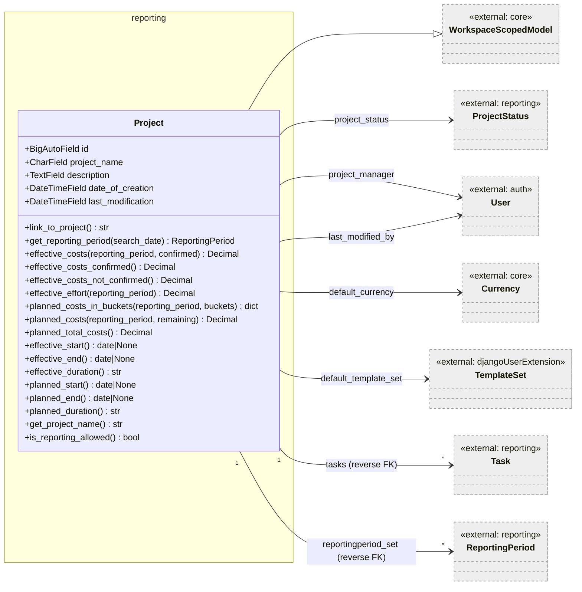
```mermaid
classDiagram
    direction LR

    namespace reporting {
        class Project {
            +BigAutoField id
            +CharField project_name
            +TextField description
            +DateTimeField date_of_creation
            +DateTimeField last_modification
            +link_to_project() str
            +get_reporting_period(search_date) ReportingPeriod
            +effective_costs(reporting_period, confirmed) Decimal
            +effective_costs_confirmed() Decimal
            +effective_costs_not_confirmed() Decimal
            +effective_effort(reporting_period) Decimal
            +planned_costs_in_buckets(reporting_period, buckets) dict
            +planned_costs(reporting_period, remaining) Decimal
            +planned_total_costs() Decimal
            +effective_start() date|None
            +effective_end() date|None
            +effective_duration() str
            +planned_start() date|None
            +planned_end() date|None
            +planned_duration() str
            +get_project_name() str
            +is_reporting_allowed() bool
        }
    }

    class WorkspaceScopedModel:::external {
        <<external: core>>
    }
    class ProjectStatus:::external {
        <<external: reporting>>
    }
    class Task:::external {
        <<external: reporting>>
    }
    class ReportingPeriod:::external {
        <<external: reporting>>
    }
    class User:::external {
        <<external: auth>>
    }
    class Currency:::external {
        <<external: core>>
    }
    class TemplateSet:::external {
        <<external: djangoUserExtension>>
    }

    Project --|> WorkspaceScopedModel
    Project --> ProjectStatus : project_status
    Project --> User : project_manager
    Project --> User : last_modified_by
    Project --> Currency : default_currency
    Project --> TemplateSet : default_template_set
    Project "1" --> "*" Task : tasks (reverse FK)
    Project "1" --> "*" ReportingPeriod : reportingperiod_set (reverse FK)

    classDef external fill:#eee,stroke:#999,stroke-dasharray:4 4;
```

*Figure 1: Project and its direct relationships. Internal classes are enclosed
in the `reporting` namespace; external references are shown as black boxes.*

`Project` is the root aggregate of the reporting domain. It stores project
metadata such as the name, description, and the assigned project manager, and
references a `ProjectStatus`, a `Currency` (used for all cost rounding), and an
optional `TemplateSet` for PDF export. Two `auth.User` foreign keys handle the
project manager and the last-modifying user. The `date_of_creation` and
`last_modification` fields are auto-populated by Django and are not set
explicitly.

Cost and effort figures are never stored directly on `Project`. Instead, every
cost and effort method iterates the child `Task` queryset and aggregates the
results. The `default_currency.round()` method is applied to every cost result
before it is returned, ensuring consistent decimal rounding across all project
outputs.

The `is_reporting_allowed()` predicate gates work entry at the project level by
checking that at least one open (non-done) `ReportingPeriod` exists for the
project and that the project's own status is not terminal.

#### Methods

##### `link_to_project() → str`

Returns an HTML anchor tag pointing to the Django Admin change page for this
project. When `self.id` is not yet set the method returns the string
`"Not present"`. This is a trivial formatting helper tagged as a Django Admin
`short_description` column.

---

##### `get_reporting_period(search_date: datetime.date) → ReportingPeriod`

Delegates to the static method `ReportingPeriod.get_reporting_period(self,
search_date)`. Raises `ReportingPeriodNotFound` when no period covers the
supplied date.

---

##### `effective_costs(reporting_period, confirmed) → Decimal`

Sums `task.effective_costs(reporting_period, confirmed)` across all tasks
belonging to this project, then applies currency rounding. The `reporting_period`
argument restricts cost aggregation to a single period; when `None`, all periods
matching the `confirmed` flag are included.

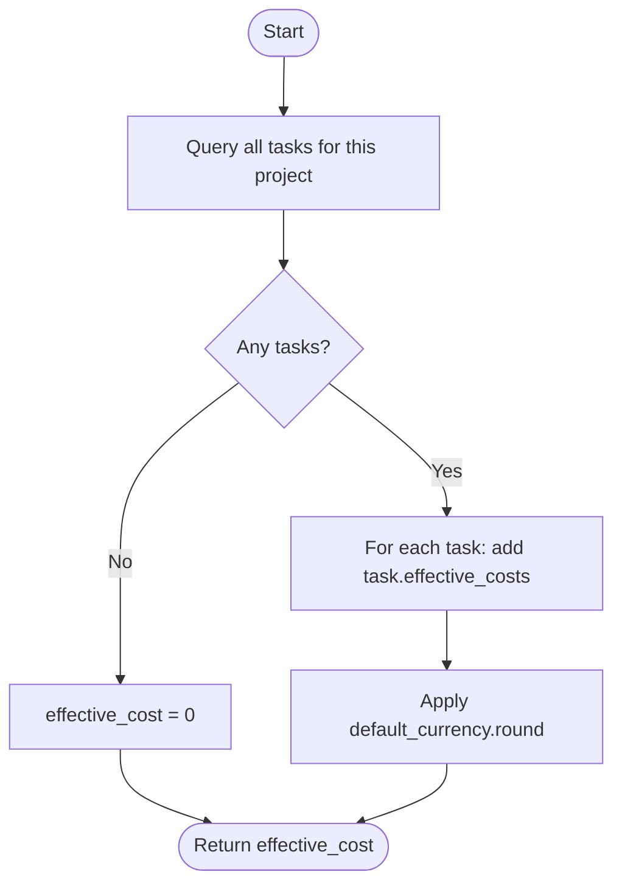
```mermaid
flowchart TD
    A([Start]) --> B[Query all tasks for this project]
    B --> C{Any tasks?}
    C -->|No| D[effective_cost = 0]
    C -->|Yes| E[For each task: add task.effective_costs]
    E --> F[Apply default_currency.round]
    D --> G([Return effective_cost])
    F --> G
```

*Figure 2: Flow of `Project.effective_costs`.*

---

##### `effective_costs_confirmed() → Decimal`

Thin delegation: calls `self.effective_costs(confirmed=True)`. Tagged as a Django
Admin column.

---

##### `effective_costs_not_confirmed() → Decimal`

Thin delegation: calls `self.effective_costs(confirmed=False)`.

---

##### `effective_effort(reporting_period) → Decimal`

Sums `task.effective_effort(reporting_period)` across all child tasks. No
currency rounding is applied because effort is expressed in hours.

---

##### `planned_costs_in_buckets(reporting_period, buckets) → dict`

Aggregates planned costs broken down by reporting-period buckets. The return
value is a dictionary with one key per bucket plus a `"sum_costs"` accumulator.

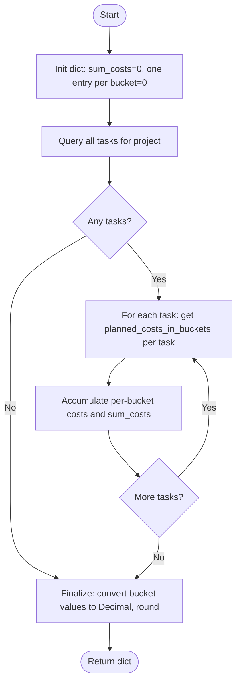
```mermaid
flowchart TD
    A([Start]) --> B[Init dict: sum_costs=0, one entry per bucket=0]
    B --> C[Query all tasks for project]
    C --> D{Any tasks?}
    D -->|No| E[Finalize: convert bucket values to Decimal, round]
    D -->|Yes| F[For each task: get planned_costs_in_buckets per task]
    F --> G[Accumulate per-bucket costs and sum_costs]
    G --> H{More tasks?}
    H -->|Yes| F
    H -->|No| E
    E --> I([Return dict])
```

*Figure 3: Flow of `Project.planned_costs_in_buckets`.*

---

##### `planned_costs(reporting_period, remaining) → Decimal`

Sums `task.planned_costs(reporting_period, remaining)` over all child tasks. When
`remaining=False` the method captures the full planned cost including historical
work.

---

##### `planned_total_costs() → Decimal`

Thin delegation: calls `self.planned_costs(remaining=False)`. Tagged as a Django
Admin column.

---

##### `effective_start() → date | None`

Returns the earliest effective start date across all child tasks. If no task has
started (no work recorded anywhere and no tasks at all), `None` is returned.

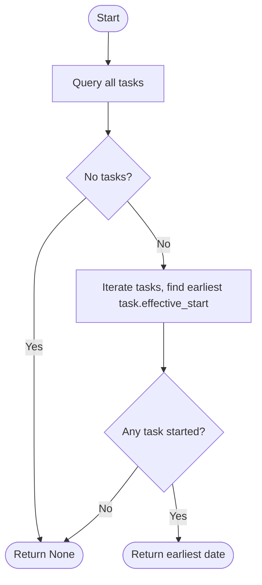
```mermaid
flowchart TD
    A([Start]) --> B[Query all tasks]
    B --> C{No tasks?}
    C -->|Yes| Z([Return None])
    C -->|No| D[Iterate tasks, find earliest task.effective_start]
    D --> E{Any task started?}
    E -->|No| Z
    E -->|Yes| F([Return earliest date])
```

*Figure 4: Flow of `Project.effective_start`.*

---

##### `effective_end() → date | None`

Returns the latest effective end date across all child tasks. Returns `None` when
any task has not yet ended (i.e. the project is still in progress).

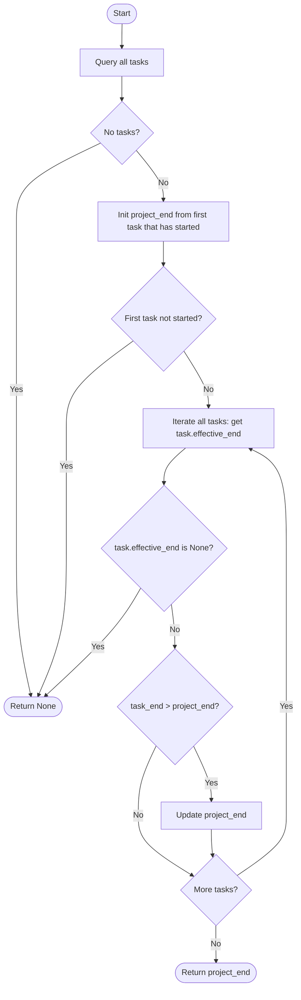
```mermaid
flowchart TD
    A([Start]) --> B[Query all tasks]
    B --> C{No tasks?}
    C -->|Yes| Z([Return None])
    C -->|No| D[Init project_end from first task that has started]
    D --> E{First task not started?}
    E -->|Yes| Z
    E -->|No| F[Iterate all tasks: get task.effective_end]
    F --> G{task.effective_end is None?}
    G -->|Yes| Z
    G -->|No| H{task_end > project_end?}
    H -->|Yes| I[Update project_end]
    H -->|No| J{More tasks?}
    I --> J
    J -->|Yes| F
    J -->|No| K([Return project_end])
```

*Figure 5: Flow of `Project.effective_end`.*

---

##### `effective_duration() → str`

Returns a human-readable duration string. If the project has not started,
returns `"Project has not yet started"`. If started but not ended, returns
`"Project has not yet ended"`. Otherwise returns the number of calendar days as
a string.

---

##### `planned_start() → date | None`

Returns the earliest `date_from` across all `Estimation` records attached to
child tasks. Iterates through all tasks and tracks the minimum planned-start date
seen.

---

##### `planned_end() → date | None`

Returns the latest `date_until` across all `Estimation` records. Note: the
current implementation returns early after processing the first task due to an
indentation issue — the `return project_end` statement inside the task loop
causes the loop to exit after processing the first task that has a `planned_end`.

---

##### `planned_duration() → str`

Returns the number of calendar days between `planned_start()` and `planned_end()`
as a string, or `"n/a"` if either is missing or the start is after the end.

---

##### `get_project_name() → str`

Returns `self.project_name` when set, otherwise `"n/a"`.

---

##### `is_reporting_allowed() → bool`

Returns `True` when the project has at least one non-done `ReportingPeriod` and
the project's own status is not terminal (`is_done=False`).

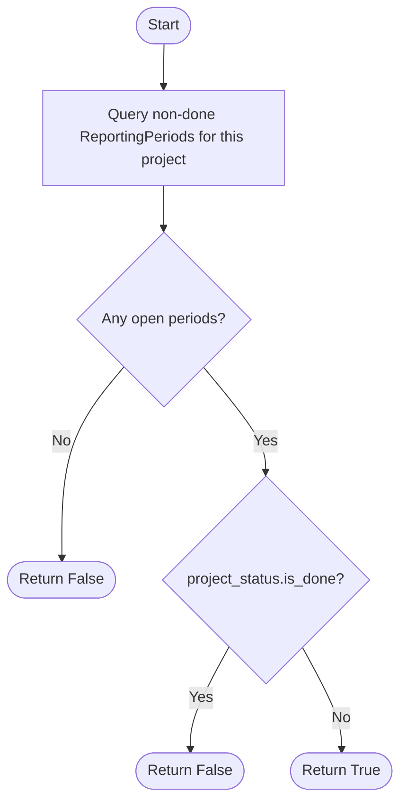
```mermaid
flowchart TD
    A([Start]) --> B[Query non-done ReportingPeriods for this project]
    B --> C{Any open periods?}
    C -->|No| D([Return False])
    C -->|Yes| E{project_status.is_done?}
    E -->|Yes| F([Return False])
    E -->|No| G([Return True])
```

*Figure 6: Flow of `Project.is_reporting_allowed`.*

---

### ProjectStatus

*Figure 7 — ProjectStatus class diagram*

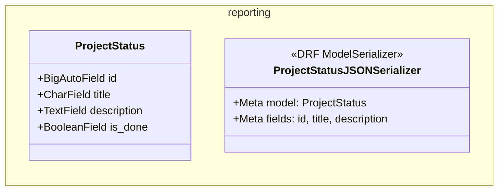
```mermaid
classDiagram
    direction LR

    namespace reporting {
        class ProjectStatus {
            +BigAutoField id
            +CharField title
            +TextField description
            +BooleanField is_done
        }
        class ProjectStatusJSONSerializer {
            <<DRF ModelSerializer>>
            +Meta model: ProjectStatus
            +Meta fields: id, title, description
        }
    }
```

*Figure 7: ProjectStatus and its serializer.*

`ProjectStatus` is a lifecycle lookup table for projects. The `is_done` flag
marks terminal states: when `True`, `Project.is_reporting_allowed()` returns
`False` and no new work can be entered against the project. There is no built-in
transition guard — status changes are performed freely via the admin or API.

---

### Task

*Figure 8 — Task class diagram*

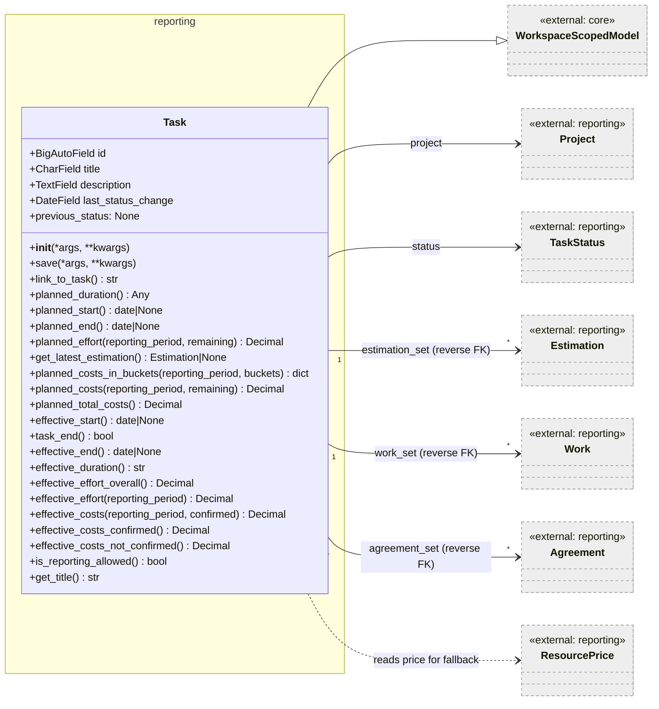
```mermaid
classDiagram
    direction LR

    namespace reporting {
        class Task {
            +BigAutoField id
            +CharField title
            +TextField description
            +DateField last_status_change
            +previous_status: None
            +__init__(*args, **kwargs)
            +save(*args, **kwargs)
            +link_to_task() str
            +planned_duration() Any
            +planned_start() date|None
            +planned_end() date|None
            +planned_effort(reporting_period, remaining) Decimal
            +get_latest_estimation() Estimation|None
            +planned_costs_in_buckets(reporting_period, buckets) dict
            +planned_costs(reporting_period, remaining) Decimal
            +planned_total_costs() Decimal
            +effective_start() date|None
            +task_end() bool
            +effective_end() date|None
            +effective_duration() str
            +effective_effort_overall() Decimal
            +effective_effort(reporting_period) Decimal
            +effective_costs(reporting_period, confirmed) Decimal
            +effective_costs_confirmed() Decimal
            +effective_costs_not_confirmed() Decimal
            +is_reporting_allowed() bool
            +get_title() str
        }
    }

    class WorkspaceScopedModel:::external {
        <<external: core>>
    }
    class Project:::external {
        <<external: reporting>>
    }
    class TaskStatus:::external {
        <<external: reporting>>
    }
    class Estimation:::external {
        <<external: reporting>>
    }
    class Work:::external {
        <<external: reporting>>
    }
    class Agreement:::external {
        <<external: reporting>>
    }
    class ResourcePrice:::external {
        <<external: reporting>>
    }

    Task --|> WorkspaceScopedModel
    Task --> Project : project
    Task --> TaskStatus : status
    Task "1" --> "*" Estimation : estimation_set (reverse FK)
    Task "1" --> "*" Work : work_set (reverse FK)
    Task "1" --> "*" Agreement : agreement_set (reverse FK)
    Task ..> ResourcePrice : reads price for fallback

    classDef external fill:#eee,stroke:#999,stroke-dasharray:4 4;
```

*Figure 8: Task and its direct relationships.*

`Task` is a child of `Project` and carries the operational unit of work. It
references a `TaskStatus` whose `is_done` flag drives work-entry gating. The
`last_status_change` field is maintained automatically by `save()` whenever the
status transitions to a different value. A Python-level `previous_status`
attribute (not persisted) is set in `__init__` to support this comparison.

Planned timeline information is derived from attached `Estimation` records;
actual timeline information is derived from `Work` records. All cost calculations
apply an agreement-first pricing strategy: work matched by an active `Agreement`
is priced at the agreement rate; unmatched work falls back to the resource's
default `ResourcePrice`.

#### Task Methods

##### `__init__(*args, **kwargs) → None`

Calls `super().__init__()` and snapshots `self.status` into `self.previous_status`
so that `save()` can detect status changes.

---

##### `save(*args, **kwargs) → None`

Updates `last_status_change` to today when the status has changed from the
previously observed value, or sets it to today on first creation when it would
otherwise be `None`.

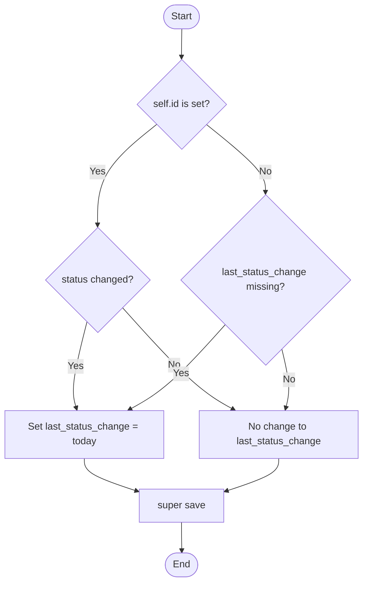
```mermaid
flowchart TD
    A([Start]) --> B{self.id is set?}
    B -->|Yes| C{status changed?}
    C -->|Yes| D[Set last_status_change = today]
    C -->|No| E[No change to last_status_change]
    B -->|No| F{last_status_change missing?}
    F -->|Yes| D
    F -->|No| E
    D --> G[super save]
    E --> G
    G --> Z([End])
```

*Figure 9: Flow of `Task.save`.*

---

##### `planned_start() → date | None`

Returns the earliest `date_from` across all attached `Estimation` records. Returns
`None` when no estimations exist.

---

##### `planned_end() → date | None`

Returns the earliest `date_until` across all attached `Estimation` records. Note:
the implementation uses `<` comparison on `date_until`, so the method returns the
earliest rather than the latest end date; this mirrors the source code exactly.

---

##### `planned_effort(reporting_period, remaining) → Decimal`

Computes the total planned effort in hours for this task.

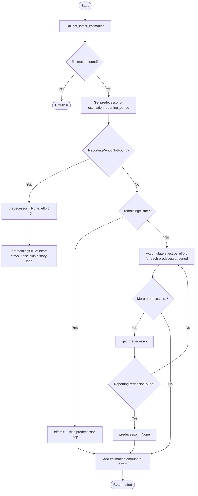
```mermaid
flowchart TD
    A([Start]) --> B[Call get_latest_estimation]
    B --> C{Estimation found?}
    C -->|No| Z([Return 0])
    C -->|Yes| D[Get predecessor of estimation.reporting_period]
    D --> E{ReportingPeriodNotFound?}
    E -->|Yes| F[predecessor = None, effort = 0]
    E -->|No| G{remaining=True?}
    F --> H[If remaining=True: effort stays 0 else skip history loop]
    G -->|Yes| I[effort = 0, skip predecessor loop]
    G -->|No| J[Accumulate effective_effort for each predecessor period]
    J --> K{More predecessors?}
    K -->|Yes| L[get_predecessor]
    L --> M{ReportingPeriodNotFound?}
    M -->|Yes| N[predecessor = None]
    M -->|No| J
    K -->|No| O[Add estimation.amount to effort]
    I --> O
    N --> O
    O --> P([Return effort])
```

*Figure 10: Flow of `Task.planned_effort`.*

The method uses the latest estimation as the authoritative forward-looking estimate
and adds the accumulated effective effort from all predecessor reporting periods
when `remaining=False`. This produces "planned total effort = past actual + future
estimate".

---

##### `get_latest_estimation() → Estimation | None`

Returns the estimation whose `reporting_period.begin` is latest among all
estimations attached to this task. Comparison is done by checking
`latest.reporting_period.end < candidate.reporting_period.begin`.

---

##### `planned_costs_in_buckets(reporting_period, buckets) → dict`

Returns a dictionary of planned costs split by reporting-period buckets. For
each bucket that precedes the estimation period, the method uses the actual
effective costs for that bucket. For buckets that overlap the estimation period,
it uses `Estimation.calculated_costs()` with the bucket date range.

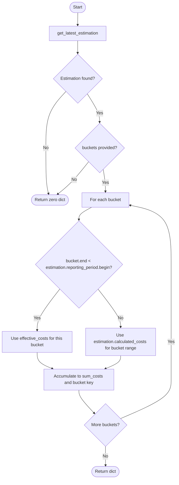
```mermaid
flowchart TD
    A([Start]) --> B[get_latest_estimation]
    B --> C{Estimation found?}
    C -->|No| Z([Return zero dict])
    C -->|Yes| D{buckets provided?}
    D -->|No| Z
    D -->|Yes| E[For each bucket]
    E --> F{bucket.end < estimation.reporting_period.begin?}
    F -->|Yes| G[Use effective_costs for this bucket]
    F -->|No| H[Use estimation.calculated_costs for bucket range]
    G --> I[Accumulate to sum_costs and bucket key]
    H --> I
    I --> J{More buckets?}
    J -->|Yes| E
    J -->|No| K([Return dict])
```

*Figure 11: Flow of `Task.planned_costs_in_buckets`.*

---

##### `planned_costs(reporting_period, remaining) → Decimal`

When `reporting_period` is provided, delegates to `planned_costs_in_buckets` and
sums the result values. When `reporting_period` is `None`, computes
`planned_effort * resource_price` using the first price found for the latest
estimation's resource.

---

##### `effective_start() → date | None`

Returns the earliest work date across all `Work` records for this task. If no
work has been recorded yet, falls back to `planned_start()`.

---

##### `task_end() → bool`

Returns `True` when `self.status` is set and `self.status.is_done` is `True`.
Returns `False` in all other cases including a missing status.

---

##### `effective_end() → date | None`

Returns the latest work date for this task, but only when `task_end()` is `True`.
If the task is done and no work was recorded, falls back to `last_status_change`.
Returns `None` when the task has not ended.

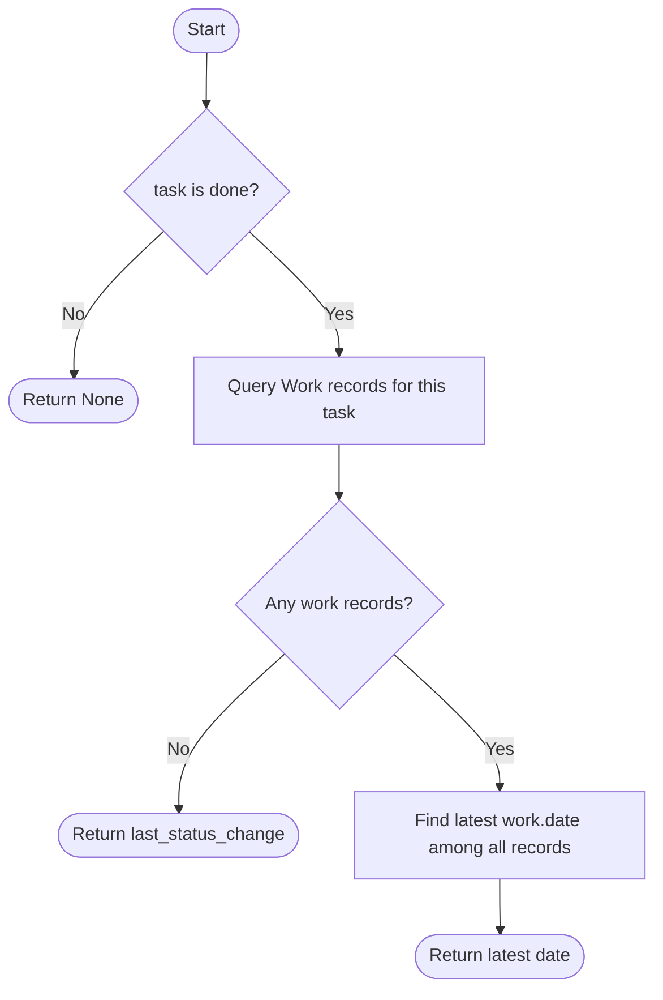
```mermaid
flowchart TD
    A([Start]) --> B{task is done?}
    B -->|No| Z([Return None])
    B -->|Yes| C[Query Work records for this task]
    C --> D{Any work records?}
    D -->|No| E([Return last_status_change])
    D -->|Yes| F[Find latest work.date among all records]
    F --> G([Return latest date])
```

*Figure 12: Flow of `Task.effective_end`.*

---

##### `effective_effort(reporting_period) → Decimal`

Sums `work.effort_seconds()` across all work records for this task (optionally
filtered by `reporting_period`), then divides by 3600 to produce hours.

---

##### `effective_costs(reporting_period, confirmed) → Decimal`

This is the most complex method in the task model. It computes the actual billed
cost for a task using agreement-prioritised pricing.

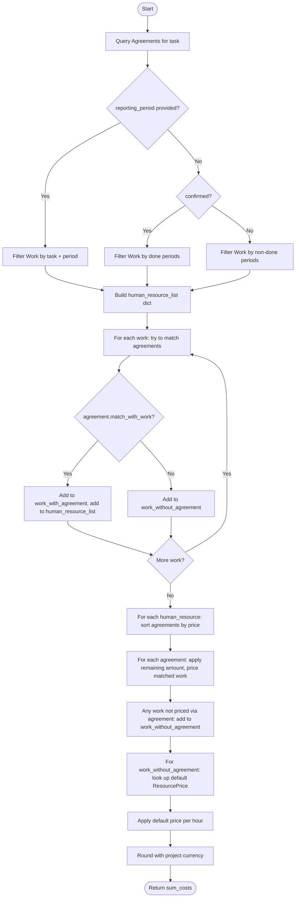
```mermaid
flowchart TD
    A([Start]) --> B[Query Agreements for task]
    B --> C{reporting_period provided?}
    C -->|Yes| D[Filter Work by task + period]
    C -->|No| E{confirmed?}
    E -->|Yes| F[Filter Work by done periods]
    E -->|No| G[Filter Work by non-done periods]
    D --> H
    F --> H
    G --> H
    H[Build human_resource_list dict] --> I[For each work: try to match agreements]
    I --> J{agreement.match_with_work?}
    J -->|Yes| K[Add to work_with_agreement, add to human_resource_list]
    J -->|No| L[Add to work_without_agreement]
    K --> M{More work?}
    L --> M
    M -->|Yes| I
    M -->|No| N[For each human_resource: sort agreements by price]
    N --> O[For each agreement: apply remaining amount, price matched work]
    O --> P[Any work not priced via agreement: add to work_without_agreement]
    P --> Q[For work_without_agreement: look up default ResourcePrice]
    Q --> R[Apply default price per hour]
    R --> S[Round with project currency]
    S --> T([Return sum_costs])
```

*Figure 13: Flow of `Task.effective_costs`.*

The algorithm proceeds in two phases. In phase one, each `Work` record is matched
against active `Agreement` entries via `Agreement.match_with_work()`. Matched work
is binned into `work_with_agreement`. In phase two, agreements are sorted by price
(cheapest first) and applied against their `amount` budget; work that exhausts the
budget or was unmatched goes to `work_without_agreement`. Unmatched work is priced
at the first `ResourcePrice` found for the human resource, ordered by price.

---

##### `is_reporting_allowed() → bool`

Returns `True` when the task's status is set and `is_done` is `False`.

---

### TaskStatus

*Figure 14 — TaskStatus class diagram*

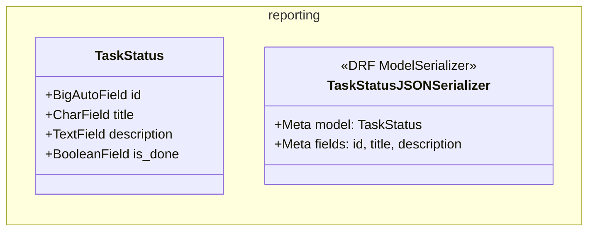
```mermaid
classDiagram
    direction LR

    namespace reporting {
        class TaskStatus {
            +BigAutoField id
            +CharField title
            +TextField description
            +BooleanField is_done
        }
        class TaskStatusJSONSerializer {
            <<DRF ModelSerializer>>
            +Meta model: TaskStatus
            +Meta fields: id, title, description
        }
    }
```

*Figure 14: TaskStatus and its serializer.*

`TaskStatus` is a lifecycle lookup table for tasks. The `is_done` flag marks
terminal states and has two effects: `Task.is_reporting_allowed()` returns `False`
and `Task.effective_end()` becomes eligible to return a date.

---

### Work

*Figure 15 — Work class diagram*

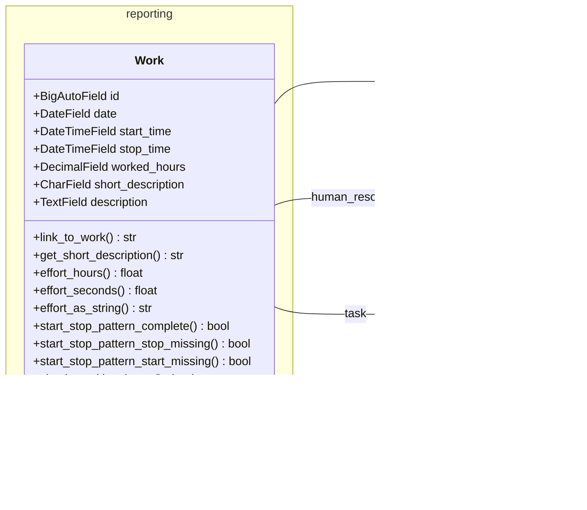
```mermaid
classDiagram
    direction LR

    namespace reporting {
        class Work {
            +BigAutoField id
            +DateField date
            +DateTimeField start_time
            +DateTimeField stop_time
            +DecimalField worked_hours
            +CharField short_description
            +TextField description
            +link_to_work() str
            +get_short_description() str
            +effort_hours() float
            +effort_seconds() float
            +effort_as_string() str
            +start_stop_pattern_complete() bool
            +start_stop_pattern_stop_missing() bool
            +start_stop_pattern_start_missing() bool
            +check_working_hours() bool
            +clean() Any
            +confirmed() bool
            +delete(using, keep_parents) Any
            +save(*args, **kwargs) None
        }
    }

    class WorkspaceScopedModel:::external {
        <<external: core>>
    }
    class HumanResource:::external {
        <<external: reporting>>
    }
    class Task:::external {
        <<external: reporting>>
    }
    class ReportingPeriod:::external {
        <<external: reporting>>
    }

    Work --|> WorkspaceScopedModel
    Work --> HumanResource : human_resource
    Work --> Task : task
    Work --> ReportingPeriod : reporting_period

    classDef external fill:#eee,stroke:#999,stroke-dasharray:4 4;
```

*Figure 15: Work and its relationships.*

`Work` records a single time entry by a `HumanResource` against a `Task` within a
`ReportingPeriod`. It supports two mutually exclusive effort recording patterns:

- **Start/stop timestamps**: `start_time` and `stop_time` are both set; effort is
  computed as the wall-clock difference in seconds.
- **Explicit hours**: `worked_hours` is set; the start/stop fields are left `None`;
  effort is `worked_hours * 3600` seconds.

`check_working_hours()` enforces that exactly one pattern is used; providing both
or providing only one of the start/stop pair raises a `ValidationError`. The `clean()`
method calls this validator so it runs during form-level cleaning.

`Work` is effectively immutable once the parent `ReportingPeriod` is closed
(`is_done=True`). Both `save()` and `delete()` check `self.confirmed()` first and
raise `ReportingPeriodDoneDeleteNotPossible` if the period is done. This guard
exists at the model layer, not only at the API layer.

#### Work Methods

##### `effort_seconds() → float`

Returns the effort in seconds.

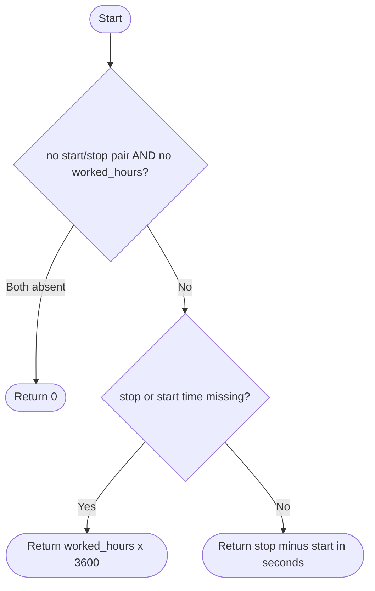
```mermaid
flowchart TD
    A([Start]) --> B{no start/stop pair AND no worked_hours?}
    B -->|Both absent| C([Return 0])
    B -->|No| D{stop or start time missing?}
    D -->|Yes| E([Return worked_hours x 3600])
    D -->|No| F([Return stop minus start in seconds])
```

*Figure 16: Flow of `Work.effort_seconds`.*

---

##### `effort_hours() → float`

Calls `effort_seconds()` and divides by 3600. Returns 0 if `effort_seconds()` is
zero.

---

##### `check_working_hours() → bool`

Raises `ValidationError` when both start/stop and `worked_hours` are set, or when
only one of start/stop is provided. Returns `True` on a clean record.

---

##### `confirmed() → bool`

Returns `self.reporting_period.status.is_done`. The result determines whether the
record is mutable.

---

##### `delete(using, keep_parents) → Any`

Raises `ReportingPeriodDoneDeleteNotPossible` if the record is confirmed. Delegates
to `super().delete()` otherwise.

---

##### `save(*args, **kwargs) → None`

Raises `ReportingPeriodDoneDeleteNotPossible` if the record is confirmed. Delegates
to `super().save()` otherwise.

---

### ReportingPeriod

*Figure 17 — ReportingPeriod class diagram*

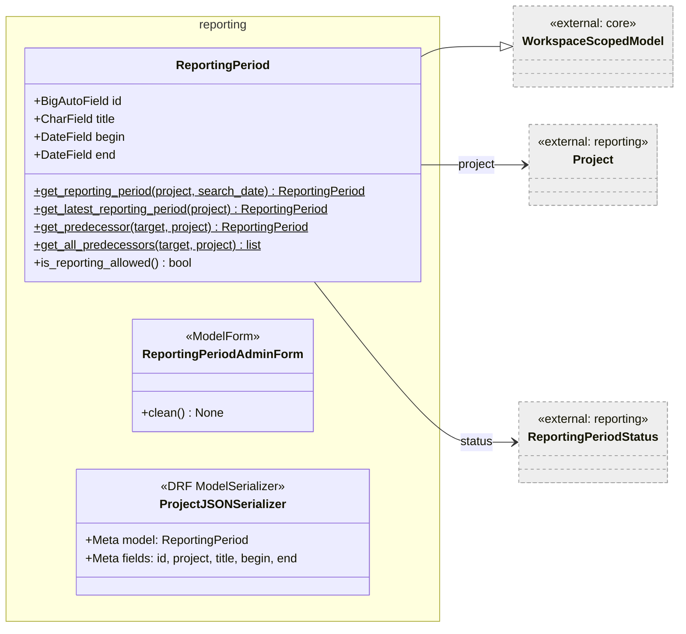
```mermaid
classDiagram
    direction LR

    namespace reporting {
        class ReportingPeriod {
            +BigAutoField id
            +CharField title
            +DateField begin
            +DateField end
            +get_reporting_period(project, search_date)$ ReportingPeriod
            +get_latest_reporting_period(project)$ ReportingPeriod
            +get_predecessor(target, project)$ ReportingPeriod
            +get_all_predecessors(target, project)$ list
            +is_reporting_allowed() bool
        }
        class ReportingPeriodAdminForm {
            <<ModelForm>>
            +clean() None
        }
        class ProjectJSONSerializer {
            <<DRF ModelSerializer>>
            +Meta model: ReportingPeriod
            +Meta fields: id, project, title, begin, end
        }
    }

    class WorkspaceScopedModel:::external {
        <<external: core>>
    }
    class Project:::external {
        <<external: reporting>>
    }
    class ReportingPeriodStatus:::external {
        <<external: reporting>>
    }

    ReportingPeriod --|> WorkspaceScopedModel
    ReportingPeriod --> Project : project
    ReportingPeriod --> ReportingPeriodStatus : status

    classDef external fill:#eee,stroke:#999,stroke-dasharray:4 4;
```

*Figure 17: ReportingPeriod and its relationships.*

`ReportingPeriod` provides a calendar-bounded window within a project. Its `begin`
and `end` dates are enforced to be non-overlapping and contiguous with sibling
periods via `ReportingPeriodAdminForm.clean()`. All static navigation methods
raise `ReportingPeriodNotFound` when the requested period cannot be found.

The `status` FK points to a `ReportingPeriodStatus`. When `status.is_done` is
`True`, the period is closed: `is_reporting_allowed()` returns `False` and
`Work.confirmed()` returns `True` for all work in this period, blocking further
edits.

#### ReportingPeriod Methods

##### `get_reporting_period(project, search_date) → ReportingPeriod` (static)

Iterates all periods for a project and returns the one whose `begin <= search_date
<= end`. Raises `ReportingPeriodNotFound` when no such period exists.

---

##### `get_latest_reporting_period(project) → ReportingPeriod` (static)

Returns the period with the latest `end` date for a project. Uses a linear scan
tracking `latest.end <= candidate.begin` as the ordering criterion. Raises
`ReportingPeriodNotFound` when no periods exist.

---

##### `get_predecessor(target_reporting_period, project) → ReportingPeriod` (static)

Returns the period whose `end` is immediately before `target.begin`. Uses a linear
scan keeping the latest `end <= target.begin` candidate. Raises
`ReportingPeriodNotFound` when no predecessor exists.

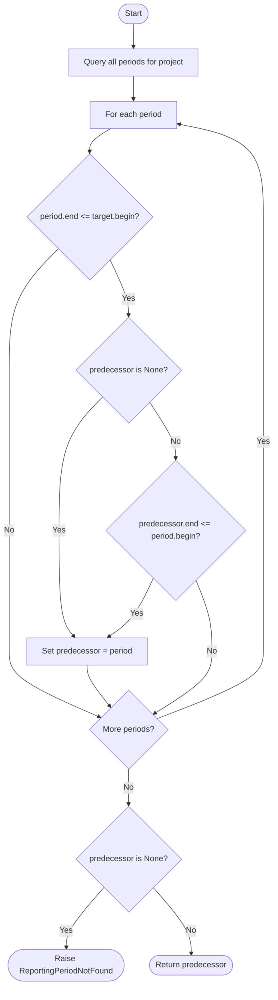
```mermaid
flowchart TD
    A([Start]) --> B[Query all periods for project]
    B --> C[For each period]
    C --> D{period.end <= target.begin?}
    D -->|No| E{More periods?}
    D -->|Yes| F{predecessor is None?}
    F -->|Yes| G[Set predecessor = period]
    F -->|No| H{predecessor.end <= period.begin?}
    H -->|Yes| G
    H -->|No| E
    G --> E
    E -->|Yes| C
    E -->|No| I{predecessor is None?}
    I -->|Yes| J([Raise ReportingPeriodNotFound])
    I -->|No| K([Return predecessor])
```

*Figure 18: Flow of `ReportingPeriod.get_predecessor`.*

---

##### `get_all_predecessors(target_reporting_period, project) → list` (static)

Returns all periods whose `end <= target.begin`. No ordering guarantee is given.
Returns an empty list (not an exception) when no predecessors exist.

---

##### `is_reporting_allowed() → bool`

Returns `True` when the period's status exists and `is_done` is `False`. Returns
`False` otherwise, including when `status` is `None`.

---

#### `ReportingPeriodAdminForm.clean()`

Enforces three rules on the submitted form data:

1. The new period must not overlap any existing period for the same project.
2. The `begin` date must be strictly before the `end` date.
3. When more than one period exists for the project, the new period must be
   directly adjacent to at least one existing period (i.e. a direct predecessor
   or direct successor by one calendar day).

Violations raise `ValidationError` with a descriptive message.

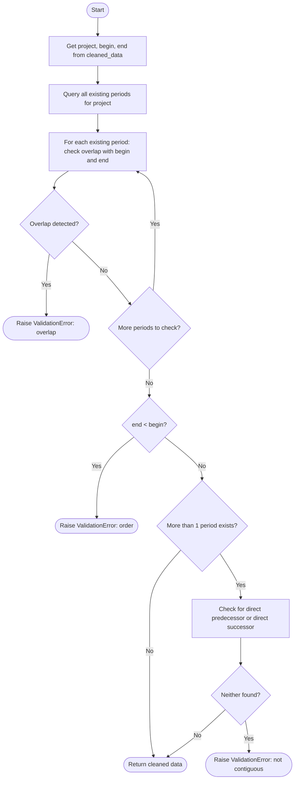
```mermaid
flowchart TD
    A([Start]) --> B[Get project, begin, end from cleaned_data]
    B --> C[Query all existing periods for project]
    C --> D[For each existing period: check overlap with begin and end]
    D --> E{Overlap detected?}
    E -->|Yes| F([Raise ValidationError: overlap])
    E -->|No| G{More periods to check?}
    G -->|Yes| D
    G -->|No| H{end < begin?}
    H -->|Yes| I([Raise ValidationError: order])
    H -->|No| J{More than 1 period exists?}
    J -->|No| K([Return cleaned data])
    J -->|Yes| L[Check for direct predecessor or direct successor]
    L --> M{Neither found?}
    M -->|Yes| N([Raise ValidationError: not contiguous])
    M -->|No| K
```

*Figure 19: Flow of `ReportingPeriodAdminForm.clean`.*

---

### ReportingPeriodStatus

*Figure 20 — ReportingPeriodStatus class diagram*

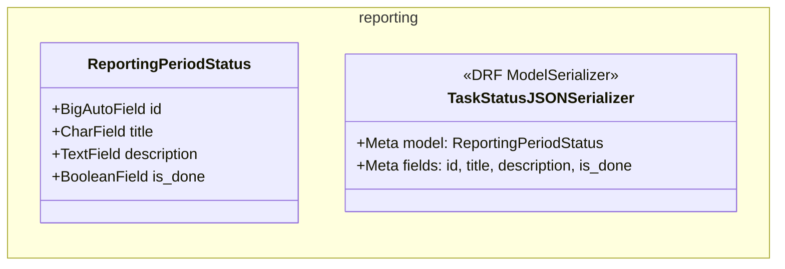
```mermaid
classDiagram
    direction LR

    namespace reporting {
        class ReportingPeriodStatus {
            +BigAutoField id
            +CharField title
            +TextField description
            +BooleanField is_done
        }
        class TaskStatusJSONSerializer {
            <<DRF ModelSerializer>>
            +Meta model: ReportingPeriodStatus
            +Meta fields: id, title, description, is_done
        }
    }
```

*Figure 20: ReportingPeriodStatus and its serializer. Note that the serializer class is named
`TaskStatusJSONSerializer` in the source file — this appears to be a copy-paste artifact.*

`ReportingPeriodStatus` is a lifecycle lookup table for reporting periods. The
`is_done` flag is the primary control signal: it drives `Work.confirmed()`,
`ReportingPeriod.is_reporting_allowed()`, and the confirmed/unconfirmed cost
filtering in `Task.effective_costs()`.

---

### GenericProjectLink

*Figure 21 — GenericProjectLink class diagram*

```mermaid
classDiagram
    direction LR

    namespace reporting {
        class GenericProjectLink {
            +BigAutoField id
            +PositiveIntegerField object_id
            +DateTimeField date_of_creation
            +GenericForeignKey generic_crm_object
        }
    }

    class WorkspaceScopedModel:::external {
        <<external: core>>
    }
    class Project:::external {
        <<external: reporting>>
    }
    class ProjectLinkType:::external {
        <<external: reporting>>
    }
    class ContentType:::external {
        <<external: django.contenttypes>>
    }
    class User:::external {
        <<external: auth>>
    }

    GenericProjectLink --|> WorkspaceScopedModel
    GenericProjectLink --> Project : project
    GenericProjectLink --> ProjectLinkType : project_link_type
    GenericProjectLink --> ContentType : content_type
    GenericProjectLink --> User : last_modified_by

    classDef external fill:#eee,stroke:#999,stroke-dasharray:4 4;
```

*Figure 21: GenericProjectLink and its relationships.*

`GenericProjectLink` attaches a polymorphic reference from a `Project` to any
other CRM object using Django's content-type framework (`content_type` +
`object_id` generic foreign key). The `project_link_type` FK classifies the
relationship. The link is workspace-scoped and records who created it and when.
There are no non-trivial methods on this class.

---

### ProjectLinkType

*Figure 22 — ProjectLinkType class diagram*

```mermaid
classDiagram
    direction LR

    namespace reporting {
        class ProjectLinkType {
            +BigAutoField id
            +CharField title
            +TextField description
        }
    }
```

*Figure 22: ProjectLinkType.*

`ProjectLinkType` is a simple lookup table that classifies `GenericProjectLink`
associations. It does not extend `WorkspaceScopedModel` and is therefore not
tenant-scoped.

---

### GenericTaskLink

*Figure 23 — GenericTaskLink class diagram*

```mermaid
classDiagram
    direction LR

    namespace reporting {
        class GenericTaskLink {
            +BigAutoField id
            +PositiveIntegerField object_id
            +DateTimeField date_of_creation
            +GenericForeignKey generic_crm_object
        }
    }

    class WorkspaceScopedModel:::external {
        <<external: core>>
    }
    class Task:::external {
        <<external: reporting>>
    }
    class TaskLinkType:::external {
        <<external: reporting>>
    }
    class ContentType:::external {
        <<external: django.contenttypes>>
    }
    class User:::external {
        <<external: auth>>
    }

    GenericTaskLink --|> WorkspaceScopedModel
    GenericTaskLink --> Task : task
    GenericTaskLink --> TaskLinkType : task_link_type
    GenericTaskLink --> ContentType : content_type
    GenericTaskLink --> User : last_modified_by

    classDef external fill:#eee,stroke:#999,stroke-dasharray:4 4;
```

*Figure 23: GenericTaskLink and its relationships.*

`GenericTaskLink` is the task-level analogue of `GenericProjectLink`. It attaches
a polymorphic reference from a `Task` to any other CRM object via the content-type
framework. There are no non-trivial methods.

---

### TaskLinkType

*Figure 24 — TaskLinkType class diagram*

```mermaid
classDiagram
    direction LR

    namespace reporting {
        class TaskLinkType {
            +BigAutoField id
            +CharField title
            +TextField description
        }
    }
```

*Figure 24: TaskLinkType.*

`TaskLinkType` is a lookup table classifying `GenericTaskLink` associations. Like
`ProjectLinkType`, it does not extend `WorkspaceScopedModel`.

---

## Persistent Storage

All concrete classes in this document write to the PostgreSQL database through
Django's ORM. The database tables and their names are:

| Class | DB Table |
|---|---|
| `Project` | `crm_project` |
| `ProjectStatus` | `crm_projectstatus` |
| `Task` | `crm_task` |
| `TaskStatus` | `crm_taskstatus` |
| `Work` | `crm_work` |
| `ReportingPeriod` | `crm_reportingperiod` |
| `ReportingPeriodStatus` | `crm_reportingperiodstatus` |
| `GenericProjectLink` | `crm_genericprojectlink` |
| `GenericTaskLink` | `crm_generictasklink` |
| `ProjectLinkType` | `crm_projectlinktype` |
| `TaskLinkType` | `crm_tasklinktype` |

Schema migrations are managed by the Django migrations in
`koalixcrm/reporting/migrations/`. The initial schema is created by
`0001_initial.py` and workspace scoping is added by `0002_workspace_scoping.py`.

---

## In-Memory State

`Task` holds one piece of transient in-memory state: `previous_status`. This
attribute is set in `__init__` from the current `status` FK value and is compared
in `save()` to detect status transitions. It is not persisted and does not survive
across object re-loads from the database. In a horizontally scaled deployment, each
worker process independently holds its own `Task` instance; there is no cross-process
sharing of this in-memory state.

---

## Access to External Interfaces

All database access in this file group is performed through the Django ORM (blocking
reads and writes against a PostgreSQL database).

| Interface | Type of Call | Notes |
|---|---|---|
| PostgreSQL (via Django ORM) | Blocking, Read/Write | All model `save()`, `delete()`, and `objects.filter()` calls; connection pooling is handled at the Django level |

---

## Security

`Work.save()` and `Work.delete()` enforce immutability of confirmed work records at
the model layer. The guard relies on `reporting_period.status.is_done`, which is a
database field. If the status record is modified concurrently, the guard can be
bypassed; there is no database-level constraint enforcing this invariant.

### Assets

| Asset | Description | Security Measure | Assessment of Criticality |
|---|---|---|---|
| Database connection | ORM access to the PostgreSQL instance | Connection string is read from Django settings, which should be set from environment variables | Uncritical when settings are managed correctly |

---

## Design Patterns Used

**Aggregate root pattern.** `Project` acts as the aggregate root for the
project/task/work hierarchy. All cross-cutting computations (cost, effort,
duration) flow downward through the aggregate: `Project` → `Task` → `Work` /
`Estimation`. External callers interact with the aggregate through `Project`
rather than directly querying child models.

**Template Method / delegation.** `Project.get_reporting_period()` is a thin
delegation wrapper over the static `ReportingPeriod.get_reporting_period()`. This
keeps the navigation logic centralised in `ReportingPeriod` while allowing
`Project` to provide a convenient instance-level entry point.

**Guard clause in `save()`/`delete()`.** `Work` uses guard clauses at the top of
`save()` and `delete()` to enforce the immutability invariant, raising an exception
before touching the database. This prevents mutation without requiring callers to
check status explicitly.

**Status-flag–driven lifecycle.** Rather than a state machine, each entity uses a
boolean `is_done` flag on an associated status lookup record. The flag drives
gating behaviour in `is_reporting_allowed()`, `confirmed()`, and `task_end()`.

---

## External Dependencies

| Requirement | Version/Details | Notes |
|---|---|---|
| Django | Tested with the project's pinned version; ≥ 3.2 required for `BigAutoField` default | From `requirements.txt` in the project root |
| Django REST Framework | Tested with the project's pinned version | Used for `ModelSerializer` in `ReportingPeriod` |
| `koalixcrm.core.models.workspace_scoped.WorkspaceScopedModel` | Internal dependency | Base class providing tenant scoping |
| `koalixcrm.core.exceptions` | Internal dependency | `ReportingPeriodNotFound`, `ReportingPeriodDoneDeleteNotPossible` |
| `koalixcrm.global_support_functions` | Internal dependency | `get_today_date()` used in `Task.save()`, `limit_string_length()` used in `Work.get_short_description()` |

---

## Appendix

### References

- Component architecture of the `reporting` app: [QQ_SD_ComponentArchitecture.md](../../QQ_SD_ComponentArchitecture.md)
- Resource, Agreement and Estimation models: [QQ_LL_Doc_Reporting_ResourceAgreementModels.md](QQ_LL_Doc_Reporting_ResourceAgreementModels.md)
- Django ORM documentation: <https://docs.djangoproject.com/en/stable/topics/db/models/>
- Django content types framework: <https://docs.djangoproject.com/en/stable/ref/contrib/contenttypes/>

### List of Illustrations

| Figure | Title |
|---|---|
| Figure 1 | Project class diagram |
| Figure 2 | Flow of `Project.effective_costs` |
| Figure 3 | Flow of `Project.planned_costs_in_buckets` |
| Figure 4 | Flow of `Project.effective_start` |
| Figure 5 | Flow of `Project.effective_end` |
| Figure 6 | Flow of `Project.is_reporting_allowed` |
| Figure 7 | ProjectStatus class diagram |
| Figure 8 | Task class diagram |
| Figure 9 | Flow of `Task.save` |
| Figure 10 | Flow of `Task.planned_effort` |
| Figure 11 | Flow of `Task.planned_costs_in_buckets` |
| Figure 12 | Flow of `Task.effective_end` |
| Figure 13 | Flow of `Task.effective_costs` |
| Figure 14 | TaskStatus class diagram |
| Figure 15 | Work class diagram |
| Figure 16 | Flow of `Work.effort_seconds` |
| Figure 17 | ReportingPeriod class diagram |
| Figure 18 | Flow of `ReportingPeriod.get_predecessor` |
| Figure 19 | Flow of `ReportingPeriodAdminForm.clean` |
| Figure 20 | ReportingPeriodStatus class diagram |
| Figure 21 | GenericProjectLink class diagram |
| Figure 22 | ProjectLinkType class diagram |
| Figure 23 | GenericTaskLink class diagram |
| Figure 24 | TaskLinkType class diagram |
