# Low-Level Documentation — Reporting: Resource, Agreement, Estimation and HumanResource Models

## Introduction

### Scope

This document covers the following source files in
`koalixcrm/reporting/models/`:

- `resource.py` — `Resource`
- `human_resource.py` — `HumanResource`
- `resource_manager.py` — `ResourceManager`
- `resource_type.py` — `ResourceType`
- `resource_price.py` — `ResourcePrice`
- `agreement.py` — `Agreement`
- `agreement_status.py` — `AgreementStatus`, `AgreementStatusJSONSerializer`
- `agreement_type.py` — `AgreementType`
- `estimation.py` — `Estimation`, `EstimationAdminForm`,
  `EstimationStatusJSONSerializer`
- `estimation_status.py` — `EstimationStatus`, `EstimationStatusJSONSerializer`

Together these files model the billable-resource hierarchy, rate agreements, and
remaining-effort estimations that underpin cost calculations in the `reporting`
app. They are documented for the software development engineer who needs to use,
modify, or extend them.

The project, task, work and reporting-period models are covered separately in
[QQ_LL_Doc_Reporting_ProjectTaskModels.md](QQ_LL_Doc_Reporting_ProjectTaskModels.md).

The broader internal structure of the `reporting` app is described in
[QQ_SD_ComponentArchitecture.md](../../QQ_SD_ComponentArchitecture.md).

### Target Audience

Software development engineers who implement features against, modify, or extend
the resource and cost domain models in the `reporting` app.

### Glossary

| Term/Acronym | Full Form | Description |
|---|---|---|
| CRM | Customer Relationship Management | The umbrella application (`koalixcrm`) this module belongs to. |
| ORM | Object-Relational Mapper | Django's abstraction layer over the database. |
| FK | Foreign Key | A database relationship field pointing to another table. |
| DRF | Django REST Framework | The library used to build the REST API layer. |
| MTI | Multi-Table Inheritance | Django pattern where a child model extends a parent model using a shared primary key and a one-to-one FK. |
| WSM | WorkspaceScopedModel | The abstract base class adding a `workspace` FK and a workspace-aware ORM manager to every tenant-scoped model. |
| is_agreed | — | Boolean flag on `AgreementStatus`; `True` activates the agreement for cost matching in `Task.effective_costs()`. |
| is_obsolete | — | Boolean flag on `EstimationStatus`; marks an estimation as no longer valid. |
| RP | Reporting Period | A calendar-bounded window within a project used to gate work entry and cost confirmation. |

---

## Detailed Components

### Resource

*Figure 1 — Resource class diagram*

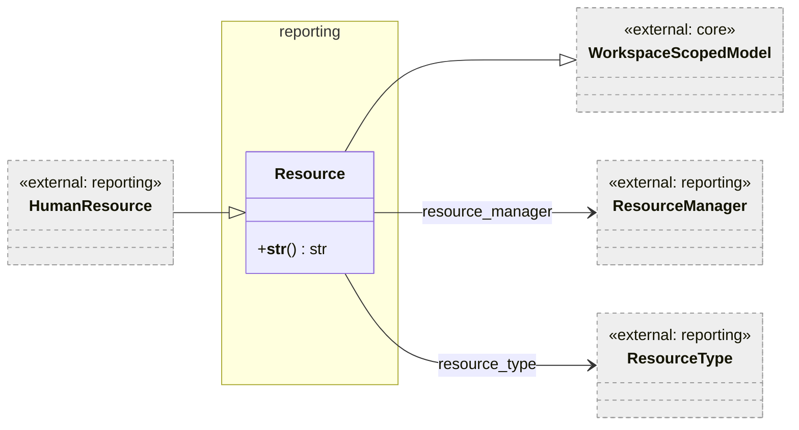

*Figure 1: Resource base class and its relationships. `HumanResource` extends `Resource`
via Django MTI.*

`Resource` is the base model for any billable resource that can be assigned to a
task. It carries only two FK fields: `resource_manager` (who owns this resource
organisationally) and `resource_type` (a classification label). Both FKs are
optional. `Resource` uses Django's `WorkspaceScopedModel` and is stored in
`crm_resource`.

The `__str__` method performs a late import of `HumanResource` and attempts to
retrieve the corresponding `HumanResource` row by primary key. If found, it
delegates the string representation to the `HumanResource`. This approach is
necessary because `Resource` does not know at definition time whether a subtype
row exists; the late import avoids a circular import cycle.

There is no primary key field defined on `Resource` itself; it inherits Django's
default auto-generated `id` field.

#### Resource Methods

##### `__str__() → str`

Performs a late-import lookup of `HumanResource` by `self.id`. If a
`HumanResource` row exists, delegates to `human_resource.__str__()`. Returns the
string `"Resource"` if no `HumanResource` row is found.

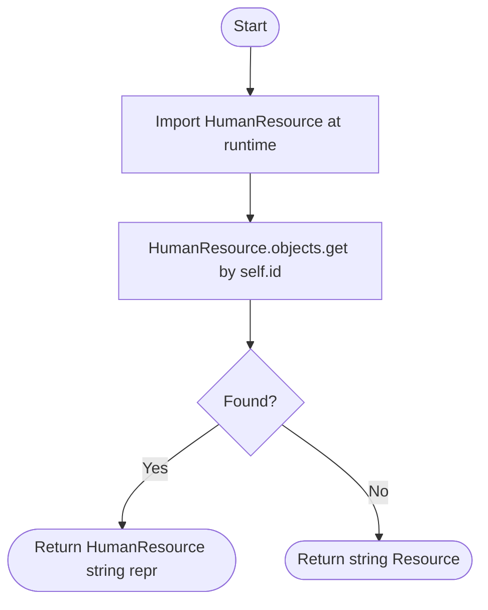

*Figure 2: Flow of `Resource.__str__`.*

---

### HumanResource

*Figure 3 — HumanResource class diagram*

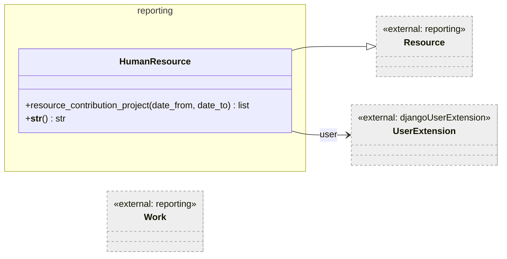

*Figure 3: HumanResource as a specialisation of Resource.*

`HumanResource` is a Django MTI subtype of `Resource`. It adds a single mandatory
FK to `UserExtension` from the `djangoUserExtension` app, binding the resource to
an authenticated system user. Because `HumanResource` extends `Resource` via MTI,
a `HumanResource` row in `crm_humanresource` always has a corresponding row in
`crm_resource` with the same primary key.

The `__str__` method delegates to `UserExtension.__str__()`, so the display name
of a human resource is determined by the user extension model.

`HumanResource` is the model that is stored on `Work.human_resource` and on
`Agreement.resource` (the latter via the `Resource` base FK). Cost calculations
in `Task.effective_costs()` look up `ResourcePrice` records filtered by the
`HumanResource` (as a `Resource`) to obtain the default billing rate.

#### HumanResource Methods

##### `resource_contribution_project(date_from: datetime.date, date_to: datetime.date) → list`

Returns a deduplicated list of `Project` objects for which this human resource
recorded work within the given date range.

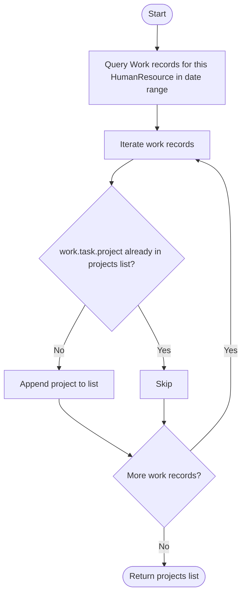

*Figure 4: Flow of `HumanResource.resource_contribution_project`.*

---

### ResourceManager

*Figure 5 — ResourceManager class diagram*

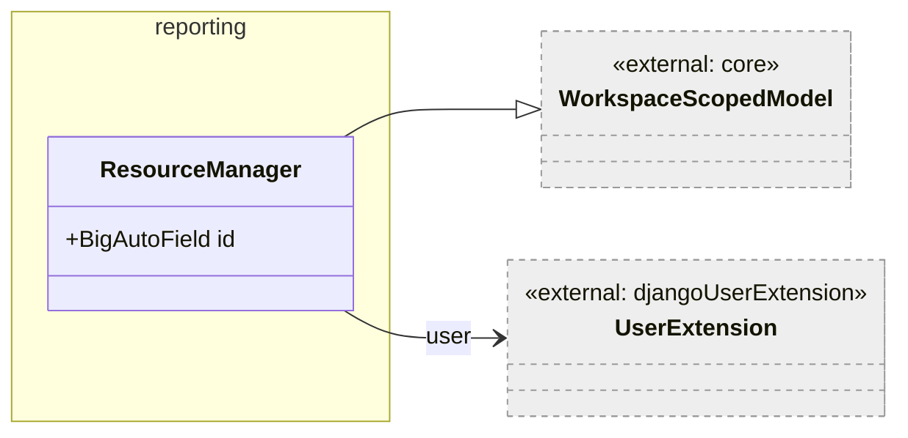

*Figure 5: ResourceManager.*

`ResourceManager` is a lookup model representing the organisational owner of one
or more `Resource` entries. It is workspace-scoped and links to a `UserExtension`.
There are no business-logic methods on this class beyond the default ORM
behaviour; no `__str__` method is defined, so the default Django representation
is used.

---

### ResourceType

*Figure 6 — ResourceType class diagram*

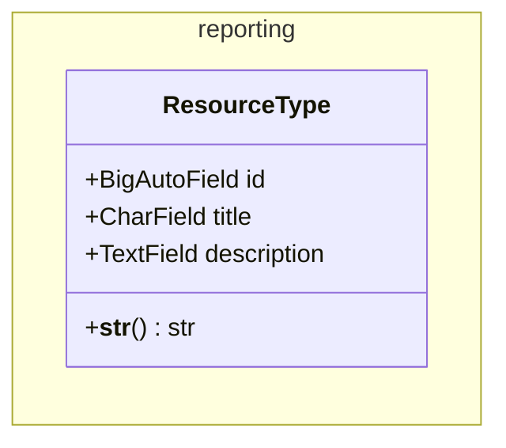

*Figure 6: ResourceType lookup table.*

`ResourceType` is a plain lookup table that classifies resources. It does not
extend `WorkspaceScopedModel` and is therefore not tenant-scoped — type
definitions are shared across all workspaces. There are no non-trivial methods.

---

### ResourcePrice

*Figure 7 — ResourcePrice class diagram*

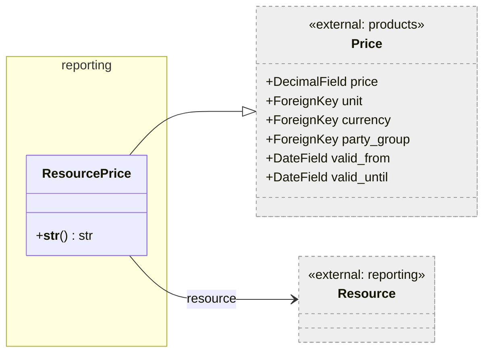

*Figure 7: ResourcePrice as a specialisation of Price.*

`ResourcePrice` extends `koalixcrm.products.models.price.Price` via Django MTI,
adding a mandatory `resource` FK that binds the price record to a specific
`Resource`. All pricing metadata (the numeric `price`, the `unit`, the
`currency`, optional `party_group`, and validity dates) is inherited from `Price`.

`ResourcePrice` is used in two contexts:

- In `Task.effective_costs()`, as the fallback billing rate when no `Agreement`
  covers a `Work` record.
- In `Task.planned_costs()` and `Estimation.calculated_costs()`, to price the
  estimated remaining effort.

The inherited `Price` fields include validity-date support (`valid_from`,
`valid_until`) and party-group scoping, but the reporting cost calculation code
always takes the first `ResourcePrice` matching the resource (ordered by price),
without applying the full pricing-criteria logic defined in `Price`.

#### ResourcePrice Methods

##### `__str__() → str`

Returns `str(self.price) + " " + str(self.currency.short_name)`.

---

### Agreement

*Figure 8 — Agreement class diagram*

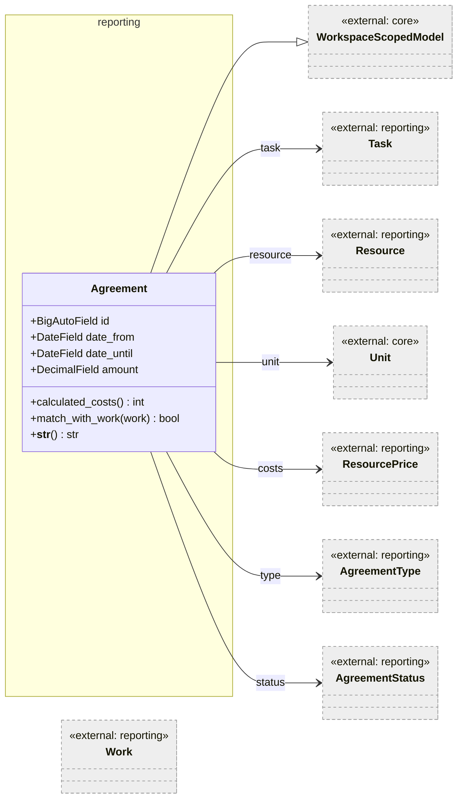

*Figure 8: Agreement and its relationships.*

`Agreement` models a rate contract between a project stakeholder (steerin-committee
or customer) and the project manager. It binds a specific `Resource` to a `Task`
for a date range and specifies a capped `amount` (maximum hours) at a `ResourcePrice`
rate. The `AgreementStatus.is_agreed` flag controls whether the agreement is active;
only active agreements are matched in `Task.effective_costs()`.

The `amount` field caps the hours covered by the agreement rate. Once this budget
is exhausted, additional work by the same resource falls back to the resource's
default `ResourcePrice`. This cap is enforced in `Task.effective_costs()` through
the `agreement_remaining_amount` counter.

#### Agreement Methods

##### `calculated_costs() → int`

Currently returns `0` unconditionally. This method appears to be a placeholder;
the actual cost calculation for agreements is performed in `Task.effective_costs()`
by multiplying `work.effort_hours()` by `agreement.costs.price`.

---

##### `match_with_work(work: Work) → bool`

Checks whether a given `Work` record is covered by this agreement. Returns `True`
only when all three conditions hold:

1. The agreement's status is active (`self.status.is_agreed` is `True`).
2. The work date falls within the agreement's date range (`date_from <= work.date
   <= date_until`).
3. The agreement's resource ID matches the work's human resource ID
   (`self.resource.id == work.human_resource.id`).

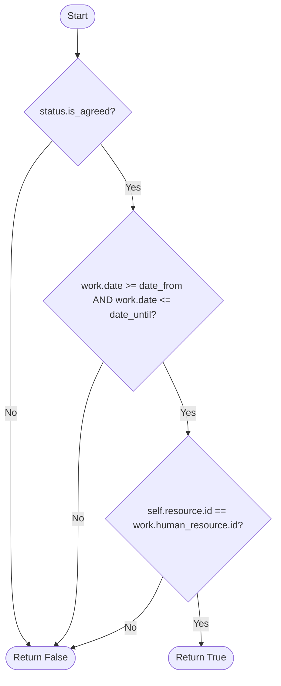

*Figure 9: Flow of `Agreement.match_with_work`.*

---

### AgreementStatus

*Figure 10 — AgreementStatus class diagram*

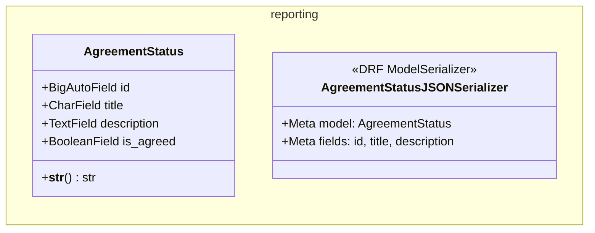

*Figure 10: AgreementStatus and its serializer.*

`AgreementStatus` is a lifecycle lookup table for agreements. The `is_agreed` flag
is the primary control signal: only agreements whose status has `is_agreed=True`
are matched against work records in `Task.effective_costs()`. The serializer omits
the `is_agreed` field from its output.

---

### AgreementType

*Figure 11 — AgreementType class diagram*

*Figure 11: AgreementType lookup table.*

`AgreementType` is a plain lookup table that classifies agreements. Like
`ResourceType`, it does not extend `WorkspaceScopedModel` and is shared across
all workspaces. There are no business-logic methods.

---

### Estimation

*Figure 12 — Estimation class diagram*

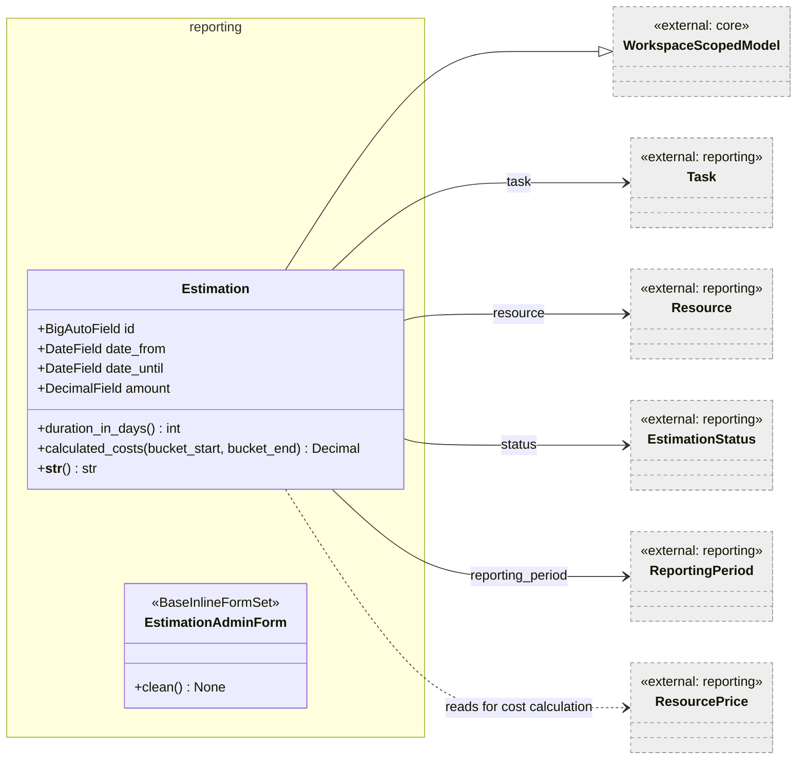

*Figure 12: Estimation and its relationships.*

`Estimation` captures a project team member's estimate of the remaining effort
required to complete a `Task`, expressed in hours (`amount`) and covering a date
range (`date_from` to `date_until`). The estimate is always anchored to a specific
`ReportingPeriod`: it is the estimate that was made during that period for the
remaining work still to come. Only one estimation per (task, reporting period) pair
is permitted.

The estimate is considered forward-looking: it captures only what remains to be
done from the reporting-period perspective, not what has already been worked. The
`Task.planned_effort()` method adds historical effective effort from predecessor
periods on top of the estimation's `amount` to compute the total planned effort.

The `calculated_costs()` method supports pro-rated cost allocation within date
buckets, which is used by `Task.planned_costs_in_buckets()` to distribute
planned costs across time.

#### Estimation Methods

##### `duration_in_days() → int`

Returns the number of days between `date_from` and `date_until` as a plain integer
(`timedelta.days`). This is a straightforward arithmetic operation.

---

##### `calculated_costs(bucket_start, bucket_end) → Decimal`

Returns the estimated cost attributable to the intersection of the estimation's
date range and the supplied bucket. When the estimation lies entirely outside the
bucket, returns zero. When the estimation partially overlaps the bucket, the cost
is prorated by the fraction `selected_duration / total_duration`.

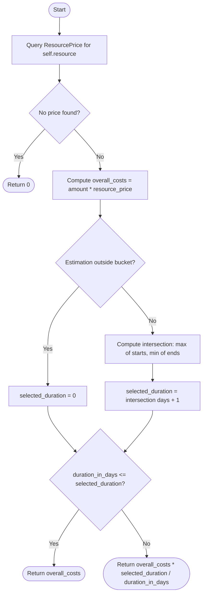

*Figure 13: Flow of `Estimation.calculated_costs`.*

The `+ 1` day added to `selected_duration` compensates for the fact that adjacent
reporting-period buckets share a boundary day which would otherwise be counted
twice across buckets. Only the first price found for the resource is used.

---

#### `EstimationAdminForm.clean()`

This inline form-set validator enforces the following rules when an estimation is
submitted through the Django Admin:

1. There may only be one estimation per (task, reporting period) pair.
2. If a predecessor reporting period exists, it must already be in status `done`
   before the estimation can be attached to the current period.
3. The selected reporting period must not itself be in status `done`.
4. `date_from` must be strictly before `date_until`.

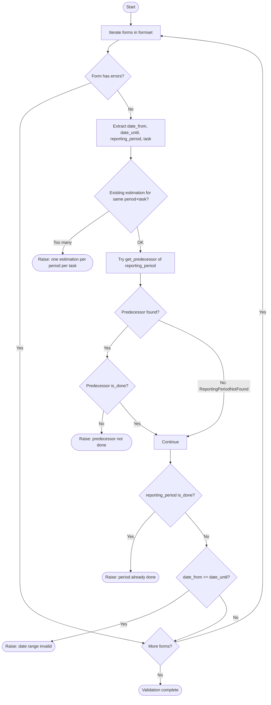

*Figure 14: Flow of `EstimationAdminForm.clean`.*

---

### EstimationStatus

*Figure 15 — EstimationStatus class diagram*

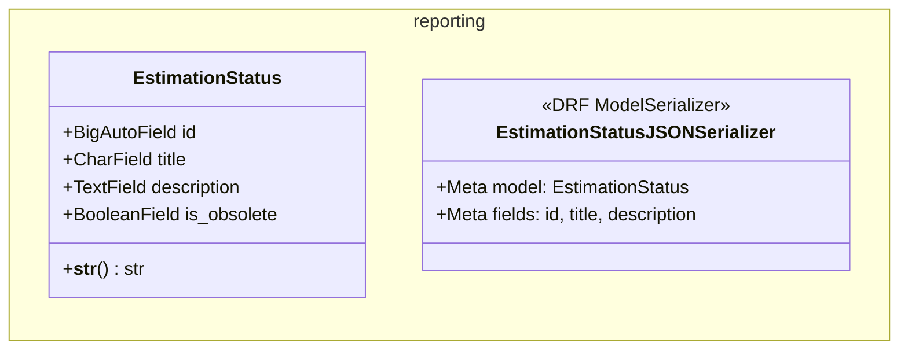

*Figure 15: EstimationStatus and its serializer.*

`EstimationStatus` is a lifecycle lookup table for estimations. The `is_obsolete`
flag marks an estimation as superseded. Unlike the `is_done` flags on other status
models, `is_obsolete` does not currently drive any behaviour in the cost or effort
calculation methods; it is available for display and filtering purposes. The
serializer omits the `is_obsolete` field from its output.

---

## Persistent Storage

All concrete classes in this document write to the PostgreSQL database through
Django's ORM. The database tables and their names are:

| Class | DB Table |
|---|---|
| `Resource` | `crm_resource` |
| `HumanResource` | `crm_humanresource` |
| `ResourceManager` | `crm_resourcemanager` |
| `ResourceType` | `crm_resourcetype` |
| `ResourcePrice` | `crm_resourceprice` (extends `crm_price` via MTI) |
| `Agreement` | `crm_agreement` |
| `AgreementStatus` | `crm_agreementstatus` |
| `AgreementType` | `crm_agreementtype` |
| `Estimation` | `crm_estimation` |
| `EstimationStatus` | `crm_estimationstatus` |

`ResourceType`, `AgreementStatus`, `AgreementType`, and `EstimationStatus` are
not workspace-scoped and their rows are shared across all tenants.

---

## In-Memory State

None of the classes in this file group maintain in-memory state that persists
between requests or invocations. All state is loaded from the database on demand
through the ORM.

---

## Access to External Interfaces

All database access in this file group is performed through the Django ORM
(blocking reads against PostgreSQL).

| Interface | Type of Call | Notes |
|---|---|---|
| PostgreSQL (via Django ORM) | Blocking, Read/Write | ORM `filter()`, `get()`, `save()` calls; connection pooling is handled at the Django level |

---

## Security

No sensitive personal data or credentials are stored directly in the classes
documented here. `HumanResource` links to `UserExtension` via FK; the personal
data of the user (name, email) is stored in `UserExtension` and `auth.User`, not
in `HumanResource`.

### Assets

| Asset | Description | Security Measure | Assessment of Criticality |
|---|---|---|---|
| Database connection | ORM access to the PostgreSQL instance | Connection string is read from Django settings, sourced from environment variables | Uncritical when settings are managed correctly |

---

## Design Patterns Used

**Multi-Table Inheritance (MTI).** Both `HumanResource` and `ResourcePrice` use
Django MTI: `HumanResource` extends `Resource`, and `ResourcePrice` extends
`Price` from the `products` app. MTI allows the base table to be joined with the
child table via a shared primary key, enabling polymorphic FK references
(`Agreement.resource` points to `Resource` and can resolve a `HumanResource`).

**Lazy import to break circular dependency.** `Resource.__str__` performs a late
import of `HumanResource` inside the method body (`from
koalixcrm.reporting.models.human_resource import HumanResource`) to avoid a
circular import cycle between `resource.py` and `human_resource.py`. This is a
common Django pattern when two models in the same app reference each other.

**Agreement-first cost allocation.** In `Task.effective_costs()`, work is matched
against active agreements before falling back to default resource prices. This
implements a priority-based billing strategy: negotiated agreement rates take
precedence over list prices. The `Agreement.match_with_work()` method encapsulates
the matching logic, keeping `Task.effective_costs()` free of agreement-specific
conditions.

**Pro-rated bucket cost allocation.** `Estimation.calculated_costs()` implements
a date-range intersection algorithm to distribute a total estimated cost across
reporting-period buckets proportionally by overlap. This supports multi-period
cost reporting without requiring per-period estimations.

---

## External Dependencies

| Requirement | Version/Details | Notes |
|---|---|---|
| Django | Tested with the project's pinned version; ≥ 3.2 required for `BigAutoField` default | From `requirements.txt` in the project root |
| Django REST Framework | Tested with the project's pinned version | Used for `ModelSerializer` in `AgreementStatus` and `EstimationStatus` |
| `koalixcrm.core.models.workspace_scoped.WorkspaceScopedModel` | Internal dependency | Base class providing tenant scoping for `Resource`, `ResourceManager`, `Agreement`, `Estimation` |
| `koalixcrm.core.models.Unit` | Internal dependency | FK on `Agreement.unit` |
| `koalixcrm.core.exceptions.ReportingPeriodNotFound` | Internal dependency | Caught in `EstimationAdminForm.clean()` |
| `koalixcrm.djangoUserExtension.models.user_extension.UserExtension` | Internal dependency | FK on `HumanResource.user` and `ResourceManager.user` |
| `koalixcrm.products.models.price.Price` | Internal dependency | Base class for `ResourcePrice` |

---

## Appendix

### References

- Component architecture of the `reporting` app: [QQ_SD_ComponentArchitecture.md](../../QQ_SD_ComponentArchitecture.md)
- Project, Task, Work and ReportingPeriod models: [QQ_LL_Doc_Reporting_ProjectTaskModels.md](QQ_LL_Doc_Reporting_ProjectTaskModels.md)
- Django ORM multi-table inheritance documentation: <https://docs.djangoproject.com/en/stable/topics/db/models/#multi-table-inheritance>
- Django REST Framework serializers: <https://www.django-rest-framework.org/api-guide/serializers/>

### List of Illustrations

| Figure | Title |
|---|---|
| Figure 1 | Resource class diagram |
| Figure 2 | Flow of `Resource.__str__` |
| Figure 3 | HumanResource class diagram |
| Figure 4 | Flow of `HumanResource.resource_contribution_project` |
| Figure 5 | ResourceManager class diagram |
| Figure 6 | ResourceType class diagram |
| Figure 7 | ResourcePrice class diagram |
| Figure 8 | Agreement class diagram |
| Figure 9 | Flow of `Agreement.match_with_work` |
| Figure 10 | AgreementStatus class diagram |
| Figure 11 | AgreementType class diagram |
| Figure 12 | Estimation class diagram |
| Figure 13 | Flow of `Estimation.calculated_costs` |
| Figure 14 | Flow of `EstimationAdminForm.clean` |
| Figure 15 | EstimationStatus class diagram |
