# Low-Level Documentation: Reporting Services, Signals, and Admin

## Introduction

### Scope

This document covers the implementation of all classes and functions in the following source files:

- `koalixcrm/reporting/services/chart_storage.py` — `build_project_cost_overview_svg_bytes`, `upload_project_cost_overview_svg`, `_bucket`
- `koalixcrm/reporting/signals/__init__.py` — signal handler registrations
- `koalixcrm/reporting/admin/__init__.py` — admin registration and `ExtendedContractAdmin`
- `koalixcrm/reporting/admin/project_admin.py` — `ProjectAdminView`, `ProjectInlineAdminView`
- `koalixcrm/reporting/admin/task_admin.py` — `TaskAdminView`, `TaskInlineAdminView`
- `koalixcrm/reporting/admin/work_admin.py` — `WorkAdminView`, `WorkInlineAdminView`
- `koalixcrm/reporting/admin/reporting_period_admin.py` — `ReportingPeriodAdmin`, `ReportingPeriodInlineAdminView`
- `koalixcrm/reporting/admin/human_resource_admin.py` — `HumanResourceAdminView`
- `koalixcrm/reporting/admin/agreement_admin.py` — `AgreementInlineAdminView`
- `koalixcrm/reporting/admin/estimation_admin.py` — `EstimationInlineAdminView`
- `koalixcrm/reporting/admin/generic_project_link_admin.py` — `GenericLinkInlineAdminView`, `InlineGenericProjectLinkAdmin`
- `koalixcrm/reporting/admin/generic_task_link_admin.py` — `InlineGenericTaskLink`
- Reference-data admin classes: `AgreementStatusAdminView`, `AgreementTypeAdminView`, `EstimationStatusAdminView`, `OptionProjectLinkType`, `OptionProjectStatus`, `OptionReportingPeriodStatus`, `ResourceManagerAdminView`, `ResourcePriceInlineAdminView`, `ResourceTypeAdminView`, `OptionTaskLinkType`, `OptionTaskStatus`

### Target Audience

The primary audience for this document is the software development engineer who needs to use, modify, or extend the reporting administration or chart generation logic.

### Glossary

| Term/Acronym | Full Form | Description |
|---|---|---|
| S3 | Amazon Simple Storage Service | Object storage used to upload rendered chart SVG files. |
| SVG | Scalable Vector Graphics | Vector image format used for the project cost overview chart. |
| XSL | Extensible Stylesheet Language | Template language used by the Java pdf-export-service. |
| FOP | Apache Formatting Objects Processor | Java component that converts XSL-FO to PDF. |
| SQS | Amazon Simple Queue Service | AWS managed queue used to pass PDF export jobs to the Java worker. |
| Presigned URL | S3 Presigned URL | A time-limited, self-authenticating URL for a single S3 object. |
| ModelAdmin | Django ModelAdmin | Django class that registers a model with the admin site. |
| TabularInline | Django TabularInline | Admin class that renders a related model as a table embedded in another model's change form. |
| HR | Human Resource | A CRM entity that maps a user extension to a resource for work-time tracking. |
| RP | Reporting Period | A date-bounded slice of a project used for cost aggregation and PDF reports. |
| Workspace | Tenant partition | A multi-tenancy scope used throughout koalixcrm to isolate data per organisation. |
| Agg | Matplotlib Agg backend | A headless raster/vector rendering backend; used here to produce SVG without a display. |

---

## Detailed Component

### chart_storage Service

**Figure 1 — chart_storage module component diagram**

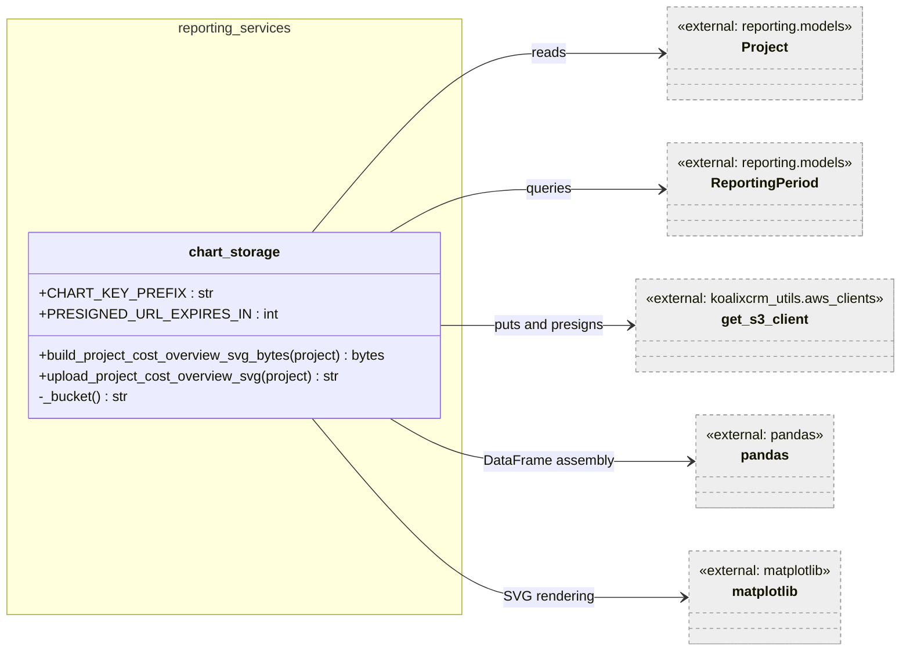

*Figure 1: chart_storage module and its external dependencies.*

The `chart_storage` module is responsible for generating the project cost overview chart and making it accessible to the Java pdf-export-service. The legacy approach wrote an SVG file to a local `PDF_OUTPUT_ROOT` directory that both the Django process and FOP could access via the filesystem. Because the Java service now runs on a separate host, the module uploads the SVG to S3 / MinIO and returns a presigned GET URL that the Java orchestrator downloads before invoking FOP.

`matplotlib` is configured to use the `Agg` backend immediately at module import time (`matplotlib.use('Agg')`), which prevents the import from trying to connect to a display server in worker/API processes.

**Module-level configuration:**

| Name | Source | Default |
|---|---|---|
| `CHART_KEY_PREFIX` | `S3_REPORT_CHART_PREFIX` env var | `"report-charts"` |
| `PRESIGNED_URL_EXPIRES_IN` | `PRESIGNED_URL_EXPIRES_IN` env var | `300` seconds |

---

#### `_bucket() -> str`

Returns the S3 bucket name from the `S3_PDF_BUCKET` environment variable, defaulting to `"koalixcrm-pdf-exports"`.

---

#### `build_project_cost_overview_svg_bytes(project) -> bytes`

Produces the project cost overview chart as in-memory SVG bytes without any filesystem I/O.

Arguments:
- `project` — a `Project` model instance. The function reads `project.id`, `project.default_currency`, and calls `project.effective_costs(reporting_period=rp)` and `project.planned_costs_in_buckets(...)` on it.

The function replicates the chart that the legacy `Project.create_project_cost_overview_illustration` method wrote to disk, preserving the same aggregation logic:

1. It fetches all `ReportingPeriod` objects for the project ordered by `begin`.
2. It accumulates effective costs period by period. For periods whose status is `is_done=True`, it records both the confirmed and not-confirmed series at the same value; for open periods, only the not-confirmed series carries a value.
3. It calls `project.planned_costs_in_buckets(reporting_period=last_reporting_period, buckets=reporting_periods)` using the last period in the loop (matching the legacy behaviour where the loop variable was reused after the loop).
4. It assembles a `pandas.DataFrame` with columns `x`, `Budget`, `Estimation`, `Effective confirmed`, and `Effective not confirmed`.
5. It applies the `seaborn-darkgrid` style (falling back to `seaborn-v0_8-darkgrid` for newer matplotlib versions).
6. It plots all four series, sets axis labels and the chart title, and writes the figure to an in-memory `BytesIO` buffer as SVG.

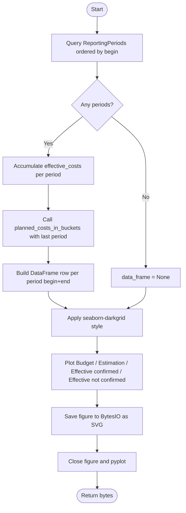

*Figure 2: build_project_cost_overview_svg_bytes control flow.*

---

#### `upload_project_cost_overview_svg(project) -> str`

Renders the SVG and uploads it to S3, returning a presigned GET URL.

Arguments:
- `project` — a `Project` model instance.

The function:
1. Calls `build_project_cost_overview_svg_bytes(project)` to obtain the SVG bytes.
2. Constructs a unique S3 object key: `"{CHART_KEY_PREFIX}/project_{project.id}_{uuid4().hex}.svg"`. The UUID suffix ensures each report invocation produces a distinct object, avoiding stale cache hits.
3. Calls `get_s3_client(use_presigned_config=...)` where the `use_presigned_config` flag is `True` when `S3_ENDPOINT_URL` is not set (i.e. on AWS; MinIO / local deployments set `S3_ENDPOINT_URL` and require a separate presigned-URL-compatible config).
4. Uploads the SVG via `put_object` with `ContentType='image/svg+xml'`.
5. Generates and returns a presigned GET URL valid for `PRESIGNED_URL_EXPIRES_IN` seconds.

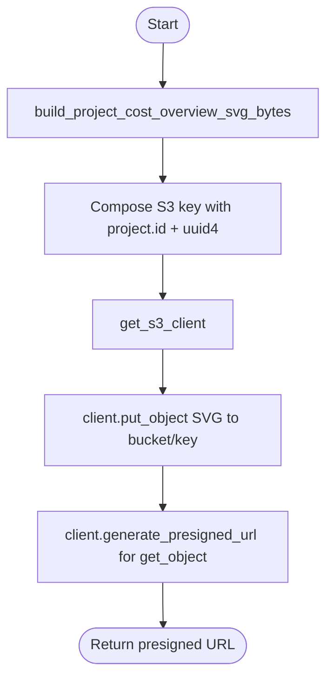

*Figure 3: upload_project_cost_overview_svg control flow.*

---

### Signals

`koalixcrm/reporting/signals/__init__.py` is an empty module (aside from the `from __future__ import annotations` header). No signal handlers are currently registered in the reporting package.

---

### Admin

#### Admin Registration Overview

`koalixcrm/reporting/admin/__init__.py` imports all admin view classes and model classes, then registers them with `django.contrib.admin.site`. It additionally unregisters the `Contract` model from the contracts admin and re-registers it with an extended class that adds the `InlineGenericProjectLinkAdmin` inline.

**Figure 4 — Admin registration overview**

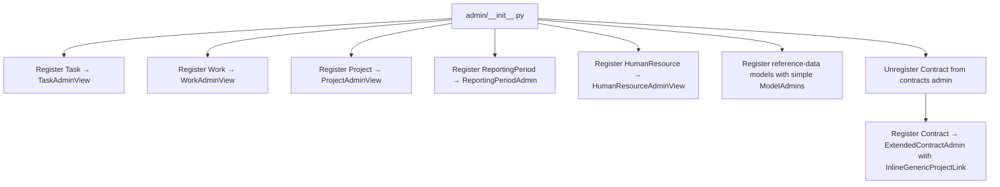

*Figure 4: Admin registration flow in admin/__init__.py.*

`ExtendedContractAdmin` extends `OptionContract` (the contracts app's own admin class) by appending `InlineGenericProjectLinkAdmin` to the existing inlines list. This adds a read-only project-link table to the contract change form without modifying the contracts application.

---

#### ProjectAdminView

**Figure 5 — ProjectAdminView class diagram**

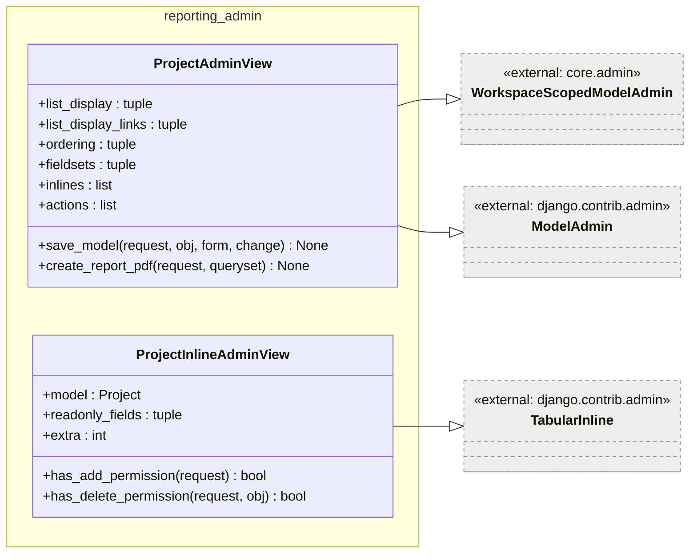

*Figure 5: ProjectAdminView class diagram.*

`ProjectAdminView` is the main admin view for `Project`. It includes three inlines: `TaskInlineAdminView`, `GenericLinkInlineAdminView`, and `ReportingPeriodInlineAdminView`. The `list_display` exposes computed aggregate columns such as `planned_total_costs`, `effective_costs_confirmed`, and `effective_costs_not_confirmed`.

**`save_model(request, obj, form, change) -> None`**

Assigns `request.user` to `obj.last_modified_by` on both create and update, then delegates to `super().save_model`.

**`create_report_pdf(request, queryset) -> None`**

An admin action that enqueues an asynchronous `PDFExportProcess` for each selected project. The Java pdf-export-service consumes the process row from SQS, fetches the JSON snapshot from `/projects/<id>/report-data/`, renders the PDF using the monthly project summary XSL template, and writes the result URL back onto the process row.

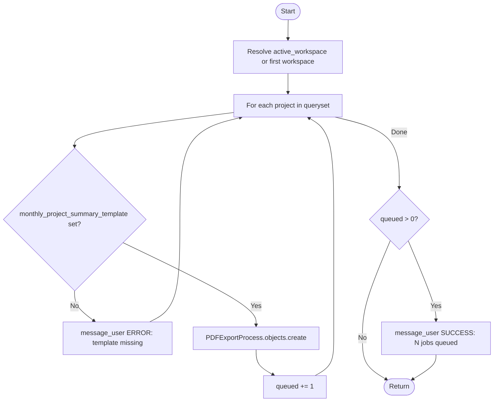

*Figure 6: ProjectAdminView.create_report_pdf control flow.*

`ProjectInlineAdminView` is a read-only `TabularInline` that shows project rows embedded in a parent change form (e.g. on a contract). Add and delete permissions are disabled.

---

#### TaskAdminView

**Figure 7 — TaskAdminView class diagram**

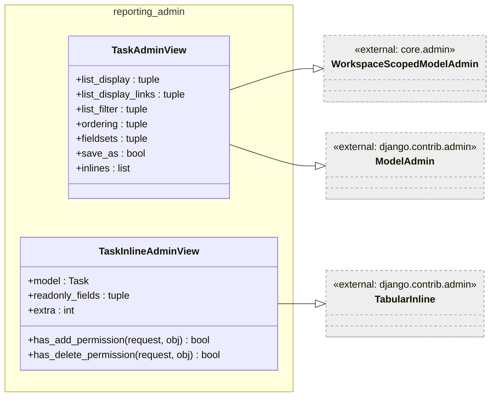

*Figure 7: TaskAdminView class diagram.*

`TaskAdminView` is the main admin view for `Task`. It applies `list_filter = ('project',)` to allow filtering tasks by project in the admin list view. Its inlines are `AgreementInlineAdminView`, `EstimationInlineAdminView`, `InlineGenericTaskLink`, and `WorkInlineAdminView`, giving a complete view of a task's agreements, estimations, linked objects, and work records on the task change form.

`TaskInlineAdminView` is a `TabularInline` used on the `Project` change form. It allows adding new tasks (`has_add_permission` returns `True`) but not deleting them.

---

#### WorkAdminView

**Figure 8 — WorkAdminView class diagram**

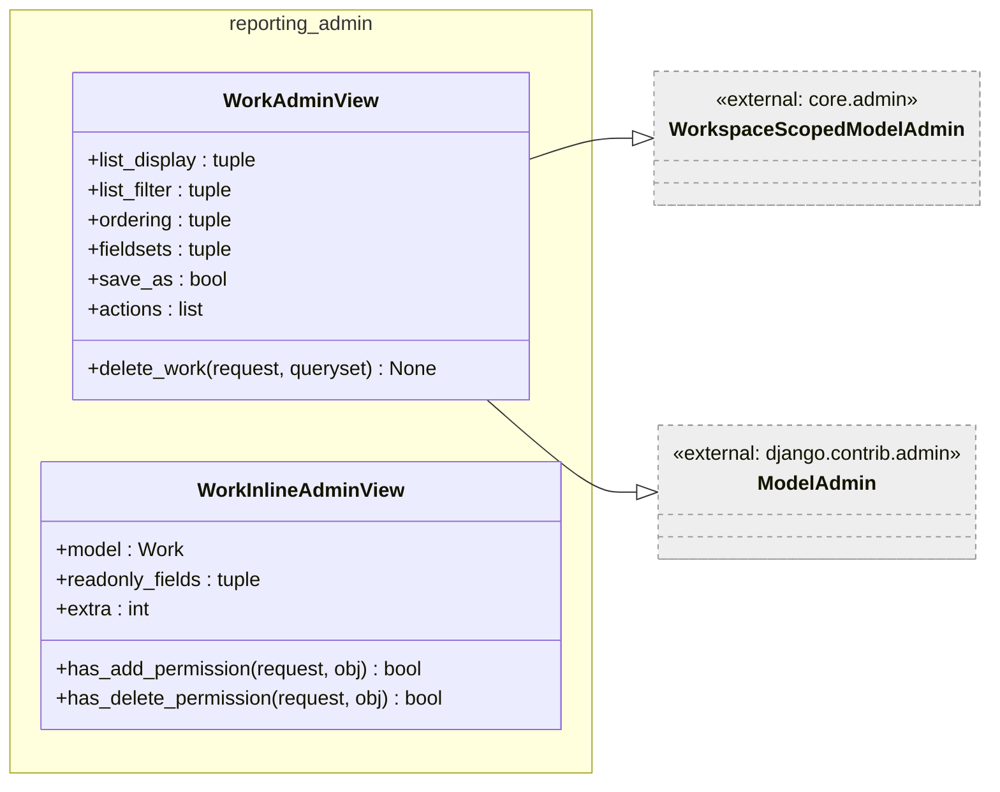

*Figure 8: WorkAdminView class diagram.*

`WorkAdminView` provides the admin interface for `Work` records. It exposes a `delete_work` action that prevents deletion when the work belongs to a reporting period whose status is `is_done=True`.

**`delete_work(request, queryset) -> None`**

Iterates over selected `Work` objects. For each, it checks `obj.reporting_period.status.is_done`: if `True`, it emits an error message and skips deletion; otherwise it calls `obj.delete()`.

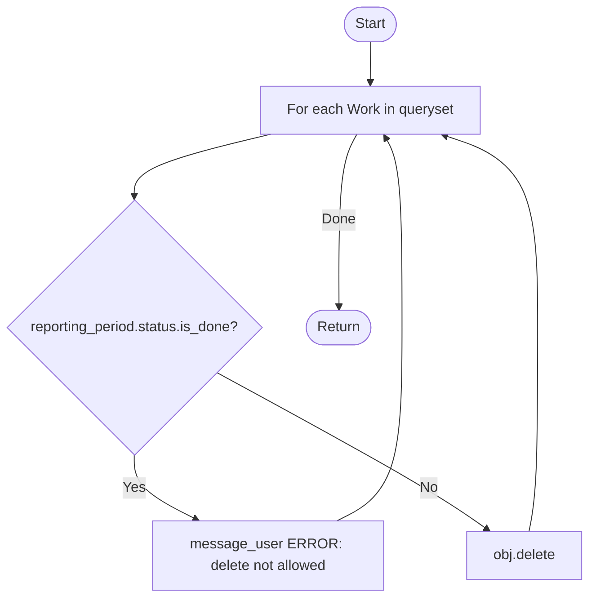

*Figure 9: WorkAdminView.delete_work control flow.*

`WorkInlineAdminView` is a fully read-only `TabularInline` used on the `Task` and `ReportingPeriod` change forms. Both add and delete permissions are disabled (`has_add_permission` and `has_delete_permission` return `False`).

---

#### ReportingPeriodAdmin

**Figure 10 — ReportingPeriodAdmin class diagram**

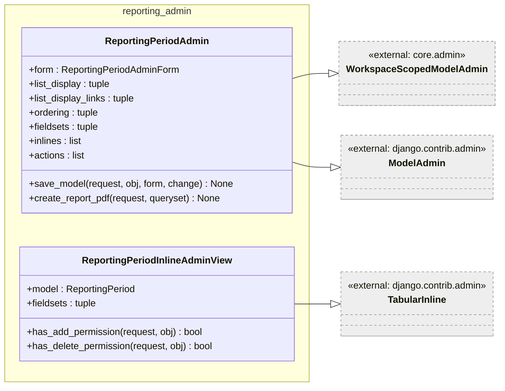

*Figure 10: ReportingPeriodAdmin class diagram.*

`ReportingPeriodAdmin` manages `ReportingPeriod` objects. It uses `ReportingPeriodAdminForm` (imported from `reporting.models.reporting_period`) and includes `WorkInlineAdminView` as an inline.

**`save_model`** assigns `request.user` to `obj.last_modified_by` on both create and update.

**`create_report_pdf(request, queryset) -> None`**

Follows the same pattern as `ProjectAdminView.create_report_pdf` but resolves the XSL template from the parent project (`obj.project.default_template_set.monthly_project_summary_template`). The Java worker fetches `/reporting-periods/<id>/report-data/` for the period-scoped snapshot.

`ReportingPeriodInlineAdminView` is a read-only inline used on the `Project` change form. Both add and delete permissions are disabled.

---

#### HumanResourceAdminView

**Figure 11 — HumanResourceAdminView class diagram**

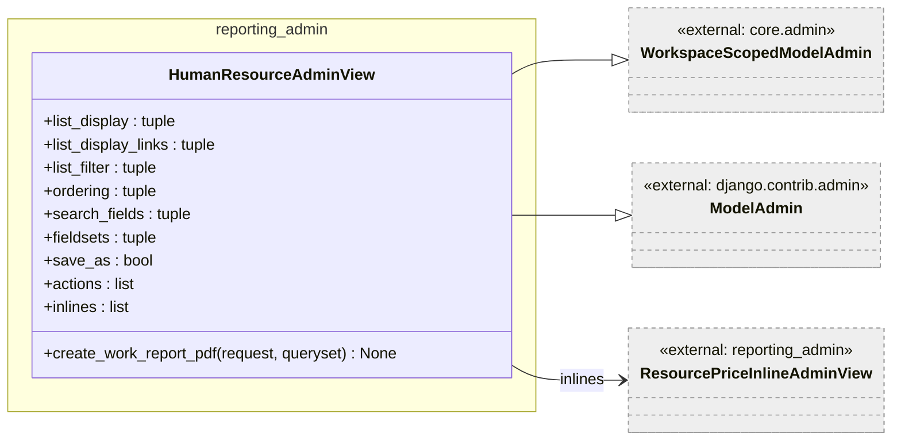

*Figure 11: HumanResourceAdminView class diagram.*

`HumanResourceAdminView` manages `HumanResource` objects. It includes `ResourcePriceInlineAdminView` to show the resource's price history on the change form.

**`create_work_report_pdf(request, queryset) -> None`**

An admin action that enqueues a `PDFExportProcess` for each selected human resource. The Java worker fetches `/human-resources/<id>/work-report-data/` without date-range query parameters, defaulting to the trailing 60 days. A code comment (`TODO(#404)`) notes that date-range selection will be added once `PDFExportProcess` has a `params` JSONField.

The template is resolved from the human resource's user extension: `obj.user.default_template_set.work_report_template`. If absent, an error message is shown and that HR record is skipped.

---

#### Inline Admin Classes

##### AgreementInlineAdminView

A `TabularInline` for the `Agreement` model, used on the `Task` change form. Allows adding new agreements (`extra=1`). Exposes all agreement fields: `task`, `resource`, `amount`, `unit`, `costs`, `date_from`, `date_until`, `type`, `status`.

##### EstimationInlineAdminView

A `TabularInline` for the `Estimation` model, used on the `Task` change form. Uses `EstimationAdminForm` as the `formset` attribute. Allows adding new estimations (`extra=1`).

##### GenericLinkInlineAdminView

A `TabularInline` for `GenericProjectLink`, used on the `Project` change form. All fields are `readonly_fields`; add and delete are disabled. Shows which external objects (e.g. contracts, invoices) are linked to the project.

##### InlineGenericProjectLinkAdmin

A `GenericTabularInline` for `GenericProjectLink`, used on the `Contract` change form via `ExtendedContractAdmin`. This generic inline variant allows Django's content-type framework to resolve the owning object dynamically. All fields are `readonly_fields`; add and delete are disabled.

##### InlineGenericTaskLink

A `TabularInline` for `GenericTaskLink`, used on the `Task` change form. All fields are `readonly_fields`; add and delete are disabled.

##### ResourcePriceInlineAdminView

A `TabularInline` for `ResourcePrice`, used on the `HumanResource` change form. `allow_add=True`, `extra=1`, rendered in a collapsible section.

---

#### Reference-Data Admin Classes

The following admin classes follow a uniform pattern: they inherit from `admin.ModelAdmin`, define `list_display` and `fieldsets`, and set `save_as = True` to enable the "Save as new" admin button.

| Class | Model | Notable fields |
|---|---|---|
| `AgreementStatusAdminView` | `AgreementStatus` | `title`, `description`, `is_agreed` |
| `AgreementTypeAdminView` | `AgreementType` | `title`, `description` |
| `EstimationStatusAdminView` | `EstimationStatus` | `title`, `description`, `is_obsolete` |
| `OptionProjectLinkType` | `ProjectLinkType` | `title`, `description` |
| `OptionProjectStatus` | `ProjectStatus` | `title`, `description`, `is_done` |
| `OptionReportingPeriodStatus` | `ReportingPeriodStatus` | `title`, `description`, `is_done` |
| `ResourceManagerAdminView` | `ResourceManager` | `user` (workspace-scoped) |
| `ResourceTypeAdminView` | `ResourceType` | `title`, `description` |
| `OptionTaskLinkType` | `TaskLinkType` | `title`, `description` |
| `OptionTaskStatus` | `TaskStatus` | `title`, `description`, `is_done` |

`ResourceManagerAdminView` additionally inherits from `WorkspaceScopedModelAdmin` because `ResourceManager` carries a workspace foreign key.

---

## In-Memory State

The `chart_storage` module holds no persistent in-memory state. Each call to `build_project_cost_overview_svg_bytes` creates and closes a new matplotlib `Figure` object. The `pyplot.close(figure)` call at the end of the function frees the figure's memory. In a horizontally scaled deployment, multiple instances can call this function concurrently without any shared state issues.

---

## Access to External Interfaces

| Interface | Type of Call | Expected Duration | Notes |
|---|---|---|---|
| PostgreSQL (Django ORM) | Blocking Read | 10–50 ms | `ReportingPeriod.objects.filter` in `build_project_cost_overview_svg_bytes`; `PDFExportProcess.objects.create` in admin actions. |
| S3 / MinIO | Blocking Write (`put_object`) | 100–500 ms | Called inline during `upload_project_cost_overview_svg`, which is itself called from `ProjectReportSerializer.get_project_cost_overview_url` during a synchronous HTTP request. No retry or circuit-breaker is implemented. |
| S3 / MinIO | Blocking Read (`generate_presigned_url`) | < 10 ms | Presigned-URL generation is a local SDK operation; no network call is made for AWS S3. For MinIO with `S3_ENDPOINT_URL` set, the SDK may contact the endpoint. |
| SQS (implicit) | Non-blocking (enqueue) | < 50 ms | The admin `create_report_pdf` and `create_work_report_pdf` actions create `PDFExportProcess` database rows; the Java worker polls SQS separately. The admin action itself does not call SQS. |

---

## Security

### Assets

| Asset | Description | Security Measure | Assessment of Criticality |
|---|---|---|---|
| S3 bucket name | Bucket where SVG charts are stored | Read from `S3_PDF_BUCKET` env var; not hardcoded | Uncritical |
| S3 presigned URL | Short-lived URL embedded in the report-data JSON response | TTL controlled by `PRESIGNED_URL_EXPIRES_IN` (default 300 s); grants read-only access to one SVG object | Uncritical |
| S3 credentials | AWS credentials used to call `put_object` and `generate_presigned_url` | Managed by `get_s3_client` from `koalixcrm_utils`; not handled in this module | Uncritical — depends on `koalixcrm_utils` implementation |
| Admin action access | `create_report_pdf` and `create_work_report_pdf` can enqueue PDF jobs | Protected by Django admin authentication and the `WorkspaceScopedModelAdmin` mixin | Uncritical — standard admin permissions apply |

---

## Design Patterns Used

**Headless backend selection:** `matplotlib.use('Agg')` is called at module import time, before any `pyplot` import. This is the standard pattern for running matplotlib in a server environment where no display is available.

**UUID-keyed S3 objects:** Each call to `upload_project_cost_overview_svg` generates a new UUID4-suffixed key. This avoids S3 object reuse across report renders and ensures the presigned URL always points to a freshly generated chart. The downside is that old chart objects accumulate in the bucket and must be cleaned up via an S3 lifecycle policy.

**Admin action as async job dispatcher:** The `create_report_pdf` and `create_work_report_pdf` actions do not synchronously generate PDFs. They create `PDFExportProcess` rows and rely on the Java worker to pick them up from SQS. This keeps the admin action fast and prevents Django request timeout issues for large projects.

**Extended admin via unregister/re-register:** `ExtendedContractAdmin` extends the contracts app's own admin class without modifying the contracts application itself. This is Django's recommended pattern for cross-app admin extension, avoiding tight coupling between the reporting and contracts apps.

---

## External Dependencies

| Requirement | Version/Details | Notes |
|---|---|---|
| `matplotlib` | >= 3.5 | Headless chart rendering; `Agg` backend required. |
| `pandas` | Any version compatible with matplotlib axis | DataFrame assembly for the cost overview chart. |
| `koalixcrm_utils` | Internal package | Provides `get_s3_client`; must expose the `use_presigned_config` parameter. |
| `django.contrib.admin` | Django 4.x | All admin classes. |

---

## Appendix

### References

- [Views and Serializers documentation](QQ_LL_Doc_Reporting_ViewsSerializers.md)
- [Project and Task model documentation](QQ_LL_Doc_Reporting_ProjectTaskModels.md)

### List of Illustrations

| Figure | Title |
|---|---|
| Figure 1 | chart_storage module and its external dependencies |
| Figure 2 | build_project_cost_overview_svg_bytes control flow |
| Figure 3 | upload_project_cost_overview_svg control flow |
| Figure 4 | Admin registration flow in admin/__init__.py |
| Figure 5 | ProjectAdminView class diagram |
| Figure 6 | ProjectAdminView.create_report_pdf control flow |
| Figure 7 | TaskAdminView class diagram |
| Figure 8 | WorkAdminView class diagram |
| Figure 9 | WorkAdminView.delete_work control flow |
| Figure 10 | ReportingPeriodAdmin class diagram |
| Figure 11 | HumanResourceAdminView class diagram |
