# Low-Level Documentation: Reporting Views and Serializers

## Introduction

### Scope

This document covers the implementation of all classes and functions in the following source files:

- `koalixcrm/reporting/views/__init__.py` — package re-export index
- `koalixcrm/reporting/views/project_view_set.py` — `ProjectViewSet`
- `koalixcrm/reporting/views/task_view_set.py` — `TaskViewSet`
- `koalixcrm/reporting/views/work_view_set.py` — `WorkViewSet`
- `koalixcrm/reporting/views/human_resource_view_set.py` — `HumanResourceViewSet`
- `koalixcrm/reporting/views/reporting_period_view_set.py` — `ReportingPeriodViewSet`
- `koalixcrm/reporting/views/reporting_period_missing.py` — `ReportingPeriodMissingForm`, `reporting_period_missing`
- `koalixcrm/reporting/views/user_is_not_human_resource.py` — `ReportingPeriodMissingForm` (hr variant), `user_is_not_human_resource`
- `koalixcrm/reporting/views/time_tracking.py` — `work_report`
- `koalixcrm/reporting/views/range_selection_form.py` — `RangeSelectionForm`
- `koalixcrm/reporting/views/work_entry_form.py` — `WorkEntry`
- `koalixcrm/reporting/views/work_entry_formset.py` — `BaseWorkEntryFormset`
- `koalixcrm/reporting/views/create_task.py` — `CreateTaskView`
- Remaining nine ViewSets (Agreement, AgreementStatus, AgreementType, Estimation, EstimationStatus, GenericProjectLink, GenericTaskLink, ProjectStatus, ProjectLinkType, ReportingPeriodStatus, Resource, ResourceManager, ResourcePrice, ResourceType, TaskStatus, TaskLinkType)
- `koalixcrm/reporting/serializers/` — all serializer classes

### Target Audience

The primary audience for this document is the software development engineer who needs to use, modify, or extend the reporting views and serializers.

### Glossary

| Term/Acronym | Full Form | Description |
|---|---|---|
| ViewSet | Django REST Framework ViewSet | A class that groups CRUD and custom REST actions for a single resource type. |
| DRF | Django REST Framework | The HTTP API library used for all JSON endpoints. |
| CRM | Customer Relationship Management | The domain application of which this reporting module is a sub-system. |
| XSL | Extensible Stylesheet Language | Template language used by the Java pdf-export-service to render PDFs. |
| FOP | Apache Formatting Objects Processor | Java component that converts XSL-FO to PDF. |
| SQS | Amazon Simple Queue Service | AWS managed message queue used to enqueue PDF export jobs. |
| Presigned URL | S3 Presigned URL | A time-limited, self-authenticating URL for a single S3 object. |
| HR | Human Resource | A CRM entity that maps a user extension to a resource, enabling work-time tracking. |
| Workspace | Tenant partition | A multi-tenancy scope used throughout koalixcrm to isolate data per organisation. |
| RP | Reporting Period | A date-bounded slice of a project used for time reporting and cost aggregation. |

---

## Detailed Component

### ViewSets

#### Overview

**Figure 1 — Reporting ViewSet hierarchy**


```mermaid
classDiagram
    direction TB

    namespace reporting_views {
        class ProjectViewSet {
            +queryset
            +serializer_class
            +report_data(request, pk) Response
        }
        class TaskViewSet {
            +queryset
            +serializer_class
            +filterset_fields
        }
        class WorkViewSet {
            +queryset
            +serializer_class
        }
        class HumanResourceViewSet {
            +queryset
            +serializer_class
            +work_report_data(request, pk) Response
            -_parse(name, request, default) date
        }
        class ReportingPeriodViewSet {
            +queryset
            +serializer_class
            +report_data(request, pk) Response
        }
        class AgreementViewSet {
            +queryset
            +serializer_class
        }
        class EstimationViewSet {
            +queryset
            +serializer_class
        }
        class GenericProjectLinkViewSet {
            +queryset
            +serializer_class
        }
        class GenericTaskLinkViewSet {
            +queryset
            +serializer_class
        }
    }

    class BaseModelViewSet:::external {
        <<external: shared>>
    }
    class WorkspaceScopedViewSetMixin:::external {
        <<external: shared>>
    }

    ProjectViewSet --|> WorkspaceScopedViewSetMixin
    ProjectViewSet --|> BaseModelViewSet
    TaskViewSet --|> WorkspaceScopedViewSetMixin
    TaskViewSet --|> BaseModelViewSet
    WorkViewSet --|> WorkspaceScopedViewSetMixin
    WorkViewSet --|> BaseModelViewSet
    HumanResourceViewSet --|> WorkspaceScopedViewSetMixin
    HumanResourceViewSet --|> BaseModelViewSet
    ReportingPeriodViewSet --|> WorkspaceScopedViewSetMixin
    ReportingPeriodViewSet --|> BaseModelViewSet
    AgreementViewSet --|> WorkspaceScopedViewSetMixin
    AgreementViewSet --|> BaseModelViewSet
    EstimationViewSet --|> WorkspaceScopedViewSetMixin
    EstimationViewSet --|> BaseModelViewSet
    GenericProjectLinkViewSet --|> WorkspaceScopedViewSetMixin
    GenericProjectLinkViewSet --|> BaseModelViewSet
    GenericTaskLinkViewSet --|> WorkspaceScopedViewSetMixin
    GenericTaskLinkViewSet --|> BaseModelViewSet

    classDef external fill:#eee,stroke:#999,stroke-dasharray:4 4;
```

*Figure 1: Reporting ViewSet classes and their inheritance from the shared base.*

---

#### ProjectViewSet

**Figure 2 — ProjectViewSet class diagram**

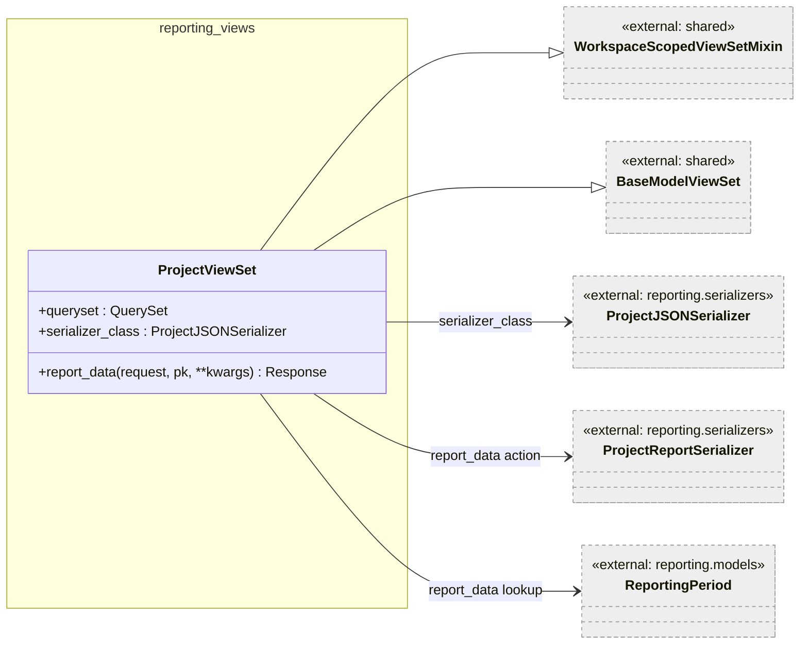
```mermaid
classDiagram
    direction LR

    namespace reporting_views {
        class ProjectViewSet {
            +queryset : QuerySet
            +serializer_class : ProjectJSONSerializer
            +report_data(request, pk, **kwargs) Response
        }
    }

    class BaseModelViewSet:::external {
        <<external: shared>>
    }
    class WorkspaceScopedViewSetMixin:::external {
        <<external: shared>>
    }
    class ProjectJSONSerializer:::external {
        <<external: reporting.serializers>>
    }
    class ProjectReportSerializer:::external {
        <<external: reporting.serializers>>
    }
    class ReportingPeriod:::external {
        <<external: reporting.models>>
    }

    ProjectViewSet --|> WorkspaceScopedViewSetMixin
    ProjectViewSet --|> BaseModelViewSet
    ProjectViewSet --> ProjectJSONSerializer : serializer_class
    ProjectViewSet --> ProjectReportSerializer : report_data action
    ProjectViewSet --> ReportingPeriod : report_data lookup

    classDef external fill:#eee,stroke:#999,stroke-dasharray:4 4;
```

*Figure 2: ProjectViewSet and its dependencies.*

`ProjectViewSet` exposes the standard CRUD interface for `Project` objects, filtered to the active workspace via `WorkspaceScopedViewSetMixin`. In addition to the base CRUD routes it provides the `report-data` action endpoint.

**`report_data(request, pk, **kwargs) -> Response`**

Signature: `report_data(self, request: Any, pk: Any = None, **kwargs: Any) -> Response`

Arguments:
- `request` — the DRF request; an optional `?reporting_period=<id>` query parameter narrows the snapshot to that period.
- `pk` — the project primary key provided by the router.

The method produces a self-contained JSON snapshot consumed by the Java pdf-export-service when rendering the `project_report` XSL template. It resolves an optional `reporting_period` query parameter, validates that the period belongs to the requested project, then delegates serialisation to `ProjectReportSerializer`.

**Flow:**

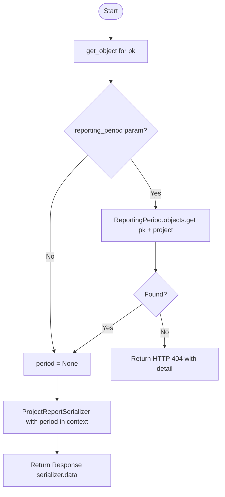
```mermaid
flowchart TD
    A([Start]) --> B[get_object for pk]
    B --> C{reporting_period param?}
    C -->|No| E[period = None]
    C -->|Yes| D[ReportingPeriod.objects.get pk + project]
    D --> F{Found?}
    F -->|No| G[Return HTTP 404 with detail]
    F -->|Yes| E
    E --> H[ProjectReportSerializer with period in context]
    H --> I[Return Response serializer.data]
```

*Figure 3: ProjectViewSet.report_data control flow.*

---

#### TaskViewSet

`TaskViewSet` provides standard CRUD for `Task` objects within the active workspace. The `filterset_fields = ['project']` attribute allows callers to filter tasks by project ID via `?project=<id>`, which is the primary access pattern for the time-tracking UI and the Java service when preparing per-project task lists.

---

#### WorkViewSet

`WorkViewSet` exposes standard CRUD for `Work` records. It applies workspace scoping via `WorkspaceScopedViewSetMixin`. No custom actions are defined; mutation is handled in full by the base class and the `WorkJSONSerializer`.

---

#### HumanResourceViewSet

**Figure 4 — HumanResourceViewSet class diagram**

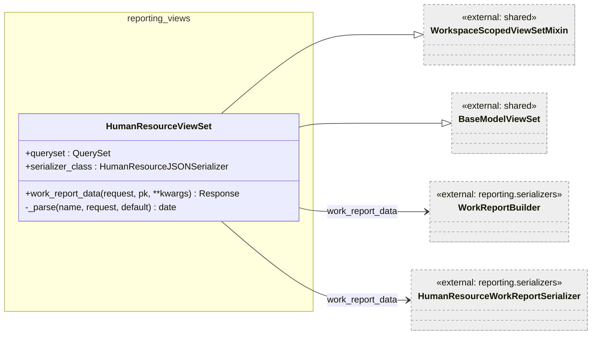
```mermaid
classDiagram
    direction LR

    namespace reporting_views {
        class HumanResourceViewSet {
            +queryset : QuerySet
            +serializer_class : HumanResourceJSONSerializer
            +work_report_data(request, pk, **kwargs) Response
            -_parse(name, request, default) date
        }
    }

    class BaseModelViewSet:::external {
        <<external: shared>>
    }
    class WorkspaceScopedViewSetMixin:::external {
        <<external: shared>>
    }
    class WorkReportBuilder:::external {
        <<external: reporting.serializers>>
    }
    class HumanResourceWorkReportSerializer:::external {
        <<external: reporting.serializers>>
    }

    HumanResourceViewSet --|> WorkspaceScopedViewSetMixin
    HumanResourceViewSet --|> BaseModelViewSet
    HumanResourceViewSet --> WorkReportBuilder : work_report_data
    HumanResourceViewSet --> HumanResourceWorkReportSerializer : work_report_data

    classDef external fill:#eee,stroke:#999,stroke-dasharray:4 4;
```

*Figure 4: HumanResourceViewSet and its report-building dependencies.*

`HumanResourceViewSet` provides CRUD for `HumanResource` objects plus the `work-report-data` action endpoint.

**`work_report_data(request, pk, **kwargs) -> Response`**

Signature: `work_report_data(self, request: Any, pk: Any = None, **kwargs: Any) -> Response`

Arguments:
- `request` — accepts `?range_from=YYYY-MM-DD` and `?range_to=YYYY-MM-DD`; defaults to 60 days back through today when absent.
- `pk` — the human-resource primary key.

The endpoint mirrors the legacy `HumanResource.serialize_to_xml` payload in JSON form. It delegates bucket computation to `WorkReportBuilder` and then passes the resulting dict through `HumanResourceWorkReportSerializer`.

**Flow:**

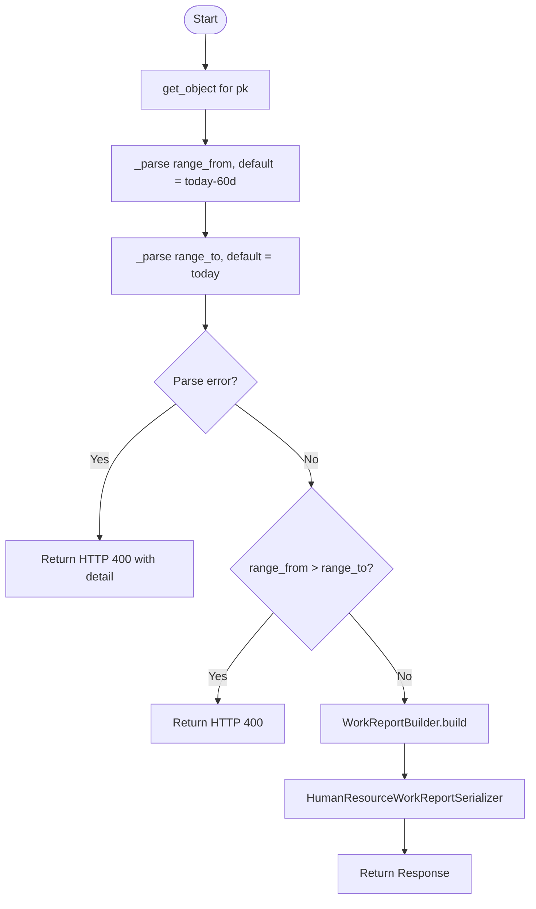
```mermaid
flowchart TD
    A([Start]) --> B[get_object for pk]
    B --> C[_parse range_from, default = today-60d]
    C --> D[_parse range_to, default = today]
    D --> E{Parse error?}
    E -->|Yes| F[Return HTTP 400 with detail]
    E -->|No| G{range_from > range_to?}
    G -->|Yes| H[Return HTTP 400]
    G -->|No| I[WorkReportBuilder.build]
    I --> J[HumanResourceWorkReportSerializer]
    J --> K[Return Response]
```

*Figure 5: HumanResourceViewSet.work_report_data control flow.*

**`_parse(name, request, default) -> date`** (private static)

Reads the named query parameter from `request.query_params`. Returns `default` when the parameter is absent or empty. Raises `ValueError` with a descriptive message when the value is present but cannot be parsed as `YYYY-MM-DD`.

---

#### ReportingPeriodViewSet

`ReportingPeriodViewSet` provides CRUD for `ReportingPeriod` objects plus a `report-data` action endpoint. The action delegates to `ProjectReportSerializer` with the resolved period as context, producing a period-scoped project report. This matches the legacy `ReportingPeriod.serialize_to_xml` behaviour, which internally called `Project.serialize_to_xml(reporting_period=self)`, and ensures the Java pdf-export-service uses a single XSL-to-builder mapping for both project-level and period-level PDF renders.

---

#### Reference-Data ViewSets (workspace-scoped)

The following ViewSets follow the same pattern: they inherit from both `WorkspaceScopedViewSetMixin` and `BaseModelViewSet`, expose the full CRUD router, and define no custom actions.

| ViewSet | Model | Serializer |
|---|---|---|
| `AgreementViewSet` | `Agreement` | `AgreementJSONSerializer` |
| `EstimationViewSet` | `Estimation` | `EstimationJSONSerializer` |
| `GenericProjectLinkViewSet` | `GenericProjectLink` | `GenericProjectLinkJSONSerializer` |
| `GenericTaskLinkViewSet` | `GenericTaskLink` | `GenericTaskLinkJSONSerializer` |
| `ResourceManagerViewSet` | `ResourceManager` | `ResourceManagerJSONSerializer` |
| `ResourcePriceViewSet` | `ResourcePrice` | `ResourcePricesSONSerializer` |
| `ResourceViewSet` | `Resource` | `ResourceJSONSerializer` |

#### Reference-Data ViewSets (global — no workspace scoping)

The following ViewSets inherit from `BaseModelViewSet` only. Their underlying models are lookup/reference tables shared across workspaces and therefore carry no workspace foreign key.

| ViewSet | Model | Serializer |
|---|---|---|
| `AgreementStatusViewSet` | `AgreementStatus` | `AgreementStatusJSONSerializer` |
| `AgreementTypeViewSet` | `AgreementType` | `AgreementTypeJSONSerializer` |
| `EstimationStatusViewSet` | `EstimationStatus` | `EstimationStatusJSONSerializer` |
| `ProjectLinkTypeViewSet` | `ProjectLinkType` | `ProjectLinkTypeJSONSerializer` |
| `ProjectStatusViewSet` | `ProjectStatus` | `ProjectStatusJSONSerializer` |
| `ReportingPeriodStatusViewSet` | `ReportingPeriodStatus` | `ReportingPeriodStatusJSONSerializer` |
| `ResourceTypeViewSet` | `ResourceType` | `ResourceTypeJSONSerializer` |
| `TaskLinkTypeViewSet` | `TaskLinkType` | `TaskLinkTypeJSONSerializer` |
| `TaskStatusViewSet` | `TaskStatus` | `TaskStatusJSONSerializer` |

---

### Template Views and Forms

#### RangeSelectionForm

**Figure 6 — RangeSelectionForm class diagram**

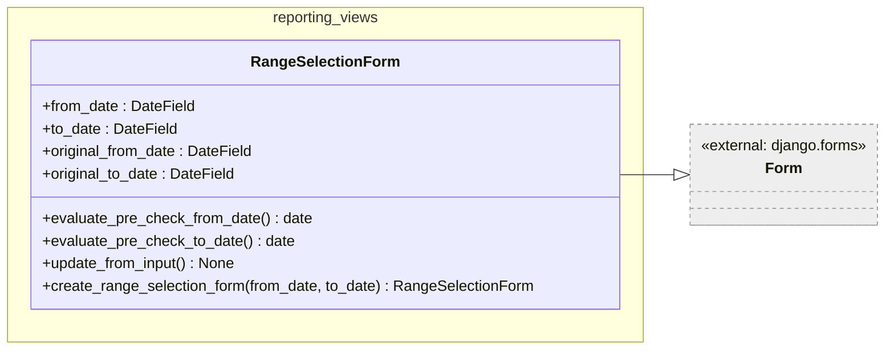
```mermaid
classDiagram
    direction LR

    namespace reporting_views {
        class RangeSelectionForm {
            +from_date : DateField
            +to_date : DateField
            +original_from_date : DateField
            +original_to_date : DateField
            +evaluate_pre_check_from_date() date
            +evaluate_pre_check_to_date() date
            +update_from_input() None
            +create_range_selection_form(from_date, to_date) RangeSelectionForm
        }
    }

    class Form:::external {
        <<external: django.forms>>
    }

    RangeSelectionForm --|> Form

    classDef external fill:#eee,stroke:#999,stroke-dasharray:4 4;
```

*Figure 6: RangeSelectionForm class diagram.*

`RangeSelectionForm` is a Django form that allows a user to select a date window for time-reporting. It carries two hidden original-date fields (`original_from_date`, `original_to_date`) that record the dates as they were when the page was first rendered. This allows the formset loading logic to expand the effective window when the user adjusts the range, preventing entries near the boundary from falling out of scope.

**`evaluate_pre_check_from_date() -> date`**

Returns `min(original_from_date, from_date)`. Used to ensure the work-entry formset captures any existing entries that overlap with the previous range when the user narrows the selection.

**`evaluate_pre_check_to_date() -> date`**

Returns `max(original_to_date, to_date)`. Symmetric with `evaluate_pre_check_from_date`.

**`update_from_input() -> None`**

Advances the original-date fields to the newly submitted `from_date` / `to_date` values. Called after a successful save so that the next form submission uses the current range as its baseline.

**`create_range_selection_form(from_date, to_date) -> RangeSelectionForm`** (static)

Factory that initialises the form with matching `original_*` and current date fields simultaneously, used when displaying the form for the first time.

---

#### WorkEntry

**Figure 7 — WorkEntry class diagram**

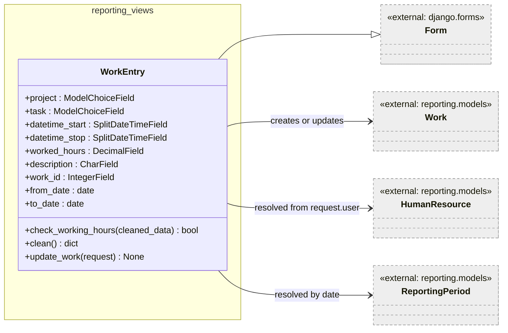
```mermaid
classDiagram
    direction LR

    namespace reporting_views {
        class WorkEntry {
            +project : ModelChoiceField
            +task : ModelChoiceField
            +datetime_start : SplitDateTimeField
            +datetime_stop : SplitDateTimeField
            +worked_hours : DecimalField
            +description : CharField
            +work_id : IntegerField
            +from_date : date
            +to_date : date
            +check_working_hours(cleaned_data) bool
            +clean() dict
            +update_work(request) None
        }
    }

    class Form:::external {
        <<external: django.forms>>
    }
    class Work:::external {
        <<external: reporting.models>>
    }
    class HumanResource:::external {
        <<external: reporting.models>>
    }
    class ReportingPeriod:::external {
        <<external: reporting.models>>
    }

    WorkEntry --|> Form
    WorkEntry --> Work : creates or updates
    WorkEntry --> HumanResource : resolved from request.user
    WorkEntry --> ReportingPeriod : resolved by date

    classDef external fill:#eee,stroke:#999,stroke-dasharray:4 4;
```

*Figure 7: WorkEntry class diagram.*

`WorkEntry` is a Django form that represents a single work-booking record. The constructor receives `from_date` and `to_date` keyword arguments (popped from `kwargs` before calling `super().__init__`), which are stored as instance attributes and used during validation to enforce that the date of work falls within the selected range.

The form supports two mutually exclusive ways to express effort: the start/stop timestamp pair or the explicit `worked_hours` decimal. Only one mode may be used at a time.

**`check_working_hours(cleaned_data) -> bool`** (static)

Validates that exactly one of the two time-entry modes is fully supplied. Raises `ValidationError` when:
- Both start/stop and worked_hours are provided.
- Only one of start/stop is provided.
- Neither mode is provided.

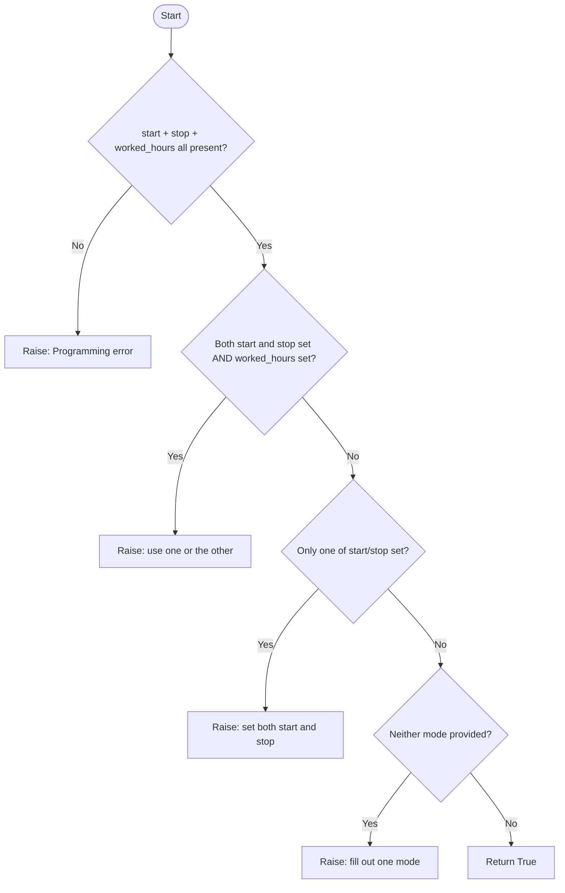
```mermaid
flowchart TD
    A([Start]) --> B{start + stop + worked_hours all present?}
    B -->|No| C[Raise: Programming error]
    B -->|Yes| D{Both start and stop set AND worked_hours set?}
    D -->|Yes| E[Raise: use one or the other]
    D -->|No| F{Only one of start/stop set?}
    F -->|Yes| G[Raise: set both start and stop]
    F -->|No| H{Neither mode provided?}
    H -->|Yes| I[Raise: fill out one mode]
    H -->|No| J[Return True]
```

*Figure 8: WorkEntry.check_working_hours control flow.*

**`clean() -> dict`**

Runs the full form validation sequence after the field-level validators. It additionally verifies that the selected project currently allows reporting, then delegates to `check_working_hours`. Returns `cleaned_data` if all checks pass.

**`update_work(request) -> None`**

Persists the form's data as a `Work` instance. The method only executes when the form has changed (`has_changed()` is True). It enforces ownership: when a `work_id` is present in the hidden field, the method looks up the `Work` row restricted to the current human resource — any mismatch raises `PermissionDenied`, preventing cross-user edits via tampered hidden fields.

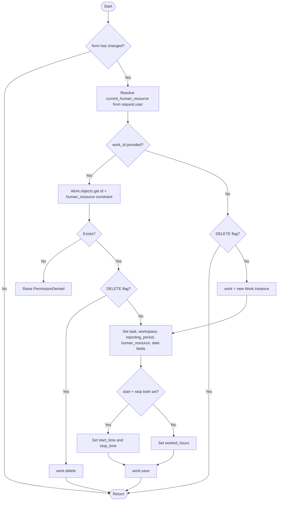
```mermaid
flowchart TD
    A([Start]) --> B{form has changed?}
    B -->|No| Z([Return])
    B -->|Yes| C[Resolve current_human_resource from request.user]
    C --> D{work_id provided?}
    D -->|Yes| E[Work.objects.get id + human_resource constraint]
    E --> F{Exists?}
    F -->|No| G[Raise PermissionDenied]
    F -->|Yes| H{DELETE flag?}
    D -->|No| I{DELETE flag?}
    I -->|Yes| Z
    I -->|No| J[work = new Work instance]
    H -->|Yes| K[work.delete]
    H -->|No| L[Set task, workspace, reporting_period, human_resource, date fields]
    J --> L
    L --> M{start + stop both set?}
    M -->|Yes| N[Set start_time and stop_time]
    M -->|No| O[Set worked_hours]
    N --> P[work.save]
    O --> P
    K --> Z
    P --> Z
```

*Figure 9: WorkEntry.update_work control flow.*

---

#### BaseWorkEntryFormset

**Figure 10 — BaseWorkEntryFormset class diagram**

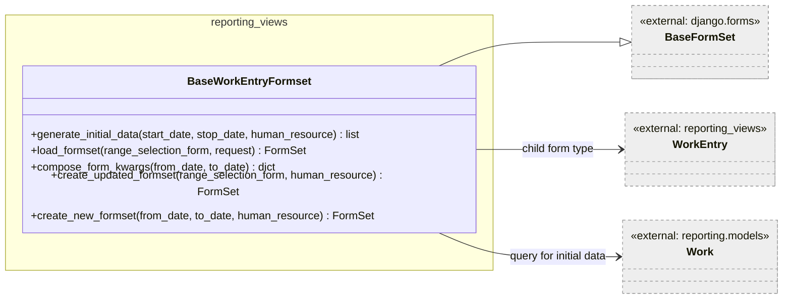
```mermaid
classDiagram
    direction LR

    namespace reporting_views {
        class BaseWorkEntryFormset {
            +generate_initial_data(start_date, stop_date, human_resource) list
            +load_formset(range_selection_form, request) FormSet
            +compose_form_kwargs(from_date, to_date) dict
            +create_updated_formset(range_selection_form, human_resource) FormSet
            +create_new_formset(from_date, to_date, human_resource) FormSet
        }
    }

    class BaseFormSet:::external {
        <<external: django.forms>>
    }
    class WorkEntry:::external {
        <<external: reporting_views>>
    }
    class Work:::external {
        <<external: reporting.models>>
    }

    BaseWorkEntryFormset --|> BaseFormSet
    BaseWorkEntryFormset --> WorkEntry : child form type
    BaseWorkEntryFormset --> Work : query for initial data

    classDef external fill:#eee,stroke:#999,stroke-dasharray:4 4;
```

*Figure 10: BaseWorkEntryFormset class diagram.*

`BaseWorkEntryFormset` manages the collection of `WorkEntry` forms shown to a user on the time-tracking page. All instance-creation methods are static factories.

**`generate_initial_data(start_date, stop_date, human_resource) -> list[dict]`** (static)

Queries `Work` objects for the given human resource and date range, ordered by date. Returns a list of dicts that can be passed as `initial` to a `formset_factory`-created formset.

**`load_formset(range_selection_form, request) -> FormSet`** (static)

Called on POST. Uses the pre-check date window (the union of original and newly submitted dates) to build a bound formset from `request.POST`. This ensures that existing entries near the boundary of the range remain visible for validation.

**`create_updated_formset(range_selection_form, human_resource) -> FormSet`** (static)

Called after a successful save to re-populate the form with the database's current state for the newly selected date range.

**`create_new_formset(from_date, to_date, human_resource) -> FormSet`** (static)

Called on GET to build an unbound formset pre-populated with the current work entries in the given date range. The formset is configured with `extra=1` to show one blank row for new entry.

---

#### work_report (view function)

**Figure 11 — work_report flow diagram**

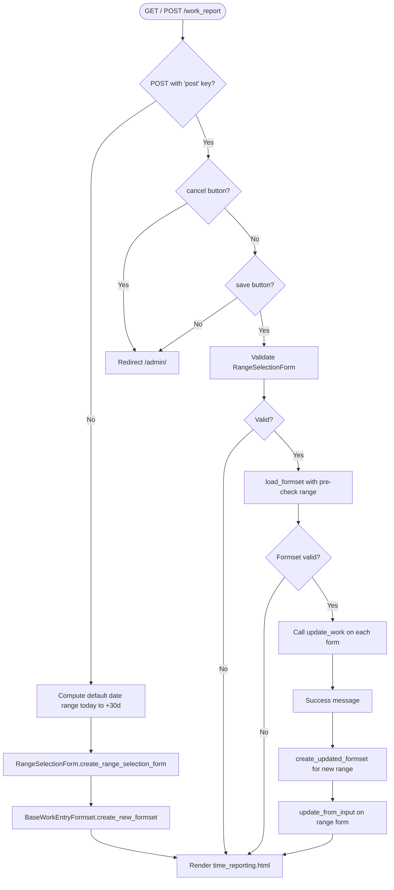
```mermaid
flowchart TD
    A([GET / POST /work_report]) --> B{POST with 'post' key?}
    B -->|No| C[Compute default date range today to +30d]
    C --> D[RangeSelectionForm.create_range_selection_form]
    D --> E[BaseWorkEntryFormset.create_new_formset]
    E --> F[Render time_reporting.html]
    B -->|Yes| G{cancel button?}
    G -->|Yes| H[Redirect /admin/]
    G -->|No| I{save button?}
    I -->|No| H
    I -->|Yes| J[Validate RangeSelectionForm]
    J --> K{Valid?}
    K -->|No| F
    K -->|Yes| L[load_formset with pre-check range]
    L --> M{Formset valid?}
    M -->|No| F
    M -->|Yes| N[Call update_work on each form]
    N --> O[Success message]
    O --> P[create_updated_formset for new range]
    P --> Q[update_from_input on range form]
    Q --> F
```

*Figure 12: work_report view function control flow.*

`work_report` is a login-required Django template view that drives the time-tracking interface. On GET it calculates a default window of today through 30 days ahead and renders an unbound formset. On POST it distinguishes cancel, and save actions. On save it loads the pre-check formset (union of old and new date ranges), validates all forms, calls `update_work` on each, then re-renders with the updated data.

Exceptions from the user-extension and human-resource resolution layers are caught at the outer `try/except` and redirected to their respective recovery views. An unexpected exception raises `Http404`.

---

#### reporting_period_missing (view function)

`reporting_period_missing` renders a guidance form (`ReportingPeriodMissingForm`) when the time-tracking logic detects that no reporting period exists for a required project. The user may choose to either add a new reporting period (redirect to `/admin/reporting/reportingperiod/add/`) or return to the admin root. The form is wrapped in `@login_required`.

The local `ReportingPeriodMissingForm` in `reporting_period_missing.py` has choices: `add_reporting_period` and `return_to_start`.

---

#### user_is_not_human_resource (view function)

`user_is_not_human_resource` renders a guidance form when the current user is not registered as a human resource. The user may either create a human resource record (redirect to `/admin/reporting/humanresource/add/`) or return to the admin root. The local `ReportingPeriodMissingForm` in this file (reusing the class name within its own module) has choices: `create_human_resource` and `return_to_start`.

---

#### CreateTaskView

**Figure 13 — CreateTaskView class diagram**

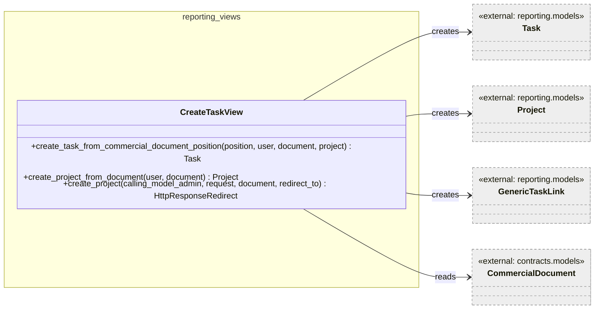
```mermaid
classDiagram
    direction LR

    namespace reporting_views {
        class CreateTaskView {
            +create_task_from_commercial_document_position(position, user, document, project) Task
            +create_project_from_document(user, document) Project
            +create_project(calling_model_admin, request, document, redirect_to) HttpResponseRedirect
        }
    }

    class Task:::external {
        <<external: reporting.models>>
    }
    class Project:::external {
        <<external: reporting.models>>
    }
    class GenericTaskLink:::external {
        <<external: reporting.models>>
    }
    class CommercialDocument:::external {
        <<external: contracts.models>>
    }

    CreateTaskView --> Task : creates
    CreateTaskView --> Project : creates
    CreateTaskView --> GenericTaskLink : creates
    CreateTaskView --> CommercialDocument : reads

    classDef external fill:#eee,stroke:#999,stroke-dasharray:4 4;
```

*Figure 13: CreateTaskView class diagram.*

`CreateTaskView` is a stateless utility class (all methods are static) that converts a commercial document into a project-with-tasks structure. It is called from admin actions on commercial documents.

**`create_task_from_commercial_document_position(position, user, document, project) -> Task`** (static)

Checks whether a `GenericTaskLink` already ties `position` to an existing task. If so, it updates the task title and dates. If not, it creates a new `Task` and two `GenericTaskLink` records — one for the `CommercialDocumentPosition` and one for the parent `CommercialDocument`.

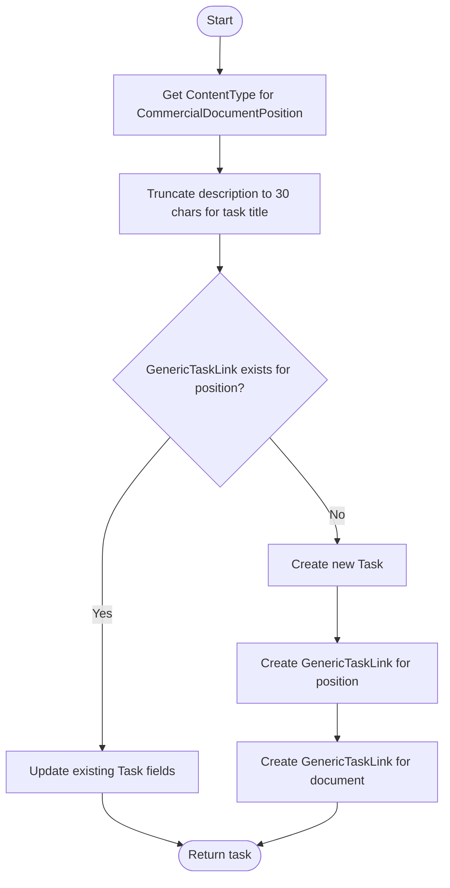
```mermaid
flowchart TD
    A([Start]) --> B[Get ContentType for CommercialDocumentPosition]
    B --> C[Truncate description to 30 chars for task title]
    C --> D{GenericTaskLink exists for position?}
    D -->|Yes| E[Update existing Task fields]
    D -->|No| F[Create new Task]
    F --> G[Create GenericTaskLink for position]
    G --> H[Create GenericTaskLink for document]
    E --> I([Return task])
    H --> I
```

*Figure 14: CreateTaskView.create_task_from_commercial_document_position control flow.*

**`create_project_from_document(user, document) -> Project`** (static)

Creates a `Project` from a `CommercialDocument` by using the contract description (truncated to 30 characters) as the project name, then iterates over all document positions and calls `create_task_from_commercial_document_position` for each one.

**`create_project(calling_model_admin, request, document, redirect_to) -> HttpResponseRedirect`** (static)

Entry point called from admin actions. Calls `create_project_from_document`, sets a success message, and redirects to the project detail page. Catches user-extension exceptions and renders the `exception.html` template. Raises `Http404` for unexpected conditions.

---

### Serializers

#### Project Serializers

**Figure 15 — Project serializer class diagram**

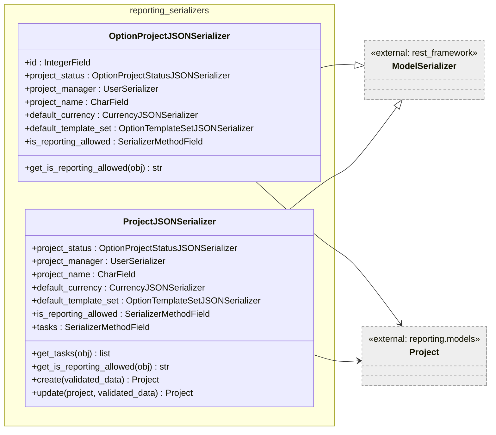
```mermaid
classDiagram
    direction LR

    namespace reporting_serializers {
        class OptionProjectJSONSerializer {
            +id : IntegerField
            +project_status : OptionProjectStatusJSONSerializer
            +project_manager : UserSerializer
            +project_name : CharField
            +default_currency : CurrencyJSONSerializer
            +default_template_set : OptionTemplateSetJSONSerializer
            +is_reporting_allowed : SerializerMethodField
            +get_is_reporting_allowed(obj) str
        }
        class ProjectJSONSerializer {
            +project_status : OptionProjectStatusJSONSerializer
            +project_manager : UserSerializer
            +project_name : CharField
            +default_currency : CurrencyJSONSerializer
            +default_template_set : OptionTemplateSetJSONSerializer
            +is_reporting_allowed : SerializerMethodField
            +tasks : SerializerMethodField
            +get_tasks(obj) list
            +get_is_reporting_allowed(obj) str
            +create(validated_data) Project
            +update(project, validated_data) Project
        }
    }

    class ModelSerializer:::external {
        <<external: rest_framework>>
    }
    class Project:::external {
        <<external: reporting.models>>
    }

    OptionProjectJSONSerializer --|> ModelSerializer
    ProjectJSONSerializer --|> ModelSerializer
    OptionProjectJSONSerializer --> Project
    ProjectJSONSerializer --> Project

    classDef external fill:#eee,stroke:#999,stroke-dasharray:4 4;
```

*Figure 15: Project serializer classes.*

`OptionProjectJSONSerializer` is a read-oriented, lighter-weight serializer used as a nested reference inside other serializers (e.g. in `WorkSerializer`, `TaskJSONSerializer`). All nested fields are `read_only=True`. The `is_reporting_allowed` method field returns the string `"True"` or `"False"` rather than a boolean, preserving compatibility with the legacy XML value format the XSL tests use.

`ProjectJSONSerializer` is the full read-write serializer used by `ProjectViewSet`. The `tasks` method field injects a nested list of `TaskJSONSerializer` representations for every task belonging to the project.

The `create` and `update` methods both follow the same pattern: they pop nested objects (`default_currency`, `project_status`, `default_template_set`) from `validated_data`, look up the corresponding model instances by `id`, and assign them to the model before saving.

---

#### ProjectReportSerializer

**Figure 16 — ProjectReportSerializer class diagram**

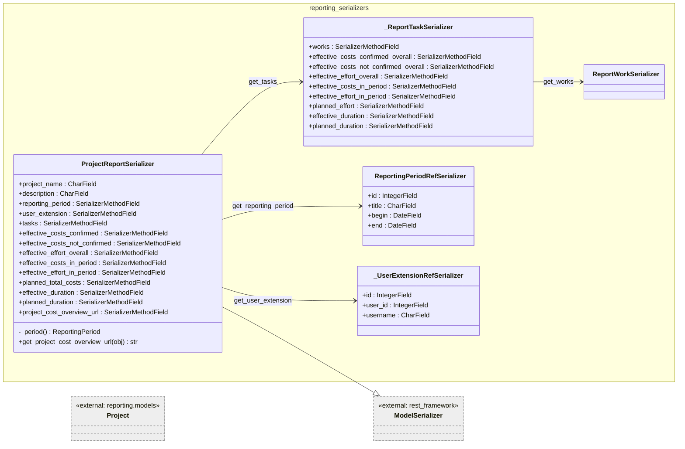
```mermaid
classDiagram
    direction LR

    namespace reporting_serializers {
        class ProjectReportSerializer {
            +project_name : CharField
            +description : CharField
            +reporting_period : SerializerMethodField
            +user_extension : SerializerMethodField
            +tasks : SerializerMethodField
            +effective_costs_confirmed : SerializerMethodField
            +effective_costs_not_confirmed : SerializerMethodField
            +effective_effort_overall : SerializerMethodField
            +effective_costs_in_period : SerializerMethodField
            +effective_effort_in_period : SerializerMethodField
            +planned_total_costs : SerializerMethodField
            +effective_duration : SerializerMethodField
            +planned_duration : SerializerMethodField
            +project_cost_overview_url : SerializerMethodField
            -_period() ReportingPeriod
            +get_project_cost_overview_url(obj) str
        }
        class _ReportTaskSerializer {
            +works : SerializerMethodField
            +effective_costs_confirmed_overall : SerializerMethodField
            +effective_costs_not_confirmed_overall : SerializerMethodField
            +effective_effort_overall : SerializerMethodField
            +effective_costs_in_period : SerializerMethodField
            +effective_effort_in_period : SerializerMethodField
            +planned_effort : SerializerMethodField
            +effective_duration : SerializerMethodField
            +planned_duration : SerializerMethodField
        }
        class _ReportWorkSerializer {
        }
        class _ReportingPeriodRefSerializer {
            +id : IntegerField
            +title : CharField
            +begin : DateField
            +end : DateField
        }
        class _UserExtensionRefSerializer {
            +id : IntegerField
            +user_id : IntegerField
            +username : CharField
        }
    }

    class ModelSerializer:::external {
        <<external: rest_framework>>
    }
    class Project:::external {
        <<external: reporting.models>>
    }

    ProjectReportSerializer --|> ModelSerializer
    ProjectReportSerializer --> _ReportTaskSerializer : get_tasks
    ProjectReportSerializer --> _ReportingPeriodRefSerializer : get_reporting_period
    ProjectReportSerializer --> _UserExtensionRefSerializer : get_user_extension
    _ReportTaskSerializer --> _ReportWorkSerializer : get_works

    classDef external fill:#eee,stroke:#999,stroke-dasharray:4 4;
```

*Figure 16: ProjectReportSerializer and its private support serializers.*

`ProjectReportSerializer` produces the full JSON snapshot consumed by the Java pdf-export-service. The shape mirrors the legacy `Project.serialize_to_xml` output element-for-element. All aggregate fields are computed via model methods on `Project` and `Task` (e.g. `effective_costs_confirmed()`, `planned_total_costs()`). The `reporting_period` context value, injected by the calling ViewSet, determines whether aggregates are period-scoped or project-wide.

The `get_project_cost_overview_url` method lazily imports `upload_project_cost_overview_svg` from `services.chart_storage` to avoid the heavy matplotlib import at module load time. It renders the cost-overview chart and uploads it to S3, returning a presigned URL.

`_ReportTaskSerializer` (private module-level) serializes per-task aggregates. The `get_planned_effort` method intentionally calls `obj.planned_costs()` rather than a hypothetical `planned_effort()`, mirroring the original XML serializer's behaviour.

`_ReportWorkSerializer`, `_ReportingPeriodRefSerializer`, and `_UserExtensionRefSerializer` are lightweight private serializers used exclusively within this module.

---

#### Task Serializers

**Figure 17 — Task serializer class diagram**

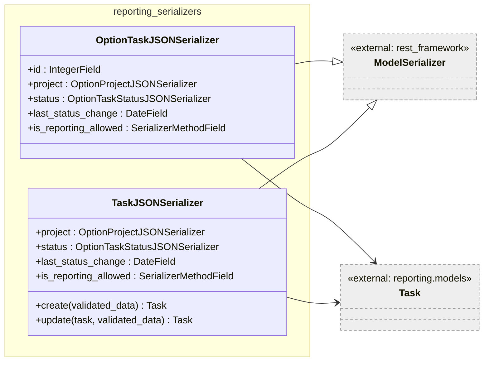
```mermaid
classDiagram
    direction LR

    namespace reporting_serializers {
        class OptionTaskJSONSerializer {
            +id : IntegerField
            +project : OptionProjectJSONSerializer
            +status : OptionTaskStatusJSONSerializer
            +last_status_change : DateField
            +is_reporting_allowed : SerializerMethodField
        }
        class TaskJSONSerializer {
            +project : OptionProjectJSONSerializer
            +status : OptionTaskStatusJSONSerializer
            +last_status_change : DateField
            +is_reporting_allowed : SerializerMethodField
            +create(validated_data) Task
            +update(task, validated_data) Task
        }
    }

    class ModelSerializer:::external {
        <<external: rest_framework>>
    }
    class Task:::external {
        <<external: reporting.models>>
    }

    OptionTaskJSONSerializer --|> ModelSerializer
    TaskJSONSerializer --|> ModelSerializer
    OptionTaskJSONSerializer --> Task
    TaskJSONSerializer --> Task

    classDef external fill:#eee,stroke:#999,stroke-dasharray:4 4;
```

*Figure 17: Task serializer classes.*

`OptionTaskJSONSerializer` is a read-only nested reference serializer used inside `WorkSerializer` and elsewhere. `TaskJSONSerializer` is the full read-write serializer. Both expose `is_reporting_allowed` as a string method field. The `create` and `update` methods resolve nested `project` and `status` objects by their `id` fields before saving.

---

#### Work Serializers

**Figure 18 — Work serializer class diagram**

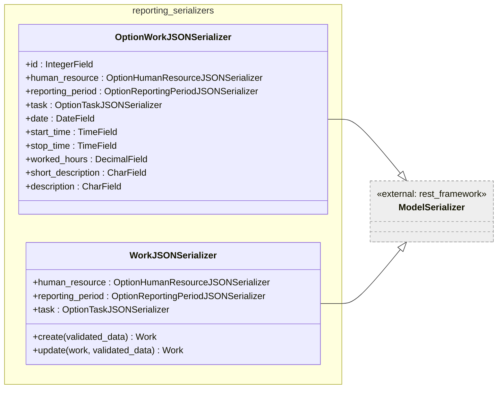
```mermaid
classDiagram
    direction LR

    namespace reporting_serializers {
        class OptionWorkJSONSerializer {
            +id : IntegerField
            +human_resource : OptionHumanResourceJSONSerializer
            +reporting_period : OptionReportingPeriodJSONSerializer
            +task : OptionTaskJSONSerializer
            +date : DateField
            +start_time : TimeField
            +stop_time : TimeField
            +worked_hours : DecimalField
            +short_description : CharField
            +description : CharField
        }
        class WorkJSONSerializer {
            +human_resource : OptionHumanResourceJSONSerializer
            +reporting_period : OptionReportingPeriodJSONSerializer
            +task : OptionTaskJSONSerializer
            +create(validated_data) Work
            +update(work, validated_data) Work
        }
    }

    class ModelSerializer:::external {
        <<external: rest_framework>>
    }

    OptionWorkJSONSerializer --|> ModelSerializer
    WorkJSONSerializer --|> ModelSerializer

    classDef external fill:#eee,stroke:#999,stroke-dasharray:4 4;
```

*Figure 18: Work serializer classes.*

`WorkJSONSerializer` resolves nested `human_resource`, `reporting_period`, and `task` objects by id in both `create` and `update`. The `start_time` and `stop_time` fields allow null values and are optional, supporting the worked-hours-only recording mode.

---

#### HumanResource Serializers

**Figure 19 — HumanResource serializer class diagram**

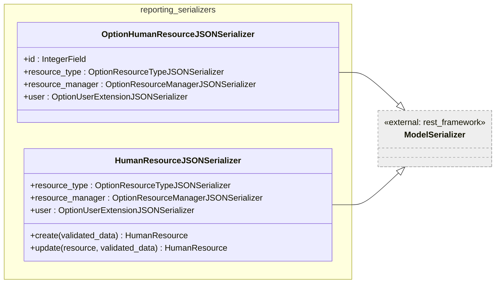
```mermaid
classDiagram
    direction LR

    namespace reporting_serializers {
        class OptionHumanResourceJSONSerializer {
            +id : IntegerField
            +resource_type : OptionResourceTypeJSONSerializer
            +resource_manager : OptionResourceManagerJSONSerializer
            +user : OptionUserExtensionJSONSerializer
        }
        class HumanResourceJSONSerializer {
            +resource_type : OptionResourceTypeJSONSerializer
            +resource_manager : OptionResourceManagerJSONSerializer
            +user : OptionUserExtensionJSONSerializer
            +create(validated_data) HumanResource
            +update(resource, validated_data) HumanResource
        }
    }

    class ModelSerializer:::external {
        <<external: rest_framework>>
    }

    OptionHumanResourceJSONSerializer --|> ModelSerializer
    HumanResourceJSONSerializer --|> ModelSerializer

    classDef external fill:#eee,stroke:#999,stroke-dasharray:4 4;
```

*Figure 19: HumanResource serializer classes.*

Both serializers expose the `user` field as the nested `OptionUserExtensionJSONSerializer`. The writable `HumanResourceJSONSerializer.create` and `update` methods resolve `resource_type`, `resource_manager`, and `user` nested objects by `id`.

---

#### HumanResourceWorkReportSerializer and WorkReportBuilder

**Figure 20 — Work report serializer and builder**

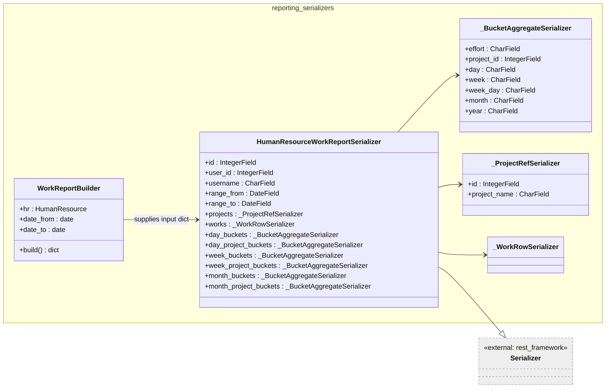
```mermaid
classDiagram
    direction LR

    namespace reporting_serializers {
        class HumanResourceWorkReportSerializer {
            +id : IntegerField
            +user_id : IntegerField
            +username : CharField
            +range_from : DateField
            +range_to : DateField
            +projects : _ProjectRefSerializer
            +works : _WorkRowSerializer
            +day_buckets : _BucketAggregateSerializer
            +day_project_buckets : _BucketAggregateSerializer
            +week_buckets : _BucketAggregateSerializer
            +week_project_buckets : _BucketAggregateSerializer
            +month_buckets : _BucketAggregateSerializer
            +month_project_buckets : _BucketAggregateSerializer
        }
        class WorkReportBuilder {
            +hr : HumanResource
            +date_from : date
            +date_to : date
            +build() dict
        }
        class _BucketAggregateSerializer {
            +effort : CharField
            +project_id : IntegerField
            +day : CharField
            +week : CharField
            +week_day : CharField
            +month : CharField
            +year : CharField
        }
        class _ProjectRefSerializer {
            +id : IntegerField
            +project_name : CharField
        }
        class _WorkRowSerializer {
        }
    }

    class Serializer:::external {
        <<external: rest_framework>>
    }

    HumanResourceWorkReportSerializer --|> Serializer
    HumanResourceWorkReportSerializer --> _BucketAggregateSerializer
    HumanResourceWorkReportSerializer --> _ProjectRefSerializer
    HumanResourceWorkReportSerializer --> _WorkRowSerializer
    WorkReportBuilder --> HumanResourceWorkReportSerializer : supplies input dict

    classDef external fill:#eee,stroke:#999,stroke-dasharray:4 4;
```

*Figure 20: HumanResourceWorkReportSerializer and WorkReportBuilder.*

`WorkReportBuilder` constructs the nested dict structure that `HumanResourceWorkReportSerializer` consumes. The serializer itself is read-only (no `Meta.model` and no write methods); `WorkReportBuilder.build()` is the sole producer.

The `effort` field in `_BucketAggregateSerializer` is typed as `CharField`, not `DecimalField`, because the legacy XML uses the literal string `"-"` for days that fall outside the requested range but within the calendar month. This convention signals the XSL renderer to leave cells blank rather than showing zero.

**`WorkReportBuilder.build() -> dict`**

The build method operates in three phases:

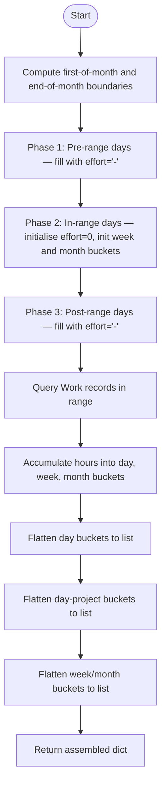
```mermaid
flowchart TD
    A([Start]) --> B[Compute first-of-month and end-of-month boundaries]
    B --> C[Phase 1: Pre-range days — fill with effort='-']
    C --> D[Phase 2: In-range days — initialise effort=0, init week and month buckets]
    D --> E[Phase 3: Post-range days — fill with effort='-']
    E --> F[Query Work records in range]
    F --> G[Accumulate hours into day, week, month buckets]
    G --> H[Flatten day buckets to list]
    H --> I[Flatten day-project buckets to list]
    I --> J[Flatten week/month buckets to list]
    J --> K[Return assembled dict]
```

*Figure 21: WorkReportBuilder.build control flow.*

The module-level `_isokeys(d)` helper returns a dict of `{day, week, week_day, month, year}` strings for a given date using `date.isocalendar()`.

---

#### ReportingPeriod Serializers

`OptionReportingPeriodJSONSerializer` is a read-only reference serializer embedding the nested `OptionProjectJSONSerializer` and `OptionReportingPeriodStatusJSONSerializer`. `ReportingPeriodJSONSerializer` is the full read-write serializer; `create` and `update` resolve the `project` and `status` nested objects by id.

---

#### Agreement Serializers

`AgreementJSONSerializer` wraps `Agreement` with full nested representations of `task`, `resource`, `unit`, `type`, `status`, and `costs`. The `create` method resolves all six nested objects by id in sequence. The `update` method follows the same pattern. Both write methods pop nested dicts from `validated_data` before assigning resolved model instances.

---

#### Estimation Serializers

`EstimationJSONSerializer` wraps `Estimation` with nested `task`, `resource`, and `status` representations. The `reporting_period` field is treated as a plain FK (PrimaryKeyRelatedField via `ModelSerializer` default) rather than a nested serializer.

---

#### Reference-Data Serializers (Option/Writable pairs)

Each lookup model has a pair of serializers:

| Model | Option serializer (read-only) | Writable serializer |
|---|---|---|
| `AgreementStatus` | `OptionAgreementStatusJSONSerializer` | `AgreementStatusJSONSerializer` |
| `AgreementType` | `OptionAgreementTypeJSONSerializer` | `AgreementTypeJSONSerializer` |
| `EstimationStatus` | `OptionEstimationStatusJSONSerializer` | `EstimationStatusJSONSerializer` |
| `ProjectStatus` | `OptionProjectStatusJSONSerializer` | `ProjectStatusJSONSerializer` |
| `ReportingPeriodStatus` | `OptionReportingPeriodStatusJSONSerializer` | `ReportingPeriodStatusJSONSerializer` |
| `ResourceType` | `OptionResourceTypeJSONSerializer` | `ResourceTypeJSONSerializer` |
| `ResourceManager` | `OptionResourceManagerJSONSerializer` | `ResourceManagerJSONSerializer` |
| `ResourcePrice` | `OptionResourcePriceJSONSerializer` | `ResourcePricesSONSerializer` |
| `Resource` | `OptionResourceJSONSerializer` | `ResourceJSONSerializer` |

The Option variants mark all fields `read_only=True` and include the `id` field as an `IntegerField(required=False)`, allowing them to be used as nested write targets (the outer serializer reads the `id` and resolves the object itself). The writable variants include `create` and `update` methods that pop and resolve nested objects from `validated_data`.

`GenericProjectLinkJSONSerializer` and `GenericTaskLinkJSONSerializer` expose `fields = '__all__'` with no custom logic.

`ProjectLinkTypeJSONSerializer` and `TaskLinkTypeJSONSerializer` likewise expose `fields = '__all__'`.

---

## Detailed Stand-alone Functions

### `_isokeys(d: datetime.date) -> dict[str, str]`

Module: `koalixcrm/reporting/serializers/human_resource_report_serializer.py`

Returns a dict containing the ISO calendar attributes of `d`:

```python
{"day": str(d.day), "week": str(iso[1]), "week_day": str(d.isoweekday()),
 "month": str(d.month), "year": str(d.year)}
```

Used by `WorkReportBuilder.build` to annotate each day-bucket entry with the time attributes the XSL template queries.

---

## Access to External Interfaces

| Interface | Type of Call | Expected Duration | Notes |
|---|---|---|---|
| PostgreSQL (Django ORM) | Blocking Read/Write | 10–50 ms | All ViewSet list/retrieve/create/update/destroy operations. |
| S3 / MinIO (via `chart_storage`) | Blocking Write then Read | 200–800 ms | `upload_project_cost_overview_svg` is called inline during `ProjectReportSerializer.get_project_cost_overview_url`. This makes the `/projects/<id>/report-data/` response time dependent on S3 latency. |

---

## Security

### Assets

| Asset | Description | Security Measure | Assessment of Criticality |
|---|---|---|---|
| Presigned S3 URL | Time-limited URL embedded in the report-data response | URL TTL controlled by `PRESIGNED_URL_EXPIRES_IN` env var (default 300 s) | Uncritical — URL expires and grants read-only access to one SVG object. |
| `work_id` hidden field | Hidden form field in `WorkEntry` that identifies the `Work` row to update | `update_work` enforces that the resolved `Work` belongs to the current human resource; tampered ids are rejected with `PermissionDenied` | Uncritical — ownership check is in place. |

---

## Design Patterns Used

**Option/Writable serializer pair:** Every domain entity with nested foreign-key fields uses two serializers: a read-only `Option*` variant for use as a nested field in other serializers (avoiding deep write recursion), and a full `*JSONSerializer` with explicit `create`/`update` that resolves nested objects by id. This avoids DRF's writable nested serializer complexity while keeping the API response shape consistent between reads and writes.

**Method field for reporting-allowed flag:** The `is_reporting_allowed` field on both `ProjectJSONSerializer` and `TaskJSONSerializer` is a `SerializerMethodField` returning the string `"True"`/`"False"` rather than a boolean. This preserves parity with the legacy XML serializer output format that the Java side tested for.

**Builder pattern for report snapshots:** `WorkReportBuilder` separates the aggregation logic from the serialization concern. The `HumanResourceViewSet.work_report_data` action instantiates the builder, calls `build()`, then passes the plain dict through `HumanResourceWorkReportSerializer`. This makes the aggregation logic independently testable.

---

## External Dependencies

| Requirement | Version/Details | Notes |
|---|---|---|
| `djangorestframework` | DRF 3.x | All ViewSets and serializers. |
| `drf-spectacular` | `extend_schema_field` decorator | Used in `ProjectJSONSerializer` and `TaskJSONSerializer` for OpenAPI schema hints. |
| `python-dateutil` | `relativedelta` | Used in `WorkReportBuilder.build` for month arithmetic. |

---

## Appendix

### References

- `koalixcrm/reporting/serializers/project_report_serializer.py`
- [Chart storage service](QQ_LL_Doc_Reporting_ServicesAdmin.md)
- [Project and Task model documentation](QQ_LL_Doc_Reporting_ProjectTaskModels.md)

### List of Illustrations

| Figure | Title |
|---|---|
| Figure 1 | Reporting ViewSet hierarchy |
| Figure 2 | ProjectViewSet class diagram |
| Figure 3 | ProjectViewSet.report_data control flow |
| Figure 4 | HumanResourceViewSet class diagram |
| Figure 5 | HumanResourceViewSet.work_report_data control flow |
| Figure 6 | RangeSelectionForm class diagram |
| Figure 7 | WorkEntry class diagram |
| Figure 8 | WorkEntry.check_working_hours control flow |
| Figure 9 | WorkEntry.update_work control flow |
| Figure 10 | BaseWorkEntryFormset class diagram |
| Figure 11 | (used as label for work_report section) |
| Figure 12 | work_report view function control flow |
| Figure 13 | CreateTaskView class diagram |
| Figure 14 | CreateTaskView.create_task_from_commercial_document_position control flow |
| Figure 15 | Project serializer classes |
| Figure 16 | ProjectReportSerializer and its private support serializers |
| Figure 17 | Task serializer classes |
| Figure 18 | Work serializer classes |
| Figure 19 | HumanResource serializer classes |
| Figure 20 | HumanResourceWorkReportSerializer and WorkReportBuilder |
| Figure 21 | WorkReportBuilder.build control flow |
