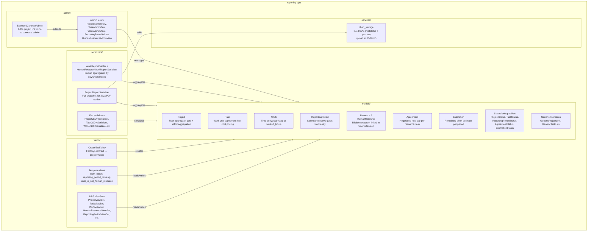
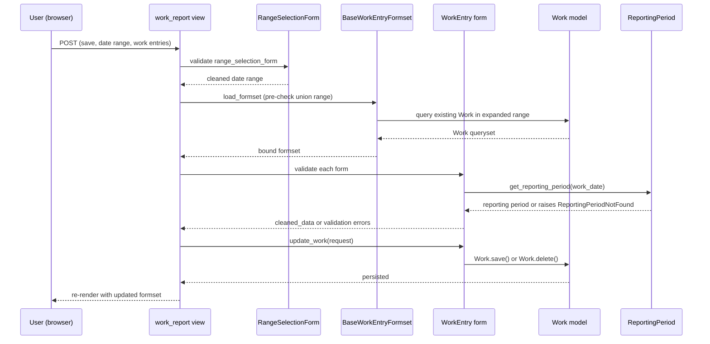
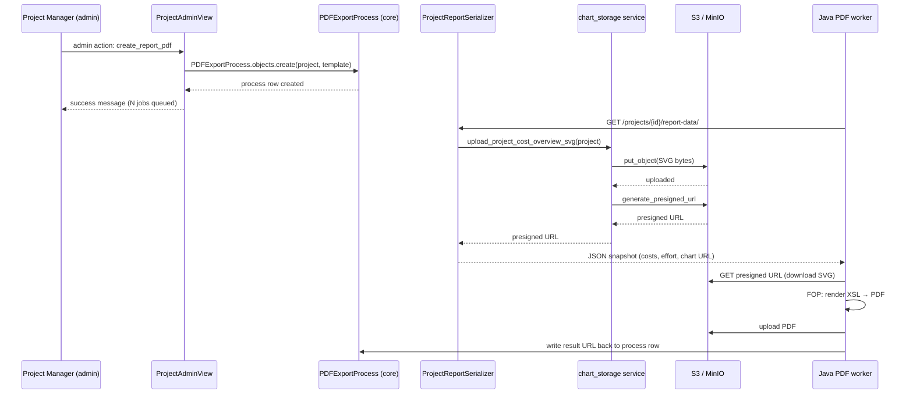
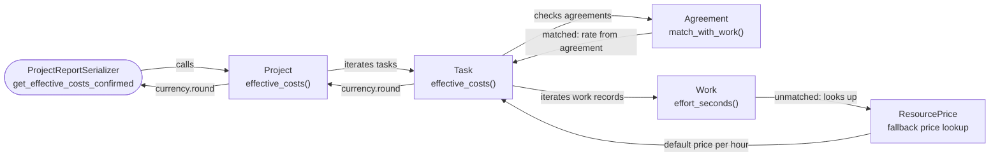
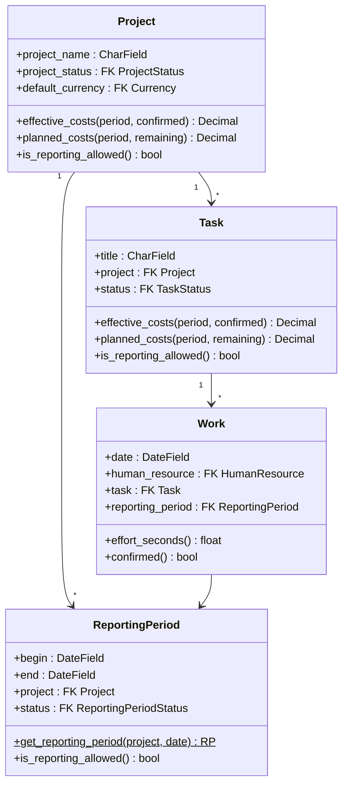
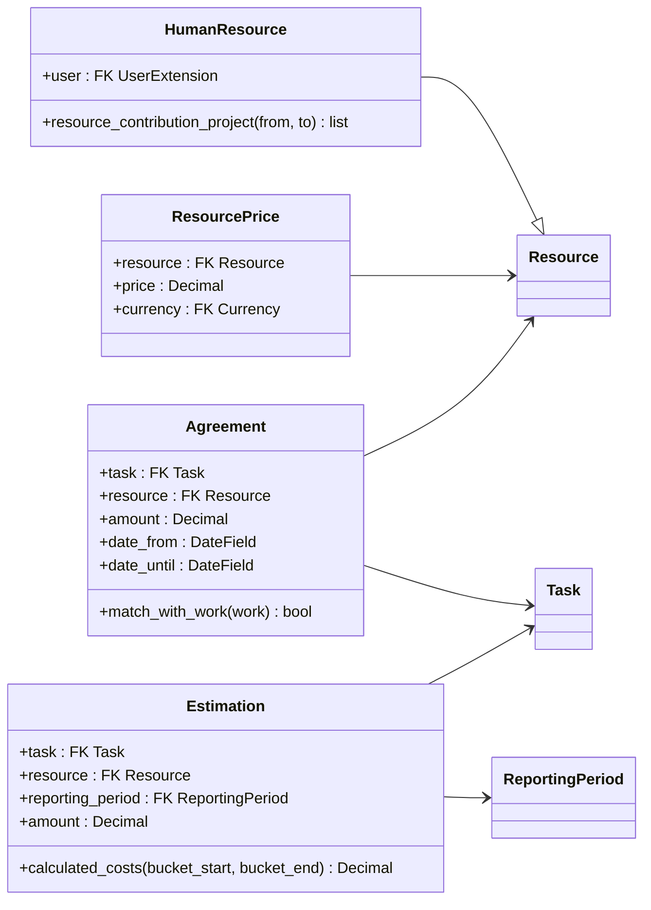
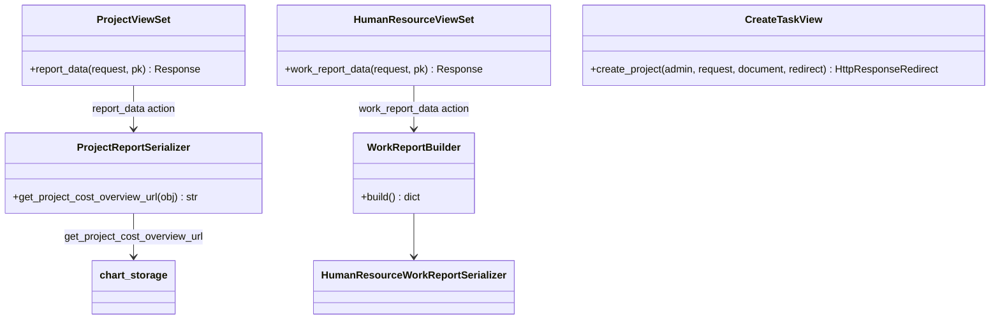

# Mid-Level Documentation — Reporting App

## Introduction

### Purpose of the Package

The `reporting` app provides the project, time-tracking, and cost-reporting subsystem of koalixcrm. Its core responsibility is to let human resources record work against tasks, let project managers define cost agreements with resources, and let the system aggregate planned versus actual costs and effort into PDF snapshots and SVG charts for stakeholders.

The app sits between the commercial document lifecycle (handled by the `contracts` app) and the user identity layer (handled by `djangoUserExtension`). It owns the authoritative definition of a `Project` and its associated `Task`, `Work`, `ReportingPeriod`, `Agreement`, and `Estimation` records — concepts that other apps reference but do not own.

### Contents Overview

| Sub-package / module | Responsibility |
|---|---|
| `models/` | Domain model: `Project`, `Task`, `Work`, `ReportingPeriod` (and their status lookup tables), `Resource`, `HumanResource`, `ResourcePrice`, `Agreement`, `Estimation`, generic link tables |
| `views/` | DRF ViewSets for all domain entities, template views for the time-tracking UI (`work_report`), recovery views (`reporting_period_missing`, `user_is_not_human_resource`), and the `CreateTaskView` factory |
| `serializers/` | DRF serializers: flat read-write pairs (`*JSONSerializer`), the full project report snapshot (`ProjectReportSerializer`), and the human-resource work-report builder (`WorkReportBuilder` + `HumanResourceWorkReportSerializer`) |
| `services/` | `chart_storage` — builds the cost-overview SVG via matplotlib/pandas and uploads it to S3/MinIO |
| `admin/` | Django Admin registrations for all domain entities, admin actions for PDF export queuing (`create_report_pdf`, `create_work_report_pdf`), and the `ExtendedContractAdmin` extension |
| `signals/` | Empty module — no signal handlers are currently registered |
| `migrations/` | Django schema migrations (`0001_initial.py`, `0002_workspace_scoping.py`) |

### Target Audience

Software development engineers who need to integrate with, extend, or maintain the reporting subsystem of koalixcrm. Readers are expected to be familiar with Django, Django REST Framework, and the koalixcrm multi-tenant (`workspace`) model.

### Glossary

| Term/Acronym | Full Form | Description |
|---|---|---|
| CRM | Customer Relationship Management | The umbrella application (`koalixcrm`) this module belongs to. |
| DRF | Django REST Framework | The HTTP API library used for all JSON endpoints. |
| FK | Foreign Key | A database relationship field pointing to another table. |
| MTI | Multi-Table Inheritance | Django pattern where a child model extends a parent model via a shared primary key. |
| ORM | Object-Relational Mapper | Django's abstraction layer over the database. |
| RP / Reporting Period | — | A calendar-bounded window within a project used to gate work entry and cost confirmation. |
| WSM | WorkspaceScopedModel | The abstract base class (from `core`) that adds a `workspace` FK and a workspace-aware ORM manager to every tenant-scoped model. |
| SVG | Scalable Vector Graphics | Vector image format used for the project cost overview chart. |
| SQS | Amazon Simple Queue Service | AWS managed message queue used to enqueue PDF export jobs consumed by the Java pdf-export-service. |
| FOP | Apache Formatting Objects Processor | Java component that converts XSL-FO markup to PDF. |
| Presigned URL | S3 Presigned URL | A time-limited, self-authenticating URL for a single S3 object. |
| is_done | — | Boolean flag on status lookup models that marks a terminal lifecycle state. |
| is_agreed | — | Boolean flag on `AgreementStatus` that activates an agreement for cost matching. |
| is_obsolete | — | Boolean flag on `EstimationStatus` that marks an estimation as superseded. |

---

## Package Diagram

*Figure 1: Internal structure of the reporting app. Arrows indicate the direction of primary data access.*

Related low-level documentation:

- [Project, Task, Work and ReportingPeriod models](QQ_LL_Doc_Reporting_ProjectTaskModels.md)
- [Resource, Agreement, Estimation and HumanResource models](QQ_LL_Doc_Reporting_ResourceAgreementModels.md)
- [Views and Serializers](QQ_LL_Doc_Reporting_ViewsSerializers.md)
- [Services and Admin](QQ_LL_Doc_Reporting_ServicesAdmin.md)

---

## Interaction Diagrams

### Time-Tracking Entry (work_report view)

A logged-in user navigates to `/work_report/` to log or edit their daily work. On GET the view renders a formset pre-populated with existing `Work` records in a default date window. On POST with the save action, the view validates each `WorkEntry` form and persists the changes.

*Figure 2: Sequence for a successful work-entry save via the time-tracking UI.*

### Project Cost Report PDF Export

A project manager selects one or more projects in the Django Admin and triggers the "Create report PDF" action. The PDF is rendered asynchronously by the Java pdf-export-service.

*Figure 3: Asynchronous PDF export sequence for a project cost report.*

### Cost Aggregation Data Flow

When `ProjectReportSerializer` calls `Project.effective_costs()` (and related methods), aggregation flows down the domain hierarchy.

*Figure 4: Aggregation path from serializer call to individual Work records and pricing sources.*

---

## Class Diagrams per Package

### Core domain model

*Figure 5: Core domain model relationships. For full field and method lists see [QQ_LL_Doc_Reporting_ProjectTaskModels.md](QQ_LL_Doc_Reporting_ProjectTaskModels.md).*

### Resource and pricing model

*Figure 6: Resource, pricing and estimation relationships. For full detail see [QQ_LL_Doc_Reporting_ResourceAgreementModels.md](QQ_LL_Doc_Reporting_ResourceAgreementModels.md).*

### Views and serializers

*Figure 7: Key ViewSet and serializer relationships. For full class hierarchies and serializer pairs see [QQ_LL_Doc_Reporting_ViewsSerializers.md](QQ_LL_Doc_Reporting_ViewsSerializers.md).*

---

## Design Patterns Used

**Aggregate root.** `Project` is the aggregate root for the project/task/work hierarchy. All cross-cutting cost and effort computations (`effective_costs`, `planned_costs`, `effective_effort`) flow downward: `Project` → `Task` → `Work` / `Estimation`. External callers interact with the aggregate through `Project` rather than directly querying child models.

**Status-flag–driven lifecycle.** Each entity (`Project`, `Task`, `ReportingPeriod`, `Agreement`, `Estimation`) has an associated status lookup model with one or two boolean flags (`is_done`, `is_agreed`, `is_obsolete`). These flags gate write operations (`is_reporting_allowed`, `confirmed`) and drive cost aggregation filters (confirmed vs. not-confirmed).

**Agreement-first cost allocation.** `Task.effective_costs()` matches each `Work` record against active `Agreement` entries first. Work not covered by any agreement falls back to the resource's default `ResourcePrice`. The `Agreement.match_with_work()` method encapsulates the matching logic, keeping the allocation algorithm in `Task.effective_costs()` free of agreement-specific conditions.

**Option / writable serializer pair.** Every domain entity with nested FK fields uses two DRF serializers: a read-only `Option*` variant for use as a nested field in other serializers, and a full `*JSONSerializer` with explicit `create`/`update` that resolves nested objects by `id`. This avoids DRF's writable nested serializer complexity while keeping read and write response shapes consistent.

**Builder pattern for report snapshots.** `WorkReportBuilder` separates the bucket-aggregation logic from serialization. `HumanResourceViewSet.work_report_data` instantiates the builder, calls `build()`, then passes the resulting plain dict through `HumanResourceWorkReportSerializer`. This makes the aggregation logic independently testable.

**Async job dispatch via PDFExportProcess.** Admin actions `create_report_pdf` and `create_work_report_pdf` do not synchronously produce PDFs. They create `PDFExportProcess` rows consumed by the Java pdf-export-service via SQS. The Java worker fetches the JSON snapshot from the `/report-data/` endpoint, calls `ProjectReportSerializer` (which in turn calls `chart_storage` to generate and upload the SVG), renders the XSL template via FOP, and posts a `CommercialDocumentMedia` record when done.

**Extended admin via unregister/re-register.** `ExtendedContractAdmin` adds a project-link inline to the `Contract` change page without modifying the `contracts` application itself. The reporting `admin/__init__.py` unregisters `Contract` from the contracts admin and re-registers it with the extended class.

---

## Dependencies on Other Modules

| Dependency | Direction | What is used |
|---|---|---|
| `koalixcrm.core` | Inbound | `WorkspaceScopedModel` (base class), `Currency.round()`, `Unit`, `PDFExportProcess`, `WorkspaceScopedModelAdmin`, `WorkspaceScopedViewSetMixin`, `BaseModelViewSet` |
| `koalixcrm.djangoUserExtension` | Inbound | `UserExtension` (FK on `HumanResource`, `ResourceManager`), `TemplateSet` (FK on `Project`) |
| `koalixcrm.products` | Inbound | `Price` — base class for `ResourcePrice` via MTI |
| `koalixcrm.contacts` | None (no direct dependency; contacts are reached through `contracts` → `Party`) | — |
| `koalixcrm.contracts` | Outbound (optional) | `Contract`, `CommercialDocument`, `CommercialDocumentPosition` — read by `CreateTaskView` when converting a commercial document into a project |
| `koalixcrm.shared` | Inbound | `BaseModelViewSet` |
| `koalixcrm_utils` | Inbound | `get_s3_client` — used by `chart_storage` for S3/MinIO access |

---

## External Dependencies

| Requirement | Version/Details | Notes |
|---|---|---|
| Django | ≥ 3.2 | ORM, admin, forms, signals |
| Django REST Framework | 3.x | All ViewSets and serializers |
| `drf-spectacular` | Any | `extend_schema_field` decorator on serializer method fields |
| `matplotlib` | ≥ 3.5 | Headless chart rendering (`Agg` backend); `chart_storage` |
| `pandas` | Compatible with installed matplotlib | DataFrame assembly for cost overview chart |
| `python-dateutil` | Any | `relativedelta` used in `WorkReportBuilder.build` for month arithmetic |
| PostgreSQL (via Django ORM) | Any version supported by Django | All model persistence |
| S3 / MinIO | AWS SDK compatible | Object storage for SVG chart upload and presigned URL generation |

---

## Testing

The LL documentation references no dedicated test files within the `reporting` app. Test coverage information is not available in the source files examined. Price and effort calculation logic in `Task.effective_costs()`, `Project.effective_costs()`, and `Estimation.calculated_costs()` constitutes the highest-value unit-test targets given the branching cost allocation algorithm.

---

## Appendix

### References

- [Project, Task, Work and ReportingPeriod models](QQ_LL_Doc_Reporting_ProjectTaskModels.md)
- [Resource, Agreement, Estimation and HumanResource models](QQ_LL_Doc_Reporting_ResourceAgreementModels.md)
- [Views and Serializers](QQ_LL_Doc_Reporting_ViewsSerializers.md)
- [Services and Admin](QQ_LL_Doc_Reporting_ServicesAdmin.md)
- Django ORM documentation: <https://docs.djangoproject.com/en/stable/topics/db/models/>
- Django REST Framework: <https://www.django-rest-framework.org/>
- matplotlib Agg backend: <https://matplotlib.org/stable/users/explain/figure/backends.html>

### List of Illustrations

| Figure | Title |
|---|---|
| Figure 1 | Reporting app internal structure |
| Figure 2 | Time-tracking entry sequence |
| Figure 3 | Project cost report PDF export sequence |
| Figure 4 | Cost aggregation data flow |
| Figure 5 | Project / Task / Work / ReportingPeriod relationships |
| Figure 6 | Resource / Agreement / Estimation relationships |
| Figure 7 | Key ViewSet and serializer relationships |
