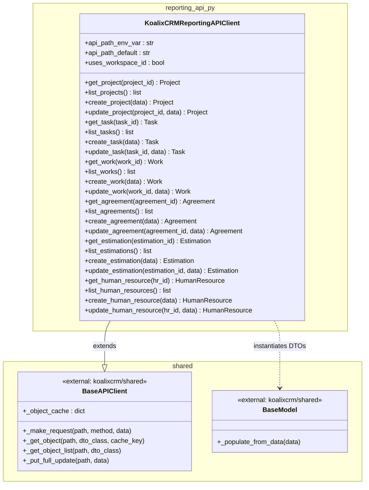
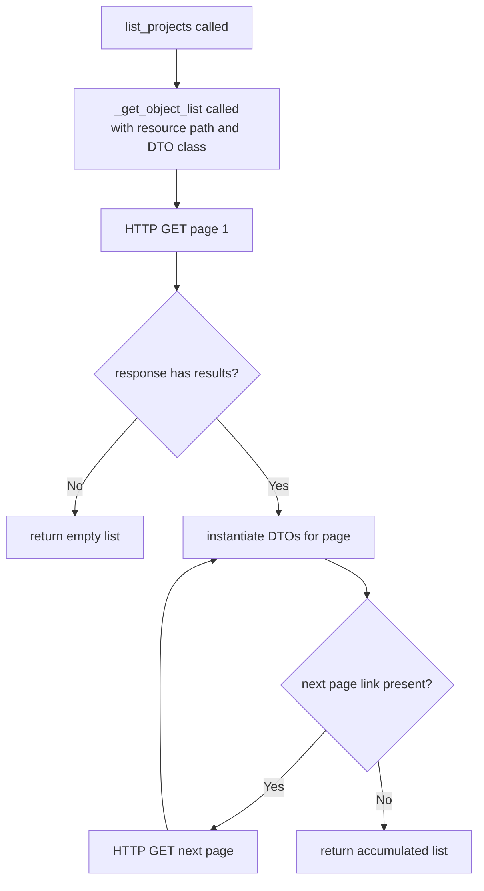
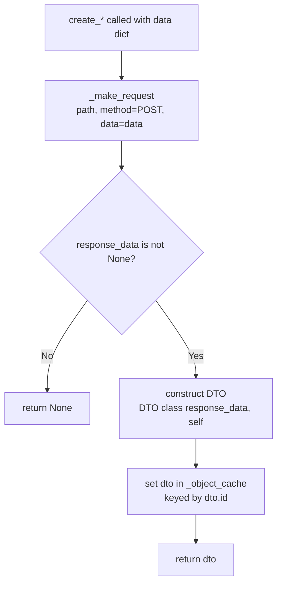
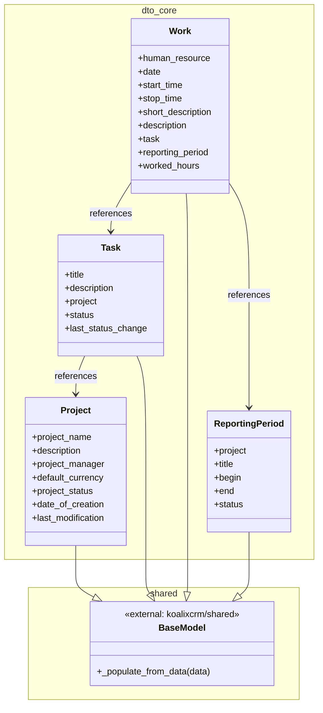
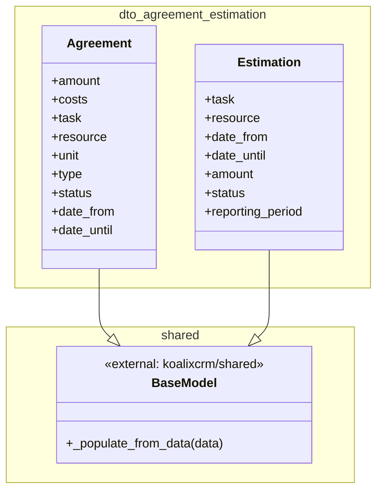
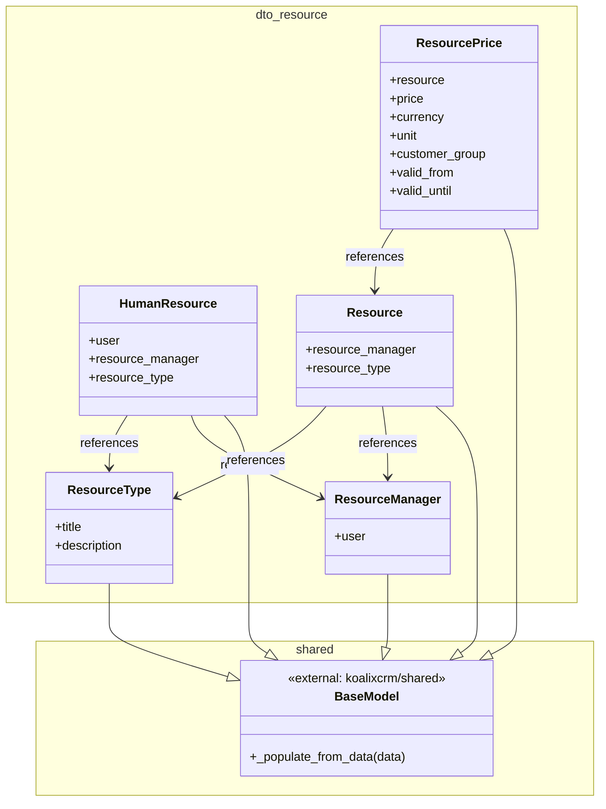
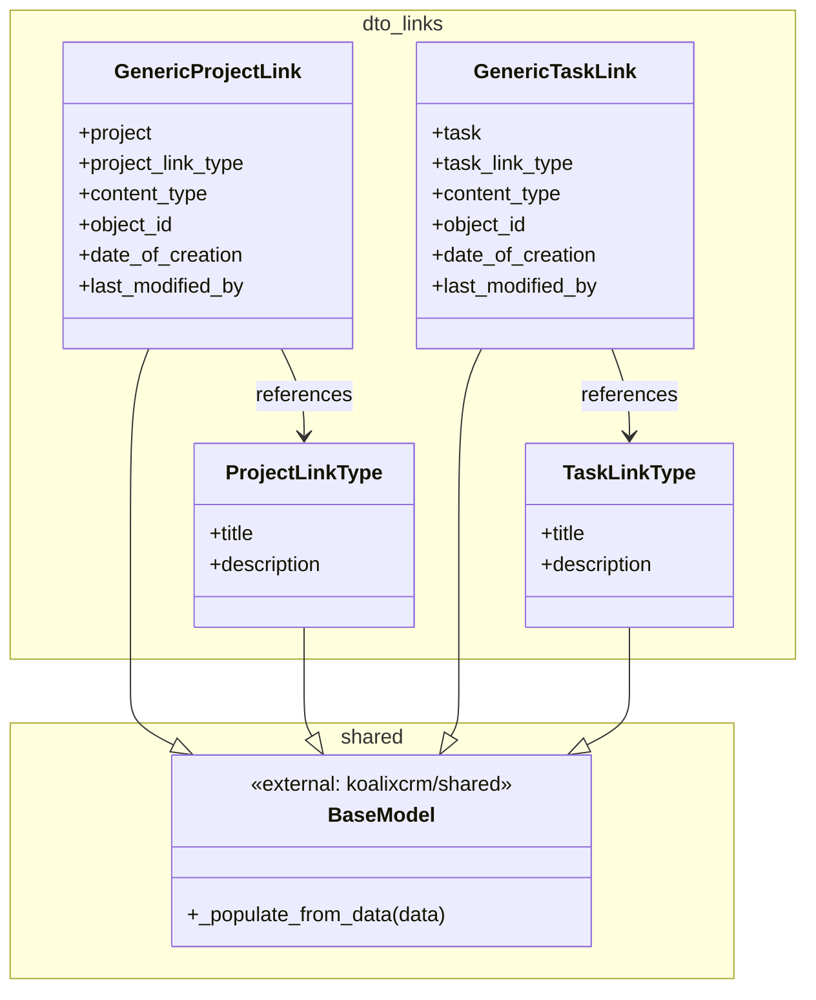
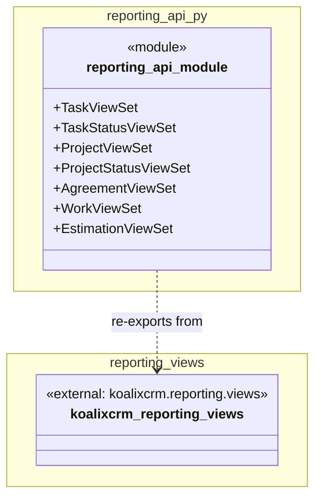

# Low-Level Documentation: `koalixcrm/reporting_api_py`

**Document type:** QQ Low-Level Component Documentation
**Package:** `koalixcrm/reporting_api_py`
**Date:** 2026-06-26
**Status:** Generated

---

## 1. Introduction

### 1.1 Scope

This document covers the internal structure, responsibilities, and design decisions of the
`koalixcrm/reporting_api_py` Python package. The package provides:

1. `KoalixCRMReportingAPIClient` — a typed API client for the KoalixCRM Reporting REST API,
   responsible for issuing HTTP requests, deserialising responses into Data Transfer Objects
   (DTOs), and maintaining an in-process object cache.
2. Twenty-two DTO classes located under `reporting_api_py/dto/` — each models one resource
   type exposed by the reporting API.
3. `reporting_api.py` — a thin re-export shim that makes the Django REST Framework ViewSets
   defined under `koalixcrm.reporting.views.*` importable from this package's namespace.

Source files covered:

| File | Primary symbol |
|---|---|
| `koalixcrm/reporting_api_py/reporting_api_client.py` | `KoalixCRMReportingAPIClient` |
| `koalixcrm/reporting_api_py/reporting_api.py` | ViewSet re-export module |
| `koalixcrm/reporting_api_py/dto/*.py` | 22 DTO classes |

### 1.2 Target Audience

- Backend developers extending or maintaining the Celery-based M2M integration layer.
- Developers adding new resource types to the reporting sub-system.
- Reviewers performing code or architecture audits of the inter-service communication layer.

### 1.3 Glossary

| Term | Definition |
|---|---|
| API Client | A class that encapsulates HTTP communication with a specific REST API endpoint set. |
| BaseAPIClient | The shared abstract base class (`koalixcrm/shared/api_client.py`) that implements the M2M OAuth2 token flow, request routing, and the object cache. |
| BaseModel | The shared abstract base class (`koalixcrm/shared/base_model.py`) that implements `_populate_from_data` and attribute hydration from a raw response dictionary. |
| DTO (Data Transfer Object) | A lightweight object that carries data returned by a single REST resource, with no business logic. |
| Object Cache | An in-memory dictionary keyed by resource id, held on the client instance, used to avoid redundant HTTP requests within a single execution context. |
| M2M | Machine-to-machine; refers to the OAuth2 client-credentials flow used by Celery workers to authenticate against the API. |
| ViewSet | A Django REST Framework class that groups list/create/retrieve/update/destroy handlers for one resource. |
| Reporting API | The `/koalixcrm_reporting/api/v1/` REST API surface served by the Django application. |

---

## 2. Detailed Component: `KoalixCRMReportingAPIClient`

### 2.1 Class Diagram

The following diagram shows `KoalixCRMReportingAPIClient` together with the external types it
inherits from and delegates to. To stay within readability limits the 22 DTOs are shown as a
single stereotype group here; each DTO group has its own diagram in Section 3.



### 2.2 Description

`KoalixCRMReportingAPIClient` is a concrete API client class. It does not override
`__init__`; the parent `BaseAPIClient` constructor reads the API base URL from the
`KOALIXCRM_API_URL` environment variable, appends the path resolved from
`KOALIXCRM_REPORTING_API_PATH` (defaulting to `/koalixcrm_reporting/api/v1/`), and
initialises the in-process object cache and the OAuth2 M2M token state.

The class attribute `uses_workspace_id = True` instructs `BaseAPIClient` to include a
workspace identifier segment in every constructed URL, enabling multi-tenant API routing.

All public methods follow one of three patterns — get-single, list-all, create, or
update — described in detail below.

### 2.3 Class-Level Attributes

`api_path_env_var` names the environment variable (`KOALIXCRM_REPORTING_API_PATH`) that
overrides the default API sub-path. `api_path_default` provides the fallback value
(`/koalixcrm_reporting/api/v1/`). `uses_workspace_id` is a boolean flag read by the
parent to decide whether to embed the workspace id in the URL path.

### 2.4 Public Methods

The methods below are grouped by resource. Within each resource the four operations
follow the same structural pattern; representative flow diagrams are given once for
the create and list patterns.

#### 2.4.1 get\_\* methods

**Signature (representative):**

```python
def get_project(self, project_id: int) -> Project | None
```

**Arguments:** a single integer resource identifier.

**Purpose:** Retrieve one resource by primary key. Delegates to `_get_object` on
`BaseAPIClient`, which checks the object cache first and only issues an HTTP GET if
the id is not found. Returns a hydrated DTO instance or `None` if the API returns no
result.

**Available get methods:** `get_project`, `get_project_status`, `get_task`,
`get_task_status`, `get_work`, `get_agreement`, `get_agreement_status`,
`get_agreement_type`, `get_estimation`, `get_estimation_status`,
`get_human_resource`, `get_resource`, `get_resource_type`, `get_resource_manager`,
`get_resource_price`, `get_reporting_period`, `get_reporting_period_status`,
`get_project_link_type`, `get_task_link_type`, `get_generic_project_link`,
`get_generic_task_link`.

#### 2.4.2 list\_\* methods

**Signature (representative):**

```python
def list_projects(self) -> list[Project]
```

**Arguments:** none.

**Purpose:** Retrieve all resources of the given type. Delegates to
`_get_object_list` on `BaseAPIClient`, which handles DRF pagination by following
`next` links until exhausted, accumulating DTO instances, and returning the full
list.

**Flow diagram for the list pattern:**



**Available list methods:** `list_projects`, `list_project_statuses`, `list_tasks`,
`list_task_statuses`, `list_works`, `list_agreements`, `list_agreement_statuses`,
`list_agreement_types`, `list_estimations`, `list_estimation_statuses`,
`list_human_resources`, `list_resources`, `list_resource_types`,
`list_resource_managers`, `list_resource_prices`, `list_reporting_periods`,
`list_reporting_period_statuses`, `list_project_link_types`, `list_task_link_types`,
`list_generic_project_links`, `list_generic_task_links`.

#### 2.4.3 create\_\* methods

**Signature (representative):**

```python
def create_project(self, data: dict) -> Project | None
```

**Arguments:** `data` — a dictionary whose keys correspond to the writable fields of
the target resource.

**Purpose:** POST a new resource to the API. On success the raw response dictionary
is used to construct a DTO, which is stored in the object cache keyed by its `id`
field, and then returned to the caller. If the response carries no data the method
returns `None`.

**Flow diagram (shared by all create\_\* methods):**



**Available create methods:** `create_project`, `create_project_status`,
`create_task`, `create_task_status`, `create_work`, `create_agreement`,
`create_agreement_status`, `create_agreement_type`, `create_estimation`,
`create_estimation_status`, `create_human_resource`, `create_resource`,
`create_resource_type`, `create_resource_manager`, `create_resource_price`,
`create_reporting_period`, `create_reporting_period_status`,
`create_project_link_type`, `create_task_link_type`, `create_generic_project_link`,
`create_generic_task_link`.

#### 2.4.4 update\_\* methods

**Signature (representative):**

```python
def update_project(self, project_id: int, data: dict) -> Project | None
```

**Arguments:** `project_id` — the integer primary key of the resource to replace;
`data` — a dictionary carrying all writable fields (full replacement semantics).

**Purpose:** Perform a full replacement (HTTP PUT) of the identified resource.
Delegates entirely to `_put_full_update` on `BaseAPIClient`, which constructs the
resource URL, issues the PUT, deserialises the response, updates the cache, and
returns the refreshed DTO.

**Available update methods:** `update_project`, `update_project_status`,
`update_task`, `update_task_status`, `update_work`, `update_agreement`,
`update_agreement_status`, `update_agreement_type`, `update_estimation`,
`update_estimation_status`, `update_human_resource`, `update_resource`,
`update_resource_type`, `update_resource_manager`, `update_resource_price`,
`update_reporting_period`, `update_reporting_period_status`,
`update_project_link_type`, `update_task_link_type`, `update_generic_project_link`,
`update_generic_task_link`.

---

## 3. Detailed Component: DTO Classes

All 22 DTO classes follow the same structural contract:

- Extend `BaseModel` from `koalixcrm/shared/base_model.py`.
- Accept `(data: dict, client: BaseAPIClient | None = None)` in their constructor.
- Call `super().__init__(data)`, which delegates to `_populate_from_data(data)` on
  `BaseModel` to hydrate instance attributes from the response dictionary.
- Carry no business logic; all fields are set by `_populate_from_data`.

The DTOs are grouped below into four logical clusters to keep each diagram within the
nine-component / fifteen-connection readability budget.

### 3.1 Core Project and Work Entities

This group covers the primary scheduling and time-tracking resources.



**Project** represents a top-level project entity. `project_name` holds the
human-readable identifier. `description` is a free-text field. `project_manager`
holds a reference to the managing user. `default_currency` names the currency used
for cost calculations. `project_status` holds a foreign-key reference to a
`ProjectStatus` resource. `date_of_creation` and `last_modification` are ISO-8601
timestamp strings.

**Task** represents a unit of work within a project. `title` is the short label.
`description` is a free-text elaboration. `project` is a foreign-key reference to
the parent `Project`. `status` references a `TaskStatus` resource. `last_status_change`
is an ISO-8601 timestamp.

**Work** represents a logged time entry. `human_resource` references the person who
performed the work. `date` is the calendar date. `start_time` and `stop_time` delimit
the time window. `short_description` is a brief label. `description` is a free-text
elaboration. `task` references the parent `Task`. `reporting_period` references the
`ReportingPeriod` in which the entry falls. `worked_hours` is a decimal duration.

**ReportingPeriod** defines a time window for aggregation. `project` references the
parent `Project`. `title` names the period. `begin` and `end` are date bounds.
`status` references a `ReportingPeriodStatus` resource.

### 3.2 Agreement and Estimation Entities

This group covers contractual commitments and effort estimates.



**Agreement** models a contractual commitment for a resource against a task.
`amount` is the agreed quantity. `costs` is the monetary value. `task` references
the parent `Task`. `resource` references the committed `Resource`. `unit` names the
unit of measure. `type` references an `AgreementType`. `status` references an
`AgreementStatus`. `date_from` and `date_until` bound the validity window.

**Estimation** models an effort estimate for a resource against a task within a
reporting period. `task` and `resource` are foreign-key references. `date_from` and
`date_until` bound the estimate window. `amount` is the estimated quantity.
`status` references an `EstimationStatus`. `reporting_period` references the
associated `ReportingPeriod`.

### 3.3 Resource Entities and Status / Type Lookups

This group covers the resource hierarchy and all lookup / status types.



**HumanResource** represents a person who can be assigned to work. `user` is a
reference to the application user account. `resource_manager` references the
managing `ResourceManager`. `resource_type` references the classification
`ResourceType`.

**Resource** is the non-human counterpart. `resource_manager` and `resource_type`
serve the same roles as in `HumanResource`.

**ResourceManager** groups resources under a responsible user. `user` is a reference
to the application user account.

**ResourcePrice** records a pricing rule for a resource. `resource` is the priced
entity. `price` is the numeric rate. `currency` names the currency. `unit` is the
billing unit. `customer_group` optionally scopes the price. `valid_from` and
`valid_until` bound the pricing window.

**ResourceType** is a lookup table entry classifying resources. `title` is the
short label. `description` is the elaboration.

The status and type lookup DTOs for the project, task, agreement, estimation, and
reporting-period domains share the same two- or three-field pattern and are described
below without a separate diagram to avoid exceeding the complexity budget.

**ProjectStatus** carries `title`, `description`, and `is_done`. The `is_done`
boolean indicates whether this status represents a completed state.

**TaskStatus** carries `title`, `description`, and `is_done` with the same
semantics.

**ReportingPeriodStatus** carries `title`, `description`, and `is_done`.

**AgreementStatus** carries `title`, `description`, and `is_agreed`. The `is_agreed`
boolean indicates whether this status represents a confirmed agreement.

**AgreementType** carries `title` and `description`; it classifies agreement records.

**EstimationStatus** carries `title`, `description`, and `is_obsolete`. The
`is_obsolete` boolean marks withdrawn estimates.

### 3.4 Generic Link Types

This group covers the polymorphic link DTOs that associate projects and tasks with
arbitrary content objects via Django's `GenericForeignKey` pattern.



**GenericProjectLink** models a typed association between a project and any other
application object. `project` references the `Project`. `project_link_type`
references the `ProjectLinkType` lookup. `content_type` is the Django
`ContentType` id of the related model. `object_id` is the primary key of the
related object. `date_of_creation` and `last_modified_by` are audit fields.

**GenericTaskLink** is the task-scoped counterpart. `task` references the `Task`.
`task_link_type` references the `TaskLinkType` lookup. `content_type` and `object_id`
serve the same generic-relation roles. `date_of_creation` and `last_modified_by`
are audit fields.

**ProjectLinkType** is a lookup that classifies project links. `title` is the short
label. `description` is the elaboration.

**TaskLinkType** is the task-scoped counterpart with the same two fields.

---

## 4. Module: `reporting_api.py` — ViewSet Re-Export

`reporting_api.py` is a pure re-export shim. It imports the following Django REST
Framework ViewSet classes from the `koalixcrm.reporting.views.*` sub-modules and
re-exposes them under the `reporting_api_py` package namespace:

`TaskViewSet`, `TaskStatusViewSet`, `ProjectViewSet`, `ProjectStatusViewSet`,
`AgreementViewSet`, `WorkViewSet`, `EstimationViewSet`, `EstimationStatusViewSet`,
`HumanResourceViewSet`, `ResourceViewSet`, `ResourceTypeViewSet`,
`ResourceManagerViewSet`, `ResourcePriceViewSet`, `ReportingPeriodViewSet`,
`ReportingPeriodStatusViewSet`, `AgreementStatusViewSet`, `AgreementTypeViewSet`,
`ProjectLinkTypeViewSet`, `TaskLinkTypeViewSet`, `GenericProjectLinkViewSet`,
`GenericTaskLinkViewSet`.

The module contains no logic of its own. Its sole purpose is to provide a stable
import surface so that consumers of this package do not need to depend on the
internal `koalixcrm.reporting.views` path, which is subject to reorganisation.



---

## 5. Access to External Interfaces

`KoalixCRMReportingAPIClient` communicates with one external interface: the
KoalixCRM Reporting REST API.

### 5.1 REST API

The base URL is assembled by `BaseAPIClient` from the `KOALIXCRM_API_URL` environment
variable, the workspace id, and the sub-path resolved from
`KOALIXCRM_REPORTING_API_PATH`. The resulting pattern is:

```text
{KOALIXCRM_API_URL}/{workspace_id}{KOALIXCRM_REPORTING_API_PATH}
```

All requests carry a Bearer token obtained via the OAuth2 client-credentials flow
(M2M). The token is managed by `BaseAPIClient` and refreshed automatically on
expiry.

HTTP methods used:

| Operation type | HTTP method | URL pattern |
|---|---|---|
| get single resource | GET | `{base}/{resource}/{id}/` |
| list all resources | GET | `{base}/{resource}/` — follows DRF pagination `next` links |
| create resource | POST | `{base}/{resource}/` |
| full update resource | PUT | `{base}/{resource}/{id}/` |

Error handling and retry logic are implemented in `BaseAPIClient._make_request` and
are not overridden here.

---

## 6. Security

### 6.1 Environment Variables

The following environment variables affect the runtime behaviour of this package and
must be set in the execution environment (Celery worker or equivalent). None of these
values are hard-coded in source.

| Variable | Purpose |
|---|---|
| `KOALIXCRM_API_URL` | Base URL of the KoalixCRM Django application, used by `BaseAPIClient` to construct all request URLs. |
| `KOALIXCRM_REPORTING_API_PATH` | Sub-path override for the reporting API (default: `/koalixcrm_reporting/api/v1/`). |
| `CELERY_WORKER_M2M_CLIENT_ID` | OAuth2 client id used by `BaseAPIClient` to obtain M2M access tokens from the token endpoint. |
| `CELERY_WORKER_M2M_CLIENT_SECRET` | OAuth2 client secret paired with the above client id. |

### 6.2 Secrets Handling

`CELERY_WORKER_M2M_CLIENT_ID` and `CELERY_WORKER_M2M_CLIENT_SECRET` are sensitive
credentials. They must be injected at runtime via the process environment or a
secrets manager and must not appear in source code, committed configuration files, or
application logs. The client code in `BaseAPIClient` does not log these values.

### 6.3 Network Exposure

All outbound HTTP requests target the internal `KOALIXCRM_API_URL`. In the
containerised deployment the Celery worker and the Django application communicate
over an internal Docker network; the API is not exposed to the public internet from
the worker's perspective.

---

## 7. Design Patterns

### 7.1 Template Method (via `BaseAPIClient`)

`KoalixCRMReportingAPIClient` uses the Template Method pattern through its
inheritance from `BaseAPIClient`. The base class defines the algorithm skeleton for
all HTTP interactions — URL construction, token acquisition, request dispatch, cache
lookup, and response deserialisation — while `KoalixCRMReportingAPIClient` supplies
the resource-specific parameters (`api_path_env_var`, `api_path_default`,
`uses_workspace_id`) that customise those algorithms for the reporting domain. The
concrete class adds only resource-specific method names; no base-class method is
overridden.

### 7.2 DTO Pattern

Each DTO class is a thin data container. It accepts the raw API response dictionary
and a reference to the client instance, delegates field hydration to
`BaseModel._populate_from_data`, and exposes the resulting attributes directly. No
validation, transformation, or persistence logic lives in the DTOs. This keeps the
data layer decoupled from business logic and makes the DTOs simple to test and to
extend when the API schema changes.

### 7.3 Object Cache Pattern

`BaseAPIClient` maintains an `_object_cache` dictionary on the client instance. After
every successful GET or POST the resulting DTO is stored in the cache under its
resource id. Subsequent `get_*` calls check the cache before issuing an HTTP request.
This reduces latency and API load within a single worker task execution. The cache is
instance-scoped and does not persist across task invocations; it is not a distributed
or TTL-based cache.

---

## 8. External Dependencies

| Dependency | Location | Role in this package |
|---|---|---|
| `BaseAPIClient` | `koalixcrm/shared/api_client.py` | Abstract base class; provides HTTP, OAuth2, URL construction, and object cache. |
| `BaseModel` | `koalixcrm/shared/base_model.py` | Abstract base class for DTOs; provides `_populate_from_data`. |
| `koalixcrm.reporting.views.*` | Django application | Source of the ViewSet classes re-exported by `reporting_api.py`. |
| Django REST Framework | Third-party library | ViewSet infrastructure; not directly used by the client or DTOs. |

---

## 9. Appendix

### 9.1 Resource-to-DTO Mapping

The following table maps each API resource name to its corresponding DTO class and
the client methods that operate on it.

| Resource | DTO class | get | list | create | update |
|---|---|---|---|---|---|
| project | `Project` | `get_project` | `list_projects` | `create_project` | `update_project` |
| project status | `ProjectStatus` | `get_project_status` | `list_project_statuses` | `create_project_status` | `update_project_status` |
| task | `Task` | `get_task` | `list_tasks` | `create_task` | `update_task` |
| task status | `TaskStatus` | `get_task_status` | `list_task_statuses` | `create_task_status` | `update_task_status` |
| work | `Work` | `get_work` | `list_works` | `create_work` | `update_work` |
| agreement | `Agreement` | `get_agreement` | `list_agreements` | `create_agreement` | `update_agreement` |
| agreement status | `AgreementStatus` | `get_agreement_status` | `list_agreement_statuses` | `create_agreement_status` | `update_agreement_status` |
| agreement type | `AgreementType` | `get_agreement_type` | `list_agreement_types` | `create_agreement_type` | `update_agreement_type` |
| estimation | `Estimation` | `get_estimation` | `list_estimations` | `create_estimation` | `update_estimation` |
| estimation status | `EstimationStatus` | `get_estimation_status` | `list_estimation_statuses` | `create_estimation_status` | `update_estimation_status` |
| human resource | `HumanResource` | `get_human_resource` | `list_human_resources` | `create_human_resource` | `update_human_resource` |
| resource | `Resource` | `get_resource` | `list_resources` | `create_resource` | `update_resource` |
| resource type | `ResourceType` | `get_resource_type` | `list_resource_types` | `create_resource_type` | `update_resource_type` |
| resource manager | `ResourceManager` | `get_resource_manager` | `list_resource_managers` | `create_resource_manager` | `update_resource_manager` |
| resource price | `ResourcePrice` | `get_resource_price` | `list_resource_prices` | `create_resource_price` | `update_resource_price` |
| reporting period | `ReportingPeriod` | `get_reporting_period` | `list_reporting_periods` | `create_reporting_period` | `update_reporting_period` |
| reporting period status | `ReportingPeriodStatus` | `get_reporting_period_status` | `list_reporting_period_statuses` | `create_reporting_period_status` | `update_reporting_period_status` |
| project link type | `ProjectLinkType` | `get_project_link_type` | `list_project_link_types` | `create_project_link_type` | `update_project_link_type` |
| task link type | `TaskLinkType` | `get_task_link_type` | `list_task_link_types` | `create_task_link_type` | `update_task_link_type` |
| generic project link | `GenericProjectLink` | `get_generic_project_link` | `list_generic_project_links` | `create_generic_project_link` | `update_generic_project_link` |
| generic task link | `GenericTaskLink` | `get_generic_task_link` | `list_generic_task_links` | `create_generic_task_link` | `update_generic_task_link` |

### 9.2 Package Structure

```text
koalixcrm/reporting_api_py/
    reporting_api_client.py       # KoalixCRMReportingAPIClient
    reporting_api.py              # ViewSet re-export shim
    dto/
        project.py                # Project
        project_status.py         # ProjectStatus
        task.py                   # Task
        task_status.py            # TaskStatus
        work.py                   # Work
        agreement.py              # Agreement
        agreement_status.py       # AgreementStatus
        agreement_type.py         # AgreementType
        estimation.py             # Estimation
        estimation_status.py      # EstimationStatus
        human_resource.py         # HumanResource
        resource.py               # Resource
        resource_type.py          # ResourceType
        resource_manager.py       # ResourceManager
        resource_price.py         # ResourcePrice
        reporting_period.py       # ReportingPeriod
        reporting_period_status.py  # ReportingPeriodStatus
        project_link_type.py      # ProjectLinkType
        task_link_type.py         # TaskLinkType
        generic_project_link.py   # GenericProjectLink
        generic_task_link.py      # GenericTaskLink
```
