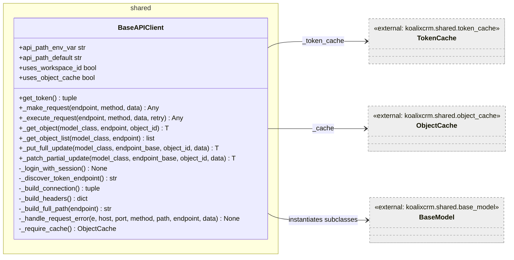
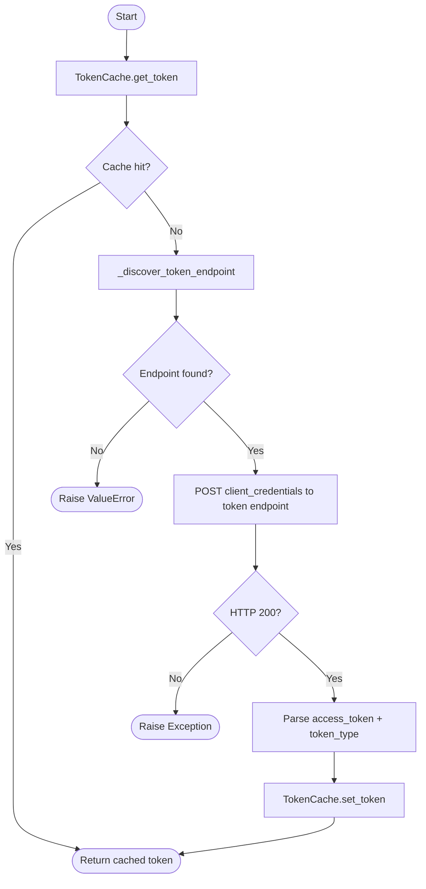
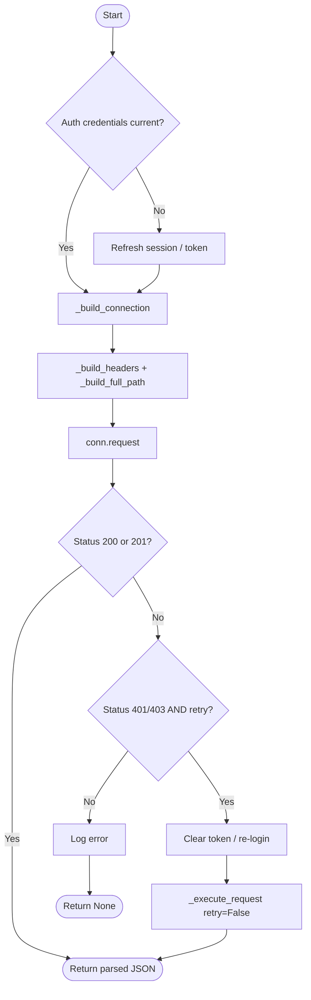
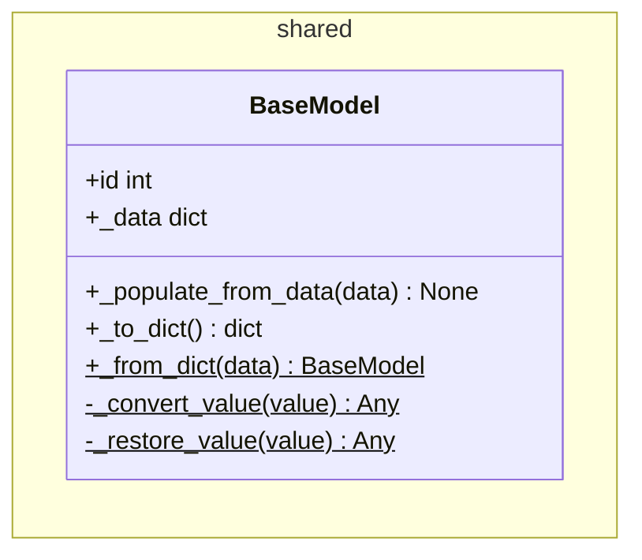
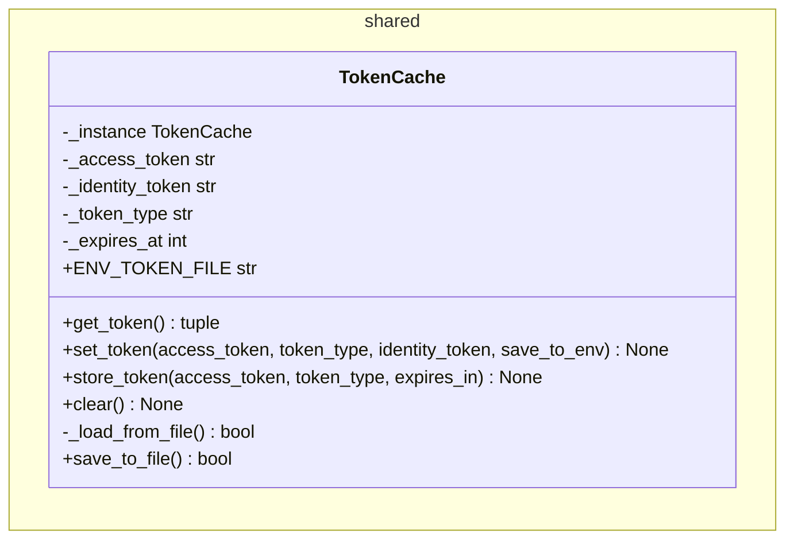
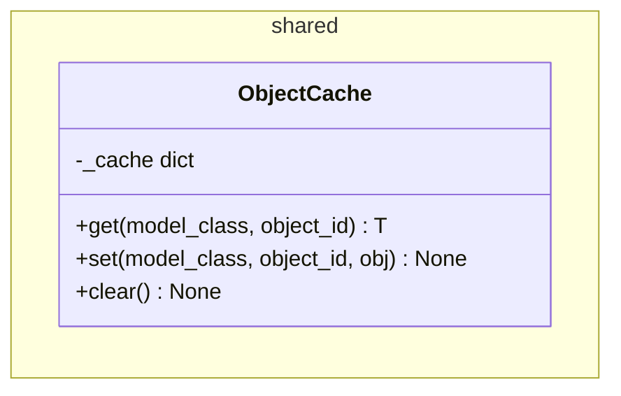
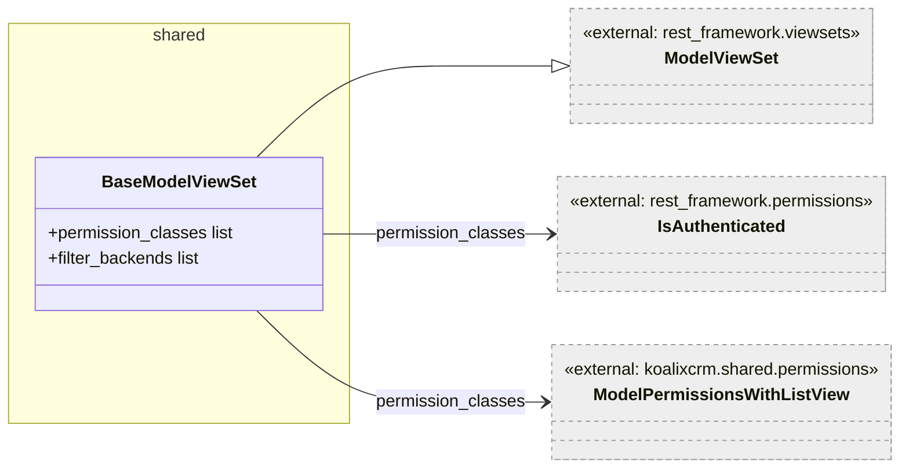
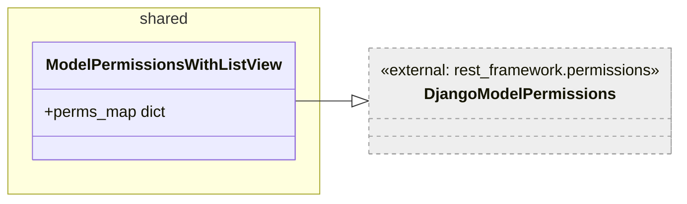
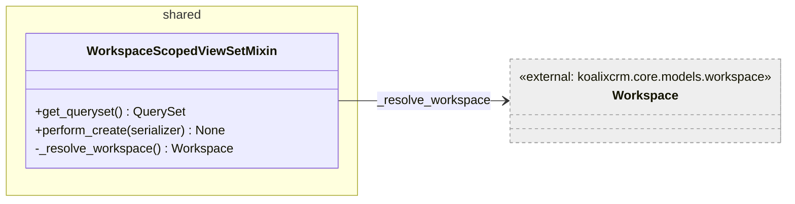
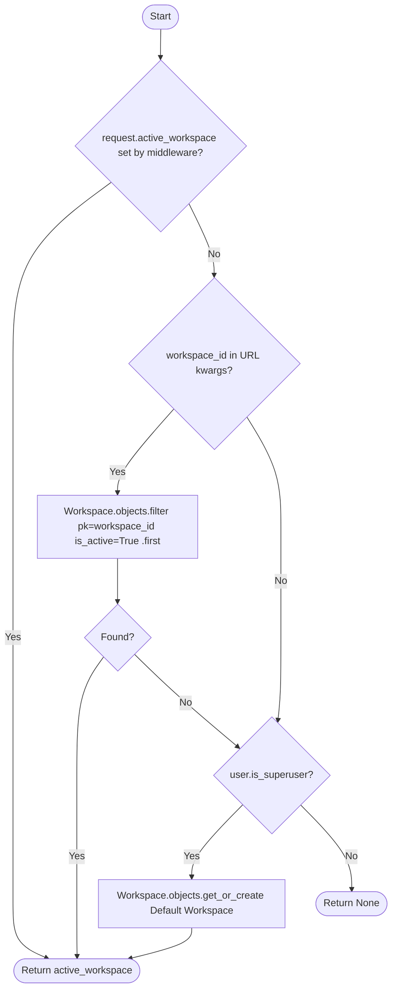

# Shared Package — Low-Level Documentation

## Introduction

### Scope

This document covers the `koalixcrm/shared/` package, which provides cross-cutting
infrastructure for both client-side API consumers and server-side API endpoints. The
following source files are described:

| File | Purpose |
|------|---------|
| `api_client.py` | `BaseAPIClient` — HTTP client with M2M/Basic auth, retry, pagination, and CRUD helpers |
| `base_model.py` | `BaseModel` — client-side DTO base class with dict serialization |
| `token_cache.py` | `TokenCache` — singleton M2M token cache with file persistence |
| `object_cache.py` | `ObjectCache` — in-process object cache keyed by `(class, id)` |
| `base_model_view_set.py` | `BaseModelViewSet` — DRF `ModelViewSet` with standard authentication and permissions |
| `permissions.py` | `ModelPermissionsWithListView` — DRF permission class enforcing `view_*` on GET |
| `workspace_scoped_view_set.py` | `WorkspaceScopedViewSetMixin` — ViewSet mixin scoping querysets and creates to the active workspace |
| `__init__.py` | Package exports: `BaseAPIClient`, `ObjectCache` |

### Target Audience

Software development engineers who need to implement new API clients or server-side
ViewSets in koalixcrm.

### Glossary

| Term/Acronym | Full Form | Description |
|---|---|---|
| DTO | Data Transfer Object | A plain object carrying data returned from an API, without domain logic |
| M2M | Machine-to-Machine | Non-interactive service-to-service authentication using Client Credentials Grant |
| DRF | Django REST Framework | Python library for building REST APIs with Django |
| CRUD | Create, Read, Update, Delete | Standard database operations exposed as API verbs |
| PATCH | — | HTTP method for partial updates (only changed fields) |
| PUT | — | HTTP method for full replacements (complete resource representation) |
| Singleton | — | Design pattern ensuring only one instance of a class exists per process |
| Workspace | — | Tenant-like isolation unit in koalixcrm; every business object belongs to one workspace |

---

## Detailed Components

### `BaseAPIClient`

**Caption: Figure 1 — BaseAPIClient class**

`BaseAPIClient` is the abstract base for all koalixcrm API client classes. Concrete
subclasses configure it by declaring class attributes:

- `api_path_env_var` / `api_path_default` — the env var and default for the
  application path prefix (e.g. `/koalixcrm_accounting/api/v1/`).
- `uses_workspace_id` — when `True`, the workspace ID is interpolated into every
  URL path.
- `uses_object_cache` — when `False`, the CRUD helpers raise `RuntimeError` rather
  than operate without a cache.

Two authentication modes exist: M2M (OIDC Client Credentials Grant) when no
`username`/`password` are provided, and HTTP Basic Auth for testing. All HTTP I/O
uses the standard library `http.client` only — no third-party HTTP library is used.

#### `__init__`

Initialises authentication credentials from constructor arguments and environment
variables (`KOALIXCRM_API_URL`, `CELERY_WORKER_M2M_*`). For M2M auth it calls
`get_token()` immediately to warm the cache. For Basic Auth it encodes the
credentials as Base64 via `_login_with_session()`.

#### `_discover_token_endpoint()`

Fetches `{CELERY_WORKER_M2M_OIDC_ISSUER}/.well-known/openid-configuration` over
HTTPS and extracts `token_endpoint`. Raises `ValueError` on any network or parse
failure; the error message includes the configured issuer URL to simplify
diagnostics.

#### `get_token()`

**Signature:** `get_token() -> tuple[str, str]`

Returns `(access_token, token_type)`. First checks `TokenCache`; on a miss,
discovers the token endpoint, POSTs a `client_credentials` grant request, and
stores the result in `TokenCache`. Optionally persists the token to `m2m_token.env`
when `KOALIXCRM_TOKEN_SAVE_TO_ENV=true`.

**Caption: Figure 2 — BaseAPIClient.get_token control flow**

#### `_execute_request(endpoint, method, data, retry)`

**Signature:** `_execute_request(endpoint, method, data, retry=True) -> Any`

The central HTTP execution method. Builds connection, headers, and path; sends the
request; parses a JSON response. On HTTP 401/403 with `retry=True`, clears the
token cache (or re-encodes Basic Auth) and retries once with `retry=False` to avoid
infinite loops.

**Caption: Figure 3 — _execute_request control flow**

#### `_get_object_list(model_class, endpoint)`

Fetches all pages of a DRF paginated response. The `next` URL in each page is
stripped of the application path prefix and workspace ID before being passed as
the next endpoint, so relative paths are used consistently throughout. Each item is
instantiated as `model_class(item, self)` and stored in `ObjectCache`.

#### `_put_full_update` and `_patch_partial_update`

Both methods read the existing object first (GET), merge the caller-supplied fields
(`PUT` merges into the full payload; `PATCH` sends only the supplied fields), and
strip read-only fields (`id`, `created_at`, `updated_at`) before writing. Both
update the cache entry with the response object.

---

### `BaseModel`

**Caption: Figure 4 — BaseModel class**

`BaseModel` is the base class for all client-side data transfer objects. On
construction it iterates the raw API response dict and sets every key (except `id`)
as an instance attribute, making fields accessible as `obj.field_name`. The `id`
property reads from `_data` to ensure it is never shadowed by `_populate_from_data`.

The `_to_dict` / `_from_dict` pair implements recursive serialization. `_to_dict`
records `_class` and `_module` in addition to `_data` and instance attributes,
enabling `_from_dict` to reconstruct the correct concrete subclass by dynamic
import. This mechanism is used to serialize model objects into Celery task arguments
and reconstruct them in the worker.

`_convert_value` (called by `_to_dict`) and `_restore_value` (called by
`_from_dict`) handle recursion: they walk into lists, dicts, and nested
`BaseModel` instances. Unknown types fall back to `str(value)`.

---

### `TokenCache`

**Caption: Figure 5 — TokenCache class**

`TokenCache` is a process-level singleton (implemented via `__new__` overriding
`_instance`). It stores one M2M access token in class-level attributes shared by all
instances, which is the singleton's mechanism for sharing state.

On first instantiation `_load_from_file()` reads `m2m_token.env` from the current
working directory. This file contains `key=value` lines for the token, type,
expiry timestamp, and optional identity token.

`get_token()` returns `None` when the token has expired (`time.time() >= _expires_at`),
forcing the caller to refresh. `set_token()` decodes the JWT without verification to
extract the `exp` claim for the expiry time. When decoding fails it defaults to
`now + 3600 s`. `store_token()` accepts an explicit `expires_in` in seconds and
writes to file unconditionally.

`clear()` zeroes all in-memory fields and deletes the `m2m_token.env` file.

In a horizontally scaled deployment each process has its own `TokenCache` singleton
and may independently fetch tokens. The file persistence is local to the container
filesystem; there is no shared persistent token store across instances.

---

### `ObjectCache`

**Caption: Figure 6 — ObjectCache class**

A simple in-process dict-based cache. The cache key is `(model_class.__name__, object_id)`.
This prevents different model classes that share an integer ID from colliding. The
cache is per `BaseAPIClient` instance — a new client instance starts with an empty
cache. `clear()` replaces the internal dict with a new empty dict.

This cache is not thread-safe and is not shared across processes. It is intended for
the lifetime of a single Celery task or a short-lived client session.

---

### `BaseModelViewSet`

**Caption: Figure 7 — BaseModelViewSet class**

All app-specific ViewSets inherit from `BaseModelViewSet`. It configures:

- `permission_classes = [IsAuthenticated, ModelPermissionsWithListView]` — every
  request must be authenticated and carry the appropriate Django model permission.
- `filter_backends = [SearchFilter, OrderingFilter]` — all endpoints support
  `?search=` and `?ordering=` query parameters out of the box.

---

### `ModelPermissionsWithListView`

**Caption: Figure 8 — ModelPermissionsWithListView class**

The stock `DjangoModelPermissions` class does not check any permission on `GET`
requests (list and detail). `ModelPermissionsWithListView` overrides `perms_map` to
require `{app_label}.view_{model_name}` for `GET`. All other HTTP verbs retain the
Django defaults (`add_*`, `change_*`, `delete_*`). `OPTIONS` and `HEAD` require no
permissions.

---

### `WorkspaceScopedViewSetMixin`

**Caption: Figure 9 — WorkspaceScopedViewSetMixin class**

This mixin must be placed before the ViewSet class in the MRO (Method Resolution
Order) so that its `get_queryset` and `perform_create` override the base class
methods. It does not inherit from any specific ViewSet class, enabling composition
with both `BaseModelViewSet` and plain DRF `ModelViewSet`.

#### `_resolve_workspace()`

**Signature:** `_resolve_workspace() -> Workspace | None`

Resolves the active workspace through three fallback strategies in priority order:

**Caption: Figure 10 — _resolve_workspace control flow**

#### `get_queryset()`

Returns the full queryset for superusers. For non-superusers, filters by
`workspace=active` when a workspace is resolved, or returns `qs.none()` when no
workspace can be resolved (prevents data leakage on misconfigured requests).

#### `perform_create(serializer)`

Calls `serializer.save(workspace=active)` so the resolved workspace is passed as an
extra keyword argument into the serializer's `create()` method via
`validated_data`. This stamps every new object with the correct workspace without
requiring the client to supply it in the request body.

---

## Persistent Storage

The `shared` package does not own any database tables directly. `BaseAPIClient`
and `TokenCache` write to a local file (`m2m_token.env`) on the container
filesystem when `KOALIXCRM_TOKEN_SAVE_TO_ENV=true`. This file is not managed by
Django migrations.

---

## In-Memory State

| State | Owner | Purpose | Multi-Instance Behaviour |
|-------|-------|---------|-------------------------|
| `TokenCache._instance` | `TokenCache` (class attribute) | Singleton M2M token per process | Each process has its own singleton; tokens are fetched independently |
| `TokenCache._access_token` etc. | `TokenCache` (class attributes) | Cached M2M token | Not shared across processes |
| `ObjectCache._cache` | `ObjectCache` (instance attribute) | Per-client object cache | Not shared; scoped to one `BaseAPIClient` instance |

---

## Access to External Interfaces

| Interface | Type of Call | Expected Duration | Notes |
|-----------|-------------|-------------------|-------|
| OIDC discovery endpoint | Blocking HTTP GET (`http.client.HTTPSConnection`) | ~100–500 ms | Only during `_discover_token_endpoint` |
| OIDC token endpoint | Blocking HTTP POST (`http.client.HTTPSConnection`) | ~200–800 ms | Only on token cache miss |
| koalixcrm REST API | Blocking HTTP GET/POST/PUT/PATCH (`http.client.HTTP[S]Connection`) | ~50–500 ms | No connection pooling; connection opened and closed per request |

---

## Security

### Assets

| Asset | Description | Security Measure | Assessment of Criticality |
|-------|-------------|------------------|---------------------------|
| `CELERY_WORKER_M2M_CLIENT_SECRET` | Client secret for M2M token endpoint | Read from environment variable | Uncritical when delivered via secret manager |
| `CELERY_WORKER_M2M_CLIENT_ID` | Client ID for M2M flow | Read from environment variable | Uncritical — not a secret, but needed for token requests |
| `m2m_token.env` (optional) | Persisted M2M access token on local filesystem | Written only when `KOALIXCRM_TOKEN_SAVE_TO_ENV=true` | Moderate — file is readable by any process with filesystem access; should not be used in production |
| `username` / `password` (Basic Auth) | Credentials for test-mode HTTP Basic Auth | Held in memory as Base64 string; not persisted | Moderate — only used in test environments |

---

## Design Patterns Used

**Singleton** — `TokenCache` uses `__new__` to ensure a single instance per
process. Class-level attributes (`_instance`, `_access_token`, etc.) hold the
shared state.

**Template Method** — `BaseAPIClient` defines the algorithm for `_execute_request`
(build connection → build headers → build path → send → handle errors → retry),
while subclasses configure behaviour via class attributes rather than method
overrides.

**Mixin** — `WorkspaceScopedViewSetMixin` follows the Django mixin pattern: it adds
workspace resolution to any ViewSet without requiring inheritance from a specific
base ViewSet class.

**Null Object** — `get_queryset()` returns `qs.none()` when no workspace is
resolved, providing a safe default that produces no results rather than leaking
all records.

---

## External Dependencies

| Requirement | Version/Details | Notes |
|-------------|-----------------|-------|
| `djangorestframework` | `>=3.14` | `ModelViewSet`, `DjangoModelPermissions`, `SearchFilter`, `OrderingFilter` |
| `PyJWT` | `>=2.0` | Used in `TokenCache.set_token` to decode expiry from access token without verification |
| `django` | `>=4.2` | ORM, auth, cache framework |

---

## Appendix

### List of Illustrations

| Figure | Title |
|--------|-------|
| Figure 1 | BaseAPIClient class |
| Figure 2 | BaseAPIClient.get_token control flow |
| Figure 3 | `_execute_request` control flow |
| Figure 4 | BaseModel class |
| Figure 5 | TokenCache class |
| Figure 6 | ObjectCache class |
| Figure 7 | BaseModelViewSet class |
| Figure 8 | ModelPermissionsWithListView class |
| Figure 9 | WorkspaceScopedViewSetMixin class |
| Figure 10 | `_resolve_workspace` control flow |
