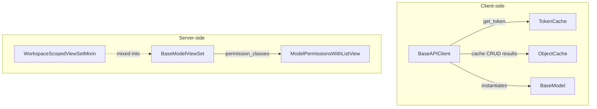
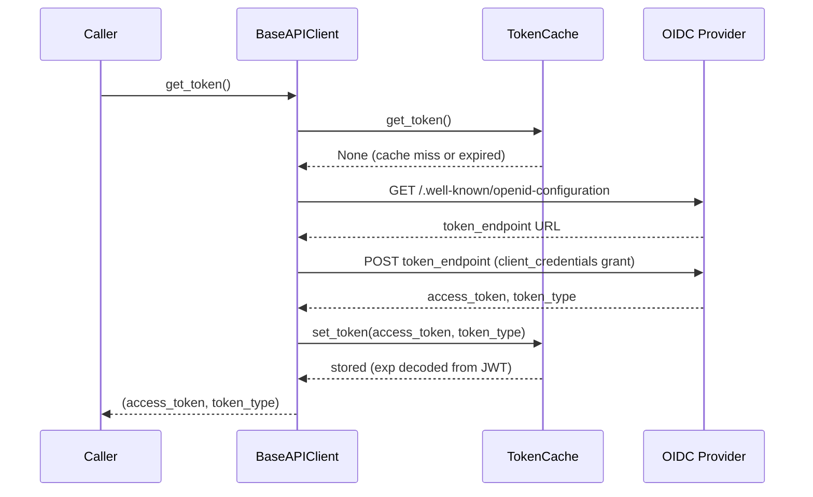
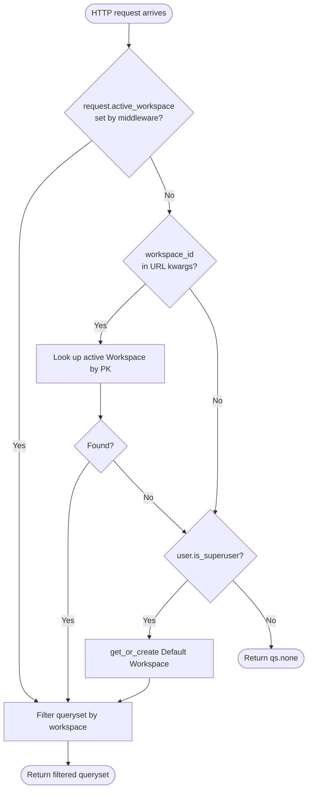
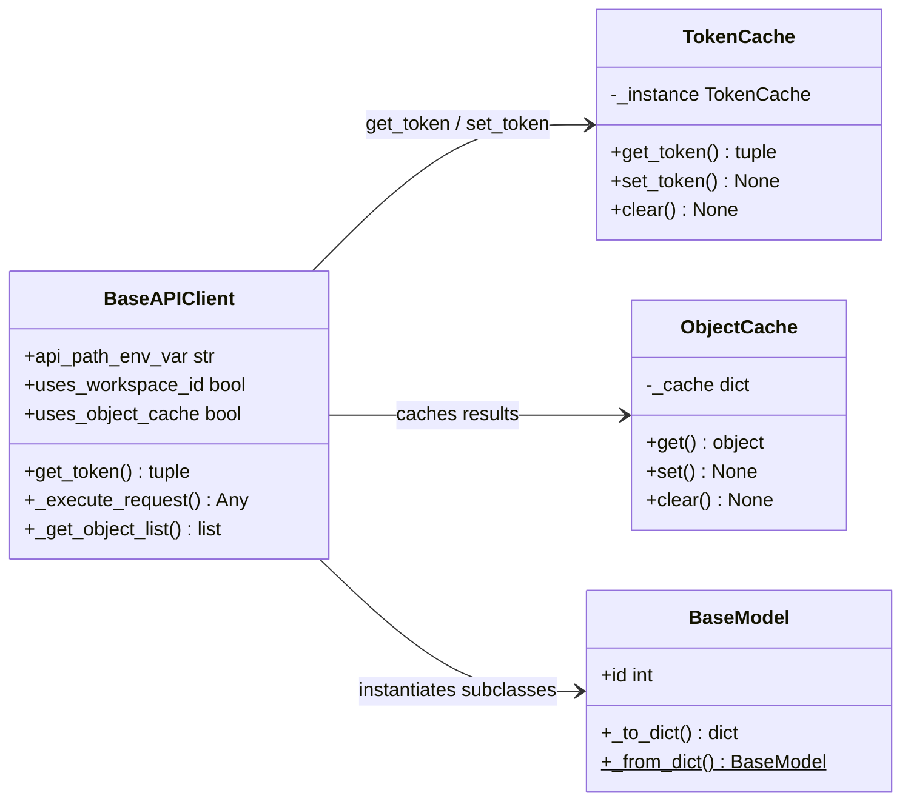
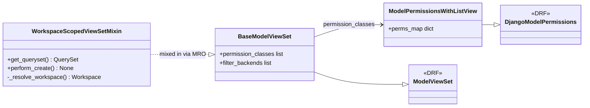

# Shared Package — Mid-Level Documentation

## Introduction

### Purpose

The `koalixcrm/shared/` package provides cross-cutting infrastructure that is reused
across the entire koalixcrm system. It is divided into two cohesive groups:

- **Client-side components** — abstract base classes and caches used by all API
  client implementations running in Celery workers and other consumer processes.
- **Server-side components** — base ViewSet, permission class, and mixin used by all
  DRF API endpoints exposed by the koalixcrm Django application.

Neither group depends on the other. Together they establish the authentication,
serialization, caching, pagination, workspace scoping, and permission-enforcement
contracts that the rest of the application builds on.

### Contents Overview

**Client-side:**

| Component | Role |
|-----------|------|
| `BaseAPIClient` | Abstract HTTP client; manages M2M/Basic auth, retry, DRF pagination, and CRUD helpers |
| `BaseModel` | DTO base class; provides attribute population from API responses and Celery-safe serialization |
| `TokenCache` | Process-level singleton; holds and persists the M2M access token |
| `ObjectCache` | Per-client-instance dict cache keyed by `(class_name, object_id)` |

**Server-side:**

| Component | Role |
|-----------|------|
| `BaseModelViewSet` | DRF `ModelViewSet` base; applies standard authentication and model permissions to all app ViewSets |
| `ModelPermissionsWithListView` | Permission class; adds `view_*` requirement to `GET` requests, which stock DRF omits |
| `WorkspaceScopedViewSetMixin` | ViewSet mixin; scopes querysets and object creation to the active workspace |

### Target Audience

Engineers implementing new API clients (Celery task context, service-to-service
calls) or new server-side ViewSets in koalixcrm. Familiarity with Django REST
Framework and the OAuth 2.0 Client Credentials Grant is assumed.

### Glossary

| Term | Full Form | Description |
|------|-----------|-------------|
| M2M | Machine-to-Machine | Non-interactive service-to-service authentication via Client Credentials Grant |
| DTO | Data Transfer Object | Plain object carrying API response data, without domain logic |
| DRF | Django REST Framework | Python library for building REST APIs with Django |
| MRO | Method Resolution Order | Python's class linearization order; determines which method implementation is called in multiple-inheritance hierarchies |
| Workspace | — | Tenant-like isolation unit in koalixcrm; every business object belongs to one workspace |
| Singleton | — | Design pattern ensuring only one instance of a class exists per process |
| Null Object | — | Design pattern returning a safe inert value instead of `None` to prevent null-reference errors |

---

## Package Diagram

Figure 1 — Package overview: client-side and server-side component groups and their relationships

For method-level detail on each component, see [QQ_LL_Doc_Shared.md](QQ_LL_Doc_Shared.md).

---

## Interaction Diagrams

### M2M Token Acquisition

When a `BaseAPIClient` subclass needs an access token and the `TokenCache` has no
valid entry, it discovers the OIDC token endpoint from the issuer's discovery
document, posts a Client Credentials grant, and stores the result back in
`TokenCache`. Subsequent calls within the same process skip all network traffic until
the token expires.

Figure 2 — M2M token acquisition sequence

### Workspace-Scoped API Request

Every incoming HTTP request is processed by `WorkspaceScopedViewSetMixin` before the
ViewSet returns any data. The mixin resolves the active workspace through three
ordered fallback strategies and either filters the queryset to that workspace or
returns an empty queryset to prevent data leakage.

Figure 3 — Workspace-scoped queryset resolution

---

## Class Diagrams

### Client-Side Components

Figure 4 — Client-side class diagram

### Server-Side Components

Figure 5 — Server-side class diagram

---

## Design Patterns Used

**Singleton — `TokenCache`**

`TokenCache.__new__` stores the single instance in a class-level attribute. All
imports of `TokenCache` within the same process share one token, avoiding redundant
token-endpoint calls.

**Template Method — `BaseAPIClient._execute_request`**

`_execute_request` defines the fixed algorithm (build connection, build headers, send
request, handle errors, retry once on 401/403). Concrete subclasses configure
behaviour through class attributes (`api_path_env_var`, `uses_workspace_id`, etc.)
rather than overriding individual steps.

**Mixin — `WorkspaceScopedViewSetMixin`**

The mixin adds workspace resolution to any ViewSet by being placed first in the MRO.
It does not inherit from a specific ViewSet class, which allows it to compose with
both `BaseModelViewSet` and plain DRF `ModelViewSet`.

**Null Object — `get_queryset` returning `qs.none()`**

When `_resolve_workspace` cannot determine a workspace for an authenticated
non-superuser, `get_queryset` returns `qs.none()` rather than `None`. This prevents
null-reference errors in downstream filtering and ensures no records are inadvertently
exposed.

---

## External Dependencies

| Package | Version | Used By |
|---------|---------|---------|
| `djangorestframework` | `>=3.14` | `BaseModelViewSet`, `ModelPermissionsWithListView`, `WorkspaceScopedViewSetMixin` |
| `PyJWT` | `>=2.0` | `TokenCache.set_token` — decodes JWT `exp` claim without verification to determine expiry time |
| `django` | `>=4.2` | ORM (`Workspace.objects`), auth framework (`is_superuser`, model permissions), Django settings |

---

## Testing

Information not available.

---

## Appendix

### Reference

Detailed source-level documentation, including per-method flow diagrams, class
attribute tables, and security notes, is in
[QQ_LL_Doc_Shared.md](QQ_LL_Doc_Shared.md).

### List of Illustrations

| Figure | Title |
|--------|-------|
| Figure 1 | Package overview: client-side and server-side component groups and their relationships |
| Figure 2 | M2M token acquisition sequence |
| Figure 3 | Workspace-scoped queryset resolution |
| Figure 4 | Client-side class diagram |
| Figure 5 | Server-side class diagram |
