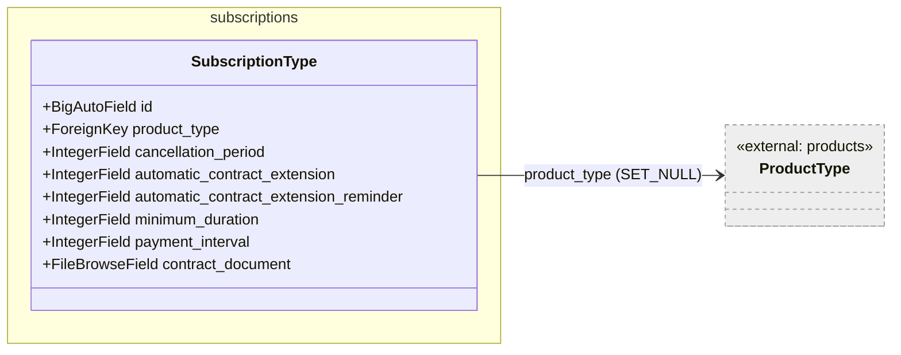
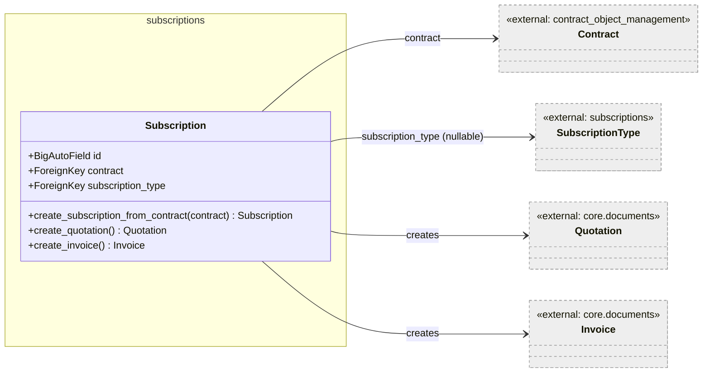
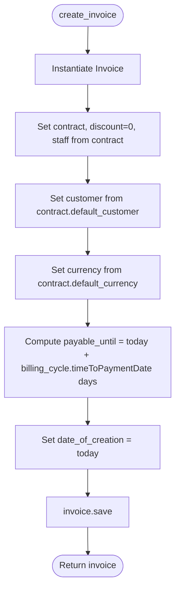
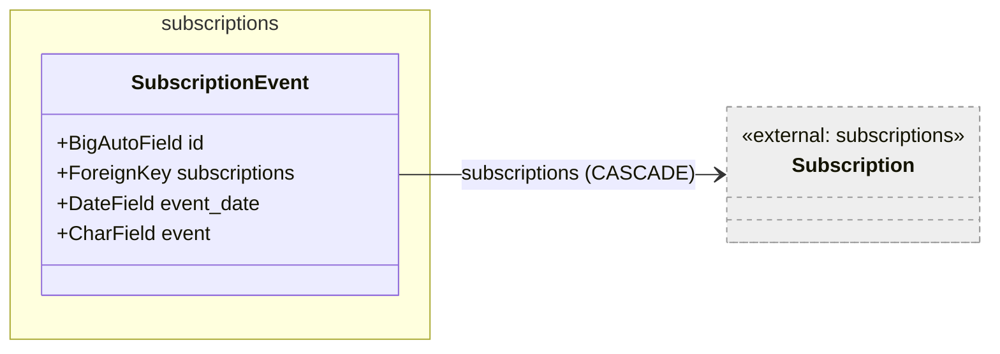

# Subscriptions — Low-Level Documentation

## Introduction

### Scope

This document describes the implementation of the `koalixcrm.subscriptions` Django application. The
following source files are covered:

- `models/subscription_type.py` — `SubscriptionType`
- `models/subscription.py` — `Subscription`
- `models/subscription_event.py` — `SubscriptionEvent`
- `const/events.py` — `SUBSCRITIONEVENTS` constant
- `admin/subscription_admin.py` — `AdminSubscriptionEvent`, `InlineSubscription`,
  `OptionSubscription`, `OptionSubscriptionType`, `create_subscription`, `KoalixcrmPluginInterface`
- `subscriptions_api.py` — module stub (no endpoints defined)
- `views.py` — empty

### Target Audience

Software development engineers who need to use, modify, or extend the `subscriptions` application.

### Glossary

| Term/Acronym | Full Form | Description |
|---|---|---|
| Subscription | — | A recurring service arrangement linking a `Contract` to a `SubscriptionType`. |
| SubscriptionType | — | Configuration record that defines the contractual terms of a subscription (duration, payment interval, etc.). |
| SubscriptionEvent | — | A timestamped lifecycle event recorded against a `Subscription` (Offered, Canceled, Signed). |
| Contract | — | A `contract_object_management.Contract` record that is the parent of a subscription. |
| KoalixcrmPluginInterface | — | A class exposing lists of Django admin inlines and actions for injection into core admin views (contract, invoice, etc.). |

---

## Detailed Components

### SubscriptionType

Figure 1 — SubscriptionType class

`SubscriptionType` defines the contractual template for a subscription. All integer fields are nullable
and represent time values in different units:

- `cancellation_period` — months of notice required before cancellation
- `automatic_contract_extension` — months by which the contract auto-extends if not cancelled
- `automatic_contract_extension_reminder` — days before the extension date when a reminder should be sent
- `minimum_duration` — minimum contract duration (unit not specified in the field definition)
- `payment_interval` — interval in days between invoice cycles

The `product_type` FK points to `products.ProductType` and uses `SET_NULL` on deletion, meaning a
`SubscriptionType` can exist without a linked product type.

`contract_document` uses `filebrowser.fields.FileBrowseField` to store the contract template document.

No application-level methods are defined on this model beyond Django defaults.

---

### Subscription

Figure 2 — Subscription class

`Subscription` links a `Contract` to a `SubscriptionType`. The `subscription_type` FK is nullable (`null=True`)
allowing a subscription to be created before a type is assigned. The `contract` FK uses `CASCADE` deletion.

#### Methods

##### `create_subscription_from_contract(contract) -> Subscription`

Sets `self.contract` to the provided contract, saves, and returns `self`. This is a creation helper
called from the `create_subscription` admin action.

##### `create_quotation() -> Quotation`

Creates a new `koalixcrm.core.documents.quotation.Quotation` populated from the subscription's contract
fields: `contract`, `staff`, `customer` (from `contract.defaultcustomer`), `currency`, and today's date
for both `valid_until` and `date_of_creation`. Sets `discount=0` and `status="C"`. Saves and returns the
quotation instance.

##### `create_invoice() -> Invoice`

Creates a new `koalixcrm.core.documents.invoice.Invoice` populated from the subscription's contract.
`payable_until` is computed as today plus `contract.defaultcustomer.defaultCustomerBillingCycle.timeToPaymentDate`
days. Sets `discount=0` and `status="C"`. Saves and returns the invoice instance.

Figure 3 — `create_invoice` control flow

---

### SubscriptionEvent

Figure 4 — SubscriptionEvent class

`SubscriptionEvent` records a lifecycle event for a `Subscription`. The `event` field is a single
character from `SUBSCRITIONEVENTS`:

| Code | Label |
|---|---|
| `O` | Offered |
| `C` | Canceled |
| `S` | Signed |

`event_date` is optional (`blank=True, null=True`). The FK is named `subscriptions` (plural) which may
cause confusion; it refers to a single `Subscription` parent.

---

### Admin Classes

#### OptionSubscription

`OptionSubscription` is the main admin class for `Subscription`. It includes `AdminSubscriptionEvent`
as an inline so subscription events can be managed on the subscription change page.

The `save_model` method sets both `last_modified_by` and `staff` to `request.user` on both create and
change operations (the two branches are currently identical).

Two bulk actions are declared:

- **`create_invoice`** (static method): iterates the queryset, calls `obj.create_invoice()` for each
  subscription, and redirects to the created invoice's admin URL. When multiple objects are selected,
  only the last redirect is returned.
- **`create_quotation`** (static method): same structure as `create_invoice` but calls `obj.create_invoice()`
  (note: the quotation action calls `create_invoice` — this appears to be a copy-paste error in the source).
- `actions` list includes `create_subscription_pdf` but this action method is not implemented on the class;
  calling it would raise an `AttributeError`.

#### OptionSubscriptionType

Standard `ModelAdmin` for `SubscriptionType` with no custom actions or inlines.

#### `create_subscription` (module-level admin action function)

A standalone admin action function designed to be attached to the `Contract` admin. It instantiates a new
`Subscription` and calls `create_subscription_from_contract`. It redirects to
`/admin/subscriptions/{subscription.id}`, which is a URL path that may not exist as-is (missing the model
name segment). When multiple contracts are selected, only the last redirect is returned.

#### KoalixcrmPluginInterface

A plain class (no base class) that exposes lists of admin inlines and action functions for injection into
the core CRM admin:

| Attribute | Contents |
|---|---|
| `contractInlines` | `[InlineSubscription]` — shows subscriptions on the Contract change page |
| `contractActions` | `[create_subscription]` — adds create-subscription action to Contract admin |
| `invoiceInlines` | `[]` |
| `invoiceActions` | `[]` |
| `quotationInlines` | `[]` |
| `quotationActions` | `[]` |
| `customerInlines` | `[]` |
| `customerActions` | `[]` |

This interface pattern allows the subscriptions app to extend other admin views without direct coupling.

---

## Persistent Storage

| Table | Content |
|---|---|
| `subscriptions_subscriptiontype` | Subscription type configuration records |
| `subscriptions_subscription` | Subscription records |
| `subscriptions_subscriptionevent` | Lifecycle event records per subscription |

---

## Access to External Interfaces

| Interface | Type of Call | Notes |
|---|---|---|
| `koalixcrm.core.documents.quotation.Quotation` | Blocking write | `create_quotation` creates and saves a `Quotation` instance. |
| `koalixcrm.core.documents.invoice.Invoice` | Blocking write | `create_invoice` creates and saves an `Invoice` instance; accesses `contract.defaultcustomer.defaultCustomerBillingCycle.timeToPaymentDate` via chained attribute access with no null guard. |

The chained attribute access in `create_invoice` (`contract.defaultcustomer.defaultCustomerBillingCycle.timeToPaymentDate`)
will raise an `AttributeError` if any intermediate object is `None` or if the field name has changed on
the `Contract` model (note: `create_invoice` uses `contract.default_customer` while `create_quotation`
uses `contract.defaultcustomer`, indicating inconsistent field naming usage).

---

## Design Patterns Used

- **Plugin interface:** `KoalixcrmPluginInterface` is a structural pattern allowing the subscriptions
  app to declare which inlines and actions it contributes to other admin views, enabling loose coupling
  between the subscriptions app and the core CRM admin without direct imports at registration time.
- **Factory methods on the model:** `create_quotation` and `create_invoice` on `Subscription` act as
  factory methods that encapsulate document creation logic within the subscription context.

---

## Information Not Available

- The `subscriptions_api.py` file is a stub with no REST endpoints defined. The REST API surface for
  subscriptions is not implemented.
- `views.py` is empty; no HTTP views are implemented.
- The `serializers/` package is empty; no serializers are defined.
- The mechanism by which `KoalixcrmPluginInterface` is registered with the core CRM admin is not visible
  in this app's source code.

---

## External Dependencies

| Requirement | Version/Details | Notes/Assumptions |
|---|---|---|
| Django | >= 3.2 | ORM, admin |
| `filebrowser` | — | `FileBrowseField` used on `SubscriptionType.contract_document` |
| `koalixcrm.contract_object_management` | internal | `Contract` model referenced by `Subscription.contract` |
| `koalixcrm.products` | internal | `ProductType` referenced by `SubscriptionType.product_type` |
| `koalixcrm.core.documents` | internal | `Invoice` and `Quotation` created by `Subscription` methods |

---

## Appendix

### References

- Source: `koalixcrm/subscriptions/models/`
- Source: `koalixcrm/subscriptions/admin/`
- Source: `koalixcrm/subscriptions/const/events.py`

### List of Illustrations

| Figure | Title |
|---|---|
| Figure 1 | SubscriptionType class |
| Figure 2 | Subscription class |
| Figure 3 | `create_invoice` control flow |
| Figure 4 | SubscriptionEvent class |
