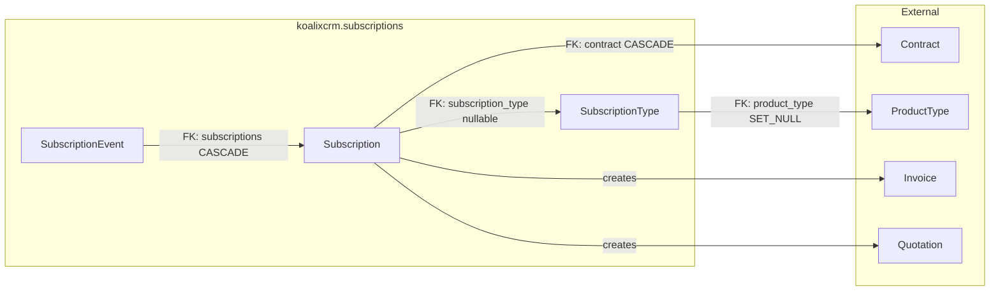
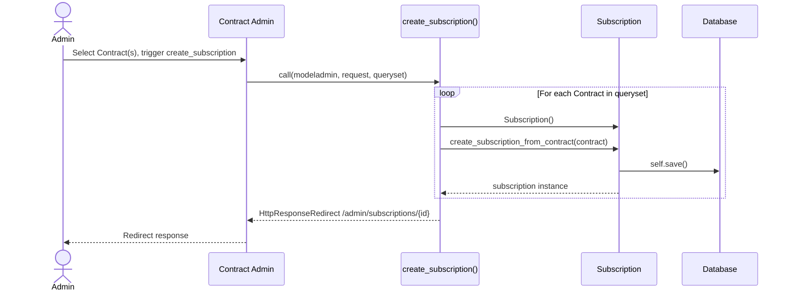
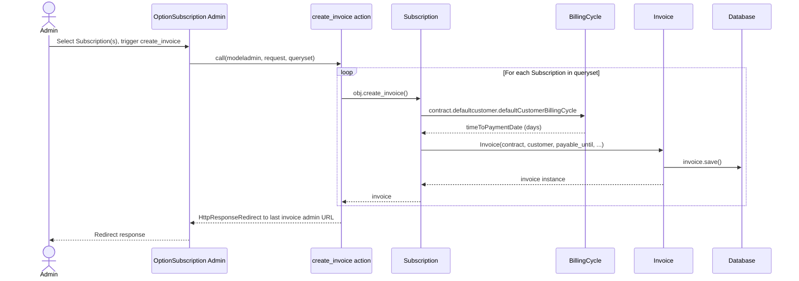
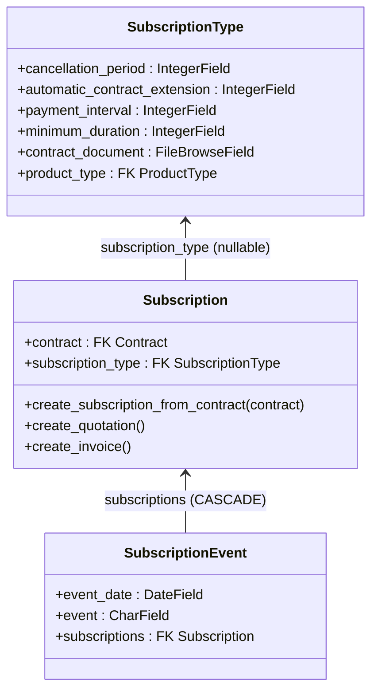

# Subscriptions — Mid-Level Documentation

## Introduction

### Purpose

This document describes the `koalixcrm.subscriptions` Django application at module level. The
application manages recurring service arrangements (subscriptions) that are linked to Contracts. It
provides lifecycle tracking via timestamped events and contributes admin inlines and actions to the
Contract admin through a plugin interface pattern.

### Contents Overview

- Package diagram showing the three model classes and their relationships to external components
- Interaction diagrams covering subscription creation from a Contract and invoice creation from a
  Subscription
- Class diagram summarising the model layer
- Design patterns, external dependencies, and known source issues

### Target Audience

Software architects, technical leads, and senior developers who need to understand the module
structure and interaction model of the subscriptions application without requiring implementation
detail.

### Glossary

| Term | Description |
|---|---|
| Subscription | A recurring service arrangement linking a `Contract` to a `SubscriptionType`. |
| SubscriptionType | Configuration record that defines the contractual terms of a subscription (duration, payment interval, cancellation period, etc.). |
| SubscriptionEvent | A timestamped lifecycle event recorded against a `Subscription` (Offered, Canceled, Signed). |
| Contract | A `contract_object_management.Contract` record that is the parent of a `Subscription`. |
| KoalixcrmPluginInterface | A plain class exposing lists of Django admin inlines and actions for injection into the Contract admin without direct coupling. |
| OptionSubscription | The Django `ModelAdmin` class for `Subscription`; provides bulk actions for invoice and quotation creation. |
| Billing Cycle | `contract.defaultcustomer.defaultCustomerBillingCycle` — the customer-level billing configuration used to compute `payable_until` on invoices. |

---

## Package Diagram

Figure 1 — Package overview: subscriptions module and its external relationships

The three model classes are self-contained within the `subscriptions` application. `Subscription`
is the central entity: it references both `Contract` (its owning business entity) and
`SubscriptionType` (the contractual template), and its factory methods produce `Invoice` and
`Quotation` documents in `koalixcrm.core.documents`. `SubscriptionEvent` records state transitions
against a `Subscription`.

For field-level detail of each class see [QQ_LL_Doc_Subscriptions.md](QQ_LL_Doc_Subscriptions.md).

---

## Interaction Diagrams

### Subscription Creation from Contract

The admin action `create_subscription` is contributed to the Contract admin via
`KoalixcrmPluginInterface.contractActions`. When a user selects one or more Contracts and triggers
the action, a new `Subscription` is instantiated and persisted for each.

Figure 2 — Sequence: subscription creation from the Contract admin action

**Known source issue:** The redirect target is `/admin/subscriptions/{subscription.id}`, which
omits the model name segment. The correct Django admin URL for a `Subscription` change page would
be `/admin/subscriptions/subscription/{id}/change/`. As written the redirect may return a 404.
When multiple Contracts are selected, only the redirect for the last subscription is returned to
the browser.

---

### Invoice Creation from Subscription

The `create_invoice` bulk action on `OptionSubscription` iterates the selected `Subscription`
records and calls the factory method on each. The factory method reads the customer's billing cycle
to compute `payable_until`.

Figure 3 — Sequence: invoice creation from the Subscription admin bulk action

**Known source issues in this flow:**

- The chained attribute access `contract.defaultcustomer.defaultCustomerBillingCycle.timeToPaymentDate`
  has no null guard. If any intermediate object is `None` (e.g. the contract has no default
  customer, or the customer has no billing cycle), an `AttributeError` is raised at runtime.
- `create_invoice` accesses `contract.default_customer` for the customer field, while the
  `create_quotation` method on the same class accesses `contract.defaultcustomer`. The field
  naming is inconsistent between the two methods.
- The `create_quotation` admin bulk action on `OptionSubscription` calls `obj.create_invoice()`
  rather than `obj.create_quotation()`. This is a copy-paste error in the source; selecting the
  "create quotation" action will silently produce an invoice instead of a quotation.
- The `actions` list on `OptionSubscription` declares `create_subscription_pdf`, but no such
  method is implemented on the class. Triggering this action from the admin would raise an
  `AttributeError`.

---

## Class Diagrams per Package

Figure 4 — Class diagram: subscriptions model layer

Method bodies are not shown; see [QQ_LL_Doc_Subscriptions.md](QQ_LL_Doc_Subscriptions.md) for
implementation detail.

---

## Design Patterns Used

### Plugin Interface

`KoalixcrmPluginInterface` is a plain class (no base class) that exposes lists of admin inlines
and action functions for injection into other admin views (Contract, Invoice, Quotation, Customer).
The subscriptions application contributes `InlineSubscription` and the `create_subscription` action
to the Contract admin via this interface. All other lists (`invoiceInlines`, `invoiceActions`,
`quotationInlines`, `quotationActions`, `customerInlines`, `customerActions`) are empty.

This pattern allows the subscriptions app to extend core admin views without direct imports at
registration time, providing loose coupling between the subscriptions app and the core CRM admin.

**Information not available:** The mechanism by which `KoalixcrmPluginInterface` is picked up and
registered with the core CRM admin is not visible in this application's source code.

### Factory Methods on the Model

`create_quotation` and `create_invoice` on `Subscription`, and `create_subscription_from_contract`
(a creation helper), are factory methods that encapsulate document and entity creation logic
directly on the model class. This avoids scattering creation logic across admin action functions
and keeps the business logic with the entity that owns it.

---

## External Dependencies

| Dependency | Type | Used by | Notes |
|---|---|---|---|
| Django >= 3.2 | Framework | All components | ORM, admin framework |
| `filebrowser` | Third-party library | `SubscriptionType` | `FileBrowseField` for `contract_document` |
| `koalixcrm.contract_object_management.Contract` | Internal module | `Subscription` | Parent business entity; FK with CASCADE deletion |
| `koalixcrm.products.ProductType` | Internal module | `SubscriptionType` | FK with SET_NULL deletion |
| `koalixcrm.core.documents.Invoice` | Internal module | `Subscription.create_invoice` | Blocking write; chained attribute access with no null guard |
| `koalixcrm.core.documents.Quotation` | Internal module | `Subscription.create_quotation` | Blocking write |

---

## Testing

Information not available. No unit tests or integration tests for the `koalixcrm.subscriptions`
application were identified in the source.

---

## Appendix

### Information Not Available

The following areas of the subscriptions application could not be documented from the available
source:

- **REST API:** `subscriptions_api.py` is a stub file. No REST endpoints are defined. The REST
  API surface for subscriptions is not implemented.
- **HTTP views:** `views.py` is empty. No HTTP views are implemented.
- **KoalixcrmPluginInterface registration:** The mechanism by which `KoalixcrmPluginInterface` is
  discovered and registered with the core CRM admin is not visible in this application's source
  code.
- **Serializers:** No serializers are defined in this application.

### References

- Low-level implementation detail: [QQ_LL_Doc_Subscriptions.md](QQ_LL_Doc_Subscriptions.md)
- Source: `koalixcrm/subscriptions/models/`
- Source: `koalixcrm/subscriptions/admin/subscription_admin.py`
- Source: `koalixcrm/subscriptions/const/events.py`

### List of Illustrations

| Figure | Title |
|---|---|
| Figure 1 | Package overview: subscriptions module and its external relationships |
| Figure 2 | Sequence: subscription creation from the Contract admin action |
| Figure 3 | Sequence: invoice creation from the Subscription admin bulk action |
| Figure 4 | Class diagram: subscriptions model layer |
