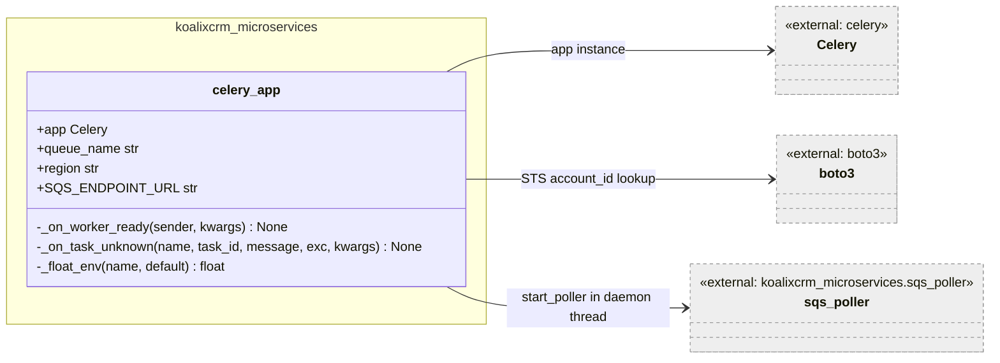
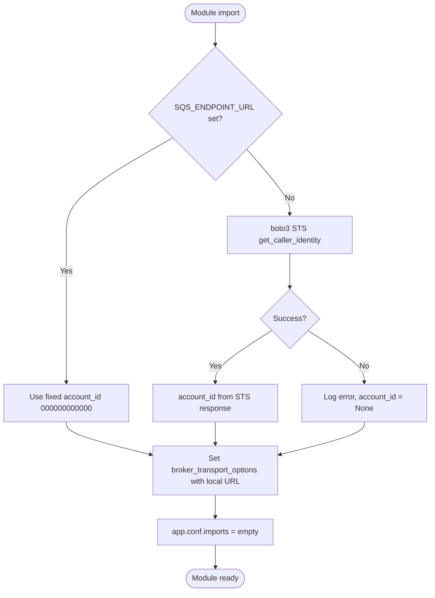
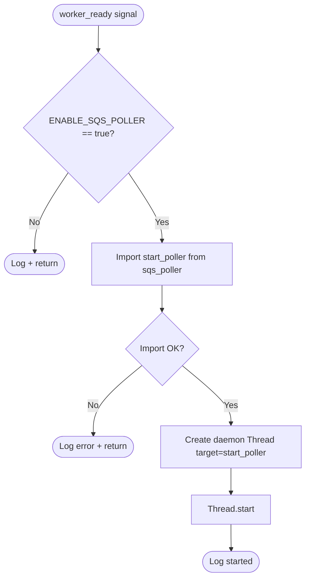
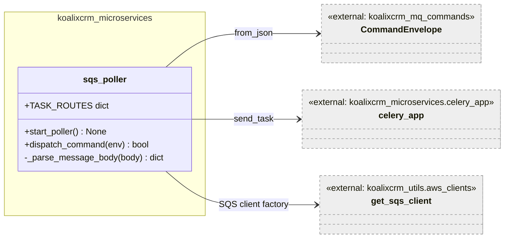
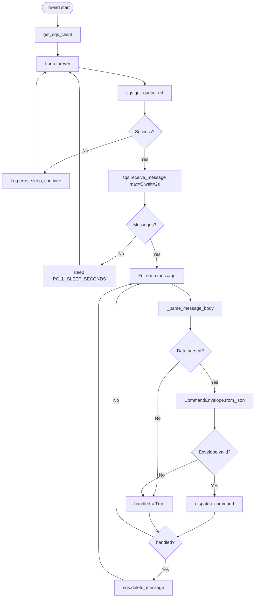

# koalixcrm_microservices — Low-Level Documentation

## Introduction

### Scope

This document covers the `koalixcrm_microservices/` package, which provides the
Celery application configuration and the SQS long-poll dispatcher. The following
source files are described:

| File | Purpose |
|------|---------|
| `celery_app.py` | Celery application instance, SQS broker configuration, `worker_ready` and `task_unknown` signal handlers, daemon-thread poller startup |
| `sqs_poller.py` | Endless SQS long-poll loop, `CommandEnvelope` parsing, and Celery task dispatch |

### Target Audience

Software development engineers who need to understand, modify, or extend the
asynchronous message processing infrastructure of koalixcrm.

### Glossary

| Term/Acronym | Full Form | Description |
|---|---|---|
| SQS | Simple Queue Service | AWS managed message queuing service |
| Celery | — | Distributed task queue library for Python |
| Broker | — | Message transport used by Celery; here AWS SQS via `kombu` |
| ElasticMQ | — | Local in-memory SQS-compatible server used in development/testing |
| CELERY_SQS | — | Environment variable naming the default Celery SQS queue |
| KOALIXCRM_MICROSERVICE_SQS | — | Environment variable naming the dedicated microservice command queue |
| `CommandEnvelope` | — | Generic message wrapper carrying a command type and payload; see [`koalixcrm_mq_commands`](../koalixcrm_mq_commands/QQ_LL_Doc_MQCommands.md) |
| Worker ready | — | Celery signal fired when a worker process has finished initialising and is ready to accept tasks |
| Daemon thread | — | Python thread that is terminated automatically when the main process exits |

---

## Detailed Components

### `celery_app` module

**Caption: Figure 1 — celery_app module structure**

This module is the entry point for the Celery worker process. It creates the `app`
Celery instance and configures it for AWS SQS as the broker. All configuration is
read from environment variables at module load time, making the module stateless
except for the `app` object itself.

#### Module-level SQS broker configuration

Two branches are taken at import time based on whether `SQS_ENDPOINT_URL` is set:

- **Local / ElasticMQ branch** (`SQS_ENDPOINT_URL` set): Uses a fixed `account_id`
  of `000000000000`, `is_secure=False`, and a `WaitTimeSeconds` of 2. The predefined
  queue URL is constructed as `{SQS_ENDPOINT_URL}/{account_id}/{queue_name}`.
- **AWS branch** (`SQS_ENDPOINT_URL` not set): Uses `boto3.Session` with the
  `AWS_PROFILE` profile to call `sts.get_caller_identity()` to retrieve the real
  AWS account ID. The predefined queue URL uses the standard
  `https://sqs.{region}.amazonaws.com/{account_id}/{queue_name}` form.

**Caption: Figure 2 — celery_app module-level SQS configuration**

The `app.conf.imports` list is intentionally empty. The comment in the source code
states that PDF export was moved to a Java `pdf-export-service`; future
Python-side Celery tasks should be registered there.

`app.conf.beat_schedule` is also intentionally empty for the same reason.

Key broker transport options set in both branches:

| Option | Local value | AWS value |
|--------|-------------|-----------|
| `polling_interval` | 1 s | 1 s |
| `visibility_timeout` | 3600 s | 3600 s |
| `wait_time_seconds` | 2 s | 20 s |
| `queue_name_prefix` | `''` | `''` |

The lower `wait_time_seconds` in local mode reduces the long-poll hold time for
faster test feedback; in AWS mode the full 20-second long-poll is used to minimise
API calls.

`task_reject_on_worker_lost = False` and `task_acks_late = False` mean tasks are
acknowledged at receive time, not at completion. A task that crashes the worker is
not re-queued.

#### `_on_task_unknown` signal handler

Connected to the `task_unknown` Celery signal. Called when the broker delivers a
task name that is not registered in `app.conf.imports`. The handler logs a warning
and returns, effectively acknowledging and discarding the message. This prevents
unregistered messages from blocking the queue indefinitely.

#### `_on_worker_ready` signal handler

Connected to the `worker_ready` Celery signal. Called once per worker process after
the worker has finished initialising. Behaviour is controlled by the
`ENABLE_SQS_POLLER` environment variable (default `true`):

**Caption: Figure 3 — _on_worker_ready signal handler flow**

The thread is started as a daemon thread (`daemon=True`), meaning it is terminated
automatically when the Celery worker process exits. This ensures no orphaned threads
survive a clean worker shutdown.

---

### `sqs_poller` module

**Caption: Figure 4 — sqs_poller module structure**

This module runs the long-poll loop in the daemon thread started by
`_on_worker_ready`. It polls `KOALIXCRM_MICROSERVICE_SQS` (a separate queue from
the Celery broker queue `CELERY_SQS`) for `CommandEnvelope` messages and dispatches
them to Celery tasks via `app.send_task`.

`TASK_ROUTES` is the routing table mapping `CommandEnvelope.type` strings to lists
of Celery task dotted names. In the current codebase this dict is empty because all
PDF export work was moved to the Java service. Future Python-side command handlers
should be added here.

#### `start_poller()`

**Signature:** `start_poller() -> None` (runs forever)

The main loop. Resolves the queue URL via `sqs.get_queue_url` on each iteration
(not cached, to handle queue URL changes without restart). Polls with
`MaxNumberOfMessages=5`, `WaitTimeSeconds=2`, `VisibilityTimeout=60`. On message
receipt it parses the body and dispatches the command. Successfully handled messages
are deleted from the queue. Messages that fail parsing are also deleted (treated as
handled with `handled=True`) to avoid repeated delivery of unrecognisable payloads.

**Caption: Figure 5 — start_poller loop control flow**

#### `dispatch_command(env)`

**Signature:** `dispatch_command(env: CommandEnvelope) -> bool`

Looks up `env.type` in `TASK_ROUTES`. When a route is found, sends each listed
Celery task via `celery_app.send_task(task_name, args=[payload])`. Returns `True`
whether or not a route is found — unknown command types are logged and discarded
rather than left on the queue. Returns `False` only on unexpected exceptions.

#### `_parse_message_body(body)` (private)

**Signature:** `_parse_message_body(body: str) -> dict`

Handles the common case where SQS delivers a double-encoded JSON string (a JSON
string whose value is itself a JSON string). Attempts `json.loads` twice: once on
the raw body, and if the result is still a string, once more. Returns an empty dict
on any parse failure; the caller treats an empty dict as an unrecognisable message.

---

## In-Memory State

| State | Module | Purpose | Multi-Instance Behaviour |
|-------|--------|---------|------------------------|
| `app` (Celery instance) | `celery_app` | Central Celery app object; worker and beat scheduler share it | One per process; Celery handles multi-process coordination internally |
| `TASK_ROUTES` | `sqs_poller` | Routing table for command dispatch | Module-level constant; identical across all workers |
| SQS client (`sqs`) | `sqs_poller.start_poller` | boto3 SQS client reused across poll iterations | Created once per poller thread; not shared across threads |

---

## Access to External Interfaces

| Interface | Type of Call | Expected Duration | Notes |
|-----------|-------------|-------------------|-------|
| AWS STS `get_caller_identity` | Blocking at module import | ~200–500 ms | Only once at startup; failure is logged and `account_id` becomes `None` |
| SQS `get_queue_url` | Blocking, each poll cycle | ~50–200 ms | Called on every iteration; not cached |
| SQS `receive_message` | Blocking long-poll | Up to `WaitTimeSeconds` (2 s local, 20 s AWS) | Core polling call; returns up to 5 messages |
| SQS `delete_message` | Blocking write | ~50–200 ms | Called after successful handling |
| Celery broker (SQS) | Non-blocking via `send_task` | ~5–50 ms | Sends tasks to the Celery broker queue, separate from the microservice queue |

---

## Security

### Assets

| Asset | Description | Security Measure | Assessment of Criticality |
|-------|-------------|------------------|---------------------------|
| AWS credentials (for SQS and STS) | IAM credentials used to access SQS | Resolved by boto3 credential chain (environment, profile, instance role) | Uncritical when using IAM roles; critical if stored in environment variables in production |
| `CELERY_BROKER_URL` | SQS broker URL with optional embedded credentials | Read from environment variable | Moderate — the URL format for SQS typically does not embed real credentials; boto3 credential chain is used instead |
| `CELERY_RESULT_BACKEND` | Celery result backend URL | Read from environment variable | Moderate — may contain connection credentials |

---

## Design Patterns Used

**Observer / Signal** — Celery signals (`worker_ready`, `task_unknown`) decouple the
poller startup from the Celery bootstrap sequence. The signal mechanism ensures the
poller thread starts only after the worker is fully initialised.

**Daemon Thread** — The poller runs in a Python daemon thread so it does not block
worker shutdown. This is the standard pattern for background I/O loops in long-lived
Python processes.

**Routing Table** — `TASK_ROUTES` is a plain dict mapping command types to Celery
task names, providing an easily extensible dispatch mechanism without conditional
logic.

**Graceful Discard** — Both `_on_task_unknown` and `dispatch_command` treat unknown
messages as handled (acknowledge and delete) rather than leaving them on the queue,
preventing dead-letter accumulation during version mismatches.

---

## External Dependencies

| Requirement | Version/Details | Notes |
|-------------|-----------------|-------|
| `celery` | `>=5.0` | Celery application, signals, and `send_task` |
| `kombu` | Celery dependency | AWS SQS transport |
| `boto3` | `>=1.20` | SQS client (`get_sqs_client` from `koalixcrm_utils`), STS for account ID |
| `koalixcrm_mq_commands` | Internal | `CommandEnvelope` dataclass |
| `koalixcrm_utils` | Internal | `get_sqs_client` factory |

---

## Appendix

### References

- [Celery Signals](https://docs.celeryq.dev/en/stable/userguide/signals.html)
- [kombu SQS Transport](https://docs.celeryq.dev/en/stable/getting-started/backends-and-brokers/sqs.html)
- [`CommandEnvelope` documentation](../koalixcrm_mq_commands/QQ_LL_Doc_MQCommands.md)
- [`koalixcrm_utils` AWS client factories](../koalixcrm_utils/QQ_LL_Doc_Utils.md)

### List of Illustrations

| Figure | Title |
|--------|-------|
| Figure 1 | celery_app module structure |
| Figure 2 | celery_app module-level SQS configuration |
| Figure 3 | _on_worker_ready signal handler flow |
| Figure 4 | sqs_poller module structure |
| Figure 5 | start_poller loop control flow |
