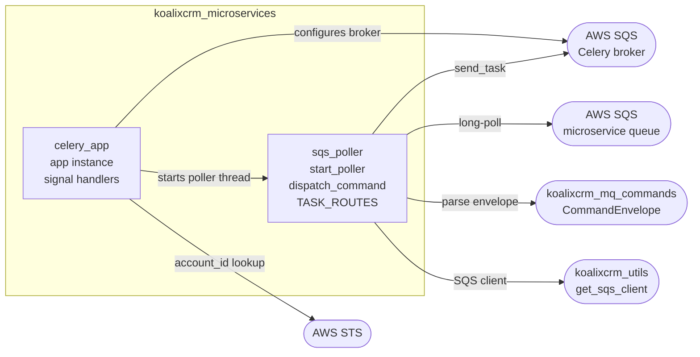
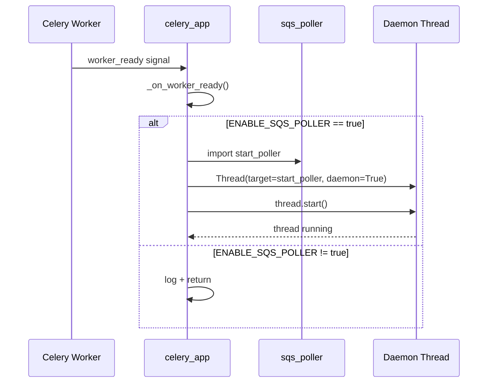
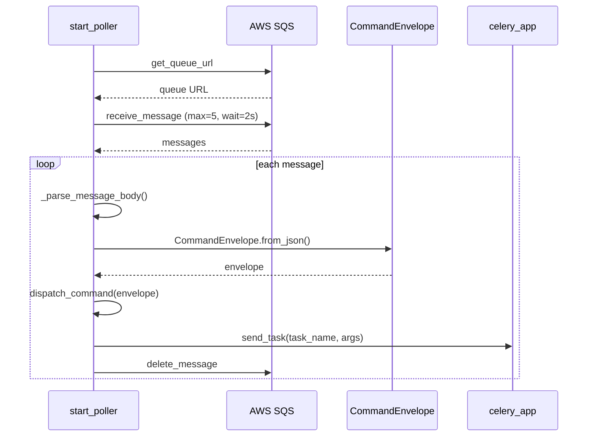
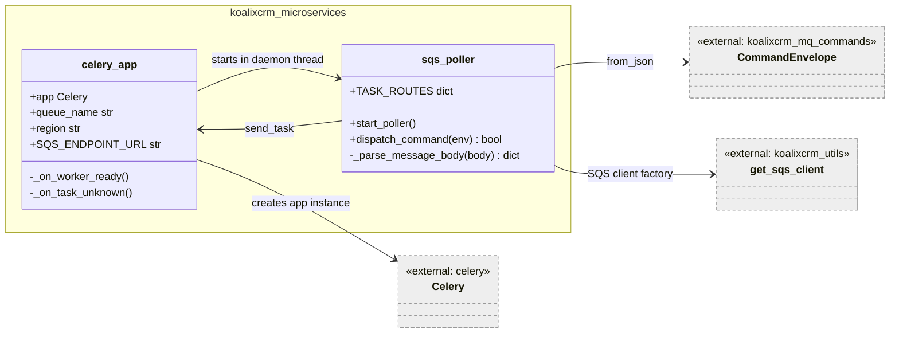

# koalixcrm_microservices — Mid-Level Documentation

## Introduction

### Purpose

The `koalixcrm_microservices` package provides the Celery application configuration
and the SQS long-poll dispatcher that together form the asynchronous command
processing infrastructure of koalixcrm. It configures Celery to use AWS SQS as its
message broker, registers Celery signal handlers that start a daemon-thread poller
on worker startup, and routes incoming `CommandEnvelope` messages from a dedicated
microservice queue to registered Celery tasks.

### Contents

| Module | Responsibility |
|--------|---------------|
| `celery_app` | Celery `app` instance, SQS broker configuration, `worker_ready` and `task_unknown` signal handlers |
| `sqs_poller` | SQS long-poll loop, `CommandEnvelope` parsing, command dispatch via `TASK_ROUTES` |

### Target Audience

Software engineers working on the koalixcrm backend who need to understand the
asynchronous task infrastructure, extend command routing, or troubleshoot SQS
connectivity.

### Glossary

| Term / Acronym | Full Form | Description |
|---|---|---|
| SQS | Simple Queue Service | AWS managed message queuing service |
| Celery | — | Distributed task queue library for Python |
| Broker | — | Message transport used by Celery; here AWS SQS via `kombu` |
| ElasticMQ | — | Local in-memory SQS-compatible server used in development |
| CELERY_SQS | — | Environment variable naming the default Celery broker queue |
| KOALIXCRM_MICROSERVICE_SQS | — | Environment variable naming the dedicated microservice command queue |
| `CommandEnvelope` | — | Generic message wrapper carrying a command type and payload |
| `TASK_ROUTES` | — | Dict mapping `CommandEnvelope.type` strings to lists of Celery task names |
| Daemon thread | — | Python thread terminated automatically when the parent process exits |
| STS | Security Token Service | AWS service used to retrieve the caller's account ID |

---

## Package Diagram

**Figure 1 — koalixcrm_microservices package overview**

For method-level detail on each module see [QQ_LL_Doc_Microservices.md](QQ_LL_Doc_Microservices.md).

---

## Interaction Diagrams

### Worker Startup and Poller Initialization

The following sequence describes how the SQS poller daemon thread is launched when a
Celery worker process finishes initializing.

**Figure 2 — Worker startup and poller initialization sequence**

### SQS Message Processing Loop

The following sequence describes a single iteration of the long-poll loop executed
by `start_poller` inside the daemon thread.

**Figure 3 — SQS message processing loop sequence**

Messages that cannot be parsed and messages with an unregistered command type are
both acknowledged and deleted from the queue (graceful discard). See the LL doc for
the full loop control flow including error branches:
[QQ_LL_Doc_Microservices.md](QQ_LL_Doc_Microservices.md).

---

## Class Diagrams per Package

**Figure 4 — Module class diagram**

---

## Design Patterns Used

**Observer / Signal** — Celery's `worker_ready` and `task_unknown` signals decouple
poller startup and unknown-message handling from the Celery bootstrap sequence. The
`celery_app` module registers handlers that react to these events without
tight-coupling to the worker lifecycle.

**Daemon Thread** — The SQS poller runs in a Python daemon thread so it does not
prevent clean worker shutdown. The thread is terminated automatically when the
worker process exits, preventing orphaned I/O loops.

**Routing Table** — `TASK_ROUTES` in `sqs_poller` is a plain dict mapping
`CommandEnvelope.type` strings to lists of Celery task names. New command types are
added by inserting entries into this dict, without modifying dispatch logic.

**Graceful Discard** — Both `_on_task_unknown` (for unregistered Celery task names
on the broker queue) and `dispatch_command` (for unregistered command types on the
microservice queue) acknowledge and delete unrecognised messages rather than leaving
them on the queue, preventing dead-letter accumulation during version mismatches.

---

## External Dependencies

| Dependency | Version | Role |
|------------|---------|------|
| `celery` | >= 5.0 | Celery application instance, signals, `send_task` |
| `kombu` | Celery dependency | AWS SQS transport for the Celery broker |
| `boto3` | >= 1.20 | SQS client (via `get_sqs_client`), STS account ID lookup |
| `koalixcrm_mq_commands` | Internal | `CommandEnvelope` dataclass used for message parsing |
| `koalixcrm_utils` | Internal | `get_sqs_client` factory function |

---

## Testing

Information not available.

---

## Appendix

### References

- [QQ_LL_Doc_Microservices.md](QQ_LL_Doc_Microservices.md) — Low-level documentation
  with method signatures, full control-flow diagrams, in-memory state, and security
  assessment for this package.

### Notes on Current State

`TASK_ROUTES` in `sqs_poller` is intentionally empty in the current codebase. PDF
export was delegated to a Java `pdf-export-service`; no Python-side command handlers
are registered. Future Python-side command handlers should be added to `TASK_ROUTES`
as entries mapping a `CommandEnvelope.type` string to a list of Celery task dotted
names.

### List of Illustrations

| Figure | Title |
|--------|-------|
| Figure 1 | koalixcrm_microservices package overview |
| Figure 2 | Worker startup and poller initialization sequence |
| Figure 3 | SQS message processing loop sequence |
| Figure 4 | Module class diagram |
