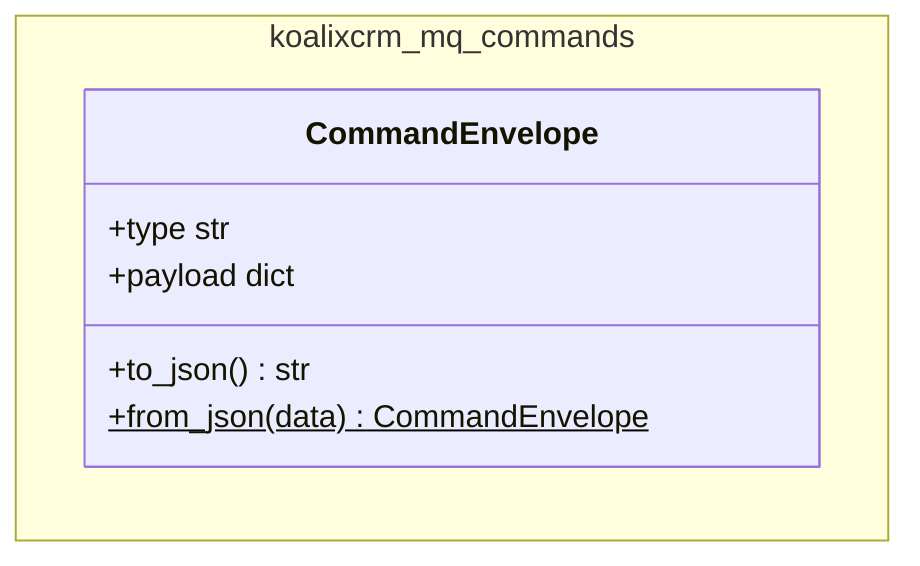
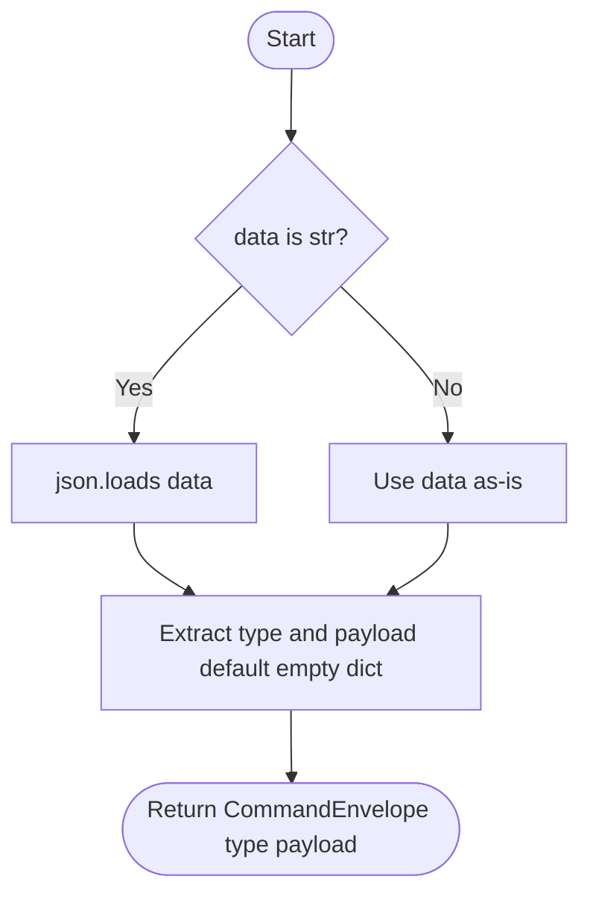
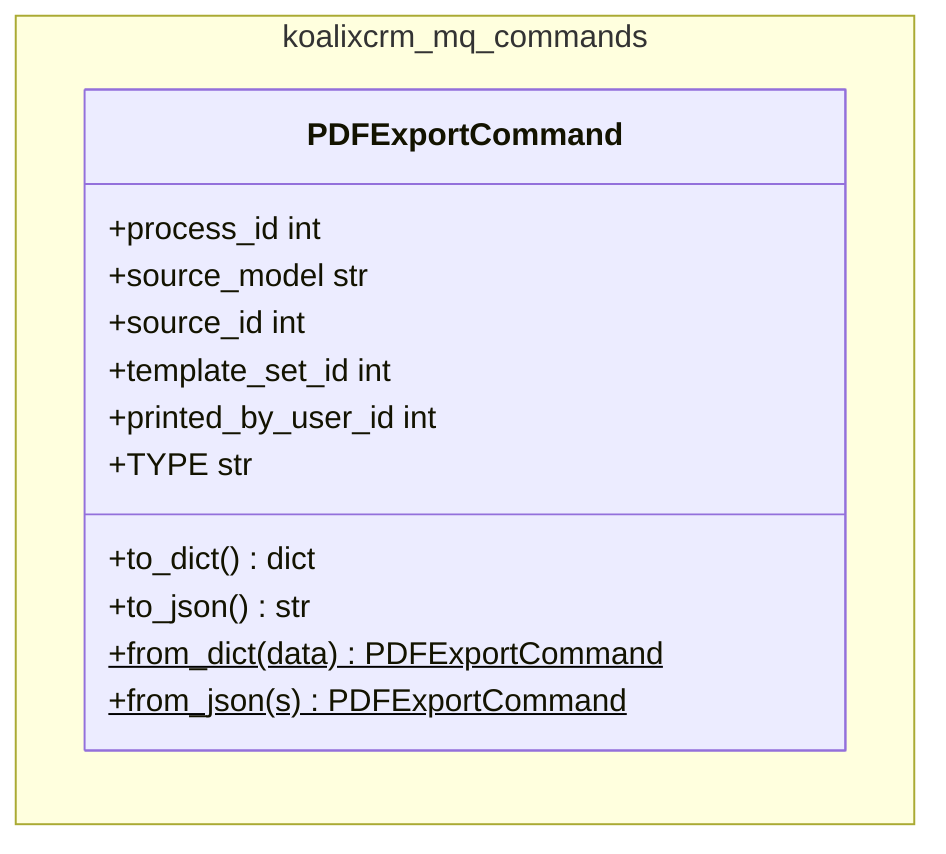
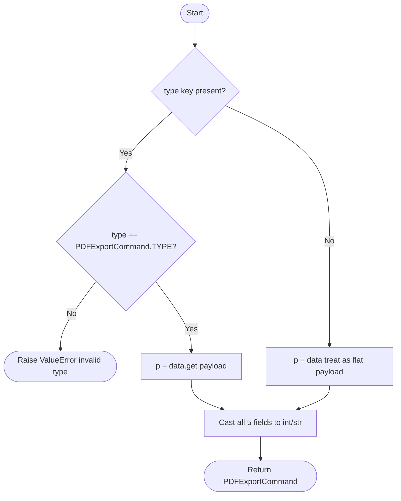

# koalixcrm_mq_commands — Low-Level Documentation

## Introduction

### Scope

This document covers the `koalixcrm_mq_commands/` package, which defines the
message contract for SQS-based inter-service communication. The following source
files are described:

| File | Purpose |
|------|---------|
| `envelope.py` | `CommandEnvelope` — generic message wrapper (type + payload) |
| `pdf_export_command.py` | `PDFExportCommand` — typed command for triggering PDF generation |
| `__init__.py` | Package exports: `CommandEnvelope`, `PDFExportCommand` |

### Target Audience

Software development engineers who implement command publishers (Django views, admin
actions) or command consumers (Celery workers, Java services) in the koalixcrm
ecosystem.

### Glossary

| Term/Acronym | Full Form | Description |
|---|---|---|
| SQS | Simple Queue Service | AWS managed message queuing service used as the inter-service transport |
| Envelope | — | Generic wrapper that carries any command type and its payload as a JSON string |
| Payload | — | The command-specific data dict nested inside an envelope |
| Dataclass | — | Python `@dataclass` decorator — auto-generates `__init__`, `__repr__`, and `__eq__` |
| M2M | Machine-to-Machine | Non-interactive service-to-service communication |
| FOP | Apache FOP | XSL-FO rendering engine used by the Java PDF export service |

---

## Architectural Invariant

`koalixcrm_mq_commands` is intentionally **Django-free**. It has no dependency on
`django`, `rest_framework`, or any koalixcrm model. This allows it to be imported
by:

- The Django application (publisher side — dispatches commands to SQS)
- The Celery worker (consumer side — parses commands from SQS)
- The Java PDF export service (if it ever needs a Python compatibility shim)
- Unit tests running under `pytest` without the `--ds` Django settings flag
  (the smoke test in `koalixcrm_microservices/tests/` is an example)

Any future commands added to this package must preserve this invariant.

---

## Detailed Components

### `CommandEnvelope`



**Caption: Figure 1 — CommandEnvelope dataclass**

`CommandEnvelope` is a Python `@dataclass` that represents the outer wrapper for any
command sent over SQS. It has two fields: `type` (a string naming the command, e.g.
`"PDFExportCommand"`) and `payload` (a dict carrying command-specific data). The
dataclass decorator provides `__init__`, `__repr__`, and `__eq__` automatically.
`__eq__` makes round-trip tests straightforward, as demonstrated in the smoke test.

The on-wire JSON format is:

```json
{"type": "PDFExportCommand", "payload": {"process_id": 1, ...}}
```

#### `to_json()`

**Signature:** `to_json() -> str`

Serializes the envelope to a JSON string using `json.dumps`. The output is
deterministic for a given type and payload. This method is the publisher-side
serialization entry point.

#### `from_json(data)` (static)

**Signature:** `from_json(data: str | dict) -> CommandEnvelope`

Deserializes an envelope from either a raw JSON string or an already-parsed dict.
When `data` is a string, `json.loads` is called first. The `payload` field defaults
to `{}` when absent from the input, preventing `KeyError` on incomplete messages.
This is the consumer-side deserialization entry point.



**Caption: Figure 2 — CommandEnvelope.from_json flow**

---

### `PDFExportCommand`



**Caption: Figure 3 — PDFExportCommand dataclass**

`PDFExportCommand` is a `@dataclass` representing a request to the PDF export
service. It carries all information the consumer needs to render a PDF without
further database queries:

- `process_id` — ID of the `PDFExportProcess` tracking record; the consumer writes
  the S3 URL of the generated PDF back to this record.
- `source_model` — string name of the source document type
  (`Invoice`, `Quotation`, `DespatchAdvice`, `SalesOrder`, `PurchaseOrder`,
  `CreditNote`, `PaymentReminder`).
- `source_id` — primary key of the source object.
- `template_set_id` — primary key of the `DocumentTemplate` set; determines which
  XSL and FOP configuration files are used.
- `printed_by_user_id` — primary key of the user who triggered the export; used for
  audit and notification.

`TYPE = "PDFExportCommand"` is a class-level constant used as the `type` field
value in the envelope. It is not an instance attribute and does not appear in
`__init__`.

The on-wire format nests the payload inside a `CommandEnvelope`-compatible structure:

```json
{
  "type": "PDFExportCommand",
  "payload": {
    "process_id": 42,
    "source_model": "Invoice",
    "source_id": 17,
    "template_set_id": 3,
    "printed_by_user_id": 1
  }
}
```

#### `to_dict()`

**Signature:** `to_dict() -> dict`

Returns the command as a dict in the `CommandEnvelope` wire format (top-level `type`
and `payload` keys). The result can be passed to `json.dumps` or directly to
`CommandEnvelope.from_json` for round-trip testing.

#### `to_json()`

**Signature:** `to_json() -> str`

Calls `to_dict()` and serializes to JSON. This is the publisher-side entry point for
sending a PDF export request to SQS.

#### `from_dict(data)` (class method)

**Signature:** `from_dict(data: dict) -> PDFExportCommand`

Accepts either a flat payload dict or the full envelope dict (with top-level `type`
and `payload` keys). When a `type` key is present it validates that the value equals
`PDFExportCommand.TYPE` and raises `ValueError` on mismatch. All five fields are
cast to `int` or `str` explicitly, providing clear `KeyError` / `ValueError`
messages when required fields are missing or have wrong types.



**Caption: Figure 4 — PDFExportCommand.from_dict flow**

#### `from_json(s)` (class method)

**Signature:** `from_json(s: str) -> PDFExportCommand`

Calls `json.loads(s)` and delegates to `from_dict`. This is the consumer-side
deserialization entry point.

---

## Design Patterns Used

**Value Object** — Both `CommandEnvelope` and `PDFExportCommand` are dataclasses
used as immutable value objects. Python's `@dataclass` with `eq=True` (default)
provides structural equality, making test assertions straightforward.

**Envelope pattern** — `CommandEnvelope` is a generic envelope that wraps any
command. This decouples the transport layer (SQS, the `sqs_poller`) from the
command semantics. New command types can be added by creating new dataclasses
without modifying the transport code.

**Explicit type discriminator** — The `type` string field in the envelope is the
discriminator used by the consumer to route to the correct handler. This is the
standard pattern for polymorphic message dispatch over a shared queue.

---

## External Dependencies

| Requirement | Version/Details | Notes |
|-------------|-----------------|-------|
| Python standard library | `json`, `dataclasses` | No third-party dependencies; deliberate to keep the package Django-free |

---

## Appendix

### References

- [koalixcrm_microservices documentation](../koalixcrm_microservices/QQ_LL_Doc_Microservices.md)

### List of Illustrations

| Figure | Title |
|--------|-------|
| Figure 1 | CommandEnvelope dataclass |
| Figure 2 | CommandEnvelope.from_json flow |
| Figure 3 | PDFExportCommand dataclass |
| Figure 4 | PDFExportCommand.from_dict flow |
