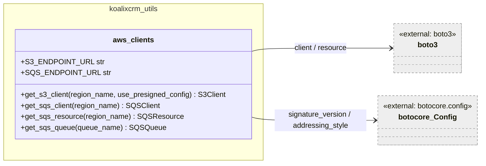
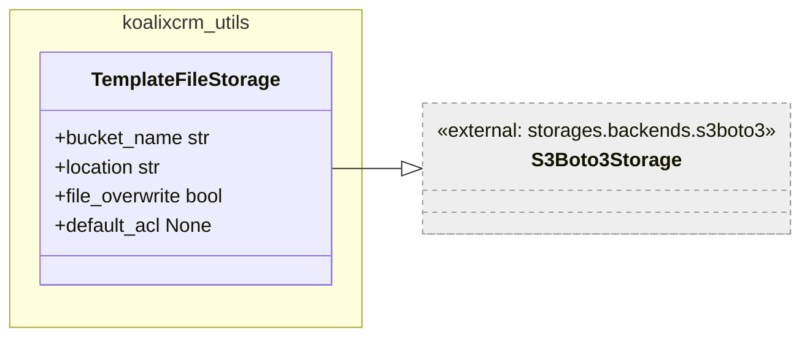
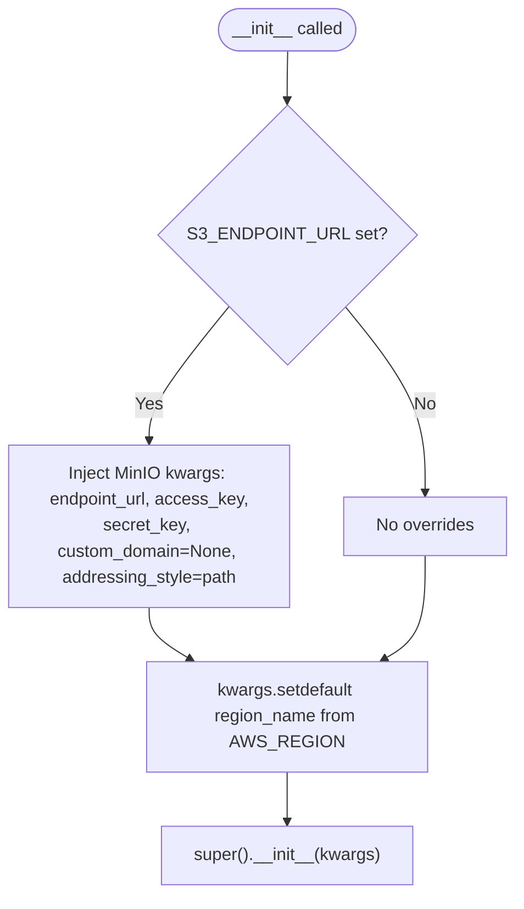
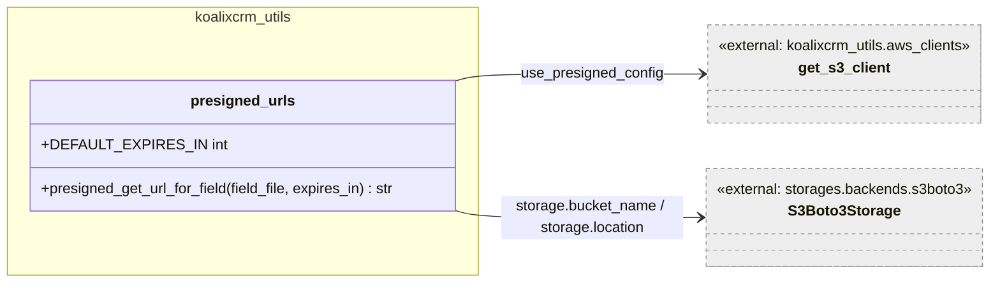
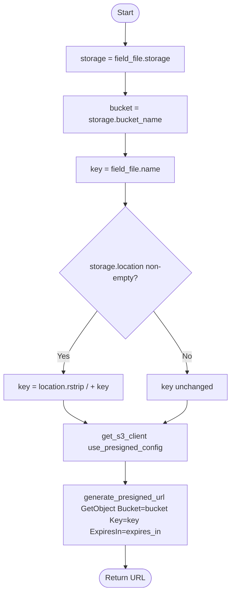
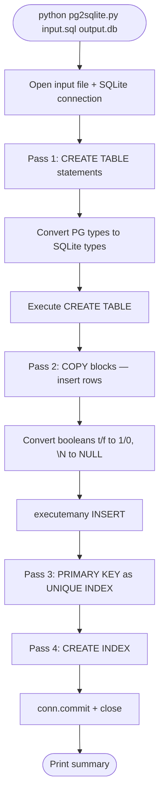
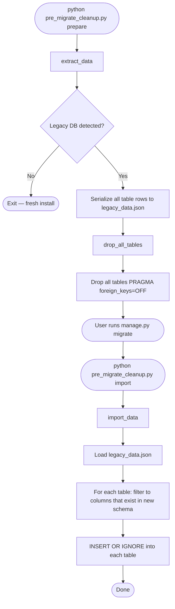

# koalixcrm_utils — Low-Level Documentation

## Introduction

### Scope

This document covers the `koalixcrm_utils/` package, which provides shared AWS
client factories, a Django storage backend for S3-backed template files, a presigned
URL helper, and two standalone database migration CLI scripts. The following source
files are described:

| File | Purpose |
|------|---------|
| `aws_clients.py` | Centralized boto3 factory functions for S3 and SQS, with local-service endpoint support |
| `s3_storage.py` | `TemplateFileStorage` — Django storage backend for XSL/FOP/logo files in S3 |
| `presigned_urls.py` | Helper to generate short-lived presigned S3 GET URLs for template assets |
| `pg2sqlite.py` | CLI script: converts a PostgreSQL dump to a SQLite3 database |
| `pre_migrate_cleanup.py` | CLI script: prepares a legacy database for Django migration |
| `__init__.py` | Package exports: `get_s3_client`, `get_sqs_client`, `get_sqs_resource`, `get_sqs_queue` |

### Target Audience

Software development engineers who need to understand, modify, or extend the AWS
integration, storage, or database migration utilities of koalixcrm.

### Glossary

| Term/Acronym | Full Form | Description |
|---|---|---|
| S3 | Simple Storage Service | AWS object storage service |
| SQS | Simple Queue Service | AWS managed message queuing service |
| MinIO | — | Open-source, S3-compatible object storage server used in local development |
| ElasticMQ | — | In-memory SQS-compatible server used in local development and testing |
| Presigned URL | — | Time-limited S3 URL granting temporary access to a private object without AWS credentials |
| FOP | Apache FOP | XSL-FO processor; uses the XSL, FOP config, and logo files stored by `TemplateFileStorage` |
| `s3v4` | AWS Signature Version 4 | AWS request signing algorithm required by many regions and by MinIO |
| pg_dump | — | PostgreSQL utility that produces SQL dump files |
| WAL | Write-Ahead Logging | SQLite journaling mode for improved concurrent read performance |

---

## Detailed Components

### `aws_clients` — boto3 Factory Functions

**Caption: Figure 1 — aws_clients module**

This module reads `S3_ENDPOINT_URL` and `SQS_ENDPOINT_URL` once at module import
time. All factory functions branch on these module-level variables to decide whether
to configure a local-service client or a standard AWS client.

#### `get_s3_client(region_name, use_presigned_config)`

**Signature:** `get_s3_client(region_name=None, use_presigned_config=False) -> S3Client`

Returns a boto3 S3 client. Three configurations are possible:

| Condition | Configuration |
|-----------|---------------|
| `S3_ENDPOINT_URL` set | Points to MinIO; uses `s3v4` + `path` addressing style; uses `AWS_ACCESS_KEY_ID` / `AWS_SECRET_ACCESS_KEY` env vars |
| `S3_ENDPOINT_URL` not set, `use_presigned_config=True` | Standard AWS; uses `s3v4` + `virtual` addressing style (required for presigned URLs to include the bucket in the hostname) |
| Neither | Standard AWS with default boto3 configuration |

The `path` addressing style is required for MinIO because MinIO does not support
virtual-hosted-style URLs. The `virtual` addressing style is required for presigned
URLs in production because AWS S3 deprecated path-style access for new buckets.

#### `get_sqs_client(region_name)`

**Signature:** `get_sqs_client(region_name=None) -> SQSClient`

Returns a boto3 SQS low-level client. When `SQS_ENDPOINT_URL` is set, the client
points to ElasticMQ with dummy credentials (`"dummy"`). Region defaults to
`AWS_REGION` env var, then `eu-west-3`.

#### `get_sqs_resource(region_name)`

**Signature:** `get_sqs_resource(region_name=None) -> SQSResource`

Returns a boto3 SQS high-level resource (the `boto3.resource` API). Configuration
mirrors `get_sqs_client`. Used by `get_sqs_queue` for the `Queue` abstraction.

#### `get_sqs_queue(queue_name)`

**Signature:** `get_sqs_queue(queue_name=None) -> SQSQueue`

Convenience wrapper. Calls `get_sqs_resource()` and then `get_queue_by_name`. The
queue name defaults to the `KOALIXCRM_MICROSERVICE_SQS` env var, with a further
fallback of `koalixcrm-microservice-sqs`.

---

### `TemplateFileStorage`

**Caption: Figure 2 — TemplateFileStorage class**

`TemplateFileStorage` is a Django storage backend subclassing `S3Boto3Storage` from
`django-storages`. It stores files under the `templates/` prefix in the
`S3_PDF_BUCKET` bucket (default `koalixcrm-pdf-exports`). This bucket is also used
to store generated PDF output, with the prefix keeping template assets and PDF
output separate.

Key configuration:

- `file_overwrite = False` — uploading a file with the same name creates a new
  unique key rather than overwriting. This preserves historical template versions
  when a template is replaced via the Django admin.
- `default_acl = None` — relies on the bucket's ACL policy rather than setting a
  per-object ACL. This is the recommended setting for buckets with Block Public
  Access enabled.

#### `__init__`

The constructor detects `S3_ENDPOINT_URL` and injects MinIO-specific kwargs:
`endpoint_url`, `access_key`, `secret_key`, `custom_domain = None`, and
`addressing_style = "path"`. The `custom_domain = None` override prevents
`django-storages` from constructing virtual-hosted URLs (which MinIO does not
support). All kwargs are passed to `super().__init__(**kwargs)`.

**Caption: Figure 3 — TemplateFileStorage.__init__ flow**

---

### `presigned_urls` — Presigned URL Helper

**Caption: Figure 4 — presigned_urls module**

#### `presigned_get_url_for_field(field_file, expires_in)`

**Signature:** `presigned_get_url_for_field(field_file, expires_in=DEFAULT_EXPIRES_IN) -> str`

Generates a presigned `GetObject` URL for a Django `FileField` backed by
`S3Boto3Storage`. The default expiry is 300 seconds (5 minutes), overridable via
the `PRESIGNED_URL_EXPIRES_IN` environment variable.

The function constructs the full S3 key by prepending the storage backend's
`location` prefix (e.g. `templates/`) to the field's `name`. It calls
`get_s3_client(use_presigned_config=not bool(S3_ENDPOINT_URL))`: in production
(no `S3_ENDPOINT_URL`) this enables virtual-hosted-style URLs required for presigned
URL generation; in local/MinIO mode path-style addressing is used.

**Caption: Figure 5 — presigned_get_url_for_field flow**

The caller is responsible for checking that `field_file` is non-empty before
calling this function.

---

### `pg2sqlite.py` — PostgreSQL to SQLite Converter (CLI)

This is a standalone CLI script with no Django dependency. It converts a PostgreSQL
`pg_dump` SQL file to a SQLite3 database in four sequential passes.

**Caption: Figure 6 — pg2sqlite.py overall flow**

#### `parse_create_table(lines, idx)`

**Signature:** `parse_create_table(lines, idx) -> tuple[str, str, int]`

Parses a `CREATE TABLE public."table_name" (` block starting at line index `idx`.
Returns `(table_name, sql, next_idx)`. PostgreSQL-specific type names are replaced
with their SQLite equivalents via `re.sub`:

| PostgreSQL type | SQLite type |
|-----------------|-------------|
| `boolean` | `INTEGER` |
| `character varying(N)` / `character varying` | `TEXT` |
| `numeric(N,M)` | `REAL` |
| `integer`, `bigint`, `smallint` | `INTEGER` |
| `date`, `timestamp*` | `TEXT` |
| `double precision` | `REAL` |
| `bytea` | `BLOB` |

The regex only replaces the type portion of each column definition (after the column
name) to avoid corrupting column names that happen to contain type keywords.

#### `parse_copy_block(lines, idx)`

**Signature:** `parse_copy_block(lines, idx) -> tuple[str, list, list, int]`

Parses a `COPY public.table (...) FROM stdin;` block. Reads tab-separated rows
until `\.`. Converts `\N` to `None` (SQL NULL), `t` to `1`, and `f` to `0` for
PostgreSQL boolean representation. Returns `(table_name, columns, rows, next_idx)`.

#### `main()`

Orchestrates the four passes. Each pass is a linear scan of all input lines.
Primary key constraints (which SQLite cannot add after table creation) are converted
to `CREATE UNIQUE INDEX` statements. The `PRAGMA foreign_keys=OFF` is set during
import and turned back on afterwards. `PRAGMA journal_mode=WAL` is set for
performance. Failed row insertions fall back to row-by-row insertion to maximise
data recovery.

---

### `pre_migrate_cleanup.py` — Legacy Database Migration Preparation (CLI)

This is a standalone CLI script for upgrading an existing legacy koalixcrm database
to the new Django app structure. It is idempotent: on a fresh install (no legacy
tables detected) it exits without modifying anything.

Three sub-commands are available:

| Sub-command | Action |
|-------------|--------|
| `prepare` (default) | Run `extract`, then `drop_all_tables` |
| `extract` | Dump all table data to `legacy_data.json` |
| `import` | Import data from `legacy_data.json` into the already-migrated database |

**Caption: Figure 7 — pre_migrate_cleanup.py workflow**

#### Legacy detection logic

`extract_data` checks for the presence of the `django_migrations` table and then
for a specific migration entry (`app='crm'`, `name='0002_auto_20170927_2042'`).
Only when this entry exists is the database treated as a legacy upgrade candidate.
This prevents accidental data loss on fresh installs.

#### `import_data(db_path, dump_path)`

Skips tables in `skip_tables` (`django_migrations`, `django_content_type`,
`auth_permission`, `south_migrationhistory`) because Django repopulates these during
`migrate`. For each table it intersects the columns from the dump with the columns
in the new schema, dropping any columns that no longer exist. Uses
`INSERT OR IGNORE` to handle pre-existing rows gracefully. Falls back to
row-by-row insertion on batch failure.

---

## Persistent Storage

| Component | Storage | Details |
|-----------|---------|---------|
| `TemplateFileStorage` | AWS S3 / MinIO | Bucket: `S3_PDF_BUCKET` (default `koalixcrm-pdf-exports`), prefix `templates/` |
| `pg2sqlite.py` | Local SQLite file | Output path is a CLI argument; default `/app/koalixcrm/db.sqlite3` |
| `pre_migrate_cleanup.py` | Local SQLite file + JSON dump | DB path and dump path are CLI arguments; defaults in `projectsettings/` |

---

## Access to External Interfaces

| Interface | Type of Call | Expected Duration | Notes |
|-----------|-------------|-------------------|-------|
| S3 `generate_presigned_url` | Blocking, local (no network) | <5 ms | Presigned URL is generated locally using the signing key; no S3 network call |
| S3 upload (via `TemplateFileStorage`) | Blocking write | ~100 ms – 2 s | Triggered by Django admin file uploads |
| SQS `get_queue_url` | Blocking read | ~50–200 ms | Called by `get_sqs_queue` |

---

## Security

### Assets

| Asset | Description | Security Measure | Assessment of Criticality |
|-------|-------------|------------------|---------------------------|
| `AWS_ACCESS_KEY_ID` / `AWS_SECRET_ACCESS_KEY` | AWS credentials for S3 and SQS | Read from environment variables; in local mode defaults to MinIO credentials (`minioadmin`/`minioadmin123`) | Blocker if production credentials are stored in version control or hardcoded; uncritical when using IAM roles |
| MinIO default credentials (`minioadmin` / `minioadmin123`) | Hardcoded fallback in `get_s3_client` and `TemplateFileStorage.__init__` | Only active when `S3_ENDPOINT_URL` is set (development/test environments) | Uncritical in local development; must not reach production |
| Presigned URL | Time-limited S3 URL granting download access | Expires after `PRESIGNED_URL_EXPIRES_IN` seconds (default 300 s) | Uncritical — time-limited; URL does not expose AWS credentials |
| `legacy_data.json` | Full database dump written by `pre_migrate_cleanup.py` | Written to local filesystem; not managed by Django | Moderate — contains all application data; should be deleted after successful import |

---

## Design Patterns Used

**Factory Function** — `get_s3_client`, `get_sqs_client`, `get_sqs_resource`, and
`get_sqs_queue` are factory functions that encapsulate client creation and
environment-based configuration switching. Callers do not need to know whether they
are talking to AWS or a local emulator.

**Strategy (implicit)** — The module-level `S3_ENDPOINT_URL` and `SQS_ENDPOINT_URL`
variables act as strategy selectors, switching between AWS and local-service
implementations at import time without subclassing or dependency injection.

**Template Method (CLI scripts)** — `pg2sqlite.py` and `pre_migrate_cleanup.py`
both follow a sequential multi-pass algorithm defined in `main()`, with each pass
implemented as a separate function. This makes individual passes testable in
isolation.

---

## External Dependencies

| Requirement | Version/Details | Notes |
|-------------|-----------------|-------|
| `boto3` | `>=1.20` | S3 and SQS client and resource |
| `botocore` | Boto3 dependency | `botocore.config.Config` for signature version and addressing style |
| `django-storages` | `>=1.13` | `S3Boto3Storage` base class for `TemplateFileStorage` |
| `django` | `>=4.2` | `FileField` / `Storage` abstraction used by `presigned_urls` |
| Python standard library | `sqlite3`, `re`, `json`, `os`, `sys` | Used by CLI scripts; no third-party dependencies in those modules |

---

## Appendix

### References

- [boto3 S3 presigned URLs](https://boto3.amazonaws.com/v1/documentation/api/latest/guide/s3-presigned-urls.html)
- [django-storages S3Boto3Storage](https://django-storages.readthedocs.io/en/latest/backends/amazon-S3.html)
- [MinIO Python SDK (S3-compatible)](https://min.io/docs/minio/linux/developers/python/API.html)
- [SQLite PRAGMA journal_mode](https://www.sqlite.org/pragma.html#pragma_journal_mode)

### List of Illustrations

| Figure | Title |
|--------|-------|
| Figure 1 | aws_clients module |
| Figure 2 | TemplateFileStorage class |
| Figure 3 | TemplateFileStorage.__init__ flow |
| Figure 4 | presigned_urls module |
| Figure 5 | presigned_get_url_for_field flow |
| Figure 6 | pg2sqlite.py overall flow |
| Figure 7 | pre_migrate_cleanup.py workflow |
