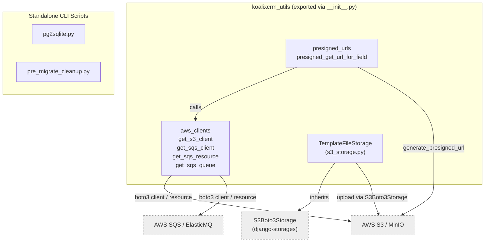
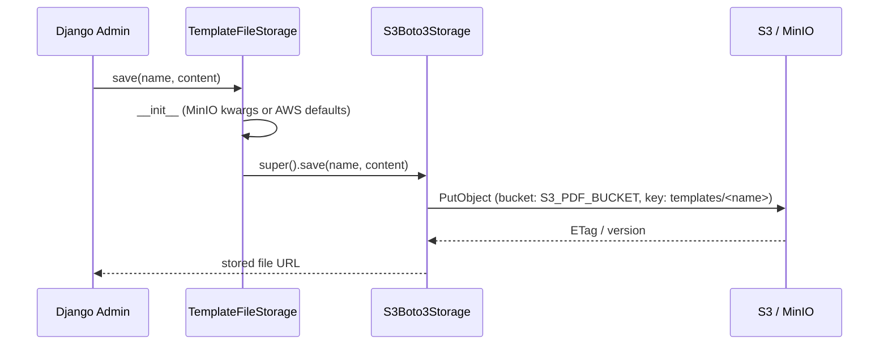
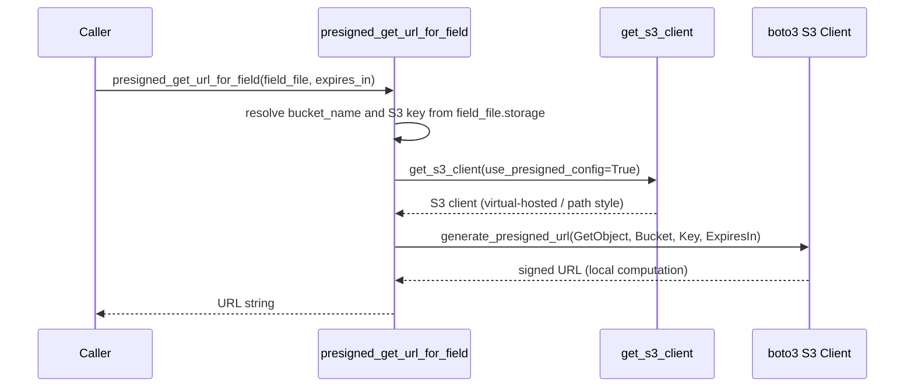
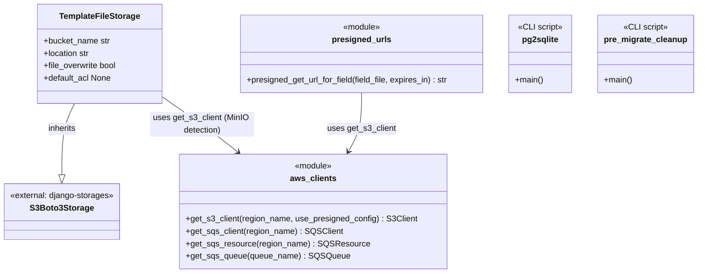

# koalixcrm_utils — Mid-Level Documentation

## Introduction

### Purpose

The `koalixcrm_utils/` package provides shared AWS infrastructure utilities for the
koalixcrm application. It covers four areas:

1. **AWS client factories** — centralised boto3 factory functions for S3 and SQS,
   with transparent support for local emulators (MinIO for S3, ElasticMQ for SQS).
2. **S3 template storage** — a Django storage backend (`TemplateFileStorage`) that
   stores XSL/FOP template files in S3 under a dedicated prefix.
3. **Presigned URL generation** — a helper that produces short-lived S3 GET URLs for
   template assets without exposing AWS credentials to clients.
4. **CLI migration scripts** — two standalone scripts for converting a PostgreSQL dump
   to SQLite (`pg2sqlite.py`) and for preparing a legacy koalixcrm database for Django
   migration (`pre_migrate_cleanup.py`).

### Target Audience

Software engineers who need to understand the integration boundaries, component
responsibilities, or interaction flows of the `koalixcrm_utils/` package without
requiring source-level detail. For method signatures, internal flow diagrams, and
field-level descriptions, refer to the
[low-level document](QQ_LL_Doc_Utils.md).

### Glossary

| Term / Acronym | Full Form | Description |
|---|---|---|
| S3 | Simple Storage Service | AWS object storage service |
| SQS | Simple Queue Service | AWS managed message queuing service |
| MinIO | — | S3-compatible object storage server used in local development |
| ElasticMQ | — | SQS-compatible in-memory server used in local development |
| Presigned URL | — | Time-limited S3 URL granting temporary access to a private object without AWS credentials |
| FOP | Apache FOP | XSL-FO processor; consumes the template files stored by `TemplateFileStorage` |
| s3v4 | AWS Signature Version 4 | Request-signing algorithm required by most AWS regions and by MinIO |
| pg_dump | — | PostgreSQL utility that produces SQL dump files |
| WAL | Write-Ahead Logging | SQLite journaling mode used by `pg2sqlite.py` for improved read concurrency |

---

## Package Diagram

**Figure 1 — koalixcrm_utils package overview**

The four factory functions in `aws_clients` are re-exported from `__init__.py`
and are the primary integration point for the rest of the application. The CLI
scripts (`pg2sqlite.py` and `pre_migrate_cleanup.py`) are standalone tools with no
Django dependency and are not exported.

For method signatures, configuration details, and internal flow diagrams see the
[low-level document](QQ_LL_Doc_Utils.md).

---

## Interaction Diagrams

### Template File Upload to S3

When a user uploads an XSL/FOP template file through the Django admin, the request
flows through `TemplateFileStorage` before reaching the S3 bucket. The storage
backend selects MinIO or AWS configuration depending on whether `S3_ENDPOINT_URL`
is set in the environment.

**Figure 2 — Template file upload sequence**

`file_overwrite=False` means that re-uploading a file with the same name creates a
new unique key rather than replacing the existing object, preserving historical
template versions.

### Presigned URL Generation

Callers that need to serve a template file to an external client (for example an FOP
renderer) call `presigned_get_url_for_field`. The function constructs the S3 key
from the field's storage prefix and name, then generates a signed URL locally — no
network call to S3 is made during signing.

**Figure 3 — Presigned URL generation sequence**

In local development (`S3_ENDPOINT_URL` set), `use_presigned_config=False` and
path-style addressing is used. In production (`S3_ENDPOINT_URL` not set),
`use_presigned_config=True` selects virtual-hosted-style addressing, which is
required for AWS presigned URLs.

---

## Class Diagram

**Figure 4 — koalixcrm_utils class and module relationships**

---

## Design Patterns Used

**Factory Function** — `get_s3_client`, `get_sqs_client`, `get_sqs_resource`, and
`get_sqs_queue` are factory functions that encapsulate client construction and
environment-based configuration. Callers do not need to know whether they are
talking to AWS or a local emulator. See the
[low-level document](QQ_LL_Doc_Utils.md) for per-function configurations.

**Strategy (implicit)** — `S3_ENDPOINT_URL` and `SQS_ENDPOINT_URL` are read once at
module import time and act as strategy selectors, switching the entire AWS vs.
local-service implementation path without subclassing or runtime dependency
injection. Adding a new environment produces a new strategy branch without changing
caller code.

**Template Method (CLI scripts)** — Both `pg2sqlite.py` and `pre_migrate_cleanup.py`
define a `main()` function that orchestrates a fixed sequence of passes or
sub-commands. Each pass is implemented as a separate function, making the algorithm
extensible and individual passes independently testable.

---

## External Dependencies

| Dependency | Version | Role |
|---|---|---|
| `boto3` | >= 1.20 | S3 and SQS client and resource factory |
| `botocore` | Boto3 dependency | `Config` for signature version and addressing style |
| `django-storages` | >= 1.13 | `S3Boto3Storage` base class for `TemplateFileStorage` |
| `Django` | >= 4.2 | `FileField` / `Storage` abstraction used by `presigned_urls` |
| Python stdlib (`sqlite3`, `re`, `json`, `os`, `sys`) | — | Used by CLI scripts; no third-party deps in those modules |

---

## Testing

Information not available.

---

## Appendix

### Security Note

The MinIO default credentials (`minioadmin` / `minioadmin123`) are hardcoded in
`get_s3_client` and `TemplateFileStorage.__init__` as a development-only fallback,
active only when `S3_ENDPOINT_URL` is set. These credentials must not reach a
production environment. In production, IAM roles or environment-variable-supplied
credentials are used and the hardcoded fallback is never reached.

### References

- [QQ_LL_Doc_Utils.md](QQ_LL_Doc_Utils.md) — Low-level documentation for `koalixcrm_utils/`

### List of Illustrations

| Figure | Title |
|---|---|
| Figure 1 | koalixcrm_utils package overview |
| Figure 2 | Template file upload sequence |
| Figure 3 | Presigned URL generation sequence |
| Figure 4 | koalixcrm_utils class and module relationships |
