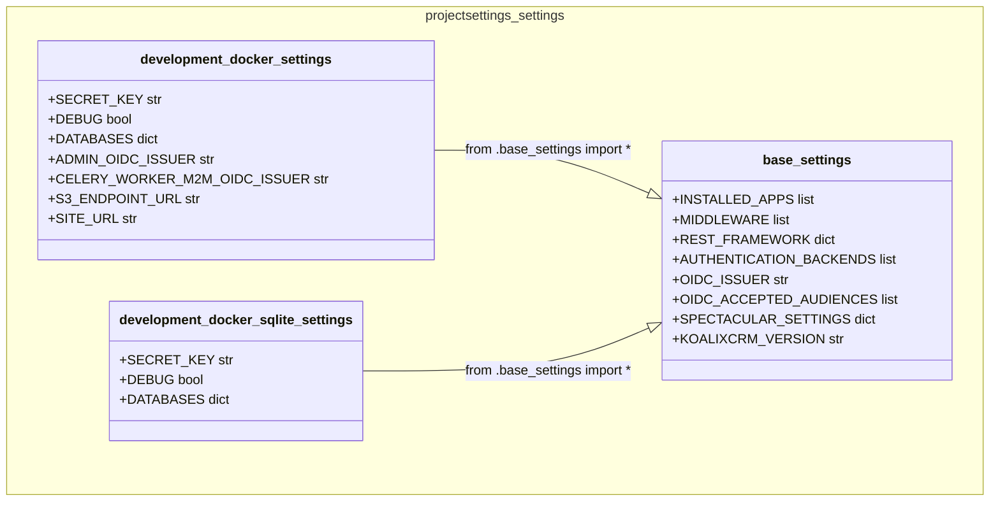
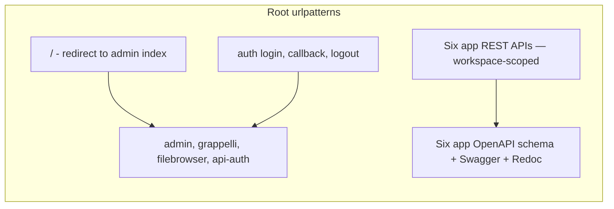
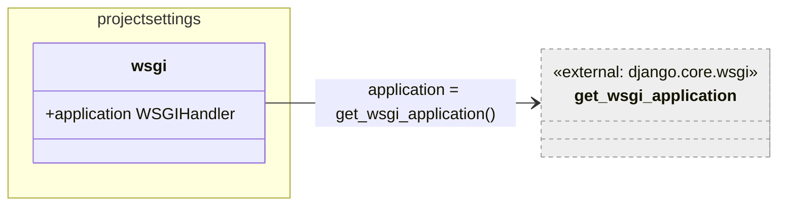
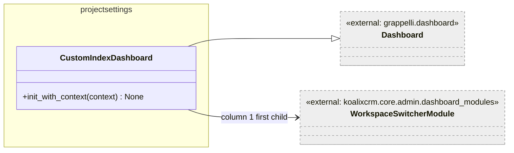

# projectsettings — Low-Level Documentation

## Introduction

### Scope

This document covers the `projectsettings/` package, which is the Django project
configuration layer for koalixcrm. It defines the settings hierarchy, the root URL
configuration, the WSGI entry point, and the Grappelli admin dashboard. The
following source files are described:

| File | Purpose |
|------|---------|
| `settings/base_settings.py` | Base Django settings shared by all environments |
| `settings/development_docker_settings.py` | Docker development overlay (PostgreSQL or SQLite, Keycloak, MinIO) |
| `settings/development_docker_sqlite_settings.py` | Docker development overlay fixed to SQLite |
| `urls.py` | Root URL configuration with all six API mount points, auth URLs, and per-app OpenAPI docs |
| `wsgi.py` | WSGI entry point |
| `dashboard.py` | Grappelli custom admin dashboard |

### Target Audience

Software development engineers who need to understand, modify, or extend the
project-level configuration, URL routing, or admin dashboard of koalixcrm.

### Glossary

| Term/Acronym | Full Form | Description |
|---|---|---|
| WSGI | Web Server Gateway Interface | Python standard interface between web servers and web applications |
| Grappelli | — | Django admin skin that adds a modernised UI; provides the dashboard framework |
| CR-002 | Change Request 002 | Internal change request defining the REST API routing and versioning convention |
| OIDC | OpenID Connect | Identity layer used for admin login via Keycloak |
| M2M | Machine-to-Machine | Non-interactive service authentication via Client Credentials Grant |
| `drf-spectacular` | — | Django REST Framework library for generating OpenAPI schemas |
| Swagger UI | — | Interactive HTML API documentation generated from an OpenAPI schema |
| Redoc | — | Alternative HTML API documentation renderer for OpenAPI schemas |
| Workspace | — | Tenant isolation unit in koalixcrm; scopes all business data |
| `KOALIXCRM_VERSION` | — | Application version string injected at image build time via CI |

---

## Detailed Components

### Settings Module Hierarchy

**Caption: Figure 1 — Settings module inheritance hierarchy**

The settings follow a layered overlay pattern: `base_settings.py` defines all
shared defaults; environment-specific overlays import everything from
`base_settings` via `from .base_settings import *` and then override or extend
individual variables.

#### `base_settings.py`

This file defines all settings that are common across every deployment environment.
Notable decisions encoded here:

**Application list split** — `INSTALLED_APPS` is built from two lists:
`PREREQUISITE_APPS` (Django core, Grappelli, FileBrowser, DRF, and plugins) and
`PROJECT_APPS` (koalixcrm domain modules). This split makes it easier to see which
apps are koalixcrm's own versus framework dependencies.

**Middleware order** — `WorkspaceContextMiddleware` is inserted after
`AuthenticationMiddleware` so that `request.user` is available when the middleware
resolves the active workspace. `TimezoneMiddleware` follows the workspace middleware
at the end.

**DRF authentication chain** — Four authenticators are registered in priority order:

1. `CeleryWorkerM2MAuthentication` — M2M JWT (Client Credentials)
2. `OIDCAccessTokenAuthentication` — OIDC Bearer JWT (user or service)
3. `SessionAuthentication` — Django session (admin UI)
4. `BasicAuthentication` — HTTP Basic (testing)

**OIDC settings** — `OIDC_ISSUER` and `OIDC_ACCEPTED_AUDIENCES` are read from
environment variables. `OIDC_ACCEPTED_AUDIENCES` is split on commas and stripped,
producing a list. An empty env var produces an empty list.

**Version** — `KOALIXCRM_VERSION` reads from the `KOALIXCRM_VERSION` env var (set
by CI from the Docker `ARG APP_VERSION` at image build time). When not set it
defaults to `"vX.Y.Z-develop"` to prevent confusion with real release builds.

**Template directories** — `koalixcrm/core/templates` is listed before `templates`
in `DIRS`, allowing the core app to override Grappelli admin templates.

#### `development_docker_settings.py`

Extends `base_settings` for the Docker Compose development environment. Key
additions:

- `DB_CHOICE` env var selects between PostgreSQL (default) and SQLite. All database
  connection parameters are read from env vars (`POSTGRES_*`).
- All OIDC and M2M configuration variables (`ADMIN_OIDC_*`,
  `CELERY_WORKER_M2M_*`) are read from environment variables; they are `None` by
  default, disabling the respective features when not set.
- `S3_PDF_BUCKET` configures the target S3/MinIO bucket.
- `SITE_URL` is used by the auth views to build absolute callback URLs; an empty
  string causes the views to fall back to `request.build_absolute_uri`.
- `DEBUG = True` by default but overridable via `DJANGO_DEBUG` env var.
- `SECRET_KEY` defaults to `'modify_during_deployment'` — this is intentional for
  development; production deployments must override it.

#### `development_docker_sqlite_settings.py`

Minimal overlay that fixes the database to SQLite (`db.sqlite3` next to the
`projectsettings` package) with `DEBUG = True` and a hardcoded secret key. Intended
for lightweight local development without the Docker Compose stack.

---

### `urls.py` — Root URL Configuration

**Caption: Figure 2 — Root URL pattern groups**

The URL configuration follows CR-002: REST resources are mounted at
`/<app>/api/v1/<workspace_id>/<resource>/`. Each of the six domain apps gets:

- One REST API mount point (delegates to the app's own `urls.py` or `api_urls.py`)
- One `SpectacularAPIView` endpoint (`/schema/v1/`) that generates the OpenAPI
  schema for that app's URL conf in isolation
- One Swagger UI endpoint (`/swagger/v1/`)
- One Redoc endpoint (`/redoc/v1/`)

This means each app has its own self-contained OpenAPI document, rather than one
global schema that mixes all apps. The per-app `SpectacularAPIView` is configured
with `urlconf=<app>_api_urls` and `custom_settings=<app>_swagger_settings`
(containing title, description, version).

**Admin login override** — `admin.site.login` is replaced with
`LoginSelectionView.as_view()`. This means navigating to `/admin/` when not
authenticated redirects to OIDC rather than Django's built-in login form (unless
OIDC is not configured, in which case `LoginSelectionView` falls back to the form).
The workspace switch view is registered before `admin/` so its named URL
(`core-workspace-switch`) takes precedence.

**Six API apps and their URL roots:**

| App | URL prefix | URL module |
|-----|------------|------------|
| accounting | `/koalixcrm_accounting/api/v1/<workspace_id>/` | `koalixcrm.accounting.urls` |
| contacts | `/koalixcrm_contacts/api/v1/<workspace_id>/` | `koalixcrm.contacts.urls` |
| products | `/koalixcrm_products/api/v1/<workspace_id>/` | `koalixcrm.products.urls` |
| core | `/koalixcrm_core/api/v1/<workspace_id>/` | `koalixcrm.core.urls` |
| contracts | `/koalixcrm_contracts/api/v1/<workspace_id>/` | `koalixcrm.contracts.urls` |
| reporting | `/koalixcrm_reporting/api/v1/<workspace_id>/` | `koalixcrm.reporting.api_urls` |

The reporting app uses `api_urls` (rather than `urls`) because its `urls.py` is
reserved for legacy HTML views mounted at `/koalixcrm/crm/reporting/`.

---

### `wsgi.py` — WSGI Entry Point

**Caption: Figure 3 — wsgi module**

`wsgi.py` sets `DJANGO_SETTINGS_MODULE` to
`koalixcrm.projectsettings.settings.production_docker_postgres_settings` as the
default (via `os.environ.setdefault`). This default is overridden in development by
the Docker Compose environment setting or by the `DJANGO_SETTINGS_MODULE` env var.

`application = get_wsgi_application()` is the module-level callable that WSGI
servers (Gunicorn, uWSGI) look for. Django initialises the application stack at
first import.

Information not available: The `production_docker_postgres_settings` module is
referenced in `wsgi.py` but not present in the source tree provided. Its exact
settings (database, ALLOWED_HOSTS, DEBUG, caching, logging) are not available for
documentation.

---

### `dashboard.py` — Grappelli Custom Index Dashboard

**Caption: Figure 4 — CustomIndexDashboard class**

`CustomIndexDashboard` extends Grappelli's `Dashboard` class and is activated by
setting `GRAPPELLI_INDEX_DASHBOARD = 'projectsettings.dashboard.CustomIndexDashboard'`
in the settings overlays.

`init_with_context(context)` is called by Grappelli on each admin index page render.
It populates `self.children` with the dashboard modules in layout order. The modules
are distributed across three columns:

**Column 1** — Primary navigation modules:

| Module | Type | Contents |
|--------|------|---------|
| `WorkspaceSwitcherModule` | Custom | Active workspace selector (always first; see CR-8 S8.6) |
| Main group | `modules.Group` | Collapsible sections for all business objects |
| -> Commercial Documents | `ModelList` | Contracts, Quotations, SalesOrders, DespatchAdvice, Invoices, CreditNotes, PaymentReminders, PurchaseOrders |
| -> Products | `ModelList` | ProductType |
| -> Parties | `ModelList` | Organizations, NaturalPersons, Parties, PartyRoles, Memberships, Relationships |
| -> Addresses & Contact Mechanisms | `ModelList` | Addresses, Phones, Emails, and their assignment models |
| -> Accounting | `ModelList` | All `koalixcrm.accounting.*` models |
| -> Projects | `ModelList` | Projects, ReportingPeriods, Tasks, Agreements, Estimations, HumanResources |
| -> Report Work And Expenses | `LinkList` | Time Tracking and Set Timezone links |

**Column 2** — Administrative and support modules:

| Module | Type | Contents |
|--------|------|---------|
| Support | `LinkList` | GitHub link |
| Version Information | `LinkList` | Backend and API version links |
| Users, Access Rights and Application Settings | `modules.Group` | Auth/admin models, Workspaces, Contact settings, Product settings, Reporting settings, PDF document settings |

**Column 3:**

| Module | Type | Contents |
|--------|------|---------|
| Recent Actions | `RecentActions` | Last 5 admin actions across all models |

The `WorkspaceSwitcherModule` is placed first in column 1 so the active workspace
context is immediately visible after login. The dashboard title is dynamically
populated from `settings.KOALIXCRM_VERSION`.

---

## In-Memory State

| State | Module | Notes |
|-------|--------|-------|
| Django settings module (`django.conf.settings`) | `base_settings` et al. | Module-level constants loaded once at startup; shared across all threads in the process |
| URL resolver cache | `urls.py` | Django caches compiled URL patterns after first request; process-local |
| WSGI `application` object | `wsgi.py` | Single instance per process; Django middleware stack is constructed once |

---

## Security

### Assets

| Asset | Description | Security Measure | Assessment of Criticality |
|-------|-------------|------------------|---------------------------|
| `SECRET_KEY` | Django secret key; used for session signing, CSRF tokens, and password reset links | Read from `DJANGO_SECRET_KEY` env var in docker settings; hardcoded `'modify_during_deployment'` in SQLite dev settings | Blocker if the hardcoded key is used in production |
| `ADMIN_OIDC_CLIENT_SECRET` | OIDC client secret for admin browser login | Read from environment variable | Uncritical when delivered via secret manager |
| `CELERY_WORKER_M2M_CLIENT_SECRET` | OIDC client secret for M2M auth | Read from environment variable | Uncritical when delivered via secret manager |
| `POSTGRES_PASSWORD` | PostgreSQL password | Read from `POSTGRES_PASSWORD` env var; defaults to `'koalixcrm'` in docker settings | Moderate — default password must be changed in any environment accessible from a network |
| `DEBUG = True` | Django debug mode enabled in all development overlays | Controlled by `DJANGO_DEBUG` env var in docker settings; hardcoded `True` in SQLite settings | Blocker if `DEBUG=True` reaches production (stack traces exposed to users) |

---

## Design Patterns Used

**Settings inheritance (overlay)** — The base settings / overlay pattern separates
environment-agnostic configuration (base) from environment-specific overrides
(overlays using `from .base_settings import *`). This avoids duplication and ensures
all environments share the same core configuration.

**Convention over Configuration (URL routing)** — The URL pattern
`/<app>/api/v1/<workspace_id>/<resource>/` is a project-wide convention (CR-002).
Each app only needs to expose its resource-level URL patterns; the outer structure
is standardised by the root `urls.py`.

**Facade (dashboard)** — `CustomIndexDashboard.init_with_context` acts as a facade
that assembles the admin navigation structure declaratively, hiding the complexity
of Grappelli's module API behind a single configuration method.

---

## External Dependencies

| Requirement | Version/Details | Notes |
|-------------|-----------------|-------|
| `django` | `>=4.2` | Core framework: settings, URL routing, WSGI, admin |
| `grappelli` | `>=3.0` | Admin skin and dashboard framework |
| `django-filebrowser` | Compatible with grappelli | File management for media uploads |
| `drf-spectacular` | `>=0.27` | `SpectacularAPIView`, `SpectacularSwaggerView`, `SpectacularRedocView` |
| `djangorestframework` | `>=3.14` | `rest_framework.urls` for `api-auth/` browsable API login |
| `django-filter` | `>=22.0` | `DjangoFilterBackend` registered in `REST_FRAMEWORK` |
| `django-storages` | `>=1.13` | `storages` in `PREREQUISITE_APPS` |

---

## Appendix

### References

- [Django settings reference](https://docs.djangoproject.com/en/4.2/ref/settings/)
- [Grappelli Dashboard](https://django-grappelli.readthedocs.io/en/latest/dashboard_setup.html)
- [drf-spectacular per-app schemas](https://drf-spectacular.readthedocs.io/en/latest/faq.html#i-have-multiple-routers-and-or-url-confs-and-want-separate-schemas)
- [Auth package documentation](../koalixcrm/auth/QQ_LL_Doc_Auth.md)
- [Shared package documentation](../koalixcrm/shared/QQ_LL_Doc_Shared.md)

### List of Illustrations

| Figure | Title |
|--------|-------|
| Figure 1 | Settings module inheritance hierarchy |
| Figure 2 | Root URL pattern groups |
| Figure 3 | wsgi module |
| Figure 4 | CustomIndexDashboard class |
