# Use Cases — Accounting Domain

This document describes all use cases in the Accounting domain of the koalixCRM system.
The Accounting domain owns double-entry bookkeeping records (`Account`, `Booking`),
fiscal-period management (`AccountingPeriod`), product-category accounting assignments
(`ProductCategory`, `ProductCategoryAssignment`), and tax-account linkage
(`TaxAccountAssignment`). It also exposes asynchronous PDF generation for balance
sheets and profit-and-loss statements via the external PDF Export Service.

The accounting app is located at `koalixcrm/accounting/` and is an **optional** app
that is not shipped to the WFS deployment profile. Because of this, all integration
with the `core` and `products` apps is done through **monkey-patching** registered in
`AccountingConfig.ready()`, which injects accounting inlines into those apps'
Admin screens without requiring import-time coupling.

The domain's models are **not workspace-scoped**: `Account`, `AccountingPeriod`, and
`Booking` are global records shared across all workspaces. The REST API is mounted at
`/koalixcrm_accounting/api/v1/<workspace_id>/` — the workspace-id segment is present
in the URL for routing consistency but does not filter the returned data.

## System Actors

| Actor | Type | Interface |
|---|---|---|
| CRM User | Human | Browser (Django templates) or REST API client |
| Administrator | Human | Django Admin (`/admin/`) |
| Celery Worker | Background job | Internal (not directly relevant to this domain) |
| PDF Export Service | External Java service | Asynchronous render via PDFExportProcess queue |

---

## UC-ACC-01: Manage Chart of Accounts

**Actor:** Administrator

**Interfaces:** Django Admin (`/admin/accounting/account/`), REST API (`accounts/`)

### UC-ACC-01 Purpose

Create, read, update, and delete `Account` records that form the chart of accounts
for double-entry bookkeeping. Each account has a numeric identifier, a type
classifying it as activa, passiva, expense, or income, and a human-readable title.
Four mutually-exclusive special-purpose boolean flags mark accounts that carry system
significance: the open-reliabilities account, the open-interest account, the product
inventory activa account, and the customer payment account. These flags are consumed
by the invoice-accounting integration to locate the correct accounts for automatic
booking.

Accounts are global: they are not scoped to a workspace and are visible to all users
of the system.

### UC-ACC-01 Preconditions

- The actor is a Django staff user (`is_staff=True`).
- For REST API access: the actor is authenticated and the `workspace_id` URL segment
  is valid.
- No other `Account` record with the same `account_number` should exist (enforced
  at the model level by a unique constraint).

### UC-ACC-01 Main Flow

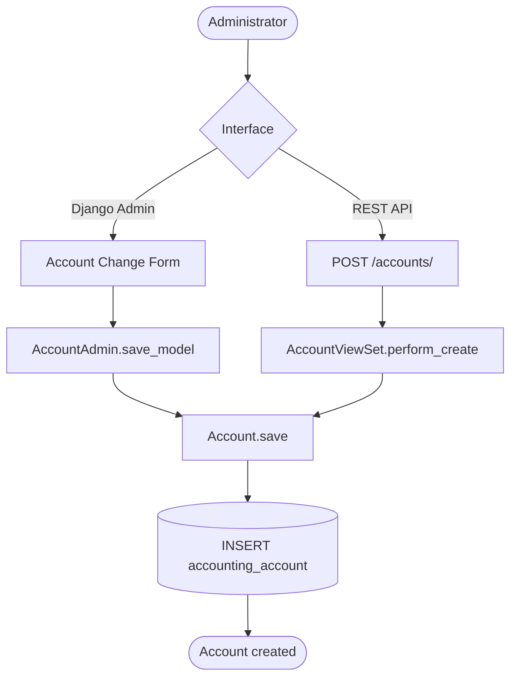

### UC-ACC-01 Admin Sequence — Create Account

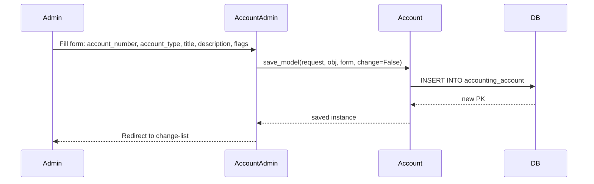

### UC-ACC-01 REST Sequence — Read Account List

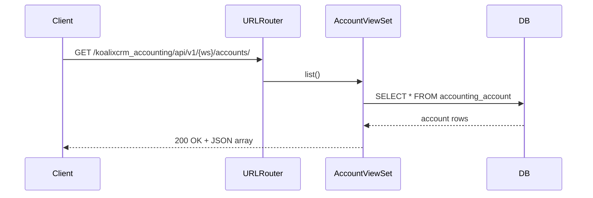

### UC-ACC-01 Alternative Flows

- **Read (list/detail):** The Admin change-list displays columns: `account_number`,
  `account_type`, `title`, `sum_of_all_bookings`. The `sum_of_all_bookings` is a
  computed aggregate across all `Booking` rows referencing this account.
  `GET /accounts/{id}/` returns a single account record via REST.
- **Update:** `PUT`/`PATCH` on `accounts/{id}/` or the Admin change form.
  The `account_number` field may be changed as long as no existing booking references
  make the renaming confusing — the system does not block this.
- **Delete:** `DELETE /accounts/{id}/` or Admin delete action.
  Django will refuse deletion if any `Booking` row still references the account
  through `from_account` or `to_account` (protected FK or cascade, depending on
  the model definition — verify before bulk-deleting).
- **Special-purpose flags:** Only one account should carry each of the four flags
  (`is_open_reliabilities_account`, `is_open_interest_account`,
  `is_product_inventory_activa`, `is_a_customer_payment_account`). The system does
  not enforce uniqueness on these flags; the administrator is responsible for
  ensuring each flag is set on exactly one account.

### UC-ACC-01 Postconditions

- An `accounting_account` row exists in the database with the specified type, number,
  title, and flags.
- The account appears in the Admin change-list and is available for selection in
  `Booking` records and tax-account assignments.

### UC-ACC-01 Configuration and Parameterization

> Cross-reference: see `QQ_SD_Configuration.md` (not yet produced).

- `ACCOUNT_TYPE_CHOICES` (in `koalixcrm/accounting/const/` or `models.py`) defines
  the four type codes: `A` (activa), `P` (passiva), `E` (expense), `I` (income).
  These choices drive the Admin drop-down and are validated at the serializer level.
- The `sum_of_all_bookings` list column is a read-only annotation computed at query
  time; it is not stored on the `Account` row.

### UC-ACC-01 Access Control

See [QQ_SD_AccessControl.md](../08_cross_cutting_concepts/QQ_SD_AccessControl.md) for the full RBAC model.

- Django Admin: staff users (`is_staff=True`) only. `AccountAdmin` does **not**
  use `WorkspaceScopedModelAdmin`; all accounts are visible to all staff users
  regardless of workspace.
- REST API: authenticated users may read accounts. Write operations may be restricted
  to administrator-level roles in the REST permission classes.
- The four special-purpose flag fields have no additional permission guard beyond
  Django Admin staff access; misuse of these flags directly affects invoice-booking
  correctness and should be treated as a privileged operation.

### UC-ACC-01 Notes and References

- Implementation: `koalixcrm/accounting/models.py` (`Account`),
  `koalixcrm/accounting/admin.py` (`AccountAdmin`),
  `koalixcrm/accounting/views.py` (`AccountViewSet`).
- The `sum_of_all_bookings` display value aggregates bookings from all periods;
  it is not filtered by `AccountingPeriod`. For period-specific balances, filter
  `Booking` by `accounting_period` in the Booking change-list.
- Invoice-accounting integration (UC-ACC-07) depends on the four special-purpose
  flags to locate accounts at runtime; misconfiguration causes `OpenInterestAccountMissing`
  errors during invoice registration.

---

## UC-ACC-02: Manage Accounting Periods

**Actor:** Administrator

**Interfaces:** Django Admin (`/admin/accounting/accountingperiod/`),
REST API (`accounting-periods/`)

### UC-ACC-02 Purpose

Define fiscal periods that scope bookings to a named time window (e.g. "FY 2025",
"Q1 2025"). Each `AccountingPeriod` record carries a title, a begin date, an end date,
and two template-set references: `template_set_balance_sheet` and
`template_profit_loss_statement`. These template-set references identify XSL templates
stored externally (e.g. in S3) that the PDF Export Service uses to render the
corresponding financial statements. An inline section on the Admin change-form shows
all `Booking` records associated with the period.

Accounting periods are global and not workspace-scoped.

### UC-ACC-02 Preconditions

- The actor is a Django staff user.
- For PDF generation actions: `template_set_balance_sheet` and / or
  `template_profit_loss_statement` must be set on the period before the corresponding
  action is invoked.

### UC-ACC-02 Main Flow

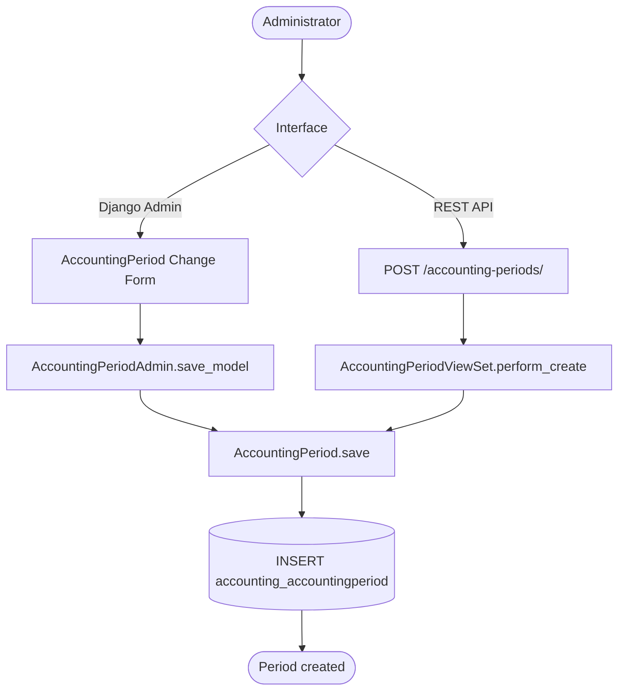

### UC-ACC-02 Admin Sequence — Create Accounting Period

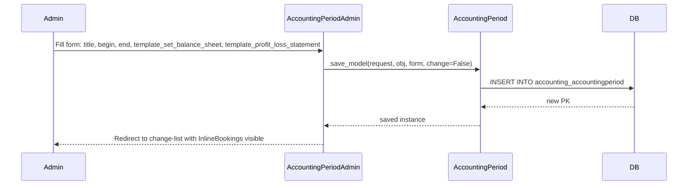

### UC-ACC-02 Alternative Flows

- **Read:** Admin change-list columns: `title`, `begin`, `end`,
  `template_set_balance_sheet`, `template_profit_loss_statement`. The inline
  `InlineBookings` section on the change-form displays all `Booking` rows whose
  `accounting_period` FK points to this period.
- **Update:** Change begin/end dates or reassign template sets via the change form
  or `PATCH /accounting-periods/{id}/`. Changing the template set references affects
  which PDF layout is used for subsequent PDF-generation actions on this period.
- **Delete:** Deleting an `AccountingPeriod` will cascade to all `Booking` rows
  scoped to it. This is a destructive operation; the admin should archive rather
  than delete closed periods.
- **Overlapping periods:** The data model does not enforce non-overlapping date
  ranges; the administrator must ensure periods do not overlap if downstream reports
  assume period exclusivity.

### UC-ACC-02 Postconditions

- An `accounting_accountingperiod` row exists with the specified title, date range,
  and optional template-set references.
- The period is available for selection on `Booking` records and for the PDF
  generation Admin actions.

### UC-ACC-02 Configuration and Parameterization

> Cross-reference: see `QQ_SD_Configuration.md` (not yet produced).

- `template_set_balance_sheet` and `template_profit_loss_statement` are FK or
  string references to template-set objects or keys. The PDF Export Service resolves
  these references to XSL stylesheet locations at render time.
- The date range (`begin`, `end`) is not timezone-aware at the model level; the
  application assumes UTC-midnight boundaries unless the deployment configures
  `USE_TZ=True` with explicit conversion.

### UC-ACC-02 Access Control

See [QQ_SD_AccessControl.md](../08_cross_cutting_concepts/QQ_SD_AccessControl.md) for the full RBAC model.

- Django Admin: staff users only. Not workspace-scoped.
- REST API: read access for authenticated users; write access subject to REST
  permission classes.
- The PDF generation actions (see UC-ACC-06, UC-ACC-07) are restricted to staff
  users through Django Admin; they are not exposed via REST.

### UC-ACC-02 Notes and References

- Implementation: `koalixcrm/accounting/models.py` (`AccountingPeriod`),
  `koalixcrm/accounting/admin.py` (`AccountingPeriodAdmin`, `InlineBookings`),
  `koalixcrm/accounting/views.py` (`AccountingPeriodViewSet`).
- The Admin actions `create_balance_sheet_pdf` and `create_profit_loss_statement_pdf`
  appear on the change-list of this model and are documented in UC-ACC-06 and
  UC-ACC-07 respectively.
- Closed fiscal periods should be treated as append-only after period-end. The system
  does not enforce this; process controls outside the application must ensure no
  backdated bookings are added to a closed period.

---

## UC-ACC-03: Manage Double-Entry Bookings

**Actor:** Administrator

**Interfaces:** Django Admin (`/admin/accounting/booking/`), REST API (`bookings/`)

### UC-ACC-03 Purpose

Create, read, update, and delete `Booking` records that implement double-entry
bookkeeping. Each booking represents a single debit/credit pair: money moves from
`from_account` to `to_account` in the specified `amount` on the `booking_date`.
Bookings are associated with an `AccountingPeriod` and carry a `staff` FK (the user
who entered the booking), an optional text `description`, and a `booking_reference`
for linking back to source documents (invoices, payments, etc.).

Bookings are global records not scoped to a workspace.

### UC-ACC-03 Preconditions

- The target `from_account` and `to_account` `Account` records exist.
- The target `AccountingPeriod` exists and its date range covers the `booking_date`.
- The actor is a Django staff user (Admin) or an authenticated API user.
- For automated bookings from invoice integration: the invoice is in a registrable
  state (see UC-ACC-07, UC-ACC-08).

### UC-ACC-03 Main Flow

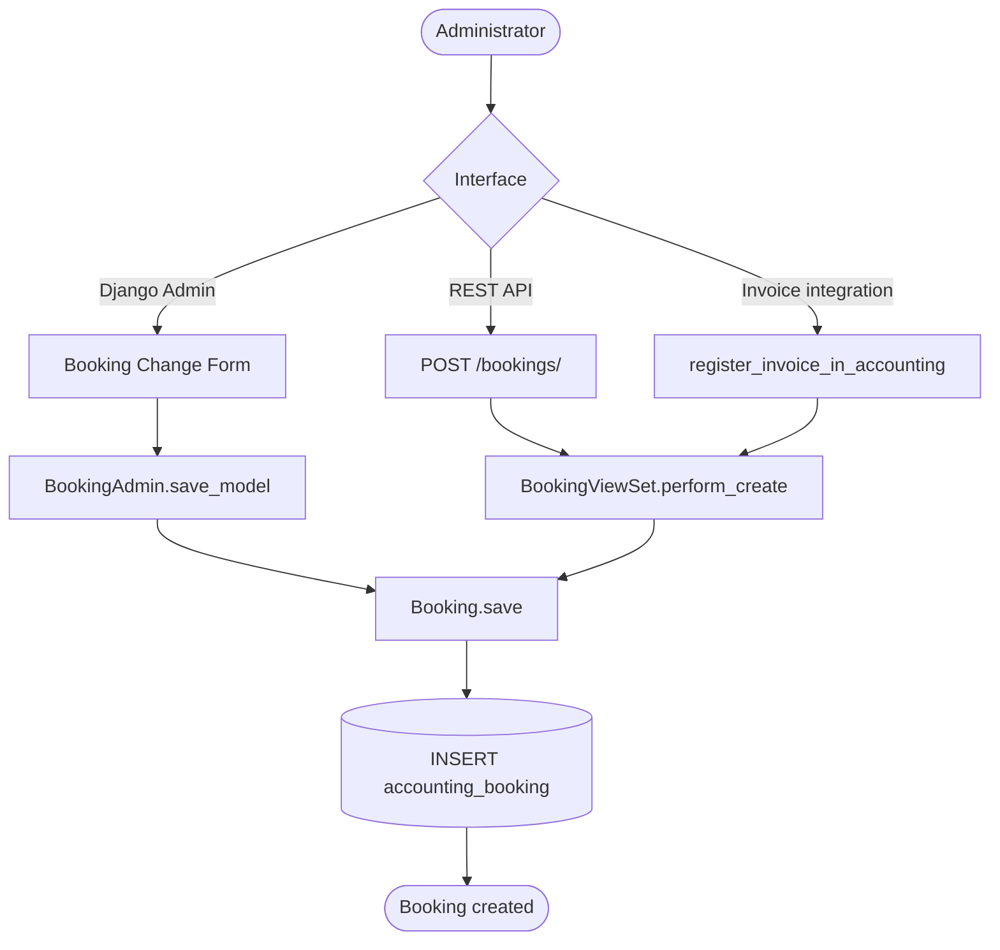

### UC-ACC-03 Admin Sequence — Create Manual Booking

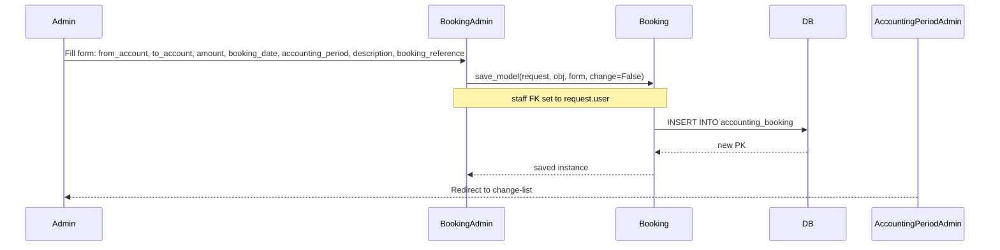

### UC-ACC-03 Alternative Flows

- **Read (list/detail):** Admin change-list columns: `from_account`, `to_account`,
  `amount`, `booking_date_only`, `staff`. The `booking_date_only` column extracts
  only the date portion of the `booking_date` datetime for display.
  `GET /bookings/{id}/` returns a single record via REST.
- **Inline view on AccountingPeriod:** The `InlineBookings` section on the
  `AccountingPeriod` Admin change-form lists all bookings for the period without
  navigating away from the period record.
- **Update:** `PATCH /bookings/{id}/` or the Admin change form. Changing
  `accounting_period` on an existing booking reassigns it to a different fiscal
  period. The system does not validate that the `booking_date` falls within the
  new period's date range.
- **Delete:** `DELETE /bookings/{id}/` or Admin delete action. Deleting a booking
  that was created by invoice registration has no undo path for the linked invoice's
  registration status — the administrator must re-register the invoice manually if
  needed.
- **Filter by period:** Use `GET /bookings/?accounting_period={id}` (if the viewset
  supports filtering) or the Admin filter panel to narrow bookings to a single period.

### UC-ACC-03 Postconditions

- An `accounting_booking` row exists with the specified debit/credit account pair,
  amount, date, period association, and staff reference.
- The `sum_of_all_bookings` computed annotation on the referenced `from_account`
  and `to_account` records reflects the new booking on the next query.

### UC-ACC-03 Configuration and Parameterization

> Cross-reference: see `QQ_SD_Configuration.md` (not yet produced).

- `booking_date` is a full `DateTimeField`; the Admin displays only the date portion
  (`booking_date_only`) in the change-list for readability.
- `booking_reference` is a free-text field; its format convention (e.g. invoice
  number, payment reference) is defined by the operational process, not the system.
- The `staff` FK is populated automatically from `request.user` in the Admin; REST
  callers may need to supply it explicitly depending on the serializer configuration.

### UC-ACC-03 Access Control

See [QQ_SD_AccessControl.md](../08_cross_cutting_concepts/QQ_SD_AccessControl.md) for the full RBAC model.

- Django Admin: staff users only. Not workspace-scoped.
- REST API: authenticated users; write access may require an elevated role in the
  REST permission configuration.
- Automated bookings created via invoice integration (UC-ACC-07, UC-ACC-08) bypass
  the Admin and are written directly by the model method; they carry the requesting
  user as `staff`.

### UC-ACC-03 Notes and References

- Implementation: `koalixcrm/accounting/models.py` (`Booking`),
  `koalixcrm/accounting/admin.py` (`BookingAdmin`, `InlineBookings`),
  `koalixcrm/accounting/views.py` (`BookingViewSet`).
- The double-entry invariant (total debits = total credits) is a process-level
  convention, not a database-level constraint. The system allows unbalanced entries;
  balance verification is the administrator's responsibility.
- `booking_reference` is the primary link between an `accounting_booking` row and
  its originating business document (invoice, payment). Populate this field when
  creating bookings manually to support auditability.

---

## UC-ACC-04: Manage Product Categories

**Actor:** Administrator

**Interfaces:** Django Admin (`/admin/accounting/productcategory/`),
REST API (`product-categories/`); additionally via the monkey-patched
`ProductCategoryAssignmentInline` on the ProductType Admin change-form
(`/admin/products/producttype/`)

### UC-ACC-04 Purpose

Define named product categories that carry the accounting accounts for product
revenue and cost-of-goods-sold flows. Each `ProductCategory` record references a
`profit_account` (income account for sales revenue) and a `loss_account` (expense
account for cost of goods sold or inventory write-offs). Product types are linked
to a product category through a `ProductCategoryAssignment` record, which is
managed via an inline section monkey-patched onto the core products `ProductType`
Admin screen by `AccountingConfig.ready()`. This keeps the `products` app free of
any import-time dependency on the `accounting` app.

### UC-ACC-04 Preconditions

- The target `profit_account` and `loss_account` `Account` records of the appropriate
  types (income and expense respectively) exist.
- For assignment to a product type: the target `ProductType` record exists.
- The actor is a Django staff user.

### UC-ACC-04 Main Flow

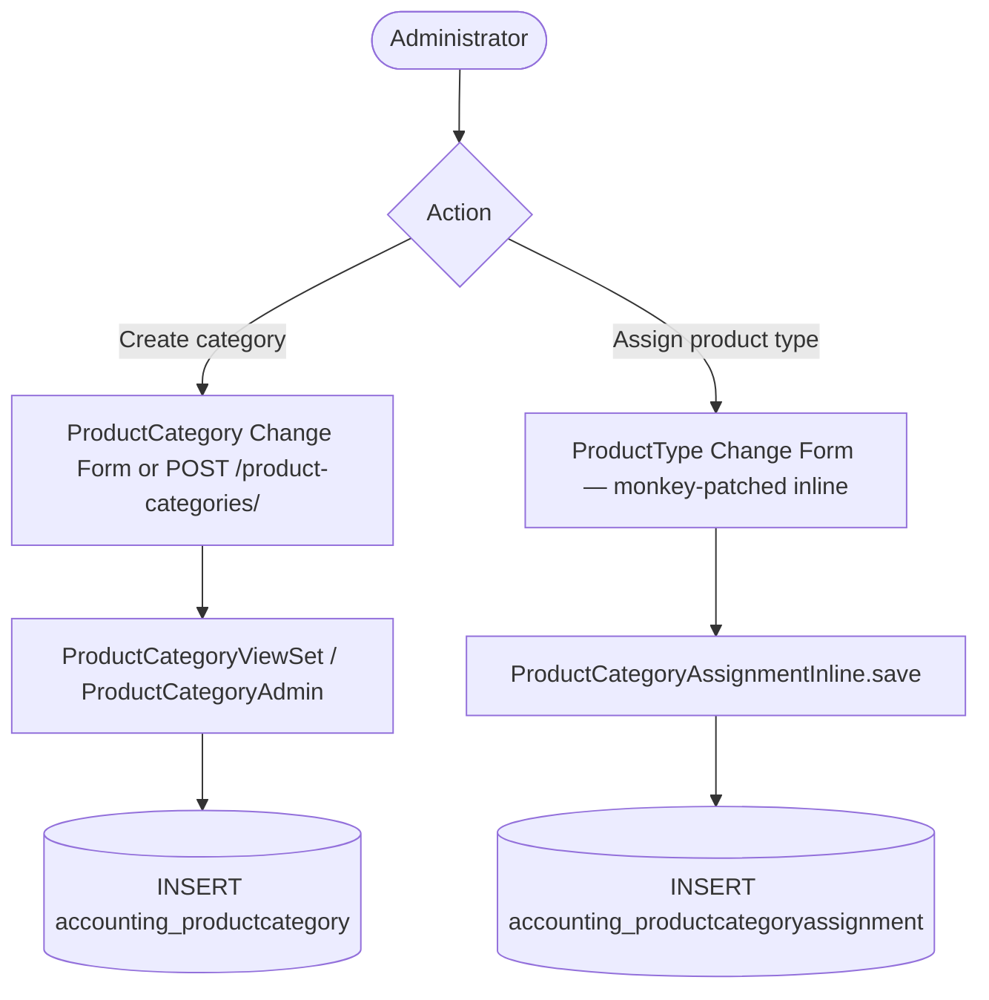

### UC-ACC-04 Admin Sequence — Create Category and Assign a Product Type

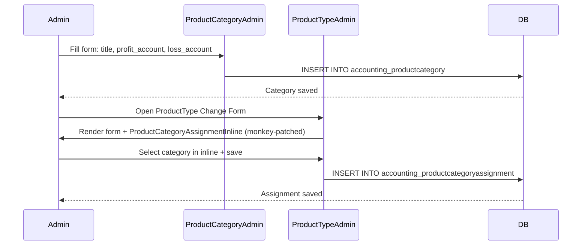

### UC-ACC-04 Alternative Flows

- **Read:** Admin change-list columns for `ProductCategory`: `title`, `profit_account`,
  `loss_account`. `GET /product-categories/` returns all categories via REST.
- **Update category accounts:** Change `profit_account` or `loss_account` on an
  existing `ProductCategory` via the change form or `PATCH /product-categories/{id}/`.
  The new account references apply immediately to all product types assigned to the
  category.
- **Delete category:** Deleting a `ProductCategory` cascades to all
  `ProductCategoryAssignment` rows linking product types to it. Affected product
  types lose their accounting categorization and will fail accounting integration
  until reassigned.
- **Direct assignment management:** `ProductCategoryAssignment` records can also be
  managed directly via the Admin change-list for `ProductCategoryAssignment` (if
  registered) or via REST. The monkey-patched inline on `ProductType` is the primary
  UX path.
- **Multiple assignments:** The data model may allow a single `ProductType` to be
  assigned to more than one `ProductCategory`; if so, the invoice-accounting
  integration must define which assignment takes precedence.

### UC-ACC-04 Postconditions

- An `accounting_productcategory` row exists with the specified title, profit
  account, and loss account.
- An `accounting_productcategoryassignment` row links the product type to the
  category (if assignment was performed).

### UC-ACC-04 Configuration and Parameterization

> Cross-reference: see `QQ_SD_Configuration.md` (not yet produced).

- The monkey-patch is registered in `AccountingConfig.ready()` in
  `koalixcrm/accounting/apps.py`. The inline class is
  `ProductCategoryAssignmentInline`, injected into the `ProductTypeAdmin`
  registered by the `products` app.
- If the `accounting` app is not in `INSTALLED_APPS` (e.g. WFS profile), the
  `ProductType` Admin form renders without the inline — no import error occurs.

### UC-ACC-04 Access Control

See [QQ_SD_AccessControl.md](../08_cross_cutting_concepts/QQ_SD_AccessControl.md) for the full RBAC model.

- Django Admin: staff users only. Not workspace-scoped.
- REST API: authenticated users; write access requires appropriate role.
- Modifying `profit_account` or `loss_account` on a category has downstream financial
  impact; this should be treated as a privileged configuration change.

### UC-ACC-04 Notes and References

- Implementation: `koalixcrm/accounting/models.py` (`ProductCategory`,
  `ProductCategoryAssignment`), `koalixcrm/accounting/admin.py`
  (`ProductCategoryAdmin`, `ProductCategoryAssignmentInline`),
  `koalixcrm/accounting/apps.py` (`AccountingConfig.ready`),
  `koalixcrm/accounting/views.py` (`ProductCategoryViewSet`).
- The monkey-patch pattern means that a `INSTALLED_APPS` ordering constraint exists:
  `accounting` must appear after `products` so that `ProductTypeAdmin` is already
  registered when `AccountingConfig.ready()` runs. Django's `AppConfig.ready()`
  execution order follows `INSTALLED_APPS` order.

---

## UC-ACC-05: Assign Tax Accounts

**Actor:** Administrator

**Interface:** Django Admin Tax Change-Form (`/admin/core/tax/` or
`/admin/products/tax/`), with the `TaxAccountAssignmentInline` monkey-patched in
by `AccountingConfig.ready()`

### UC-ACC-05 Purpose

Link a `Tax` record to one or more `Account` records so that the invoice-accounting
integration can book the VAT portion of an invoice to the correct liability or income
account. The `TaxAccountAssignment` model stores the (Tax, Account, assignment type)
triple. The inline is injected into the core Tax Admin by `AccountingConfig.ready()`,
keeping the `core` app free of import-time dependency on `accounting`.

### UC-ACC-05 Preconditions

- The target `Tax` record exists in the `core` (or `products`) app.
- The target `Account` records exist in the `accounting` app.
- The actor is a Django staff user.
- The `accounting` app is installed (i.e. this is not a WFS deployment).

### UC-ACC-05 Main Flow

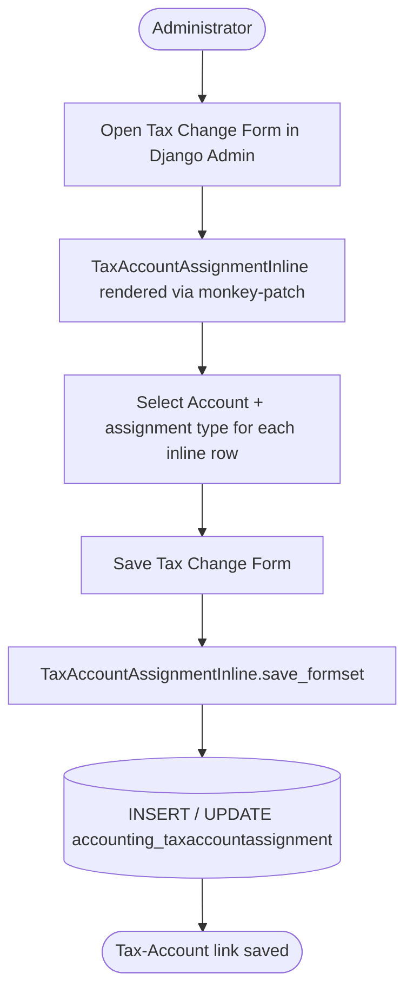

### UC-ACC-05 Admin Sequence — Assign an Account to a Tax Record

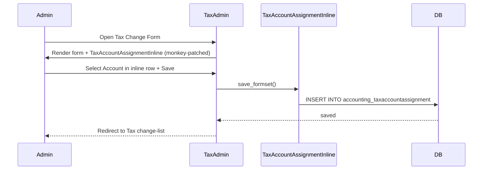

### UC-ACC-05 Alternative Flows

- **Update assignment:** Change the `account` FK or assignment type on an existing
  `TaxAccountAssignment` row by editing the inline row and saving the Tax change form.
- **Delete assignment:** Clear the inline row (mark for deletion in the formset) and
  save the Tax change form. The `TaxAccountAssignment` row is deleted.
- **Multiple assignments per tax:** A single `Tax` may have multiple
  `TaxAccountAssignment` rows for different assignment types (e.g. one for the
  input-tax receivable account, one for the output-tax liability account).
- **Accounting app absent:** When the `accounting` app is not installed, the Tax
  Admin form renders normally without the inline. No error occurs.

### UC-ACC-05 Postconditions

- One or more `accounting_taxaccountassignment` rows exist linking the `Tax` to
  the specified `Account` records.
- The invoice-accounting integration can resolve the correct accounts for VAT
  booking on invoices that use this tax.

### UC-ACC-05 Configuration and Parameterization

> Cross-reference: see `QQ_SD_Configuration.md` (not yet produced).

- The monkey-patch is registered in `AccountingConfig.ready()` in
  `koalixcrm/accounting/apps.py`. The inline class is `TaxAccountAssignmentInline`,
  injected into the `TaxAdmin` registered by the `core` or `products` app.
- Assignment type choices (if present on `TaxAccountAssignment`) are defined in the
  `accounting` app constants and govern which role the linked account plays in the
  VAT posting logic.

### UC-ACC-05 Access Control

See [QQ_SD_AccessControl.md](../08_cross_cutting_concepts/QQ_SD_AccessControl.md) for the full RBAC model.

- Django Admin: staff users only.
- Not exposed via REST API.
- Misconfigured tax-account assignments cause incorrect VAT booking in financial
  statements; changes should be reviewed by the accounting administrator.

### UC-ACC-05 Notes and References

- Implementation: `koalixcrm/accounting/admin.py` (`TaxAccountAssignmentInline`),
  `koalixcrm/accounting/models.py` (`TaxAccountAssignment`),
  `koalixcrm/accounting/apps.py` (`AccountingConfig.ready`).
- The same `ready()` call registers both `TaxAccountAssignmentInline` and
  `ProductCategoryAssignmentInline` (see UC-ACC-04) in a single `AppConfig.ready()`
  execution.
- `INSTALLED_APPS` ordering constraint: `accounting` must appear after `core`
  (or `products`, whichever registers `TaxAdmin`) for the monkey-patch to succeed.

---

## UC-ACC-06: Generate Balance Sheet PDF

**Actor:** Administrator

**Interface:** Django Admin AccountingPeriod change-list action
`create_balance_sheet_pdf` (`/admin/accounting/accountingperiod/`)

### UC-ACC-06 Purpose

Produce a formatted balance-sheet PDF document for a selected `AccountingPeriod`.
The administrator selects one or more periods in the Admin change-list and triggers
the `create_balance_sheet_pdf` bulk action. The action validates that each selected
period has a `template_set_balance_sheet` configured, then enqueues a
`PDFExportProcess` row for each valid period. The external Java PDF Export Service
picks up the queued row, retrieves the XSL template from the configured store (e.g.
S3), renders the balance sheet data, and stores the result PDF URL back on the
`PDFExportProcess` record. The Admin does not block while rendering; the action
returns immediately after enqueuing.

### UC-ACC-06 Preconditions

- One or more `AccountingPeriod` records are selected in the Admin change-list.
- Each selected period has `template_set_balance_sheet` set to a non-null value.
- An active workspace is available from `request.active_workspace`; if absent,
  `Workspace.objects.first()` is used as a fallback.
- The PDF Export Service is running and polling the `PDFExportProcess` queue.

### UC-ACC-06 Main Flow

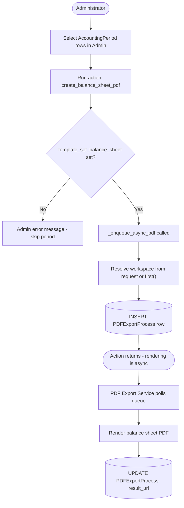

### UC-ACC-06 Sequence — Enqueue PDF Export

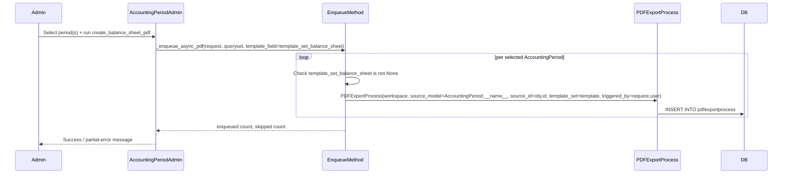

### UC-ACC-06 Alternative Flows

- **Missing template:** If `template_set_balance_sheet` is `None` on a selected
  period, the period is skipped and the Admin displays an error message identifying
  it. The action continues for the remaining selected periods.
- **Multiple periods selected:** The action enqueues one `PDFExportProcess` row per
  selected period. Each renders independently.
- **Workspace fallback:** If `request.active_workspace` is not set (e.g. the
  administrator does not have an active workspace in their session), the method
  calls `Workspace.objects.first()` and uses that workspace. This means the
  `PDFExportProcess` row is associated with an arbitrary workspace; the administrator
  should ensure an active workspace is selected before triggering the action.
- **PDF Export Service unavailable:** The `PDFExportProcess` row remains in a pending
  state indefinitely. No timeout or retry is implemented at the Django layer; the
  service must be restarted to drain the queue.

### UC-ACC-06 Postconditions

- One `PDFExportProcess` row per selected valid period exists in the database with
  `source_model=AccountingPeriod.__name__`, `source_id=period.id`,
  `template_set=template_set_balance_sheet`, and `triggered_by=request.user`.
- The external PDF Export Service will eventually render the balance sheet and write
  the result URL back to the `PDFExportProcess` record.

### UC-ACC-06 Configuration and Parameterization

> Cross-reference: see `QQ_SD_Configuration.md` (not yet produced).

- `template_set_balance_sheet` on `AccountingPeriod` must reference a valid XSL
  template-set key recognised by the PDF Export Service. The template-set registry
  and storage location (e.g. S3 bucket, path prefix) are configured in the PDF
  Export Service's environment, not in Django.
- The PDF Export Service polling interval, result-URL storage field, and retry
  policy are configured in the PDF Export Service deployment, not in Django.

### UC-ACC-06 Access Control

See [QQ_SD_AccessControl.md](../08_cross_cutting_concepts/QQ_SD_AccessControl.md) for the full RBAC model.

- The Admin bulk action is available only to Django staff users (`is_staff=True`).
- Not exposed via REST API.
- The `triggered_by` field on `PDFExportProcess` records which staff user initiated
  the render, providing an audit trail.

### UC-ACC-06 Notes and References

- Implementation: `koalixcrm/accounting/admin.py` (`create_balance_sheet_pdf`
  action, `_enqueue_async_pdf` helper).
- `_enqueue_async_pdf` is a private method shared by both PDF-generation actions
  (UC-ACC-06 and UC-ACC-07); it differs only in which template-set field is read.
- The `PDFExportProcess` model is defined outside the `accounting` app (likely in
  `core` or a shared `pdf_export` module). The accounting admin imports it to create
  queue entries.
- The result URL stored on `PDFExportProcess` is the only way to retrieve the
  rendered PDF; there is no separate download endpoint in Django.

---

## UC-ACC-07: Generate Profit-and-Loss Statement PDF

**Actor:** Administrator

**Interface:** Django Admin AccountingPeriod change-list action
`create_profit_loss_statement_pdf` (`/admin/accounting/accountingperiod/`)

### UC-ACC-07 Purpose

Produce a formatted profit-and-loss statement PDF for a selected `AccountingPeriod`.
The flow is identical to UC-ACC-06 (Generate Balance Sheet PDF) except that the
`template_profit_loss_statement` field is used instead of `template_set_balance_sheet`.
The action validates that the field is set, enqueues a `PDFExportProcess` row, and
returns immediately. The external Java PDF Export Service renders the statement
asynchronously.

### UC-ACC-07 Preconditions

- One or more `AccountingPeriod` records are selected in the Admin change-list.
- Each selected period has `template_profit_loss_statement` set to a non-null value.
- An active workspace is available from `request.active_workspace`; if absent,
  `Workspace.objects.first()` is used as a fallback.
- The PDF Export Service is running and polling the `PDFExportProcess` queue.

### UC-ACC-07 Main Flow

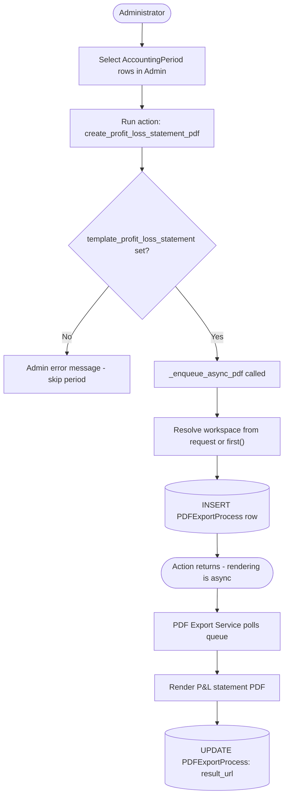

### UC-ACC-07 Sequence — Enqueue Profit-and-Loss PDF Export

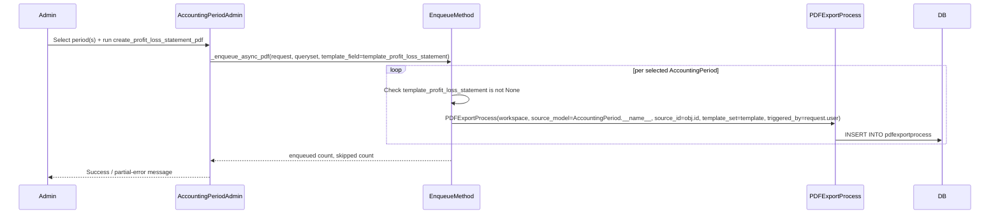

### UC-ACC-07 Alternative Flows

- **Missing template:** If `template_profit_loss_statement` is `None` on a selected
  period, the period is skipped and an error message is displayed. Other selected
  periods continue to be processed.
- **Multiple periods:** One `PDFExportProcess` row is created per valid period,
  each rendering independently.
- **Workspace fallback:** Same as UC-ACC-06 — falls back to `Workspace.objects.first()`
  if no active workspace is in the session.
- **Combined run:** The administrator may run both `create_balance_sheet_pdf` and
  `create_profit_loss_statement_pdf` on the same set of periods (as separate action
  invocations) to produce both statements for a period in parallel.

### UC-ACC-07 Postconditions

- One `PDFExportProcess` row per selected valid period exists with
  `template_set=template_profit_loss_statement` and `triggered_by=request.user`.
- The external PDF Export Service will eventually render the statement and write the
  result URL back to the `PDFExportProcess` record.

### UC-ACC-07 Configuration and Parameterization

> Cross-reference: see `QQ_SD_Configuration.md` (not yet produced).

- `template_profit_loss_statement` on `AccountingPeriod` must reference a valid
  XSL template-set key recognised by the PDF Export Service. Configuration is in
  the PDF Export Service deployment, not in Django.
- Rendering concurrency and queue depth are governed by the PDF Export Service
  configuration.

### UC-ACC-07 Access Control

See [QQ_SD_AccessControl.md](../08_cross_cutting_concepts/QQ_SD_AccessControl.md) for the full RBAC model.

- Django Admin staff users only. Not exposed via REST.
- The `triggered_by` field on the created `PDFExportProcess` row records the
  initiating staff user.

### UC-ACC-07 Notes and References

- Implementation: `koalixcrm/accounting/admin.py` (`create_profit_loss_statement_pdf`
  action, shared `_enqueue_async_pdf` helper).
- The `_enqueue_async_pdf` helper is the same private method used by UC-ACC-06;
  the only difference is which `AccountingPeriod` field name is passed to select
  the template set.
- See UC-ACC-06 for the full description of the `_enqueue_async_pdf` internals,
  the workspace-fallback behaviour, and the PDF Export Service interaction model.
- For invoice-level accounting flows (registering an invoice or a payment in the
  double-entry ledger), see the Invoicing domain use case document.

---

## UC-ACC-08: Register Invoice in Accounting

**Actor:** Administrator

**Interface:** Django Admin Invoice change-list action `register_invoice_in_accounting`
(in `koalixcrm/accounting/invoice_admin.py`, registered on the Invoice Admin)

### UC-ACC-08 Purpose

Book an issued invoice into the double-entry accounting ledger by creating the
appropriate `Booking` rows automatically. When an invoice is finalised and ready
to be recognised as revenue, the administrator runs this Admin action. The system
calls `obj.register_invoice_in_accounting(request)` on the selected invoice
instance, which internally creates debit and credit bookings for the net amount and
the VAT portion using the accounts configured via `TaxAccountAssignment` (UC-ACC-05)
and the open-interest account flag (UC-ACC-01). Errors surface as Admin messages
without creating partial bookings.

### UC-ACC-08 Preconditions

- The invoice is in a state that permits accounting registration (e.g. finalised,
  not already registered — the exact state guard is defined in the Invoice model).
- An `Account` with `is_open_interest_account=True` exists.
- All `Tax` records on the invoice have at least one `TaxAccountAssignment` linking
  them to an appropriate accounting account.
- An open `AccountingPeriod` exists that covers the invoice date.
- The actor is a Django staff user.

### UC-ACC-08 Main Flow

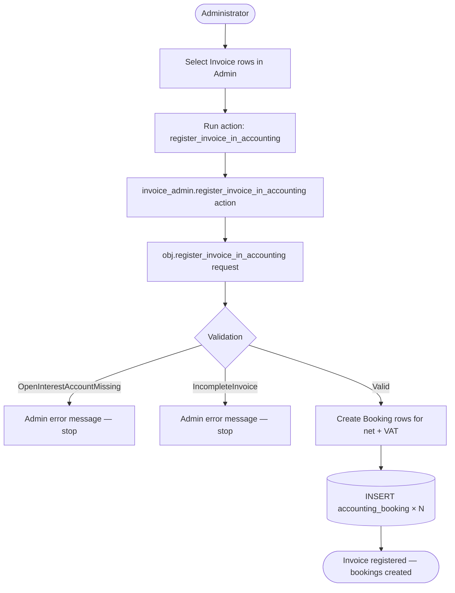

### UC-ACC-08 Sequence — Register Invoice

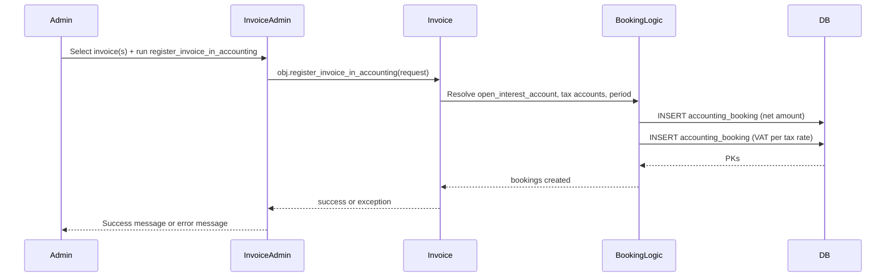

### UC-ACC-08 Alternative Flows

- **OpenInterestAccountMissing:** No `Account` with `is_open_interest_account=True`
  exists. The action displays an error message and creates no bookings. The
  administrator must configure the open-interest account (UC-ACC-01) before retrying.
- **IncompleteInvoice:** The invoice is missing required fields (e.g. no line items,
  no accounting period derivable from the invoice date). The action displays an error
  and stops without writing bookings.
- **Already registered:** If the invoice model tracks registration state, the action
  may skip already-registered invoices with a warning. Exact behaviour depends on the
  Invoice model's guard logic.
- **Multiple invoices selected:** The action iterates over the queryset;
  each invoice is processed independently. A failure on one invoice does not prevent
  the others from being processed.

### UC-ACC-08 Postconditions

- One or more `accounting_booking` rows exist representing the net revenue booking
  and the VAT booking(s) for the invoice.
- The invoice's accounting-registration state is updated (if tracked by the model).

### UC-ACC-08 Configuration and Parameterization

> Cross-reference: see `QQ_SD_Configuration.md` (not yet produced).

- The open-interest account is located by the `is_open_interest_account` flag on
  `Account` (UC-ACC-01). Exactly one such account must exist.
- Tax accounts are resolved via `TaxAccountAssignment` records for each `Tax`
  applied to the invoice (UC-ACC-05).
- The `AccountingPeriod` used for the booking is resolved from the invoice date;
  the matching period must exist and be open.

### UC-ACC-08 Access Control

See [QQ_SD_AccessControl.md](../08_cross_cutting_concepts/QQ_SD_AccessControl.md) for the full RBAC model.

- Django Admin staff users only (action registered on Invoice Admin).
- The `staff` FK on each created `Booking` is set to `request.user`, providing an
  audit trail of who triggered the registration.

### UC-ACC-08 Notes and References

- Implementation: `koalixcrm/accounting/invoice_admin.py`
  (`register_invoice_in_accounting` Admin action),
  `koalixcrm/crm/` or `koalixcrm/invoicing/` (Invoice model method
  `register_invoice_in_accounting`).
- This use case represents the primary path for automated, consistent double-entry
  booking; manual booking via UC-ACC-03 is a fallback for corrections or entries
  without a corresponding invoice document.

---

## UC-ACC-09: Register Payment in Accounting

**Actor:** Administrator

**Interface:** Django Admin Invoice change-list action `register_payment_in_accounting`
(in `koalixcrm/accounting/invoice_admin.py`), two-step wizard

### UC-ACC-09 Purpose

Record the receipt of a payment against an issued invoice by creating the appropriate
`Booking` rows in the double-entry ledger. The action is a two-step wizard: in the
first step the administrator provides the payment amount and selects the customer
payment account (an activa account with `is_a_customer_payment_account=True`); in
the second step the system calls
`obj.register_payment_in_accounting(request, amount, account)` on the invoice to
create the booking. This clears the open-interest balance established by
UC-ACC-08 and records the cash or bank account receipt.

### UC-ACC-09 Preconditions

- The invoice has been registered in accounting (UC-ACC-08); the open-interest
  booking exists.
- An `Account` with `is_a_customer_payment_account=True` and type `A` (activa)
  exists and is available for selection.
- The payment amount is known and non-zero.
- The actor is a Django staff user.

### UC-ACC-09 Main Flow

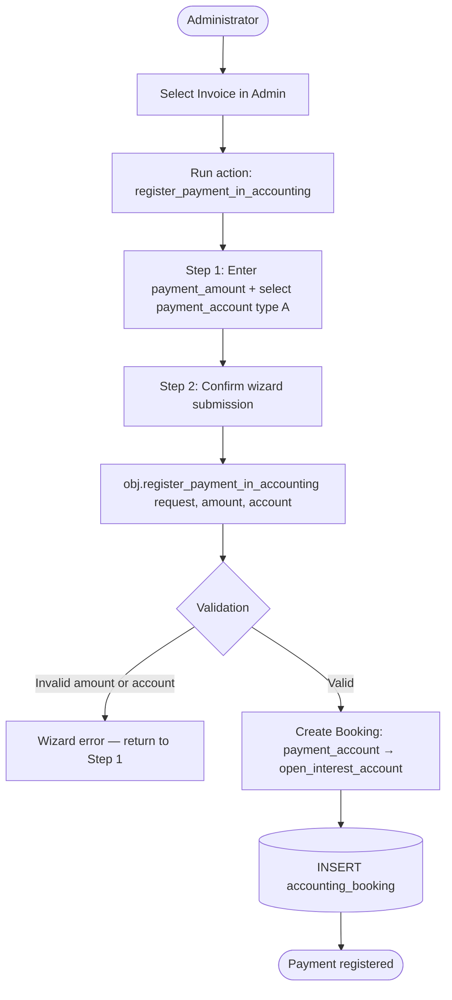

### UC-ACC-09 Wizard Sequence — Two-Step Payment Registration

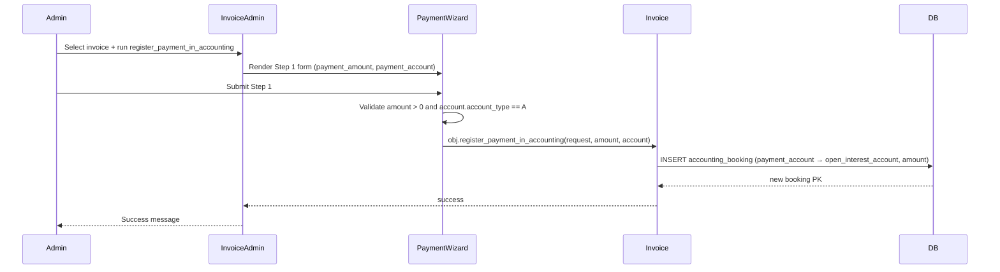

### UC-ACC-09 Alternative Flows

- **Partial payment:** The administrator may enter an amount less than the invoice
  total. The booking records the partial receipt; the remaining open balance must be
  cleared by a subsequent payment registration.
- **Overpayment:** If `payment_amount` exceeds the invoice total, the booking is
  created as entered. The resulting surplus on the open-interest account must be
  handled manually.
- **Wrong account type:** If the selected account is not of type `A` (activa) or
  does not have `is_a_customer_payment_account=True`, the wizard displays a validation
  error and returns to Step 1.
- **Invoice not yet registered:** If UC-ACC-08 has not been run, there is no
  open-interest booking to clear. The system may produce an accounting inconsistency;
  the administrator must run UC-ACC-08 first.

### UC-ACC-09 Postconditions

- An `accounting_booking` row exists recording the movement from the customer payment
  account to the open-interest account for the specified amount.
- The open-interest balance for the invoice is reduced by the payment amount.

### UC-ACC-09 Configuration and Parameterization

> Cross-reference: see `QQ_SD_Configuration.md` (not yet produced).

- The customer payment account is selected interactively in Step 1 of the wizard;
  only accounts of type `A` (activa) should be offered. The `is_a_customer_payment_account`
  flag (UC-ACC-01) identifies pre-designated accounts.
- The open-interest account is resolved by the `is_open_interest_account` flag, the
  same as in UC-ACC-08.

### UC-ACC-09 Access Control

See [QQ_SD_AccessControl.md](../08_cross_cutting_concepts/QQ_SD_AccessControl.md) for the full RBAC model.

- Django Admin staff users only.
- The `staff` FK on the created `Booking` is set to `request.user`.

### UC-ACC-09 Notes and References

- Implementation: `koalixcrm/accounting/invoice_admin.py`
  (`register_payment_in_accounting` Admin action and wizard view),
  Invoice model method `register_payment_in_accounting`.
- The two-step wizard is implemented as an intermediate Admin view (an extra
  `get_urls()` URL on the Invoice Admin) that collects the payment parameters before
  calling the model method.
- For the initial invoice booking that this use case clears, see UC-ACC-08.
