# Use Cases — Contacts Domain

This document describes all use cases in the Contacts domain of the koalixCRM system.
The Contacts domain owns the Party hierarchy (`Party`, `Organization`, `PartyContact`),
all contact information records (addresses, phone numbers, email addresses), party
groups, party roles, organization memberships, organization relationships, and the
supporting reference data models (`CustomerBillingCycle`).

All models in this domain are `WorkspaceScopedModel` instances.
Every query is transparently filtered to the active workspace through
`WorkspaceAwareManager`, which reads the workspace from a Django `ContextVar`.
All viewsets apply the same scope via `WorkspaceScopedViewSetMixin`.

The REST API is mounted at `/koalixcrm_contacts/api/v1/<workspace_id>/`.
Django Admin screens are under `/admin/contacts/`.

## System Actors

| Actor | Type | Interface |
|---|---|---|
| CRM User | Human | Browser (Django templates) or REST API client |
| Administrator | Human | Django Admin (`/admin/`) |

---

## UC-CON-01: Manage Organizations

**Actor:** CRM User, Administrator

**Interfaces:** Django Admin (`/admin/contacts/organization/`), REST API (`organizations/`)

### UC-CON-01 Purpose

Create, read, update, and delete Organization records representing legal entities
(companies, associations, public bodies). An Organization is a concrete MTI subtype
of Party; it extends the shared Party row with fields for legal form, legal name,
registration number, and legal seat country. Every Organization record is also
accessible through the base `parties/` endpoint.

### UC-CON-01 Preconditions

- The actor is authenticated and has a role in the target workspace
  (see [Access Control](#uc-con-01-access-control)).
- The active workspace is set — either via the `workspace_id` path segment (REST)
  or via the session workspace selection (Admin).

### UC-CON-01 Main Flow

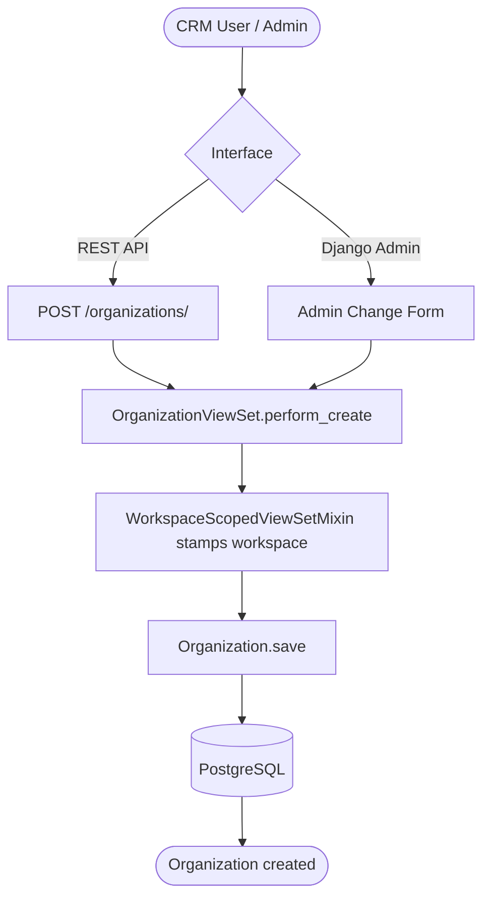

### UC-CON-01 REST Sequence — Create Organization

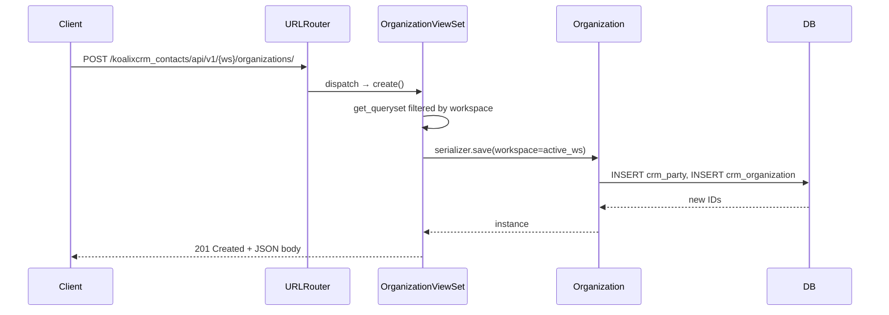

### UC-CON-01 Alternative Flows

- **Read (list/detail):** `GET /organizations/` returns the workspace-scoped list;
  `GET /organizations/{id}/` returns a single record. Admin list view shows columns:
  id, display\_name, legal\_form, legal\_name, legal\_seat\_country.
  Search is available on display\_name, legal\_name, and registration\_number.
- **Update:** `PUT`/`PATCH` on `organizations/{id}/` or Admin Change Form.
  The workspace stamp is immutable after creation.
- **Delete:** `DELETE /organizations/{id}/` or Admin delete action.
  Django cascades to child rows (PartyRole, AddressAssignment, PhoneAssignment,
  EmailAssignment, OrganizationMembership, OrganizationRelationship)
  before removing the `crm_organization` and `crm_party` rows.
- **Superuser without active workspace:** `WorkspaceScopedViewSetMixin` returns the
  unfiltered queryset; `perform_create` falls back to or creates the Default
  Workspace.

### UC-CON-01 Postconditions

- A `crm_party` row and a linked `crm_organization` row exist in the database.
- The organization is visible in the workspace-scoped list and through the base
  `parties/` endpoint.

### UC-CON-01 Configuration and Parameterization

> Cross-reference: see `QQ_SD_Configuration.md` (not yet produced).

- `LEGAL_FORM_CHOICES` and `PARTY_ROLE_CHOICES` constants (in
  `koalixcrm/core/const/party.py`) determine the selectable values for legal form.
- `COUNTRIES` constant (`koalixcrm/core/const/country.py`) provides the
  country drop-down.
- `LANGUAGE_CHOICES` drives the default\_language selector on the parent Party.

### UC-CON-01 Access Control

See [QQ_SD_AccessControl.md](../08_cross_cutting_concepts/QQ_SD_AccessControl.md) for the full RBAC model.

- REST API: authenticated users with a `RoleInWorkspace` for the active workspace
  can read and write. Unauthenticated requests receive `401 Unauthorized`.
- Django Admin: staff users (`is_staff=True`) only. Workspace filtering via
  `WorkspaceScopedModelAdmin`.

### UC-CON-01 Notes and References

- MTI persistence: Django writes two rows atomically — one in `crm_party` and one
  in `crm_organization`. The `party_ptr_id` column in `crm_organization` is both
  the PK and FK to `crm_party`.
- The base `PartyViewSet` (`parties/`) exposes read access to the shared Party
  fields across all subtypes (Organization and PartyContact) in one endpoint.
- For the conversion between Organization and PartyContact, see
  [UC-CON-03](#uc-con-03-convert-organization-to-contact-and-vice-versa).

---

## UC-CON-02: Manage Personal Contacts

**Actor:** CRM User, Administrator

**Interfaces:** Django Admin (`/admin/contacts/partycontact/`), REST API (`party-contacts/`)

### UC-CON-02 Purpose

Create, read, update, and delete PartyContact records representing natural persons.
PartyContact is the MTI sibling of Organization under Party. It adds personal fields
(prefix, given name, family name, date of birth) and a GDPR consent date.
The GDPR consent date (`gdpr_consent_date`) records when the person gave
explicit consent for data processing and must be set whenever consent is obtained.

### UC-CON-02 Preconditions

- The actor is authenticated and has a role in the target workspace.
- For GDPR-regulated data: the actor has confirmed that consent has been obtained
  before recording `gdpr_consent_date`.

### UC-CON-02 Main Flow

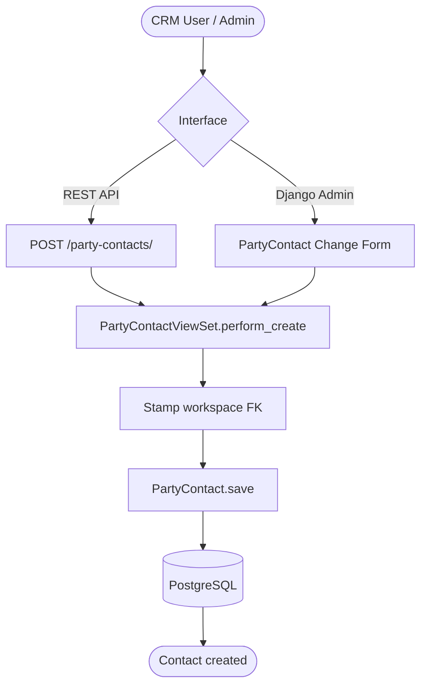

### UC-CON-02 REST Sequence — Create Personal Contact

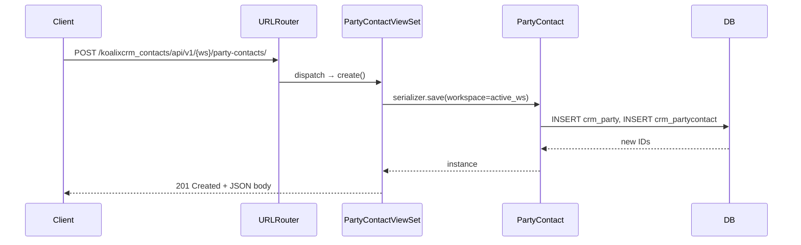

### UC-CON-02 Alternative Flows

- **Read:** Admin list columns: id, display\_name, given\_name, family\_name,
  gdpr\_consent\_date. Search: display\_name, given\_name, family\_name.
- **Update with GDPR consent:** A `PATCH` or Admin save that sets
  `gdpr_consent_date` records the consent date.
  Setting it to `null` clears consent — this may trigger downstream data
  minimisation obligations outside the system.
- **Delete:** Django cascades to child rows. Because `crm_partycontact` rows may
  be referenced by `OrganizationMembership.contact`, those membership rows are
  cascade-deleted first.

### UC-CON-02 Postconditions

- A `crm_party` row and a linked `crm_partycontact` row exist in the database.
- If `gdpr_consent_date` was set, the consent record is persisted.

### UC-CON-02 Configuration and Parameterization

> Cross-reference: see `QQ_SD_Configuration.md` (not yet produced).

- `POSTALADDRESSPREFIX` constant governs the prefix (salutation) choices.
- `LANGUAGE_CHOICES` drives the default\_language selector on the parent Party.

### UC-CON-02 Access Control

See [QQ_SD_AccessControl.md](../08_cross_cutting_concepts/QQ_SD_AccessControl.md) for the full RBAC model.

- Same workspace RBAC as UC-CON-01.
- PII sensitivity: PartyContact fields (given\_name, family\_name, date\_of\_birth,
  gdpr\_consent\_date) constitute personal data under GDPR. Access must be
  restricted to roles with a legitimate purpose.

### UC-CON-02 Notes and References

- The class is named `PartyContact` (not `Contact`) to avoid a naming collision
  with the legacy `Contact` model during the v1.14.0 → v2.0.0 migration
  coexistence phase (PRs #392–#394). It will be renamed `Contact` in PR #395.
- GDPR: `gdpr_consent_date` is the only GDPR field stored in the model itself.
  The processing legal basis, retention period, and data-subject-rights procedures
  are defined in the Data Protection documentation outside this system.

---

## UC-CON-03: Convert Organization to Contact and Vice Versa

**Actor:** Administrator

**Interface:** Django Admin bulk action (Organization change-list and PartyContact change-list)

### UC-CON-03 Purpose

Reclassify a Party from Organization to PartyContact (natural person) or in the
reverse direction, without losing any linked data. The parent `crm_party` row —
and all attached PartyRole, AddressAssignment, PhoneAssignment, EmailAssignment,
and PartyIdentification rows, plus every document FK pointing to the Party —
is preserved. Only the MTI child row is swapped.

This covers two operational scenarios:

1. Post-migration cleanup after the v1.14.0 → v2.0.0 backfill, which could not
   distinguish person-like from company-like legacy Contact rows.
2. Ongoing data hygiene when a party was registered with the wrong subtype.

### UC-CON-03 Preconditions

- The actor is a Django staff user (`is_staff=True`).
- One or more Organization (or PartyContact) rows are selected in the Admin
  change-list.
- For Organization → Contact conversion: no `crm_partycontact` row exists yet for
  the selected party IDs (otherwise the row is skipped and counted as
  `skipped_existing`).
- For Contact → Organization conversion: no `crm_organization` row exists yet for
  the selected party IDs.

### UC-CON-03 Main Flow — Organization to Contact

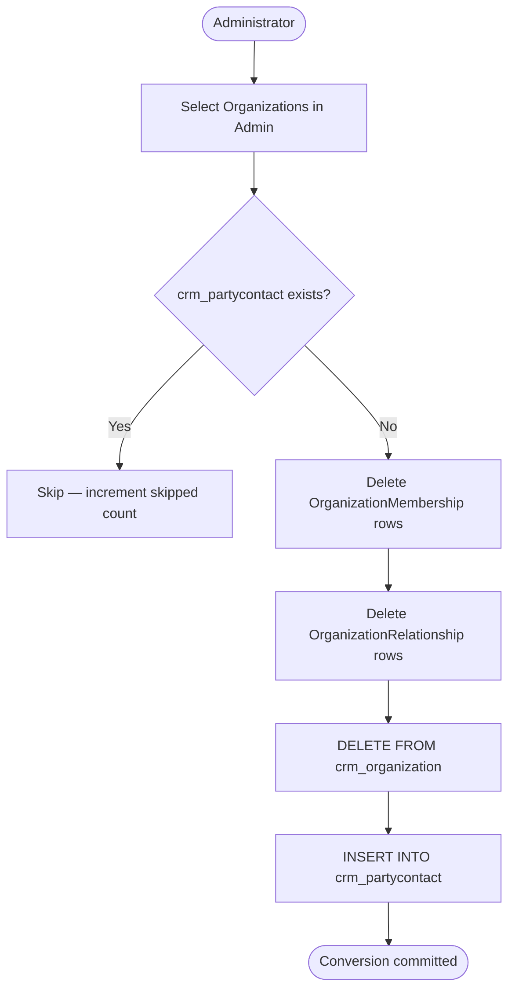

### UC-CON-03 Admin Sequence — Organization to Contact

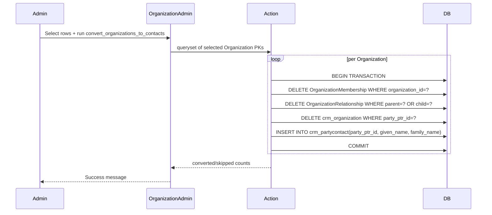

### UC-CON-03 Alternative Flow — Contact to Organization

The `convert_contacts_to_organizations` action on the PartyContact change-list
performs the mirror operation: it deletes the `crm_partycontact` row and inserts
a `crm_organization` row with the contact's name recombined into `legal_name`.
No membership or relationship rows exist to clean up because natural persons cannot
be organization parents or children.

### UC-CON-03 Postconditions

- The selected parties are now of the opposite MTI subtype.
- The parent `crm_party` row is unchanged; all linked records continue to reference
  the same `party_id`.
- For Organization → Contact: all `OrganizationMembership` and
  `OrganizationRelationship` rows for the converted party are removed.
- The Admin displays a message with counts of converted, skipped, and removed
  membership/relationship records.

### UC-CON-03 Configuration and Parameterization

> Cross-reference: see `QQ_SD_Configuration.md` (not yet produced).

- `_split_display_name()` helper in `actions.py` performs a best-effort space-split
  of `display_name` into `given_name` / `family_name`. The administrator must
  review and correct the given/family name split after bulk conversion.

### UC-CON-03 Access Control

See [QQ_SD_AccessControl.md](../08_cross_cutting_concepts/QQ_SD_AccessControl.md) for the full RBAC model.

- Available only to Django Admin staff users. Not exposed via REST API.
- The raw SQL execution bypasses the Django ORM cascade on the child table
  intentionally — using the ORM `delete()` on an MTI child would cascade to the
  parent Party row, destroying all linked data.

### UC-CON-03 Notes and References

- Implementation: `koalixcrm/contacts/admin/actions.py`
- The conversion is transactional per party (one `transaction.atomic()` block per
  selected row). A failure on one party rolls back only that party's transaction;
  the loop continues to the next.
- `OrganizationMembership` rows referencing the converted organization as employer
  are deleted because a natural person cannot be an organization in a membership
  relationship. The administrator should reassign affected contacts manually.

---

## UC-CON-04: Manage Contact Address Information

**Actor:** CRM User, Administrator

**Interfaces:** Django Admin (Address, AddressAssignment, PhoneNumber, PhoneAssignment,
PartyEmail, EmailAssignment screens), REST API (`addresses/`, `address-assignments/`,
`phone-numbers/`, `phone-assignments/`, `party-emails/`, `email-assignments/`)

### UC-CON-04 Purpose

Record, update, and remove postal addresses, telephone numbers, and email addresses
for parties. Contact information is stored in normalised value records
(`Address`, `PhoneNumber`, `PartyEmail`) that are linked to parties through
assignment records (`AddressAssignment`, `PhoneAssignment`, `EmailAssignment`).
Each assignment carries a purpose (e.g. billing, delivery, primary) and an optional
validity period, allowing a party to have multiple addresses of different purposes
simultaneously.

### UC-CON-04 Preconditions

- The target Party (Organization or PartyContact) exists in the workspace.
- The actor is authenticated and has a role in the target workspace.

### UC-CON-04 Main Flow — Assign an Address to a Party

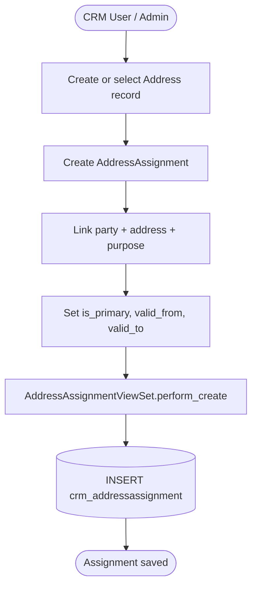

### UC-CON-04 REST Sequence — Create Address and Assign to Party

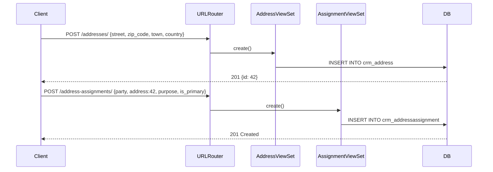

### UC-CON-04 Alternative Flows

- **Phone numbers:** Create a `PhoneNumber` record (E.164 format in `phone_e164`)
  via `POST /phone-numbers/`, then link it with `POST /phone-assignments/` carrying
  party, phone, purpose, is\_primary, and optional validity dates.
- **Email addresses:** Create a `PartyEmail` record via `POST /party-emails/`,
  then link it with `POST /email-assignments/`.
- **Multiple assignments of the same type:** A party may have several addresses
  each with a different purpose (e.g. one billing, one delivery address).
  Only one assignment per purpose should carry `is_primary=True`.
- **Validity expiry:** Setting `valid_to` in the past marks an assignment as
  historically expired. The application does not currently enforce expiry
  automatically — filtering by validity window is the caller's responsibility.
- **Admin inline view:** Admin change forms for Party subtypes display address,
  phone, and email assignments as inline sections.

### UC-CON-04 Postconditions

- The value record (`crm_address`, `crm_phonenumber`, or `crm_partyemail`) exists.
- An assignment record links the value to the target party with the specified
  purpose and validity.

### UC-CON-04 Configuration and Parameterization

> Cross-reference: see `QQ_SD_Configuration.md` (not yet produced).

- `ASSIGNMENT_PURPOSE_CHOICES` (in `koalixcrm/core/const/party.py`) defines
  the set of valid purpose codes (billing, delivery, primary, etc.).
- `COUNTRIES` and ISO 3166-2 subdivision codes are validated at the model level
  for `Address`.
- Phone numbers are stored as free-text in E.164 format; format validation is the
  responsibility of the input layer.

### UC-CON-04 Access Control

See [QQ_SD_AccessControl.md](../08_cross_cutting_concepts/QQ_SD_AccessControl.md) for the full RBAC model.

- Same workspace RBAC as UC-CON-01.
- Address, PhoneNumber, and PartyEmail records contain PII.
  Read access should be restricted to roles with a legitimate processing purpose.

### UC-CON-04 Notes and References

- The two-step create (value record, then assignment) allows address reuse across
  parties without duplicating the value row — relevant for shared office buildings
  or mailing addresses.
- Deleting a value record cascades to all its assignments through the Django
  `on_delete=CASCADE` on the assignment FKs.

---

## UC-CON-05: Manage Party Groups

**Actor:** Administrator

**Interfaces:** Django Admin (`/admin/contacts/partygroup/`, PartyGroupMembership screen),
REST API (`party-groups/`, `party-group-memberships/`)

### UC-CON-05 Purpose

Define named groups and assign parties to them. Groups are used to segment the
contact base for downstream purposes such as price groups, customer categories,
marketing segments, or mailing lists. An optional `role_type_scope` field restricts
membership to parties that play a specific role (e.g. only parties with the
`customer` role can be members of a customer price group).

### UC-CON-05 Preconditions

- The actor is authenticated and has an Administrator role in the workspace.
- For membership assignment: the target Party exists in the workspace.

### UC-CON-05 Main Flow

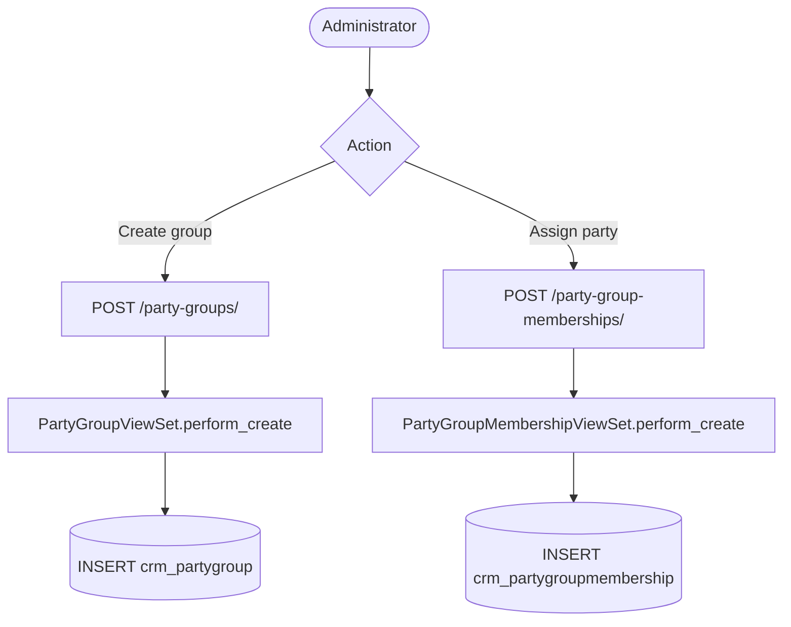

### UC-CON-05 REST Sequence — Create Group and Assign a Party

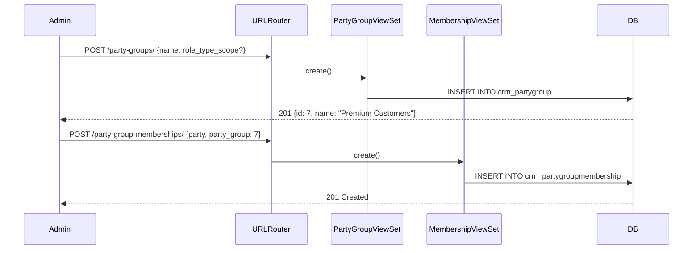

### UC-CON-05 Alternative Flows

- **List groups:** `GET /party-groups/` returns all groups in the workspace.
  Admin list columns: id, name, role\_type\_scope.
- **Remove a party from a group:** `DELETE /party-group-memberships/{id}/` or
  Admin delete action on the membership record.
- **Delete a group:** Cascades to all `crm_partygroupmembership` rows for that
  group. The referenced parties themselves are not affected.
- **role\_type\_scope enforcement:** The current model stores the scope as a label
  only; enforcement that members actually play the scoped role is not handled
  automatically — this is a convention for downstream consumers.

### UC-CON-05 Postconditions

- A `crm_partygroup` record exists (group creation).
- A `crm_partygroupmembership` record linking the party to the group exists
  (membership assignment).

### UC-CON-05 Configuration and Parameterization

> Cross-reference: see `QQ_SD_Configuration.md` (not yet produced).

- `PARTY_ROLE_CHOICES` governs the allowed values for `role_type_scope`.

### UC-CON-05 Access Control

See [QQ_SD_AccessControl.md](../08_cross_cutting_concepts/QQ_SD_AccessControl.md) for the full RBAC model.

- Party group management is restricted to administrators with appropriate workspace
  roles. Read access for CRM Users is subject to workspace RBAC.

### UC-CON-05 Notes and References

- `PartyGroup` and `PartyGroupMembership` are both workspace-scoped; a group
  defined in one workspace is not visible from another.
- The absence of a validity period on `PartyGroupMembership` means memberships
  are open-ended. Time-bounded group membership is not supported in the current
  data model.

---

## UC-CON-06: Manage Party Roles and Organization Memberships

**Actor:** Administrator

**Interfaces:** Django Admin (`/admin/contacts/partyrole/`, OrganizationMembership screen),
REST API (`party-roles/`, `organization-memberships/`)

### UC-CON-06 Purpose

Assign semantic role types to parties (e.g. customer, supplier, prospect) and
record the employment or membership relationship between a natural person and an
organization. Roles are time-bounded and support a primary flag. Organization
memberships add title and position fields.

### UC-CON-06 Preconditions

- The target Party (for role assignment) or PartyContact and Organization
  (for membership) exist in the workspace.
- The actor is authenticated and has an Administrator role in the workspace.

### UC-CON-06 Main Flow

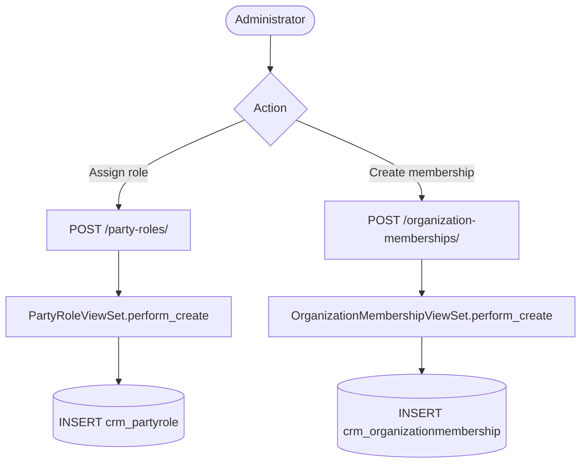

### UC-CON-06 REST Sequence — Assign a Role to a Party

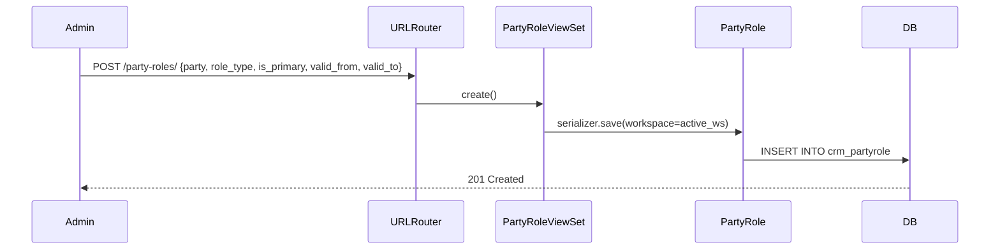

### UC-CON-06 Alternative Flows

- **List roles:** Admin list columns: id, party, role\_type, is\_primary,
  valid\_from, valid\_to. Filterable by role\_type, is\_primary, workspace.
- **Expire a role:** `PATCH /party-roles/{id}/` with `valid_to` set to today's date.
  The role remains in the database as a historical record.
- **Organization membership fields:** `title` (e.g. "Dr.", "Prof.") and `position`
  (e.g. "CEO", "Finance Manager") are stored per membership.
  `is_primary` marks the person's principal employment. Validity dates allow
  tracking historical memberships.
- **Multiple roles per party:** A party may have multiple `PartyRole` rows
  with different role types and overlapping validity periods.
  The `is_primary` flag signals the default role for display and downstream logic.

### UC-CON-06 Postconditions

- A `crm_partyrole` row linking the party to the role type exists.
- Or: a `crm_organizationmembership` row linking a PartyContact to an Organization
  exists, with optional title, position, and validity dates.

### UC-CON-06 Configuration and Parameterization

> Cross-reference: see `QQ_SD_Configuration.md` (not yet produced).

- `PARTY_ROLE_CHOICES` (in `koalixcrm/core/const/party.py`) defines the available
  role codes and their display labels. Adding a new role type requires updating
  this constant and running a migration if the choices are database-enforced.

### UC-CON-06 Access Control

See [QQ_SD_AccessControl.md](../08_cross_cutting_concepts/QQ_SD_AccessControl.md) for the full RBAC model.

- Party role and membership management is restricted to workspace administrators.
- The `PartyRole.role_type` value drives downstream authorisation decisions
  (e.g. whether a party can be selected as a customer on a sales order).

### UC-CON-06 Notes and References

- When an Organization is converted to a PartyContact via the Admin action
  (UC-CON-03), all `OrganizationMembership` rows where that organization was the
  employer are cascade-deleted.
- `PartyRole.party` uses `on_delete=CASCADE`, so deleting the Party automatically
  removes all its roles.

---

## UC-CON-07: Manage Organization Relationships

**Actor:** Administrator

**Interfaces:** Django Admin (OrganizationRelationship screen),
REST API (`organization-relationships/`)

### UC-CON-07 Purpose

Define typed parent-child relationships between two Organizations to model corporate
structures (subsidiary, branch, holding, joint venture, etc.). Each relationship
has a type, a parent organization, a child organization, and an optional validity
period.

### UC-CON-07 Preconditions

- Both the parent and child Organization records exist in the workspace.
- The actor is authenticated and has an Administrator role in the workspace.
- The parent and child must be distinct organizations.

### UC-CON-07 Main Flow

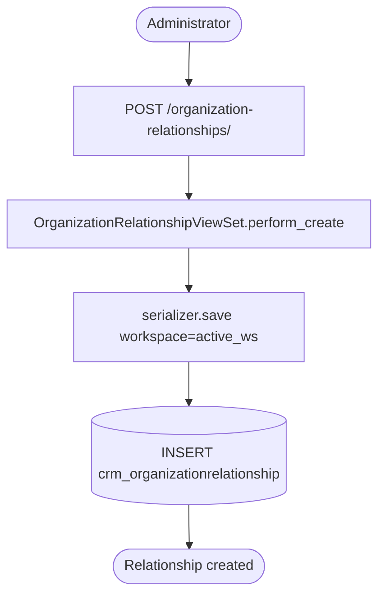

### UC-CON-07 REST Sequence — Create Organization Relationship

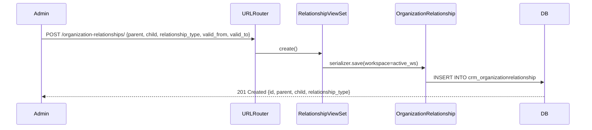

### UC-CON-07 Alternative Flows

- **List relationships:** Admin list columns: id, parent, child,
  relationship\_type, valid\_from, valid\_to. Filterable by relationship\_type
  and workspace.
- **Update:** `PATCH /organization-relationships/{id}/` or Admin Change Form
  to update the type or validity dates.
- **Delete:** `DELETE /organization-relationships/{id}/` or Admin delete.
  Also triggered by cascade when either the parent or child Organization is deleted
  (`on_delete=CASCADE` on both FKs).
- **Conversion cascade:** If an Organization involved in a relationship is converted
  to a PartyContact (UC-CON-03), all relationships where it is parent or child are
  deleted by the conversion action.

### UC-CON-07 Postconditions

- A `crm_organizationrelationship` row exists linking the two organizations with
  the specified type and validity window.

### UC-CON-07 Configuration and Parameterization

> Cross-reference: see `QQ_SD_Configuration.md` (not yet produced).

- `ORG_RELATIONSHIP_CHOICES` (in `koalixcrm/core/const/party.py`) defines the
  available relationship type codes (e.g. subsidiary, branch, holding).

### UC-CON-07 Access Control

See [QQ_SD_AccessControl.md](../08_cross_cutting_concepts/QQ_SD_AccessControl.md) for the full RBAC model.

- Organization relationship management is restricted to workspace administrators.
- No automatic cycle detection is enforced by the data model; administrators must
  ensure the relationship graph remains acyclic if downstream tree traversal is
  required.

### UC-CON-07 Notes and References

- Both `parent` and `child` FKs use `on_delete=CASCADE`, so deleting either
  organization automatically removes the relationship record.
- The data model does not enforce uniqueness on the (parent, child,
  relationship\_type) triple; duplicate relationships are possible and must be
  prevented at the application or Admin level.
- `ORG_RELATIONSHIP_CHOICES` and the relationship graph traversal logic are
  consumed by downstream modules (e.g. consolidated reporting) outside the
  Contacts domain.

---

## Supporting: Run Data Migration Verification

**Actor:** Administrator (operator via management command)

**Interface:** Django management command (`manage.py`)

### Migration Verification Purpose

Verify that the Party data migration from the legacy schema (v1.14.0) is complete
and correct before applying the destructive v2.0.0 cutover migrations.

Two commands support this:

| Command | Description |
|---|---|
| `contacts_backfill_dryrun` | Read-only; prints planned Party backfill row counts per entity without writing anything. Run on a production-sized snapshot before applying migration `0005_backfill_party`. |
| `contacts_backfill_reconcile` | Verifies all migration invariants (row count parity between legacy and new tables) and exits non-zero on any failure. Run after `0005_backfill_party`, before the destructive drop migrations. |

### Migration Verification Flow

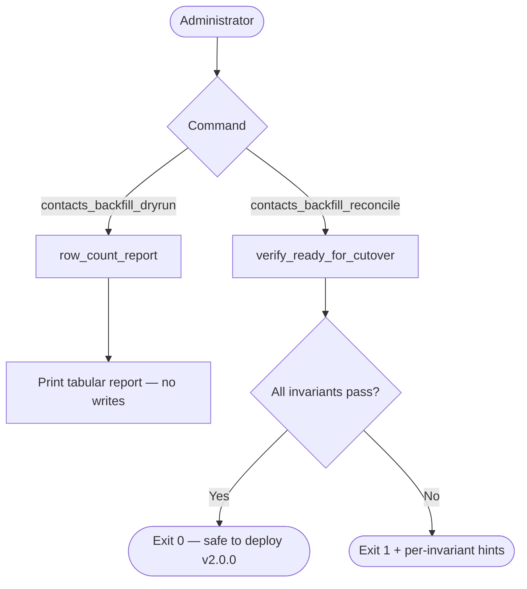

### Migration Verification Notes and References

- Implementation: `koalixcrm/contacts/backfill.py`,
  `koalixcrm/contacts/backfill_verify.py`,
  `koalixcrm/contacts/management/commands/contacts_backfill_dryrun.py`,
  `koalixcrm/contacts/management/commands/contacts_backfill_reconcile.py`.
- The same `verify_ready_for_cutover` logic is also executed inside migration
  `contacts.0006_verify_ready_for_cutover` to block an unsafe deployment at the
  migration layer.
- These commands are one-time operational tools for the v1.14.0 → v2.0.0 upgrade;
  they are not part of the regular CRM operational workflow.
- See `docs/migration-v1.14.0-to-v2.0.0.md` for the full upgrade procedure.
